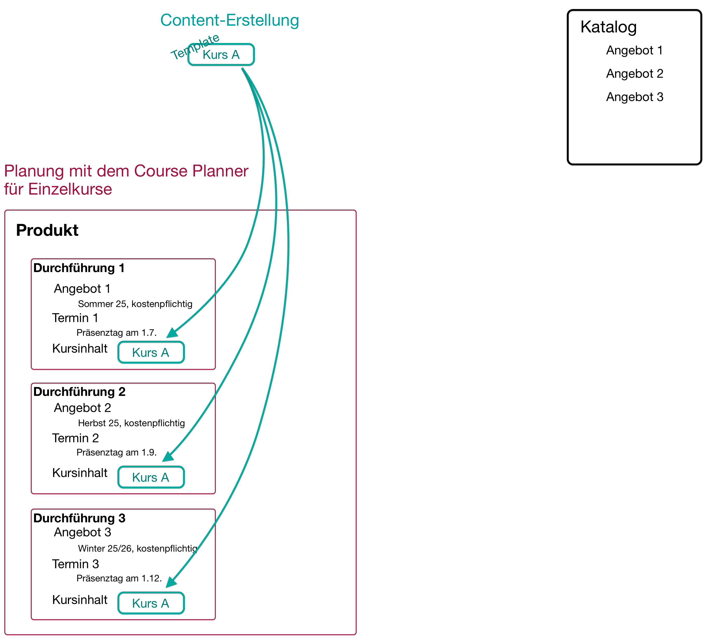
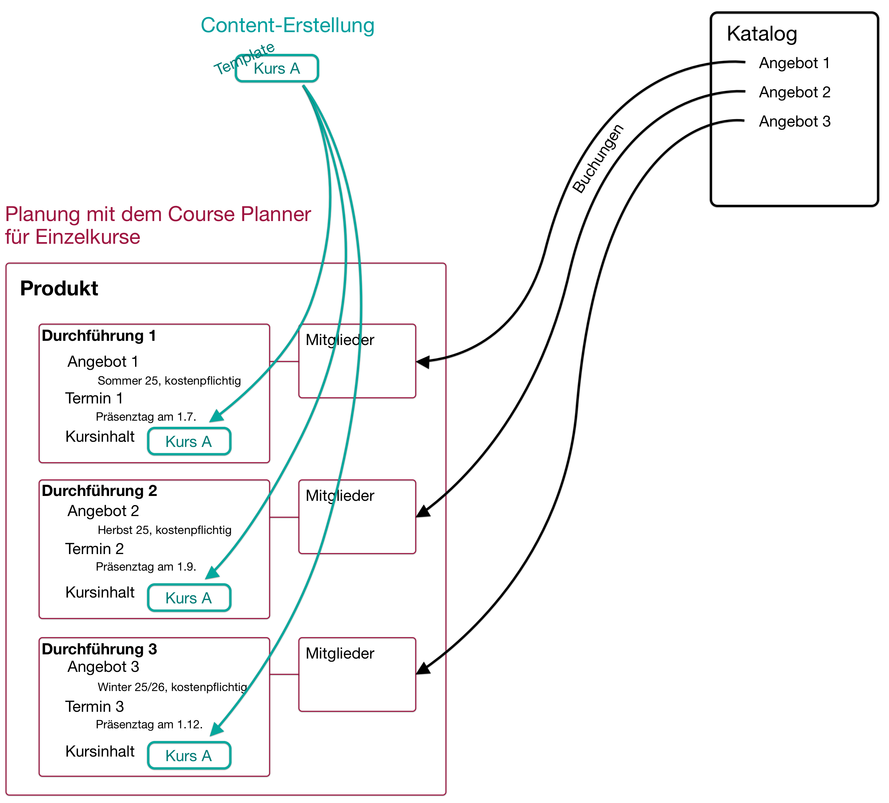
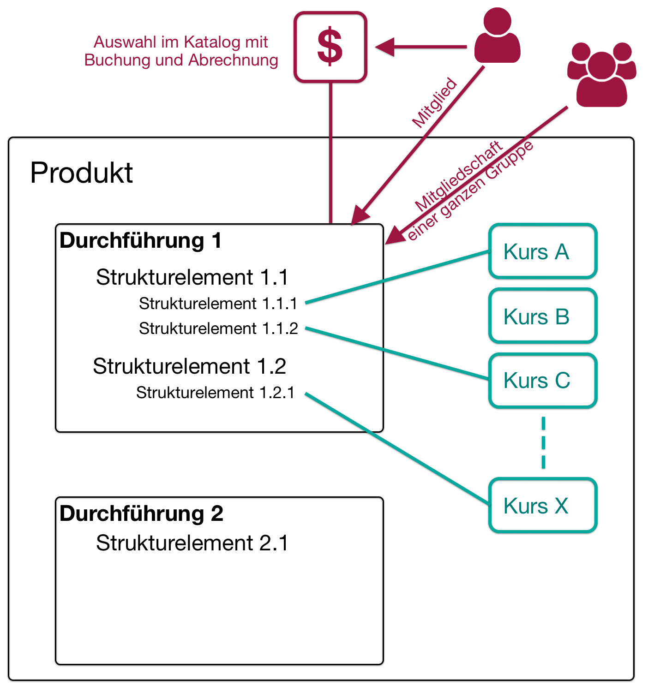
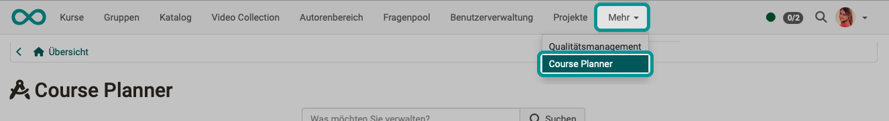
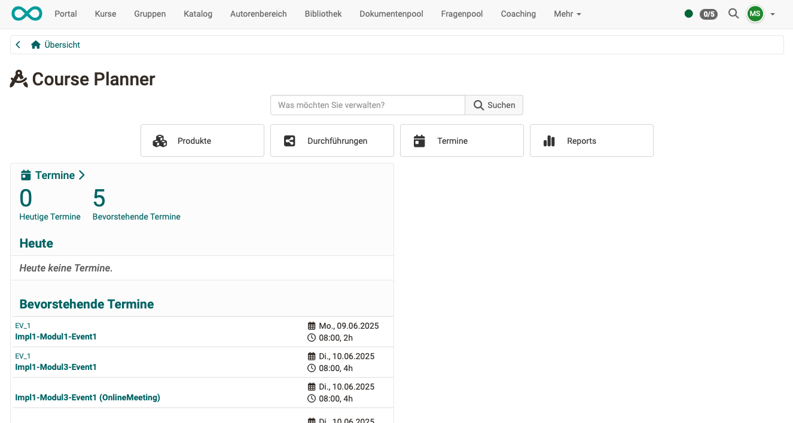
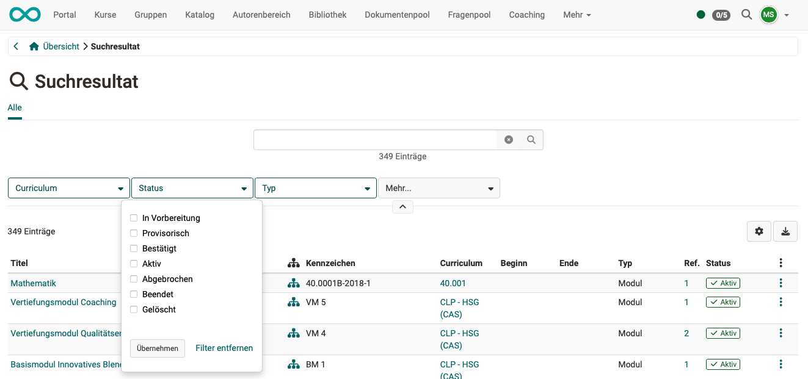

# Course Planner: Übersicht {: #course_planner}

!!! info "Hinweis"

    Ab Release 20 verfügt OpenOlat über das eigenständige Zusatzmodul "Course Planner". Es ist eine Weiterentwicklung des Curriculums in früheren Versionen. OpenOlat kann aber auch weiterhin als klassisches LMS ohne dieses Modul genutzt werden.

## Wozu dient der Course Planner? {: #purpose}

Der Course Planner ist ein Modul für das **Kursmanagement**. Ziel ist es, automatisiert und effizient vom Angebot ausgehend Kurse zu erstellen und durchzuführen.

Mit dem Course Planner kann die **Planungsarbeit** von der **Inhaltserstellung** (im Autorenbereich) getrennt werden.

Sie können natürlich auch ohne Course Planner OpenOlat-Kurse erstellen. Mit dem Course Planner steht Ihnen jedoch ein Werkzeug zur Verfügung, das die organisatorischen Aufgaben zusammenführt.

| ohne Course Planner              | mit Course Planner                                        |
| -------------------------------- | --------------------------------------------------------- |
| nur eigenständige einzelne Kurse | einzelne oder mehrere Kurse mit mehreren Durchführungen   |
| alles wird einzeln in den  Kursen administriert und verwaltet | zentrale Administration |
| x                                | funktionale Trennung zwischen Administration und Inhalt   |
| x                                | zentrale Planung mehrerer Kurse                           |
| x                                | zentrale Mitgliederverwaltung mehrerer Kurse              |
| x                                | zentrale Ausschreibung mehrerer Kurse                     |
| x                                | zentrale Steuerung und Verwaltung mehrerer Kurse          |

Mit dem Course Planner gemanaged werden können

* Einzelkurse
* Course Bundles
* strukturierte Bildungsgänge/Produkte

[Zum Seitenanfang ^](#course_planner)

---

## Planungsaufgaben {: #planning}

Die Planungsaufgaben umfassen:

- verschiedene Angebotstypen erstellen (z.B. kostenpflichtig / nicht kostenpflichtig)
- mehrere Kursdurchführungen mit jeweils eigenem Zeitfenster planen
- Angebote im Katalog platzieren
- Platzkontingente in den Kursen definieren
- automatische Kurserstellung aus Template vorbereiten
- automatisierte Statusänderungen im Kurs einrichten

[Zum Seitenanfang ^](#course_planner)

---

## Planung für Einzelkurse {: #planning_single_courses}

Mit dem Course Planner können für einen Kurs mehrere Durchführungen erstellt und im Katalog angeboten werden.

Diese administrative Planungsarbeit kann von einem/einer Kursplaner:in auch schon gemacht werden, wenn der Kurs noch nicht erstellt wurde oder noch nicht in endgültiger Version vorliegt.

{ class="shadow lightbox" } 

Unabhängig von diesen administrativen Aufgaben (durchgeführt von einem/einer Kursplaner:in) kann ein Kurs von Autor:innen als Template erstellt und dann in alle Durchführungen eingebunden werden. 

Die Instanzierung der Kurse kann auch automatisch auf einen bestimmbaren Termin vorgenommen werden.

{ class="shadow lightbox" } 

Die Mitglieder können z.B. direkt durch Selbstbuchung eines Angebots im Katalog zu den einzelnen Durchführungen hinzugefügt werden.

!!! info "Beachten Sie:"

    Kursmitglied im Template-Kurs sind dann lediglich noch die Kurs-Besitzer:innen mit Autor:innen-Rolle.

{ class="shadow lightbox" } 

[Zum Seitenanfang ^](#course_planner)

---

## Planung für Course Bundles {: #planning_course_bundles}

So wie für einen Einzelkurs mehrere Durchführungen erstellt werden können, können auch für ein ganzes Kurspaket (Course Bundle) Durchführungen erstellt und im Katalog angeboten werden.

Wenn gewünscht, kann in den einzelnen Durchführungen die Zusammenstellung der Kurse/Lernressourcen auch modifiziert werden und abweichend von der Standarddurchführung ("Kopiervorlage") zusammengesetzt sein.

{ class="shadow lightbox" } 

[Zum Seitenanfang ^](#course_planner)

---

## Planung für strukturierte Bildungsgänge {: #planning_structured_product}

Strukturierte Produkte/Bildungsgänge weisen gegenüber Course Bundles zusätzlich eine 
Gliederung in Baumstruktur auf. Sie enthalten Strukturelemente. 

Auch wenn Teilnehmer:innen ein Bildungsprodukt absolvieren sollen, werden sie zu Mitgliedern einer bestimmten Durchführung gemacht. (Nicht zu Mitgliedern einzelner Kurse oder zu Mitgliedern der Bildungsprodukt-Vorlage.) 

{ class="shadow lightbox" }  

Ausserdem kann auch eine Abrechnung für die Durchführung eingerichtet werden.

{ class="shadow lightbox" }  

[Zum Seitenanfang ^](#course_planner)

---

## Wer kann den Course Planner nutzen? {: #users}

Nach der Aktivierung des Course Planners durch einen/eine Systemadministrator:in steht er allen Benutzer:innen mit der **Rolle "Kursplaner:in"** zur Verfügung. (Bei Verwendung von Organisationseinheiten, kann die Rolle Kursplaner:innen auch auf bestimmte Organisationseinheiten beschränkt sein.) 

**Administrator:innen** und **Principals** haben ebenfalls Zugriff. (Auch diese Rollen sind evtl. auf Organisationseinheiten beschränkt.)

Begrenzt auf ein bestimmtes Produkt können die **Produktbesitzer:innen** und **Elementbesitzer:innen** im Rahmen ihres Zuständigkeitsbereichs zugreifen.

Autor:innen und Lernressourcenverwalter:innen haben keinen Zugriff auf den Course Planner. Ihre Rolle, Rechte und Aufgaben fokussieren auf die Content-Erstellung, weniger auf die Planung, Terminierung und Administration von Kursen und Durchführungen.

[Zum Seitenanfang ^](#course_planner)

---

##  Wo finde ich den Course Planner? {: #access}

Wenn Sie die Rolle und Rechte eines/einer **Kursplaner:in** besitzen, finden Sie den Course Planner als **Menüpunkt der Hauptnavigation** in der Kopfzeile.  

{ class="shadow lightbox" }  

!!! info "Voraussetzung"

    Um den Course Planner verwenden zu können, muss er von einem/einer Systemadministrator:in aktiviert worden sein. Steht die Option nicht im Menü der Kopfzeile zur Verfügung, wenden Sie sich bitte an Ihren/Ihre Systemadministrator:in.

[Zum Seitenanfang ^](#course_planner)

---

##  Die Übersichtsseite {: #overview}

Die Übersicht zeigt 

- die nächsten anstehenden Termine,
- die Buttons zum Zugriff auf die nachstehend beschriebenen Bereiche/Funktionen,
- sowie die Suche.

{ class="shadow lightbox" }  

Mit Eingabe eines Begriffes im Suchfeld kann nach **Durchführungen, Kursen und Terminen** gesucht werden. 
Wie auch bei anderen Suchen, kann mit Filtern das Suchergebnis eingegrenzt werden.

{ class="shadow lightbox" }  

[Zum Seitenanfang ^](#course_planner)

---

### Produkte {: #products}

Ein Bildungsprodukt ist ein nach innen oder aussen gerichtetes Lernangebot mit Durchführungen. Meistens sind es mehrfache Durchführungen, also von Lernangeboten der gleichen "Art" (-> Produkt). Der Course Planner vereinfacht die Arbeit wesentlich durch die gemeinsame zentrale Verwaltung.

Oft bestehen Curricula/Produkte aus mehreren Kursen und haben eine bestimmte Struktur/Abfolge, in der die enthaltenen Kurse kombiniert sind.

{ class="shadow lightbox" }

[Zu den Details >](../area_modules/Course_Planner_Products.de.md) 
[Zum Seitenanfang ^](#course_planner)

---

### Durchführungen {: #implementations}

Ein (Bildungs-)Produkt kann mehrfach angeboten und durchgeführt werden. Z.B. kann sich jedes Semester sowohl ein einzelner Kurs wiederholen, als auch ein strukturierter Bildungsgang bestehend aus mehreren Kursen.

{ class="shadow lightbox" }

[Zu den Details >](../area_modules/Course_Planner_Implementations.de.md) 
[Zum Seitenanfang ^](#course_planner)

---

### Termine {: #events}

Die hier bestimmten Termine beziehen sich auf eine Durchführung oder eines Teilbereiches daraus. 

{ class="shadow lightbox" }

[Zu den Details >](../area_modules/Course_Planner_Events.de.md) 
[Zum Seitenanfang ^](#course_planner)

---

### Reports {: #reports}

Anhand von Report-Vorlagen können verschiedene Reports erzeugt werden.

{ class="shadow lightbox" }

[Zu den Details >](../area_modules/Course_Planner_Reports.de.md) 
[Zum Seitenanfang ^](#course_planner)

---

## Weitere Informationen {: #further information}

[Wie erstelle ich meinen ersten OpenOlat-Kurs? >](../../manual_how-to/my_first_course/my_first_course.de.md) 
[Wie kann ich mit dem Course Planner Kursdurchführungen planen und durchführen? >](../../manual_how-to/course_planner_courses/course_planner_courses.de.md) 
[Wie kann ich mit dem Course Planner einen Bildungsgang planen und durchführen? >](../../manual_how-to/course_planner_curriculum/course_planner_curriculum.de.md) 
[Course Planner aktivieren (Admin) >](../../manual_admin/administration/Modules_Course_Planner.de.md) 

[Zum Seitenanfang ^](#course_planner)
