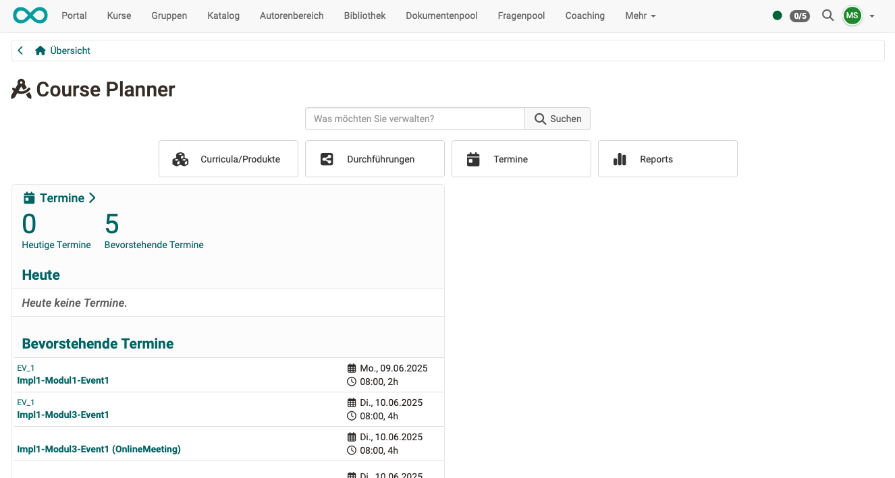

# Course Planner: Übersicht {: #course_planner}

!!! warning "Achtung"

    Dieser Artikel ist noch in Bearbeitung.

Ab Release 20 verfügt OpenOlat über das eigenständige Zusatzmodul Course Planner.
OpenOlat kann aber auch weiterhin als klassisches LMS ohne dieses Modul genutzt werden.

## Wozu dient der Course Planner? {: #purpose}

Der Course Planner ist ein Modul für das **Kursmanagement**. Ziel ist es, automatisiert und effizient vom Angebot ausgehend Kurse zu erstellen und durchzuführen.

Mit dem Course Planner kann die **Planungsarbeit** von der **Inhaltserstellung** (im Autorenbereich) getrennt werden.

Sie können natürlich auch ohne Course Planner OpenOlat-Kurse erstellen. Mit dem Course Planner steht Ihnen jedoch ein Werkzeug zur Verfügung, das die organisatorischen Aufgaben zusammenführt.

?? Die Planungsaufgaben betreffen

- externen Katalog
- Buchungsfunktionen 
- Preisangaben
- Zeitfenster für die Kursdurchführung
- Platzkontingente in den Kursen
- automatische Kurserstellung

## Wer kann den Course Planner nutzen? {: #users}

Nach der Aktivierung des Course Planners durch einen/eine Administrator:in steht er allen Autor:innen, Lernressourcenverwalter:innen und administrativen Rollen zur Verfügung.

[Zum Seitenanfang ^](#course_planner)

---

##  Wo finde ich den Course Planner? {: #access}

Wenn Sie Autorenrechte besitzen, finden Sie den Course Planner als **Menüpunkt der Hauptnavigation** in der Kopfzeile.  

{ class="shadow lightbox" }  

!!! info "Voraussetzung"

    Um den Course Planner verwenden zu können, muss er von einem/einer Administrator:in aktiviert worden sein. Steht die Option nicht im Menü der Kopfzeile zur Verfügung, wenden Sie sich bitte an Ihren/Ihre Administrator:in.

[Zum Seitenanfang ^](#course_planner)

---

##  Die Übersichtsseite {: #overview}

**Was wird auf der Übersichtsseite angezeigt?**

Die Übersicht zeigt ...

{ class="shadow lightbox" }  

**Die Suche**

Mit Eingabe eines Begriffes im Suchfeld kann gesucht werden nach

* ...
* ...

[Zum Seitenanfang ^](#course_planner)

---

### Curricula/Produkte {: #products}

tbd

[Zu den Details >](../area_modules/Course_Planner_Products.de.md) 
[Zum Seitenanfang ^](#course_planner)

[Zum Seitenanfang ^](#course_planner)

---

### Durchführungen {: #implementations}

tbd

[Zu den Details >](../area_modules/Course_Planner_Implementations.de.md) 
[Zum Seitenanfang ^](#course_planner)

[Zum Seitenanfang ^](#course_planner)

---

### Termine {: #events}

tbd

[Zu den Details >](../area_modules/Course_Planner_Events.de.md) 
[Zum Seitenanfang ^](#course_planner)

[Zum Seitenanfang ^](#course_planner)

---

### Reports {: #reports}

tbd

[Zu den Details >](../area_modules/Course_Planner_Reports.de.md) 
[Zum Seitenanfang ^](#course_planner)

---

## Weitere Informationen {: #further information}

[Wie erstelle ich meinen ersten OpenOlat-Kurs? >](../../manual_how-to/my_first_course/my_first_course.de.md) 
[Wie kann ich mit dem Course Planner Kursdurchführungen planen und durchführen? >](../../manual_how-to/course_planner_courses/course_planner_courses.de.md) 

[Zum Seitenanfang ^](#course_planner)
