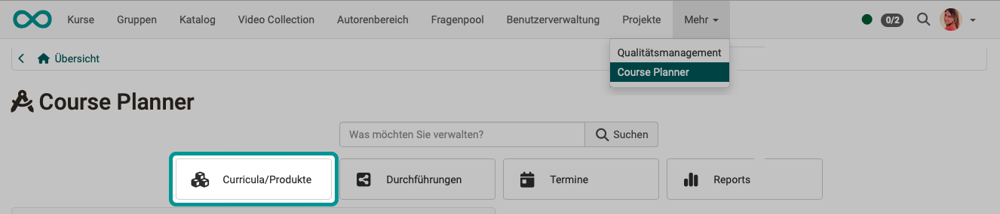
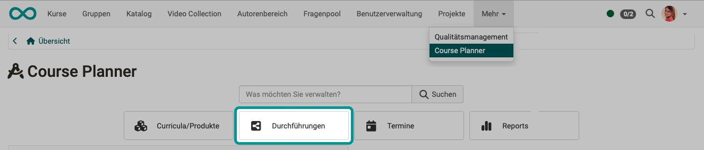

# Course Planner: Übersicht {: #course_planner}

Ab Release 20 verfügt OpenOlat über das eigenständige Zusatzmodul "Course Planner".
OpenOlat kann aber auch weiterhin als klassisches LMS ohne dieses Modul genutzt werden.

## Wozu dient der Course Planner? {: #purpose}

Der Course Planner ist ein Modul für das **Kursmanagement**. Ziel ist es, automatisiert und effizient vom Angebot ausgehend Kurse zu erstellen und durchzuführen.

Mit dem Course Planner kann die **Planungsarbeit** von der **Inhaltserstellung** (im Autorenbereich) getrennt werden.

Sie können natürlich auch ohne Course Planner OpenOlat-Kurse erstellen. Mit dem Course Planner steht Ihnen jedoch ein Werkzeug zur Verfügung, das die organisatorischen Aufgaben zusammenführt.

[Zum Seitenanfang ^](#course_planner)

---

## Wie funktioniert der Course Planner? {: #functional_relationships}

Die Planungsaufgaben betreffen

- Katalog
- Buchungsfunktionen 
- Preisangaben
- Zeitfenster für die Kursdurchführung
- Platzkontingente in den Kursen
- automatische Kurserstellung

Dabei bestehen folgende grundsätzliche Zusammenhänge: 

{ class="shadow lightbox" }  

Wenn Teilnehmer:innen ein ganzes Curriculum absolvieren sollen, werden sie zu Mitgliedern einer bestimmten Curriculum-Durchführung gemacht (nicht zu Mitgliedern einzelner Kurse oder einem Curriculum). Ausserdem kann auch eine Abrechnung für die Durchführung eingerichtet werden.

{ class="shadow lightbox" }  

[Zum Seitenanfang ^](#course_planner)

---

## Wer kann den Course Planner nutzen? {: #users}

Nach der Aktivierung des Course Planners durch einen/eine Administrator:in steht er allen Autor:innen, Lernressourcenverwalter:innen und administrativen Rollen zur Verfügung.

[Zum Seitenanfang ^](#course_planner)

---

##  Wo finde ich den Course Planner? {: #access}

Wenn Sie Autorenrechte besitzen, finden Sie den Course Planner als **Menüpunkt der Hauptnavigation** in der Kopfzeile.  

{ class="shadow lightbox" }  

!!! info "Voraussetzung"

    Um den Course Planner verwenden zu können, muss er von einem/einer Administrator:in aktiviert worden sein. Steht die Option nicht im Menü der Kopfzeile zur Verfügung, wenden Sie sich bitte an Ihren/Ihre Administrator:in.

[Zum Seitenanfang ^](#course_planner)

---

##  Die Übersichtsseite {: #overview}

Die Übersicht zeigt 

- die nächsten anstehenden Termine,
- die Buttons zum Zugriff auf die nachstehend beschriebenen Bereiche/Funktionen,
- sowie die Suche.

{ class="shadow lightbox" }  

Mit Eingabe eines Begriffes im Suchfeld kann nach **Curriculumelementen** gesucht werden. 
Wie auch bei anderen Suchen, kann mit Filtern das Suchergebnis eingegrenzt werden.

{ class="shadow lightbox" }  

[Zum Seitenanfang ^](#course_planner)

---

### Curricula/Produkte {: #curricula}

Curricula/Produkte bestehen aus mehreren Kursen und haben eine bestimmte Struktur/Abfolge, in der die enthaltenen Kurse kombiniert sind.

{ class="shadow lightbox" }

[Zu den Details >](../area_modules/Course_Planner_Products.de.md) 
[Zum Seitenanfang ^](#course_planner)

---

### Durchführungen {: #implementations}

Ein Curriculum kann mehrfach durchgeführt werden. Z.B. kann sich jedes Semester der Ablauf eines Curriculums wiederholen.

{ class="shadow lightbox" }

[Zu den Details >](../area_modules/Course_Planner_Implementations.de.md) 
[Zum Seitenanfang ^](#course_planner)

---

### Termine {: #events}

Die hier bestimmten Termine beziehen sich auf die Durchführung eines Curriculums oder eines Teilbereiches daraus. 

{ class="shadow lightbox" }

[Zu den Details >](../area_modules/Course_Planner_Events.de.md) 
[Zum Seitenanfang ^](#course_planner)

---

### Reports {: #reports}

Anhand von Report-Vorlagen können verschiedene Reports erzeugt werden.

{ class="shadow lightbox" }

[Zu den Details >](../area_modules/Course_Planner_Reports.de.md) 
[Zum Seitenanfang ^](#course_planner)

---

## Weitere Informationen {: #further information}

[Wie erstelle ich meinen ersten OpenOlat-Kurs? >](../../manual_how-to/my_first_course/my_first_course.de.md) 
[Wie kann ich mit dem Course Planner Kursdurchführungen planen und durchführen? >](../../manual_how-to/course_planner_courses/course_planner_courses.de.md) 
[Wie kann ich mit dem Course Planner einen Bildungsgang / ein Curriculum planen und durchführen? >](../course_planner_curriculum/course_planner_curriculum.de.md) 
[Course Planner aktivieren (Admin) >](../../manual_admin/administration/Modules_Course_Planner.de.md) 

[Zum Seitenanfang ^](#course_planner)
