# Course Planner: Overview [:octicons-tag-16:{ title="from Release 20.0.0 (OO-8128)" }](https://track.frentix.com/issue/OO-8128){:target="_blank"} {: #course_planner}

## What's the purpose of the Course Planner? {: #purpose}

The Course Planner is a module for **course management**. The aim is to create and run courses automatically and efficiently from the quotation.

With the Course Planner, the **planning work** can be separated from the **content creation** (in the author area).

Of course, you can also create OpenOlat courses without Course Planner. However, the Course Planner provides you with a tool that consolidates the organizational tasks.

| without Course Planner              | with Course Planner                                        |
| -------------------------------- | --------------------------------------------------------- |
| only independent individual courses | Single or multiple courses with several sessions   |
| everything is administered and managed individually in the courses | central administration |
| x                                | Functional separation between administration and content   |
| x                                | Central planning of several courses                          |
| x                                | Central member administration of several courses              |
| x                                | Central tendering of several courses                    |
| x                                | Central control and management of multiple courses          |

The Course Planner can be used to manage

* single courses
* course bundles
* structured educational programs/products

[To the top of the page ^](#course_planner)

---

## Planning tasks {: #planning}

The planning tasks include:

- Create different offer types (e.g. chargeable / not chargeable)
- Plan several courses, each with its own time slot
- Place offers in the catalog
- Define space quotas in the courses
- Prepare automatic course creation from template
- Set up automated status changes in the course

[To the top of the page ^](#course_planner)

---

## Planning single courses {: #planning_single_courses}

The Course Planner can be used to create several courses for a course and offer them in the catalog.

This administrative planning work can be done by a course planner even if the course has not yet been created or is not yet available in its final version.

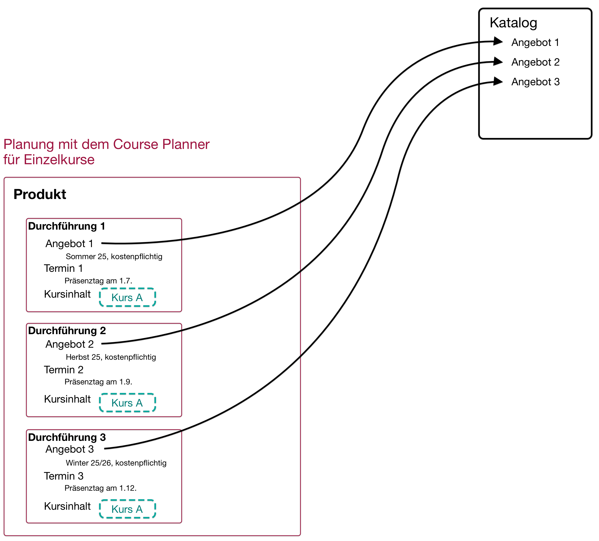{ class="shadow lightbox" } 

Independently of these administrative tasks (carried out by a course planner), a course can be created by authors as a template and then integrated into all courses.

The courses can also be instantiated automatically on a definable date.

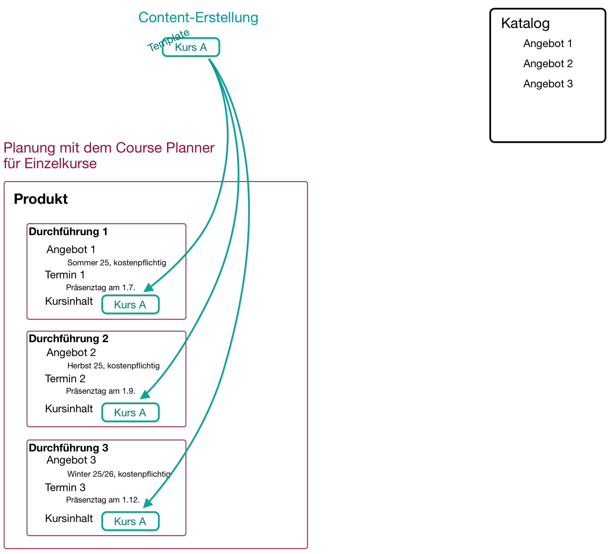{ class="shadow lightbox" } 

For example, members can be added directly to the individual tours by booking an offer themselves in the catalog.

!!! info "Please note:"

    Course members in the template course are then only the course owners with the author role.

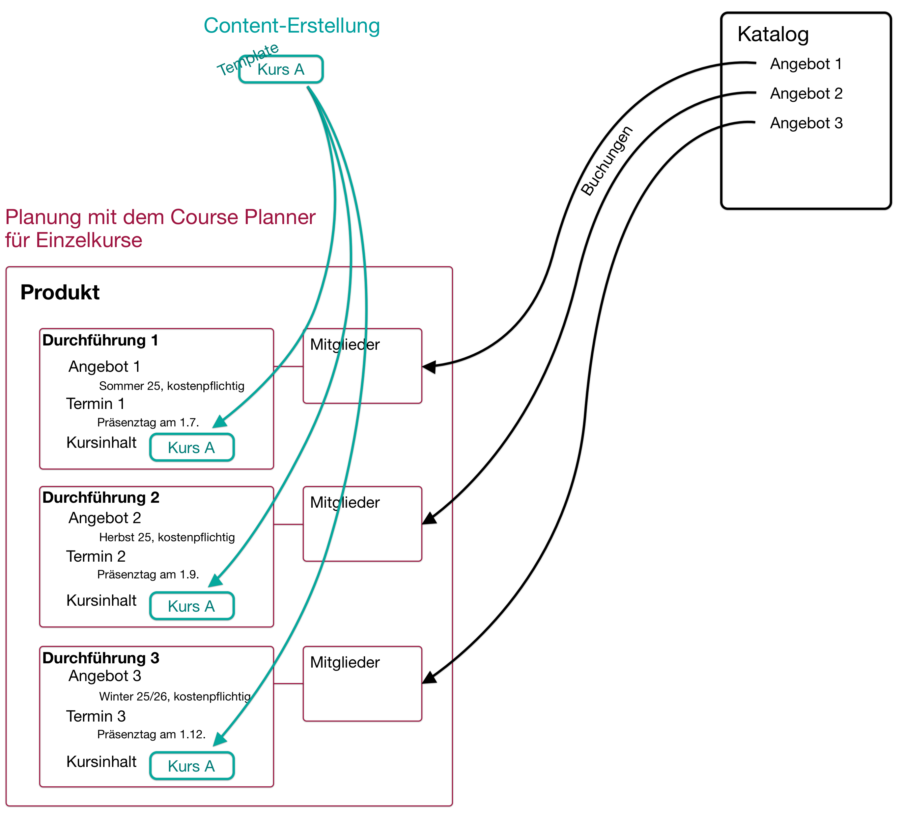{ class="shadow lightbox" } 

[To the top of the page ^](#course_planner)

---

## Planning for course bundles  {: #planning_course_bundles}

Just as multiple instances can be created for an individual course, instances can also be created for an entire course bundle and offered in the catalog.

If desired, the combination of courses/learning resources can also be modified in the individual implementations and deviate from the standard implementation ("copy template").

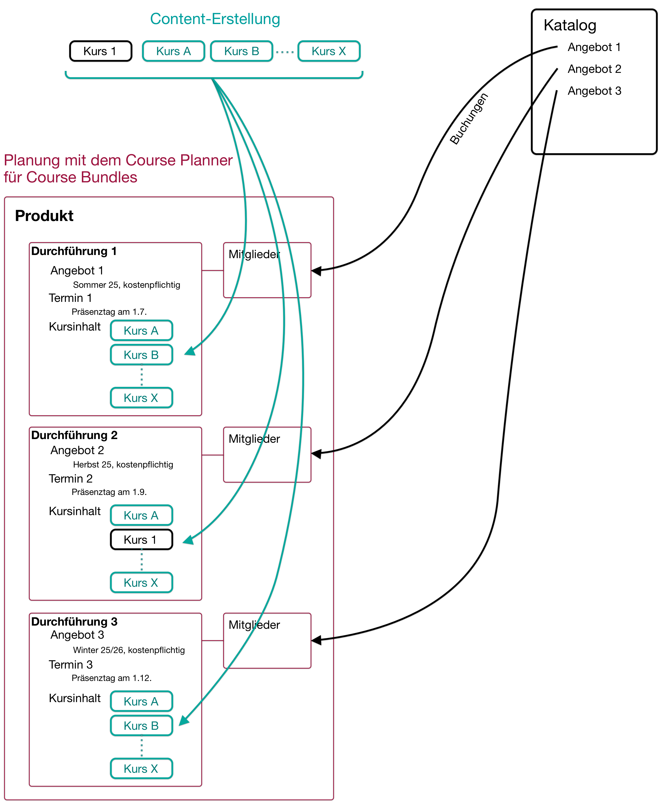{ class="shadow lightbox" } 

[To the top of the page ^](#course_planner)

---

## Planning for structured educational programs {: #planning_structured_product}

Structured products/educational programs have an additional tree structure compared to course bundles. They contain structural elements. 

Even if participants are to complete an educational product consisting of several courses, they are made members of a specific implementation. (Not members of individual courses or members of the educational product template).

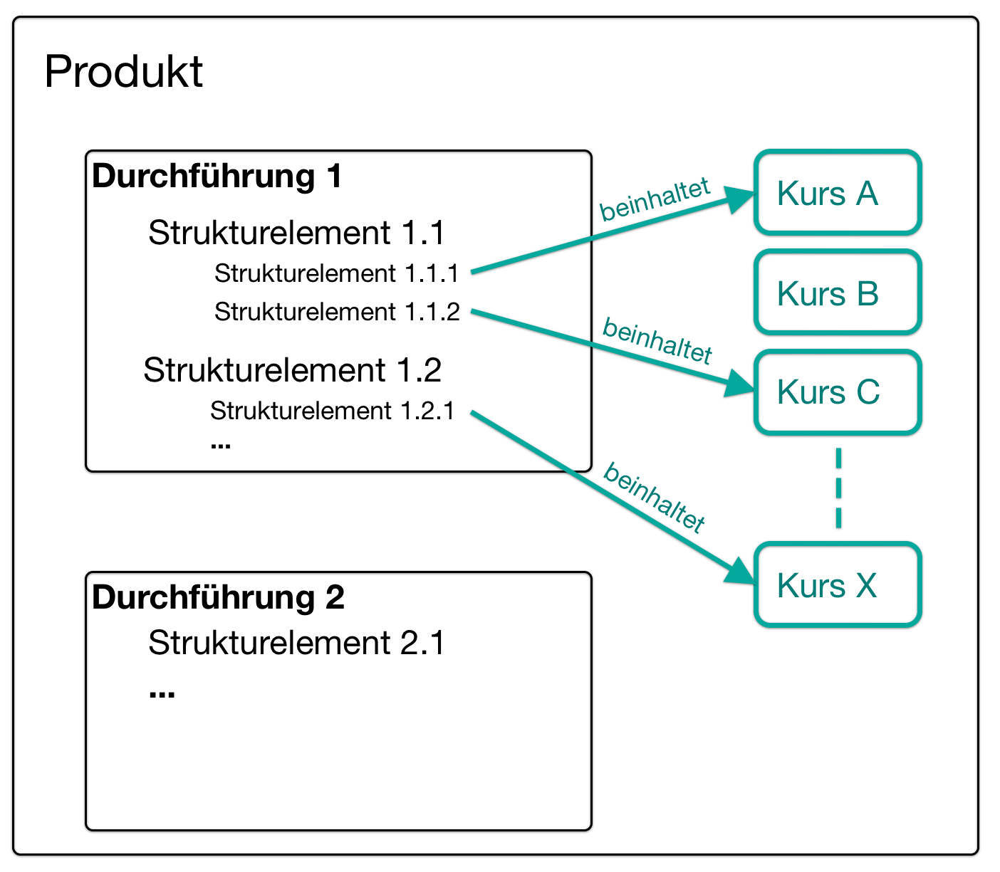{ class="shadow lightbox" } 

In addition, a billing system can also be set up for the implementation.

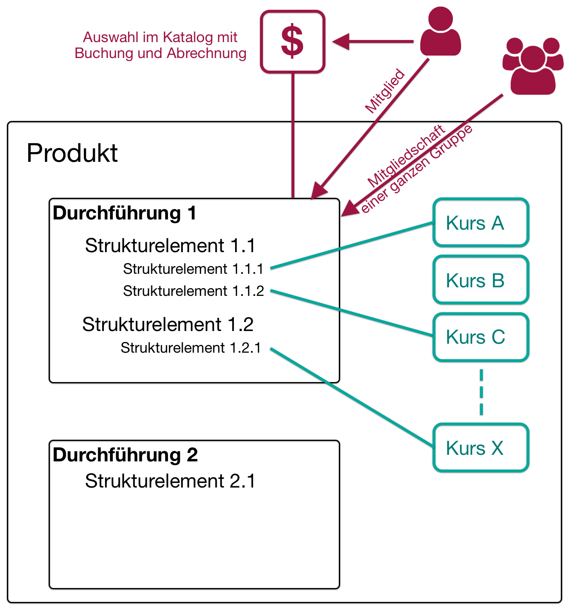{ class="shadow lightbox" }  

[To the top of the page ^](#course_planner)

---

## Who can use the Course Planner? [:octicons-tag-16:{ title="from Release 20.3.0 (OO-8916)" }](https://track.frentix.com/issue/OO-8916){:target="_blank"} {: #users}

After activation of the Course Planner by a system administrator, it is available to all users with the **role "Course Planner"**. (When using organisational units, the role course planner may also be restricted to certain organisational units.) 

**Administrators** and **principals** also have access. (These roles may also be restricted to organisational units.)

**Principals** have exclusively read access to the entire Course Planner: actions such as **Change status**, **Remove** or **Instantiate** are not available to them. If a principal opens a course directly from the Course Planner, the same read-only restriction also applies to the course view.

!!! info "Note on the restriction as principal"
    The read restriction is active whenever the principal only holds this role. There can be overlaps if a user has several roles in a product, for example. In that case, this user can become active wherever the role permits, for example in a to-do assigned to "them".

Limited to a specific product, **product owners** and **element owners** can access it within their area of responsibility.

!!! info "Other OpenOlat roles"
    Authors and learning resource administrators do not have access to the Course Planner. Their role, rights and responsibilities focus on content creation rather than on the planning, scheduling and administration of courses and implementations.

[To the top of the page ^](#course_planner)

---

## Where can I find the Course Planner? {: #access}

If you have the role and rights of a **course planner**, you will find the Course Planner as a **menu item in the main navigation** in the header.

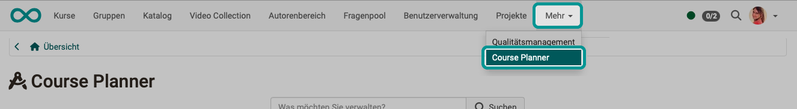{ class="shadow lightbox" }  

!!! tip "Requirement"

    In order to use the Course Planner, it must be activated by a system administrator. If the option is not available in the header menu, please contact your system administrator or the support of your OpenOlat instance.

[To the top of the page ^](#course_planner)

---

### Dashboard [:octicons-tag-16:{ title="from Release 20.3.0 (OO-9173)" }](https://track.frentix.com/issue/OO-9173){:target="_blank"} {: #dashboard_teaser}

When you open the Course Planner, you are taken to the overview page with the access buttons, the search, and an area with configurable widgets (implementations, events, members).

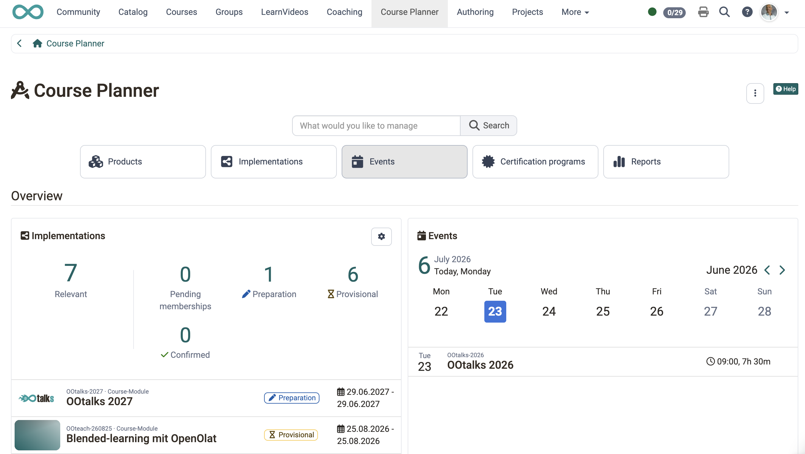{ class="shadow lightbox" }

[See the details >](../area_modules/Course_Planner_Dashboard.md) 
[To the top of the page ^](#course_planner)

---

### Products [:octicons-tag-16:{ title="from Release 20.0.0 (OO-8128)" }](https://track.frentix.com/issue/OO-8128){:target="_blank"} {: #products}

An educational product is an inwardly or outwardly directed learning offer with implementations. In most cases, these are multiple courses, i.e. learning opportunities of the same "type" (-> product). The Course Planner simplifies the work considerably through the shared central administration.

Curricula/products often consist of several courses and have a certain structure/sequence in which the included courses are combined.

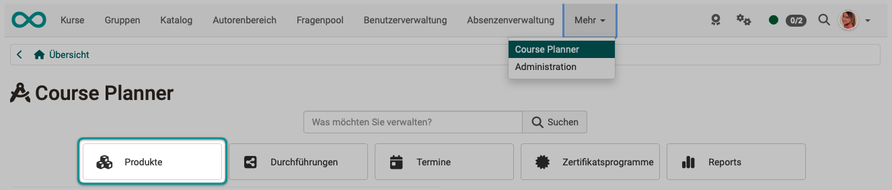{ class="shadow lightbox" }

[See the details >](../area_modules/Course_Planner_Products.md) 
[To the top of the page ^](#course_planner)

---

### Implementations {: #implementations}

An (educational) product can be offered and implemented several times. For example, a single course can be repeated each semester, as can a structured educational program consisting of several courses.

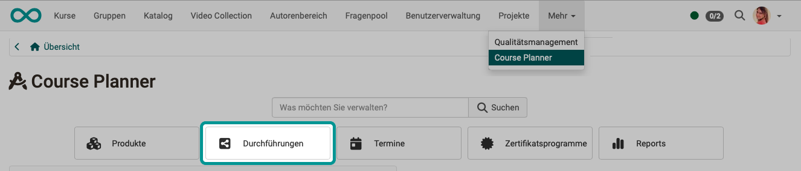{ class="shadow lightbox" }

[See the details >](../area_modules/Course_Planner_Implementations.md) 
[To the top of the page ^](#course_planner)

---

### Events {: #events}

The dates specified here refer to one implementation or a part thereof.

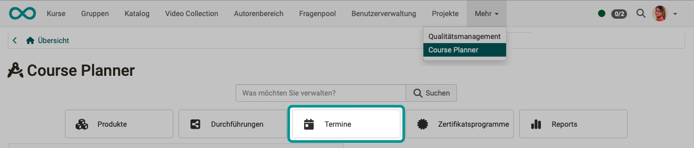{ class="shadow lightbox" }

[See the details >](../area_modules/Course_Planner_Events.md) 
[To the top of the page ^](#course_planner)

---

### Certification programs [:octicons-tag-16:{ title="from Release 20.2.0 (OO-8559)" }](https://track.frentix.com/issue/OO-8559){:target="_blank"} {: #certificate_programs}

Certificate programs are used when a certificate is only awarded after completing several courses. 

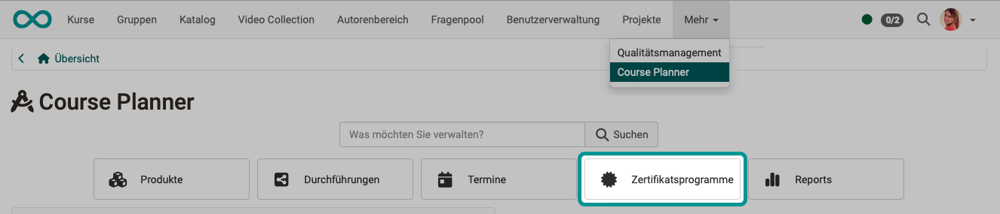{ class="shadow lightbox" }

[See the details >](../area_modules/Course_Planner_Certification_Programs.md) 
[To the top of the page ^](#course_planner)

---

### Reports {: #reports}

Various reports can be generated using report templates.

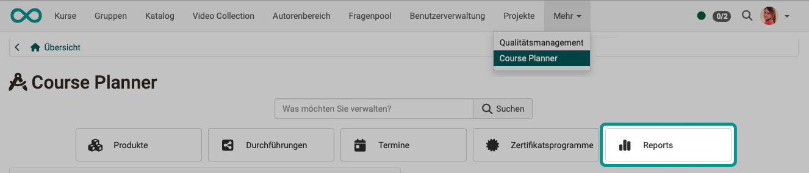{ class="shadow lightbox" }

[See the details >](../area_modules/Course_Planner_Reports.md) 
[To the top of the page ^](#course_planner)

---

### To-dos [:octicons-tag-16:{ title="from Release 21.0 (OO-9417)" }](https://track.frentix.com/issue/OO-9417){:target="_blank"} {: #todos_teaser}

To-dos can be recorded in the Course Planner at various levels: in the overview, on the product, on the implementation and on each individual element. A central overview brings together all to-dos across all products. The to-do widget on the dashboard shows open and overdue tasks at a glance.

[See the details >](../area_modules/Course_Planner_Todos.md) 
[To the top of the page ^](#course_planner)

---

### Room management [:octicons-tag-16:{ title="from Release 21.0 (OO-9570)" }](https://track.frentix.com/issue/OO-9570){:target="_blank"} {: #rooms_teaser}

Under "Tools", Course Planner users find the "Room management" area with a read-only overview of the room scheduling and the rooms they can access through their organisational affiliation. Rooms and buildings themselves are maintained in the module "Rooms" in the administration. Deleted rooms only appear in the administration.

[Manage rooms (administration) >](../../manual_admin/administration/Modules_Rooms.md) 
[To the top of the page ^](#course_planner)

---

## Further information {: #further information}

[How do I create my first OpenOlat course? >](../../manual_how-to/my_first_course/my_first_course.md) 
[How can I plan and carry out implementations with the Course Planner? >](../../manual_how-to/course_planner_courses/course_planner_courses.md) 
[How can I plan and run a course with the Course Planner? >](../../manual_how-to/course_planner_curriculum/course_planner_curriculum.md) 
[Activate Course Planner (Admin) >](../../manual_admin/administration/Modules_Course_Planner.md) 

[To the top of the page ^](#course_planner)