# Course Planner: Overview [:octicons-tag-16:{ title="from Release 20.0 (OO-7834)" }](https://track.frentix.com/issue/OO-7834){:target="_blank"} {: #course_planner}

## Dashboard [:octicons-tag-16:{ title="from Release 20.3.0 (OO-9173)" }](https://track.frentix.com/issue/OO-9173){:target="_blank"} {: #dashboard_teaser}

When you open the Course Planner, you are taken to the overview page with the access buttons, the search, and an area with configurable widgets (implementations, events, members).

The access buttons are divided into the three areas **Products**, **Productivity** and **Tools** [:octicons-tag-16:{ title="from Release 21.0 (OO-9418)" }](https://track.frentix.com/issue/OO-9418){:target="_blank"}. The section [Where can I find the Course Planner?](#access) describes them in this order.

{ class="shadow lightbox" }

[See the details >](../area_modules/Course_Planner_Dashboard.md)

---

## What's the purpose of the Course Planner? {: #purpose}

The Course Planner is a module for **course management**. The aim is to create and run courses automatically and efficiently, starting from the offer.

With the Course Planner, the **planning work** can be separated from the **content creation** (in the author area).

Of course, you can also create OpenOlat courses without Course Planner. However, the Course Planner provides you with a tool that consolidates the organizational tasks.

| without Course Planner              | with Course Planner                                        |
| -------------------------------- | --------------------------------------------------------- |
| only independent single courses | single or multiple courses with several implementations   |
| everything is administered and managed individually in the courses | central administration |
| x                                | Functional separation between administration and content   |
| x                                | Central planning of several courses                          |
| x                                | Central member administration of several courses              |
| x                                | Central tendering of several courses                    |
| x                                | Central control and management of multiple courses          |

The Course Planner can be used to manage

* single courses
* course bundles
* structured educational programs/products

[To the top of the page ^](#course_planner)

---

## Planning tasks {: #planning}

The planning tasks include:

- Create different offer types (e.g. chargeable / not chargeable)
- Plan several implementations, each with its own time window
- Place offers in the catalog
- Define space quotas in the courses
- Prepare automatic course creation from template
- Set up automated status changes in the course

[To the top of the page ^](#course_planner)

---

## Planning single courses {: #planning_single_courses}

With the Course Planner, several implementations can be created for a course and offered in the catalog.

This administrative planning work can be done by a course planner even if the course has not yet been created or is not yet available in its final version.

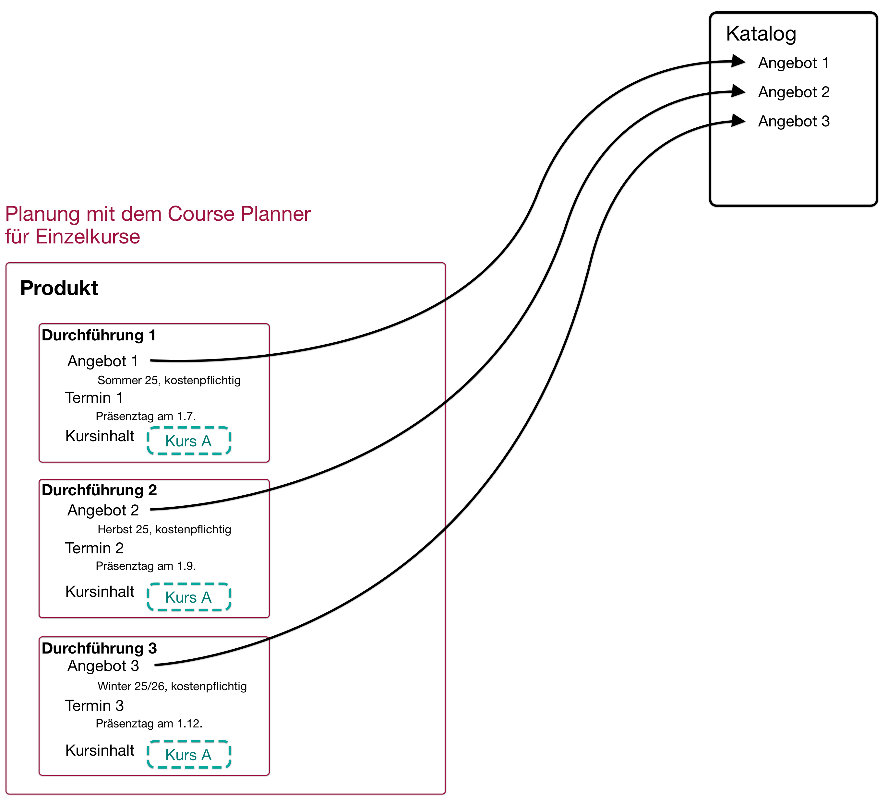{ class="shadow lightbox" } 

Independently of these administrative tasks (carried out by a course planner), a course can be created by authors as a template and then integrated into all implementations.

The courses can also be instantiated automatically on a definable date.

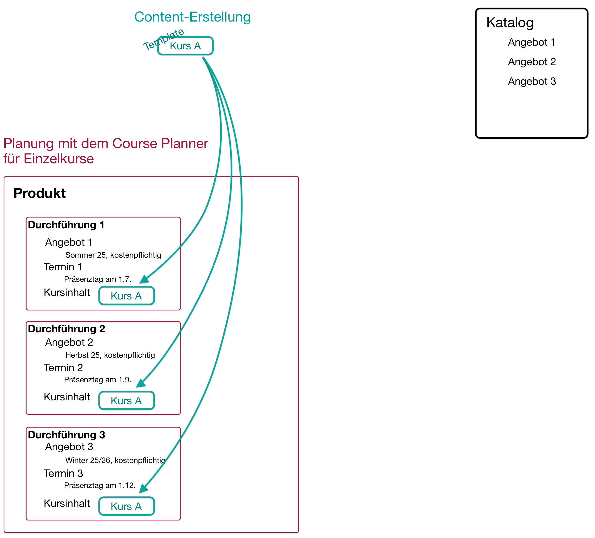{ class="shadow lightbox" } 

For example, members can be added directly to the individual implementations by booking an offer themselves in the catalog.

!!! info "Please note:"

    Course members in the template course are then only the course owners with the author role.

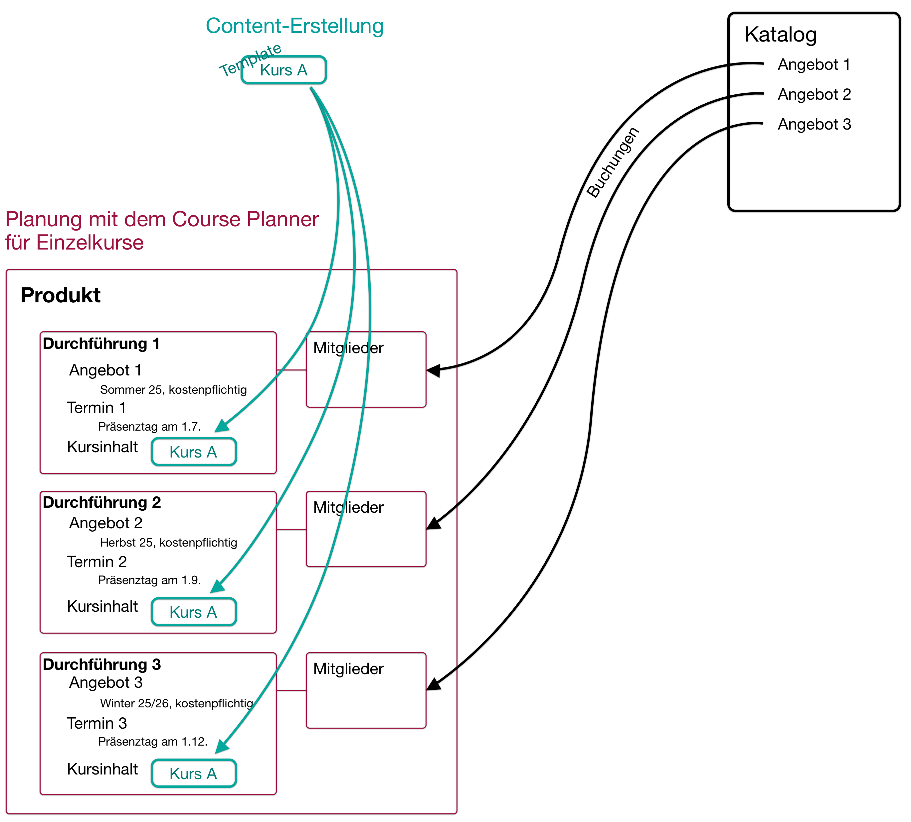{ class="shadow lightbox" } 

[To the top of the page ^](#course_planner)

---

## Planning for course bundles  {: #planning_course_bundles}

Just as several implementations can be created for a single course, implementations can also be created for an entire course bundle and offered in the catalog.

If desired, the combination of courses/learning resources can also be modified in the individual implementations and deviate from the standard implementation ("copy template").

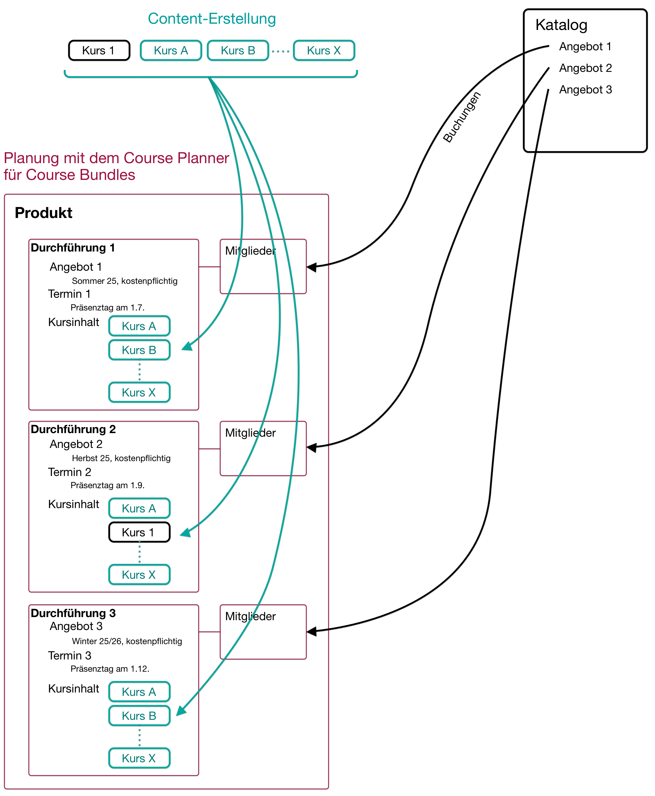{ class="shadow lightbox" } 

[To the top of the page ^](#course_planner)

---

## Planning for structured educational programs {: #planning_structured_product}

Structured products/educational programs have an additional tree structure compared to course bundles. They contain structural elements. 

Even if participants are to complete an educational product, they are made members of a specific implementation. (Not members of individual courses or members of the educational product template.)

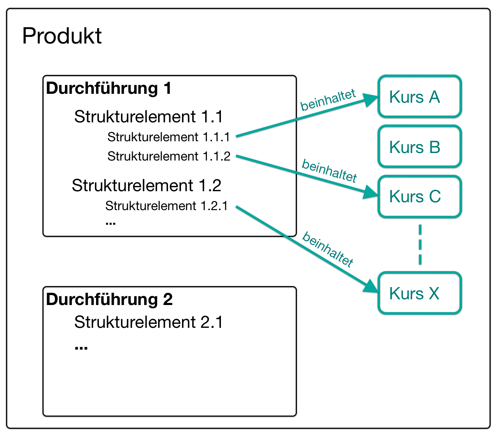{ class="shadow lightbox" } 

In addition, a billing system can also be set up for the implementation.

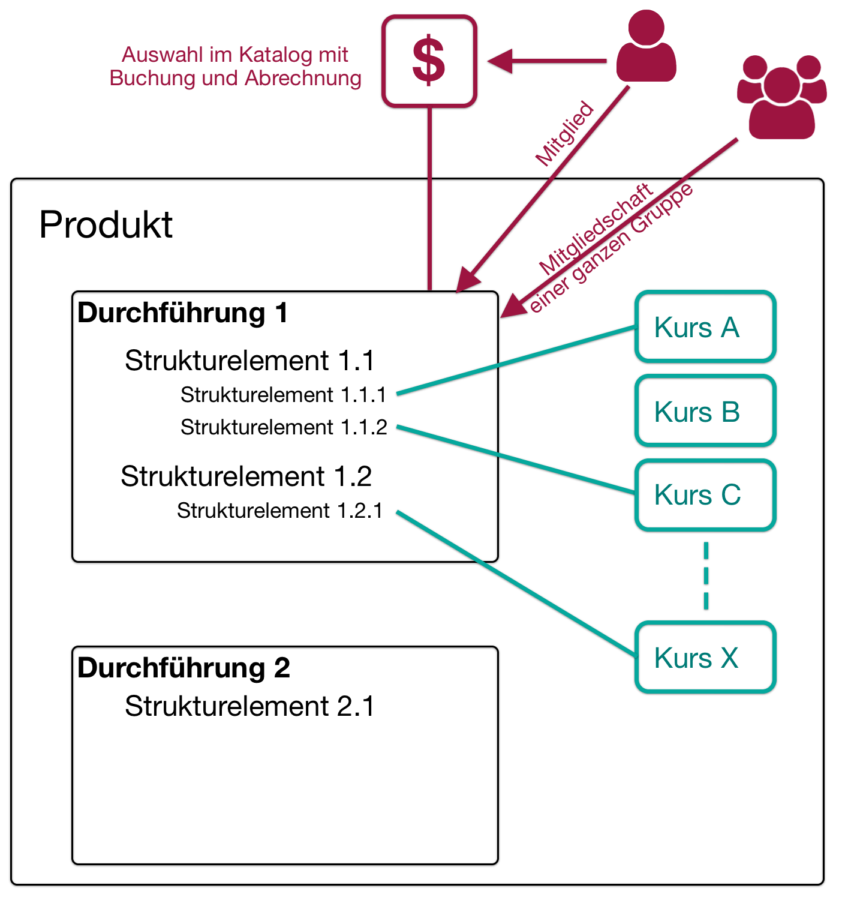{ class="shadow lightbox" }  

[To the top of the page ^](#course_planner)

---

## Who can use the Course Planner? [:octicons-tag-16:{ title="from Release 20.3.0 (OO-8916)" }](https://track.frentix.com/issue/OO-8916){:target="_blank"} {: #users}

After activation of the Course Planner by a system administrator, it is available to all users with the **role "Course Planner"**. (When using organisational units, the role course planner may also be restricted to certain organisational units.) 

**Administrators** and **principals** also have access. (These roles may also be restricted to organisational units.)

**Principals** have exclusively read access to the entire Course Planner: actions such as **Change status**, **Remove** or **Instantiate** are not available to them. If a principal opens a course directly from the Course Planner, the same read-only restriction also applies to the course view.

!!! info "Note on the restriction as principal"
    The read restriction is active whenever the principal only holds this role. There can be overlaps if a user has several roles in a product, for example. In that case, this user can become active wherever the role permits, for example in a to-do assigned to "them".

Limited to a specific product, **product owners** and **element owners** can access it within their area of responsibility.

!!! info "Other OpenOlat roles"
    Authors and learning resource administrators do not have access to the Course Planner. Their role, rights and responsibilities focus on content creation rather than on the planning, scheduling and administration of courses and implementations.

[To the top of the page ^](#course_planner)

---

## Roles and rights in the Course Planner {: #roles_rights}

Access in the Course Planner is based on three areas of responsibility:

* **subject-related and structural responsibility**: setting up and maintaining products, implementations and elements
* **administrative responsibility**: managing members, for example by a secretariat
* **content-related responsibility**: content, events and tasks of the individual elements

Depending on the role, one, two or all three areas are covered:

* **Course planner** (organisation role): covers all three areas and has unrestricted access to all products and certification programs of their own organisation.
* **Administrator**: has the same rights in the Course Planner as a course planner.
* **Product owner**: takes on the same tasks as a course planner, but limited to the products for which they are registered as product owner (regardless of the organisation).
* **Element owner**: holds the content-related responsibility for their own elements (regardless of the organisation). They have full access to the content and events of their own element, but can only read members and settings and cannot change the structure.
* **Principal**: has exclusively read access to the entire Course Planner (see section above).

In addition, **owners of certification programs** have access to the Course Planner.

### Rights matrix {: #rights_matrix}

The following overview shows which actions the individual roles can perform on the objects of the Course Planner.

Legend: :material-check: access or action available · :material-cancel: no access · the remaining entries name the actions available in each case.

|  | Administrator | Course planner | Product owner | Principal | Element owner | Course owner | Master coach | Coach | Participant |
| --- | --- | --- | --- | --- | --- | --- | --- | --- | --- |
| Access to the Course Planner | :material-check: | :material-check: | :material-check: | :material-check: | :material-check: | :material-cancel: | :material-cancel: | :material-cancel: | :material-cancel: |
| Product (active) | Create, Read, Edit, Delete | Create, Read, Edit, Delete | Read, Edit | Read | Read | :material-cancel: | :material-cancel: | :material-cancel: | :material-cancel: |
| Product (deleted) | Read | :material-cancel: | :material-cancel: | :material-cancel: | :material-cancel: | :material-cancel: | :material-cancel: | :material-cancel: | :material-cancel: |
| Implementation | Create, Read, Edit, Delete | Create, Read, Edit, Delete | Create, Read, Edit, Delete | Read | :material-cancel: | :material-cancel: | :material-cancel: | :material-cancel: | :material-cancel: |
| Element | Create, Read, Edit, Delete | Create, Read, Edit, Delete | Create, Read, Edit, Delete | Read | Read, Edit | :material-cancel: | :material-cancel: | :material-cancel: | :material-cancel: |
| Event | Create, Read, Edit, Delete | Create, Read, Edit, Delete | Create, Read, Edit, Delete | Read | Create, Read, Edit, Delete | :material-cancel: | :material-cancel: | :material-cancel: | :material-cancel: |
| Template | Add, Read, Instantiate, Remove | Add, Read, Instantiate, Remove | Add, Read, Instantiate, Remove | Read | Add, Read, Instantiate, Remove | :material-cancel: | :material-cancel: | :material-cancel: | :material-cancel: |
| Course | Add, Read, Remove | Add, Read, Remove | Add, Read, Remove | Read | Add, Read, Remove | :material-cancel: | :material-cancel: | :material-cancel: | :material-cancel: |
| To-do | Create, Read, Edit, Delete | Create, Read, Edit, Delete | Create, Read, Edit, Delete | Read | Create, Read, Edit, Delete | :material-cancel: | :material-cancel: | :material-cancel: | :material-cancel: |
| To-do (assigned or delegated) | :material-cancel: | :material-check: | :material-check: | :material-cancel: | :material-check: | :material-check: | :material-cancel: | :material-cancel: | :material-cancel: |
| Room management [:octicons-tag-16:{ title="from Release 21.0.3 (OO-9721)" }](https://track.frentix.com/issue/OO-9721){:target="_blank"} | Read | Read | :material-cancel: | :material-cancel: | :material-cancel: | :material-cancel: | :material-cancel: | :material-cancel: | :material-cancel: |

!!! info "Course and group roles in the Course Planner"
    Course owner, Master coach, Coach and Participant are course or group roles. They have no management rights in the Course Planner itself; their tasks lie in running the course. One exception are to-dos that have been personally assigned or delegated to a person: these can be edited by the person concerned regardless of their role in the Course Planner.

[To the top of the page ^](#course_planner)

---

## Where can I find the Course Planner? {: #access}

If you have the role and rights of a **course planner**, you will find the Course Planner as a **menu item in the main navigation** in the header.

!!! tip "Requirement"

    In order to use the Course Planner, it must be activated by a system administrator. If the option is not available in the header menu, please contact your system administrator or the support of your OpenOlat instance.

[To the top of the page ^](#course_planner)

---

### Products {: #group_products}

The **Products** area contains the planning objects of the Course Planner: the educational product itself, its implementations and their events.

#### Products {: #products}

An educational product is an inwardly or outwardly directed learning offer with implementations. In most cases, these are multiple implementations, i.e. learning offers of the same "type" (-> product). The Course Planner simplifies the work considerably through the shared central administration.

Curricula/products often consist of several courses and have a certain structure/sequence in which the included courses are combined.

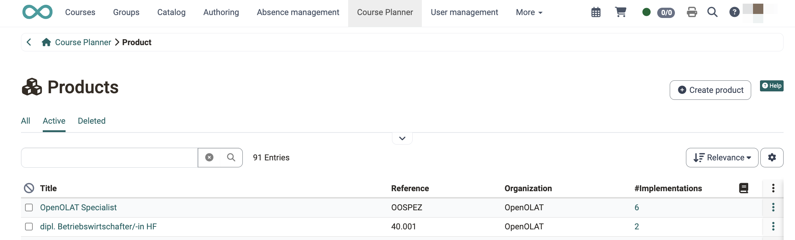{ class="shadow lightbox" }

[See the details >](../area_modules/Course_Planner_Products.md) 
[To the top of the page ^](#course_planner)

#### Implementations {: #implementations}

An (educational) product can be offered and implemented several times. For example, a single course can be repeated each semester, as can a structured educational program consisting of several courses.

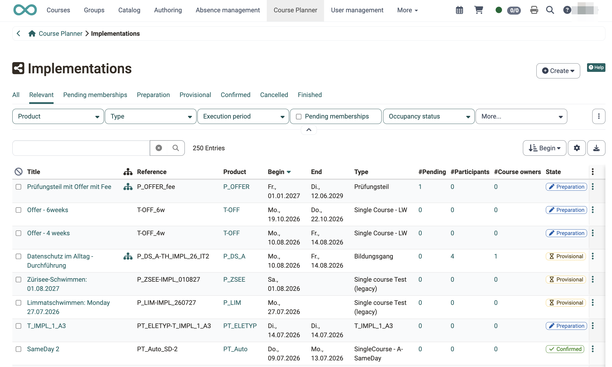{ class="shadow lightbox" }

[See the details >](../area_modules/Course_Planner_Implementations.md) 
[To the top of the page ^](#course_planner)

#### Events {: #events}

The events specified here refer to an implementation or a part of it.

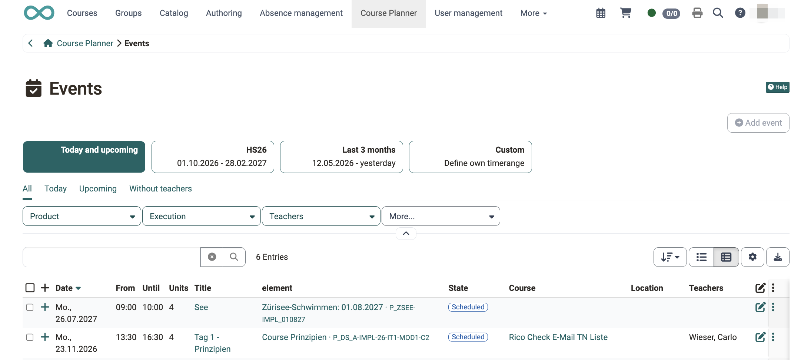{ class="shadow lightbox" }

[See the details >](../area_modules/Course_Planner_Events.md) 
[To the top of the page ^](#course_planner)

---

### Productivity {: #group_productivity}

The **Productivity** area contains the tools for day-to-day work: task tracking and evaluations.

#### To-dos [:octicons-tag-16:{ title="from Release 21.0 (OO-9417)" }](https://track.frentix.com/issue/OO-9417){:target="_blank"} {: #todos_teaser}

To-dos can be recorded in the Course Planner at various levels: in the overview, on the product, on the implementation and on each individual element. A central overview brings together all to-dos across all products. The to-do widget on the dashboard shows open and overdue tasks at a glance.

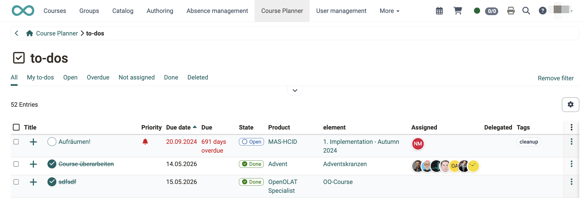{ class="shadow lightbox" }

[See the details >](../area_modules/Course_Planner_Todos.md) 
[To the top of the page ^](#course_planner)

#### Reports [:octicons-tag-16:{ title="from Release 20.0.0 (OO-8387)" }](https://track.frentix.com/issue/OO-8387){:target="_blank"} {: #reports}

Various reports can be generated using report templates.

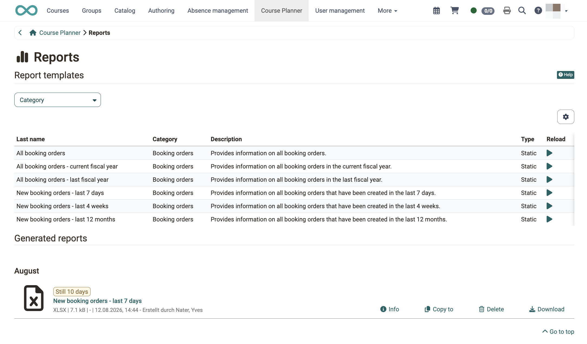{ class="shadow lightbox" }

[See the details >](../area_modules/Course_Planner_Reports.md) 
[To the top of the page ^](#course_planner)

---

### Tools {: #group_tools}

The **Tools** area contains the cross-product tools that are not tied to a single implementation.

#### Certification programs [:octicons-tag-16:{ title="from Release 20.2.0 (OO-8559)" }](https://track.frentix.com/issue/OO-8559){:target="_blank"} {: #certificate_programs}

Certification programs are used when a certificate is only awarded after completing several courses.

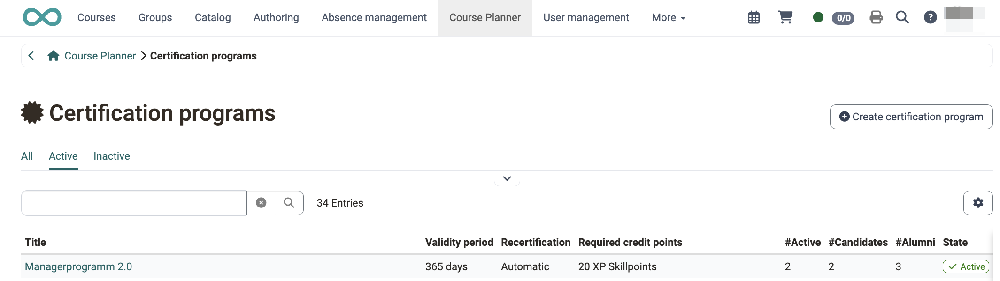{ class="shadow lightbox" }

[See the details >](../area_modules/Course_Planner_Certification_Programs.md) 
[To the top of the page ^](#course_planner)

#### Room management [:octicons-tag-16:{ title="from Release 21.0 (OO-9570)" }](https://track.frentix.com/issue/OO-9570){:target="_blank"} {: #rooms_teaser}

Course planners receive the "Room management" area under "Tools", with a read-only overview of the room scheduling and the rooms they have access to through their organisational affiliation. Rooms and buildings themselves are maintained in the system administration, under `Administration > Modules > Rooms`.

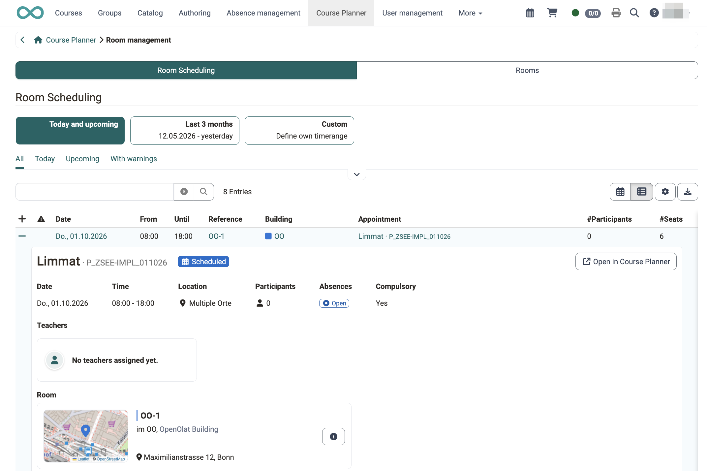{ class="shadow lightbox" }

[See the details >](../area_modules/Course_Planner_Rooms.md) 
[To the top of the page ^](#course_planner)

---

### Import / Export [:octicons-tag-16:{ title="from Release 20.3.0 (OO-9178)" }](https://track.frentix.com/issue/OO-9178){:target="_blank"} {: #import_export}

Products, implementations and memberships can be exported as an Excel file, edited in the file and then imported again. This allows many entries to be created or updated at once.

You start the **export** in the lists "Products", "Implementations" and "Events": select the entries, then click **Export**.

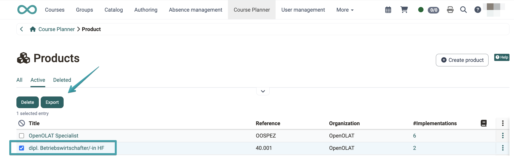{ class="shadow lightbox" }

You start the **import** via the more menu (⋮) at the top right of the overview page with the entry **Import**.

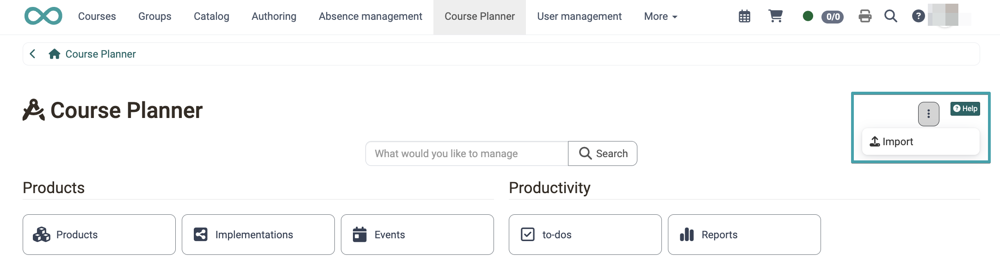{ class="shadow lightbox" }

[See the details >](../area_modules/Course_Planner_Import_Export.md) 
[To the top of the page ^](#course_planner)

---

## Further information {: #further_information}

[How do I create my first OpenOlat course? >](../../manual_how-to/my_first_course/my_first_course.md) 
[How do I plan and run courses with the Course Planner? >](../../manual_how-to/course_planner_courses/course_planner_courses.md) 
[How do I plan and run a curriculum with the Course Planner? >](../../manual_how-to/course_planner_curriculum/course_planner_curriculum.md) 
[Activate Course Planner (Admin) >](../../manual_admin/administration/Modules_Course_Planner.md) 
[What rights do the roles have within a course? >](../basic_concepts/Authorisation_Concept.md)

[To the top of the page ^](#course_planner)
