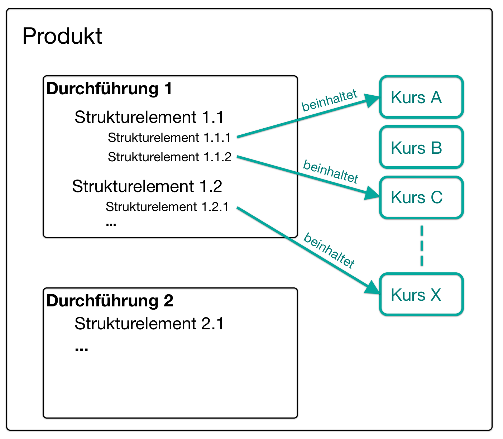

# Course planner {: #course_planner}

!!! info "Note"

    As of release 20, OpenOlat has the independent additional module "Course Planner". It is a further development of the curriculum in earlier versions. However, OpenOlat can still be used as a classic LMS without this module.

## What's the purpose of the Course Planner? {: #purpose}

The Course Planner is a module for **course management**. The aim is to create and run courses automatically and efficiently from the quotation.

With the Course Planner, the **planning work** can be separated from the **content creation** (in the author area).

Of course, you can also create OpenOlat courses without Course Planner. However, the Course Planner provides you with a tool that consolidates the organizational tasks.

| without Course Planner              | with Course Planner                                        |
| -------------------------------- | --------------------------------------------------------- |
| only independent individual courses | Single or multiple courses with several sessions   |
| everything is administered and managed individually in the courses | central administration |
| x                                | Functional separation between administration and content   |
| x                                | Central planning of several courses                          |
| x                                | Central member administration of several courses              |
| x                                | Central tendering of several courses                    |
| x                                | Central control and management of multiple courses          |

[To the top of the page ^](#course_planner)

---

## Planning tasks {: #planning}

The planning tasks include:

- Create different offer types (e.g. chargeable / not chargeable)
- Plan several courses, each with its own time slot
- Place offers in the catalog
- Define space quotas in the courses
- Prepare automatic course creation from template
- Set up automated status changes in the course

[To the top of the page ^](#course_planner)

---

## Planning single courses {: #planning_single_courses}

The Course Planner can be used to create several courses for a course and offer them in the catalog.

This administrative planning work can be done by a course planner even if the course has not yet been created or is not yet available in its final version.

{ class="shadow lightbox" } 

Independently of these administrative tasks (carried out by a course planner), a course can be created by authors as a template and then integrated into all courses.

The courses can also be instantiated automatically on a definable date.

{ class="shadow lightbox" } 

For example, members can be added directly to the individual tours by booking an offer themselves in the catalog.

!!! info "Please note:"

    Course members in the template course are then only the course owners with the author role.

{ class="shadow lightbox" } 

[To the top of the page ^](#course_planner)

---

## Planning for structured educational programs {: #planning_structured_product}

Even if participants are to complete an educational product consisting of several courses, they are made members of a specific implementation. (Not members of individual courses or members of the educational product template).

{ class="shadow lightbox" } 

In addition, a billing system can also be set up for the implementation.

{ class="shadow lightbox" }  

[To the top of the page ^](#course_planner)

---

## Who can use the Course Planner? {: #users}

After activation of the Course Planner by a system administrator, it is available to all users with the **role "Course Planner"**.

Administrators and principals also have access.

tbd

