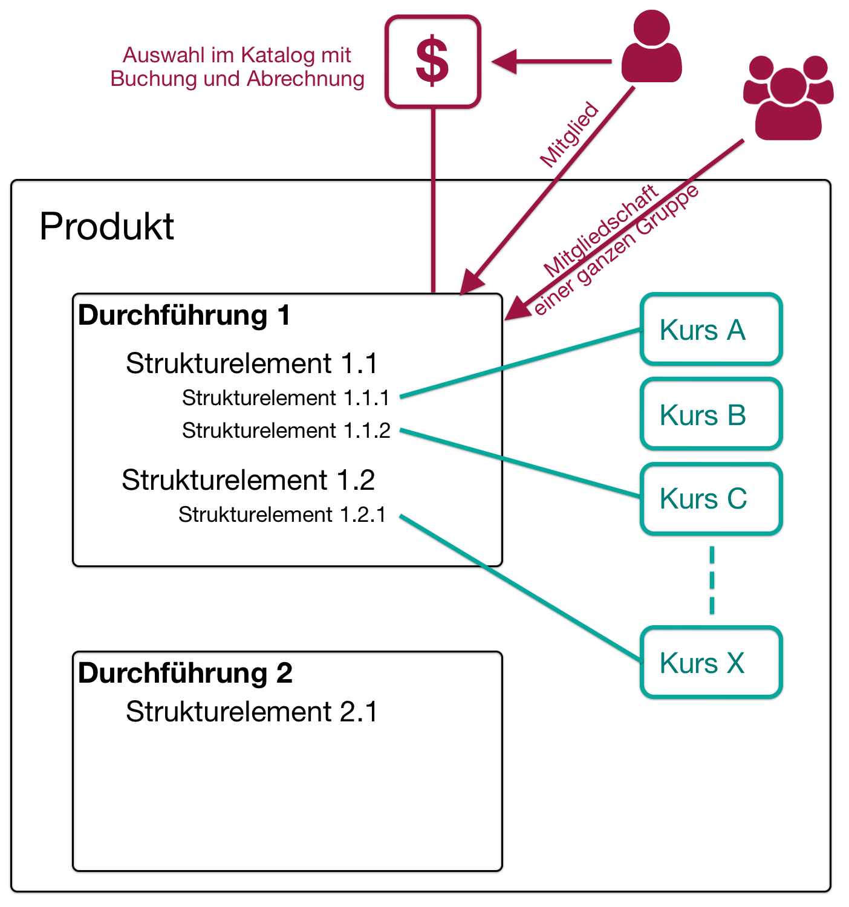
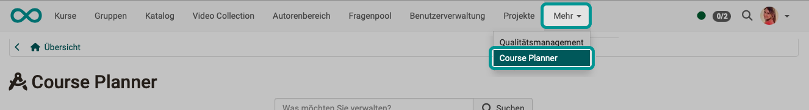

# Course planner {: #course_planner}

!!! info "Note"

    As of release 20, OpenOlat has the independent additional module "Course Planner". It is a further development of the curriculum in earlier versions. However, OpenOlat can still be used as a classic LMS without this module.

## What's the purpose of the Course Planner? {: #purpose}

The Course Planner is a module for **course management**. The aim is to create and run courses automatically and efficiently from the quotation.

With the Course Planner, the **planning work** can be separated from the **content creation** (in the author area).

Of course, you can also create OpenOlat courses without Course Planner. However, the Course Planner provides you with a tool that consolidates the organizational tasks.

| without Course Planner              | with Course Planner                                        |
| -------------------------------- | --------------------------------------------------------- |
| only independent individual courses | Single or multiple courses with several sessions   |
| everything is administered and managed individually in the courses | central administration |
| x                                | Functional separation between administration and content   |
| x                                | Central planning of several courses                          |
| x                                | Central member administration of several courses              |
| x                                | Central tendering of several courses                    |
| x                                | Central control and management of multiple courses          |

The Course Planner can be used to manage

* single courses
* course bundles
* structured educational programs/products

[To the top of the page ^](#course_planner)

---

## Planning tasks {: #planning}

The planning tasks include:

- Create different offer types (e.g. chargeable / not chargeable)
- Plan several courses, each with its own time slot
- Place offers in the catalog
- Define space quotas in the courses
- Prepare automatic course creation from template
- Set up automated status changes in the course

[To the top of the page ^](#course_planner)

---

## Planning single courses {: #planning_single_courses}

The Course Planner can be used to create several courses for a course and offer them in the catalog.

This administrative planning work can be done by a course planner even if the course has not yet been created or is not yet available in its final version.

{ class="shadow lightbox" } 

Independently of these administrative tasks (carried out by a course planner), a course can be created by authors as a template and then integrated into all courses.

The courses can also be instantiated automatically on a definable date.

{ class="shadow lightbox" } 

For example, members can be added directly to the individual tours by booking an offer themselves in the catalog.

!!! info "Please note:"

    Course members in the template course are then only the course owners with the author role.

{ class="shadow lightbox" } 

[To the top of the page ^](#course_planner)

---

## Planning for structured educational programs {: #planning_structured_product}

Even if participants are to complete an educational product consisting of several courses, they are made members of a specific implementation. (Not members of individual courses or members of the educational product template).

{ class="shadow lightbox" } 

In addition, a billing system can also be set up for the implementation.

{ class="shadow lightbox" }  

[To the top of the page ^](#course_planner)

---

## Who can use the Course Planner? {: #users}

After activation of the Course Planner by a system administrator, it is available to all users with the **role "Course Planner"**. (When using organisational units, the role course planner may also be restricted to certain organisational units.) 

**Administrators** and **principals** also have access. (These roles may also be restricted to organisational units.)

Limited to a specific product, **product owners** and **element owners** can access it within their area of responsibility.

Authors and learning resource administrators do not have access to the Course Planner. 
Their role, rights and responsibilities focus on content creation rather than on the planning, scheduling and administration of courses and implementations.

[To the top of the page ^](#course_planner)

---

## Where can I find the Course Planner? {: #access}

If you have the role and rights of a **course planner**, you will find the Course Planner as a **menu item in the main navigation** in the header.

{ class="shadow lightbox" }  

!!! info "Requirement"

    In order to use the Course Planner, it must be activated by a system administrator. If the option is not available in the header menu, please contact your system administrator.

[To the top of the page ^](#course_planner)

---

## The overview {: #overview}

The overview shows

- upcoming events,
- the buttons for accessing the areas/functions described below,
- as well as the search.

{ class="shadow lightbox" }  

By entering a term in the search field, you can search for **performances, courses and dates**. 
As with other searches, filters can be used to narrow down the search results.

{ class="shadow lightbox" }  

[To the top of the page ^](#course_planner)

---

### Products {: #products}

An educational product is an inwardly or outwardly directed learning offer with implementations. In most cases, these are multiple courses, i.e. learning opportunities of the same "type" (-> product). The Course Planner simplifies the work considerably through the shared central administration.

Curricula/products often consist of several courses and have a certain structure/sequence in which the included courses are combined.

{ class="shadow lightbox" }

[See the details >](../area_modules/Course_Planner_Products.md) 
[To the top of the page ^](#course_planner)

---

### Implementations {: #implementations}

An (educational) product can be offered and implemented several times. For example, a single course can be repeated each semester, as can a structured educational program consisting of several courses.

{ class="shadow lightbox" }

[See the details >](../area_modules/Course_Planner_Implementations.md) 
[To the top of the page ^](#course_planner)

---

### Events {: #events}

The dates specified here refer to one implementation or a part thereof.

{ class="shadow lightbox" }

[See the details >](../area_modules/Course_Planner_Events.md) 
[To the top of the page ^](#course_planner)

---

### Certification programs {: #certification_programs}

Certificate programs are used when a certificate is only awarded after completing several courses. 

{ class="shadow lightbox" }

[See the details >](../area_modules/Course_Planner_Certification_Programs.md) 
[To the top of the page ^](#course_planner)

---

### Reports {: #reports}

Various reports can be generated using report templates.

{ class="shadow lightbox" }

[See the details >](../area_modules/Course_Planner_Reports.md) 
[To the top of the page ^](#course_planner)

---

## Further information {: #further information}

[How do I create my first OpenOlat course? >](../../manual_how-to/my_first_course/my_first_course.md) 
[How can I plan and carry out implementations with the Course Planner? >](../../manual_how-to/course_planner_courses/course_planner_courses.md) 
[How can I plan and run a course with the Course Planner? >](../../manual_how-to/course_planner_curriculum/course_planner_curriculum.md) 
[Activate Course Planner (Admin) >](../../manual_admin/administration/Modules_Course_Planner.md) 

[To the top of the page ^](#course_planner)