# Course Planner: Zertifikatsprogramme {: #certification_programs}

{ class="shadow lightbox" }

## Was ist ein Zertifikatsprogramm? [:octicons-tag-16:{ title="ab Release 20.2 (OO-8559)" }](https://track.frentix.com/issue/OO-8559){:target="_blank"} {: #description}

Als Bestätigung für den Besuch eines Kurses bzw. der Erreichung von bestimmten kursbezogenen Aktivitäten kann ein Zertifikat ausgestellt werden. Es ist auch möglich, ohne die Verwendung eines Leistungsnachweises ein Zertifikat auszustellen.

Zertifikate für einen **einzelnen Kurs** werden in der `Kursadministration > Einstellungen > Tab Bewertung` aktiviert und konfiguriert.

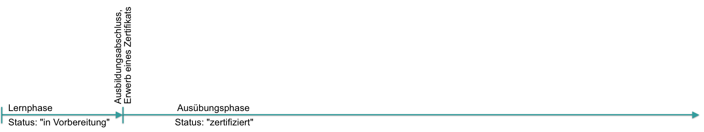{ class="shadow lightbox" }

Ein Zertifikat für den **Besuch einer Durchführung** oder den **Besuch mehrerer Kurse** hingegen, kann mit dem **Zertifikatsprogramm** ausgestellt werden. Solche Zertifikate werden innerhalb des **Course Planners** (Durchführung) vergeben. Die Personen können in ein Zertifikatsprogramm aufgenommen werden und erforderliche Rezertifizierungen können dort gemanaged werden: `Course Planner > Zertifikatsprogramm`

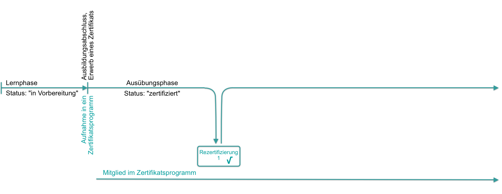{ class="shadow lightbox" }

Erfüllt ein Mitglied erforderliche Rezertifizierungskriterien nicht, wird die Mitgliedschaft (automatisch) beendet.

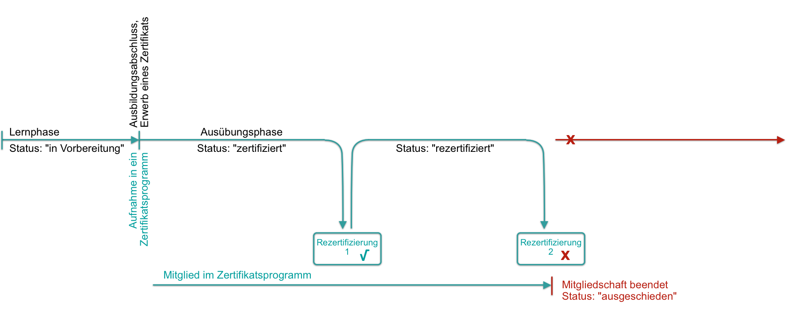{ class="shadow lightbox" }

Andererseits ist die Mitgliedschaft in einem Zertifikatsprogramm auch bereits für Kandidat:innen möglich, kann also bereits vor der ersten Zertifizierung beginnen.

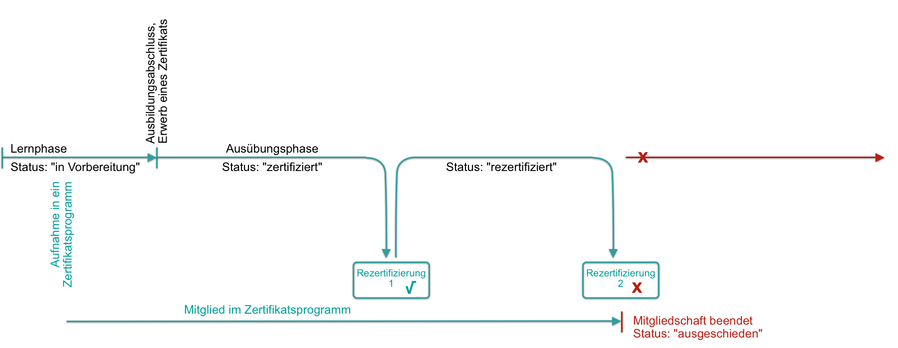{ class="shadow lightbox" }

| Zertifikat im Kurs   | Zertifikat im Zertifikatsprogramm |
| -------------------- | ------------------------------------------- |
| Zertifikat für einen einzelnen Kurs | Zertifikat für eine Durchführung oder für mehrere Kurse |
| pro Kurs | pro Durchführung |
| `Kursadministration > Einstellungen > Tab Bewertung` | `Course Planner > Zertifikatsprogramm` |
| Rezertifizierung: ja   | Rezertifizierung: ja |
| --- | Verwendung von Kreditpunkten |

!!! tip "Mögliche Einsatzgebiete"

    Sicherheitsschulungen 
    Compliance-Schulungen 
    [Datenschutz-Zertifikate mit Kreditpunkten >](../../manual_how-to/certification_programs/certification_programs.de.md#use_case_1) 
    [Ausbildungsprogramme mit automatischer Rezertifizierung >](../../manual_how-to/certification_programs/certification_programs.de.md#use_case_2) 
    [Führungskräfteentwicklung mit flexiblen Lernpfaden >](../../manual_how-to/certification_programs/certification_programs.de.md#use_case_3) 

[Zum Seitenanfang ^](#certification_programs)

---

## Zertifikatsprogramm erstellen [:octicons-tag-16:{ title="ab Release 20.2 (OO-8559)" }](https://track.frentix.com/issue/OO-8559){:target="_blank"} {: #create}

Um ein neues Zertifikatsprogramm zu erstellen, klicken Sie im 
`Course Planner > Zertifikatsprogramme > den Button "Zertifikatsprogramm erstellen"`

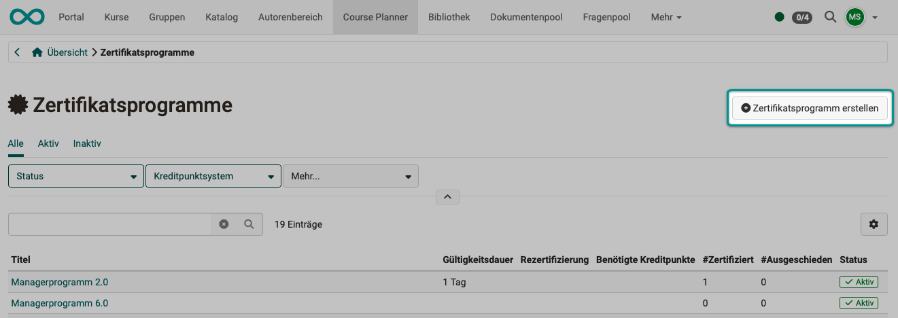{ class="shadow lightbox" }

[Zum Seitenanfang ^](#certification_programs)

---

## Zertifikatsprogramm einrichten [:octicons-tag-16:{ title="ab Release 20.2 (OO-8559)" }](https://track.frentix.com/issue/OO-8559){:target="_blank"} {: #config}

Öffnen Sie ein Zertifikatsprogramm, indem Sie in der Liste auf dessen Namen klicken. Anschliessend konfigurieren Sie es in den verschiedenen Tabs. Eine Schritt-für-Schritt-Anleitung zum Einrichten finden Sie hier: 
[Wie kann ich mit dem Course Planner Zertifikatsprogramme erstellen? >](../../manual_how-to/certification_programs/certification_programs.de.md)

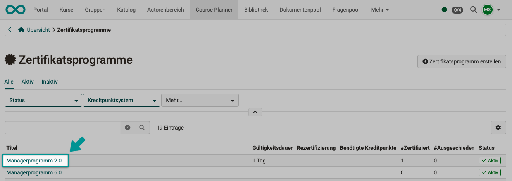{ class="shadow lightbox" }

[Zum Seitenanfang ^](#certification_programs)

---

### Status {: #config_status}

Ein Zertifikatsprogramm kann vom Status "Aktiv" auf "Inaktiv" gesetzt werden. Dies ist insbesondere während der Erstellung hilfreich.   

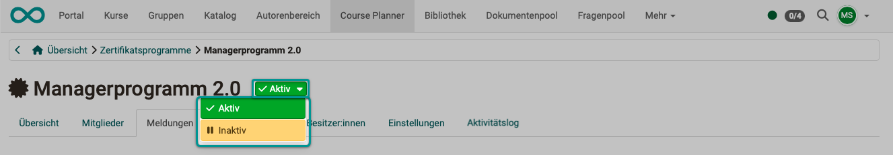{ class="shadow lightbox" }

[Zum Seitenanfang ^](#certification_programs)

---

### Tab Übersicht {: #config_tab_overview}

Auf der Übersicht sehen Sie auf einen Blick die Anzahl der Mitglieder sortiert nach Status:

* Aktive
* Zertifiziert
* Zertifikat läuft bald ab
* in Rezertifizierung

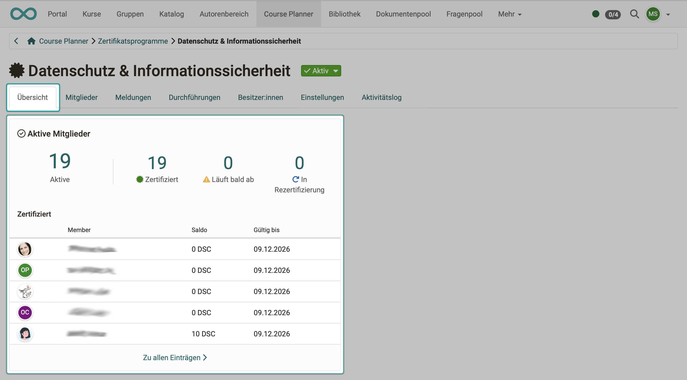{ class="shadow lightbox" }

[Zum Seitenanfang ^](#certification_programs)

---

### Tab Mitglieder {: #config_tab_members}

Um weitere Personen in das Zertifikatsprogramm aufzunehmen und ihnen die Möglichkeit zum Erwerb eines Zertifikats zu ermöglichen, verwenden Sie den **Button "Mitglied hinzufügen"**.

Jede Person im Zertifikatsprogramm hat einen **Mitgliedschaftsstatus**:

* **Aktives Mitglied**: Die Person besitzt in diesem Zertifikatsprogramm ein Zertifikat und ist damit zertifiziertes, aktives Mitglied.
* **Kandidat:in**: Die Person nimmt an einer mit dem Zertifikatsprogramm verknüpften Durchführung teil, besitzt aber in diesem Programm noch kein Zertifikat. Die Mitgliedschaft kann so bereits vor der ersten Zertifizierung beginnen.
* **Alumni**: Die Person ist aus dem Zertifikatsprogramm ausgeschieden, zum Beispiel nach Ablauf eines Zertifikats ohne Rezertifizierung.

Beim Hinzufügen über den Assistenten "Neue Person zertifizieren" wird der aktuelle Mitgliedschaftsstatus jeder gewählten Person angezeigt.

Wird eine zur Rezertifizierung geforderte Ausbildung/Massnahme nicht erfüllt, läuft ein Zertifikat ab und die betreffende Person scheidet automatisch aus dem Zertifikatsprogramm aus. Dies ist z.B. bei sicherheitsrelevanten Zertifizierungen oft ein notwendiger Automatismus.

Aus dem Zertifikatsprogramm ausgeschiedene Personen sind unter einem separaten Button einsehbar. So können sie von Besitzer:innen eines Zertifikatsprogramms schnell identifiziert und kontaktiert werden.

Unter den 3 Punkten am Ende eines Listenzeile besteht die Möglichkeit für die Zertifikatsprogrammbesitzer:innen mit der betreffenden Person Kontakt aufzunehmen. 
Auch die Option zum Widerrufen ist hier zu finden. So können z.B. zu Unrecht automatisch ausgestellte Zertifikate manuell zurückgezogen werden.

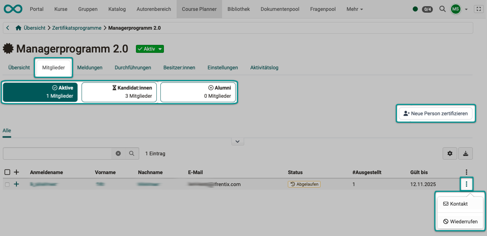{ class="shadow lightbox" }

[Zum Seitenanfang ^](#certification_programs)

---

### Tab Meldungen {: #config_tab_messages}

Meldungen und Erinnerungen beziehen sich immer auf die aktuelle Konfiguration. Im oberen Bereich können Sie diese nochmals kontrollieren.

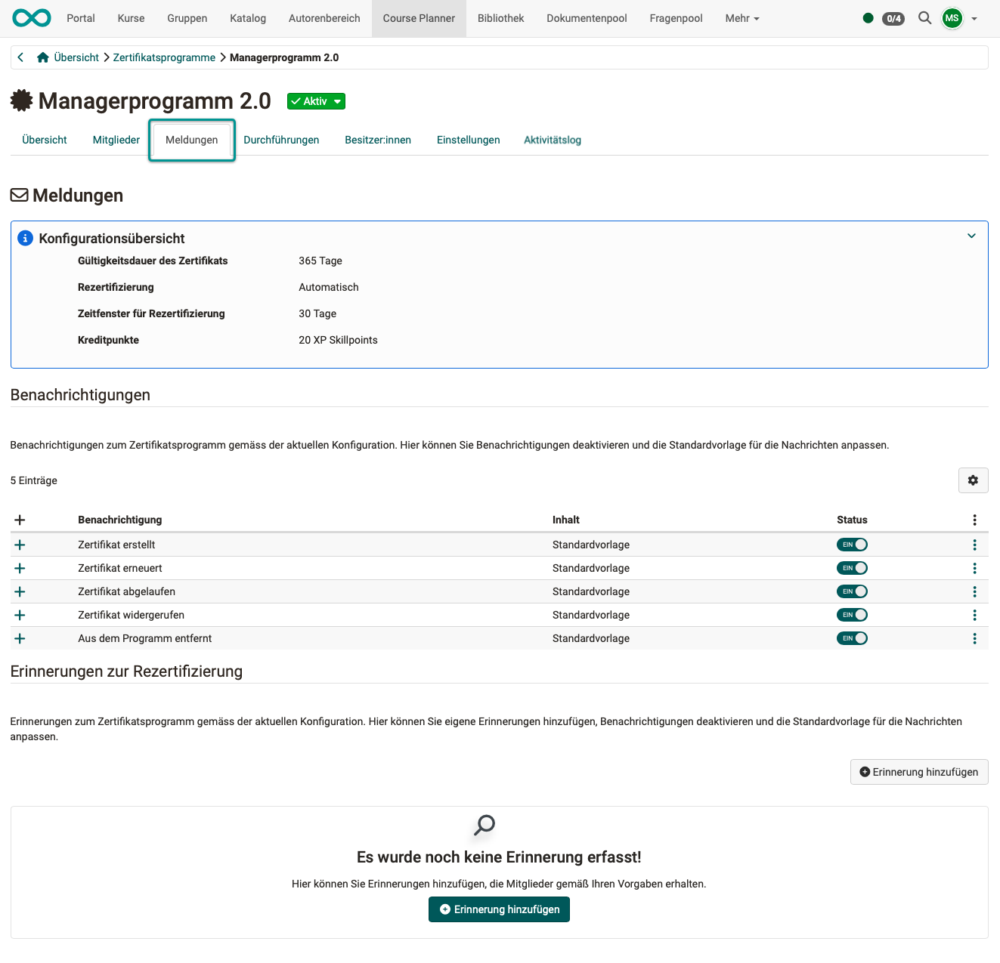{ class="shadow lightbox" }

**Benachrichtigungen** 
Im Abschnitt Benachrichtigungen finden Sie **vorbereitete Benachrichtigungen** zum Zertifikatsprogramm gemäss der aktuellen Konfiguration. Sie können diese Benachrichtigungen nach Bedarf aktivieren/deaktivieren und die Standardvorlagen für die Nachrichten anpassen. (Sie finden den Button zur Anpassung einer Vorlage unter den 3 Punkten oder wenn Sie die Detailansicht geöffnet haben.)

**Erinnerungen zur Rezertifizierung** 
Zusätzlich können Sie in einem weiteren Abschnitt eigene Erinnerungen anlegen, die dann automatisch gemäss Ihrer Konfiguration verschickt werden.

[Zum Seitenanfang ^](#certification_programs)

---

### Tab Durchführungen {: #config_tab_implementations}

Bedingung für die Erlangung eines Zertifikates ist das erfolgreiche Absolvieren einer der hier aufgelisteten Durchführungen (ODER-Verknüpfung, es genügt eine der hier aufgelisteten Durchführungen). Ob es sich um Durchführungen des genau gleichen Produkts oder Kurses handelt, spielt keine Rolle. Deshalb ist die Auswahl mit Bedacht zu treffen um eine Gleichwertigkeit zu gewährleisten.

Durchführungen vom Typ Einzelkurs können auch direkt in der Durchführung mit dem Zertifikatsprogramm verknüpft werden: in den Einstellungen der Durchführung im Unter-Tab "Bewertung". [:octicons-tag-16:{ title="ab Release 21.0 (OO-9499)" }](https://track.frentix.com/issue/OO-9499){:target="_blank"} 
[Mehr dazu >](Course_Planner_Implementations.de.md#tab_settings_assessment)

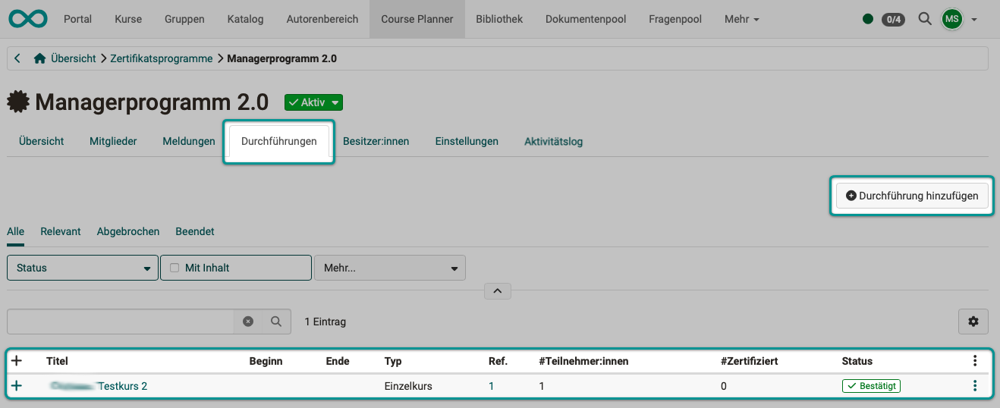{ class="shadow lightbox" }

Haben Sie mehrere Zertifikatsprogramme angelegt, können Sie gefilterte Listen anzeigen lassen: 
Alle - Relevant - Abgebrochen - Beendet

Mit **Klick auf das Plus-Zeichen** vor einem Listeneintrag zeigen Sie die Details dieser Durchführung an. (Bzw. Sie schliessen mit Klick auf das Minus-Zeichen die Details.) Sie können hier viele Informationen einsehen. Scrollen Sie dazu die Liste horizontal. 

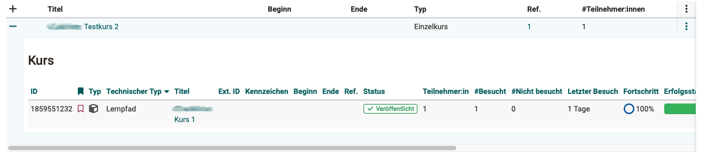{ class="shadow lightbox" }

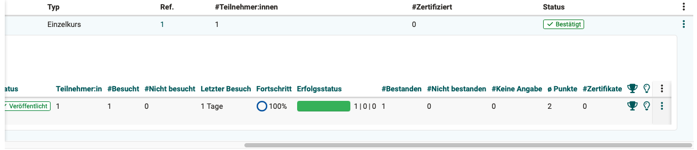{ class="shadow lightbox" }

Mit Klick auf das Pokal-Symbol gelangen Sie direkt zum Bewertungswerkzeug. (Sie müssen dazu Betreuer:in oder Besitzer:in sein.)

Mit Klick auf das Glühbirnen-Symbol gelangen Sie zur Infoseite. (Sie müssen dazu Mitglied der Durchführung sein.)

!!! tip "Empfehlung"

    Unter dem Icon mit den 3 Punkten am Ende einer Zeile können Sie die Durchführung auch in einem separaten Browser-Tab öffnen. Das ist für die Bearbeitung oft hilfreich.

[Zum Seitenanfang ^](#certification_programs)

---

### Tab Besitzer:innen {: #config_tab_owners}

Verwenden Sie diesen Tab, um dem aktuellen Zertifikatsprogramm weitere Besitzer:innen hinzuzufügen oder sie zu entfernen.

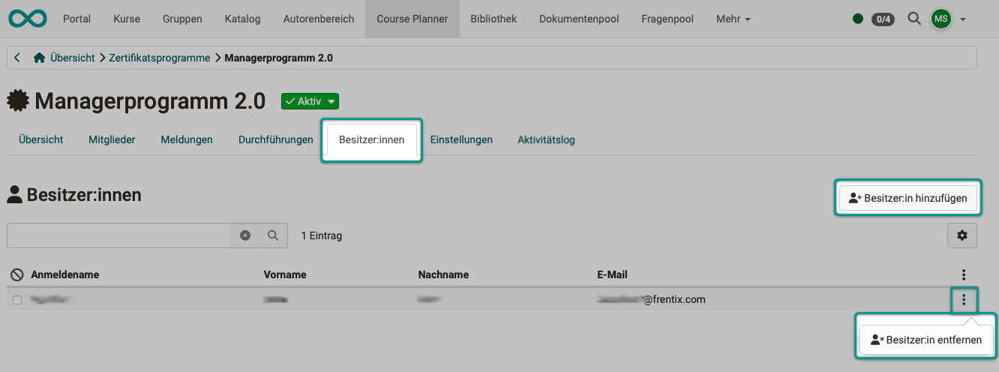{ class="shadow lightbox" }

[Zum Seitenanfang ^](#certification_programs)

---

### Tab Einstellungen {: #config_tab_settings}
In den Einstellungen definieren Sie,

* welchen Titel das Zertifikatsprogramm trägt
* wer administrativ auf dieses Zertifikatsprogramm zugreifen kann
* wie lange das Zertifikat gültig ist
* ob und wie eine Rezertifizierung erfolgt
* ob und wieviele Kreditpunkte vergeben werden
* welches pdf-Zertifikat vergeben wird

**Button "Metadata"** 
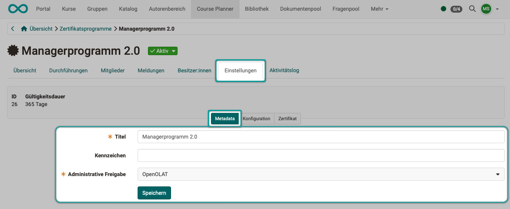{ class="shadow lightbox" }

 

**Button "Konfiguration"** 
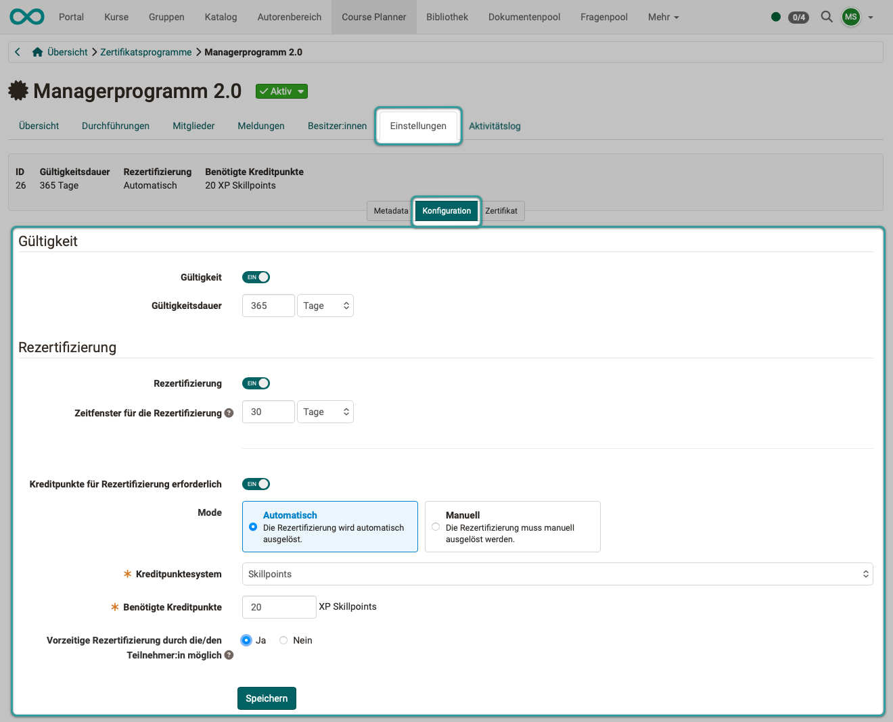{ class="shadow lightbox" }

 

**Button "Zertifikat"** 
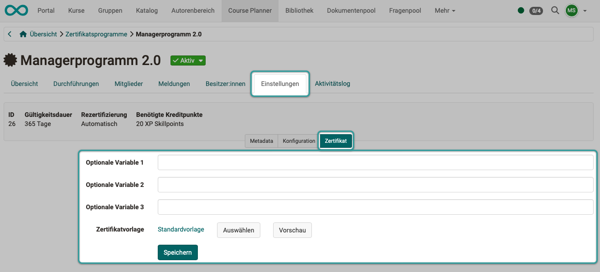{ class="shadow lightbox" }

Unter dem Button "Zertifikat" legen Sie fest, welche Zertifikatsvorlage im Zertifikatsprogramm verwendet wird. Zusätzlich stehen folgende Optionen zur Verfügung:

**Seriennummer** 

Mit der Option **"Mit Seriennummer"** erhält jedes ausgestellte Zertifikat automatisch eine fortlaufende, menschenlesbare Seriennummer [:octicons-tag-16:{ title="ab Release 21.0 (OO-9567)" }](https://track.frentix.com/issue/OO-9567). Das **Format** legen Sie über Variablen fest: `${counter}` bzw. `${counter:N}` (Zähler, optional mit führenden Nullen bei N Stellen) sowie optional `${year}`, `${month}` und `${day}`, z.B. `REF-${year}-${counter:5}`. Über den **Startwert des Zählers** bestimmen Sie, bei welcher Nummer die Zählung beginnt; das Feld "Nächste Seriennummer" zeigt eine Vorschau. Die Seriennummer wird bei jeder Ausstellung (auch bei einer Rezertifizierung) neu vergeben, erscheint auf dem Zertifikat und im Dateinamen des PDF. In der Zertifikatsübersicht lässt sich die Spalte "Seriennummer" einblenden (standardmässig ausgeblendet).

<h4>Druckversion für vorgedrucktes Papier</h4>

Mit der Option **"Mit Druckversion"** aktivieren Sie eine zusätzliche **Druckvorlage** für vorgedrucktes Papier [:octicons-tag-16:{ title="ab Release 21.0 (OO-9568)" }](https://track.frentix.com/issue/OO-9568). Berechtigte Personen können damit zusätzlich zum Standard-Zertifikat ein **Druckzertifikat exportieren** (einzeln, als Sammelaktion oder über das Aktionsmenü). Teilnehmende erhalten weiterhin nur das Standard-Zertifikat.

[Zum Seitenanfang ^](#certification_programs)

---

### Tab Aktivitätslog {: #config_tab_activitylog}

In diesen Tab können Sie alle Aktivitäten im aktuellen Zertifikatsprogramm nachvollziehen. Verwenden Sie die Filter um gezielt in allen Aktivitäten zu suchen.

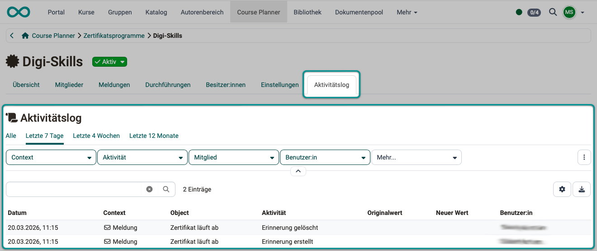{ class="shadow lightbox" }

[Zum Seitenanfang ^](#certification_programs)

---

## Zertifikatsprogramm und Kreditpunkte [:octicons-tag-16:{ title="ab Release 20.2 (OO-8559)" }](https://track.frentix.com/issue/OO-8559){:target="_blank"} {: #credit_points}

**Kreditpunkte als Voraussetzung** 
Wie bereits weiter oben erklärt, können Sie für eine Rezertifizierung zur Voraussetzung machen, dass eine bestimmte Anzahl Kreditpunkte vorher erworben wurde. Wieviele Kreditpunkte für den Erwerb des Zertifikats erforderlich sind, wird eingestellt unter 
`Course Planner > Zertifikatsprogramm > Tab Einstellungen > Button "Konfiguration"` 

**Kreditpunkte als Zahlungsmittel** 
Stellt das Zertifikatsprogramm ein Zertifikat aus, kann auch eine bestimmbare Anzahl Kreditpunkte vom Guthaben abgezogen werden. 

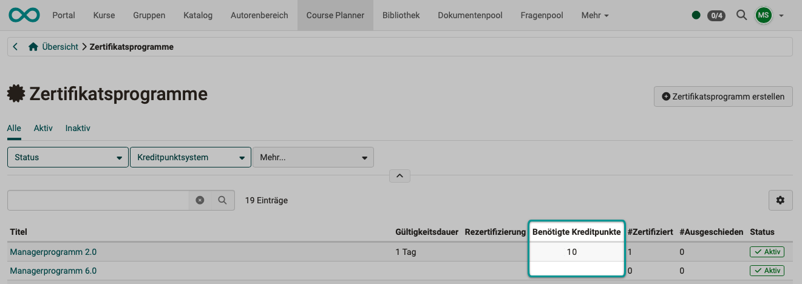{ class="shadow lightbox" }

[Zum Seitenanfang ^](#certification_programs)

---

## Übersicht über ausgestellte Zertifikate {: #issued_certificates}

Wer hat wann welches Zertifikat erhalten? Diese Frage stellen sich sowohl Besitzer:innen eines Zertifikatsprogramms, wie auch Betreuer:innen und die Teilnehmenden selbst. Je nach Rolle gibt es verschiedene Wege zu einem Überblick. 

### Übersicht für Zertifikatsprogrammbesitzer:innen 
Im `Course Planner > Zertifikatsprogramme > Tab "Mitglieder"` finden Sie alle Teilnehmenden des Zertifikatsprogramms aufgelistet. Durch **Klick auf das Plus-Zeichen** vor einem Listeneintrag öffnen Sie die Detailansicht.
Sie sehen dort alle Zertifikate der gewählten Person, auch abgelaufene und archivierte Zertifikate. 
Die Buttons über der Liste helfen Ihnen mit vorsortierten Listen.

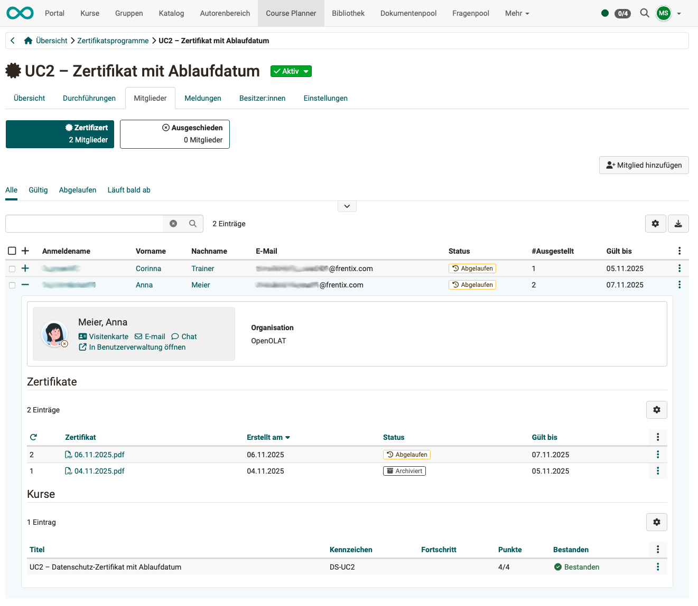{ class="shadow lightbox" }

### Übersicht für Betreuer:innen
Als Betreuer:in behalten Sie den Überblick über die Zertifikate Ihrer betreuten Teilnehmer:innen weiterhin am einfachsten

* für einzelne Kurse im **Bewertungswerkzeug**
* für mehrere Kurse im **Coachingtool**

### Übersicht für Bildungsverantwortliche

Bildungsverantwortliche sehen alle Zertifikate aus unterschiedlichen Zertifikatsprogrammen und Kursen einzelner Teilnehmer:innen unter 
`Coaching > Education Manager > Person wählen > Tab Zertifikate`

### Übersicht für Teilnehmer:innen [:octicons-tag-16:{ title="ab Release 20.2 (OO-8818)" }](https://track.frentix.com/issue/OO-8818){:target="_blank"}
Teilnehmende finden ihre Zertifikate im **persönlichen Menü** aufgeführt. Es spielt dabei keine Rolle, ob ein Zertifikat von einem Zertifikatsprogramm oder einem einzelnen Kurs stammt.

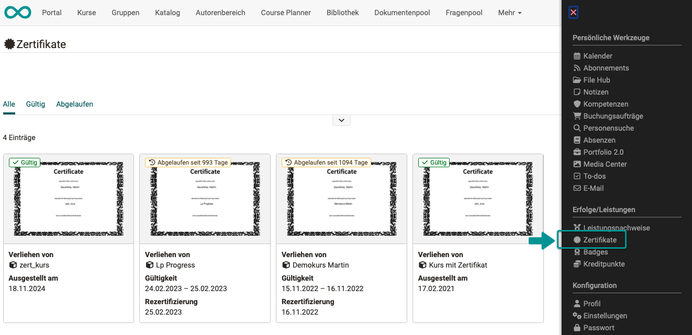{ class="shadow lightbox" }

[Zum Seitenanfang ^](#certification_programs)

---

## Rezertifizierung mit dem Zertifikatsprogramm [:octicons-tag-16:{ title="ab Release 20.2 (OO-8559)" }](https://track.frentix.com/issue/OO-8559){:target="_blank"} {: #recertification}

**Voraussetzungen** 
Erste Voraussetzung für eine Rezertifizierung mit einem Zertifikatsprogramm ist die Mitgliedschaft der Teilnehmenden im Zertifikatsprogramm. 
`Course Planner > Zertifikatsprogramm > Tab Mitglieder`

Zweite Voraussetzung ist ein vorhandenes Zertifikat mit einem Ablaufdatum. 
`Course Planner > Zertifikatsprogramm > Tab Einstellungen > Button Konfiguration`

Drittens kann es sein, dass eine bestimmte Anzahl Kreditpunkte vorhanden sein muss, bevor eine Rezertifizierung möglich ist.

**Erneuerung durch Besitzer:innen des Zertifikatsprogramms** 
Besitzer:innen des Zertifikatsprogramms können ein noch gültiges Zertifikat jederzeit erneuern und damit verlängern unter 
`Course Planner > Zertifikatsprogramm > Tab Mitglieder > Mitglied wählen > 3 Punkte`

**Rezertifizierungszeitraum** 
Die Möglichkeit zur Rezertifizierung durch Teilnehmer:innen kann von den Besitzer:innen des Zertifikatsprogramms sinnvollerweise schon vor Ablauf des Zertifikats gegeben werden. In diesem Zusammenhang können auch entsprechende Informationen und Erinnerungen automatisch verschickt werden. 
`Course Planner > Zertifikatsprogramm > Tab Einstellungen > Button Konfiguration > Abschnitt Rezertifizierung`

[Zum Seitenanfang ^](#certification_programs)

---

## Zertifikate manuell ausstellen oder aberkennen/widerrufen {: #manual_certification}

Das Recht zum manuellen Ausstellen oder Aberkennen von Zertifikaten haben in erster Linie Besitzer:innen des jeweiligen Zertifikatsprogramms. 
Ausserdem haben auch Benutzer:innen mit den Rollen "Administrator:in" und "Kursplaner:in" administrativen Zugriff.

* Öffnen Sie mit Klick auf den Tab "Mitglieder" die Liste der Teilnehmer:innen. 
* Klicken Sie in der Zeile der betroffenen Teilnehmer:innen auf die 3 Punkte am Ende der Zeile.
* Dort werden Ihnen die Optionen zum Erneuern oder Widerrufen des Zertifikats angezeigt.

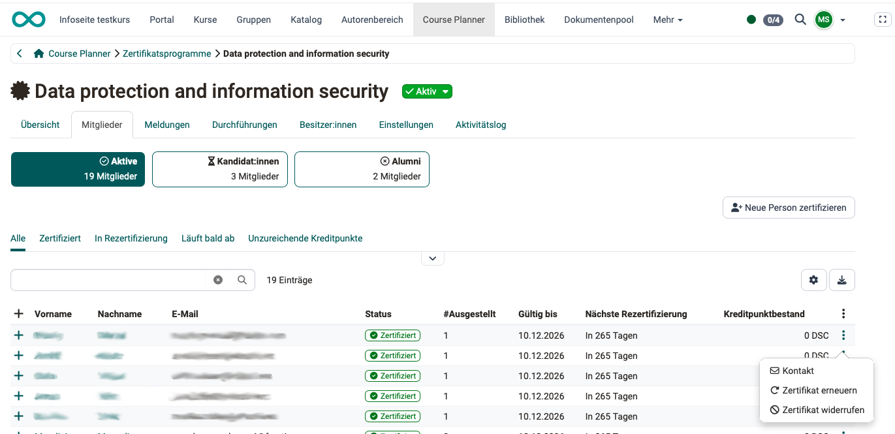{ class="shadow lightbox" }

!!! info "Wichtig"

    Wenn Kreditpunkte für den Erwerb eines Zertifikats gezahlt werden müssen, zieht es auch bei manueller Zertifikatserteilung Kreditpunkte ab.

[Zum Seitenanfang ^](#certification_programs)

---

## Ablage und Download von Zertifikaten {: #download_certificates}

Abgelaufene Zertifikate werden in OpenOlat nicht einfach gelöscht, sondern in der Datenbank abgelegt. Sie sind weiterhin für berechtigte Personen abrufbar.

**Zugriff durch Teilnehmer:innen** 
Teilnehmer:innen finden alle einmal erworbenen Zertifikate weiterhin im **persönlichen Menü**.

**Zugriff durch Betreuer:innen** 
Betreuer:innen sehen abgelaufene Zertifikate ihrer betreuten Personen im **Bewertungswerkzeug** oder im **Coachingtool**.

**Zugriff durch Besitzer:innen** 
Besitzer:innen eines Zertifikatsprogramms finden alle abgelaufenen Zertifikate eines Zertifikatsprogramms weiterhin unter  `Course Planner > Zertifikatsprogramm > Tab Mitglieder > Button Alumni` in den Details der einzelnen Mitglieder (Klick auf Plus-Symbol vor einer Zeile).  Die PDF-Zertifikate (auch abgelaufene) können dort einzeln angesehen und heruntergeladen werden.

**Zugriff durch Benutzerverwalter:innen** 
Wird eine Teilnehmer:in in der Benutzerverwaltung ausgewählt, befindet sich dort ein **Tab "Zertifikate"**, unter dem alle Zertifikate dieser Person aufgelistet sind.

[Zum Seitenanfang ^](#certification_programs)

---

## Weitere Informationen {: #further_information}

[Wie kann ich mit dem Course Planner Zertifikatsprogramme erstellen? (Schritt für Schritt-Anleitung) >](../../manual_how-to/certification_programs/certification_programs.de.md) 
[Zertifikate in Einzelkursen >](../learningresources/Course_Settings_Assessment_Certificate.de.md) 
[Zertifikate im persönlichen Menü >](../../manual_user/personal_menu/Certificates.de.md) 
[Course Planner: Durchführungen >](../area_modules/Course_Planner_Implementations.de.md) 
[Kreditpunkte im persönlichen Menü >](../../manual_user/personal_menu/Credit_Points.de.md) 
[Kreditpunkte (Administration) >](../../manual_admin/administration/e-Assessment_Credit_Points.de.md) 

[Zum Seitenanfang ^](#certification_programs)