# Course Planner: Zertifikatsprogramme {: #certification_programs}

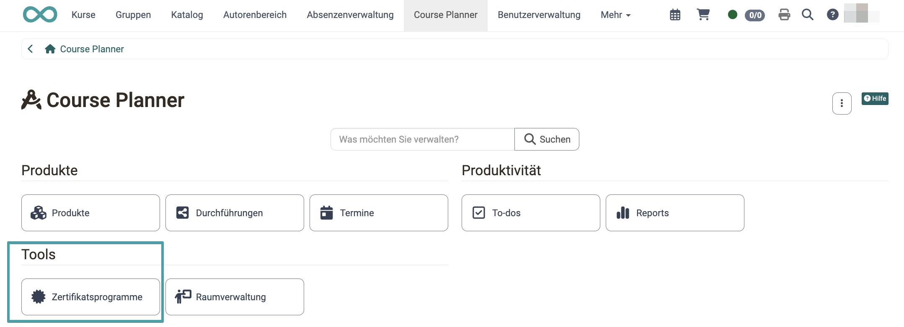{ class="shadow lightbox" title="Startseite des Course Planners" }

## Was ist ein Zertifikatsprogramm? [:octicons-tag-16:{ title="ab Release 20.2 (OO-8559)" }](https://track.frentix.com/issue/OO-8559){:target="_blank"} {: #description}

Als Bestätigung für den Besuch eines Kurses bzw. der Erreichung von bestimmten kursbezogenen Aktivitäten kann ein Zertifikat ausgestellt werden. Es ist auch möglich, ohne die Verwendung eines Leistungsnachweises ein Zertifikat auszustellen.

Zertifikate für einen **einzelnen Kurs** werden in der `Kurs > Administration > Einstellungen > Bewertung` aktiviert und konfiguriert.

{ class="shadow lightbox" title="Lernphase und Ausübungsphase eines Zertifikats" }

Ein Zertifikat für den **Besuch einer Durchführung** oder den **Besuch mehrerer Kurse** hingegen, kann mit dem **Zertifikatsprogramm** ausgestellt werden. Solche Zertifikate werden innerhalb des **Course Planners** (Durchführung) vergeben. Die Personen können in ein Zertifikatsprogramm aufgenommen werden und erforderliche Rezertifizierungen können dort gemanaged werden: `Course Planner > Zertifikatsprogramme`

{ class="shadow lightbox" title="Mitgliedschaft mit bestandener Rezertifizierung" }

Erfüllt ein Mitglied erforderliche Rezertifizierungskriterien nicht, wird die Mitgliedschaft (automatisch) beendet.

{ class="shadow lightbox" title="Mitgliedschaft endet nach nicht bestandener Rezertifizierung" }

Andererseits ist die Mitgliedschaft in einem Zertifikatsprogramm auch bereits für Kandidat:innen möglich, kann also bereits vor der ersten Zertifizierung beginnen.

{ class="shadow lightbox" title="Mitgliedschaft ab der Lernphase" }

| Zertifikat im Kurs   | Zertifikat im Zertifikatsprogramm |
| -------------------- | ------------------------------------------- |
| Zertifikat für einen einzelnen Kurs | Zertifikat für eine Durchführung oder für mehrere Kurse |
| pro Kurs | pro Durchführung |
| `Kurs > Administration > Einstellungen > Bewertung` | `Course Planner > Zertifikatsprogramme` |
| Rezertifizierung: ja   | Rezertifizierung: ja |
| --- | Verwendung von Kreditpunkten |

!!! tip "Mögliche Einsatzgebiete"

    Sicherheitsschulungen 
    Compliance-Schulungen 
    [Datenschutz-Zertifikate mit Kreditpunkten >](../../manual_how-to/certification_programs/certification_programs.de.md#use_case_1) 
    [Ausbildungsprogramme mit automatischer Rezertifizierung >](../../manual_how-to/certification_programs/certification_programs.de.md#use_case_2) 
    [Führungskräfteentwicklung mit flexiblen Lernpfaden >](../../manual_how-to/certification_programs/certification_programs.de.md#use_case_3) 

[Zum Seitenanfang ^](#certification_programs)

---

## Zertifikatsprogramm erstellen [:octicons-tag-16:{ title="ab Release 20.2 (OO-8559)" }](https://track.frentix.com/issue/OO-8559){:target="_blank"} {: #create}

Um ein neues Zertifikatsprogramm zu erstellen, klicken Sie im 
`Course Planner > Zertifikatsprogramme > Zertifikatsprogramm erstellen`

[Zum Seitenanfang ^](#certification_programs)

---

## Zertifikatsprogramm einrichten [:octicons-tag-16:{ title="ab Release 20.2 (OO-8559)" }](https://track.frentix.com/issue/OO-8559){:target="_blank"} {: #config}

Öffnen Sie ein Zertifikatsprogramm, indem Sie in der Liste auf dessen Namen klicken. Anschliessend konfigurieren Sie es in den verschiedenen Tabs. Eine Schritt-für-Schritt-Anleitung zum Einrichten finden Sie hier: 
[Wie kann ich mit dem Course Planner Zertifikatsprogramme erstellen? >](../../manual_how-to/certification_programs/certification_programs.de.md)

[Zum Seitenanfang ^](#certification_programs)

---

### Status {: #config_status}

Ein Zertifikatsprogramm kann vom Status "Aktiv" auf "Inaktiv" gesetzt werden. Dies ist insbesondere während der Erstellung hilfreich.   

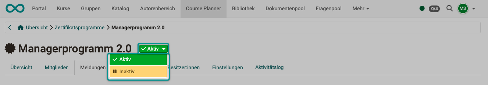{ class="shadow lightbox" title="Geöffnetes Zertifikatsprogramm" }

[Zum Seitenanfang ^](#certification_programs)

---

### Tab Übersicht [:octicons-tag-16:{ title="ab Release 20.2 (OO-8816)" }](https://track.frentix.com/issue/OO-8816){:target="_blank"} {: #config_tab_overview}

Die Übersichtsseite des Zertifikatsprogramms zeigt ein Widget **Aktive Mitglieder**. Es nennt die Anzahl der Mitglieder nach Status:

* Aktive
* Zertifiziert
* Läuft bald ab
* In Rezertifizierung

"Läuft bald ab" erscheint nur, wenn die Gültigkeit eingeschaltet ist, "In Rezertifizierung" nur mit eingeschalteter Rezertifizierung. Ein Klick auf eine Kennzahl öffnet den Tab "Mitglieder" mit der passenden Auswahl: "Aktive" mit allen aktiven Mitgliedern, die übrigen Kennzahlen mit dem gleichnamigen Tab über der Liste.

Darunter listet das Widget bis zu fünf zertifizierte Mitglieder mit den Spalten "Mitglied", "Saldo" (nur wenn das Zertifikatsprogramm Kreditpunkte verlangt) und "Gültig bis" (nur mit eingeschalteter Gültigkeit). Mit eingeschalteter Gültigkeit stehen die Mitglieder zuoberst, deren nächste Rezertifizierung zuerst fällig ist. Der Button "Alle anzeigen" öffnet die vollständige Liste im Tab "Mitglieder". Wie eine Übersichtsseite aufgebaut ist und wie Sie die Kacheln anordnen, ist einmal zentral beschrieben: [Übersichtsseiten und Widgets >](../basic_concepts/Dashboard_Concept.de.md)

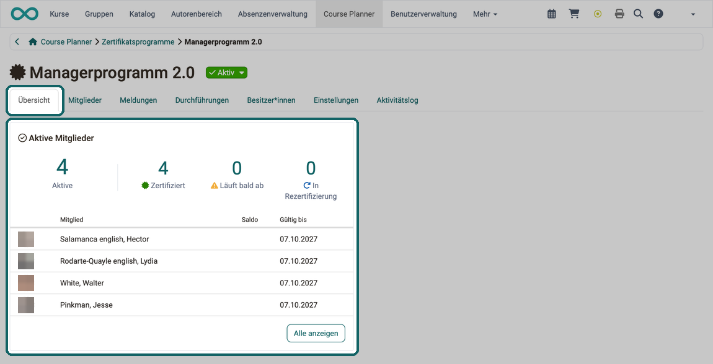{ class="shadow lightbox" title="Tab Übersicht eines Zertifikatsprogramms · 2026.10.07" }

[Zum Seitenanfang ^](#certification_programs)

---

### Tab Mitglieder {: #config_tab_members}

Um weitere Personen in das Zertifikatsprogramm aufzunehmen und ihnen die Möglichkeit zum Erwerb eines Zertifikats zu ermöglichen, verwenden Sie den **Button "Neue Person zertifizieren"**.

Jede Person im Zertifikatsprogramm hat einen **Mitgliedschaftsstatus**:

* **Aktives Mitglied**: Die Person besitzt in diesem Zertifikatsprogramm ein Zertifikat und ist damit zertifiziertes, aktives Mitglied.
* **Kandidat:in**: Die Person nimmt an einer mit dem Zertifikatsprogramm verknüpften Durchführung teil, besitzt aber in diesem Programm noch kein Zertifikat. Die Mitgliedschaft kann so bereits vor der ersten Zertifizierung beginnen.
* **Alumni**: Die Person ist aus dem Zertifikatsprogramm ausgeschieden, zum Beispiel nach Ablauf eines Zertifikats ohne Rezertifizierung.

Beim Hinzufügen über den Assistenten "Neue Person zertifizieren" wird der aktuelle Mitgliedschaftsstatus jeder gewählten Person angezeigt.

Wird eine zur Rezertifizierung geforderte Ausbildung/Massnahme nicht erfüllt, läuft ein Zertifikat ab und die betreffende Person scheidet automatisch aus dem Zertifikatsprogramm aus. Dies ist z.B. bei sicherheitsrelevanten Zertifizierungen oft ein notwendiger Automatismus.

Die Kacheln "Aktive", "Kandidat:innen" und "Alumni" über der Liste wechseln zwischen den drei Gruppen. Unter "Alumni" finden Besitzer:innen eines Zertifikatsprogramms die ausgeschiedenen Personen, so können sie diese schnell identifizieren und kontaktieren.

In der Liste der aktiven Mitglieder grenzen die Tabs "Alle", "Zertifiziert", "In Rezertifizierung", "Läuft bald ab" und "Unzureichende Kreditpunkte" die Liste ein. Ein Tab erscheint nur, wenn das Zertifikatsprogramm die zugehörige Einstellung nutzt: Gültigkeit, Rezertifizierung mit Zeitfenster oder Kreditpunkte. Die Spalte "Nächste Rezertifizierung" zeigt, wann eine Person ihr Zertifikat erneuern muss, die Spalte "Kreditpunktbestand", wie viele Kreditpunkte sie dafür hat.

Unter den 3 Punkten am Ende einer Listenzeile stehen die Aktionen für die betreffende Person: "Kontakt", "Zertifikat erneuern" (nur mit eingeschalteter Rezertifizierung), "Zertifikat widerrufen", "Zertifikat exportieren" und "Druckzertifikat exportieren" (nur mit Druckversion). Mit "Zertifikat widerrufen" ziehen Sie zum Beispiel ein zu Unrecht automatisch ausgestelltes Zertifikat manuell zurück.

Der Button "Zertifikat exportieren" über der Liste exportiert die Zertifikate der Personen in der Liste als PDF-Dateien. Ist die Druckversion eingeschaltet, enthält das Ausklappmenü daneben "Druckzertifikat exportieren".

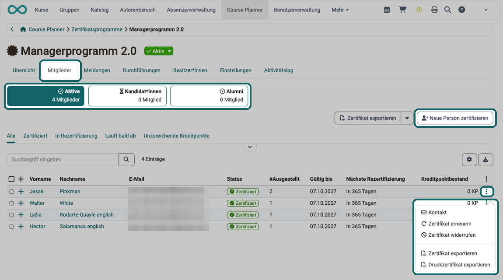{ class="shadow lightbox" title="Tab Mitglieder eines Zertifikatsprogramms · 2026.10.07" }

#### Zertifikat-Status [:octicons-tag-16:{ title="ab Release 21.1 (OO-9128)" }](https://track.frentix.com/issue/OO-9128){:target="_blank"} {: #certificate_status}

Nach einer Zertifizierung vieler Personen wollen Sie wissen, ob jedes Zertifikat schon als PDF-Datei bereitsteht. Der Zertifikat-Status beantwortet das je Zertifikat, unabhängig vom Mitgliedschaftsstatus der Person.

OpenOlat stellt ein Zertifikat sofort aus und erzeugt die PDF-Datei danach im Hintergrund. Das gilt für jeden Weg der Ausstellung, auch für den Assistenten "Neue Person zertifizieren" und die automatische Rezertifizierung. Seriennummer, Ausstellungsdatum und Gültigkeitsdauer stehen ab der Ausstellung fest, das Zertifikat ist gültig. Betroffen ist allein die PDF-Datei.

Den Zertifikat-Status sehen Sie in der Detailansicht eines Mitglieds, die Sie mit dem Plus-Zeichen vor der Zeile aufklappen. Wie die Detailansicht mit der Spalte "Zertifikat" aussieht, zeigt das Bild unter [Übersicht über ausgestellte Zertifikate >](#issued_certificates). Ist die PDF-Datei bereit, öffnen Sie sie in der Spalte "Zertifikat" mit einem Klick auf den Dateinamen. Fehlt sie noch, lässt sich der Dateiname nicht anklicken, und daneben steht einer dieser Vermerke:

* **Hängig**: Die PDF-Datei wird erzeugt. Sie steht in der Regel nach kurzer Zeit bereit, bei vielen gleichzeitig ausgestellten Zertifikaten auch später.
* **Fehler** mit dem Tooltip "Fehler, neuer Versuch folgt": Die Erzeugung ist gescheitert, und OpenOlat versucht es automatisch erneut. Sie müssen nichts tun.
* **Fehler** ohne Tooltip: Alle automatischen Versuche sind aufgebraucht. Administrator:innen erzeugen die PDF-Datei in der System-Administration neu: [Tab Wartung >](../../manual_admin/administration/e-Assessment_Certificates.de.md#tab_maintenance)

Mit dem Filter "Zertifikat-Status" grenzen Sie die Liste der aktiven Mitglieder auf die Personen ein, bei denen eine PDF-Datei noch fehlt. Er ist nicht von Anfang an eingeblendet, Sie fügen ihn bei den Filtern der Tabelle hinzu. Die Auswahl enthält "Hängig" und zweimal "Fehler": Der erste Eintrag "Fehler" steht für die Zertifikate, bei denen OpenOlat es erneut versucht, der zweite für die Zertifikate ohne weitere Versuche.

[Zum Seitenanfang ^](#certification_programs)

---

### Tab Meldungen [:octicons-tag-16:{ title="ab Release 20.2 (OO-8813)" }](https://track.frentix.com/issue/OO-8813){:target="_blank"} {: #config_tab_messages}

Meldungen und Erinnerungen beziehen sich immer auf die aktuelle Konfiguration. Im oberen Bereich können Sie diese nochmals kontrollieren.

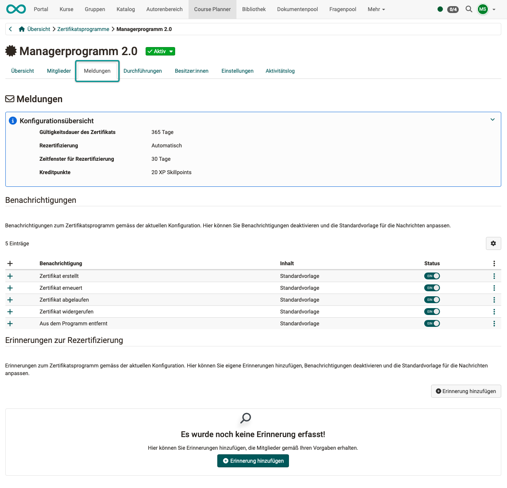{ class="shadow lightbox" title="Tab Meldungen eines Zertifikatsprogramms" }

**Benachrichtigungen** 
Im Abschnitt Benachrichtigungen finden Sie **vorbereitete Benachrichtigungen** zum Zertifikatsprogramm gemäss der aktuellen Konfiguration. Sie können diese Benachrichtigungen nach Bedarf aktivieren/deaktivieren und die Standardvorlagen für die Nachrichten anpassen. (Sie finden den Button zur Anpassung einer Vorlage unter den 3 Punkten oder wenn Sie die Detailansicht geöffnet haben.)

**Erinnerungen zur Rezertifizierung** 
Zusätzlich können Sie in einem weiteren Abschnitt eigene Erinnerungen anlegen, die dann automatisch gemäss Ihrer Konfiguration verschickt werden.

[Zum Seitenanfang ^](#certification_programs)

---

### Tab Durchführungen {: #config_tab_implementations}

Bedingung für die Erlangung eines Zertifikates ist das erfolgreiche Absolvieren einer der hier aufgelisteten Durchführungen (ODER-Verknüpfung, es genügt eine der hier aufgelisteten Durchführungen). Ob es sich um Durchführungen des genau gleichen Produkts oder Kurses handelt, spielt keine Rolle. Deshalb ist die Auswahl mit Bedacht zu treffen um eine Gleichwertigkeit zu gewährleisten.

Durchführungen vom Typ Einzelkurs können auch direkt in der Durchführung mit dem Zertifikatsprogramm verknüpft werden: in den Einstellungen der Durchführung im Unter-Tab "Bewertung". [:octicons-tag-16:{ title="ab Release 21.0 (OO-9499)" }](https://track.frentix.com/issue/OO-9499){:target="_blank"} 
[Mehr dazu >](Course_Planner_Implementations.de.md#tab_settings_assessment)

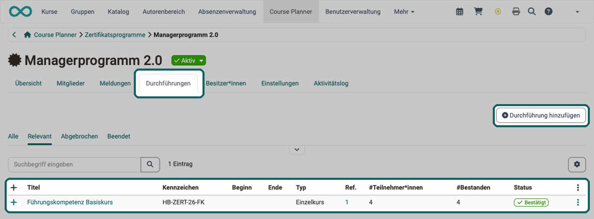{ class="shadow lightbox" title="Tab Durchführungen eines Zertifikatsprogramms · 2026.10.07" }

Die Liste zeigt je Durchführung unter anderem die Spalten "#Teilnehmer:innen" und "#Bestanden": Sie sehen, wie viele Personen teilnehmen und wie viele davon bestanden haben. Mit den Tabs "Alle", "Relevant", "Abgebrochen" und "Beendet" grenzen Sie die Liste ein.

Mit **Klick auf das Plus-Zeichen** vor einem Listeneintrag zeigen Sie die Details dieser Durchführung an. (Bzw. Sie schliessen mit Klick auf das Minus-Zeichen die Details.) Im Bereich **Kurs** sehen Sie den verknüpften Kurs als Kachel, bei mehreren Kursen heisst der Bereich **Kurse**. Die Kachel zeigt den Titel und den technischen Typ des Kurses, den Zeitraum und den Stand der Teilnehmenden: den durchschnittlichen Fortschritt, wie viele Personen bestanden, nicht bestanden oder keine Angabe haben, die durchschnittlichen Punkte und die Zahl der Teilnehmer:innen.

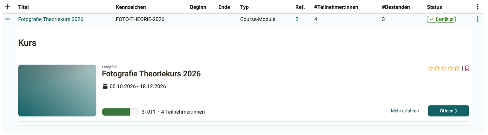{ class="shadow lightbox" title="Details einer Durchführung im Tab Durchführungen" }

Mit Klick auf **Mehr erfahren** öffnen Sie die Infoseite des Kurses. Mit Klick auf **Öffnen** gelangen Sie direkt in den Kurs.

!!! tip "Empfehlung"

    Unter dem Icon mit den 3 Punkten am Ende einer Zeile können Sie die Durchführung auch in einem separaten Browser-Tab öffnen. Das ist für die Bearbeitung oft hilfreich.

[Zum Seitenanfang ^](#certification_programs)

---

### Tab Besitzer:innen {: #config_tab_owners}

Verwenden Sie diesen Tab, um dem aktuellen Zertifikatsprogramm weitere Besitzer:innen hinzuzufügen oder sie zu entfernen.

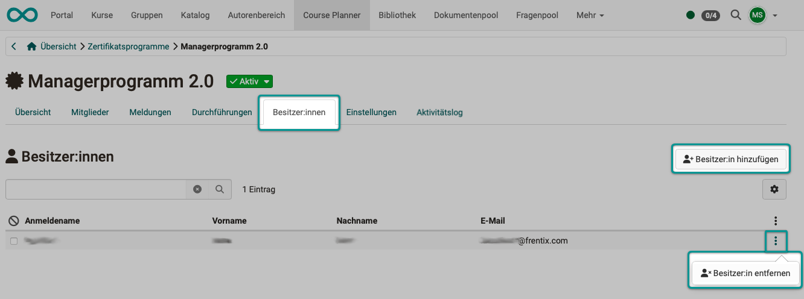{ class="shadow lightbox" title="Tab Besitzer:innen eines Zertifikatsprogramms" }

[Zum Seitenanfang ^](#certification_programs)

---

### Tab Einstellungen {: #config_tab_settings}
In den Einstellungen definieren Sie,

* welchen Titel das Zertifikatsprogramm trägt
* wer administrativ auf dieses Zertifikatsprogramm zugreifen kann
* wie lange das Zertifikat gültig ist
* ob und wie eine Rezertifizierung erfolgt
* ob und wie viele Kreditpunkte eine Rezertifizierung kostet
* welches pdf-Zertifikat vergeben wird

**Button "Metadaten"** 
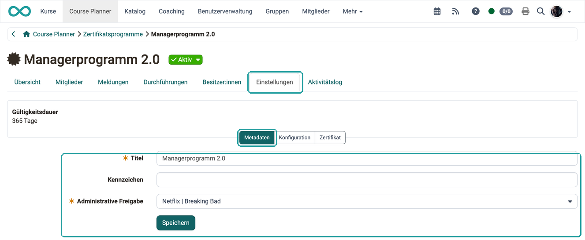{ class="shadow lightbox" title="Bereich Metadaten im Tab Einstellungen" }

 

**Button "Konfiguration"** 
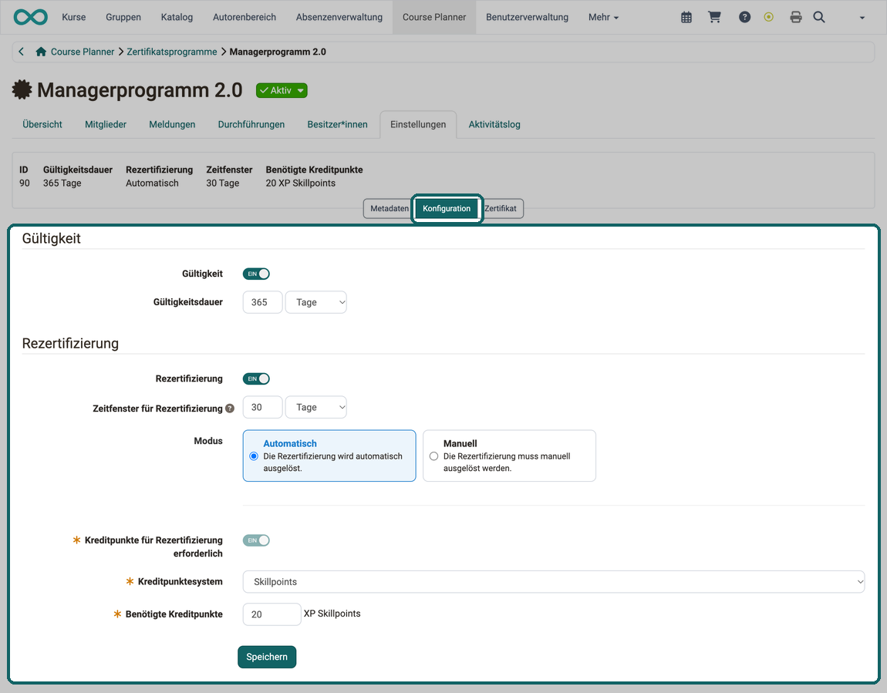{ class="shadow lightbox" title="Bereich Konfiguration im Tab Einstellungen · 2026.10.07" }

Unter dem Button "Konfiguration" legen Sie fest, wie lange ein Zertifikat gilt und wie es danach erneuert wird. Im Abschnitt "Gültigkeit" schalten Sie "Gültigkeit" ein und setzen die "Gültigkeitsdauer". Erst mit einer Gültigkeit lässt sich im Abschnitt "Rezertifizierung" der Schalter "Rezertifizierung" einschalten. Danach stehen diese Einstellungen zur Verfügung:

* **Zeitfenster für Rezertifizierung**: Wie lange Teilnehmer:innen nach Ablauf ihres Zertifikats Zeit haben, es zu erneuern. In dieser Zeit ist das Zertifikat abgelaufen, lässt sich aber noch erneuern.
* **Modus "Automatisch"**: OpenOlat erneuert das Zertifikat selbst, sobald es abgelaufen ist, und zieht dafür die benötigten Kreditpunkte vom Guthaben der Person ab. Reicht das Guthaben bis zum Ende des Zeitfensters nicht, scheidet die Person aus dem Zertifikatsprogramm aus.
* **Modus "Manuell"**: OpenOlat erneuert das Zertifikat nicht selbst. Besitzer:innen erneuern es im Tab "Mitglieder" unter den 3 Punkten am Ende der Zeile, oder die Person schliesst eine verknüpfte Durchführung erneut erfolgreich ab.
* **Kreditpunkte für Rezertifizierung erforderlich**: Eine Erneuerung durch OpenOlat oder durch Besitzer:innen kostet die unter "Benötigte Kreditpunkte" eingetragene Zahl Kreditpunkte aus dem gewählten "Kreditpunktesystem". Reicht das Guthaben der Person nicht, ist keine Erneuerung möglich. Im Modus "Automatisch" ist dieser Schalter immer eingeschaltet und lässt sich nicht ausschalten, weil die automatische Erneuerung über Kreditpunkte läuft.

Das erste Zertifikat kostet keine Kreditpunkte. Wer eine verknüpfte Durchführung erneut besteht, erhält das neue Zertifikat ebenfalls ohne Abzug.

 

**Button "Zertifikat"** 
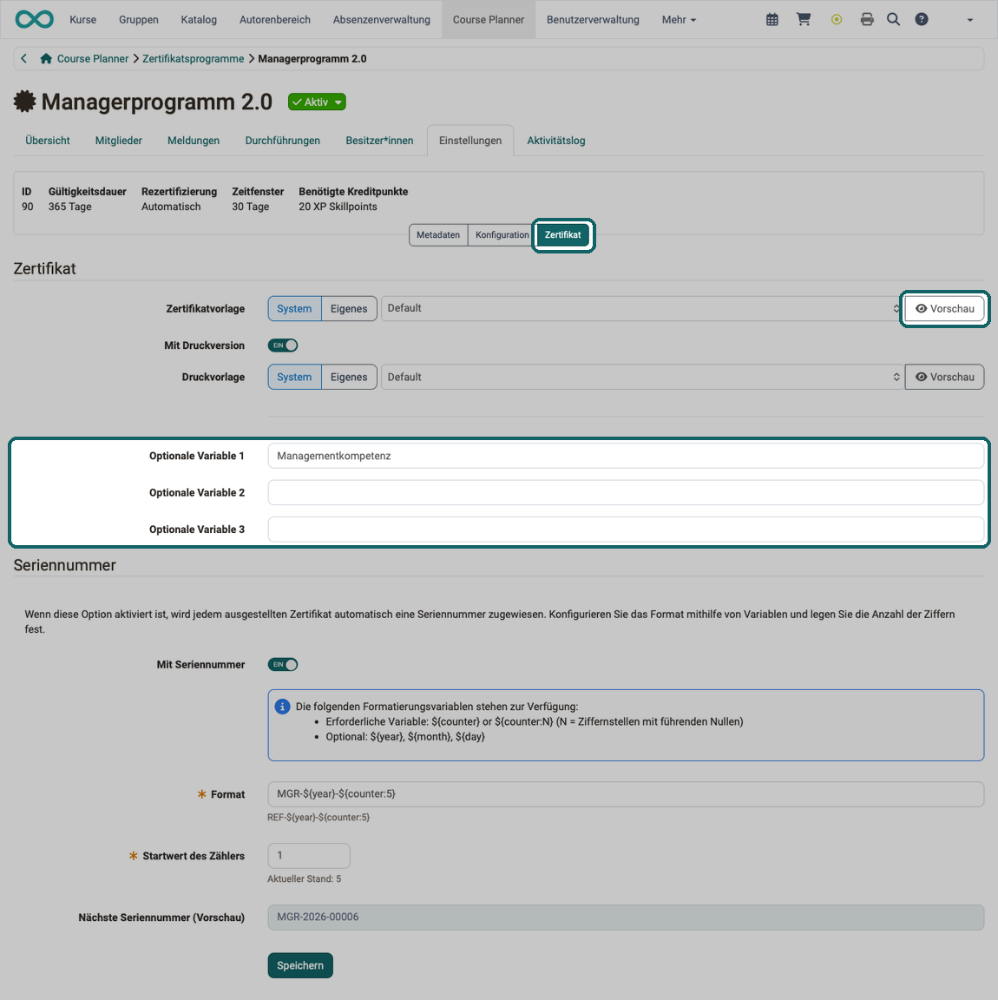{ class="shadow lightbox" title="Bereich Zertifikat im Tab Einstellungen · 2026.10.07" }

Unter dem Button "Zertifikat" legen Sie fest, welche Zertifikatsvorlage im Zertifikatsprogramm verwendet wird: eine systemweite Vorlage ("System") oder eine eigene Datei ("Eigenes"). Zusätzlich stehen folgende Optionen zur Verfügung:

**Optionale Variablen** 
In den Feldern "Optionale Variable 1" bis "Optionale Variable 3" hinterlegen Sie Angaben, die auf jedem Zertifikat dieses Zertifikatsprogramms gleich sind. Die Vorlage setzt sie an den Stellen der Variablen `$custom1` bis `$custom3` ein. [Mehr zu den Variablen in der Zertifikatsvorlage >](../learningresources/Course_Settings_Assessment_Certificate.de.md#certificate_variables)

**Vorschau** 
Der Button "Vorschau" neben der Vorlage erzeugt die PDF-Datei "Certificate_preview.pdf" mit Beispieldaten und den eingetragenen optionalen Variablen. So prüfen Sie Layout und Platzierung, bevor Sie das erste Zertifikat ausstellen.

**Seriennummer** 

Mit der Option **"Mit Seriennummer"** erhält jedes ausgestellte Zertifikat automatisch eine fortlaufende, menschenlesbare Seriennummer [:octicons-tag-16:{ title="ab Release 21.0 (OO-9567)" }](https://track.frentix.com/issue/OO-9567). Das **Format** legen Sie über Variablen fest: `${counter}` bzw. `${counter:N}` (Zähler, optional mit führenden Nullen bei N Stellen) sowie optional `${year}`, `${month}` und `${day}`, z.B. `REF-${year}-${counter:5}`. Über den **Startwert des Zählers** bestimmen Sie, bei welcher Nummer die Zählung beginnt. Format und Startwert sind Pflichtfelder, sobald die Option eingeschaltet ist; das Feld "Nächste Seriennummer (Vorschau)" zeigt nach dem Speichern die Nummer, die als nächste vergeben wird. Die Seriennummer wird bei jeder Ausstellung neu vergeben, auch bei einer Rezertifizierung, und steht im Dateinamen des PDF. Auf dem Zertifikat erscheint sie, sobald die verwendete Vorlage die Variable `$certificateSerialNumber` enthält. Im Tab "Mitglieder" und in der Detailansicht einer Person lässt sich die Spalte "Seriennummer" einblenden; standardmässig ist sie ausgeblendet.

<h4>Druckversion für vorgedrucktes Papier</h4>

Mit der Option **"Mit Druckversion"** aktivieren Sie eine zusätzliche **Druckvorlage** für vorgedrucktes Papier [:octicons-tag-16:{ title="ab Release 21.0 (OO-9568)" }](https://track.frentix.com/issue/OO-9568). Besitzer:innen des Zertifikatsprogramms können damit zusätzlich zum Standard-Zertifikat ein **Druckzertifikat exportieren**. Die Aktion steht im Tab "Mitglieder" zur Verfügung: für eine einzelne Person unter den 3 Punkten am Ende der Listenzeile oder in der Detailansicht, für mehrere Personen nach dem Markieren der Zeilen und für alle Personen der Liste im Ausklappmenü neben dem Button "Zertifikat exportieren". Teilnehmende erhalten weiterhin nur das Standard-Zertifikat.

[Zum Seitenanfang ^](#certification_programs)

---

### Tab Aktivitätslog [:octicons-tag-16:{ title="ab Release 20.3 (OO-9110)" }](https://track.frentix.com/issue/OO-9110){:target="_blank"} {: #config_tab_activitylog}

Wollen Sie wissen, wer im Zertifikatsprogramm wann etwas geändert hat und wie der Wert vorher lautete, finden Sie die Antwort im Tab "Aktivitätslog". Jede Zeile nennt "Datum", "Kontext" (Durchführung, Mitglied, Meldung, Besitzer oder Einstellungen), "Objekt", "Aktivität" und die "Benutzer:in", die die Änderung vorgenommen hat. Bei einer Änderung zeigen die Spalten "Originalwert" und "Neuer Wert" den Wert vorher und nachher, so sehen Sie die Änderung selbst.

Die Tabs "Alle", "Letzte 7 Tage", "Letzte 4 Wochen" und "Letzte 12 Monate" grenzen den Zeitraum ein; beim Öffnen ist "Letzte 7 Tage" gewählt. Mit den Filtern "Kontext", "Aktivität", "Mitglied" und "Benutzer:in" suchen Sie gezielt. Im Tab "Alle" steht zusätzlich der Filter "Datum" zur Verfügung, in den übrigen Tabs legt der Tab den Zeitraum fest. Die Filterleiste klappen Sie mit dem Pfeil unter den Tabs auf und zu.

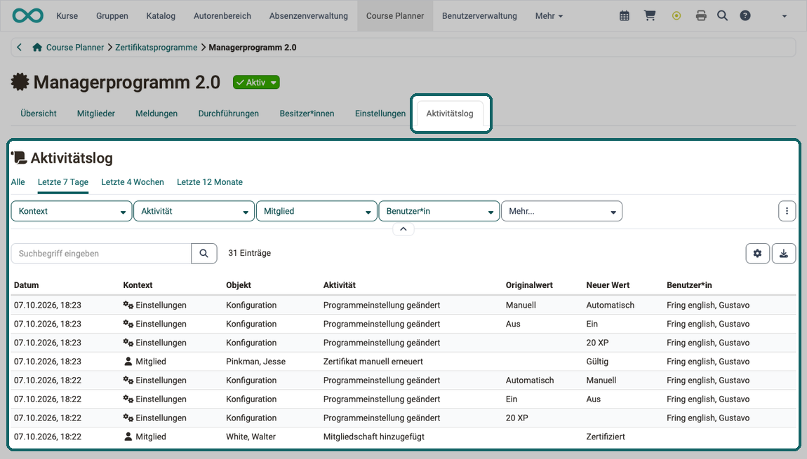{ class="shadow lightbox" title="Tab Aktivitätslog eines Zertifikatsprogramms · 2026.10.07" }

[Zum Seitenanfang ^](#certification_programs)

---

## Zertifikatsprogramm und Kreditpunkte [:octicons-tag-16:{ title="ab Release 20.2 (OO-8559)" }](https://track.frentix.com/issue/OO-8559){:target="_blank"} {: #credit_points}

**Kreditpunkte als Voraussetzung** 
Wie bereits weiter oben erklärt, können Sie für eine Rezertifizierung zur Voraussetzung machen, dass eine bestimmte Anzahl Kreditpunkte vorher erworben wurde. Wieviele Kreditpunkte für eine Rezertifizierung erforderlich sind, wird eingestellt unter 
`Course Planner > Zertifikatsprogramme > "Programmtitel" > Tab Einstellungen > Button "Konfiguration"` 

**Kreditpunkte als Zahlungsmittel** 
Erneuert das Zertifikatsprogramm ein Zertifikat, zieht es die benötigten Kreditpunkte vom Guthaben der Person ab. Das erste Zertifikat kostet keine Kreditpunkte.

[Zum Seitenanfang ^](#certification_programs)

---

## Übersicht über ausgestellte Zertifikate {: #issued_certificates}

Wer hat wann welches Zertifikat erhalten? Diese Frage stellen sich sowohl Besitzer:innen eines Zertifikatsprogramms, wie auch Betreuer:innen und die Teilnehmenden selbst. Je nach Rolle gibt es verschiedene Wege zu einem Überblick. 

### Übersicht für Zertifikatsprogrammbesitzer:innen 
Im `Course Planner > Zertifikatsprogramme > "Programmtitel" > Tab Mitglieder` finden Sie alle Teilnehmenden des Zertifikatsprogramms aufgelistet. Durch **Klick auf das Plus-Zeichen** vor einem Listeneintrag öffnen Sie die Detailansicht.
Die Tabelle "Zertifikate" zeigt dort alle Zertifikate der gewählten Person, auch abgelaufene und archivierte Zertifikate, mit den Spalten "Zertifikat", "Erstellt am", "Status", "Gültig bis", "Nächste Rezertifizierung", "Rezertifizierung Deadline" und "Widerrufen am". Fehlt die PDF-Datei eines Zertifikats noch, lässt sich der Dateiname nicht anklicken, und daneben steht der Vermerk "Hängig" oder "Fehler": [Zertifikat-Status >](#certificate_status) 
Die Tabelle "Kurse" darunter zeigt je Kurs der verknüpften Durchführungen "Kennzeichen", "Fortschritt", "Punkte" und "Bestanden" der Person.

Die Kacheln "Aktive", "Kandidat:innen" und "Alumni" und die Tabs über der Liste grenzen die Liste auf eine Gruppe ein: [Tab Mitglieder >](#config_tab_members)

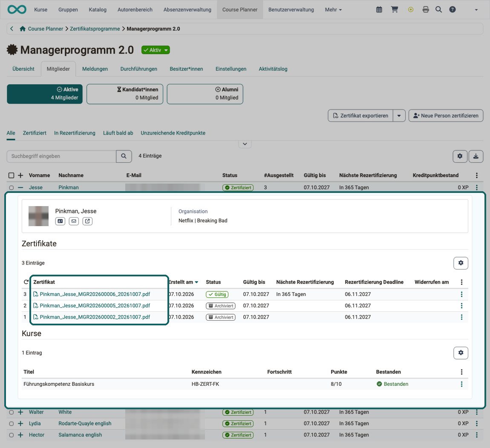{ class="shadow lightbox" title="Detailansicht im Tab Mitglieder · 2026.10.07" }

### Übersicht für Betreuer:innen
Als Betreuer:in behalten Sie den Überblick über die Zertifikate Ihrer betreuten Teilnehmer:innen weiterhin am einfachsten

* für einzelne Kurse im **Bewertungswerkzeug**
* für mehrere Kurse im **Coachingtool**

### Übersicht für Ausbildungsverantwortliche

Ausbildungsverantwortliche sehen alle Zertifikate aus unterschiedlichen Zertifikatsprogrammen und Kursen einzelner Teilnehmer:innen unter 
`Coaching > Ausbildungsverantwortliche > "Person" > Tab Zertifikate`

### Übersicht für Teilnehmer:innen [:octicons-tag-16:{ title="ab Release 20.2 (OO-8818)" }](https://track.frentix.com/issue/OO-8818){:target="_blank"}
Teilnehmende finden ihre Zertifikate im **persönlichen Menü** aufgeführt. Es spielt dabei keine Rolle, ob ein Zertifikat von einem Zertifikatsprogramm oder einem einzelnen Kurs stammt.

Ein eben ausgestelltes Zertifikat erscheint dort zuerst ohne Vorschaubild. In der Detailansicht trägt es den Vermerk "Hängig", und der Button "Zertifikat herunterladen" ist deaktiviert, bis die PDF-Datei bereitsteht. Teilnehmende sehen "Hängig" auch dann, wenn die Erzeugung gescheitert ist. 
[Mehr zu den Zertifikaten im persönlichen Menü >](../personal_menu/Certificates.de.md)

[Zum Seitenanfang ^](#certification_programs)

---

## Rezertifizierung mit dem Zertifikatsprogramm [:octicons-tag-16:{ title="ab Release 20.2 (OO-8559)" }](https://track.frentix.com/issue/OO-8559){:target="_blank"} {: #recertification}

**Voraussetzungen** 
Erste Voraussetzung für eine Rezertifizierung mit einem Zertifikatsprogramm ist die Mitgliedschaft der Teilnehmenden im Zertifikatsprogramm. 
`Course Planner > Zertifikatsprogramme > "Programmtitel" > Tab Mitglieder`

Zweite Voraussetzung ist ein vorhandenes Zertifikat mit einem Ablaufdatum. 
`Course Planner > Zertifikatsprogramme > "Programmtitel" > Tab Einstellungen > Button Konfiguration`

Drittens kann es sein, dass eine bestimmte Anzahl Kreditpunkte vorhanden sein muss, bevor eine Rezertifizierung möglich ist.

**Erneuerung durch Besitzer:innen des Zertifikatsprogramms** 
Besitzer:innen des Zertifikatsprogramms können ein noch gültiges Zertifikat jederzeit erneuern und damit verlängern unter 
`Course Planner > Zertifikatsprogramme > "Programmtitel" > Tab Mitglieder > Mitglied wählen > 3 Punkte`

**Rezertifizierungszeitraum** 
Mit dem Zeitfenster für Rezertifizierung legen Besitzer:innen des Zertifikatsprogramms fest, wie lange Teilnehmer:innen nach Ablauf ihres Zertifikats Zeit haben, es zu erneuern. Passende Informationen und Erinnerungen verschickt OpenOlat automatisch, eingerichtet im Tab "Meldungen". 
`Course Planner > Zertifikatsprogramme > "Programmtitel" > Tab Einstellungen > Button Konfiguration > Abschnitt Rezertifizierung`

[Zum Seitenanfang ^](#certification_programs)

---

## Zertifikate manuell ausstellen oder aberkennen/widerrufen {: #manual_certification}

Das Recht zum manuellen Ausstellen oder Aberkennen von Zertifikaten haben in erster Linie Besitzer:innen des jeweiligen Zertifikatsprogramms. 
Ausserdem haben auch Benutzer:innen mit den Rollen "Administrator:in" und "Kursplaner:in" administrativen Zugriff.

* Öffnen Sie mit Klick auf den Tab "Mitglieder" die Liste der Teilnehmer:innen. 
* Klicken Sie in der Zeile der betroffenen Teilnehmer:innen auf die 3 Punkte am Ende der Zeile.
* Dort werden Ihnen die Optionen zum Erneuern oder Widerrufen des Zertifikats angezeigt.

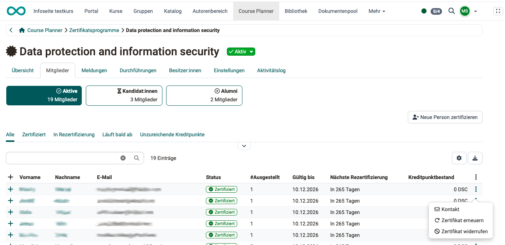{ class="shadow lightbox" title="Tab Mitglieder eines Zertifikatsprogramms" }

!!! info "Wichtig"

    Verlangt das Zertifikatsprogramm Kreditpunkte für die Rezertifizierung, zieht OpenOlat sie auch ab, wenn Besitzer:innen ein Zertifikat manuell erneuern.

[Zum Seitenanfang ^](#certification_programs)

---

## Ablage und Download von Zertifikaten {: #download_certificates}

Abgelaufene Zertifikate werden in OpenOlat nicht einfach gelöscht, sondern in der Datenbank abgelegt. Sie sind weiterhin für berechtigte Personen abrufbar.

**Zugriff durch Teilnehmer:innen** 
Teilnehmer:innen finden alle einmal erworbenen Zertifikate weiterhin im **persönlichen Menü**.

**Zugriff durch Betreuer:innen** 
Betreuer:innen sehen abgelaufene Zertifikate ihrer betreuten Personen im **Bewertungswerkzeug** oder im **Coachingtool**.

**Zugriff durch Besitzer:innen** 
Besitzer:innen eines Zertifikatsprogramms finden alle abgelaufenen Zertifikate eines Zertifikatsprogramms weiterhin unter  `Course Planner > Zertifikatsprogramme > "Programmtitel" > Tab Mitglieder > Button Alumni` in den Details der einzelnen Mitglieder (Klick auf Plus-Symbol vor einer Zeile).  Die PDF-Zertifikate (auch abgelaufene) können dort einzeln angesehen und heruntergeladen werden.

**Zugriff durch Benutzerverwalter:innen** 
Wird eine Teilnehmer:in in der Benutzerverwaltung ausgewählt, befindet sich dort ein **Tab "Zertifikate"**, unter dem alle Zertifikate dieser Person aufgelistet sind.

[Zum Seitenanfang ^](#certification_programs)

---

## Weiterführende Informationen {: #further_information}

**Auf dieser Seite erwähnt** 
[Wie kann ich mit dem Course Planner Zertifikatsprogramme erstellen? >](../../manual_how-to/certification_programs/certification_programs.de.md) 
[Übersichtsseiten und Widgets >](../basic_concepts/Dashboard_Concept.de.md) 
[e-Assessment Administration: Zertifikate >](../../manual_admin/administration/e-Assessment_Certificates.de.md) 
[Course Planner: Durchführungen >](../area_modules/Course_Planner_Implementations.de.md) 
[Kurseinstellungen - Tab Bewertung: Zertifikate und Rezertifizierung >](../learningresources/Course_Settings_Assessment_Certificate.de.md) 
[Persönliche Erfolge/Leistungen: Zertifikate >](../personal_menu/Certificates.de.md)

**Weiterführend** 
[Persönliche Erfolge/Leistungen: Kreditpunkte >](../personal_menu/Credit_Points.de.md) 
[e-Assessment Administration: Kreditpunkte >](../../manual_admin/administration/e-Assessment_Credit_Points.de.md)

[Zum Seitenanfang ^](#certification_programs)