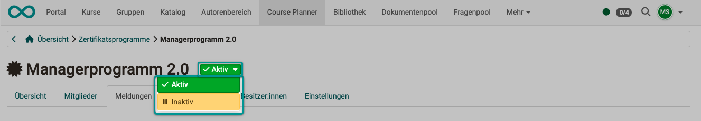
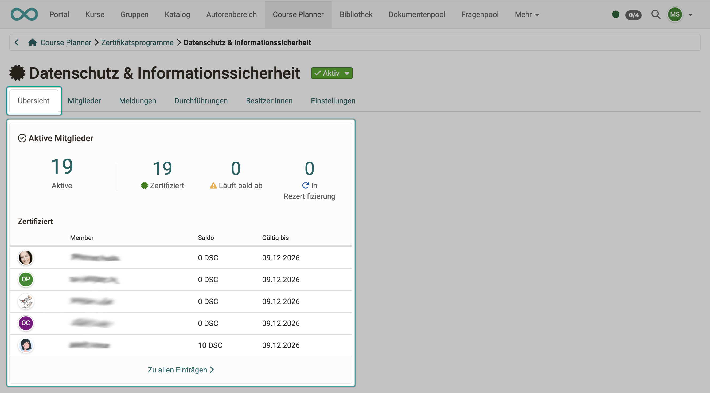
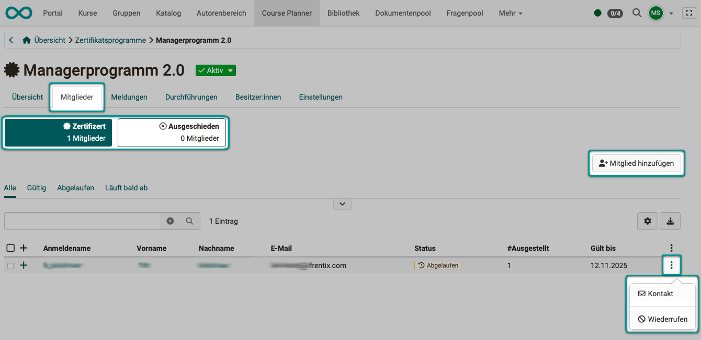
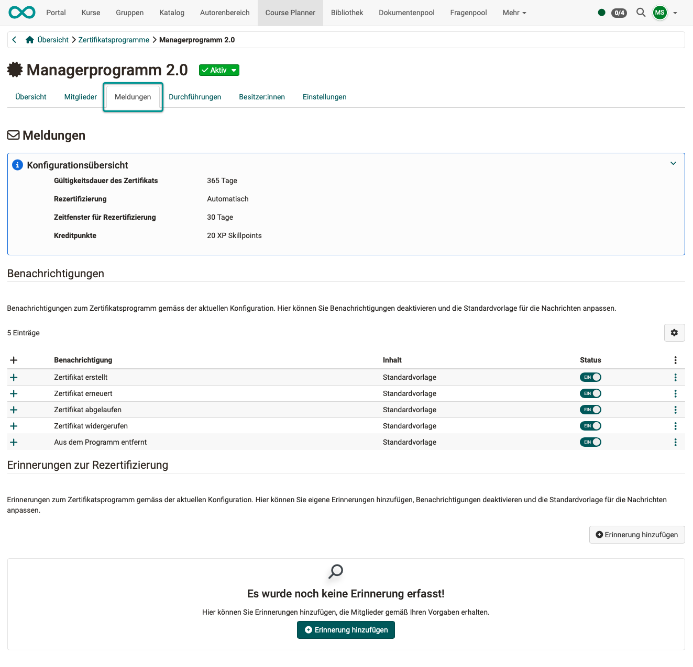
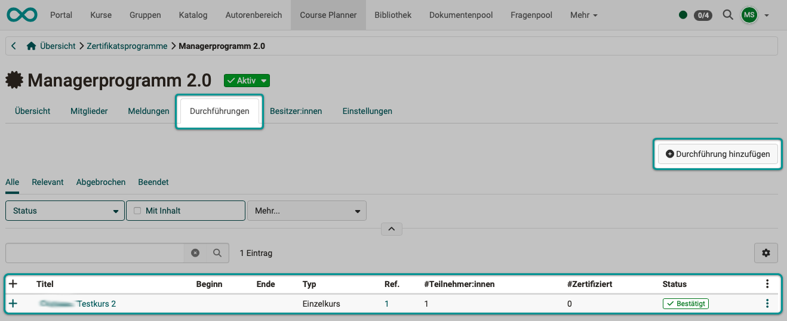
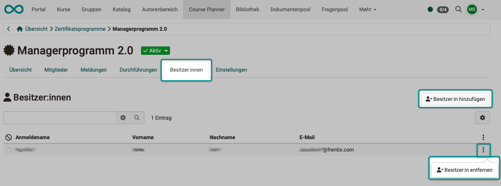
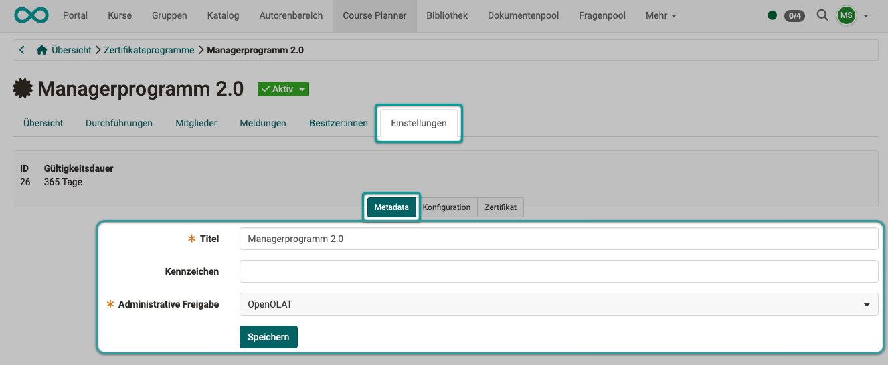
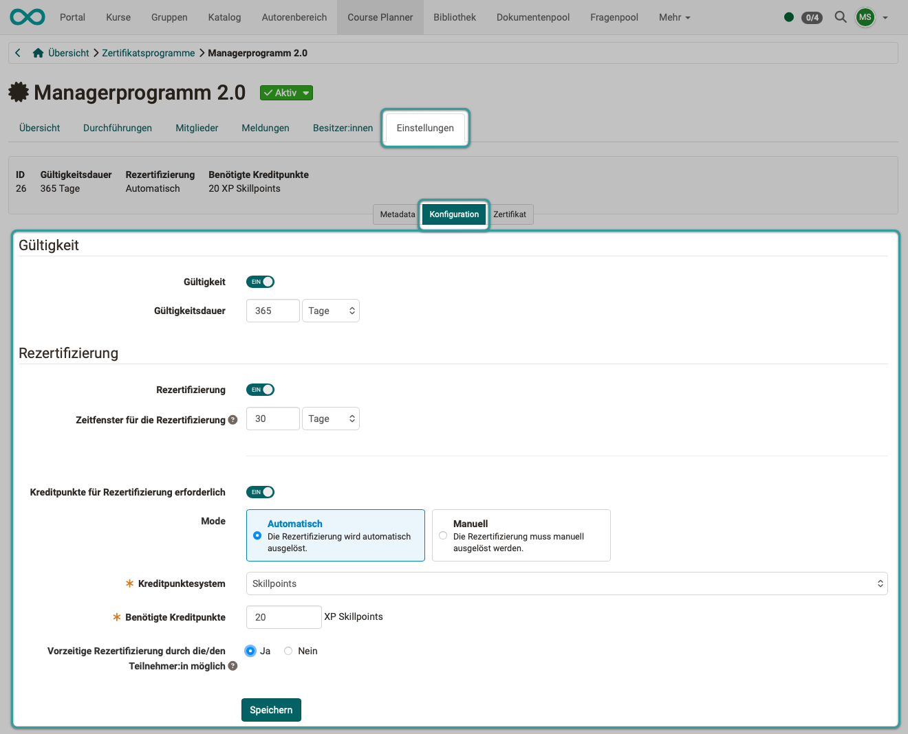
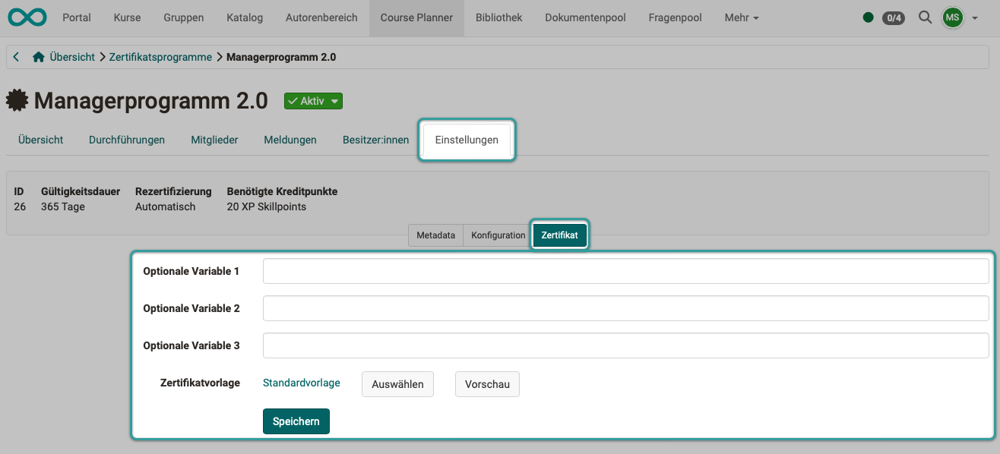

# Course Planner: Certification programs {: #certification_programs}

{ class="shadow lightbox" }

## What is a Certification Program? [:octicons-tag-16:{ title="from Release 20.2 (OO-8559)" }](https://track.frentix.com/issue/OO-8559){:target="_blank"} {: #description}

A certificate may be issued as confirmation of attendance at a course or completion of certain course-related activities. It is also possible to issue a certificate without using a transcript of records.

Certificates for a **single course** are activated and configured in `Course administration > Settings > Tab Assessment`.

{ class="shadow lightbox" }

A certificate for **attending one session** or **attending several courses**, on the other hand, can be issued using the **certificate program**. Such certificates are awarded within the **Course Planner** (session). Individuals can be enrolled in a certificate program, and any required recertifications can be managed there: `Course Planner > Certification program`

{ class="shadow lightbox" }

If a member does not meet the required recertification criteria, their membership will be terminated (automatically).

{ class="shadow lightbox" }

On the other hand, membership in a certificate program is also possible for candidates, meaning it can begin even before the first certification.

{ class="shadow lightbox" }

| Certificate in course   | Certificate in Certification Program |
| -------------------- | ------------------------------------------- |
| Certificate in a single course | Certificate for an implementation or for multiple courses |
| per course | per implementation |
| `Course administration > Settings > Tab Assessment` | `Course Planner > Certification program` |
| Recertification: yes   | Recertification: yes |
| --- | Usage of credit points |

!!! tip "Possible areas of application"

    Safety training 
    Compliance training 
    [Data protection certificates with credit points >](../../manual_how-to/certification_programs/certification_programs.md#use_case_1) 
    [Training programs with automatic recertification >](../../manual_how-to/certification_programs/certification_programs.md#use_case_2) 
    [Leadership development with flexible learning paths >](../../manual_how-to/certification_programs/certification_programs.md#use_case_3) 

[To the top of the page ^](#certification_programs)

---

## Create certificate program [:octicons-tag-16:{ title="from Release 20.2 (OO-8559)" }](https://track.frentix.com/issue/OO-8559){:target="_blank"} {: #create}

To create a new certificate program, click on the 
`Course Planner > Certification programs > Button "Create Certification program"`

{ class="shadow lightbox" }

[To the top of the page ^](#certification_programs)

---

## Certification program configuration [:octicons-tag-16:{ title="from Release 20.2 (OO-8559)" }](https://track.frentix.com/issue/OO-8559){:target="_blank"} {: #config}

Open a certificate program by clicking on its name in the list. Then configure it in the various tabs. Step-by-step instructions for setup can be found here: 
[How can I create certificate programs with Course Planner? >](../../manual_how-to/certification_programs/certification_programs.md)

{ class="shadow lightbox" }

[To the top of the page ^](#certification_programs)

---

### Status {: #config_status}

A certification program can be set from "Active" to "Inactive" status. This is particularly helpful during creation.   

{ class="shadow lightbox" }

[To the top of the page ^](#certification_programs)

---

### Tab Overview {: #config_tab_overview}

The overview shows you the number of members sorted by status at a glance:

* Active
* Certified
* Expiring soon
* In recertification

{ class="shadow lightbox" }

[To the top of the page ^](#certification_programs)

---

### Tab Members {: #config_tab_members}

To add more people to the certification program and give them the opportunity to earn a certificate, use the **"Add member" button**.

Every person in the certification program has a **membership status**:

* **Active member**: The person holds a certificate in this certification program and is therefore a certified, active member.
* **Candidate**: The person participates in an implementation linked to the certification program but does not yet hold a certificate in this program. Membership can thus begin before the first certification.
* **Alumni**: The person has left the certification program, for example after a certificate expired without recertification.

When adding people via the "Certify new users" wizard, the current membership status of each selected person is shown.

If a training course/measure required for recertification is not completed, a certificate expires and the person concerned is automatically removed from the certification program. This is often a necessary automatic process, for example in the case of safety-related certifications.

Individuals who have left the certification program can be viewed under a separate button. This allows certification program owners to quickly identify and contact them.

The three dots at the end of a list item allow certification program owners to contact the person in question. 
The option to revoke certificates can also be found here. This allows, for example, certificates that have been issued automatically in error to be withdrawn manually.

{ class="shadow lightbox" }

[To the top of the page ^](#certification_programs)

---

### Tab Messages {: #config_tab_messages}

Notifications and reminders always refer to the current configuration. You can check this again in the upper section.

{ class="shadow lightbox" }

**Notifications** 
In the Notifications section, you will find **pre-prepared notifications** for the certificate program according to the current configuration. You can enable/disable these notifications as needed and customize the default templates for the messages. (You can find the button for customizing a template under the three dots or when you have opened the detailed view.)

**Reminders for recertification** 
In addition, you can create your own reminders in another section, which will then be sent automatically according to your configuration.

[To the top of the page ^](#certification_programs)

---

### Tab Implementations {: #config_tab_implementations}

The condition for obtaining a certificate is the successful completion of one of the implementations listed here (OR link, one of the implementations listed here is sufficient). It does not matter whether the implementations are of exactly the same product or course. Therefore, the selection must be made carefully to ensure equivalence.

Implementations of type single course can also be linked to the certification program directly in the implementation: in the settings of the implementation, in the sub-tab "Assessment". [:octicons-tag-16:{ title="from Release 21.0 (OO-9499)" }](https://track.frentix.com/issue/OO-9499){:target="_blank"} 
[More details >](Course_Planner_Implementations.md#tab_settings_assessment)

{ class="shadow lightbox" }

If you have created multiple certificate programs, you can display filtered lists: 
All - Relevant - Cancelled - Finished

By **clicking on the plus sign** in front of a list entry, you can display the details of this implementation. (You can close the details by clicking on the minus sign.) You can view a lot of information here. To do so, scroll horizontally through the list. 

{ class="shadow lightbox" }

{ class="shadow lightbox" }

Clicking on the trophy icon takes you directly to the rating tool. (You must be a coach or owner to do this.)

Clicking on the light bulb icon will take you to the information page. (You must be a member of the organization to do this.)

!!! tip "Recommendation"

    You can also open the process in a separate browser tab by clicking on the icon with the three dots at the end of a line. This is often helpful for editing.

[To the top of the page ^](#certification_programs)

---

### Tab Owners {: #config_tab_owners}

Use this tab to add or remove additional owners to the current certificate program.

{ class="shadow lightbox" }

[To the top of the page ^](#certification_programs)

---

### Tab Settings {: #config_tab_settings}
In the settings you can define the following:

* What is the title of the certification program
* Who has administrative access to this certification program
* How long the certificate is valid
* Whether and how recertification takes place
* Whether and how many credit points are awarded
* Which PDF certificate is awarded

**Button "Metadata"** 
{ class="shadow lightbox" }

 

**Button "Configuration"** 
{ class="shadow lightbox" }

 

**Button "Certificate"** 
{ class="shadow lightbox" }

Under the "Certificate" button, you define which certificate template is used in the certificate program. In addition, the following options are available:

**Serial number** 

With the **"With serial number"** option, each issued certificate is automatically assigned a sequential, human-readable serial number [:octicons-tag-16:{ title="ab Release 21.0 (OO-9567)" }](https://track.frentix.com/issue/OO-9567). You define the **format** using variables: `${counter}` or `${counter:N}` (counter, optionally with leading zeros for N digits) as well as optional `${year}`, `${month}`, and `${day}`, e.g. `REF-${year}-${counter:5}`. The **counter start value** determines the number at which counting begins; the "Next serial number" field shows a preview. The serial number is assigned anew on each issuance (including a recertification), appears on the certificate and in the PDF file name. In the certificate overview, the "Serial number" column can be shown (hidden by default).

<h4>Print version for pre-printed paper</h4>

With the **"With print version"** option, you activate an additional **print template** for pre-printed paper [:octicons-tag-16:{ title="ab Release 21.0 (OO-9568)" }](https://track.frentix.com/issue/OO-9568). Authorised persons can thus export a **print certificate** alongside the standard certificate (individually, as a bulk action, or via the actions menu). Learners continue to receive only the standard certificate.

[To the top of the page ^](#certification_programs)

---

### Tab Activity Log {: #config_tab_activitylog}

In this tab, you can view all activities in the current certificate program. Use the filters to search for specific activities.

{ class="shadow lightbox" }

[To the top of the page ^](#certification_programs)

---

## Certification program and Credit points [:octicons-tag-16:{ title="from Release 20.2 (OO-8559)" }](https://track.frentix.com/issue/OO-8559){:target="_blank"} {: #credit_points}

**Credit points as requirement** 
As explained above, you can make recertification conditional on the prior acquisition of a certain number of credit points. The number of credit points required to obtain the certificate is set under 
`Course Planner > Certification program > Tab Settings > Button "Configuration"` 

**Credit points as a means of payment** 
If the certification program issues a certificate, a determinable number of credit points may also be deducted from the credit balance. 

{ class="shadow lightbox" }

[To the top of the page ^](#certification_programs)

---

## Overview of issued certificates {: #issued_certificates}

Who received which certificate and when? This question is asked by owners of certification programs, administrators, and participants themselves. Depending on your role, there are different ways to get an overview. 

### Overview for certificate program coaches 
In `Course Planner > Certification programs > Tab "Members"`, you will find a list of all participants in the certification program. **Click on the plus sign** in front of a list entry to open the detailed view.
There you will see all certificates for the selected person, including expired and archived certificates.
The buttons above the list help you with presorted lists.

{ class="shadow lightbox" }

### Overview for coaches
As a coach, the easiest way to keep track of your participants' certificates is to continue doing so.

* for single courses in the **assessment tool**
* for multiple courses in the **coaching tool**

### Overview for education managers

Education administrators can view all certificates from different certification programs and courses taken by individual participants at 
`Coaching > Education Manager > Select person > Tab Certificate`

### Overview for participants [:octicons-tag-16:{ title="from Release 20.2 (OO-8818)" }](https://track.frentix.com/issue/OO-8818){:target="_blank"}
Participants can find their certificates listed in their **personal menu**. It does not matter whether a certificate comes from a certification program or an individual course.

{ class="shadow lightbox" }

[To the top of the page ^](#certification_programs)

---

## Recertification with the certification program [:octicons-tag-16:{ title="from Release 20.2 (OO-8559)" }](https://track.frentix.com/issue/OO-8559){:target="_blank"} {: #recertification}

**Requirements** 
The first requirement for recertification with a certification program is that participants must be members of the certification program. 
`Course Planner > Certification program > Tab Members`

The second requirement is an existing certificate with an expiration date. 
`Course Planner > Certification program > Tab Settings > Button Configuration`

Thirdly, it may be that a certain number of credit points must be available before recertification is possible.

**Renewal by owners of the certification program**
Holders of the certificate program can renew a certificate that is still valid at any time and thus extend it at 
`Course Planner > Certification program > Tab Members > Select member > 3 dots`

**Recertification period**
It makes sense for the owners of the certificate program to give participants the opportunity to recertify before the certificate expires. In this context, relevant information and reminders can also be sent out automatically. 
`Course Planner > Certification program > Tab Settings > Button Configuration > Section Recertification`

[To the top of the page ^](#certification_programs)

---

## Manually issue or revoke certificates {: #manual_certification}

The right to manually issue or revoke certificates lies primarily with the owners of the respective certificate program. 
In addition, users with the roles "Administrator" and "Course planner" also have administrative access.

* Click the "Members" tab to open the list of participants. 
* Click the three dots at the end of the row for the participant in question.
* There, you will see the options for renewing or revoking the certificate.

{ class="shadow lightbox" }

!!! info "Important"

    If credit points must be paid to obtain a certificate, credit points are also deducted when certificates are issued manually.

[To the top of the page ^](#certification_programs)

---

## Storage and download of certificates {: #download_certificates}

Expired certificates are not simply deleted in OpenOlat, but stored in the database. They remain available to authorized persons.

**Access by participants** 
Participants can still find all certificates they have acquired in their **personal menu**.

**Access by coaches** 
Coaches can view expired certificates of the persons they coach in the **assessment tool** or in the **coaching tool**.

**Access by owners** 
Owners of a certificate program can still find all expired certificates for a certificate program under  `Course Planner > Certification program > Tab Members > Button Alumni` in the details of the individual members (click on the plus symbol in front of a line).  The PDF certificates (including expired ones) can be viewed and downloaded individually there.

**Access by user managers** 
If a participant is selected in user management, there is a **Certificates tab** where all of that person's certificates are listed.

[To the top of the page ^](#certification_programs)

---

## Further Information {: #further_information}

[How can I create certificate programs with the Course Planner? (Step-by-step instructions) >](../../manual_how-to/certification_programs/certification_programs.md) 
[Certificates in single courses >](../learningresources/Course_Settings_Assessment_Certificate.md) 
[Certificates in the personal menu >](../personal_menu/Certificates.md) 
[Course Planner: Implementations >](../area_modules/Course_Planner_Implementations.md) 
[Credit points in the personal menu >](../personal_menu/Credit_Points.md) 
[Credit points (Administration) >](../../manual_admin/administration/e-Assessment_Credit_Points.md) 

[To the top of the page ^](#certification_programs)
