# Course Planner: Certification programs {: #certification_programs}

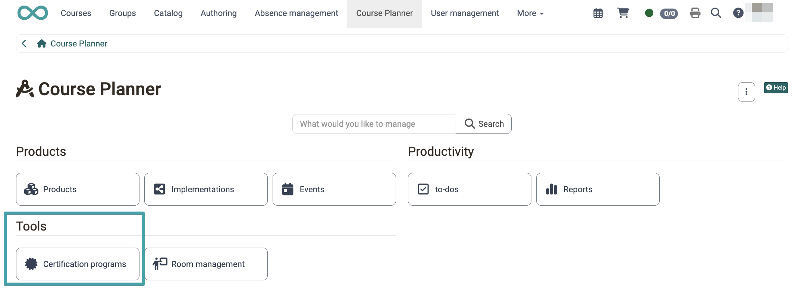{ class="shadow lightbox" title="Course Planner start page" }

## What is a certification program? [:octicons-tag-16:{ title="from Release 20.2 (OO-8559)" }](https://track.frentix.com/issue/OO-8559){:target="_blank"} {: #description}

A certificate may be issued as confirmation of attendance at a course or completion of certain course-related activities. It is also possible to issue a certificate without using a transcript of records.

Certificates for a **single course** are activated and configured in `Course > Administration > Settings > Assessment`.

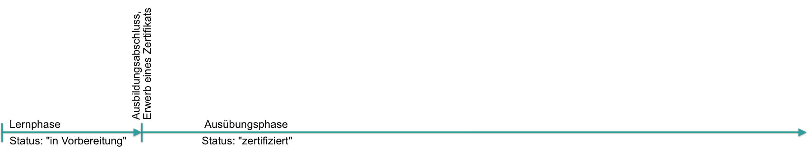{ class="shadow lightbox" title="Learning phase and practice phase of a certificate" }

A certificate for **attending an implementation** or **attending several courses**, on the other hand, can be issued using the **certification program**. Such certificates are awarded within the **Course Planner** (implementation). Persons can be admitted to a certification program, and any required recertifications can be managed there: `Course Planner > Certification programs`

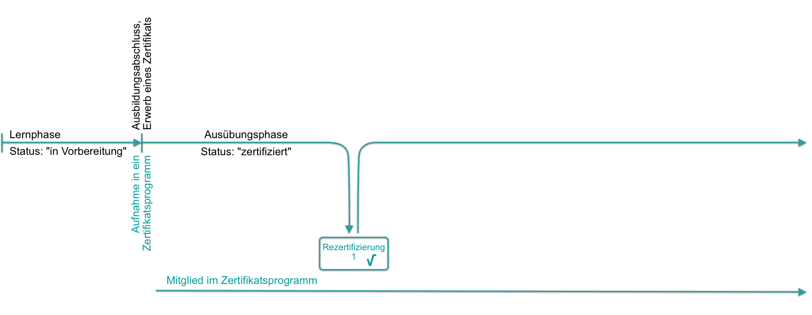{ class="shadow lightbox" title="Membership with passed recertification" }

If a member does not meet the required recertification criteria, their membership will be terminated (automatically).

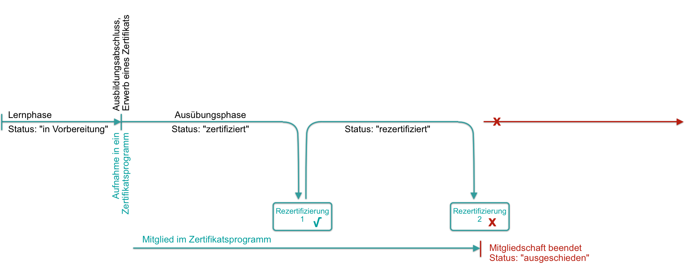{ class="shadow lightbox" title="Membership ends after failed recertification" }

On the other hand, membership in a certification program is also possible for candidates, meaning it can begin even before the first certification.

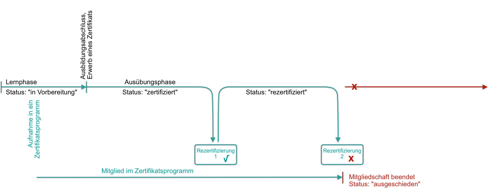{ class="shadow lightbox" title="Membership from the learning phase" }

| Certificate in course   | Certificate in certification program |
| -------------------- | ------------------------------------------- |
| Certificate in a single course | Certificate for an implementation or for multiple courses |
| per course | per implementation |
| `Course > Administration > Settings > Assessment` | `Course Planner > Certification programs` |
| Recertification: yes   | Recertification: yes |
| --- | Usage of credit points |

!!! tip "Possible areas of application"

    Safety training 
    Compliance training 
    [Data protection certificates with credit points >](../../manual_how-to/certification_programs/certification_programs.md#use_case_1) 
    [Training programs with automatic recertification >](../../manual_how-to/certification_programs/certification_programs.md#use_case_2) 
    [Leadership development with flexible learning paths >](../../manual_how-to/certification_programs/certification_programs.md#use_case_3) 

[To the top of the page ^](#certification_programs)

---

## Create certification program [:octicons-tag-16:{ title="from Release 20.2 (OO-8559)" }](https://track.frentix.com/issue/OO-8559){:target="_blank"} {: #create}

To create a new certification program, click 
`Course Planner > Certification programs > Create Certification program`

[To the top of the page ^](#certification_programs)

---

## Set up a certification program [:octicons-tag-16:{ title="from Release 20.2 (OO-8559)" }](https://track.frentix.com/issue/OO-8559){:target="_blank"} {: #config}

Open a certification program by clicking on its name in the list. Then configure it in the various tabs. Step-by-step instructions for setup can be found here: 
[How can I create certification programs with the Course Planner? >](../../manual_how-to/certification_programs/certification_programs.md)

[To the top of the page ^](#certification_programs)

---

### Status {: #config_status}

A certification program can be set from "Active" to "Inactive" status. This is particularly helpful during creation.

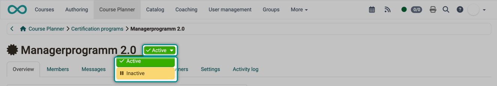{ class="shadow lightbox" title="Opened certification program" }

[To the top of the page ^](#certification_programs)

---

### Tab Overview [:octicons-tag-16:{ title="from Release 20.2 (OO-8816)" }](https://track.frentix.com/issue/OO-8816){:target="_blank"} {: #config_tab_overview}

The overview page of the certification program shows a widget **Active members**. It states the number of members by status:

* Active
* Certified
* Expiring soon
* In recertification

"Expiring soon" only appears if the validity is switched on, "In recertification" only with recertification switched on. A click on a key figure opens the "Members" tab with the matching selection: "Active" with all active members, the other key figures with the tab of the same name above the list.

Below them, the widget lists up to five certified members with the columns "Member", "Balance" (only if the certification program requires credit points) and "Valid until" (only with validity switched on). With validity switched on, the members whose next recertification is due first are at the top. The "Show all" button opens the complete list in the "Members" tab. How an overview page is structured and how you arrange the tiles is described centrally: [Overview pages and widgets >](../basic_concepts/Dashboard_Concept.md)

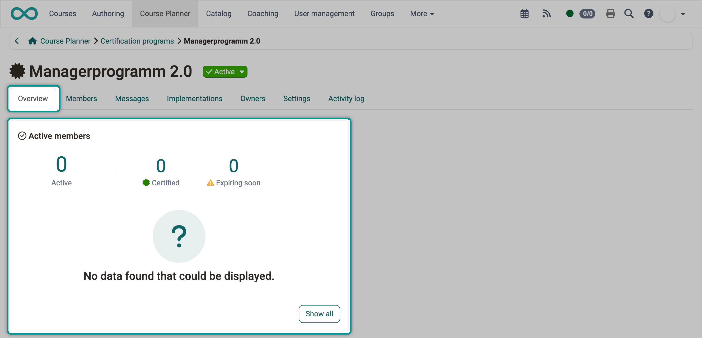{ class="shadow lightbox" title="Overview tab of a certification program" }

[To the top of the page ^](#certification_programs)

---

### Tab Members {: #config_tab_members}

To add more people to the certification program and give them the opportunity to earn a certificate, use the **"Certify new users" button**.

Every person in the certification program has a **membership status**:

* **Active member**: The person holds a certificate in this certification program and is therefore a certified, active member.
* **Candidate**: The person participates in an implementation linked to the certification program but does not yet hold a certificate in this program. Membership can thus begin before the first certification.
* **Alumni**: The person has left the certification program, for example after a certificate expired without recertification.

When adding people via the "Certify new users" wizard, the current membership status of each selected person is shown.

If a training course/measure required for recertification is not completed, a certificate expires and the person concerned is automatically removed from the certification program. This is often a necessary automatic process, for example in the case of safety-related certifications.

The tiles "Active", "Candidates" and "Alumni" above the list switch between the three groups. Under "Alumni", owners of a certification program find the persons who have left, so they can quickly identify and contact them.

In the list of active members, the tabs "All", "Certified", "In recertification", "Expiring soon" and "Insufficient credit points" narrow down the list. A tab only appears if the certification program uses the related setting: validity, recertification with timeframe, or credit points. The "Next recertification" column shows when a person has to renew their certificate, the "Credit point balance" column how many credit points they have for it.

The three dots at the end of a list row hold the actions for the person in question: "Contact", "Renew certificate" (only with recertification switched on), "Revoke certificate", "Export certificate" and "Export print certificate" (only with print version). With "Revoke certificate" you withdraw, for example, a certificate that was issued automatically in error.

The "Export certificate" button above the list exports the certificates of the persons in the list as PDF files. If the print version is switched on, the drop-down menu next to it also contains "Export print certificate".

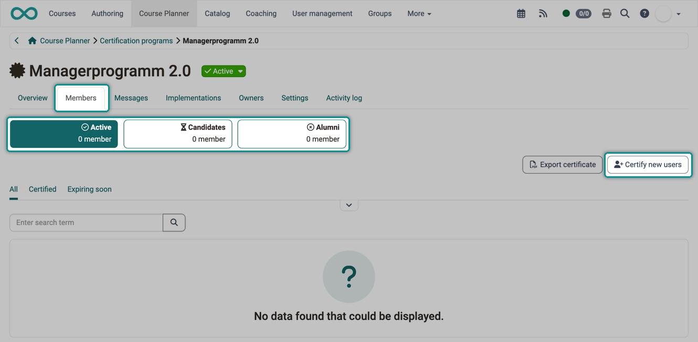{ class="shadow lightbox" title="Members tab of a certification program" }

#### Certificate file status [:octicons-tag-16:{ title="from Release 21.1 (OO-9128)" }](https://track.frentix.com/issue/OO-9128){:target="_blank"} {: #certificate_status}

After certifying many persons, you want to know whether every certificate is already available as a PDF file. The certificate file status answers this for each certificate, independently of the membership status of the person.

OpenOlat issues a certificate immediately and then generates the PDF file in the background. This applies to every way of issuing, including the "Certify new users" wizard and the automatic recertification. The serial number, the issue date and the validity period are fixed from the moment of issuing, and the certificate is valid. Only the PDF file is affected.

You see the certificate file status in the detail view of a member, which you expand with the plus sign in front of the row. The image under [Overview of issued certificates >](#issued_certificates) shows the detail view with the "Certificate" column. If the PDF file is ready, click the file name in the "Certificate" column to open it. If it is still missing, the file name cannot be clicked, and one of these labels appears next to it:

* **Pending**: The PDF file is being generated. It is usually available after a short time, later if many certificates were issued at the same time.
* **Error** with the tooltip "Error, retry scheduled": The generation failed, and OpenOlat tries again automatically. You do not need to do anything.
* **Error** without tooltip: All automatic attempts are used up. Administrators regenerate the PDF file in the system administration: [Maintenance tab >](../../manual_admin/administration/e-Assessment_Certificates.md#tab_maintenance)

With the filter "Certificate file status" you narrow the list of active members down to the persons whose PDF file is still missing. The filter is not shown from the start; you add it in the filters of the table. The selection contains "Pending" and "Error" twice: the first entry "Error" stands for the certificates that OpenOlat tries again, the second for the certificates without further attempts.

[To the top of the page ^](#certification_programs)

---

### Tab Messages [:octicons-tag-16:{ title="from Release 20.2 (OO-8813)" }](https://track.frentix.com/issue/OO-8813){:target="_blank"} {: #config_tab_messages}

Notifications and reminders always refer to the current configuration. You can check this again in the upper section.

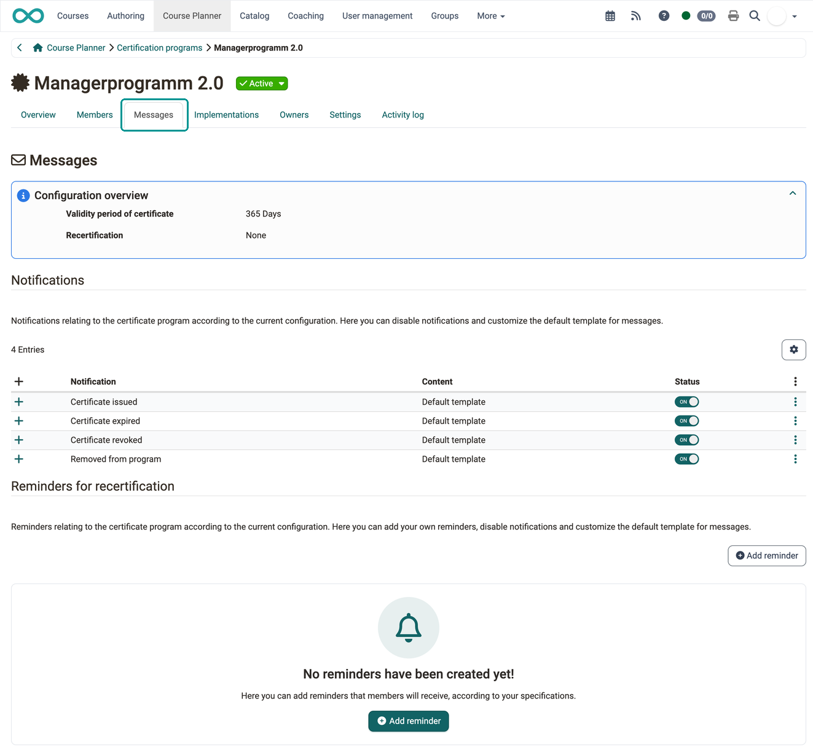{ class="shadow lightbox" title="Messages tab of a certification program" }

**Notifications** 
In the Notifications section, you will find **pre-prepared notifications** for the certification program according to the current configuration. You can enable/disable these notifications as needed and customize the default templates for the messages. (You can find the button for customizing a template under the three dots or when you have opened the detailed view.)

**Reminders for recertification** 
In addition, you can create your own reminders in another section, which will then be sent automatically according to your configuration.

[To the top of the page ^](#certification_programs)

---

### Tab Implementations {: #config_tab_implementations}

The condition for obtaining a certificate is the successful completion of one of the implementations listed here (OR link, one of the implementations listed here is sufficient). It does not matter whether the implementations are of exactly the same product or course. Therefore, the selection must be made carefully to ensure equivalence.

Implementations of type single course can also be linked to the certification program directly in the implementation: in the settings of the implementation, in the sub-tab "Assessment". [:octicons-tag-16:{ title="from Release 21.0 (OO-9499)" }](https://track.frentix.com/issue/OO-9499){:target="_blank"} 
[More details >](Course_Planner_Implementations.md#tab_settings_assessment)

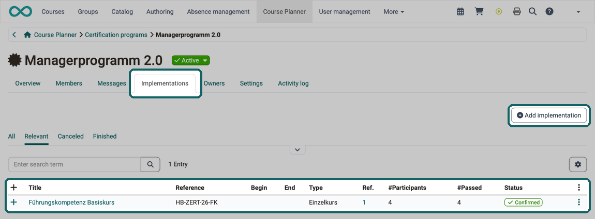{ class="shadow lightbox" title="Implementations tab of a certification program · 2026.10.07" }

For each implementation, the list shows among others the columns "#Participants" and "#Passed": you see how many persons participate and how many of them have passed. With the tabs "All", "Relevant", "Canceled" and "Finished" you narrow the list down.

By **clicking on the plus sign** in front of a list entry, you can display the details of this implementation. (You can close the details by clicking on the minus sign.) The **Course** area shows the linked course as a tile; if several courses are linked, the area is called **Courses**. The tile shows the title and the technical type of the course, the period and the status of the participants: the average progress, how many persons have passed, not passed or are undefined, the average points and the number of participants.

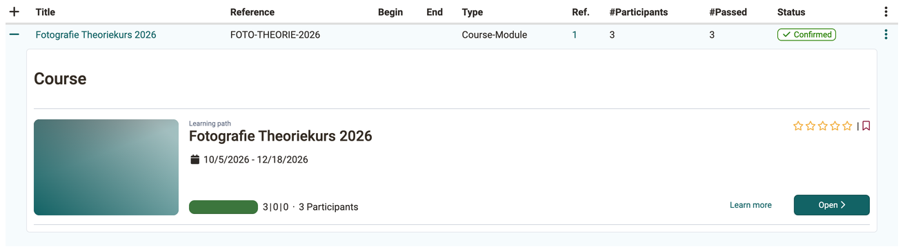{ class="shadow lightbox" title="Details of an implementation in the Implementations tab" }

Click **Learn more** to open the info page of the course. Click **Open** to go directly to the course.

!!! tip "Recommendation"

    You can also open the implementation in a separate browser tab by clicking on the icon with the three dots at the end of a line. This is often helpful for editing.

[To the top of the page ^](#certification_programs)

---

### Tab Owners {: #config_tab_owners}

Use this tab to add further owners to the current certification program or to remove them.

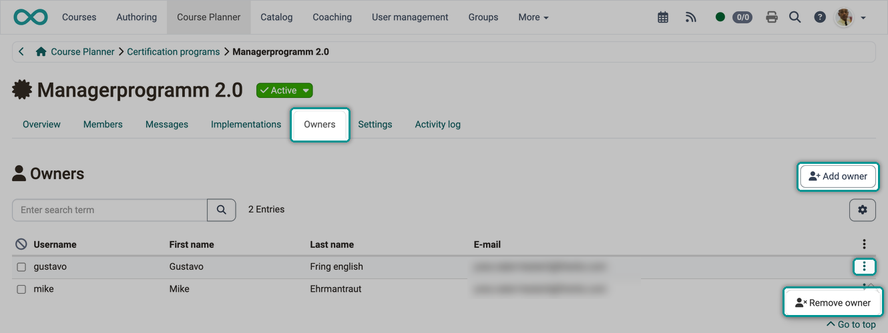{ class="shadow lightbox" title="Owners tab of a certification program" }

[To the top of the page ^](#certification_programs)

---

### Tab Settings {: #config_tab_settings}
In the settings you can define the following:

* What is the title of the certification program
* Who has administrative access to this certification program
* How long the certificate is valid
* Whether and how recertification takes place
* Whether and how many credit points a recertification costs
* Which PDF certificate is awarded

**Button "Metadata"** 
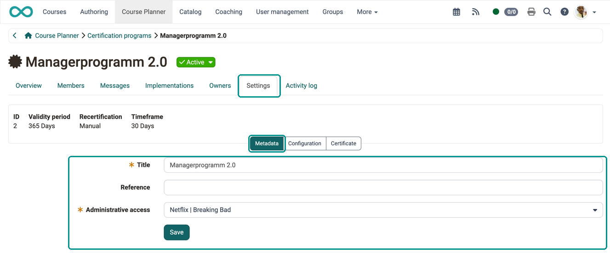{ class="shadow lightbox" title="Metadata area in the Settings tab" }

 

**Button "Configuration"** 
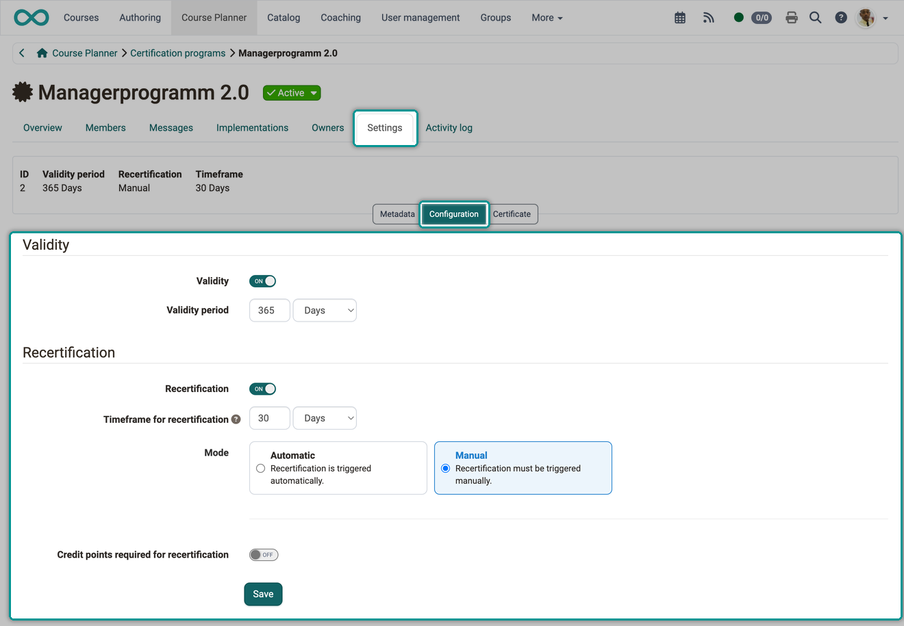{ class="shadow lightbox" title="Configuration area in the Settings tab" }

Under the "Configuration" button, you define how long a certificate is valid and how it is renewed afterwards. In the "Validity" section, you switch on "Validity" and set the "Validity period". Only with a validity can you switch on "Recertification" in the "Recertification" section. The following settings are then available:

* **Timeframe for recertification**: How long participants have to renew their certificate after it has expired. During this time, the certificate has expired but can still be renewed.
* **Mode "Automatic"**: OpenOlat renews the certificate itself as soon as it has expired and deducts the required credit points from the balance of the person. If the balance is not sufficient by the end of the timeframe, the person leaves the certification program.
* **Mode "Manual"**: OpenOlat does not renew the certificate itself. Owners renew it in the "Members" tab under the 3 dots at the end of the row, or the person successfully completes a linked implementation again.
* **Credit points required for recertification**: A renewal by OpenOlat or by owners costs the number of credit points entered under "Required credit points" from the selected "Credit point system". If the balance of the person is not sufficient, no renewal is possible. In the "Automatic" mode, this switch is always on and cannot be switched off, because the automatic renewal works with credit points.

The first certificate costs no credit points. Whoever passes a linked implementation again also receives the new certificate without deduction.

 

**Button "Certificate"** 
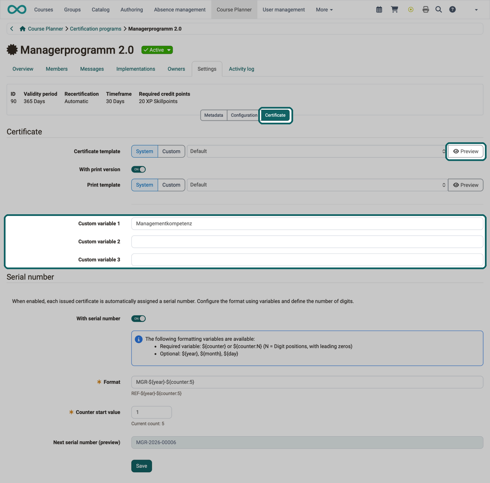{ class="shadow lightbox" title="Certificate area in the Settings tab · 2026.10.07" }

Under the "Certificate" button, you define which certificate template is used in the certification program: a system-wide template ("System") or your own file ("Custom"). In addition, the following options are available:

**Custom variables** 
In the fields "Custom variable 1" to "Custom variable 3", you enter details that are the same on every certificate of this certification program. The template inserts them at the positions of the variables `$custom1` to `$custom3`. [More about the variables in the certificate template >](../learningresources/Course_Settings_Assessment_Certificate.md#certificate_variables)

**Preview** 
The "Preview" button next to the template generates the PDF file "Certificate_preview.pdf" with sample data and the custom variables entered. This way you check the layout and the placement before you issue the first certificate.

**Serial number** 

With the **"With serial number"** option, each issued certificate is automatically assigned a sequential, human-readable serial number [:octicons-tag-16:{ title="from Release 21.0 (OO-9567)" }](https://track.frentix.com/issue/OO-9567). You define the **format** using variables: `${counter}` or `${counter:N}` (counter, optionally with leading zeros for N digits) as well as optional `${year}`, `${month}`, and `${day}`, e.g. `REF-${year}-${counter:5}`. The **counter start value** determines the number at which counting begins. Format and counter start value are mandatory as soon as the option is switched on; after saving, the "Next serial number (preview)" field shows the number that will be assigned next. The serial number is assigned anew on each issuance, including a recertification, and it is part of the PDF file name. It appears on the certificate as soon as the template used contains the `$certificateSerialNumber` variable. In the "Members" tab and in the detail view of a person, the "Serial number" column can be shown; by default it is hidden.

<h4>Print version for pre-printed paper</h4>

With the **"With print version"** option, you activate an additional **print template** for pre-printed paper [:octicons-tag-16:{ title="from Release 21.0 (OO-9568)" }](https://track.frentix.com/issue/OO-9568). Owners of the certification program can thus export a **print certificate** alongside the standard certificate. The action is available in the "Members" tab: for a single person under the 3 dots at the end of the list row or in the detail view, for several persons after selecting the rows, and for all persons in the list in the drop-down menu next to the "Export certificate" button. Participants continue to receive only the standard certificate.

[To the top of the page ^](#certification_programs)

---

### Tab Activity Log [:octicons-tag-16:{ title="from Release 20.3 (OO-9110)" }](https://track.frentix.com/issue/OO-9110){:target="_blank"} {: #config_tab_activitylog}

If you want to know who changed what in the certification program and when, and what the value was before, you find the answer in the "Activity log" tab. Each row states the "Date", the "Context" (Implementation, Member, Message, Owner or Settings), the "Object", the "Activity" and the "User" who made the change. For a change, the columns "Original value" and "New value" show the value before and after, so you see the change itself.

The tabs "All", "Last 7 days", "Last 4 weeks" and "Last 12 month" narrow down the period; when you open the tab, "Last 7 days" is selected. With the filters "Context", "Activity", "Member" and "User" you search specifically. In the "All" tab, the "Date" filter is also available; in the other tabs, the tab sets the period. You expand and collapse the filter bar with the arrow below the tabs.

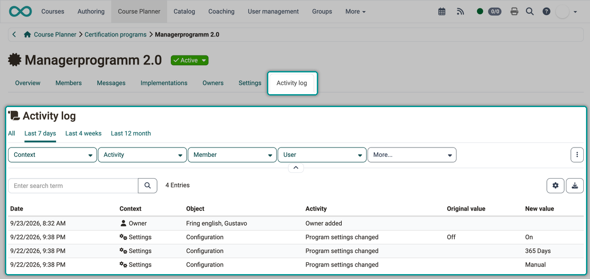{ class="shadow lightbox" title="Activity log tab of a certification program" }

[To the top of the page ^](#certification_programs)

---

## Certification program and credit points [:octicons-tag-16:{ title="from Release 20.2 (OO-8559)" }](https://track.frentix.com/issue/OO-8559){:target="_blank"} {: #credit_points}

**Credit points as requirement** 
As explained above, you can make recertification conditional on the prior acquisition of a certain number of credit points. The number of credit points required for a recertification is set under 
`Course Planner > Certification programs > "Program title" > Tab Settings > Button "Configuration"` 

**Credit points as a means of payment** 
If the certification program renews a certificate, it deducts the required credit points from the balance of the person. The first certificate costs no credit points.

[To the top of the page ^](#certification_programs)

---

## Overview of issued certificates {: #issued_certificates}

Who received which certificate and when? This question is asked by owners of a certification program as well as by coaches and the participants themselves. Depending on your role, there are different ways to get an overview. 

### Overview for certification program owners
In `Course Planner > Certification programs > "Program title" > Tab Members`, you will find a list of all participants in the certification program. **Click on the plus sign** in front of a list entry to open the detail view.
There, the "Certificates" table shows all certificates of the selected person, including expired and archived certificates, with the columns "Certificate", "Issued on", "Status", "Valid until", "Next recertification", "Recertification deadline" and "Revoked on". If the PDF file of a certificate is still missing, the file name cannot be clicked, and the label "Pending" or "Error" appears next to it: [Certificate file status >](#certificate_status) 
The "Courses" table below shows, for each course of the linked implementations, the "Reference", "Progress", "Score" and "Passed" of the person.

The tiles "Active", "Candidates" and "Alumni" and the tabs above the list narrow the list down to one group: [Tab Members >](#config_tab_members)

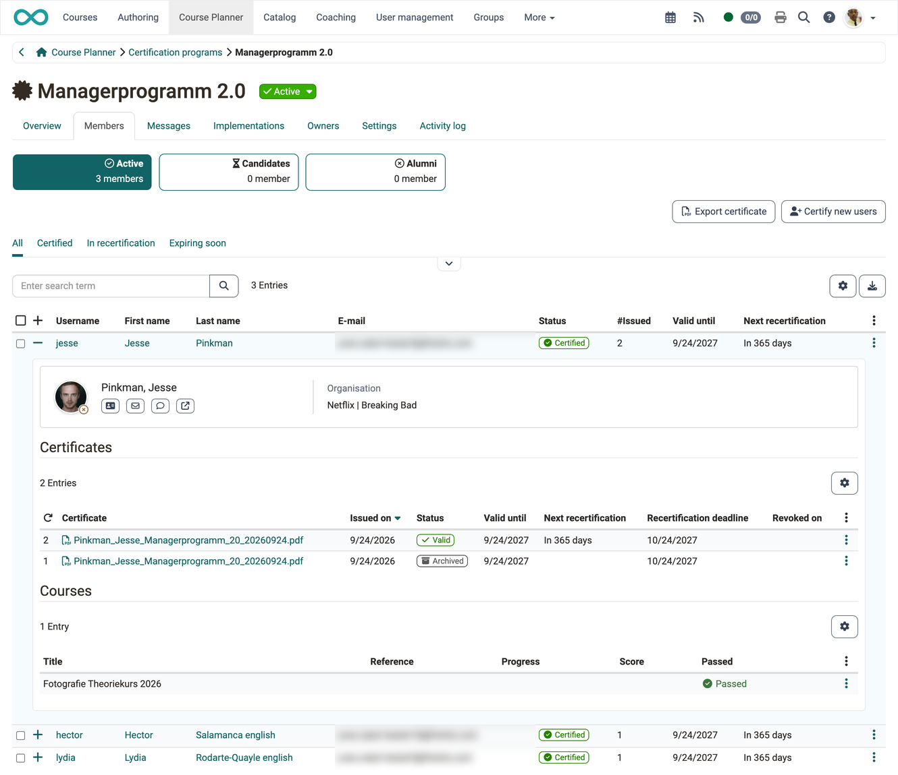{ class="shadow lightbox" title="Detail view in the Members tab" }

### Overview for coaches
As a coach, you still keep track of the certificates of your participants most easily

* for single courses in the **assessment tool**
* for multiple courses in the **coaching tool**

### Overview for education managers

Education managers see all certificates of individual participants from different certification programs and courses under 
`Coaching > Education manager > "Person" > Tab Certificates`

### Overview for participants [:octicons-tag-16:{ title="from Release 20.2 (OO-8818)" }](https://track.frentix.com/issue/OO-8818){:target="_blank"}
Participants can find their certificates listed in their **personal menu**. It does not matter whether a certificate comes from a certification program or an individual course.

A newly issued certificate first appears there without a preview image. In the detail view it carries the label "Pending", and the button "Download certificate" is deactivated until the PDF file is available. Participants also see "Pending" if the generation has failed. 
[More about certificates in the personal menu >](../personal_menu/Certificates.md)

[To the top of the page ^](#certification_programs)

---

## Recertification with the certification program [:octicons-tag-16:{ title="from Release 20.2 (OO-8559)" }](https://track.frentix.com/issue/OO-8559){:target="_blank"} {: #recertification}

**Requirements** 
The first requirement for recertification with a certification program is that participants must be members of the certification program. 
`Course Planner > Certification programs > "Program title" > Tab Members`

The second requirement is an existing certificate with an expiration date. 
`Course Planner > Certification programs > "Program title" > Tab Settings > Button Configuration`

Thirdly, it may be that a certain number of credit points must be available before recertification is possible.

**Renewal by owners of the certification program** 
Owners of the certification program can renew a certificate that is still valid at any time and thus extend it under 
`Course Planner > Certification programs > "Program title" > Tab Members > Select member > 3 dots`

**Recertification period** 
With the timeframe for recertification, owners of the certification program define how long participants have to renew their certificate after it has expired. OpenOlat sends matching information and reminders automatically, set up in the "Messages" tab. 
`Course Planner > Certification programs > "Program title" > Tab Settings > Button Configuration > Section Recertification`

[To the top of the page ^](#certification_programs)

---

## Manually issue or revoke certificates {: #manual_certification}

The right to manually issue or revoke certificates lies primarily with the owners of the respective certification program. 
In addition, users with the roles "Administrator" and "Course planner" also have administrative access.

* Click the "Members" tab to open the list of participants.
* Click the three dots at the end of the row for the participant in question.
* There, you will see the options for renewing or revoking the certificate.

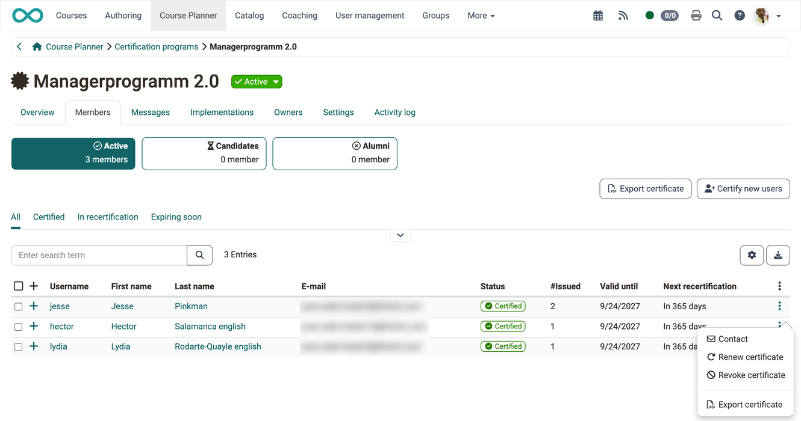{ class="shadow lightbox" title="Members tab of a certification program" }

!!! info "Important"

    If the certification program requires credit points for recertification, OpenOlat also deducts them when owners renew a certificate manually.

[To the top of the page ^](#certification_programs)

---

## Storage and download of certificates {: #download_certificates}

Expired certificates are not simply deleted in OpenOlat, but stored in the database. They remain available to authorized persons.

**Access by participants** 
Participants can still find all certificates they have acquired in their **personal menu**.

**Access by coaches** 
Coaches can view expired certificates of the persons they coach in the **assessment tool** or in the **coaching tool**.

**Access by owners** 
Owners of a certification program can still find all expired certificates of a certification program under  `Course Planner > Certification programs > "Program title" > Tab Members > Button Alumni` in the details of the individual members (click on the plus symbol in front of a line).  The PDF certificates (including expired ones) can be viewed and downloaded individually there.

**Access by user managers** 
If a participant is selected in user management, there is a **Certificates tab** where all of that person's certificates are listed.

[To the top of the page ^](#certification_programs)

---

## Further information {: #further_information}

**Mentioned on this page** 
[How can I create certification programs with the Course Planner? >](../../manual_how-to/certification_programs/certification_programs.md) 
[Overview pages and widgets >](../basic_concepts/Dashboard_Concept.md) 
[e-Assessment Administration: Certificates >](../../manual_admin/administration/e-Assessment_Certificates.md) 
[Course Planner: Implementations >](../area_modules/Course_Planner_Implementations.md) 
[Course Settings - Tab Assessment: Certificates and recertification >](../learningresources/Course_Settings_Assessment_Certificate.md) 
[Personal achievements/successes: Certificates >](../personal_menu/Certificates.md)

**Further reading** 
[Personal achievements/successes: Credit points >](../personal_menu/Credit_Points.md) 
[e-Assessment Administration: Credit points >](../../manual_admin/administration/e-Assessment_Credit_Points.md)

[To the top of the page ^](#certification_programs)
