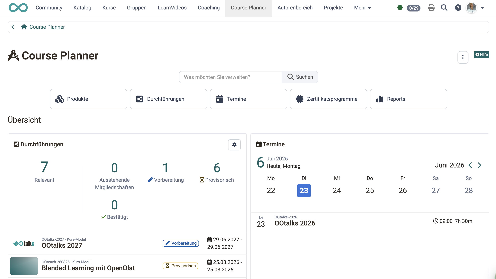
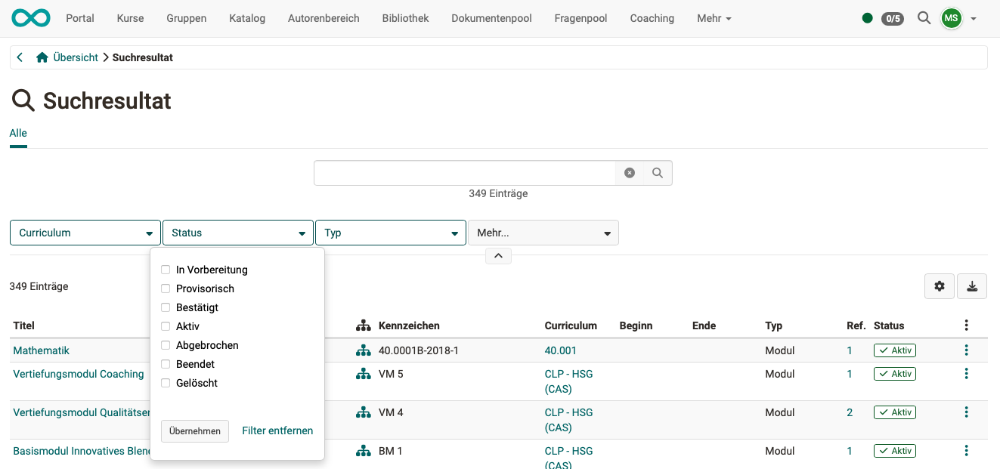

# Course Planner: Dashboard [:octicons-tag-16:{ title="ab Release 20.3.0 (OO-9173)" }](https://track.frentix.com/issue/OO-9173){:target="_blank"} {: #dashboard}

Beim Öffnen des Course Planners gelangen Sie direkt auf das Dashboard. Es zeigt auf einen Blick die für Sie relevanten Durchführungen, Ihre nächsten Termine sowie weitere Kennzahlen, ohne dass Sie zuerst in die einzelnen Bereiche wechseln müssen. Die Anordnung und Auswahl der Widgets (Kacheln) lässt sich persönlich anpassen, sodass jede Person die für sie wichtigen Informationen als erstes sieht.

Die Übersicht zeigt zum Beispiel:

- die nächsten anstehenden Termine,
- die Buttons zum Zugriff auf die nachstehend beschriebenen Bereiche/Funktionen,
- sowie die Suche.

{ class="shadow lightbox" }  

Mit Eingabe eines Begriffes im Suchfeld kann nach **Durchführungen, Kursen und Terminen** gesucht werden. 
Wie auch bei anderen Suchen, kann mit Filtern das Suchergebnis eingegrenzt werden.

{ class="shadow lightbox" }  

Unterhalb der Buttons und der Suche zeigt die Übersichtsseite einen Bereich mit **Widgets** (Kacheln) in einem responsiven Layout: Je nach Bildschirmbreite passt sich die Anordnung der Kacheln automatisch an.

Ein Trennbereich mit der Bezeichnung **"Übersicht"** [:octicons-tag-16:{ title="ab Release 20.3.0 (OO-9305)" }](https://track.frentix.com/issue/OO-9305){:target="_blank"} grenzt diesen Widget-Bereich optisch von den darüberliegenden Buttons/Launchern ab.

[Zum Seitenanfang ^](#dashboard)

---

## Durchführungs-Widget [:octicons-tag-16:{ title="ab Release 20.3.0 (OO-8864, OO-9289)" }](https://track.frentix.com/issue/OO-8864){:target="_blank"} {: #widget_implementations}

Das Widget **Durchführungen** zeigt auf einen Blick die für Sie relevanten Durchführungen.

Im Kopfbereich wählen Sie über die Hauptkennzahl **"Relevant"** oder eine der weiteren Kennzahlen (**"Vorbereitung"**, **"Provisorisch"**, **"Bestätigt"**, **"Ausstehende Mitgliedschaften"**) eine Vorauswahl. Die Tabelle listet die entsprechenden Durchführungen mit externer Referenz, Titel, Struktur, Status sowie Beginn- und Enddatum, sortiert nach Beginndatum.

Über den neuen Filter **"Ausstehende Mitgliedschaften"** finden Sie schnell Durchführungen, bei denen Mitgliedschaften noch bestätigt werden müssen.

Über den Button **Alle anzeigen** [:octicons-tag-16:{ title="ab Release 20.3.0 (OO-9244)" }](https://track.frentix.com/issue/OO-9244){:target="_blank"} gelangen Sie zur vollständigen Liste der Durchführungen.

[Zum Seitenanfang ^](#dashboard)

---

## Tabellen-Widget konfigurieren [:octicons-tag-16:{ title="ab Release 20.3.0 (OO-9132)" }](https://track.frentix.com/issue/OO-9132){:target="_blank"} {: #widget_table_settings}

Tabellen-Widgets (z.B. das Durchführungs-Widget) können Sie über das Zahnrad-Icon im Widget individuell konfigurieren:

* **Hauptkennzahl**: Legt fest, welche Kennzahl in der Titelzeile des Widgets angezeigt wird.
* **Kennzahlen**: Über eine Checkbox-Gruppe bestimmen Sie, welche weiteren Kennzahlen sichtbar sind. Die Hauptkennzahl ist dabei immer ausgewählt und kann nicht abgewählt werden.
* **Anzahl Einträge**: Legt fest, wie viele Zeilen die Tabelle anzeigt (5 bis 15).

Mit **Speichern** übernehmen Sie die Einstellungen, mit **Abbrechen** verwerfen Sie sie.

[Zum Seitenanfang ^](#dashboard)

---

## Mitglieder-Widget [:octicons-tag-16:{ title="ab Release 20.3.0 (OO-9243)" }](https://track.frentix.com/issue/OO-9243){:target="_blank"} {: #widget_members}

Das Widget **Teilnehmer:innen** zeigt die Teilnehmerzahl der jeweiligen Durchführung.

Ist eine maximale bzw. minimale Teilnehmerzahl definiert, ergänzt ein zusätzlicher Hinweistext die Kennzahl:

* Bei gesetztem Maximum: **"\<Anzahl\> verbleibende Plätze"**
* Bei gesetztem Minimum: **"\<Anzahl\> bis Mindestanzahl"**
* Bei ausgebuchten oder überbuchten Durchführungen erscheint weiterhin die entsprechende Meldung.

Im Bereich darunter werden die für die Durchführung zuständigen Personen mit Rolle angezeigt (z.B. Betreuer:innen, Klassenlehrer:innen, Kursbesitzer:innen, Elementbesitzer:innen).

[Zum Seitenanfang ^](#dashboard)

---

## Übersicht anpassen [:octicons-tag-16:{ title="ab Release 20.3.0 (OO-9273)" }](https://track.frentix.com/issue/OO-9273){:target="_blank"} {: #overview_customize}

Unterhalb der Widgets steht der Button **"Übersicht anpassen"** zur Verfügung, mit dem Sie in den Bearbeitungsmodus wechseln.

Im Bearbeitungsmodus stehen zwei Bereiche zur Verfügung:

* **Aktive Widgets**: Hier ordnen Sie die Widgets per Drag & Drop (Kachel bewegen) neu an oder entfernen sie.
* **Verfügbare Widgets**: Hier finden Sie deaktivierte Widgets, die Sie über den Link **"Zum Dashboard hinzufügen"** wieder aktivieren können. Neu hinzugefügte Widgets werden am Ende der aktiven Widgets eingefügt.

!!! note "Hinweis"

    Für die Bedienung ohne Maus (Tastatur/Screenreader) stehen zusätzlich die Aktionen **"Nach oben verschieben"** und **"Nach unten verschieben"** zur Verfügung.

Mit **Speichern** übernehmen Sie die Änderungen und verlassen den Bearbeitungsmodus, mit **Abbrechen** verwerfen Sie sie. Über **"Dashboard zurücksetzen"** stellen Sie die Standardeinstellung wieder her.

Solange keine persönliche Konfiguration gespeichert wurde, wird der Systemstandard verwendet.

!!! info "Wichtig"

    Gäste sehen den Button "Übersicht anpassen" nicht.

!!! tip "Hinweis für Systemadministrator:innen"

    Als Systemadministrator:in stehen Ihnen im Bearbeitungsmodus zusätzlich die Aktionen **"Als Systemstandard speichern"** und **"Systemstandard zurücksetzen"** zur Verfügung, um den Systemstandard für alle Benutzer:innen ohne eigene Konfiguration festzulegen.

[Zum Seitenanfang ^](#dashboard)

---

## Weitere Informationen {: #further_information}

[Course Planner: Übersicht >](../area_modules/Course_Planner.de.md) 
[Course Planner: Produkte >](../area_modules/Course_Planner_Products.de.md) 
[Course Planner: Durchführungen >](../area_modules/Course_Planner_Implementations.de.md) 
[Course Planner: Termine >](../area_modules/Course_Planner_Events.de.md) 
[Course Planner: Zertifikatsprogramme >](../area_modules/Course_Planner_Certification_Programs.de.md) 
[Course Planner: Reports >](../area_modules/Course_Planner_Reports.de.md)

[Zum Seitenanfang ^](#dashboard)
