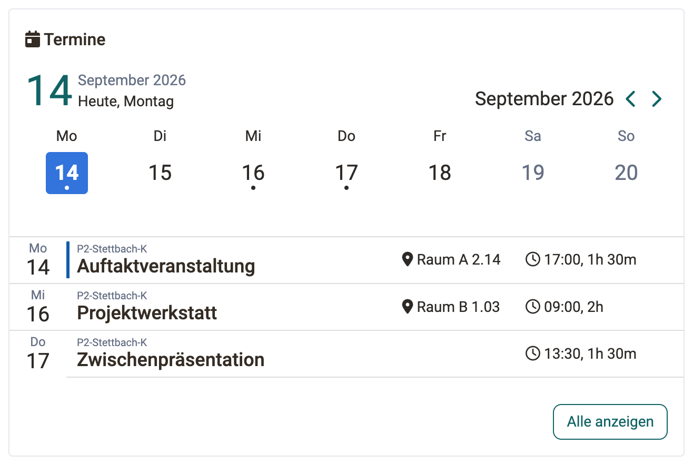
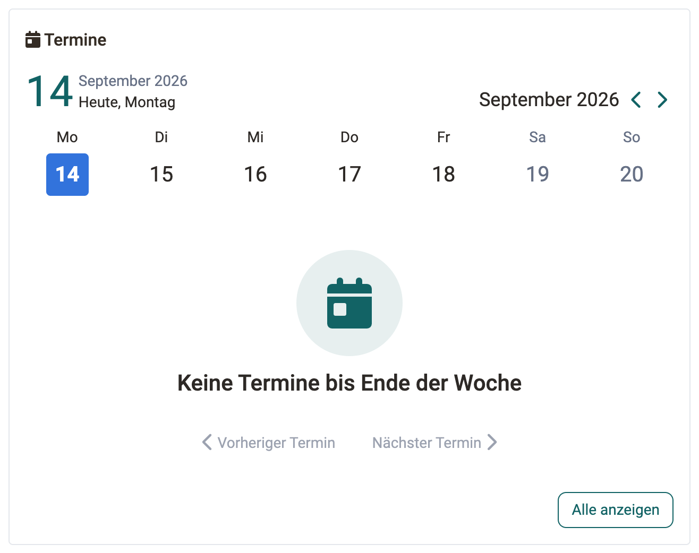
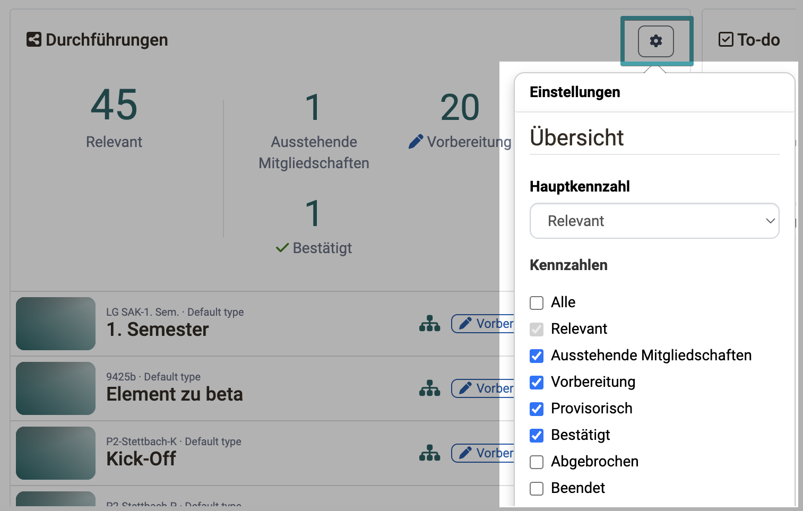

# Course Planner: Dashboard [:octicons-tag-16:{ title="ab Release 20.3.0 (OO-9173)" }](https://track.frentix.com/issue/OO-9173){:target="_blank"} {: #dashboard}

Beim Öffnen des Course Planners gelangen Sie direkt auf das Dashboard. Es zeigt auf einen Blick die für Sie relevanten Durchführungen, Ihre nächsten Termine sowie weitere Kennzahlen, ohne dass Sie zuerst in die einzelnen Bereiche wechseln müssen. Die Anordnung und Auswahl der Widgets (Kacheln) lässt sich persönlich anpassen, sodass jede Person die für sie wichtigen Informationen als erstes sieht.

Die Übersicht zeigt zum Beispiel:

- die nächsten anstehenden Termine,
- die Buttons zum Zugriff auf die nachstehend beschriebenen Bereiche/Funktionen,
- sowie die Suche.

{ class="shadow lightbox" }  

Mit Eingabe eines Begriffes im Suchfeld kann nach **Durchführungen, Kursen und Terminen** gesucht werden. 
Wie auch bei anderen Suchen, kann mit Filtern das Suchergebnis eingegrenzt werden.

{ class="shadow lightbox" }  

Unterhalb der Buttons und der Suche zeigt die Übersichtsseite einen Bereich mit **Widgets** (Kacheln) in einem responsiven Layout: Je nach Bildschirmbreite passt sich die Anordnung der Kacheln automatisch an.

Ein Trennbereich mit der Bezeichnung **"Übersicht"** [:octicons-tag-16:{ title="ab Release 20.3.0 (OO-9305)" }](https://track.frentix.com/issue/OO-9305){:target="_blank"} grenzt diesen Widget-Bereich optisch von den darüberliegenden Buttons/Launchern ab.

[Zum Seitenanfang ^](#dashboard)

---

## Durchführungs-Widget [:octicons-tag-16:{ title="ab Release 20.3.0 (OO-8864, OO-9289)" }](https://track.frentix.com/issue/OO-8864){:target="_blank"} {: #widget_implementations}

Das Widget **Durchführungen** zeigt auf einen Blick die für Sie relevanten Durchführungen.

Im Kopfbereich wählen Sie über die Hauptkennzahl **"Relevant"** oder eine der weiteren Kennzahlen (**"Vorbereitung"**, **"Provisorisch"**, **"Bestätigt"**, **"Ausstehende Mitgliedschaften"**) eine Vorauswahl. Die Tabelle listet die entsprechenden Durchführungen mit Kennzeichen, Titel, Struktur, Status sowie Beginn- und Enddatum, sortiert nach Beginndatum.

Über den Filter **"Ausstehende Mitgliedschaften"** finden Sie schnell Durchführungen, bei denen Mitgliedschaften noch bestätigt werden müssen.

Über den Button **Alle anzeigen** [:octicons-tag-16:{ title="ab Release 20.3.0 (OO-9244)" }](https://track.frentix.com/issue/OO-9244){:target="_blank"} gelangen Sie zur vollständigen Liste der Durchführungen.

[Zum Seitenanfang ^](#dashboard)

---

## Termine-Widget [:octicons-tag-16:{ title="ab Release 20.3 (OO-8865)" }](https://track.frentix.com/issue/OO-8865){:target="_blank"} {: #widget_events}

Das Widget **Termine** zeigt die Termine der laufenden Woche ab dem gewählten Tag. Es erscheint nur, wenn das Modul **Termin- und Absenzenverwaltung** systemweit aktiv ist.

Angezeigt werden Termine aus Bildungsprodukten, für die Sie als Administrator:in, Absenzenverwalter:in, Besitzer:in oder Betreuer:in zuständig sind.

!!! info "Wichtig"

    Das gleichnamige Widget **Termine** im Coaching zeigt andere Termine: dort erscheinen nur Termine, in denen Sie selbst als Dozent:in eingetragen sind, und keine Termine aus Bildungsprodukten. Siehe [Coaching - Übersicht](Coaching.de.md#widget_events).

### Wochenleiste und Terminliste {: #widget_events_week}

Die Wochenleiste läuft von Montag bis Sonntag. Ein Punkt unter der Tagesziffer markiert die Tage, an denen Termine stattfinden [:octicons-tag-16:{ title="ab Release 21.0 (OO-9515)" }](https://track.frentix.com/issue/OO-9515){:target="_blank"}. Ein Klick auf einen Tag setzt den Startpunkt der Liste, mit den Pfeilschaltflächen wechseln Sie die Woche. Die Tagesspalte bleibt beim Scrollen stehen, auch wenn die Woche viele Termine enthält.

Die Liste zeigt die Termine ab dem gewählten Tag bis Sonntag, sortiert nach Beginn. Je Eintrag sehen Sie Wochentag, Datum, Kennzeichen, Titel, Ort, Beginn und Dauer. Ein Klick auf die Zeile öffnet den Termin.

Ein farbiger Streifen am linken Rand einer Zeile ordnet den Termin zeitlich ein: Er markiert den nächsten anstehenden Termin und den gerade laufenden. Screenreader lesen dazu **"Als nächstes geplant"** beziehungsweise **"Am laufen"**.

{ class="shadow lightbox" }

### Leerzustand {: #widget_events_empty}

Enthält die angezeigte Woche keinen Termin, erscheint der Hinweis **"Keine Termine bis Ende der Woche"**. Über die Schaltflächen **"Vorheriger Termin"** und **"Nächster Termin"** springen Sie zum nächstgelegenen Termin davor oder danach. Die Schaltflächen sind nur aktiv, wenn ein solcher Termin existiert.

{ class="shadow lightbox" }

Über den Button **"Alle anzeigen"** gelangen Sie zur vollständigen Terminliste des Course Planners.

[Zum Seitenanfang ^](#dashboard)

---

## Tabellen-Widget konfigurieren [:octicons-tag-16:{ title="ab Release 20.3.0 (OO-9132)" }](https://track.frentix.com/issue/OO-9132){:target="_blank"} {: #widget_table_settings}

Widgets (z.B. das Durchführungs-Widget) können Sie über :o_icon_o_icon_customize: im Widget individuell konfigurieren:

* **Hauptkennzahl**: Legt fest, welche Kennzahl in der Titelzeile des Widgets angezeigt wird.
* **Kennzahlen**: Über eine Checkbox-Gruppe bestimmen Sie, welche weiteren Kennzahlen sichtbar sind. Die Hauptkennzahl ist dabei immer ausgewählt und kann nicht abgewählt werden.
* **Anzahl Einträge**: Legt fest, wie viele Zeilen die Tabelle anzeigt (5 bis 15).

Mit **Speichern** übernehmen Sie die Einstellungen, mit **Abbrechen** verwerfen Sie sie.

{ class="shadow lightbox" }

[Zum Seitenanfang ^](#dashboard)

---

## Übersicht anpassen [:octicons-tag-16:{ title="ab Release 20.3.0 (OO-9273)" }](https://track.frentix.com/issue/OO-9273){:target="_blank"} {: #overview_customize}

Unterhalb der Widgets steht der Button **"Übersicht anpassen"**. Damit ordnen Sie die Kacheln neu an, blenden sie aus und holen sie zurück. Die Bedienung ist auf allen Übersichtsseiten gleich und dort einmal beschrieben: [Übersichtsseiten und Widgets >](../basic_concepts/Dashboard_Concept.de.md#customize)

[Zum Seitenanfang ^](#dashboard)

---

## Weiterführende Informationen {: #further_information}

[Course Planner: Übersicht >](../area_modules/Course_Planner.de.md) 
[Course Planner: Produkte >](../area_modules/Course_Planner_Products.de.md) 
[Course Planner: Durchführungen >](../area_modules/Course_Planner_Implementations.de.md) 
[Course Planner: Termine >](../area_modules/Course_Planner_Events.de.md) 
[Course Planner: Zertifikatsprogramme >](../area_modules/Course_Planner_Certification_Programs.de.md) 
[Course Planner: Reports >](../area_modules/Course_Planner_Reports.de.md) 
[Coaching - Übersicht >](../area_modules/Coaching.de.md) 
[Übersichtsseiten und Widgets >](../basic_concepts/Dashboard_Concept.de.md)

[Zum Seitenanfang ^](#dashboard)
