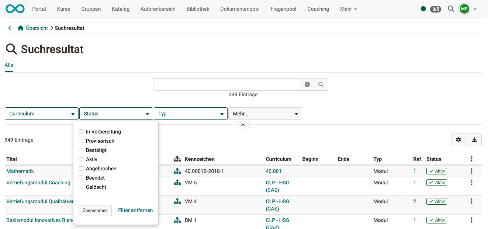
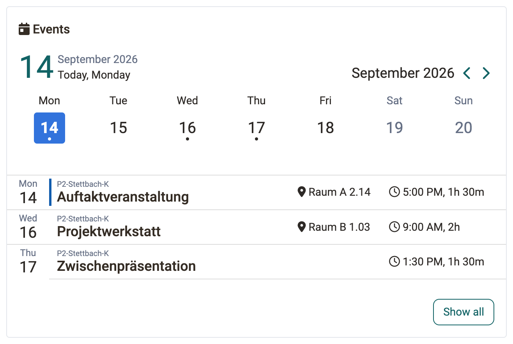
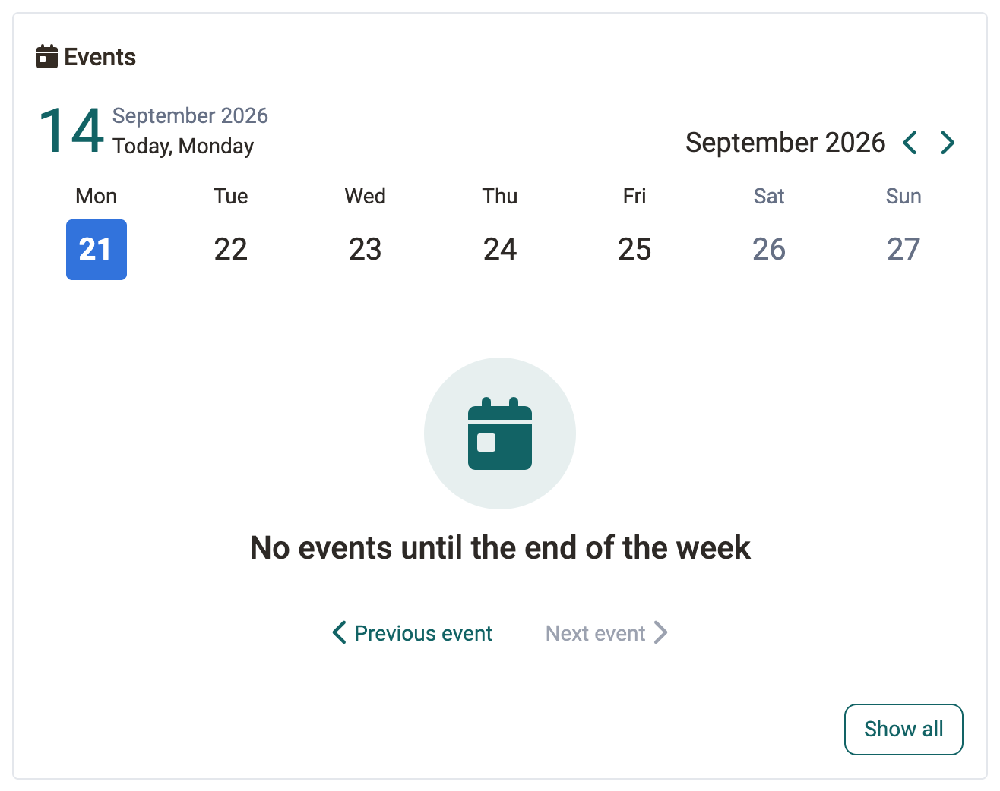
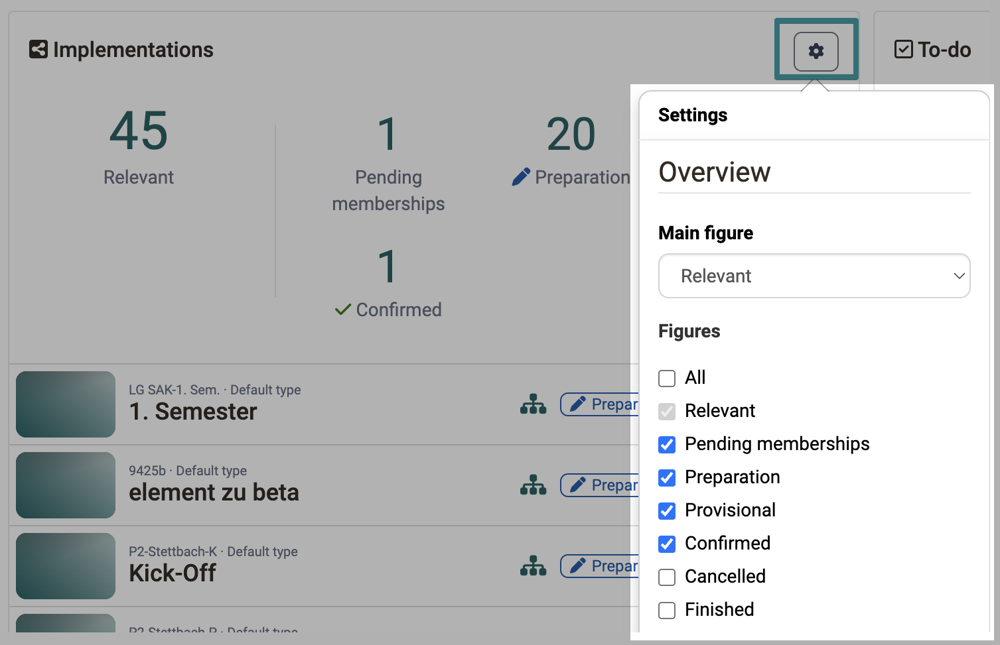

# Course Planner: Dashboard [:octicons-tag-16:{ title="from Release 20.3.0 (OO-9173)" }](https://track.frentix.com/issue/OO-9173){:target="_blank"} {: #dashboard}

When you open the Course Planner, you are taken directly to the Dashboard. It shows the implementations relevant to you, your upcoming events, and other key figures at a glance, without you first having to switch to the individual areas. The arrangement and selection of widgets (tiles) can be personalized, so each person sees the information that matters to them first.

The overview shows, for example:

- upcoming events,
- the buttons for accessing the areas/functions described below,
- as well as the search.

{ class="shadow lightbox" }  

By entering a term in the search field, you can search for **implementations, courses and events**. 
As with other searches, filters can be used to narrow down the search results.

{ class="shadow lightbox" }  

Below the buttons and the search, the overview page shows an area with **widgets** (tiles) in a responsive layout: depending on the screen width, the arrangement of the tiles adjusts automatically.

A separator area labelled **"Overview"** [:octicons-tag-16:{ title="from Release 20.3.0 (OO-9305)" }](https://track.frentix.com/issue/OO-9305){:target="_blank"} visually separates this widget area from the buttons/launchers above it.

[To the top of the page ^](#dashboard)

---

## Implementation widget [:octicons-tag-16:{ title="from Release 20.3.0 (OO-8864, OO-9289)" }](https://track.frentix.com/issue/OO-8864){:target="_blank"} {: #widget_implementations}

The **Implementations** widget shows you the implementations relevant to you at a glance.

In the header area, you select a preselection via the main key figure **"Relevant"** or one of the other key figures (**"Preparation"**, **"Provisional"**, **"Confirmed"**, **"Pending memberships"**). The table lists the corresponding implementations with reference, title, structure, status as well as start and end date, sorted by start date.

Using the **"Pending memberships"** filter, you can quickly find implementations for which memberships still need to be confirmed.

Use the **Show all** button [:octicons-tag-16:{ title="from Release 20.3.0 (OO-9244)" }](https://track.frentix.com/issue/OO-9244){:target="_blank"} to go to the full list of implementations.

[To the top of the page ^](#dashboard)

---

## Events widget [:octicons-tag-16:{ title="from Release 20.3 (OO-8865)" }](https://track.frentix.com/issue/OO-8865){:target="_blank"} {: #widget_events}

The widget **Events** shows the events of the current week from the selected day. It only appears if the module **Events and absences** is active system-wide.

Displayed are events from educational products for which you are administrator, absence manager, owner or coach.

!!! info "Important"

    The widget with the same name **Events** in Coaching shows different events: there you only see events in which you are entered as a lecturer yourself, and no events from educational products. See [Coaching - Overview](Coaching.md#widget_events).

### Week bar and event list {: #widget_events_week}

The week bar runs from Monday to Sunday. A dot below the day figure marks the days on which events take place [:octicons-tag-16:{ title="from Release 21.0 (OO-9515)" }](https://track.frentix.com/issue/OO-9515){:target="_blank"}. A click on a day sets the starting point of the list, the arrow buttons change the week. The day column stays in place while you scroll, even if the week holds many events.

The list shows the events from the selected day to Sunday, sorted by start. Each entry shows weekday, date, reference, title, location, start and duration. A click on the row opens the event.

A coloured stripe at the left edge of a row places the event in time: it marks the next scheduled event and the one currently running. Screen readers additionally read **"Scheduled next"** and **"Running"**.

{ class="shadow lightbox" }

### Empty state {: #widget_events_empty}

If the displayed week holds no event, the message **"No events until the end of the week"** appears. Use the buttons **"Previous event"** and **"Next event"** to jump to the closest event before or after. The buttons are only active if such an event exists.

{ class="shadow lightbox" }

Use the button **"Show all"** to get to the complete event list of the Course Planner.

[To the top of the page ^](#dashboard)

---

## Configure table widget [:octicons-tag-16:{ title="from Release 20.3.0 (OO-9132)" }](https://track.frentix.com/issue/OO-9132){:target="_blank"} {: #widget_table_settings}

You can individually configure widgets (e.g. the implementation widget) via :o_icon_o_icon_customize: in the widget:

* **Main figure**: Determines which key figure is displayed in the widget's title row.
* **Key figures**: A checkbox group lets you determine which other key figures are visible. The main key figure is always selected and cannot be deselected.
* **Number of entries**: Determines how many rows the table displays (5 to 15).

Use **Save** to apply the settings, use **Cancel** to discard them.

{ class="shadow lightbox" }

[To the top of the page ^](#dashboard)

---

## Edit overview [:octicons-tag-16:{ title="from Release 20.3.0 (OO-9273)" }](https://track.frentix.com/issue/OO-9273){:target="_blank"} {: #overview_customize}

The button **"Edit overview"** is below the widgets. Use it to rearrange the tiles, to hide them and to bring them back. The operation is the same on all overview pages and is described there once: [Overview pages and widgets >](../basic_concepts/Dashboard_Concept.md#customize)

[To the top of the page ^](#dashboard)

---

## Further information {: #further_information}

[Course Planner: Overview >](../area_modules/Course_Planner.md) 
[Course Planner: Products >](../area_modules/Course_Planner_Products.md) 
[Course Planner: Implementations >](../area_modules/Course_Planner_Implementations.md) 
[Course Planner: Events >](../area_modules/Course_Planner_Events.md) 
[Course Planner: Certification programs >](../area_modules/Course_Planner_Certification_Programs.md) 
[Course Planner: Reports >](../area_modules/Course_Planner_Reports.md) 
[Coaching - Overview >](../area_modules/Coaching.md) 
[Overview pages and widgets >](../basic_concepts/Dashboard_Concept.md)

[To the top of the page ^](#dashboard)
