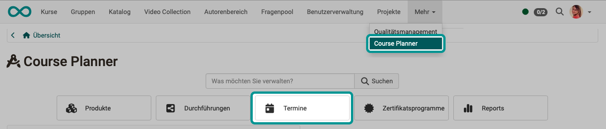
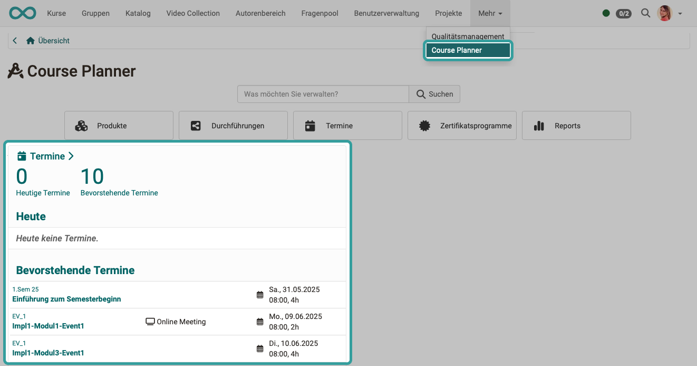
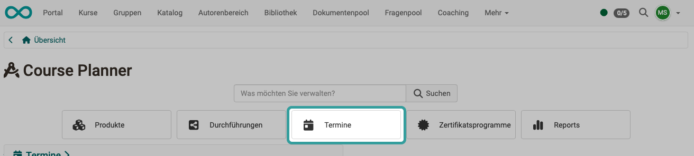
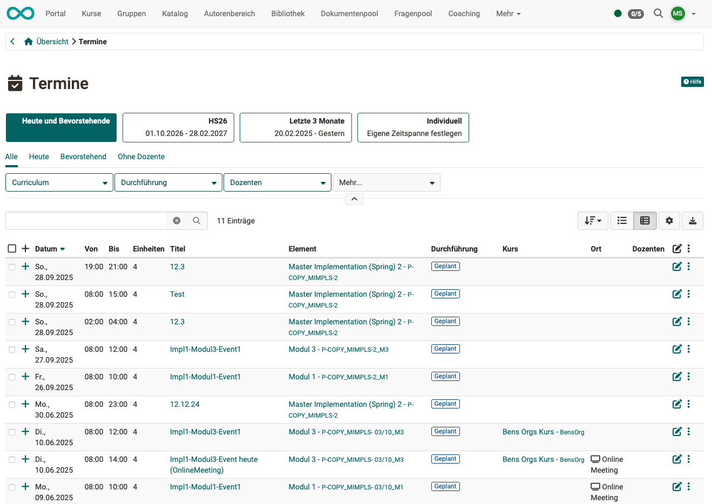
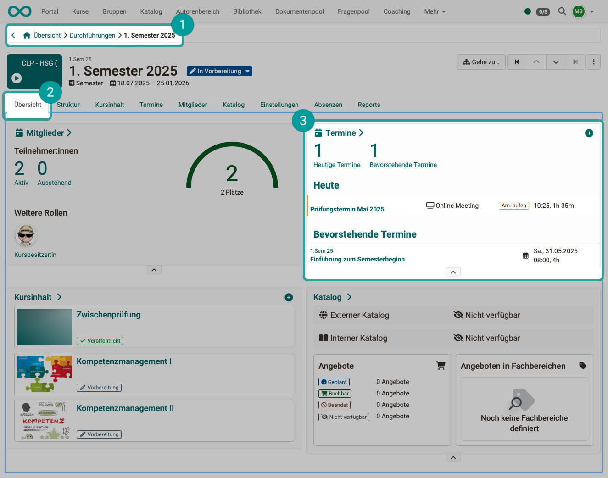
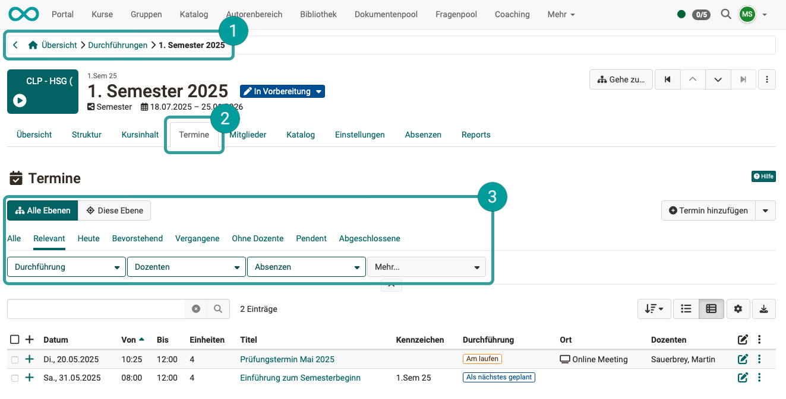
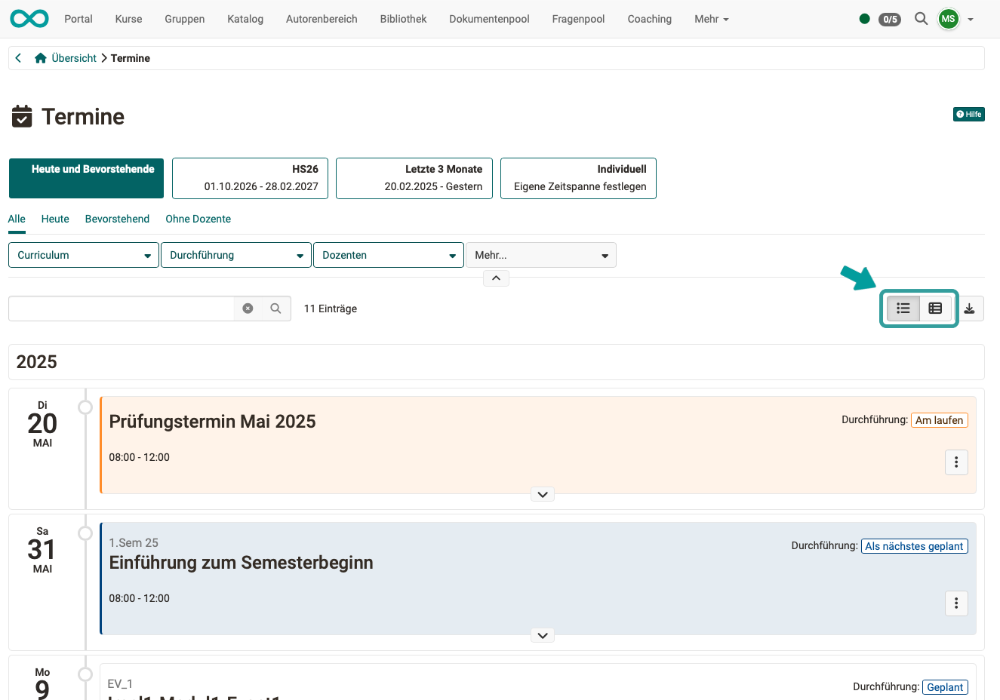
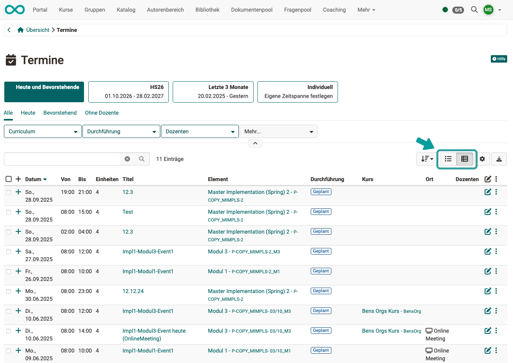
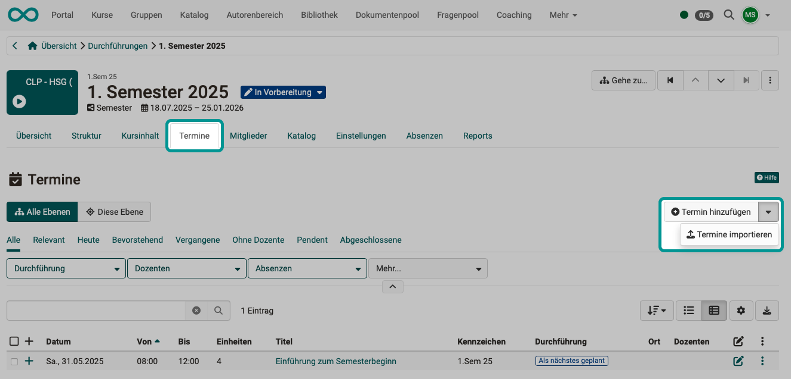
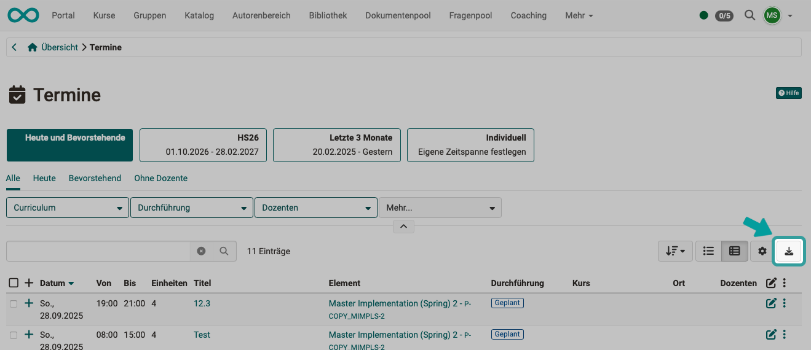

# Course Planner: Termine {: #events}

{ class="shadow lightbox" }

## Um welche Termine geht es im Course Planner? [:octicons-tag-16:{ title="ab Release 20.0 (OO-8128)" }](https://track.frentix.com/issue/OO-8128){:target="_blank"} {: #type_of_events}

Die im Course Planner erstellten und angezeigten Termine beziehen sich auf die im Course Planner verwendeten Elemente. (Andere Termine, z.B. aus Projekten, sind hier im Course Planner nicht aufgeführt.)

[zum Seitenanfang ^](#events)

---

## Wo sehe ich Termine? [:octicons-tag-16:{ title="ab Release 20.0 (OO-8128)" }](https://track.frentix.com/issue/OO-8128){:target="_blank"} {: #display_events}

### Auswahl aktueller Termine

Eine Auswahl aktueller Termine finden Sie auf der **Übersicht des Course Planners**. 

{ class="shadow lightbox" }

### Liste aller Termine {: #event_list}

Die komplette Übersicht über alle Termine im Course Planner erhalten Sie im Bereich "Termine". Verwenden Sie die Tabs und Filter zur Eingrenzung und Auswahl.

{ class="shadow lightbox" }

{ class="shadow lightbox" }

### Termine einer bestimmten Durchführung {: #events_of_an_implementation}

Die **aktuell anstehenden** Termine einer Durchführung finden Sie auch unter 
`Course Planner Übersicht > Durchführungen > Durchführung wählen > Tab Übersicht`

{ class="shadow lightbox" }

**Alle** Termine einer Durchführung finden Sie unter 
`Course Planner Übersicht > Durchführungen > Durchführung wählen > Tab Termine`

Sie können dort alle Ebenen der Produktstruktur oder nur die aktuelle Ebene als Unterauswahl nehmen. Ausserdem stehen unterschiedliche Filter zur Verfügung.

{ class="shadow lightbox" }

### Ansichten {: #views}

Die Termine können als Zeitansicht (Timeline) oder als Tabelle dargestellt werden. Verwenden Sie zum Umschalten der Ansicht die Buttons rechts oben: links "Zeitansicht", rechts "Tabelle".

#### Zeitansicht

{ class="shadow lightbox" }

#### Tabellenansicht

{ class="shadow lightbox" }

### Elemente eines Termins [:octicons-tag-16:{ title="ab Release 21.0 (OO-9544)" }](https://track.frentix.com/issue/OO-9544){:target="_blank"} {: #event_elements}

In der Terminliste zeigt die Spalte "Element", zu welchem Element ein Termin gehört. Mit Klick auf den Elementnamen öffnen Sie das Element direkt, auch wenn es nicht zur aktuell gewählten Durchführung oder zum aktuell gewählten Produkt gehört.

Bei modularisierten Kursen kann ein Termin Teilnehmer:innen aus mehreren Elementen haben. Die Detailansicht eines Termins listet diese Elemente in einer Tabelle auf:

* Jedes Element wird mit seinem Element-Icon angezeigt.
* Die Spalte **"Standardelement"** kennzeichnet das Standardelement mit dem Label "Standard", wie im Kurs.
* Die Spalte "Status" zeigt mit den Labels **"Eingeschlossen"** und **"Ausgeschlossen"**, ob die Teilnehmer:innen des jeweiligen Elements in den Termin eingeschlossen oder davon ausgeschlossen sind.

[zum Seitenanfang ^](#events)

---

## Wie erstelle ich neue Termine? [:octicons-tag-16:{ title="ab Release 20.0 (OO-8128)" }](https://track.frentix.com/issue/OO-8128){:target="_blank"} {: #create_events}

Da sich Termine auf eine Durchführung beziehen, finden Sie die Möglichkeit zum Erstellen unter 
`Course Planner Übersicht > Durchführungen > Durchführung wählen > Tab Termine`

Nach Klick auf den kleinen Pfeil neben dem Button können Sie Termine auch importieren. 

{ class="shadow lightbox" }

[zum Seitenanfang ^](#events)

---

## Wie belege ich Räume für einen Termin? [:octicons-tag-16:{ title="ab Release 21.0 (OO-9526)" }](https://track.frentix.com/issue/OO-9526){:target="_blank"} {: #room_booking}

Ist das Modul «Räume» aktiviert, können Sie einem Termin einen oder mehrere Räume zuweisen. Beim Erstellen oder Bearbeiten eines Termins steht dafür das Feld «Räume» zur Verfügung.

Die Raumauswahl berücksichtigt den Zeitraum des Termins und zeigt, welche Räume «Verfügbar» und welche «Besetzt» sind. Zu jedem Raum werden das Gebäude und die Anzahl Plätze angezeigt; reicht die Kapazität für die Teilnehmerzahl nicht aus, wird darauf hingewiesen. Über «Räume hinzufügen» öffnen Sie eine Auswahl mit Tabellen- und Kalenderansicht, in der Sie nach Verfügbarkeit filtern und zu besetzten Räumen den früheren oder späteren freien Zeitraum sehen.

In der Detailansicht eines Termins erscheint der gebuchte Raum unter dem Label «Raum» als Raumkarte mit Kennzeichen, Gebäude und Standort; sind mehrere Räume gebucht, lautet das Label «Räume». Konflikte wie eine Doppelbuchung oder zu wenige Plätze werden als Warnung angezeigt.

!!! note "Admin. Rechte erforderlich"
    Räume und Gebäude werden im Modul «Räume» in der Administration verwaltet; dafür sind administrative Rechte erforderlich. Fehlen Ihnen diese Rechte, wenden Sie sich an eine Person mit administrativer Rolle, wenn Sie neue Räume benötigen oder Angaben zu einem Raum anpassen lassen möchten.

[zum Seitenanfang ^](#events)

---

## Download der Termine als Excel-Liste  {: #download_events}

Bei Bedarf können die in der Liste angezeigten Termine auch als Excel-Datei heruntergeladen werden. Verwenden Sie dazu den Button rechts oben über der Liste.

{ class="shadow lightbox" }

[zum Seitenanfang ^](#events)

---

## Weitere Informationen {: #further_information}

[Wie erstelle ich meinen ersten OpenOlat-Kurs >](../../manual_how-to/my_first_course/my_first_course.de.md) 
[Course Planner: Übersicht >](../../manual_user/area_modules/Course_Planner.de.md) 
[Course Planner: Produkte >](../../manual_user/area_modules/Course_Planner_Products.de.md) 
[Course Planner: Durchführungen >](../../manual_user/area_modules/Course_Planner_Implementations.de.md) 
[Course Planner: Zertifikatsprogramme >](../../manual_user/area_modules/Course_Planner_Certification_Programs.de.md) 
[Course Planner: Reports >](../../manual_user/area_modules/Course_Planner_Reports.de.md) 
[Wie kann ich mit dem Course Planner Kursdurchführungen planen und durchführen? >](../../manual_how-to/course_planner_courses/course_planner_courses.de.md) 
[Wie kann ich mit dem Course Planner einen Bildungsgang planen und durchführen? >](../../manual_how-to/course_planner_curriculum/course_planner_curriculum.de.md) 
[Course Planner aktivieren (Admin) >](../../manual_admin/administration/Modules_Course_Planner.de.md) 

[zum Seitenanfang ^](#events)

