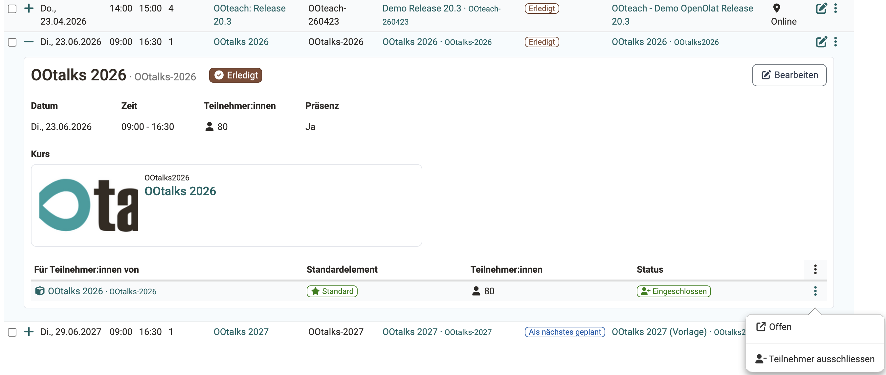
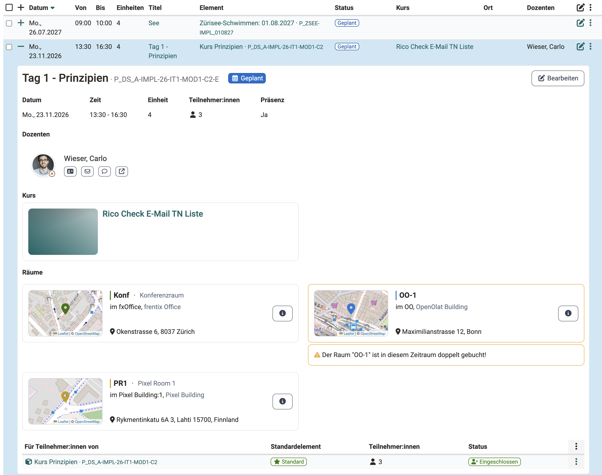

# Course Planner: Termine [:octicons-tag-16:{ title="ab Release 20.0 (OO-7834)" }](https://track.frentix.com/issue/OO-7834){:target="_blank"} {: #events}

{ class="shadow lightbox" }

## Um welche Termine geht es im Course Planner? {: #type_of_events}

Die im Course Planner erstellten und angezeigten Termine beziehen sich auf die im Course Planner verwendeten Elemente. (Andere Termine, z.B. aus Projekten, sind hier im Course Planner nicht aufgeführt.)

[zum Seitenanfang ^](#events)

---

## Wo sehe ich Termine? {: #display_events}

### Auswahl aktueller Termine [:octicons-tag-16:{ title="ab Release 20.0 (OO-8067)" }](https://track.frentix.com/issue/OO-8067){:target="_blank"}

Eine Auswahl aktueller Termine finden Sie auf der **Übersicht des Course Planners**. 

{ class="shadow lightbox" }

### Liste aller Termine {: #event_list}

Die komplette Übersicht über alle Termine im Course Planner erhalten Sie im Bereich "Termine". Verwenden Sie die Tabs und Filter zur Eingrenzung und Auswahl.

{ class="shadow lightbox" }

{ class="shadow lightbox" }

### Termine einer bestimmten Durchführung {: #events_of_an_implementation}

Die **aktuell anstehenden** Termine einer Durchführung finden Sie auch unter 
`Course Planner > Durchführungen > "Ihre Durchführung" > Tab Übersicht`

{ class="shadow lightbox" }

**Alle** Termine einer Durchführung finden Sie unter 
`Course Planner > Durchführungen > "Ihre Durchführung" > Tab Termine`

Sie können dort alle Ebenen der Produktstruktur oder nur die aktuelle Ebene als Unterauswahl nehmen. Ausserdem stehen unterschiedliche Filter zur Verfügung.

{ class="shadow lightbox" }

### Ansichten {: #views}

Die Termine können als Zeitansicht (Timeline) oder als Tabelle dargestellt werden. Verwenden Sie zum Umschalten der Ansicht die Buttons rechts oben: links "Zeitansicht", rechts "Tabelle".

#### Zeitansicht

{ class="shadow lightbox" }

#### Tabellenansicht

{ class="shadow lightbox" }

### Elemente eines Termins [:octicons-tag-16:{ title="ab Release 21.0 (OO-9544)" }](https://track.frentix.com/issue/OO-9544){:target="_blank"} {: #event_elements}

In der Terminliste zeigt die Spalte "Element", zu welchem Element ein Termin gehört. Mit Klick auf den Elementnamen öffnen Sie das Element direkt, auch wenn es nicht zur aktuell gewählten Durchführung oder zum aktuell gewählten Produkt gehört.

Bei modularisierten Kursen kann ein Termin Teilnehmer:innen aus mehreren Elementen haben. Die Detailansicht eines Termins listet diese Elemente in einer Tabelle auf:

* Die Spalte **"Für Teilnehmer:innen von"** nennt das Element, aus dem die Teilnehmenden stammen, die Spalte **"Teilnehmer:innen"** deren Anzahl.
* Die Spalte **"Standardelement"** kennzeichnet das Standardelement mit dem Label "Standard", wie im Kurs.
* Die Spalte "Status" zeigt mit den Labels **"Eingeschlossen"** und **"Ausgeschlossen"**, ob die Teilnehmer:innen des jeweiligen Elements in den Termin eingeschlossen oder davon ausgeschlossen sind.

Über die drei Punkte am Zeilenende steuern Sie, welche Elemente am Termin teilnehmen. Mit **"Offen"** öffnen Sie das Element, mit **"Teilnehmer ausschliessen"** nehmen Sie die Teilnehmenden dieses Elements vom Termin aus. Ausgeschlossene Elemente holen Sie mit **"Teilnehmer wieder einschliessen"** zurück; die Spalte "Status" wechselt entsprechend.

Die Detailansicht zeigt zusätzlich Datum, Zeit, Teilnehmerzahl und Präsenzpflicht des Termins sowie den zugehörigen Kurs.

{ class="shadow lightbox" }

[zum Seitenanfang ^](#events)

---

## Wie erstelle ich neue Termine? {: #create_events}

Da sich Termine auf eine Durchführung beziehen, finden Sie die Möglichkeit zum Erstellen unter 
`Course Planner > Durchführungen > "Ihre Durchführung" > Tab Termine`

Nach Klick auf den kleinen Pfeil neben dem Button können Sie Termine auch importieren. 

{ class="shadow lightbox" }

[zum Seitenanfang ^](#events)

---

## Wie belege ich Räume für einen Termin? [:octicons-tag-16:{ title="ab Release 21.0 (OO-9526)" }](https://track.frentix.com/issue/OO-9526){:target="_blank"} {: #room_booking}

Ist das Modul «Räume» aktiviert, können Sie einem Termin einen oder mehrere Räume zuweisen. Das Feld «Räume» steht im Dialog zum Erstellen oder Bearbeiten eines Termins zur Verfügung, den Sie hier öffnen: 
`Course Planner > Durchführungen > "Ihre Durchführung" > Tab Termine`

Die Raumauswahl berücksichtigt den Zeitraum des Termins und zeigt, welche Räume «Verfügbar» und welche «Besetzt» sind. Zu jedem Raum werden das Gebäude und die Anzahl Plätze angezeigt; reicht die Kapazität für die Teilnehmerzahl nicht aus, wird darauf hingewiesen. Über «Räume hinzufügen» öffnen Sie eine Auswahl mit Tabellen- und Kalenderansicht, in der Sie nach Verfügbarkeit filtern und zu besetzten Räumen den früheren oder späteren freien Zeitraum sehen.

In der Detailansicht eines Termins erscheint der gebuchte Raum unter dem Label «Raum» als Raumkarte mit Kennzeichen, Gebäude und Standort; sind mehrere Räume gebucht, lautet das Label «Räume». Konflikte wie eine Doppelbuchung oder zu wenige Plätze werden als Warnung angezeigt.

{ class="shadow lightbox" }

!!! note "Admin. Rechte erforderlich"
    Räume und Gebäude werden in der System-Administration unter `Administration > Module > Räume` verwaltet; dafür sind administrative Rechte erforderlich. Fehlen Ihnen diese Rechte, wenden Sie sich an eine Person mit administrativer Rolle, wenn Sie neue Räume benötigen oder Angaben zu einem Raum anpassen lassen möchten.

[zum Seitenanfang ^](#events)

---

## Download der Termine als Excel-Liste  {: #download_events}

Bei Bedarf können die in der Liste angezeigten Termine auch als Excel-Datei heruntergeladen werden. Verwenden Sie dazu den Button rechts oben über der Liste.

{ class="shadow lightbox" }

[zum Seitenanfang ^](#events)

---

## Weitere Informationen {: #further_information}

[Wie erstelle ich meinen ersten OpenOlat-Kurs >](../../manual_how-to/my_first_course/my_first_course.de.md) 
[Course Planner: Übersicht >](../../manual_user/area_modules/Course_Planner.de.md) 
[Course Planner: Produkte >](../../manual_user/area_modules/Course_Planner_Products.de.md) 
[Course Planner: Durchführungen >](../../manual_user/area_modules/Course_Planner_Implementations.de.md) 
[Course Planner: Zertifikatsprogramme >](../../manual_user/area_modules/Course_Planner_Certification_Programs.de.md) 
[Course Planner: Reports >](../../manual_user/area_modules/Course_Planner_Reports.de.md) 
[Wie kann ich mit dem Course Planner Kursdurchführungen planen und durchführen? >](../../manual_how-to/course_planner_courses/course_planner_courses.de.md) 
[Wie kann ich mit dem Course Planner einen Bildungsgang planen und durchführen? >](../../manual_how-to/course_planner_curriculum/course_planner_curriculum.de.md) 
[Course Planner aktivieren (Admin) >](../../manual_admin/administration/Modules_Course_Planner.de.md) 

[zum Seitenanfang ^](#events)

