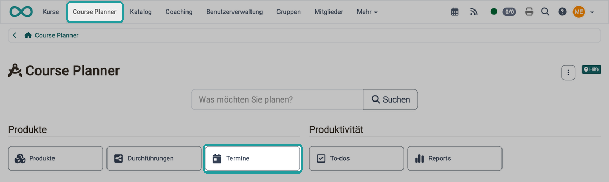
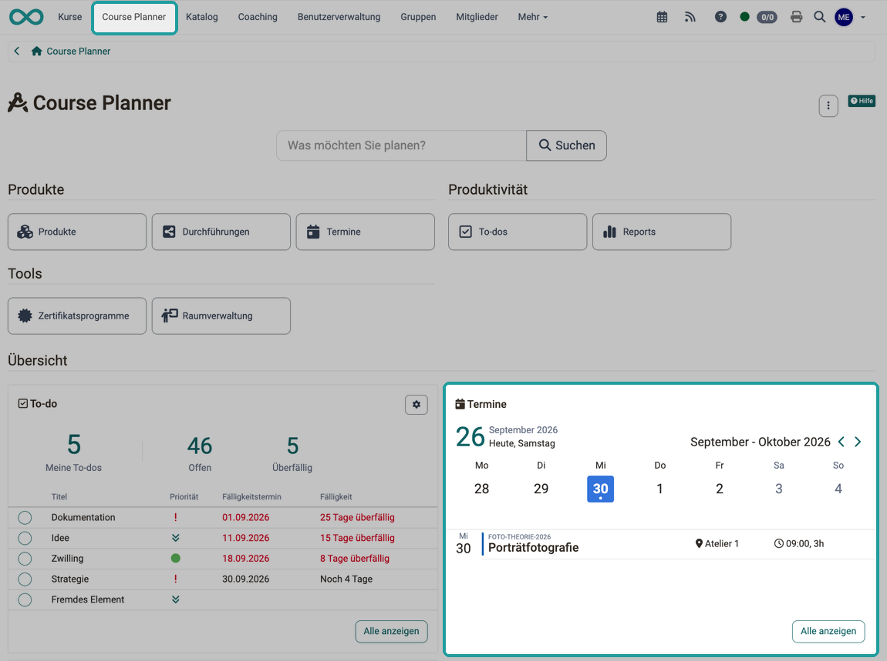
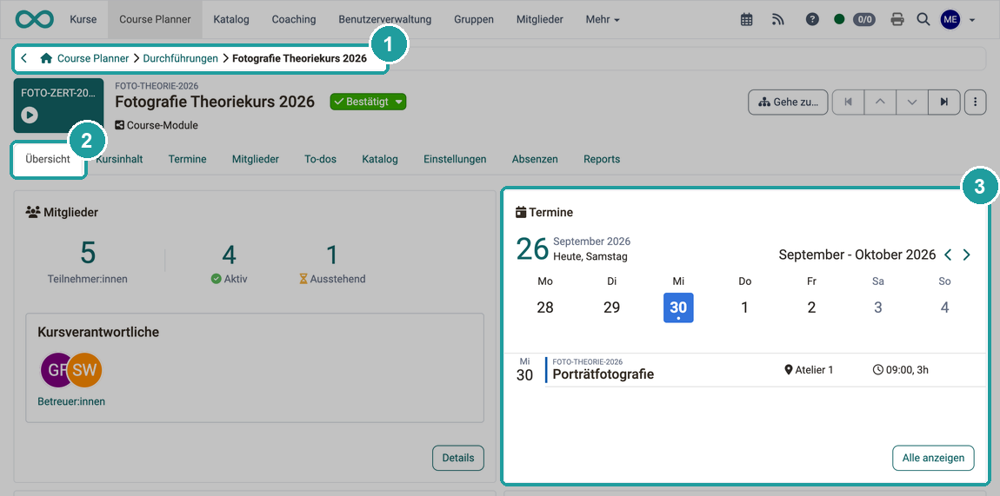
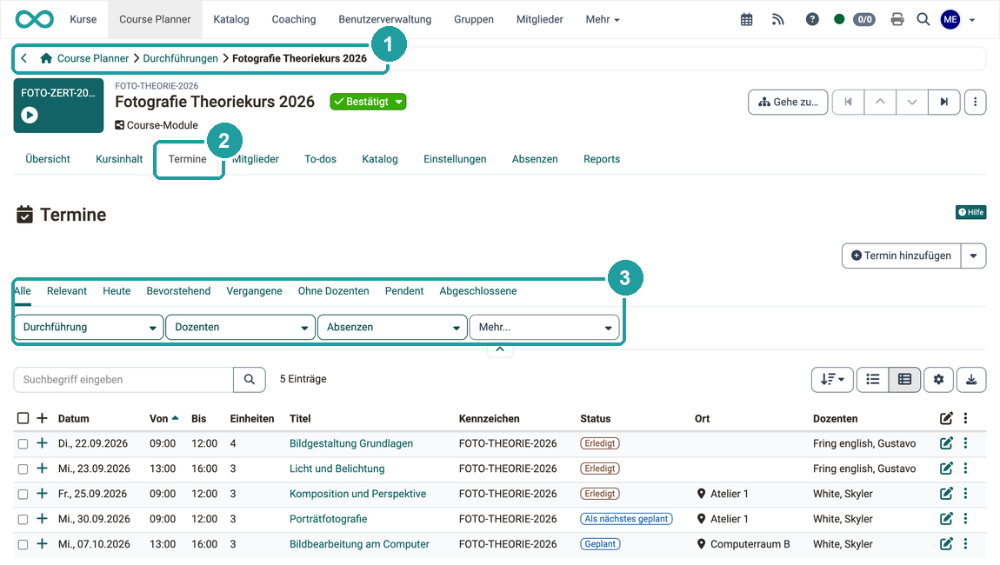
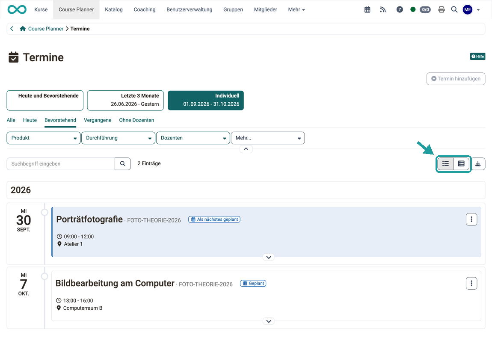
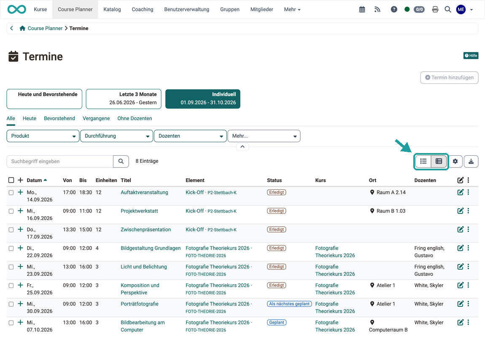
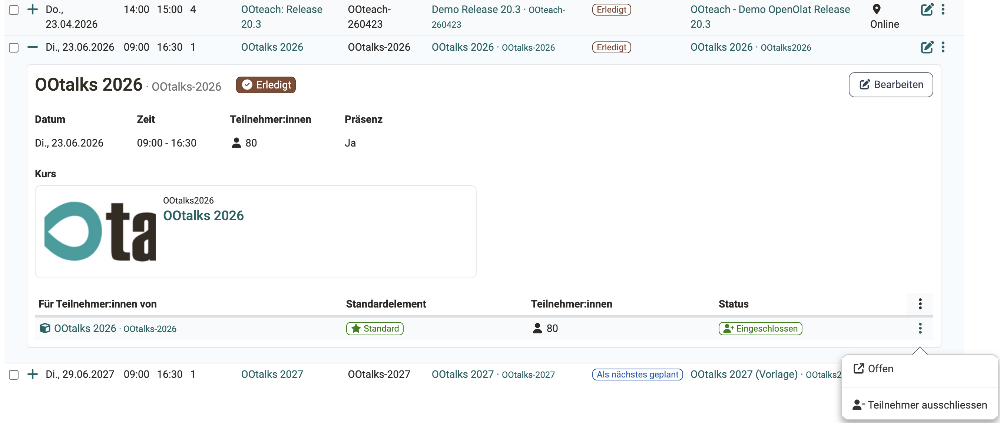
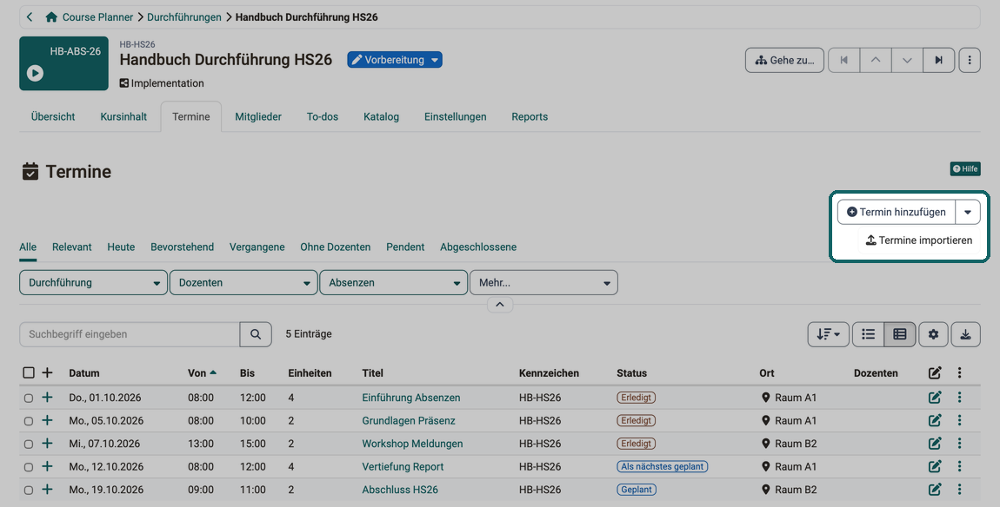
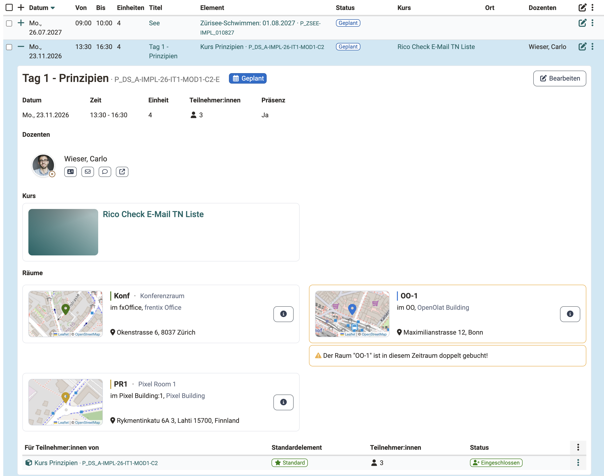
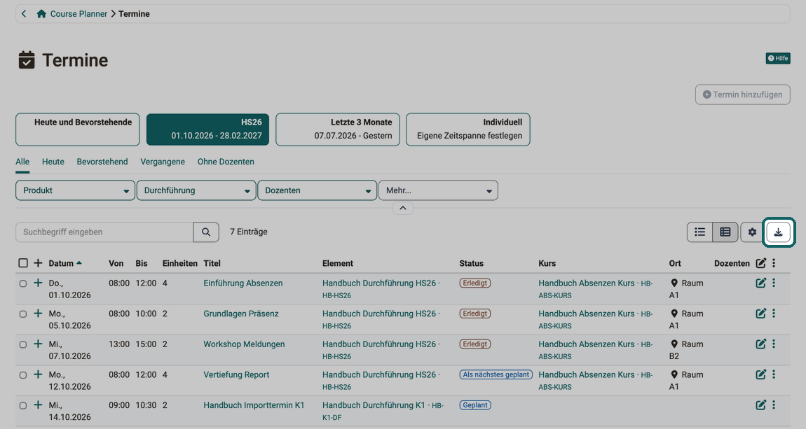

# Course Planner: Termine [:octicons-tag-16:{ title="ab Release 20.0 (OO-7834)" }](https://track.frentix.com/issue/OO-7834){:target="_blank"} {: #events}

{ class="shadow lightbox" title="Startseite des Course Planners" }

## Um welche Termine geht es im Course Planner? {: #type_of_events}

Die im Course Planner erstellten und angezeigten Termine beziehen sich auf die im Course Planner verwendeten Elemente. (Andere Termine, z.B. aus Projekten, sind hier im Course Planner nicht aufgeführt.)

[zum Seitenanfang ^](#events)

---

## Wo sehe ich Termine? {: #display_events}

### Auswahl aktueller Termine [:octicons-tag-16:{ title="ab Release 20.0 (OO-8067)" }](https://track.frentix.com/issue/OO-8067){:target="_blank"}

Eine Auswahl aktueller Termine finden Sie auf der **Übersicht des Course Planners**. 

{ class="shadow lightbox" title="Startseite des Course Planners" }

### Liste aller Termine {: #event_list}

Die komplette Übersicht über alle Termine im Course Planner erhalten Sie im Bereich "Termine": 
`Course Planner > Termine`

Verwenden Sie die Tabs und Filter zur Eingrenzung und Auswahl. Wie die Liste aussieht, zeigen die Bilder unter [Ansichten](#views).

### Termine einer bestimmten Durchführung {: #events_of_an_implementation}

Die **aktuell anstehenden** Termine einer Durchführung finden Sie auch unter 
`Course Planner > Durchführungen > "Ihre Durchführung" > Tab Übersicht`

{ class="shadow lightbox" title="Tab Übersicht einer Durchführung" }

**Alle** Termine einer Durchführung finden Sie unter 
`Course Planner > Durchführungen > "Ihre Durchführung" > Tab Termine`

Kann der Elementtyp der Durchführung Unterelemente enthalten, können Sie dort mit den Buttons "Alle Ebenen" und "Diese Ebene" alle Ebenen der Produktstruktur oder nur die aktuelle Ebene als Unterauswahl nehmen. Ausserdem stehen unterschiedliche Filter zur Verfügung.

{ class="shadow lightbox" title="Tab Termine einer Durchführung" }

### Ansichten {: #views}

Die Termine können als Zeitansicht (Timeline) oder als Tabelle dargestellt werden. Verwenden Sie zum Umschalten der Ansicht die Buttons rechts oben: links "Zeitansicht", rechts "Tabelle".

#### Zeitansicht

{ class="shadow lightbox" title="Zeitansicht im Bereich Termine" }

#### Tabellenansicht

{ class="shadow lightbox" title="Tabellenansicht im Bereich Termine" }

### Elemente eines Termins [:octicons-tag-16:{ title="ab Release 21.0 (OO-9544)" }](https://track.frentix.com/issue/OO-9544){:target="_blank"} {: #event_elements}

In der Terminliste zeigt die Spalte "Element", zu welchem Element ein Termin gehört. Mit Klick auf den Elementnamen öffnen Sie das Element direkt, auch wenn es nicht zur aktuell gewählten Durchführung oder zum aktuell gewählten Produkt gehört.

Bei modularisierten Kursen kann ein Termin Teilnehmer:innen aus mehreren Elementen haben. Die Detailansicht eines Termins listet diese Elemente in einer Tabelle auf:

* Die Spalte **"Für Teilnehmer:innen von"** nennt das Element, aus dem die Teilnehmenden stammen, die Spalte **"Teilnehmer:innen"** deren Anzahl.
* Die Spalte **"Standardelement"** kennzeichnet das Standardelement mit dem Label "Standard", wie im Kurs.
* Die Spalte "Status" zeigt mit den Labels **"Eingeschlossen"** und **"Ausgeschlossen"**, ob die Teilnehmer:innen des jeweiligen Elements in den Termin eingeschlossen oder davon ausgeschlossen sind.

Über die drei Punkte am Zeilenende steuern Sie, welche Elemente am Termin teilnehmen. Mit **"Offen"** öffnen Sie das Element, mit **"Teilnehmer ausschliessen"** nehmen Sie die Teilnehmenden dieses Elements vom Termin aus. Ausgeschlossene Elemente holen Sie mit **"Teilnehmer wieder einschliessen"** zurück; die Spalte "Status" wechselt entsprechend.

Die Detailansicht zeigt zusätzlich Datum, Zeit, Einheit, Teilnehmerzahl, Präsenz und Dozenten des Termins sowie den zugehörigen Kurs.

{ class="shadow lightbox" title="Detailansicht eines Termins" }

[zum Seitenanfang ^](#events)

---

## Wie erstelle ich neue Termine? {: #create_events}

Da sich Termine auf eine Durchführung beziehen, finden Sie die Möglichkeit zum Erstellen unter 
`Course Planner > Durchführungen > "Ihre Durchführung" > Tab Termine`

Auch im Tab Termine eines Produkts steht "Termin hinzufügen" zur Verfügung, sobald das Produkt mindestens eine Durchführung hat. Im ersten Schritt des Assistenten, "Element auswählen", wählen Sie die Durchführung oder das Element, zu dem der Termin gehört: 
`Course Planner > Produkte > "Ihr Produkt" > Tab Termine`

Im Bereich "Termine" des Course Planners ist "Termin hinzufügen" ausgegraut, weil dort weder eine Durchführung noch ein Produkt gewählt ist.

Im Tab Termine einer Durchführung können Sie nach Klick auf den kleinen Pfeil neben dem Button Termine auch importieren.

Erstellen Sie mit "Termin hinzufügen" einen Termin für einen Kurs, schaltet OpenOlat im Kurs die Termin- und Absenzenverwaltung ein, falls sie noch ausgeschaltet ist. Der Termin steht danach auch im Kurs zur Verfügung, ohne dass jemand die Kurseinstellungen anpassen muss. Importierte Termine schalten sie nicht ein, weder aus "Termine importieren" noch aus dem [Import-Assistenten des Course Planners](Course_Planner_Import_Export.de.md#import_wizard). Termine, die Sie im Tab Termine einer Durchführung importieren, erhalten keinen Kurs, auch wenn die Durchführung einen Kurs hat: In den Terminlisten bleibt die Spalte "Kurs" leer. Soll ein Termin zum Kurs gehören, erstellen Sie ihn mit "Termin hinzufügen". Mehr dazu unter [Kurseinstellungen - Tab Durchführung](../learningresources/Course_Settings_Execution.de.md#lecture_enabled). [:octicons-tag-16:{ title="ab Release 21.1.0 (OO-9711)" }](https://track.frentix.com/issue/OO-9711){:target="_blank"}

{ class="shadow lightbox" title="Tab Termine einer Durchführung · 2026.10.07" }

!!! tip "Damit ein Termin auch im Kalender erscheint"

    Ein Termin wird nur dann im Kurskalender eingetragen, wenn die Durchführung mit einem Kurs verknüpft ist und für diesen Kurs die Kalendersynchronisation eingeschaltet ist. Ist kein Kurs verknüpft, bleibt der Termin im Course Planner sichtbar, erscheint aber in keinem Kalender. Die Synchronisation schalten Sie im Kurs ein unter 
    `Kurs > Administration > Einstellungen > Tab Durchführung > Kurs Kalender synchronisieren` 
    Mehr dazu unter [Kurseinstellungen, Tab Durchführung](../learningresources/Course_Settings_Execution.de.md#course_calendar_sync).

[zum Seitenanfang ^](#events)

---

## Wie belege ich Räume für einen Termin? [:octicons-tag-16:{ title="ab Release 21.0 (OO-9526)" }](https://track.frentix.com/issue/OO-9526){:target="_blank"} {: #room_booking}

Ist das Modul «Räume» aktiviert, können Sie einem Termin einen oder mehrere Räume zuweisen. Das Feld «Räume» steht im Dialog zum Erstellen oder Bearbeiten eines Termins zur Verfügung, den Sie hier öffnen: 
`Course Planner > Durchführungen > "Ihre Durchführung" > Tab Termine`

Die Raumauswahl berücksichtigt den Zeitraum des Termins und zeigt, welche Räume «Verfügbar» und welche «Besetzt» sind. Zu jedem Raum werden das Gebäude und die Anzahl Plätze angezeigt; reicht die Kapazität für die Teilnehmerzahl nicht aus, wird darauf hingewiesen. Über «Räume hinzufügen» öffnen Sie eine Auswahl mit Tabellen- und Kalenderansicht, in der Sie nach Verfügbarkeit filtern und zu besetzten Räumen den früheren oder späteren freien Zeitraum sehen. In der Kalenderansicht dieser Auswahl öffnet ein Klick auf einen Eintrag das Callout «Buchung» mit Raum, Termin, Datum und Zeit der bestehenden Buchung. [:octicons-tag-16:{ title="ab Release 21.0.3 (OO-9715)" }](https://track.frentix.com/issue/OO-9715){:target="_blank"}

In der Detailansicht eines Termins erscheint der gebuchte Raum unter dem Label «Raum» als Raumkarte mit Kennzeichen, Gebäude und Standort; sind mehrere Räume gebucht, lautet das Label «Räume».

Ist ein Raum im Zeitraum des Termins doppelt gebucht, steht die Warnung «Der Raum "..." ist in diesem Zeitraum doppelt gebucht!» unterhalb der Raumkarte; die Karte erhält dazu einen gelben Rand. [:octicons-tag-16:{ title="ab Release 21.0.2 (OO-9641)" }](https://track.frentix.com/issue/OO-9641){:target="_blank"} Die Warnungen zu fehlenden Plätzen und zu inaktiven Räumen sehen Sie in der [Raumplanung](Course_Planner_Rooms.de.md#warnings).

{ class="shadow lightbox" title="Detailansicht eines Termins" }

!!! note "Admin. Rechte erforderlich"
    Räume und Gebäude werden in der System-Administration unter `Administration > Module > Räume` verwaltet; dafür sind administrative Rechte erforderlich. Fehlen Ihnen diese Rechte, wenden Sie sich an eine Person mit administrativer Rolle, wenn Sie neue Räume benötigen oder Angaben zu einem Raum anpassen lassen möchten.

[zum Seitenanfang ^](#events)

---

## Download der Termine als Excel-Liste  {: #download_events}

Bei Bedarf können die in der Liste angezeigten Termine auch als Excel-Datei heruntergeladen werden. Verwenden Sie dazu den Button rechts oben über der Liste.

{ class="shadow lightbox" title="Bereich Termine im Course Planner · 2026.10.07" }

[zum Seitenanfang ^](#events)

---

## Weiterführende Informationen {: #further_information}

**Auf dieser Seite erwähnt** 
[Course Planner: Import / Export >](../../manual_user/area_modules/Course_Planner_Import_Export.de.md) 
[Kurseinstellungen - Tab Durchführung >](../../manual_user/learningresources/Course_Settings_Execution.de.md) 
[Course Planner: Raumverwaltung >](../../manual_user/area_modules/Course_Planner_Rooms.de.md)

**Weiterführend** 
[Wie erstelle ich meinen ersten OpenOlat-Kurs? >](../../manual_how-to/my_first_course/my_first_course.de.md) 
[Course Planner: Übersicht >](../../manual_user/area_modules/Course_Planner.de.md) 
[Course Planner: Produkte >](../../manual_user/area_modules/Course_Planner_Products.de.md) 
[Course Planner: Durchführungen >](../../manual_user/area_modules/Course_Planner_Implementations.de.md) 
[Course Planner: Zertifikatsprogramme >](../../manual_user/area_modules/Course_Planner_Certification_Programs.de.md) 
[Course Planner: Reports >](../../manual_user/area_modules/Course_Planner_Reports.de.md) 
[Wie kann ich mit dem Course Planner Kursdurchführungen planen und durchführen? >](../../manual_how-to/course_planner_courses/course_planner_courses.de.md) 
[Wie kann ich mit dem Course Planner einen Bildungsgang planen und durchführen? >](../../manual_how-to/course_planner_curriculum/course_planner_curriculum.de.md) 
[Modul Course Planner >](../../manual_admin/administration/Modules_Course_Planner.de.md) 
[Modul Räume >](../../manual_admin/administration/Modules_Rooms.de.md)

[zum Seitenanfang ^](#events)

