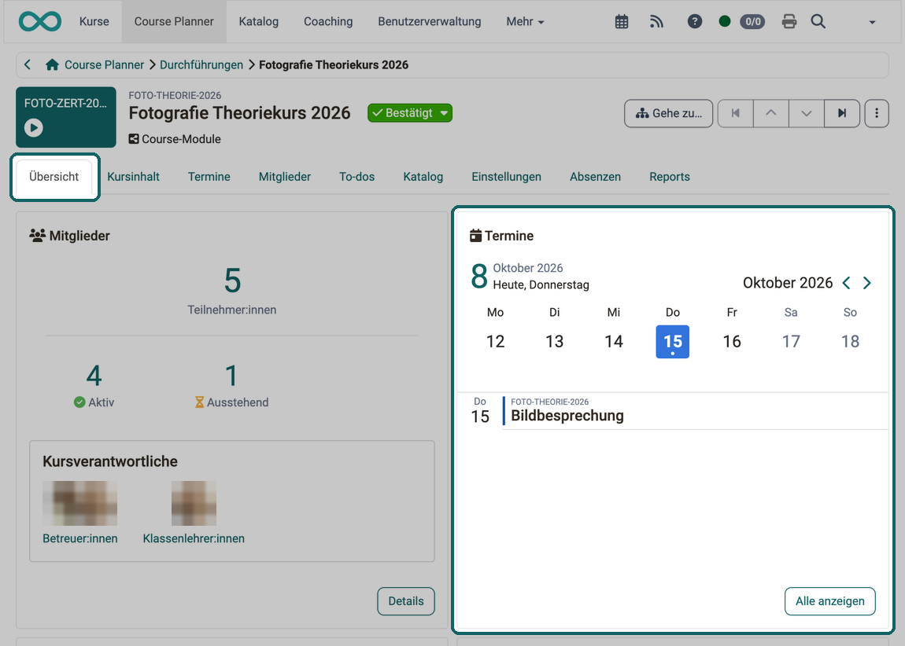
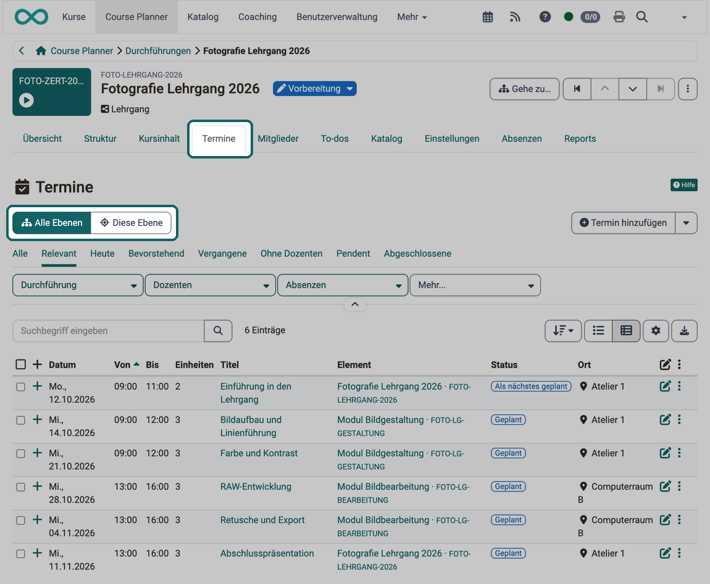
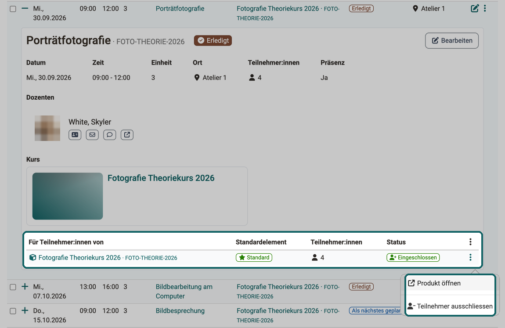
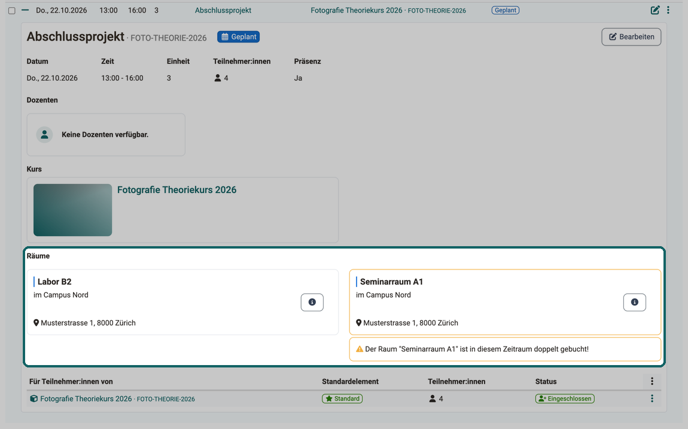

# Course Planner: Termine [:octicons-tag-16:{ title="ab Release 20.0 (OO-7834)" }](https://track.frentix.com/issue/OO-7834){:target="_blank"} {: #events}

{ class="shadow lightbox" title="Startseite des Course Planners" }

## Um welche Termine geht es im Course Planner? {: #type_of_events}

Im Course Planner sehen und planen Sie die Termine Ihrer Durchführungen, zum Beispiel die Kurstage eines Moduls. Termine aus anderen Bereichen, etwa aus Projekten, erscheinen hier nicht.

[zum Seitenanfang ^](#events)

---

## Wo sehe ich Termine? {: #display_events}

### Auswahl aktueller Termine [:octicons-tag-16:{ title="ab Release 20.0 (OO-8067)" }](https://track.frentix.com/issue/OO-8067){:target="_blank"}

Die Termine der laufenden Woche sehen Sie auf der Startseite des Course Planners im Widget "Termine".

{ class="shadow lightbox" title="Startseite des Course Planners" }

### Liste aller Termine {: #event_list}

Die komplette Übersicht über alle Termine im Course Planner erhalten Sie im Bereich "Termine": 
`Course Planner > Termine`

Mit den Buttons für den Zeitraum, den Tabs und den Filtern grenzen Sie die Liste ein. Wie die Liste aussieht, zeigen die Bilder unter [Ansichten](#views).

### Termine einer bestimmten Durchführung {: #events_of_an_implementation}

Die anstehenden Termine einer Durchführung sehen Sie auch in ihrem Tab "Übersicht": 
`Course Planner > Durchführungen > "Ihre Durchführung" > Tab Übersicht`

Das Widget "Termine" zeigt die laufende Woche. Steht bis Ende der Woche kein Termin mehr an, zeigt es "Keine Termine bis Ende der Woche". Mit "Nächster Termin" springen Sie dann zur Woche mit dem nächsten Termin.

{ class="shadow lightbox" title="Tab Übersicht einer Durchführung · 2026.10.08" }

Alle Termine einer Durchführung stehen in ihrem Tab "Termine": 
`Course Planner > Durchführungen > "Ihre Durchführung" > Tab Termine`

Im Course Planner heisst jeder Teil eines Produkts Element: die Durchführung selbst und alles, was darunter liegt, zum Beispiel ein Modul. Kann Ihre Durchführung weitere Elemente enthalten, stehen über der Liste die Buttons "Alle Ebenen" und "Diese Ebene":

* **Alle Ebenen** zeigt die Termine der Durchführung und aller ihrer Elemente. So sehen Sie auch die Termine der Module.
* **Diese Ebene** zeigt nur die Termine, die direkt zur geöffneten Durchführung gehören.

Zu welchem Element ein Termin gehört, zeigt die Spalte "Element". Sie blenden sie über das Zahnrad rechts über der Liste ein. Fehlen die beiden Buttons, kann Ihre Durchführung keine weiteren Elemente enthalten; das legt ihr Typ fest. Mit den Tabs und Filtern grenzen Sie die Liste weiter ein.

{ class="shadow lightbox" title="Tab Termine einer Durchführung · 2026.10.08" }

### Ansichten {: #views}

Die Termine sehen Sie als Zeitansicht oder als Tabelle. Mit den beiden Symbolen rechts über der Liste wechseln Sie die Ansicht: links die Zeitansicht, rechts die Tabellenansicht.

#### Zeitansicht

{ class="shadow lightbox" title="Zeitansicht im Bereich Termine" }

#### Tabellenansicht

{ class="shadow lightbox" title="Tabellenansicht im Bereich Termine" }

### Für wen ein Termin gilt [:octicons-tag-16:{ title="ab Release 21.0 (OO-9544)" }](https://track.frentix.com/issue/OO-9544){:target="_blank"} {: #event_elements}

In der Terminliste zeigt die Spalte "Element", zu welchem Element ein Termin gehört, etwa zur Durchführung oder zu einem ihrer Module. Ein Klick auf den Namen öffnet dieses Element, auch wenn es nicht zur gerade geöffneten Durchführung oder zum gerade geöffneten Produkt gehört.

Wird ein Kurs in mehreren Durchführungen oder Modulen genutzt, kann ein Termin dieses Kurses für Teilnehmende aus mehreren Elementen gelten. Für wen ein Termin gilt, sehen Sie in seiner Detailansicht: Klicken Sie auf das + am Anfang der Zeile. Zuunterst steht eine Tabelle mit einer Zeile pro Element:

* **Für Teilnehmer:innen von** nennt das Element, aus dem die Teilnehmenden kommen. Die Spalte "Teilnehmer:innen" zeigt ihre Anzahl.
* **Standardelement** zeigt beim Standardelement des Kurses das Label "Standard". Dasselbe Label sehen Sie im Kurs in der [Mitgliederverwaltung im Bereich Course Planner](../learningresources/Members_management.de.md#section_course_planner).
* **Status** zeigt "Eingeschlossen", wenn die Teilnehmenden dieses Elements zum Termin gehören, und "Ausgeschlossen", wenn sie davon ausgenommen sind.

Sollen die Teilnehmenden eines Elements nicht an diesem Termin teilnehmen, öffnen Sie das 3-Punkte-Menü am Ende ihrer Zeile und wählen "Teilnehmer ausschliessen". Mit "Teilnehmer wieder einschliessen" im selben Menü nehmen Sie sie wieder auf; die Spalte "Status" zeigt den neuen Stand. Beide Einträge sehen Sie nur, wenn Sie den Termin bearbeiten dürfen. Mit "Produkt öffnen" öffnen Sie das Element in einem neuen Fenster.

Über der Tabelle zeigt die Detailansicht "Datum", "Zeit", "Einheit", "Ort", "Teilnehmer:innen", "Präsenz" und "Dozenten" des Termins sowie unter "Kurs" den zugehörigen Kurs.

{ class="shadow lightbox" title="Detailansicht eines Termins · 2026.10.08" }

[zum Seitenanfang ^](#events)

---

## Wie erstelle ich neue Termine? {: #create_events}

Einen neuen Termin legen Sie mit "Termin hinzufügen" im Tab "Termine" der Durchführung an: 
`Course Planner > Durchführungen > "Ihre Durchführung" > Tab Termine`

Auch im Tab Termine eines Produkts steht "Termin hinzufügen" zur Verfügung, sobald das Produkt mindestens eine Durchführung hat. Im ersten Schritt des Assistenten, "Element auswählen", wählen Sie die Durchführung oder das Element, zu dem der Termin gehört: 
`Course Planner > Produkte > "Ihr Produkt" > Tab Termine`

Im Bereich "Termine" des Course Planners ist "Termin hinzufügen" ausgegraut, weil dort weder eine Durchführung noch ein Produkt gewählt ist.

Viele Termine auf einmal übernehmen Sie im Tab Termine einer Durchführung aus einer Excel-Datei: Klicken Sie auf den kleinen Pfeil neben dem Button "Termin hinzufügen" und wählen Sie "Termine importieren".

Erstellen Sie mit "Termin hinzufügen" einen Termin für einen Kurs, schaltet OpenOlat im Kurs die Termin- und Absenzenverwaltung ein, falls sie noch ausgeschaltet ist. Der Termin steht danach auch im Kurs zur Verfügung, ohne dass jemand die Kurseinstellungen anpassen muss. Importierte Termine schalten sie nicht ein, weder aus "Termine importieren" noch aus dem [Import-Assistenten des Course Planners](Course_Planner_Import_Export.de.md#import_wizard). Mehr dazu unter [Kurseinstellungen - Tab Durchführung](../learningresources/Course_Settings_Execution.de.md#lecture_enabled). [:octicons-tag-16:{ title="ab Release 21.1.0 (OO-9711)" }](https://track.frentix.com/issue/OO-9711){:target="_blank"}

{ class="shadow lightbox" title="Tab Termine einer Durchführung · 2026.10.07" }

!!! tip "Damit ein Termin auch im Kalender erscheint"

    Ein Termin wird nur dann im Kurskalender eingetragen, wenn die Durchführung mit einem Kurs verknüpft ist und für diesen Kurs die Kalendersynchronisation eingeschaltet ist. Ist kein Kurs verknüpft, bleibt der Termin im Course Planner sichtbar, erscheint aber in keinem Kalender. Die Synchronisation schalten Sie im Kurs ein unter 
    `Kurs > Administration > Einstellungen > Tab Durchführung > Kurs Kalender synchronisieren` 
    Mehr dazu unter [Kurseinstellungen, Tab Durchführung](../learningresources/Course_Settings_Execution.de.md#course_calendar_sync).

[zum Seitenanfang ^](#events)

---

## Wie belege ich Räume für einen Termin? [:octicons-tag-16:{ title="ab Release 21.0 (OO-9526)" }](https://track.frentix.com/issue/OO-9526){:target="_blank"} {: #room_booking}

Ist das Modul "Räume" aktiviert, können Sie einem Termin einen oder mehrere Räume zuweisen. Das Feld "Räume" steht im Dialog zum Erstellen oder Bearbeiten eines Termins zur Verfügung, den Sie hier öffnen: 
`Course Planner > Durchführungen > "Ihre Durchführung" > Tab Termine`

Die Raumauswahl berücksichtigt den Zeitraum des Termins und zeigt, welche Räume "Verfügbar" und welche "Besetzt" sind. Zu jedem Raum sehen Sie das Gebäude und die Anzahl Plätze; reicht die Kapazität für die Teilnehmerzahl nicht aus, weist OpenOlat darauf hin. Über "Räume hinzufügen" öffnen Sie eine Auswahl mit Tabellen- und Kalenderansicht, in der Sie nach Verfügbarkeit filtern und zu besetzten Räumen den früheren oder späteren freien Zeitraum sehen. In der Kalenderansicht dieser Auswahl öffnet ein Klick auf einen Eintrag das Fenster "Buchung" mit Raum, Termin, Datum und Zeit der bestehenden Buchung. [:octicons-tag-16:{ title="ab Release 21.0.3 (OO-9715)" }](https://track.frentix.com/issue/OO-9715){:target="_blank"}

In der Detailansicht eines Termins erscheint der gebuchte Raum unter dem Label "Raum" als Raumkarte mit Kennzeichen, Gebäude und Standort; sind mehrere Räume gebucht, lautet das Label "Räume".

Ist ein Raum im Zeitraum des Termins doppelt gebucht, steht die Warnung "Der Raum "..." ist in diesem Zeitraum doppelt gebucht!" unterhalb der Raumkarte; die Karte erhält dazu einen gelben Rand. [:octicons-tag-16:{ title="ab Release 21.0.2 (OO-9641)" }](https://track.frentix.com/issue/OO-9641){:target="_blank"} Die Warnungen zu fehlenden Plätzen und zu inaktiven Räumen sehen Sie in der [Raumplanung](Course_Planner_Rooms.de.md#warnings).

{ class="shadow lightbox" title="Detailansicht eines Termins · 2026.10.09" }

!!! note "Admin. Rechte erforderlich"
    Räume und Gebäude werden in der System-Administration unter `Administration > Module > Räume` verwaltet; dafür sind administrative Rechte erforderlich. Fehlen Ihnen diese Rechte, wenden Sie sich an eine Person mit administrativer Rolle, wenn Sie neue Räume benötigen oder Angaben zu einem Raum anpassen lassen möchten.

[zum Seitenanfang ^](#events)

---

## Download der Termine als Excel-Liste  {: #download_events}

Die Termine, die die Liste gerade zeigt, laden Sie mit dem Download-Button rechts über der Liste als Excel-Datei herunter.

{ class="shadow lightbox" title="Bereich Termine im Course Planner · 2026.10.07" }

[zum Seitenanfang ^](#events)

---

## Weiterführende Informationen {: #further_information}

**Auf dieser Seite erwähnt** 
[Mitgliederverwaltung >](../../manual_user/learningresources/Members_management.de.md) 
[Course Planner: Import / Export >](../../manual_user/area_modules/Course_Planner_Import_Export.de.md) 
[Kurseinstellungen - Tab Durchführung >](../../manual_user/learningresources/Course_Settings_Execution.de.md) 
[Course Planner: Raumverwaltung >](../../manual_user/area_modules/Course_Planner_Rooms.de.md)

**Weiterführend** 
[Wie erstelle ich meinen ersten OpenOlat-Kurs? >](../../manual_how-to/my_first_course/my_first_course.de.md) 
[Course Planner: Übersicht >](../../manual_user/area_modules/Course_Planner.de.md) 
[Course Planner: Produkte >](../../manual_user/area_modules/Course_Planner_Products.de.md) 
[Course Planner: Durchführungen >](../../manual_user/area_modules/Course_Planner_Implementations.de.md) 
[Course Planner: Zertifikatsprogramme >](../../manual_user/area_modules/Course_Planner_Certification_Programs.de.md) 
[Course Planner: Reports >](../../manual_user/area_modules/Course_Planner_Reports.de.md) 
[Wie kann ich mit dem Course Planner Kursdurchführungen planen und durchführen? >](../../manual_how-to/course_planner_courses/course_planner_courses.de.md) 
[Wie kann ich mit dem Course Planner einen Bildungsgang planen und durchführen? >](../../manual_how-to/course_planner_curriculum/course_planner_curriculum.de.md) 
[Modul Course Planner >](../../manual_admin/administration/Modules_Course_Planner.de.md) 
[Modul Räume >](../../manual_admin/administration/Modules_Rooms.de.md)

[zum Seitenanfang ^](#events)

