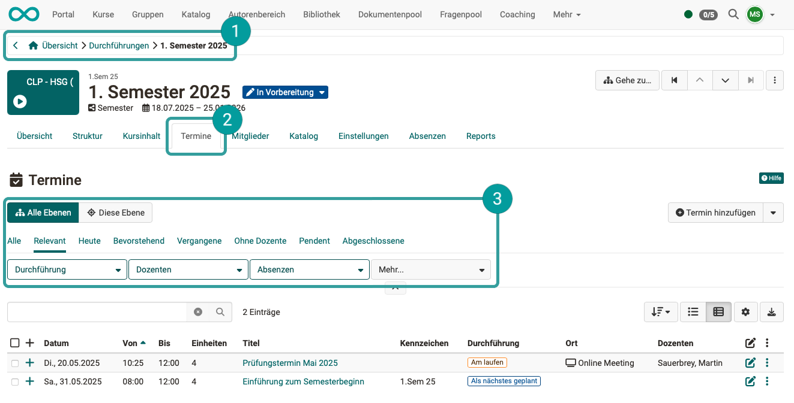
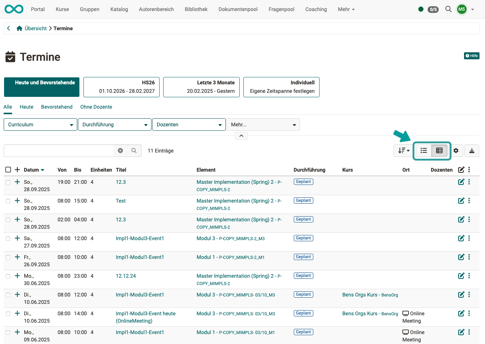
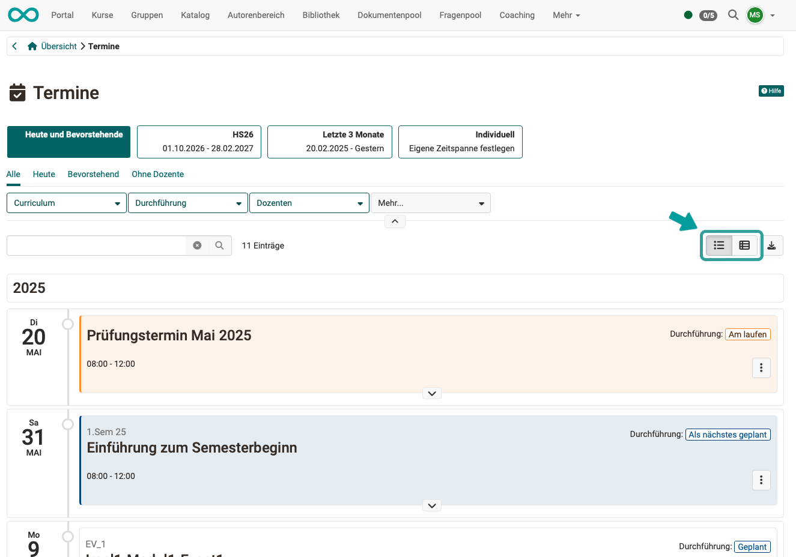
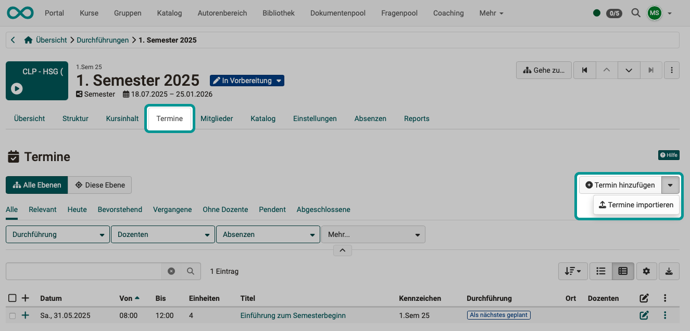
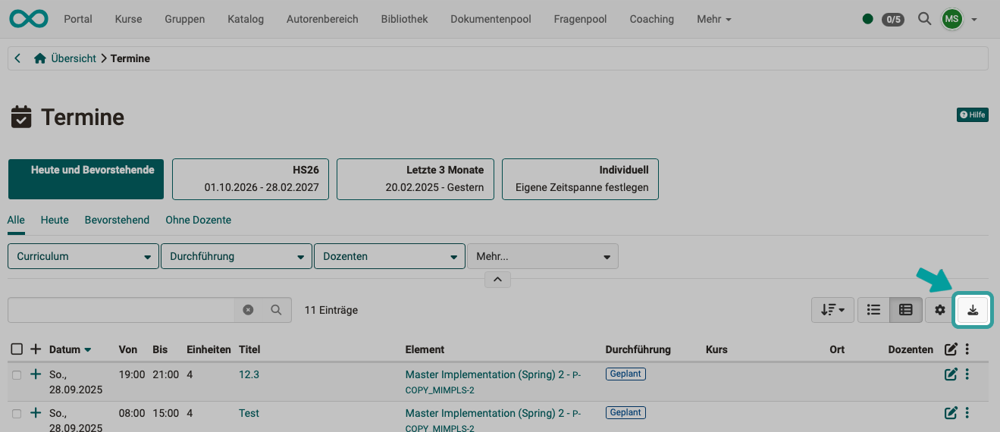

# Course Planner: Termine {: #events}

{ class="shadow lightbox" }

## Um welche Termine geht es im Course Planner? {: #type_of_events}

Die im Course Planner erstellten und angezeigten Termine beziehen sich auf die im Course Planner verwendeten Elemente. (Andere Termine, z.B. aus Projekten, sind hier im Course Planner nicht aufgeführt.)

[zum Seitenanfang ^](#events)

---

## Wo sehe ich Termine? {: #display_events}

### Auswahl aktueller Termine

Eine Auswahl aktueller Termine finden Sie auf der **Übersicht des Course Planners**. 

{ class="shadow lightbox" }

### Liste aller Termine {: #event_list}

Die komplette Übersicht über alle Termine im Course Planner erhalten Sie im Bereich "Termine". Verwenden Sie die Tabs und Filter zur Eingrenzung und Auswahl.

{ class="shadow lightbox" }

{ class="shadow lightbox" }

### Termine einer bestimmten Durchführung {: #events_of_an_implementation}

Die **aktuell anstehenden** Termine einer Durchführung finden Sie auch unter 
**Course Planner Übersicht > Durchführungen > Durchführung wählen > Tab Übersicht**

{ class="shadow lightbox" }

**Alle** Termine einer Durchführung finden Sie unter 
**Course Planner Übersicht > Durchführungen > Durchführung wählen > Tab Termine**

Sie können dort alle Ebenen der Produktstruktur oder nur die aktuelle Ebene als Unterauswahl nehmen. Ausserdem stehen unterschiedliche Filter zur Verfügung.

{ class="shadow lightbox" }

### Ansichten {: #views}

Die Termine können in einer Listenansicht oder als Timeline dargestellt werden. Verwenden Sie zum Umschalten der Ansicht die Buttons rechts oben.

=== "Listenansicht"

    { class="shadow lightbox" }

=== "Ansicht als Timeline"

    { class="shadow lightbox" }

[zum Seitenanfang ^](#events)

---

## Wie erstelle ich neue Termine?  {: #create_events}

Da sich Termine auf eine Durchführung beziehen, finden Sie die Möglichkeit zum Erstellen unter 
**Course Planner Übersicht > Durchführungen > Durchführung wählen > Tab Termine**

Nach Klick auf den kleinen Pfeil neben dem Button können Sie Termine auch importieren. 

{ class="shadow lightbox" }

[zum Seitenanfang ^](#events)

---

## Download der Termine als Excel-Liste  {: #download_events}

Bei Bedarf können die in der Liste angezeigten Termine auch als Excel-Datei heruntergeladen werden. Verwenden Sie dazu den Button rechts oben über der Liste.

{ class="shadow lightbox" }

[zum Seitenanfang ^](#events)

---

## Weitere Informationen {: #further_information}

[Wie erstelle ich meinen ersten OpenOlat-Kurs >](../my_first_course/my_first_course.de.md) 
[Course Planner: Übersicht >](../../manual_user/area_modules/Course_Planner.de.md) 
[Course Planner: Produkte >](../../manual_user/area_modules/Course_Planner_Products.de.md) 
[Course Planner: Durchführungen >](../../manual_user/area_modules/Course_Planner_Implementations.de.md) 
[Course Planner: Reports >](../../manual_user/area_modules/Course_Planner_Reports.de.md) 
[Wie kann ich mit dem Course Planner Kursdurchführungen planen und durchführen? >](../../manual_how-to/course_planner_courses/course_planner_courses.de.md) 
[Wie kann ich mit dem Course Planner einen Bildungsgang planen und durchführen? >](../../manual_how-to/course_planner_curriculum/course_planner_curriculum.de.md) 
[Course Planner aktivieren (Admin) >](../../manual_admin/administration/Modules_Course_Planner.de.md) 

[zum Seitenanfang ^](#events)

