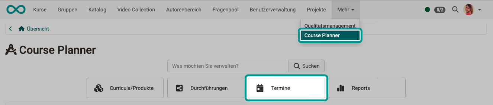
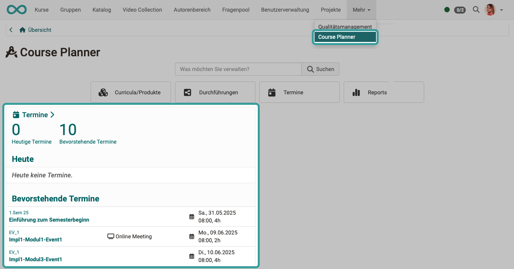
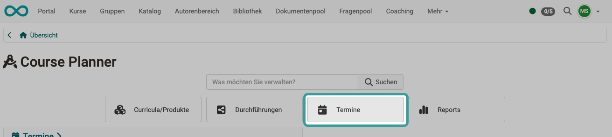
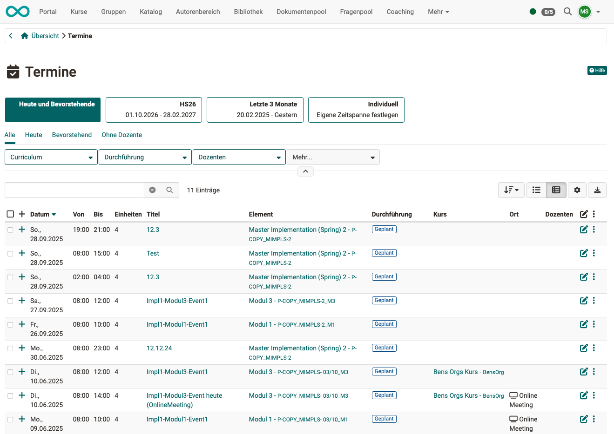
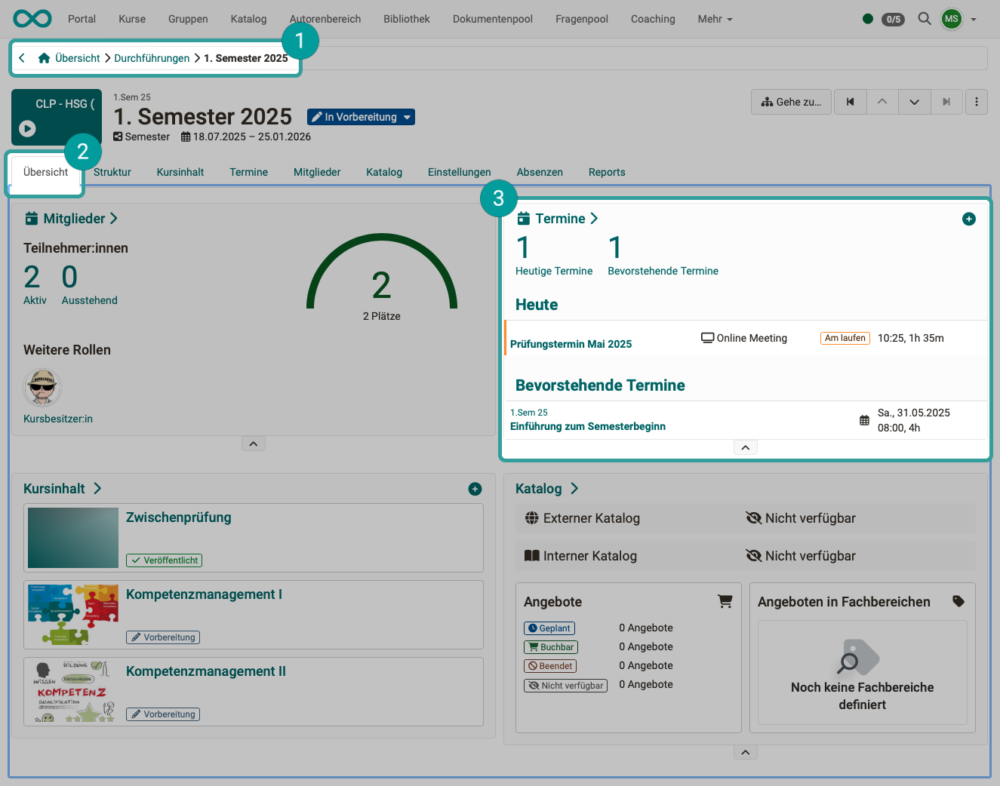
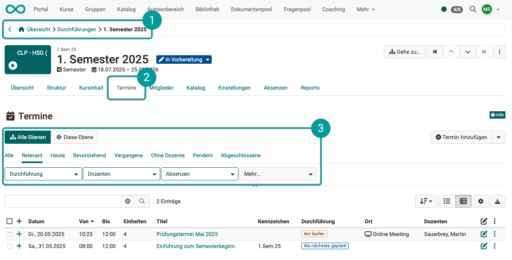
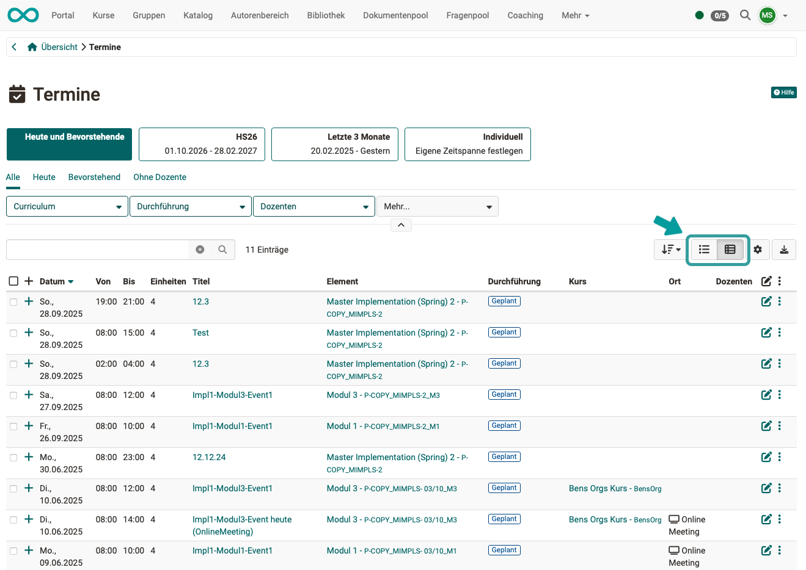
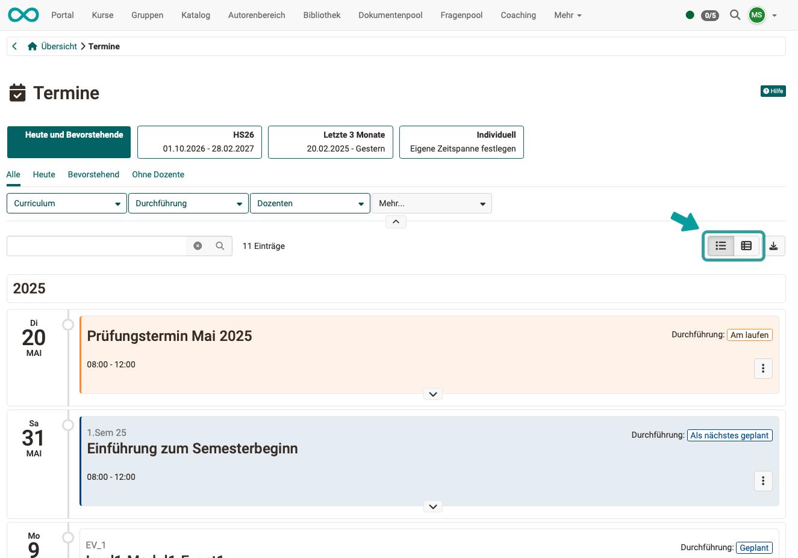
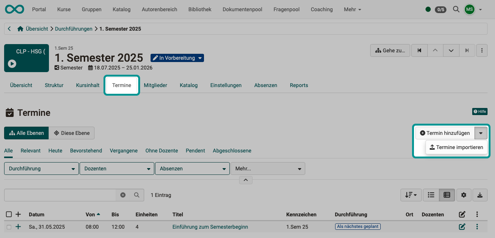
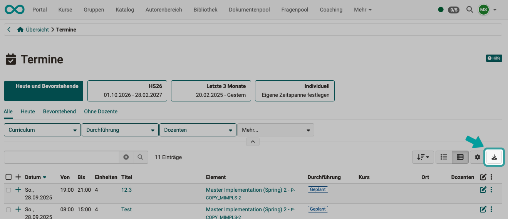

# Course Planner: Events {: #events}

{ class="shadow lightbox" }

## What dates does the Course Planner cover? {: #type_of_events}

The dates created and displayed in the Course Planner refer to the elements used in the Course Planner. (Other dates, e.g. from projects, are not listed here in the Course Planner).

[To the top of the page ^](#events)

---

## Where can I see events? {: #display_events}

### Selection of current events

You can find a selection of current dates on the **Overview of the Course Planner**.

{ class="shadow lightbox" }

### List of all events {: #event_list}

You will find a complete overview of all dates in the Course Planner in the "Dates" section. Use the tabs and filters to narrow down and select.

{ class="shadow lightbox" }

{ class="shadow lightbox" }

### Events of an implementation {: #events_of_an_implementation}

You can also find the **currently upcoming** dates of an implementation under 
**Course Planner Overview > Implementations > Select Implementation > Tab Overview**

{ class="shadow lightbox" }

**All** dates of a realization can be found under 
**Course Planner Overview > Implementations > Select Implementation > Tab Events**

You can use all levels of the product structure or just the current level as a sub-selection. Various filters are also available.

{ class="shadow lightbox" }

### Views {: #views}

The appointments can be displayed in a list view or as a timeline. Use the buttons at the top right to switch the view.

=== "List View"

    { class="shadow lightbox" }

=== "View as timeline"

    { class="shadow lightbox" }

[To the top of the page ^](#events)

---

## How do I create new events? {: #create_events}

As appointments refer to an implementation, you will find the option to create under 
**Course Planner Overview > Implementations > Select implementation > Tab Events**

You can also import appointments by clicking on the small arrow next to the button.

{ class="shadow lightbox" }

[To the top of the page ^](#events)

---

## Download events as excel list {: #download_events}

If required, the dates displayed in the list can also be downloaded as an Excel file. To do this, use the button at the top right of the list.

{ class="shadow lightbox" }

[To the top of the page ^](#events)

---

## Further information {: #further_information}

[How do I create my first OpenOlat course >](../my_first_course/my_first_course.md) 
[Course Planner: Overview >](../../manual_user/area_modules/Course_Planner.md) 
[Course Planner: Products >](../../manual_user/area_modules/Course_Planner_Products.md) 
[Course Planner: Implementations >](../../manual_user/area_modules/Course_Planner_Implementations.md) 
[Course Planner: Reports >](../../manual_user/area_modules/Course_Planner_Reports.md) 
[How can I plan and run courses with the Course Planner? >](../../manual_how-to/course_planner_courses/course_planner_courses.md) 
[How can I plan and run a course with the Course Planner? >](../../manual_how-to/course_planner_curriculum/course_planner_curriculum.md) 
[Activate Course Planner (Admin) >](../../manual_admin/administration/Modules_Course_Planner.md) 

[To the top of the page ^](#events)

