# Course Planner: Events [:octicons-tag-16:{ title="from Release 20.0 (OO-7834)" }](https://track.frentix.com/issue/OO-7834){:target="_blank"} {: #events}

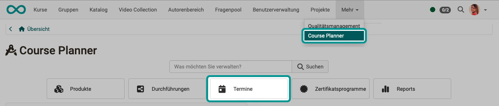{ class="shadow lightbox" }

## Which events does the Course Planner cover? {: #type_of_events}

The events created and displayed in the Course Planner refer to the elements used in the Course Planner. (Other events, e.g. from projects, are not listed here in the Course Planner.)

[To the top of the page ^](#events)

---

## Where can I see events? {: #display_events}

### Selection of current events [:octicons-tag-16:{ title="from Release 20.0 (OO-8067)" }](https://track.frentix.com/issue/OO-8067){:target="_blank"}

You can find a selection of current events on the **overview of the Course Planner**.

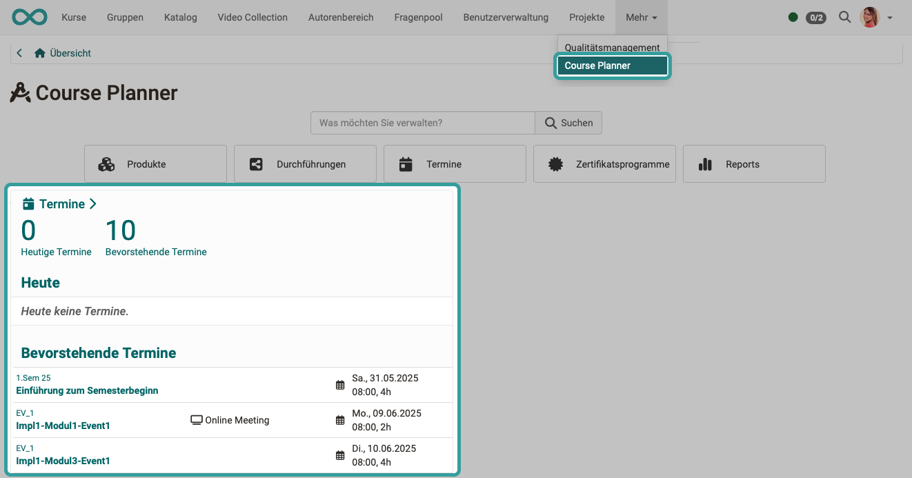{ class="shadow lightbox" }

### List of all events {: #event_list}

You will find the complete overview of all events in the Course Planner in the "Events" area. Use the tabs and filters to narrow down and select.

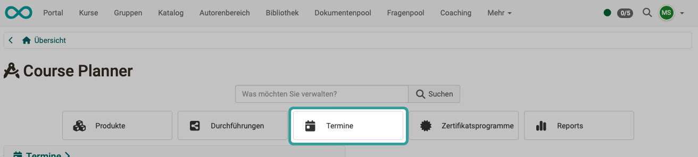{ class="shadow lightbox" }

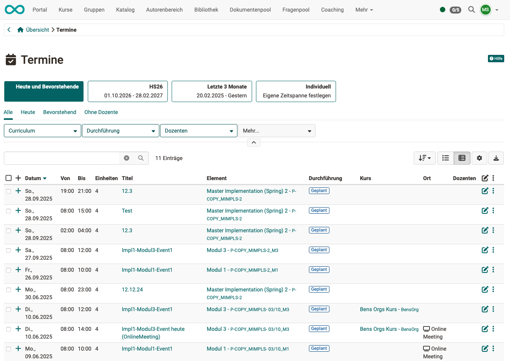{ class="shadow lightbox" }

### Events of an implementation {: #events_of_an_implementation}

You can also find the **currently upcoming** events of an implementation under 
`Course Planner > Implementations > "your implementation" > Tab Overview`

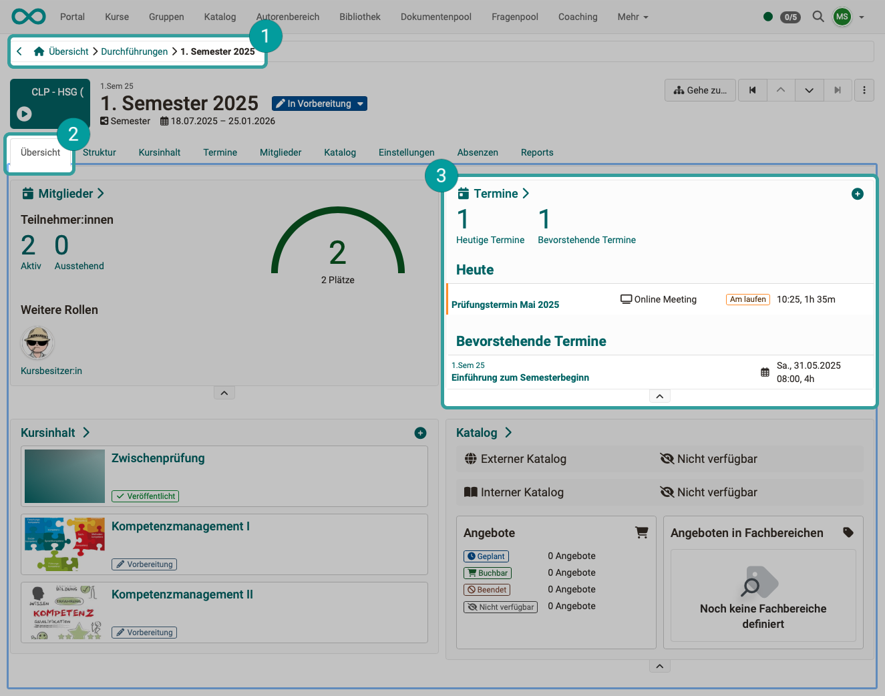{ class="shadow lightbox" }

**All** events of an implementation can be found under 
`Course Planner > Implementations > "your implementation" > Tab Events`

You can use all levels of the product structure or just the current level as a sub-selection. Various filters are also available.

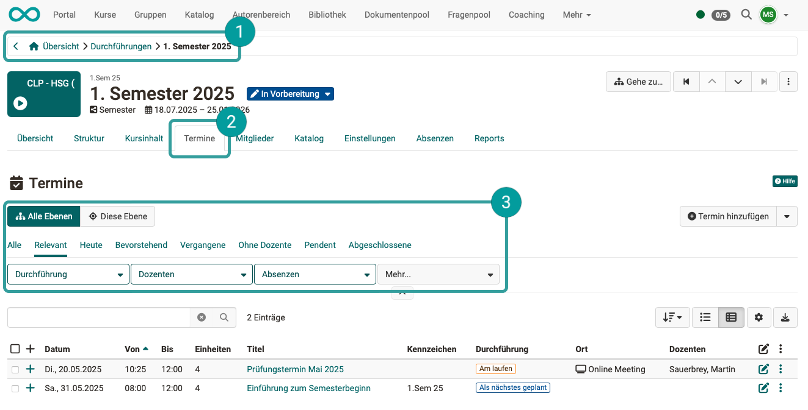{ class="shadow lightbox" }

### Views {: #views}

The events can be displayed as a timeline or as a table. Use the buttons at the top right to switch the view: "Timeline" on the left, "Table view" on the right.

#### Timeline

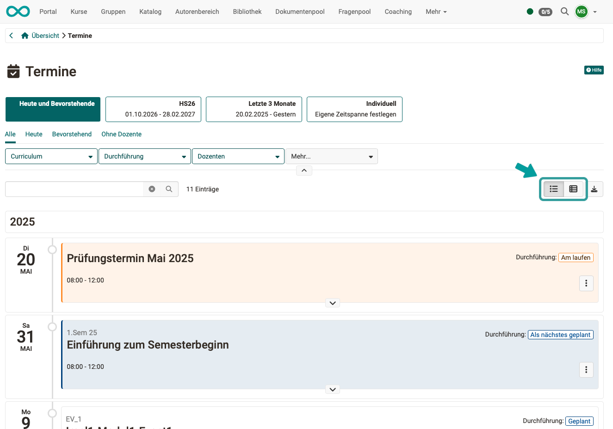{ class="shadow lightbox" }

#### Table view

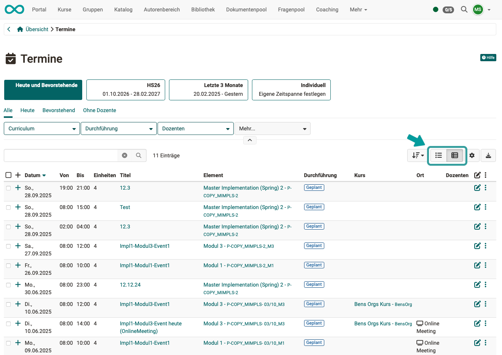{ class="shadow lightbox" }

### Elements of an event [:octicons-tag-16:{ title="from Release 21.0 (OO-9544)" }](https://track.frentix.com/issue/OO-9544){:target="_blank"} {: #event_elements}

In the event list, the "Element" column shows which element an event belongs to. Click the element name to open the element directly, even if it does not belong to the currently selected implementation or product.

With modularized courses, an event can have participants from several elements. The detail view of an event lists these elements in a table:

* The **"For participants of"** column names the element the participants come from, the **"Participants"** column their number.
* The **"Default element"** column marks the default element with the "Default" label, as in the course.
* The "Status" column uses the labels **"Included"** and **"Excluded"** to show whether the participants of the respective element are included in or excluded from the event.

Use the three dots at the end of a row to control which elements take part in the event. With **"Open"** you open the element, with **"Exclude participants"** you take the participants of this element out of the event. You bring excluded elements back with **"Include participants again"**; the "Status" column changes accordingly.

The detail view additionally shows the date, time, number of participants and mandatory attendance of the event as well as the associated course.

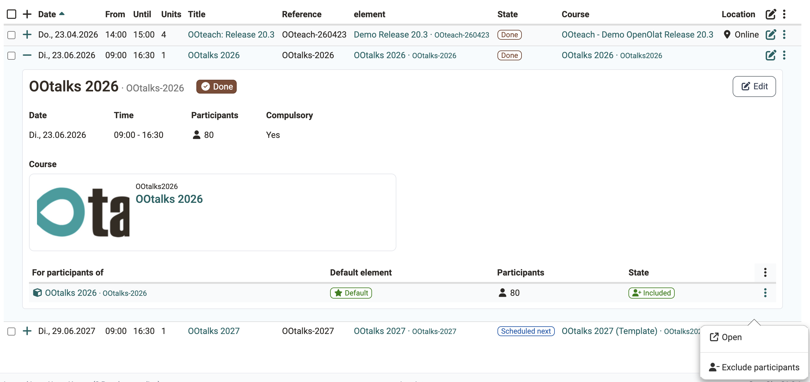{ class="shadow lightbox" }

[To the top of the page ^](#events)

---

## How do I create new events? {: #create_events}

As events refer to an implementation, you will find the option to create them under 
`Course Planner > Implementations > "your implementation" > Tab Events`

You can also import events by clicking on the small arrow next to the button.

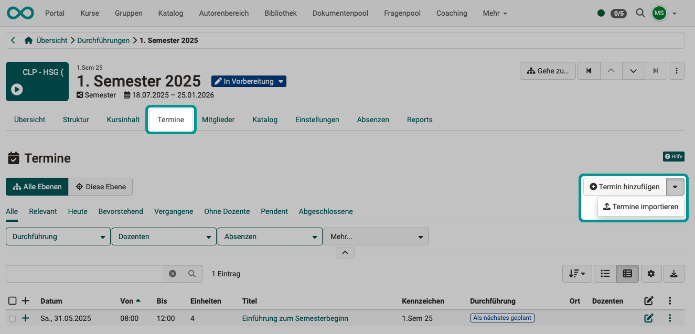{ class="shadow lightbox" }

[To the top of the page ^](#events)

---

## How do I book rooms for an event? [:octicons-tag-16:{ title="from Release 21.0 (OO-9526)" }](https://track.frentix.com/issue/OO-9526){:target="_blank"} {: #room_booking}

If the module "Rooms" is activated, you can assign one or more rooms to an event. The "Rooms" field is available in the dialog for creating or editing an event, which you open here: 
`Course Planner > Implementations > "your implementation" > Tab Events`

The room selection takes the time period of the event into account and shows which rooms are "Available" and which are "Occupied". The building and the number of seats are displayed for each room; if the capacity is not sufficient for the number of participants, this is indicated. Via "Add rooms" you open a selection with table and calendar view, where you can filter by availability and see the earlier or later free time slot for occupied rooms.

In the detail view of an event, the booked room appears under the label "Room" as a room card with reference, building and location; if several rooms are booked, the label is "Rooms". Conflicts such as a double booking or insufficient seats are displayed as a warning.

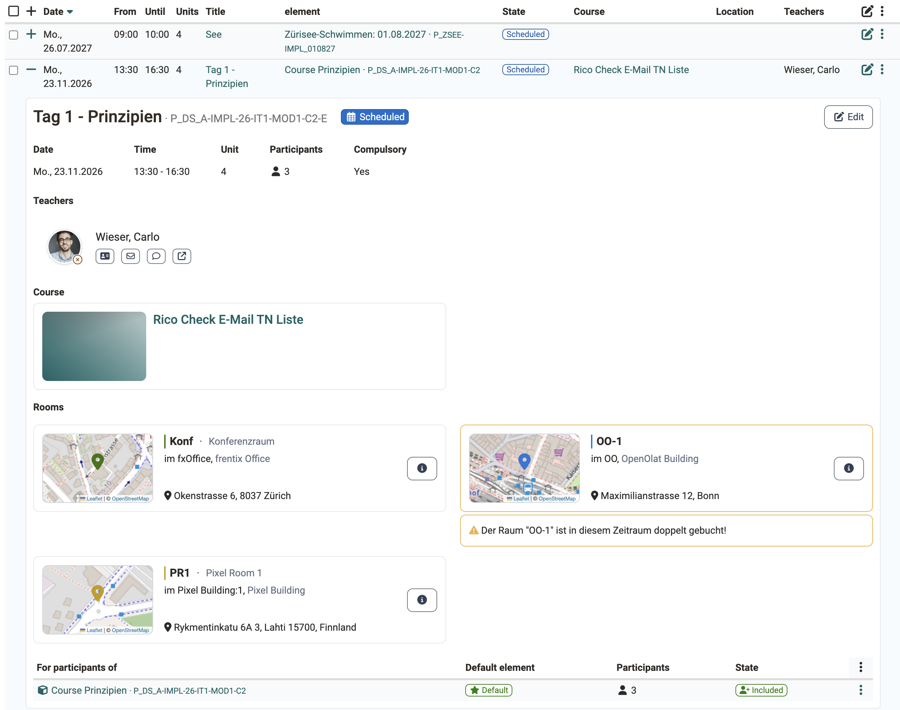{ class="shadow lightbox" }

!!! note "Admin. rights required"
    Rooms and buildings are managed in the system administration under `Administration > Modules > Rooms`; this requires administrative rights. If you do not have these rights, contact a person with an administrative role if you need new rooms or want to have the details of a room adjusted.

[To the top of the page ^](#events)

---

## Download events as an Excel list {: #download_events}

If required, the events displayed in the list can also be downloaded as an Excel file. To do this, use the button at the top right of the list.

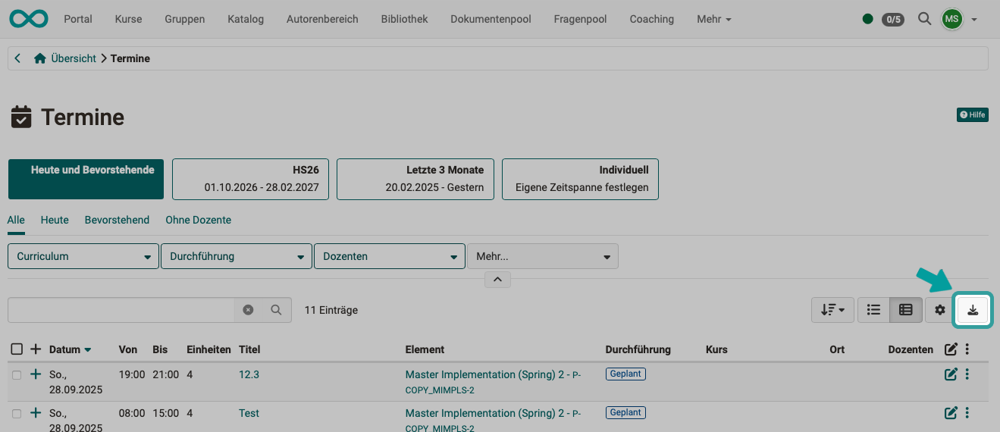{ class="shadow lightbox" }

[To the top of the page ^](#events)

---

## Further information {: #further_information}

[How do I create my first OpenOlat course? >](../../manual_how-to/my_first_course/my_first_course.md) 
[Course Planner: Overview >](../../manual_user/area_modules/Course_Planner.md) 
[Course Planner: Products >](../../manual_user/area_modules/Course_Planner_Products.md) 
[Course Planner: Implementations >](../../manual_user/area_modules/Course_Planner_Implementations.md) 
[Course Planner: Certification programs >](../../manual_user/area_modules/Course_Planner_Certification_Programs.md) 
[Course Planner: Reports >](../../manual_user/area_modules/Course_Planner_Reports.md) 
[How do I plan and run courses with the Course Planner? >](../../manual_how-to/course_planner_courses/course_planner_courses.md) 
[How do I plan and run a curriculum with the Course Planner? >](../../manual_how-to/course_planner_curriculum/course_planner_curriculum.md) 
[Activate Course Planner (Admin) >](../../manual_admin/administration/Modules_Course_Planner.md)

[To the top of the page ^](#events)
