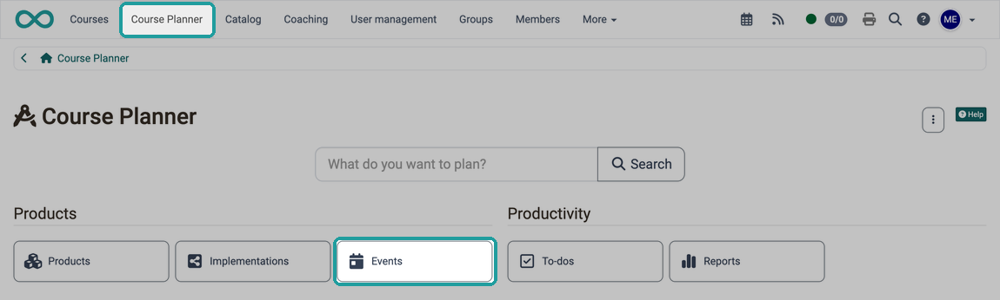
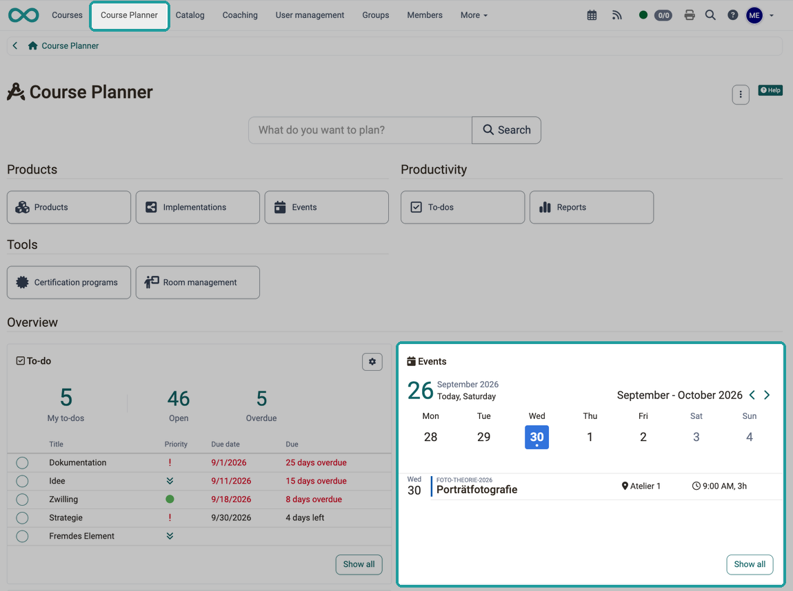
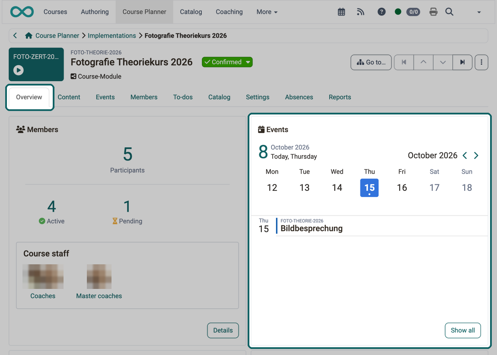
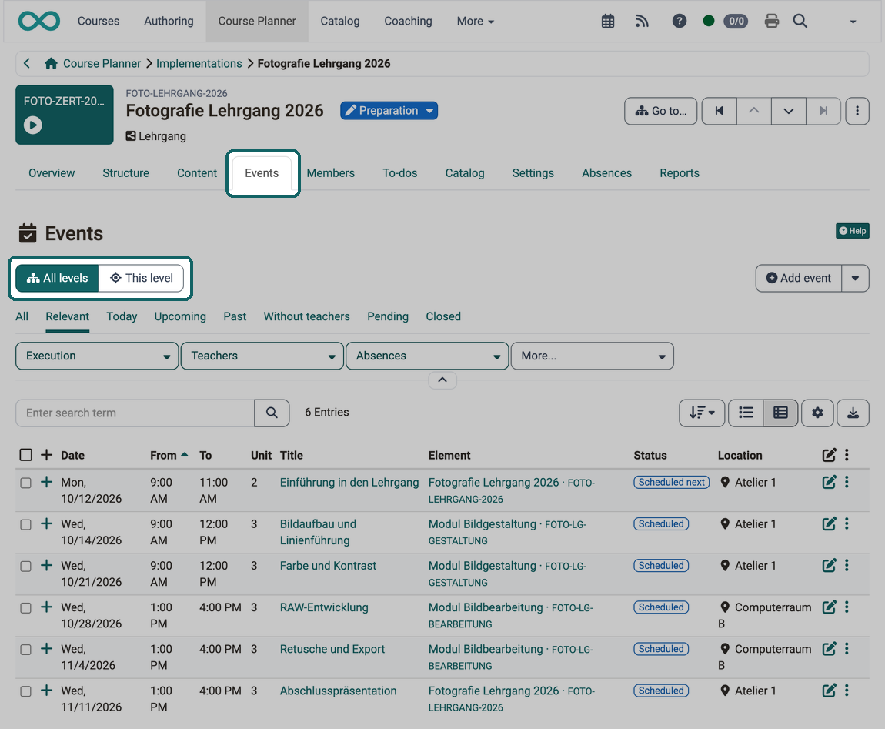
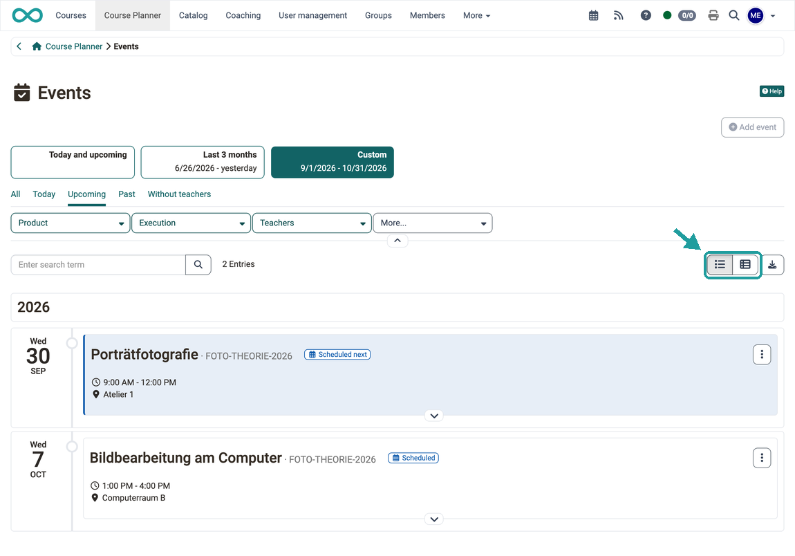
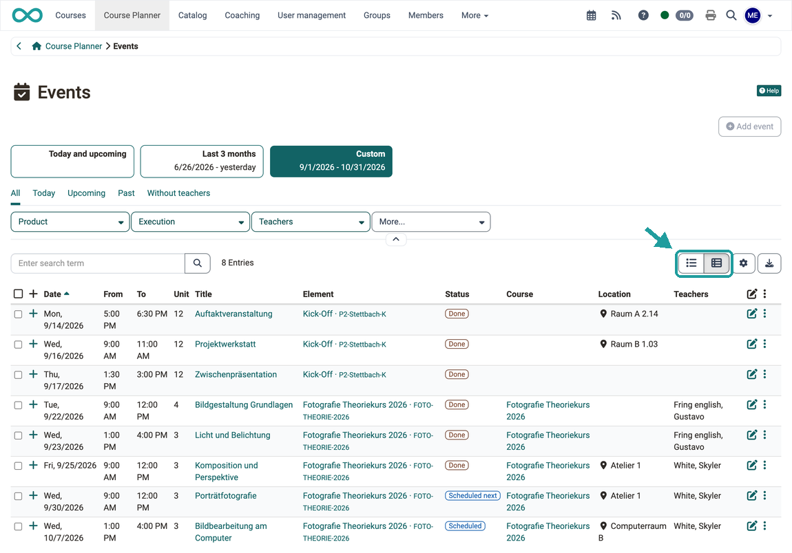
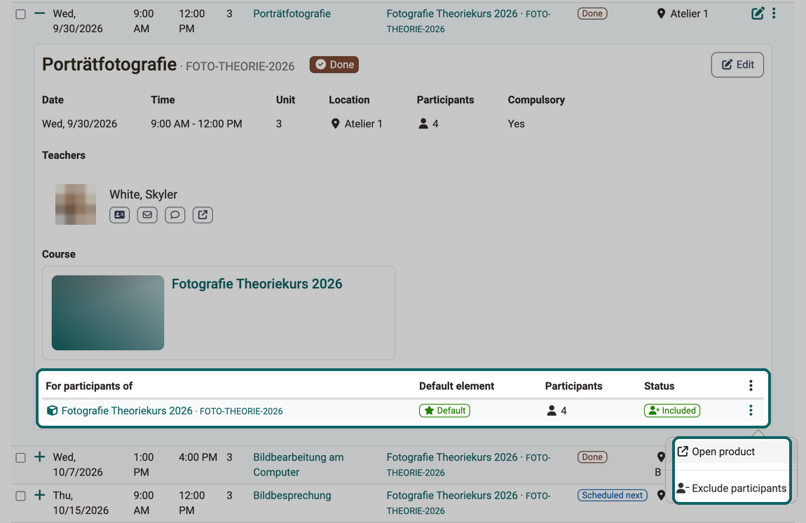
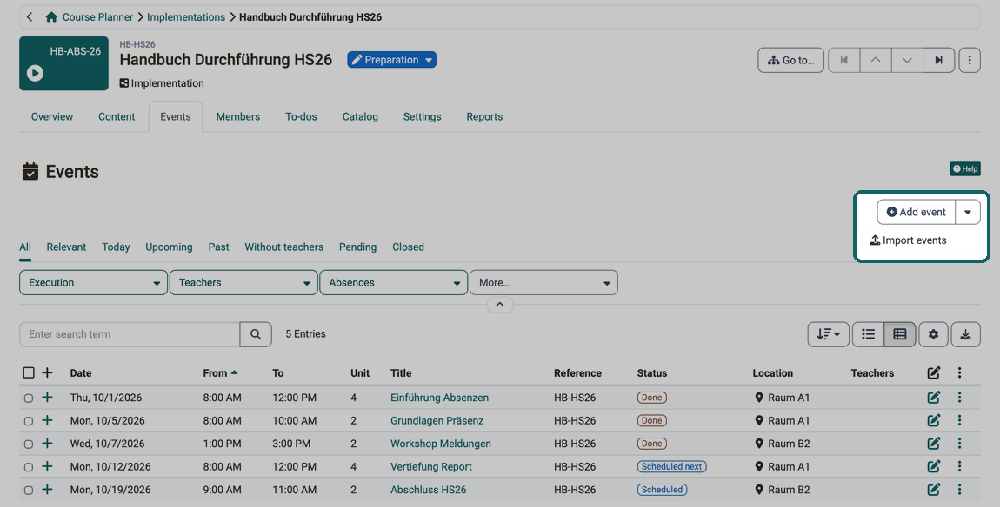
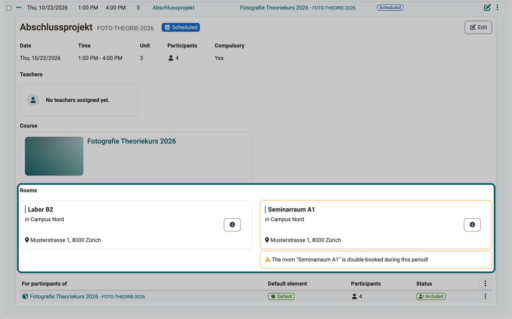
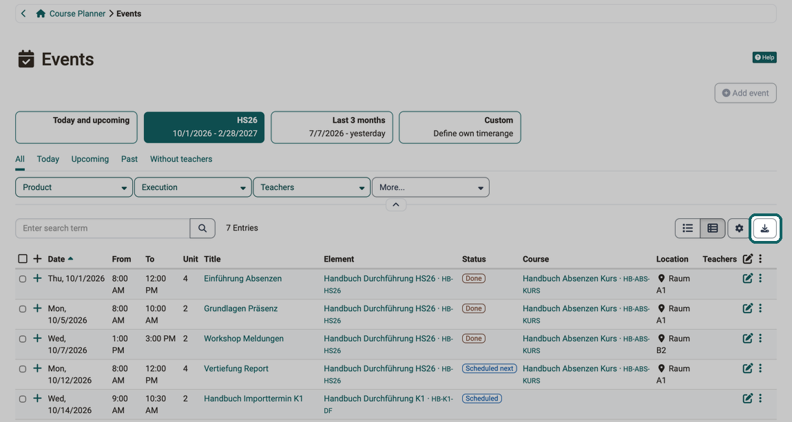

# Course Planner: Events [:octicons-tag-16:{ title="from Release 20.0 (OO-7834)" }](https://track.frentix.com/issue/OO-7834){:target="_blank"} {: #events}

{ class="shadow lightbox" title="Start page of the Course Planner" }

## Which events does the Course Planner cover? {: #type_of_events}

In the Course Planner you see and plan the events of your implementations, for example the course days of a module. Events from other areas, such as projects, do not appear here.

[To the top of the page ^](#events)

---

## Where can I see events? {: #display_events}

### Selection of current events [:octicons-tag-16:{ title="from Release 20.0 (OO-8067)" }](https://track.frentix.com/issue/OO-8067){:target="_blank"}

You see the events of the current week on the start page of the Course Planner in the "Events" widget.

{ class="shadow lightbox" title="Start page of the Course Planner" }

### List of all events {: #event_list}

You will find the complete overview of all events in the Course Planner in the "Events" area: 
`Course Planner > Events`

Use the buttons for the period, the tabs and the filters to narrow down the list. The images under [Views](#views) show what the list looks like.

### Events of an implementation {: #events_of_an_implementation}

You also see the upcoming events of an implementation in its "Overview" tab: 
`Course Planner > Implementations > "your implementation" > Tab Overview`

The "Events" widget shows the current week. If no event is left until the end of the week, it shows "No events until the end of the week". "Next event" then takes you to the week with the next event.

{ class="shadow lightbox" title="Overview tab of an implementation · 2026.10.08" }

All events of an implementation are in its "Events" tab: 
`Course Planner > Implementations > "your implementation" > Tab Events`

In the Course Planner, every part of a product is called an element: the implementation itself and everything below it, for example a module. If your implementation can contain further elements, the buttons "All levels" and "This level" appear above the list:

* **All levels** shows the events of the implementation and of all its elements. This way you also see the events of the modules.
* **This level** shows only the events that belong directly to the open implementation.

The "Element" column shows which element an event belongs to. You show it via the gear icon at the top right above the list. If the two buttons are missing, your implementation cannot contain further elements; its type determines this. Use the tabs and filters to narrow down the list further.

{ class="shadow lightbox" title="Events tab of an implementation · 2026.10.08" }

### Views {: #views}

You see the events as a timeline or as a table. Use the two symbols at the top right above the list to switch the view: the timeline on the left, the table view on the right.

#### Timeline

{ class="shadow lightbox" title="Timeline in the Events area" }

#### Table view

{ class="shadow lightbox" title="Table view in the Events area" }

### Who an event is for [:octicons-tag-16:{ title="from Release 21.0 (OO-9544)" }](https://track.frentix.com/issue/OO-9544){:target="_blank"} {: #event_elements}

In the event list, the "Element" column shows which element an event belongs to, for example the implementation or one of its modules. A click on the name opens this element, even if it does not belong to the implementation or product that is currently open.

If a course is used in several implementations or modules, an event of this course can apply to participants from several elements. You see who an event is for in its detail view: click the + at the beginning of the row. At the very bottom there is a table with one row per element:

* **For participants of** names the element the participants come from. The "Participants" column shows their number.
* **Default element** shows the "Default" label for the default element of the course. You see the same label in the course in the [members management in the Course Planner area](../learningresources/Members_management.md#section_course_planner).
* **Status** shows "Included" if the participants of this element belong to the event, and "Excluded" if they are left out.

If the participants of an element are not to take part in this event, open the 3-dot menu at the end of their row and choose "Exclude participants". With "Include participants again" in the same menu you add them back; the "Status" column shows the new state. You only see both entries if you may edit the event. "Open product" opens the element in a new window.

Above the table, the detail view shows the "Date", "Time", "Unit", "Location", "Participants", "Compulsory" and "Teachers" of the event as well as the associated course under "Course".

{ class="shadow lightbox" title="Detail view of an event · 2026.10.08" }

[To the top of the page ^](#events)

---

## How do I create new events? {: #create_events}

You create a new event with "Add event" in the "Events" tab of the implementation: 
`Course Planner > Implementations > "your implementation" > Tab Events`

"Add event" is also available in the Events tab of a product as soon as the product has at least one implementation. In the first step of the wizard, "Select element", you choose the implementation or the element the event belongs to: 
`Course Planner > Products > "your product" > Tab Events`

In the "Events" area of the Course Planner, "Add event" is greyed out because neither an implementation nor a product is selected there.

To take over many events at once from an Excel file, use the Events tab of an implementation: click the small arrow next to the "Add event" button and choose "Import events".

If you create an event for a course with "Add event", OpenOlat switches on the Event & absence management in the course if it is still switched off. The event is then also available in the course without anyone having to adjust the course settings. Imported events do not switch it on, neither from "Import events" nor from the [import wizard of the Course Planner](Course_Planner_Import_Export.md#import_wizard). More on this under [Course Settings - Tab Execution](../learningresources/Course_Settings_Execution.md#lecture_enabled). [:octicons-tag-16:{ title="from Release 21.1.0 (OO-9711)" }](https://track.frentix.com/issue/OO-9711){:target="_blank"}

{ class="shadow lightbox" title="Events tab of an implementation · 2026.10.07" }

!!! tip "So an event also appears in the calendar"

    An event is entered in the course calendar only if the implementation is linked to a course and the calendar synchronization is switched on for this course. If no course is linked, the event stays visible in the Course Planner but appears in no calendar. You switch the synchronization on in the course here: 
    `Course > Administration > Settings > Tab Execution > Synchronize course calendar` 
    More on this under [Course Settings, Tab Execution](../learningresources/Course_Settings_Execution.md#course_calendar_sync).

[To the top of the page ^](#events)

---

## How do I book rooms for an event? [:octicons-tag-16:{ title="from Release 21.0 (OO-9526)" }](https://track.frentix.com/issue/OO-9526){:target="_blank"} {: #room_booking}

If the module "Rooms" is activated, you can assign one or more rooms to an event. The "Rooms" field is available in the dialog for creating or editing an event, which you open here: 
`Course Planner > Implementations > "your implementation" > Tab Events`

The room selection takes the time period of the event into account and shows which rooms are "Available" and which are "Occupied". For each room you see the building and the number of seats; if the capacity is not sufficient for the number of participants, OpenOlat points this out. Via "Add rooms" you open a selection with table and calendar view, where you can filter by availability and see the earlier or later free time slot for occupied rooms. In the calendar view of this selection, a click on an entry opens the "Booking" window with room, event, date and time of the existing booking. [:octicons-tag-16:{ title="from Release 21.0.3 (OO-9715)" }](https://track.frentix.com/issue/OO-9715){:target="_blank"}

In the detail view of an event, the booked room appears under the label "Room" as a room card with reference, building and location; if several rooms are booked, the label is "Rooms".

If a room is double-booked during the period of the event, the warning "The room "..." is double-booked during this period!" appears below the room card, and the card gets a yellow border. [:octicons-tag-16:{ title="from Release 21.0.2 (OO-9641)" }](https://track.frentix.com/issue/OO-9641){:target="_blank"} You see the warnings about missing seats and inactive rooms in the [room scheduling](Course_Planner_Rooms.md#warnings).

{ class="shadow lightbox" title="Detail view of an event · 2026.10.09" }

!!! note "Admin. rights required"
    Rooms and buildings are managed in the system administration under `Administration > Modules > Rooms`; this requires administrative rights. If you do not have these rights, contact a person with an administrative role if you need new rooms or want to have the details of a room adjusted.

[To the top of the page ^](#events)

---

## Download events as an Excel list {: #download_events}

Use the download button at the top right above the list to download the events the list currently shows as an Excel file.

{ class="shadow lightbox" title="Events area in the Course Planner · 2026.10.07" }

[To the top of the page ^](#events)

---

## Further information {: #further_information}

**Mentioned on this page** 
[Members management >](../../manual_user/learningresources/Members_management.md) 
[Course Planner: Import / Export >](../../manual_user/area_modules/Course_Planner_Import_Export.md) 
[Course Settings - Tab Execution >](../../manual_user/learningresources/Course_Settings_Execution.md) 
[Course Planner: Room management >](../../manual_user/area_modules/Course_Planner_Rooms.md)

**Further reading** 
[How do I create my first OpenOlat course? >](../../manual_how-to/my_first_course/my_first_course.md) 
[Course Planner: Overview >](../../manual_user/area_modules/Course_Planner.md) 
[Course Planner: Products >](../../manual_user/area_modules/Course_Planner_Products.md) 
[Course Planner: Implementations >](../../manual_user/area_modules/Course_Planner_Implementations.md) 
[Course Planner: Certification programs >](../../manual_user/area_modules/Course_Planner_Certification_Programs.md) 
[Course Planner: Reports >](../../manual_user/area_modules/Course_Planner_Reports.md) 
[How do I plan and run courses with the Course Planner? >](../../manual_how-to/course_planner_courses/course_planner_courses.md) 
[How do I plan and run a curriculum with the Course Planner? >](../../manual_how-to/course_planner_curriculum/course_planner_curriculum.md) 
[Module Course Planner >](../../manual_admin/administration/Modules_Course_Planner.md) 
[Module Rooms >](../../manual_admin/administration/Modules_Rooms.md)

[To the top of the page ^](#events)
