# Course Planner: Durchführungen [:octicons-tag-16:{ title="ab Release 20.0 (OO-7834)" }](https://track.frentix.com/issue/OO-7834){:target="_blank"} {: #implementations}

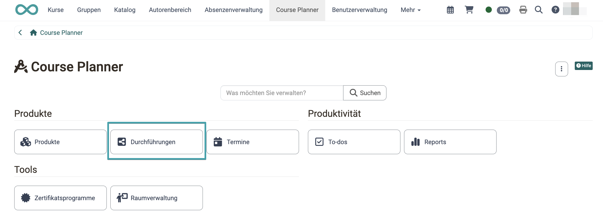{ class="shadow lightbox" } 

## Was ist eine Durchführung? {: #definition}

Ein Bildungsprogramm/Produkt (aus einem oder mehreren Kursen bestehend) kann mehrfach angeboten und durchgeführt werden. Jede Durchführung kann zu einem anderen Termin stattfinden und an jeder Durchführung sind dann andere Teilnehmer:innen dabei.

In einem Bildungsprogramm/Produkt werden zu jeder Durchführung ein oder mehrere Kurse zugeordnet. Der oder die mehrfach verwendeten Kurse sind nur einmal vorhanden.

Soll ein Kurs mehrfach verwendet werden und dabei immer genau gleich bleiben, kann er auch als Template angelegt werden. Die Kurse werden dann für jede Durchführung instanziert (aus der Template-Vorlage erstellt). Diese Instanzierung kann auch automatisiert zu einem bestimmten Termin erfolgen. Z.B. einige Tage vor Beginn einer Durchführung. Bis dahin können die Templatebesitzer:innen noch an der Fertigstellung der Template-Kurse arbeiten. Das Organisatorische zur Durchführung (Termin, Katalogangebot, usw.) kann aber mit dem Course Planner bereits vorbereitet sein.

Von dieser Konzeptidee her, werden in der Regel in jeder Durchführung die gleichen Kurse zugeordnet und verwendet. Es ist aber in OpenOlat auch möglich, die Inhalte in jeder Durchführung anzupassen.

[zum Seitenanfang ^](#implementations)

---

## Die Liste der Durchführungen {: #listing}

Haben Sie in der Übersicht des Course Planners den Button "Durchführungen" gewählt, gelangen Sie zunächst zu einer Liste aller Durchführungen dieses Produkts. Sie können mit Filtern die Auswahl eingrenzen.

{ class="shadow lightbox" }  

Mit **Filter speichern** können häufig verwendete Filterkombinationen als eigene Voreinstellung gespeichert und wiederverwendet werden. [:octicons-tag-16:{ title="ab Release 20.3 (OO-9223)" }](https://track.frentix.com/issue/OO-9223){:target="_blank"}

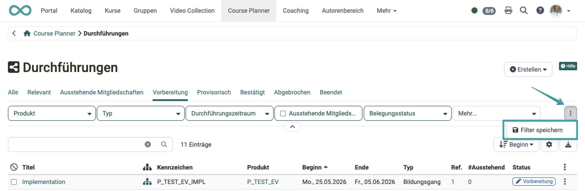{ class="shadow lightbox" }  

Über die individuelle Spaltenauswahl lassen sich zusätzlich die standardmässig ausgeblendeten Spalten **Fachbereiche** und **Fachbereich Pfade** einblenden (zwischen den Spalten "Status" und "Kalender"). [:octicons-tag-16:{ title="ab Release 20.3.1 (OO-9392)" }](https://track.frentix.com/issue/OO-9392){:target="_blank"}

!!! info "Wichtig"
    Die Fachbereiche werden in der System-Administration zur Verfügung gestellt, unter `Administration > Module > Taxonomie`.

### Sammelaktion «Typ ändern» [:octicons-tag-16:{ title="ab Release 21.0 (OO-9583)" }](https://track.frentix.com/issue/OO-9583){:target="_blank"} {: #change_type}

Durch Aktivieren der Checkbox in der ersten Spalte markieren Sie mehrere Durchführungen. Oberhalb der Tabelle erscheint dann die Aktion **«Typ ändern»**. Im Dialog wählen Sie den neuen Elementtyp und bestätigen mit **«Typ ändern»**. Zur Wahl stehen nur Typen, die zu den markierten Elementen passen.

Dieselbe Aktion steht in der Suche des Course Planners und im Tab «Struktur» einer Durchführung zur Verfügung.

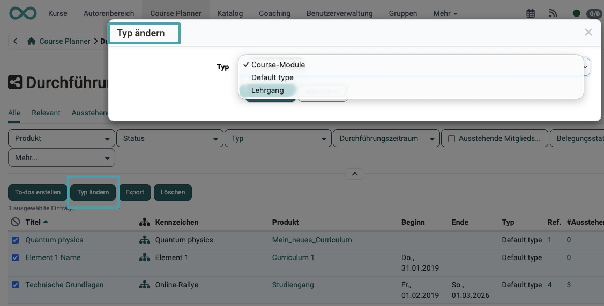{ class="shadow lightbox" }

[zum Seitenanfang ^](#implementations)

---

## Navigation in den Durchführungen [:octicons-tag-16:{ title="ab Release 20.0 (OO-8128)" }](https://track.frentix.com/issue/OO-8128){:target="_blank"} {: #navigation}

Haben Sie in der Liste eine Durchführung gewählt und geöffnet, lassen sich in den angezeigten Tabs alle Einstellungen zu dieser Durchführung vornehmen:

- rechts oben durch Klick auf den Button "**Gehe zu**" innerhalb der aktuellen Durchführung zu einem Element springen.

- mit den **Pfeiltasten** rechts oben zu anderen Durchführungen  wechseln.

- durch Klick auf die verschiedenen **Tabs** diese Durchführung konfigurieren.

- durch Klick auf eine der **Überschriften** direkt zum entsprechenden Tab springen.

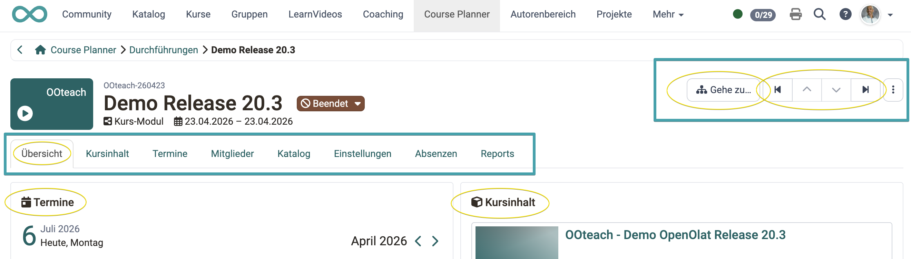{ class="shadow lightbox" }

[zum Seitenanfang ^](#implementations)

---

### Tab Übersicht [:octicons-tag-16:{ title="ab Release 20.2 (OO-8953)" }](https://track.frentix.com/issue/OO-8953){:target="_blank"} {: #tab_overview}

Im Tab "Übersicht" werden Ihnen die Mitglieder, die nächsten Termine, die Angebote im Katalog und Kursinhalte dieses Produkts angezeigt. Dies erleichtert Ihnen die Navigation innerhalb der Durchführungsbezogenen Aktivitäten.

Über den Button **Alle anzeigen** im Widget **Termine** gelangen Sie direkt zum Tab Termine.

Die Widgets **Kursinhalt** und **Katalog** zeigen zusätzlich ein Icon im Titel sowie den Button **Details** [:octicons-tag-16:{ title="ab Release 20.3 (OO-9244)" }](https://track.frentix.com/issue/OO-9244){:target="_blank"}, über den Sie direkt zum Tab Kursinhalt bzw. zum Tab Katalog gelangen.

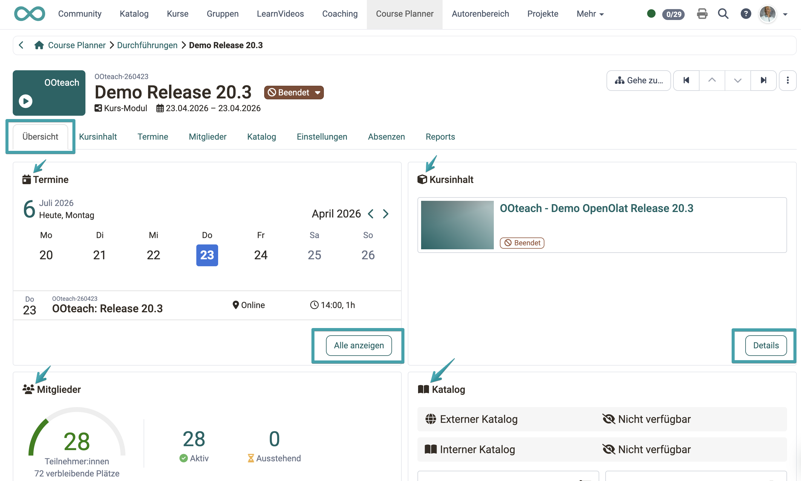{ class="shadow lightbox" }

#### Mitglieder-Widget [:octicons-tag-16:{ title="ab Release 20.3.0 (OO-9243)" }](https://track.frentix.com/issue/OO-9243){:target="_blank"} {: #widget_members}

Das Widget **Mitglieder** zeigt die Kennzahl **"Teilnehmer:innen"** dieser Durchführung, aufgeschlüsselt nach **"Aktiv"** und **"Ausstehend"**. Sind noch keine Kursverantwortlichen erfasst, zeigt das Widget den Hinweis "Noch keine Kursverantwortlichen." Über den Button **"Details"** gelangen Sie direkt zum Tab Mitglieder dieser Durchführung. [:octicons-tag-16:{ title="ab Release 21.0 (OO-9405)" }](https://track.frentix.com/issue/OO-9405){:target="_blank"}

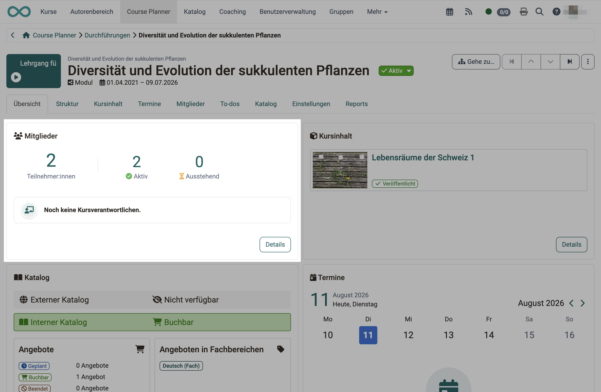{ class="shadow lightbox" }

Sind Kursverantwortliche erfasst, erscheinen sie anstelle des Hinweises mit ihrer Rolle (z.B. Betreuer:innen, Klassenlehrer:innen, Kursbesitzer:innen, Elementbesitzer:innen).

Ist eine maximale bzw. minimale Teilnehmerzahl definiert, ergänzt ein zusätzlicher Hinweistext die Kennzahl "Teilnehmer:innen":

* Bei gesetztem Maximum: **"\<Anzahl\> verbleibende Plätze"**
* Bei gesetztem Minimum: **"\<Anzahl\> bis Mindestanzahl"**
* Bei ausgebuchten oder überbuchten Durchführungen erscheint die entsprechende Meldung.

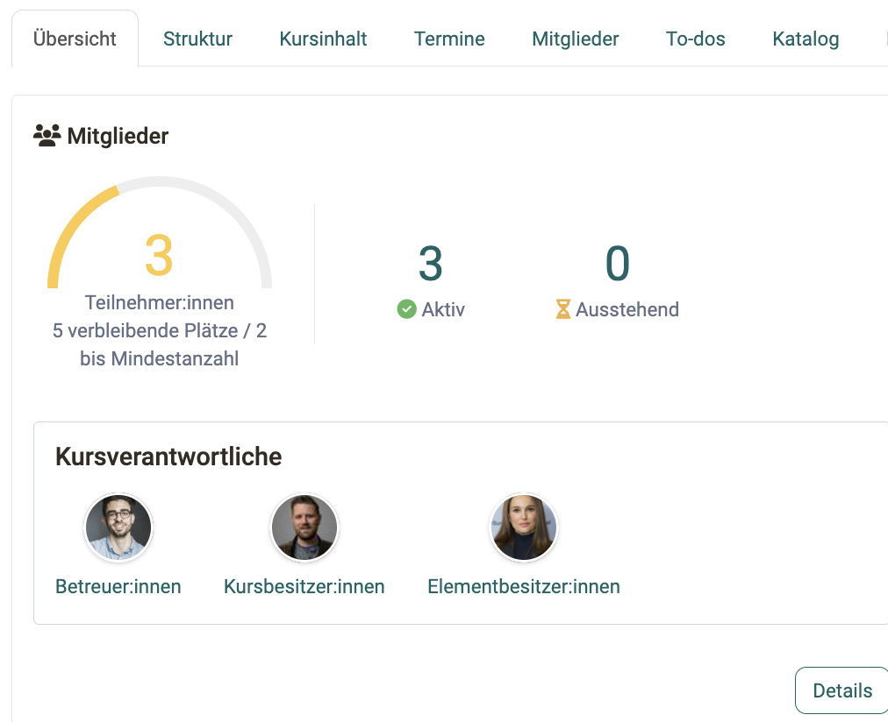{ class="shadow lightbox" }

[zum Seitenanfang ^](#implementations)

---

### Tab Struktur [:octicons-tag-16:{ title="ab Release 20.0 (OO-8634)" }](https://track.frentix.com/issue/OO-8634){:target="_blank"} {: #tab_structure}

Wenn es sich um eine strukturierte Durchführung handelt (der Typ wird beim Erstellen einer neuen Durchführung ausgewählt) wird das Tab "Struktur" angezeigt.
In der angezeigten Baumstruktur kann jedes einzelne Element der Durchführung bearbeitet werden, bzw. es können Informationen dazu abgefragt werden.

{ class="shadow lightbox" }

 Möchten Sie für diese Durchführung abweichend von der Produkt-Struktur ("Kopiervorlage" dieser Struktur) andere Elemente hinzufügen, finden Sie unter dem Button **Erstellen** die verfügbaren Element-Typen, wie sie in der System-Administration unter `Administration > Module > Course Planner > Tab Elementtypen` definiert wurden. 

 Mit dem **Download-Button** können Sie die angezeigte Struktur auch als Excel-Datei herunterladen. 

 In der Spalte **Ref.** können Sie die in diesem Element referenzierten Inhalte anzeigen lassen; der Detailbereich heisst "Referenzierte Kurse".

 In dieser Spalte finden Sie die **Stundenpläne** der jeweiligen Elemente. 

 In dieser Spalte finden Sie die **Absenzen**. (Vorausgesetzt, das Absenzenmanagement ist aktiviert.) 

 Wurde das Modul "Qualitätsmanagement" aktiviert, können Sie bei jedem Element zur zugeordneten **Datenerhebungsvorschau** springen.

 In der Spalte **Lernfortschritt** wird der durchschnittliche Fortschritt aller Teilnehmer:innen angezeigt. Berücksichtigt werden dabei alle Lernpfadkurse dieses Elements. (Herkömmliche Kurse liefern keine Daten zum Lernfortschritt.)

 Unter den **3 Punkten** finden Sie Optionen zum Bearbeiten der Elemente.

{ class="shadow lightbox" }

#### Ein Element verschieben [:octicons-tag-16:{ title="ab Release 20.3 (OO-8841)" }](https://track.frentix.com/issue/OO-8841){:target="_blank"}

Über die Aktion **Element verschieben** unter den **3 Punkten** öffnen Sie den Verschiebe-Dialog. Das zu verschiebende Element ist darin farblich hervorgehoben.

Jede mögliche Zielposition wird als Radiobutton angezeigt. Nicht erlaubte Zielpositionen (z. B. ein nicht kompatibler Elementtyp) sind ausgegraut und nicht auswählbar.

Nach der Auswahl einer Zielposition erscheinen direkt am Element die Aktionen:

* **Oben**
* **Unten**
* **Unterelement**

Mit einem Klick auf **Element verschieben** wird die Verschiebung ausgeführt.

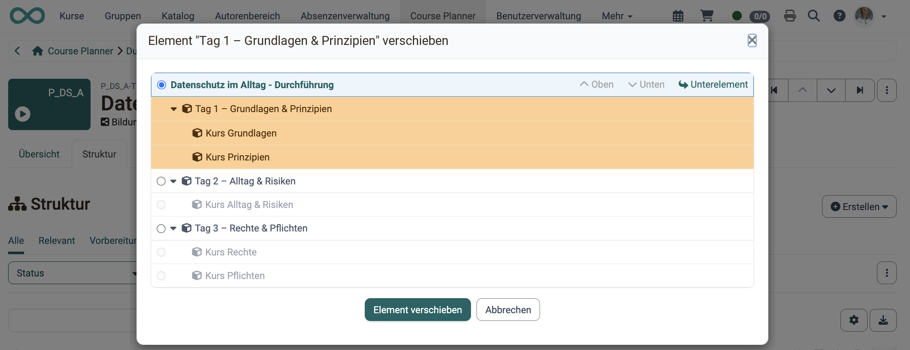{ class="shadow lightbox" }

[zum Seitenanfang ^](#implementations)

---

### Tab Kursinhalt {: #tab_content}

Die Liste zeigt alle zu dieser Durchführung gehörenden Kurse.

Sollen für diese Durchführung (abweichend von der ursprünglichen Struktur) weitere Kurse hinzugefügt werden, verwenden Sie den Button "**Kurs hinzufügen**" rechts oben.

Die Option zum **Entfernen** eines **einzelnen Kurses** aus dieser Durchführung finden Sie unter den 3 Punkten am Ende einer Zeile. 
Für das **Entfernen mehrerer Kurse** markieren Sie die Kurse mit den Checkboxen der ersten Spalte. Dann wird Ihnen ein Button zum Entfernen über der Liste angezeigt.

{ class="shadow lightbox" }

 

**Automatisch gesteuerte Kursinhalte** [:octicons-tag-16:{ title="ab Release 21.0 (OO-9578)" }](https://track.frentix.com/issue/OO-9578){:target="_blank"} 
Steuern Automatisierungsregeln den Inhalt dieser Durchführung, erscheint oberhalb der Liste der Abschnitt «Übersicht Automatisierung». Aufgeführt sind nur aktive Regeln, die den Inhalt betreffen. Zu jeder Regel sehen Sie die Art der Regel, also «Instanziierung» oder den Zielstatus, dazu das Datum der geplanten Ausführung und die Bedingung, die die Ausführung auslöst. Über den Link «Einstellungen» wechseln Sie direkt zur [Konfiguration der Automatisierung](#tab_settings_automation).

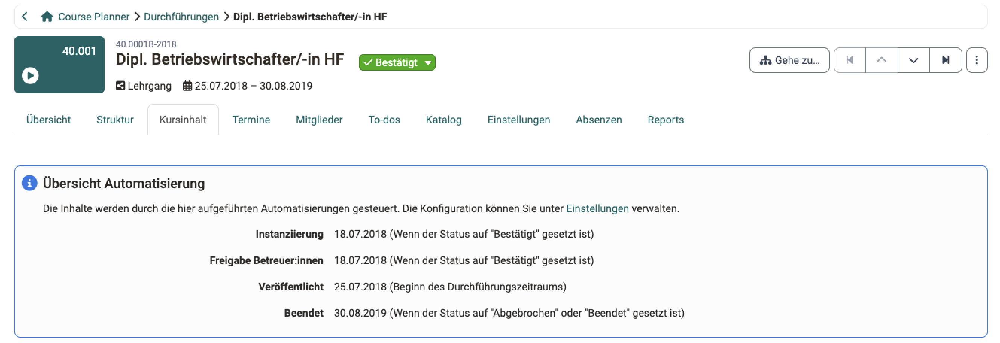{ class="shadow lightbox" }

 

**Kurstemplates als Kursinhalt** 
Wenn es dem gewählten Durchführungstyp (Einzelkurs erforderlich) entspricht, besteht die Möglichkeit auch ein Kurstemplate hinzuzufügen, das zu einem späteren Zeitpunkt instanziert werden kann. Das heisst, zum Zeitpunkt der Planung im Course Planner ist ein Kurs nur angekündigt, aber noch nicht hinzugefügt. Erst wenn die Kursdurchführung tatsächlich stattfindet, weil z.B. genügend Buchungsaufträge vorhanden sind, wird der Kurs der Durchführung hinzugefügt (instanziert). 

Die Verwendung eines Templates zur Instanzierung empfiehlt sich, wenn es sich um einen immer wiederkehrenden gleichen Kurs handelt.

{ class="shadow lightbox" }

Die Buttons "Kurs hinzufügen" und "Kurstemplates hinzufügen" werden inaktiv, sobald die Anzahl Kurse oder Templates hinzugefügt ist, die dem gewählten Durchführungstyp entsprechen.

**Erstellung von Kurstemplates** 
Kurstemplates werden erstellt, indem im Kurs unter `Kurs > Administration > Einstellungen > Freigabe > Verwendungszweck` die Option "Template" gewählt wird. 
Die Templates für Kursinhalte im Course Planner sind ohne eigenständige Mitgliederverwaltung, da die Mitglieder für jede Durchführung im Course Planner hinzugefügt werden.

!!! info "Wichtig"

    Templates werden kopiert. Bei späterer Änderung des Templates bleibt die früher erstellte Kopie unverändert.

[zum Seitenanfang ^](#implementations)

---

### Tab Termine [:octicons-tag-16:{ title="ab Release 20.0 (OO-8064)" }](https://track.frentix.com/issue/OO-8064){:target="_blank"} {: #tab_events}

- Bestehen viele Termine, sind die **Filter** oberhalb der Tabelle nützlich um den Überblick zu behalten.
- Mit dem **Button "Termin hinzufügen"** lassen sich neue Termine zur aktuell gewählten Durchführung hinzufügen.
- Ein Klick auf das **+** am Anfang einer Zeile zeigt die **Details** dieses Termins.
- Es besteht auch die Möglichkeit, Termine zu **importieren**. Klicken Sie dazu auf den kleinen Pfeil neben dem Button "Termin hinzufügen".

{ class="shadow lightbox" }

[zum Seitenanfang ^](#implementations)

---

### Tab Mitglieder [:octicons-tag-16:{ title="ab Release 20.3 (OO-8514)" }](https://track.frentix.com/issue/OO-8514){:target="_blank"} {: #tab_members}

{ class="shadow lightbox" }

Wie bereits weiter oben erwähnt, kann ein Bildungsprodukt (aus einem oder mehreren Kursen bestehend) mehrfach durchgeführt werden. An jeder Durchführung sind andere Teilnehmer:innen dabei.

Deshalb werden Teilnehmer:innen zu Mitgliedern einer bestimmten Durchführung gemacht (nicht zu Mitgliedern einzelner Kurse oder eines Bildungsprodukts). Es kann bestimmt werden, ob sie Mitglieder der gesamten Durchführung oder nur eines Teilbereiches werden.

Die Spalte **"Teilnehmer:inkommentar"** der Mitgliederliste zeigt mit einem Notiz-Symbol, ob zur Buchung ein Kommentar der Teilnehmer:in vorliegt; ein Klick darauf öffnet den Kommentar. Dieselbe Spalte führt die Tabelle der Buchungsaufträge im Tab Katalog [:octicons-tag-16:{ title="ab Release 21.1.0 (OO-9484)" }](https://track.frentix.com/issue/OO-9484){:target="_blank"}.

Würden die Teilnehmer:innen zu Mitgliedern des Bildungsprodukts (der "Kopiervorlage") gemacht, wären sie in allen Durchführungen dieses Produkts als Teilnehmer:innen dabei. Dies ist nicht erwünscht. Deshalb können zu einem Produkt nur Besitzer:innen als Mitglieder hinzugefügt werden, keine Teilnehmer:innen.

!!! info "Mitgliederverwaltung im Course Planner"
    Weil die Mitgliederverwaltung bei Verwendung des Course Planners in der Durchführung gemacht wird, gibt es in den Einstellungen der Kurse den Verwendungszweck "Verwendung im Course Planner": 
    `Kurs > Administration > Einstellungen > Tab Freigabe > Abschnitt Verwendung`

**Der Kurs hat dann *keine* eigenständige Mitgliederverwaltung mehr**, die Mitgliederverwaltung erfolgt nun ausschliesslich in der Mitgliederverwaltung der Durchführung, **innerhalb des Course Planners**.

 

#### Tab Mitglieder > Mitglieder hinzufügen {: #add_members}

Um Teilnehmer:innen zu einer Durchführung als Mitglieder hinzuzufügen, verwenden Sie: 
`Course Planner > Durchführungen > "Ihre Durchführung" > Tab Mitglieder > Button "Teilnehmer:innen hinzufügen"`

{ class="shadow lightbox" }

 

#### Tab Mitglieder > Einladung und Mitgliedschaftsanfragen [:octicons-tag-16:{ title="ab Release 20.3 (OO-9156)" }](https://track.frentix.com/issue/OO-9156){:target="_blank"} {: #invitation_flow}

Wenn Teilnehmer:innen einer Durchführung zugewiesen werden, erhalten sie je nach Kontext eine Systembenachrichtigung per E-Mail:

- Zuweisung zu einem **Kurs**: Benachrichtigung mit Link in den Kursbereich
- Zuweisung zu einem **Bildungsprodukt**: Benachrichtigung mit Link in den Kursbereich
- Zuweisung zu einer **Gruppe**: Benachrichtigung mit Link in den Gruppenbereich

Im Kursbereich, im Gruppenbereich sowie direkt auf der Kurs- oder Bildungsprodukt-Info-Seite erscheint die Hinweisbox **"Anfragen zur Mitgliedschaft akzeptieren"**. Teilnehmer:innen können die Anfrage dort annehmen oder ablehnen. Eine Annahme ist an allen drei Stellen gleichermassen möglich.

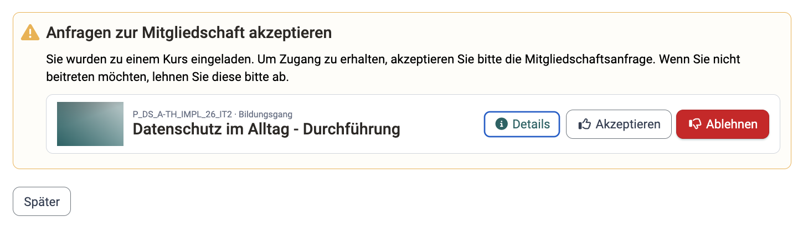{ class="shadow lightbox" }

!!! info "Wichtig"

    Ob eine Bestätigung durch die eingeladenen Personen erforderlich ist, hängt von der Konfiguration der Reservierungspflicht ab. Details dazu finden Sie im Abschnitt zur Bestätigung der Mitgliedschaft weiter unten.

Für Administrator:innen: [Systemweite Konfiguration der Einladung >](../../manual_admin/administration/Modules_Groups.de.md#accept_membership)

 

#### Tab Mitglieder > Bestätigung der Mitgliedschaft durch Linienvorgesetzte/Ausbildungsverantwortliche {: #confirm_membership}

Im Course Planner kann eingerichtet werden, dass ein Buchungswunsch von einer administrativen Rolle (z.B. Linienvorgesetzte:r oder Ausbildungsverantwortliche:r) bestätigt werden muss. Mit dieser Einstellung können Teilnehmende einen Kurs buchen; die vorgesetzte Person muss die Buchung aber in einem Zwischenschritt bestätigen oder ablehnen.

Dieser Genehmigungsschritt kann auch in allen Angeboten eingerichtet werden, ausser bei Bezahlung mit Paypal (denn dort wird sofort bezahlt/gebucht).

{ class="shadow lightbox" }

[zum Seitenanfang ^](#implementations)

---

### Tab Katalog [:octicons-tag-16:{ title="ab Release 20.0 (OO-8236)" }](https://track.frentix.com/issue/OO-8236){:target="_blank"} {: #tab_catalog}

Die verschiedenen Durchführungen können im Katalog angeboten werden. Dazu muss ein [Angebot](../../manual_user/area_modules/catalog2.0_angebote.de.md) erstellt werden, wie zu jedem Katalogeintrag.

{ class="shadow lightbox" }

Um potenzielle Teilnehmer:innen auf ein Angebot im Katalog aufmerksam zu machen, können Sie einen Direktlink auf das Angebot z.B. in einer Mail verschicken. Sie finden die Links in der Übersicht der Angebote (je Durchführung im Tab Katalog).

{ class="shadow lightbox" }

Wurden im Katalog Angebote mit Buchungsmöglichkeit ergänzt, sind die Buchungsaufträge und ihre Details ebenfalls unter dem Tab "Katalog" im Teilbereich "Buchungsaufträge" zu finden.  

{ class="shadow lightbox" }

[zum Seitenanfang ^](#implementations)

---

### Tab Einstellungen {: #tab_settings}

Die Vielzahl der möglichen Einstellungen zu einer Durchführung sind unter mehreren untergeordneten Tabs zu finden. Permanent ist eine Vorschau-Info-Seite verfügbar.

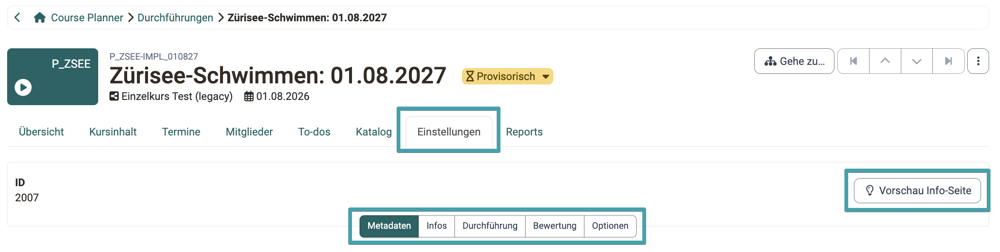{ class="shadow lightbox" }

#### Metadaten der Einstellungen

Die hier eingegebenen Metadaten werden verwendet um z.B. Suchprozesse zu vereinfachen.

{ class="shadow lightbox" }

#### Infos in den Einstellungen

Die im Tab "Infos" gemachten Angaben werden z.B. für die Anzeige im Katalog verwendet.

{ class="shadow lightbox" }

#### Durchführung in den Einstellungen

Zu den Einstellungen der Durchführung gehören der Durchführungszeitraum, der Ort und die Anzahl der Teilnehmer:innen.

{ class="shadow lightbox" }

#### Automatisierung konfigurieren [:octicons-tag-16:{ title="ab Release 21.0 (OO-9578)" }](https://track.frentix.com/issue/OO-9578){:target="_blank"} {: #tab_settings_automation}

Im Unterabschnitt **«Automatisierung»** der Tab-Einstellungen legen Sie fest, wann Kurse automatisch [instanziert](#tab_content) und wann Statuswechsel automatisch ausgelöst werden.

Der Unterabschnitt erscheint bei Elementen, deren Elementtyp die Verwendung «Durchführung» oder «Element» hat. Bei der Verwendung «Durchführung oder Element (legacy)» fehlt er.

Soll ein Kurs mehrfach und dabei immer genau gleich verwendet werden, kann er als Template angelegt werden. Die Kurse werden dann für jede Durchführung aus der Template-Vorlage erstellt. Die [Instanzierung](#tab_content) kann automatisiert zu einem bestimmten Zeitpunkt sowie rollenspezifisch erfolgen, z.B. einige Tage vor Beginn einer Durchführung zugänglich für Betreuer:innen. Bis dahin können die Templatebesitzer:innen noch am Template arbeiten, während die organisatorische Planung im Course Planner bereits läuft.

**Geltungsbereich der Automatisierungsregeln:**

Automatisierungsregeln werden auf zwei Ebenen definiert:

* **Elementtyp-Ebene** in der System-Administration unter `Administration > Module > Course Planner > Tab Elementtypen`: Administrator:innen hinterlegen Standardregeln für jeden Elementtyp. Diese Regeln gelten als Vorlage für alle Elemente dieses Typs.
* **Element-Ebene** `Tab Einstellungen > Automatisierung`: Für jedes einzelne Element entscheiden Sie, ob die Regeln des Elementtyps übernommen oder individuell überschrieben werden sollen.

Für das einzelne Element stehen zwei Modi zur Wahl:

* **«Vom Typ "Elementtyp" übernehmen»**: Das Element verwendet die Standardregeln des Elementtyps. Die Beschriftung nennt den Namen des Typs und ob dort Regeln aktiv sind. Passen Administrator:innen die Vorlage an, wirkt sich das automatisch auf alle Elemente aus, die diesen Modus verwenden.
* **«Überschreiben»**: Das Element verwendet abweichende, individuell konfigurierte Regeln, unabhängig vom Elementtyp.

**Typen von Automatisierungsregeln:**

| Typ | Auslöser |
|---|---|
| Bei Statuswechsel | Eine Aktion wird ausgelöst, sobald der Durchführungs- oder Elementstatus einen bestimmten Wert annimmt. |
| Zeitgesteuert | Eine Aktion wird relativ zum Beginn oder Ende des Durchführungszeitraums ausgelöst. |

**Ausführung der Regeln:**

Aktivierte Automatisierungen laufen einmal täglich zu einer festen Uhrzeit. Die Uhrzeit nennt der Informationstext oberhalb der Konfiguration.

Sobald mindestens eine Regel aktiv ist, zeigt der Kopfbereich der Durchführung oberhalb der Tabs unter «Automatisierung» das Datum der nächsten Ausführung. Steht keine Ausführung mehr an, erscheint dort ein Strich.

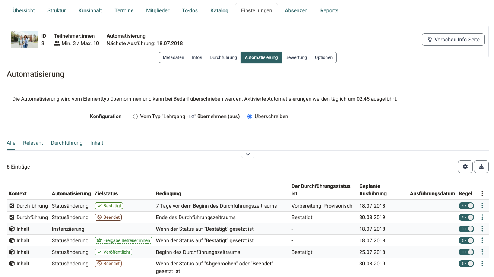{ class="shadow lightbox" }

[Zu den Elementtypen und Automatisierungsregeln (Admin) >](../../manual_admin/administration/Modules_Course_Planner.de.md#tab_element_types) 
[Zu den To-dos auf CPL-Elementen >](Course_Planner_Todos.de.md)

#### Bewertung in den Einstellungen [:octicons-tag-16:{ title="ab Release 21.0 (OO-9499)" }](https://track.frentix.com/issue/OO-9499){:target="_blank"} {: #tab_settings_assessment}

Der Unter-Tab "Bewertung" wird bei Durchführungen vom Typ Einzelkurs angezeigt sowie bei jeder Durchführung, die bereits einem Zertifikatsprogramm zugeordnet ist. Hier verknüpfen Sie die Durchführung direkt mit einem Zertifikatsprogramm, ohne den Weg über das Programm selbst zu gehen.

* Mit dem Schalter **"Zertifikatsprogramm"** aktivieren oder deaktivieren Sie die Verknüpfung.
* Ist noch kein Programm verknüpft, wählen Sie über die Aktion **"Auswählen"** ein Programm aus. Der Dialog "Zertifikatsprogramm auswählen" zeigt Titel, Bezeichnung, Gültigkeitsdauer, Rezertifizierung und benötigte Kreditpunkte. Angezeigt werden nur Programme, auf die Sie Zugriff haben.
* Ist ein Programm verknüpft, zeigt ein Panel den Programmtitel. Gültigkeitsdauer, Rezertifizierung und benötigte Kreditpunkte erscheinen dort, sofern sie am Programm hinterlegt sind. Von dort öffnen Sie das Programm in einem neuen Tab (sofern Sie Zugriff auf das Programm haben) oder heben mit **"Entfernen"** die Verknüpfung auf; die Sicherheitsabfrage "Zertifikatsprogramm entfernen" bestätigt den Schritt. Das Entfernen erfordert die Rolle Kursplaner:in oder Produktbesitzer:in und muss bestätigt werden. Teilnehmer:innen, die bereits ein Zertifikat erhalten haben, bleiben Mitglieder des Programms.

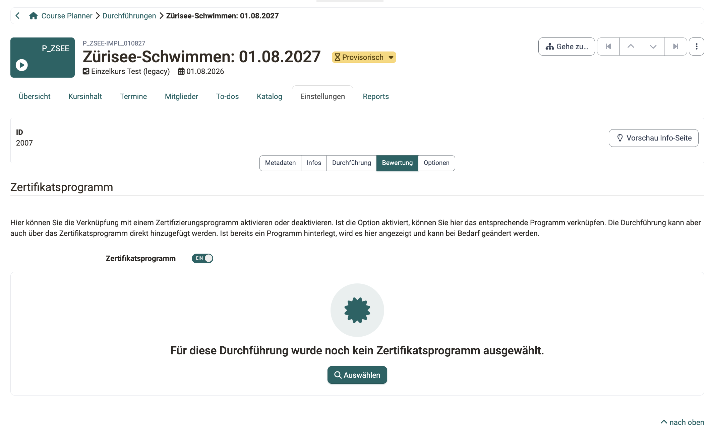{ class="shadow lightbox" }

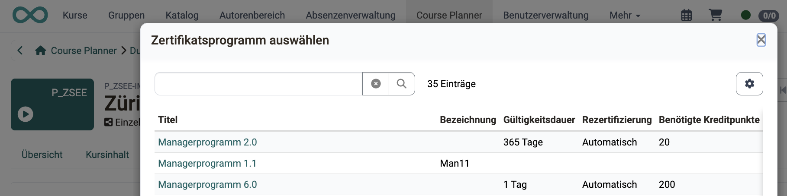{ class="shadow lightbox" }

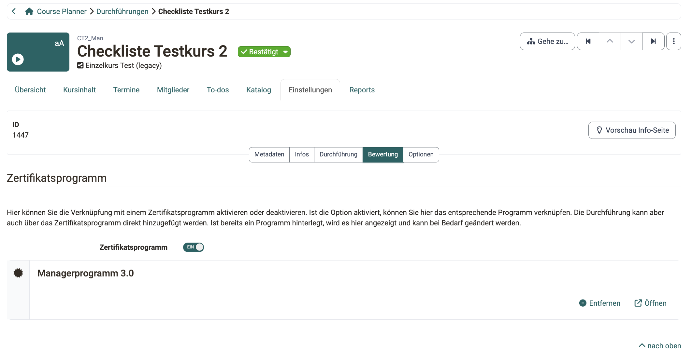{ class="shadow lightbox" }

Eine Durchführung kann auch direkt über das [Zertifikatsprogramm](Course_Planner_Certification_Programs.de.md#config_tab_implementations) hinzugefügt werden.

Beim [Kopieren einer Durchführung](#copy) wird die Verknüpfung zum Zertifikatsprogramm übernommen, sofern Sie die Berechtigung für das Programm besitzen. Fehlt die Berechtigung, zeigt der Assistent die Warnung "Das Zertifizierungsprogramm kann aufgrund fehlender Berechtigungen nicht übernommen werden." Beim Kopieren entsteht ein Eintrag im Aktivitätslog des Programms.

#### Optionen in den Einstellungen

Für jede Durchführung können hier separat Einstellungen vorgenommen werden für: 

- Kalenderkonfiguration
- Stundenplan
- Absenzenkonfiguration
- Absenzenmanagement
- Fortschrittskonfiguration

{ class="shadow lightbox" }

[zum Seitenanfang ^](#implementations)

---

### Tab Absenzen [:octicons-tag-16:{ title="ab Release 20.0 (OO-8442)" }](https://track.frentix.com/issue/OO-8442){:target="_blank"} {: #tab_absences}

Dieser Tab erscheint nur, wenn auf dem Element die Absenzen aktiviert wurden.

Die Aktivierung erfolgt in den Einstellungen der Durchführung: `Tab Einstellungen > Optionen > Absenzenkonfiguration`.

{ class="shadow lightbox" }

[zum Seitenanfang ^](#implementations)

---

### Tab Reports [:octicons-tag-16:{ title="ab Release 20.0 (OO-8387)" }](https://track.frentix.com/issue/OO-8387){:target="_blank"} {: #tab_reports}

Die hier erstellbaren Reports beziehen sich auf die aktuell gewählte Durchführung.

Im Unterschied dazu bezieht sich die Report-Erstellung, die in der [Übersicht](../../manual_user/area_modules/Course_Planner_Reports.de.md) aufgerufen werden kann, auf **alle** Durchführungen. 
Die Struktur der Excel-Dateien (Spalten) und das Vorgehen zum Erstellen ist bei beiden identisch.

{ class="shadow lightbox" }

Durch Klick auf die **Pfeile in der Spalte "Ausführen"** werden anhand der aufgelisteten Vorlagen Excel-Dateien mit den aktuellen Daten erzeugt.

Die so erstellten Excel-Dateien finden Sie dann im unteren Bereich des Screens aufgeführt. Sie können kopiert und heruntergeladen werden.

[zum Seitenanfang ^](#implementations)

---

## Kopieren einer Durchführung [:octicons-tag-16:{ title="ab Release 20.0 (OO-8418)" }](https://track.frentix.com/issue/OO-8418){:target="_blank"} {: #copy}

Die Aktion **"Element kopieren"** finden Sie in der Liste der Durchführungen am Ende einer Zeile unter den 3 Punkten.

{ class="shadow lightbox" } 

Im ersten Schritt des kleinen Wizards kann gewählt werden, ob auch Kursinhalte, Termine, Mitglieder, To-dos und Raumbuchungen kopiert werden sollen.

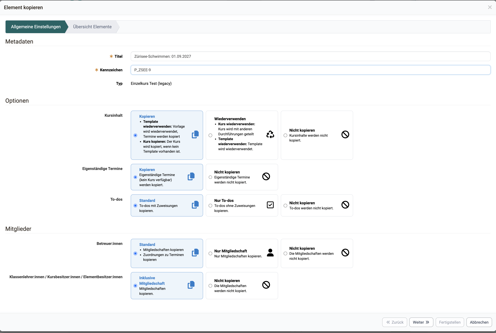{ class="shadow lightbox" }  

Der zweite Schritt des Wizards zeigt Ihnen eine Übersicht der Elemente, die nun kopiert werden. 
Sie können hier noch Anpassungen (insbesondere der Termine) vornehmen. 
Durch Klick auf das + vor einem Element zeigen Sie die Kurse und Termine des Elements an.

{ class="shadow lightbox" }  

In einer Durchführung hat es viele verschiedene Terminangaben, die in einer bestimmten Reihenfolge angelegt sind. Beim Kopieren können alle diese Daten automatisch angepasst werden und gemeinsam verschoben werden. Verwenden Sie dazu in der Übersicht der Elemente den Button **"Alle Daten schieben"**. Der Dialog zeigt das "Bezugsdatum (frühestes)". Unter "Verschiebung nach" wählen Sie zwischen "Datum" und "Tage" und geben anschliessend das "Neue Datum" bzw. die Anzahl Tage an.

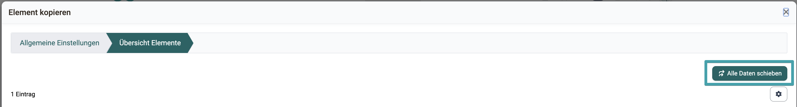{ class="shadow lightbox" }

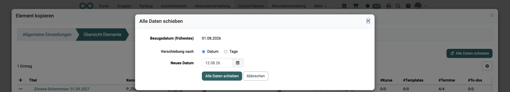{ class="shadow lightbox" } 

### To-dos beim Kopieren übernehmen [:octicons-tag-16:{ title="ab Release 21.0 (OO-9419)" }](https://track.frentix.com/issue/OO-9419){:target="_blank"} {: #copy_todos}

To-dos einer Durchführung werden beim Kopieren mitübernommen. Im ersten Schritt des Wizards bestimmen Sie mit der Auswahl "To-dos", wie dabei vorgegangen wird:

* **Standard:** To-dos mit Zuweisungen kopieren.
* **Nur To-dos:** To-dos ohne Zuweisungen kopieren.
* **Nicht kopieren:** To-dos werden nicht kopiert.

In der Übersicht der Elemente zeigt die Spalte **"#To-dos"**, wie viele To-dos ein Element enthält. In der Detailansicht eines Elements listet der Bereich "To-dos" alle To-dos mit Titel, Priorität, Datumseingabe (absolut oder relativ), Fälligkeitsdatum, Status, Zuweisung, Delegation und Tags auf. Über die Checkbox am Zeilenanfang wählen Sie einzelne To-dos vom Kopieren ab. Sind keine To-dos vorhanden, erscheint der Hinweis "Keine To-dos verfügbar."

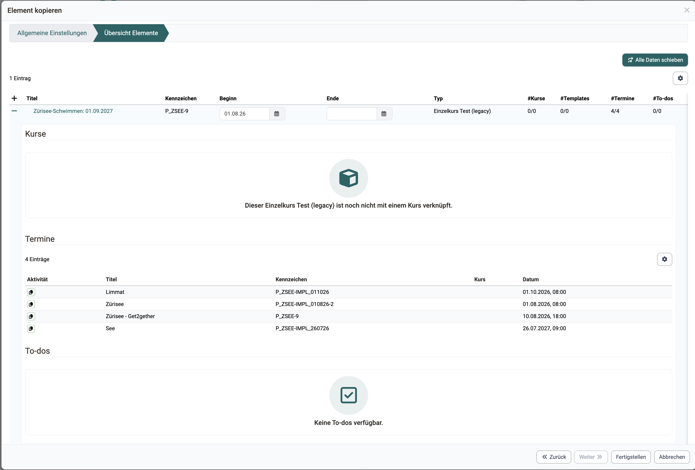{ class="shadow lightbox" }

### Raumbuchungen beim Kopieren übernehmen [:octicons-tag-16:{ title="ab Release 21.0.2 (OO-9710)" }](https://track.frentix.com/issue/OO-9710){:target="_blank"} {: #copy_rooms}

Ist das Modul «Räume» aktiviert, zeigt der erste Schritt des Wizards zusätzlich den Abschnitt **«Raumverwaltung»**. Mit der Auswahl **«Raumplanung»** bestimmen Sie dort, ob die Raumbuchungen der Termine mitkopiert werden:

* **Kopieren:** Die Raumbuchungen werden zusammen mit den Terminen kopiert. Diese Option ist vorausgewählt.
* **Nicht kopieren:** Die Raumbuchungen werden nicht kopiert.

Die Auswahl ist nur aktiv, wenn überhaupt Termine kopiert werden, also wenn bei **Kursinhalt** oder bei **Eigenständige Termine** die Option «Kopieren» gewählt ist. Andernfalls ist sie ausgegraut und es entstehen keine Buchungen.

!!! note "Sie sehen den Abschnitt «Raumverwaltung» nicht?"

    Der Abschnitt erscheint nur, wenn ein:e Systemadministrator:in das Modul «Räume» aktiviert hat. 
    [Räume verwalten (Administration) >](../../manual_admin/administration/Modules_Rooms.de.md#activation)

Die Kopie übernimmt den Raum der ursprünglichen Buchung. Der Zeitraum der Buchung folgt dem kopierten Termin: Verschieben Sie mit **«Alle Daten schieben»** die Termine, verschieben sich die Buchungen mit. OpenOlat prüft beim Kopieren nicht, ob der Raum im neuen Zeitraum noch frei ist. Konflikte wie eine Doppelbuchung erscheinen erst danach als Warnung in der [Raumplanung](Course_Planner_Rooms.de.md#room_scheduling).

Im Schritt **«Übersicht Elemente»** erscheint bei aktivem Modul und gewählter Option «Kopieren» zusätzlich die Spalte **"#Räume"**. Klappen Sie ein Element auf, führt die Tabelle «Termine» dort die Spalte **"Räume"** mit den gebuchten Räumen.

Die Aktion **«Element kopieren»** steht Administrator:innen, Kursplaner:innen und Produktbesitzer:innen zur Verfügung. Die vollständige Übersicht finden Sie in der [Rechte-Matrix](Course_Planner.de.md#rights_matrix) des Course Planners.

Einzelne Termine kopieren Sie stattdessen in der Terminliste einer Durchführung mit der Aktion **«Kopieren»**. Markieren Sie dort mehrere Termine und kopieren Sie diese gemeinsam, übernimmt OpenOlat die Raumbuchungen automatisch. Kopieren Sie einen einzelnen Termin, öffnet sich der Bearbeitungsdialog der Kopie mit leerem Feld **«Räume»**; die Räume wählen Sie dort selbst.

[zum Seitenanfang ^](#implementations)

---

## Löschen einer Durchführung [:octicons-tag-16:{ title="ab Release 20.0 (OO-8354)" }](https://track.frentix.com/issue/OO-8354){:target="_blank"} {: #delete}

Auch die Option zum Löschen finden Sie in der Liste der Durchführungen am Ende einer Zeile unter den 3 Punkten.

{ class="shadow lightbox" } 

Haben Sie eine Durchführung bereits angezeigt, finden Sie die Option zum Löschen auch rechts oben unter den 3 Punkten.

{ class="shadow lightbox" } 

[zum Seitenanfang ^](#implementations)

---

## Weiterführende Informationen {: #further_information}

**Auf dieser Seite erwähnt** 
[Modul Gruppen (Administration) >](../../manual_admin/administration/Modules_Groups.de.md) 
[Katalog 2.0 - Angebote >](../../manual_user/area_modules/catalog2.0_angebote.de.md) 
[Modul Course Planner (Administration) >](../../manual_admin/administration/Modules_Course_Planner.de.md) 
[Course Planner: To-dos >](Course_Planner_Todos.de.md) 
[Course Planner: Zertifikatsprogramme >](Course_Planner_Certification_Programs.de.md) 
[Course Planner: Reports >](../../manual_user/area_modules/Course_Planner_Reports.de.md) 
[Modul Räume (Administration) >](../../manual_admin/administration/Modules_Rooms.de.md) 
[Course Planner: Raumverwaltung >](Course_Planner_Rooms.de.md) 
[Course Planner: Übersicht >](Course_Planner.de.md)

**Weiterführend** 
[Wie erstelle ich meinen ersten OpenOlat-Kurs? >](../../manual_how-to/my_first_course/my_first_course.de.md) 
[Course Planner: Produkte >](../../manual_user/area_modules/Course_Planner_Products.de.md) 
[Course Planner: Termine >](../../manual_user/area_modules/Course_Planner_Events.de.md) 
[Wie kann ich mit dem Course Planner Kursdurchführungen planen und durchführen? >](../../manual_how-to/course_planner_courses/course_planner_courses.de.md) 
[Wie kann ich mit dem Course Planner einen Bildungsgang planen und durchführen? >](../../manual_how-to/course_planner_curriculum/course_planner_curriculum.de.md)

[zum Seitenanfang ^](#implementations)
