# Course Planner: Durchführungen [:octicons-tag-16:{ title="ab Release 20.0 (OO-7834)" }](https://track.frentix.com/issue/OO-7834){:target="_blank"} {: #implementations}

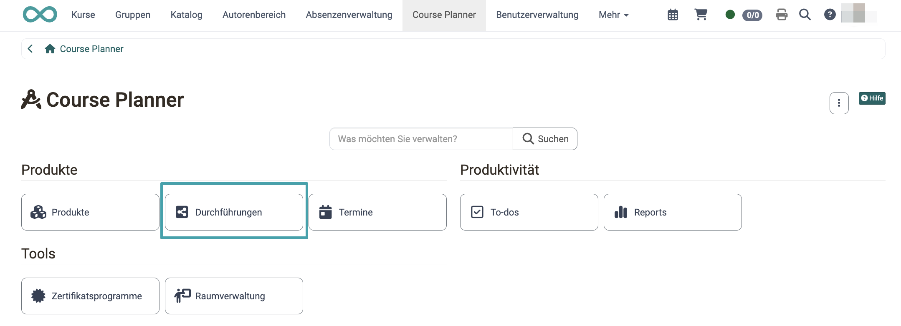{ class="shadow lightbox" title="Startseite des Course Planners" }

## Was ist eine Durchführung? {: #definition}

Ein Bildungsprogramm/Produkt (aus einem oder mehreren Kursen bestehend) kann mehrfach angeboten und durchgeführt werden. Jede Durchführung kann zu einem anderen Termin stattfinden und an jeder Durchführung sind dann andere Teilnehmer:innen dabei.

In einem Bildungsprogramm/Produkt werden zu jeder Durchführung ein oder mehrere Kurse zugeordnet. Der oder die mehrfach verwendeten Kurse sind nur einmal vorhanden.

Soll ein Kurs mehrfach verwendet werden und dabei immer genau gleich bleiben, kann er auch als Template angelegt werden. Die Kurse werden dann für jede Durchführung instanziiert (aus der Template-Vorlage erstellt). Diese Instanziierung kann auch automatisiert zu einem bestimmten Termin erfolgen. Z.B. einige Tage vor Beginn einer Durchführung. Bis dahin können die Templatebesitzer:innen noch an der Fertigstellung der Template-Kurse arbeiten. Das Organisatorische zur Durchführung (Termin, Katalogangebot, usw.) kann aber mit dem Course Planner bereits vorbereitet sein.

Von dieser Konzeptidee her, werden in der Regel in jeder Durchführung die gleichen Kurse zugeordnet und verwendet. Es ist aber in OpenOlat auch möglich, die Inhalte in jeder Durchführung anzupassen.

[zum Seitenanfang ^](#implementations)

---

## Die Liste der Durchführungen {: #listing}

Haben Sie in der Übersicht des Course Planners den Button "Durchführungen" gewählt, gelangen Sie zu einer Liste der Durchführungen aller Produkte. Die Spalte "Produkt" zeigt, zu welchem Produkt eine Durchführung gehört.

Die Liste öffnet mit dem Tab "Relevant". Der Tab "Ausstehende Mitgliedschaften" zeigt die Durchführungen mit ausstehenden Mitgliedschaften, die Tabs "Vorbereitung", "Provisorisch", "Bestätigt", "Abgebrochen" und "Beendet" je einen Status und der Tab "Alle" die ganze Liste. Mit Filtern wie "Produkt", "Typ", "Durchführungszeitraum" oder "Belegungsstatus" grenzen Sie die Auswahl weiter ein.

Durchführungen anlegen, bearbeiten und löschen können Administrator:innen und Kursplaner:innen sowie Produktbesitzer:innen in ihren eigenen Produkten. Principals sehen die Durchführungen nur lesend. Die vollständige Übersicht zeigt die [Rechte-Matrix](Course_Planner.de.md#rights_matrix) des Course Planners.

Je nach Ihren Rechten bietet das Menü der 3 Punkte am Ende einer Zeile Aktionen wie "Element kopieren", "Mitgliederverwaltung", "Export" und "Löschen". Wie der Export funktioniert, beschreibt [Course Planner: Import / Export](Course_Planner_Import_Export.de.md#export_entry_points).

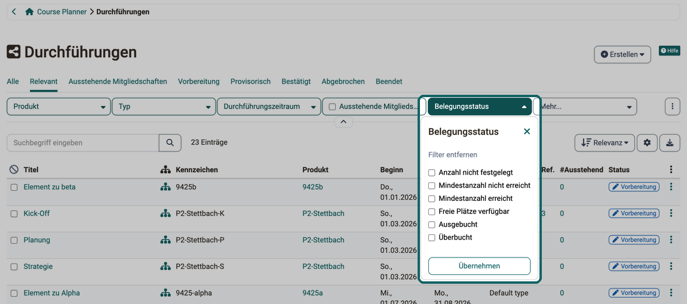{ class="shadow lightbox" title="Seite Durchführungen im Course Planner · 2026.09.30" }

Mit **Filter speichern** können häufig verwendete Filterkombinationen als eigene Voreinstellung gespeichert und wiederverwendet werden. [:octicons-tag-16:{ title="ab Release 20.3 (OO-9223)" }](https://track.frentix.com/issue/OO-9223){:target="_blank"}

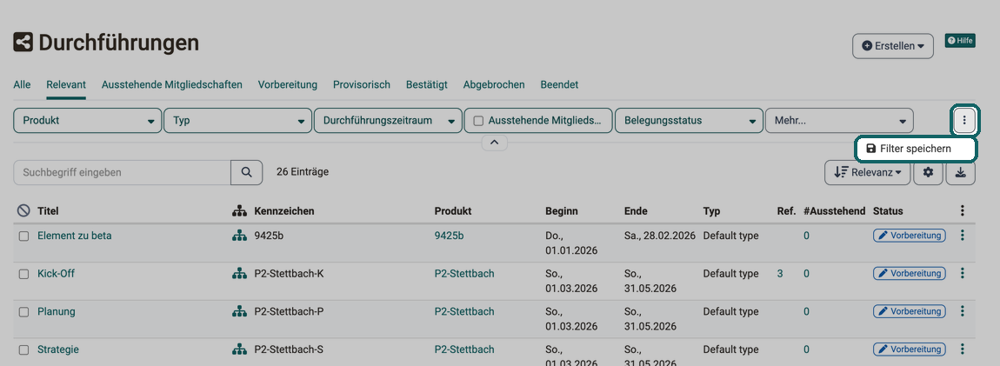{ class="shadow lightbox" title="Seite Durchführungen im Course Planner · 2026.10.09" }

Über "Spalten auswählen" lassen sich zusätzlich die standardmässig ausgeblendeten Spalten **Fachbereiche** und **Fachbereich Pfade** einblenden (zwischen den Spalten "Status" und "Kalender"). Die Fachbereiche selbst werden in der System-Administration gepflegt, unter `Administration > Module > Taxonomie`. [:octicons-tag-16:{ title="ab Release 20.3.1 (OO-9392)" }](https://track.frentix.com/issue/OO-9392){:target="_blank"}

### Sammelaktion «Typ ändern» [:octicons-tag-16:{ title="ab Release 21.0 (OO-9583)" }](https://track.frentix.com/issue/OO-9583){:target="_blank"} {: #change_type}

Durch Aktivieren der Checkbox in der ersten Spalte markieren Sie mehrere Durchführungen. Oberhalb der Tabelle erscheint dann die Aktion "Typ ändern", neben den Sammelaktionen "To-dos erstellen", "Export" und "Löschen". Im Dialog wählen Sie den neuen Elementtyp und bestätigen mit "Typ ändern". Zur Wahl stehen nur Typen, die zu den markierten Elementen passen.

Dieselbe Aktion steht in der Suche des Course Planners und im Tab «Struktur» einer Durchführung zur Verfügung.

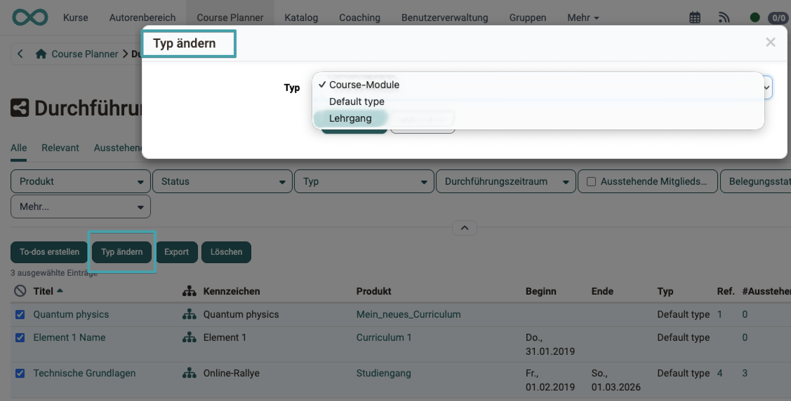{ class="shadow lightbox" title="Dialog Typ ändern auf der Seite Durchführungen" }

[zum Seitenanfang ^](#implementations)

---

## Navigation in den Durchführungen [:octicons-tag-16:{ title="ab Release 20.0 (OO-8128)" }](https://track.frentix.com/issue/OO-8128){:target="_blank"} {: #navigation}

Haben Sie in der Liste eine Durchführung gewählt und geöffnet, lassen sich in den angezeigten Tabs alle Einstellungen zu dieser Durchführung vornehmen:

- rechts oben durch Klick auf den Button "**Gehe zu…**" innerhalb der aktuellen Durchführung zu einem Element springen.

- mit den vier Buttons mit Pfeilen rechts oben wechseln: die beiden äusseren führen zur vorherigen oder nächsten Durchführung, die beiden inneren zum vorherigen oder nächsten Element innerhalb der Durchführung. Zeigen Sie auf einen Pfeil, erscheint seine Beschriftung, etwa "Nächste Durchführung" oder "Nächstes Element".

- durch Klick auf die verschiedenen **Tabs** diese Durchführung konfigurieren.

- durch Klick auf eine der **Überschriften** direkt zum entsprechenden Tab springen.

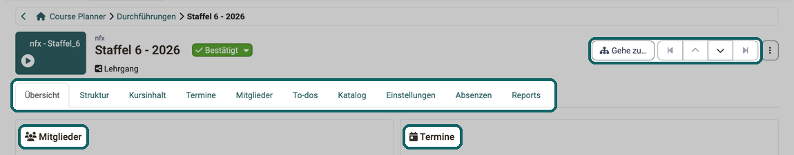{ class="shadow lightbox" title="Kopfbereich einer geöffneten Durchführung · 2026.10.02" }

[zum Seitenanfang ^](#implementations)

---

### Tab Übersicht [:octicons-tag-16:{ title="ab Release 20.2 (OO-8953)" }](https://track.frentix.com/issue/OO-8953){:target="_blank"} {: #tab_overview}

Wer eine Durchführung öffnet, sieht im Tab "Übersicht" auf einen Blick, wie es um Mitglieder, Termine, Kursinhalte, To-dos und Angebote im Katalog dieser Durchführung steht. Von jedem Widget gelangen Sie direkt in den zugehörigen Tab.

Das Widget "Termine" erscheint nur, wenn das Modul "Termine und Absenzen" systemweit aktiv ist, eingeschaltet in der System-Administration unter `Administration > Module > Termine / Absenzen`. Das Widget "Katalog" erscheint nur auf der obersten Ebene einer Durchführung, nicht bei ihren untergeordneten Elementen, und nur bei eingeschaltetem Katalog.

Wie eine Übersichtsseite aufgebaut ist und wie Sie die Kacheln anordnen, ist einmal zentral beschrieben: [Übersichtsseiten und Widgets >](../basic_concepts/Dashboard_Concept.de.md)

Die Widgets "Kursinhalt" und "Katalog" bieten den Button "Details" [:octicons-tag-16:{ title="ab Release 20.3 (OO-9244)" }](https://track.frentix.com/issue/OO-9244){:target="_blank"}, über den Sie direkt zum Tab Kursinhalt bzw. zum Tab Katalog gelangen.

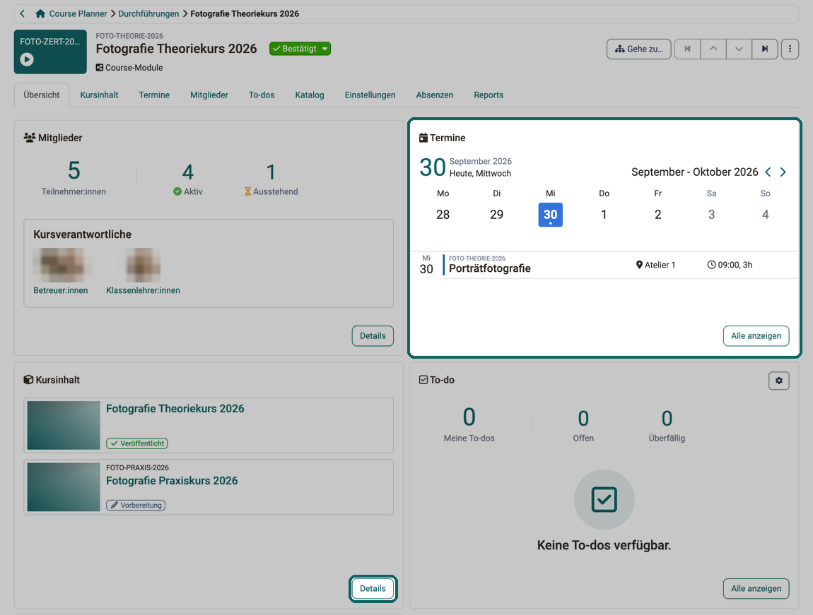{ class="shadow lightbox" title="Tab Übersicht einer Durchführung · 2026.09.30" }

#### Termine-Widget [:octicons-tag-16:{ title="ab Release 20.3 (OO-8865)" }](https://track.frentix.com/issue/OO-8865){:target="_blank"} {: #widget_events}

Das Widget **Termine** zeigt die Termine der laufenden Woche ab dem gewählten Tag, beim Öffnen ab heute, eingeschränkt auf diese Durchführung und ihre untergeordneten Elemente. Es erscheint nur, wenn das Modul **Termine und Absenzen** systemweit aktiv ist.

Die Wochenleiste läuft von Montag bis Sonntag, ein Punkt unter der Tagesziffer markiert die Tage mit Terminen. Ein Klick auf einen Tag setzt den Startpunkt der Liste, ein Klick auf eine Zeile öffnet den Termin. Steht bis Sonntag kein Termin mehr an, erscheint der Hinweis "Keine Termine bis Ende der Woche" mit den Buttons "Vorheriger Termin" und "Nächster Termin". Die vollständige Beschreibung des Widgets finden Sie unter [Course Planner: Dashboard](Course_Planner_Dashboard.de.md#widget_events).

Über den Button **"Alle anzeigen"** gelangen Sie direkt zum Tab **Termine** dieser Durchführung.

#### Mitglieder-Widget [:octicons-tag-16:{ title="ab Release 20.3.0 (OO-9243)" }](https://track.frentix.com/issue/OO-9243){:target="_blank"} {: #widget_members}

Das Widget "Mitglieder" zeigt die Kennzahl "Teilnehmer:innen" dieser Durchführung, aufgeschlüsselt nach "Aktiv" und "Ausstehend". Sind noch keine Kursverantwortlichen erfasst, zeigt das Widget den Hinweis "Noch keine Kursverantwortlichen." Über den Button "Details" gelangen Sie direkt zum Tab Mitglieder dieser Durchführung. [:octicons-tag-16:{ title="ab Release 21.0 (OO-9405)" }](https://track.frentix.com/issue/OO-9405){:target="_blank"}

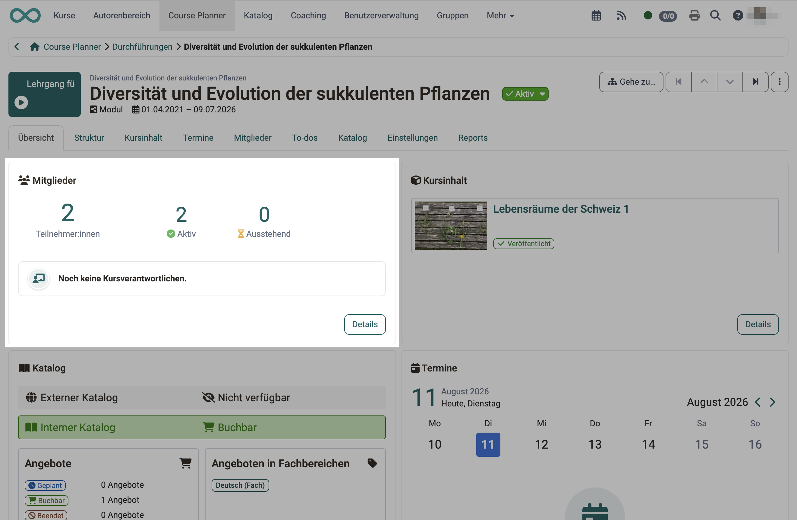{ class="shadow lightbox" title="Mitglieder-Widget im Tab Übersicht einer Durchführung" }

Sind Kursverantwortliche erfasst, erscheinen sie anstelle des Hinweises mit ihrer Rolle (z.B. Betreuer:innen, Klassenlehrer:innen, Kursbesitzer:innen, Elementbesitzer:innen).

Ist eine maximale bzw. minimale Teilnehmerzahl definiert, ergänzt ein zusätzlicher Hinweistext die Kennzahl "Teilnehmer:innen":

* Bei gesetztem Maximum: **"\<Anzahl\> verbleibende Plätze"**
* Bei gesetztem Minimum: **"\<Anzahl\> bis Mindestanzahl"**
* Bei ausgebuchten oder überbuchten Durchführungen erscheint die entsprechende Meldung.

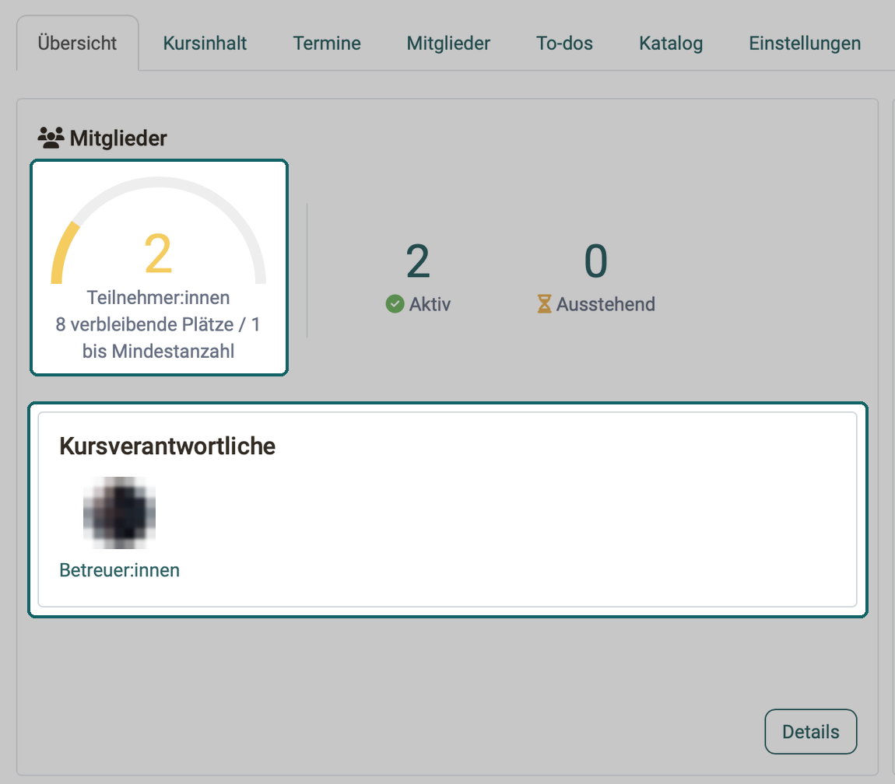{ class="shadow lightbox" title="Mitglieder-Widget im Tab Übersicht · 2026.10.02" }

#### To-do-Widget [:octicons-tag-16:{ title="ab Release 21.0 (OO-9422)" }](https://track.frentix.com/issue/OO-9422){:target="_blank"} {: #widget_todos}

Das Widget "To-do" zeigt Ihnen, welche Aufgaben in dieser Durchführung anstehen. Die Kennzahlen "Meine To-dos", "Offen" und "Überfällig" führen je zur passenden Ansicht der To-dos. Über den Button "Alle anzeigen" gelangen Sie zum [Tab «To-dos»](Course_Planner_Todos.de.md#element_tab_todos) dieser Durchführung.

[zum Seitenanfang ^](#implementations)

---

### Tab Struktur [:octicons-tag-16:{ title="ab Release 20.0 (OO-8634)" }](https://track.frentix.com/issue/OO-8634){:target="_blank"} {: #tab_structure}

Wenn es sich um eine strukturierte Durchführung handelt (der Typ wird beim Erstellen einer neuen Durchführung ausgewählt) wird das Tab "Struktur" angezeigt. In der angezeigten Baumstruktur kann jedes einzelne Element der Durchführung bearbeitet werden, bzw. es können Informationen dazu abgefragt werden.

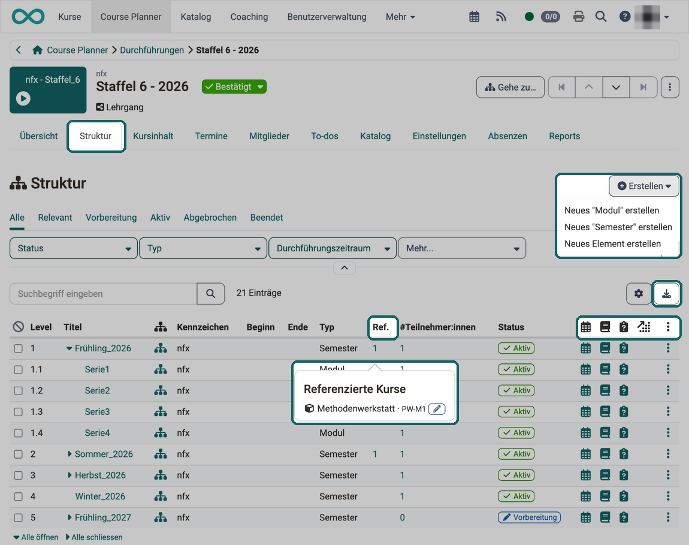{ class="shadow lightbox" title="Tab Struktur einer Durchführung · 2026.09.28" }

Tabs nach Status und Filter wie "Status", "Typ" und "Durchführungszeitraum" grenzen die Elemente ein. Mit "Alle öffnen" und "Alle schliessen" unter der Tabelle klappen Sie die Baumstruktur ganz auf oder zu.

Die Tabelle im Tab "Struktur" bietet folgende Funktionen:

- **Erstellen**: Möchten Sie für diese Durchführung abweichend von der Produkt-Struktur ("Kopiervorlage" dieser Struktur) andere Elemente hinzufügen, finden Sie unter dem Button **Erstellen** die verfügbaren Element-Typen, wie sie in der System-Administration unter `Administration > Module > Course Planner > Tab Elementtypen` definiert wurden.
- **Download**: Mit dem Download-Button können Sie die angezeigte Struktur auch als Excel-Datei herunterladen.
- **Ref.**: In dieser Spalte können Sie die in diesem Element referenzierten Inhalte anzeigen lassen; der Detailbereich heisst "Referenzierte Kurse".
- **Stundenpläne**: In der Spalte mit dem Kalendersymbol finden Sie die Stundenpläne der jeweiligen Elemente.
- **Absenzen**: In der folgenden Spalte finden Sie die Absenzen, vorausgesetzt, **Absenzmanagement** ist für das Element eingeschaltet, direkt in den Optionen der Einstellungen oder über den Elementtyp.
- **Datenerhebungsvorschau**: Sind in der System-Administration das Modul "Qualitätsmanagement" und die "Datenerhebungsvorschau" eingeschaltet, können Sie bei jedem Element zur zugeordneten Datenerhebungsvorschau springen. Beides finden Sie unter: `Administration > Module > Qualitätsmanagement`.
- **Lernfortschritt**: In dieser Spalte wird der durchschnittliche Fortschritt aller Teilnehmer:innen angezeigt. Berücksichtigt werden dabei alle Lernpfadkurse dieses Elements. Herkömmliche Kurse liefern keine Daten zum Lernfortschritt.
- **3 Punkte**: Am Zeilenende finden Sie die Aktionen zu einem Element: "In neuem Tab öffnen", "Bearbeiten", "Element verschieben", ein Eintrag zum Erstellen eines Unterelements, beschriftet mit dem Elementtyp (zum Beispiel «Neues Unterelement "Modul" erstellen»), "Element kopieren", "Mitgliederverwaltung" und "Löschen".

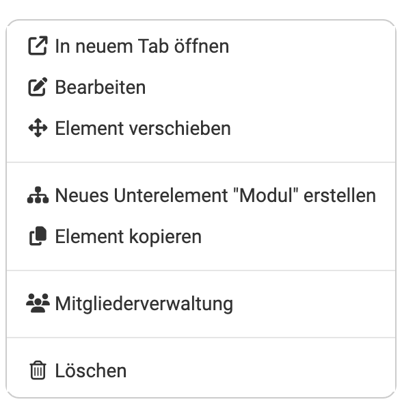{ class="shadow lightbox" title="Menü der drei Punkte im Tab Struktur" }

#### Ein Element verschieben [:octicons-tag-16:{ title="ab Release 20.3 (OO-8841)" }](https://track.frentix.com/issue/OO-8841){:target="_blank"}

Über die Aktion **Element verschieben** unter den **3 Punkten** öffnen Sie den Verschiebe-Dialog. Das zu verschiebende Element ist darin zusammen mit seinen Unterelementen farblich hervorgehoben; diese Zeilen lassen sich nicht als Ziel auswählen.

Jede mögliche Zielposition wird als Radiobutton angezeigt. Nicht erlaubte Zielpositionen (z. B. ein nicht kompatibler Elementtyp) sind ausgegraut und nicht auswählbar.

Nach der Auswahl einer Zielposition erscheinen direkt am Element die Aktionen:

* **Oben**
* **Unten**
* **Unterelement**

Mit einem Klick auf **Element verschieben** wird die Verschiebung ausgeführt.

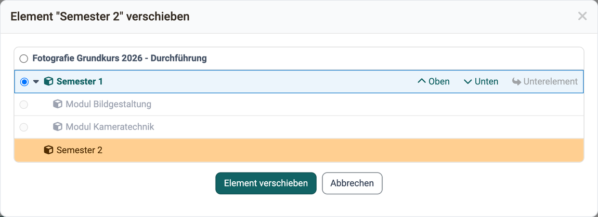{ class="shadow lightbox" title="Dialog Element verschieben" }

[zum Seitenanfang ^](#implementations)

---

### Tab Kursinhalt {: #tab_content}

Die Liste zeigt alle zu dieser Durchführung gehörenden Kurse mit den Spalten "Typ", "Titel", "Erstellt durch" und "Status", je nach Konfiguration auch "Zeitabschnitt". Die Spalte "Ref." nennt die Anzahl Termine eines Kurses; ein Klick auf die Zahl listet die Termine auf.

Sollen für diese Durchführung (abweichend von der ursprünglichen Struktur) weitere Kurse hinzugefügt werden, verwenden Sie den Button "**Kurs hinzufügen**" rechts oben.

Der Dialog "Kurs hinzufügen" bietet nur Kurse mit dem Verwendungszweck "Verwendung im Course Planner" an. Davon zeigt er Ihre eigenen Kurse, Kurse, die für die Organisation des Produkts oder eine ihrer Unterorganisationen freigegeben sind, und Kurse, die Sie über eine Rolle in der Organisation des Kurses verwalten. Er öffnet auf dem Tab "Meine Kurse". Kurse anderer Besitzer:innen finden Sie im Tab "Suche". Fehlt ein Kurs, meldet OpenOlat keinen Grund. Die drei Bedingungen und was Sie bei einem fehlenden Kurs tun, finden Sie hier: 
[Welche Kurse der Dialog "Kurs hinzufügen" zeigt >](../../manual_how-to/course_planner_courses/course_planner_courses.de.md#add_course_dialog) 
[Einstellung in den Kursen des Produkts >](Course_Planner_Products.de.md#course_settings)

Ist es der erste Kurs der Durchführung, ordnet OpenOlat die bestehenden Termine der Durchführung diesem Kurs zu und meldet "Der Kurs wurde erfolgreich hinzugefügt und die bestehenden Termine dem Kurs zugeordnet." Im Kurs schaltet OpenOlat dabei die Termin- und Absenzenverwaltung ein, falls sie noch ausgeschaltet ist.

Die Option zum **Entfernen** eines **einzelnen Kurses** aus dieser Durchführung finden Sie unter den 3 Punkten am Ende einer Zeile. 
Für das **Entfernen mehrerer Kurse** markieren Sie die Kurse mit den Checkboxen der ersten Spalte. Dann erscheinen über der Liste die Buttons "Status ändern" und "Entfernen".

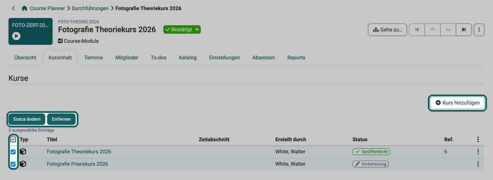{ class="shadow lightbox" title="Tab Kursinhalt einer Durchführung · 2026.09.30" }

#### Automatisch gesteuerte Kursinhalte {: #content_automation}

Steuern Automatisierungsregeln den Inhalt dieser Durchführung, erscheint oberhalb der Liste der Abschnitt «Übersicht Automatisierung». Aufgeführt sind nur aktive Regeln, die den Inhalt betreffen. Zu jeder Regel sehen Sie die Art der Regel, also «Instanziierung» oder den Zielstatus, dazu das Datum der geplanten Ausführung und die Bedingung, die die Ausführung auslöst. Über den Link «Einstellungen» wechseln Sie direkt zur [Konfiguration der Automatisierung](#tab_settings_automation).

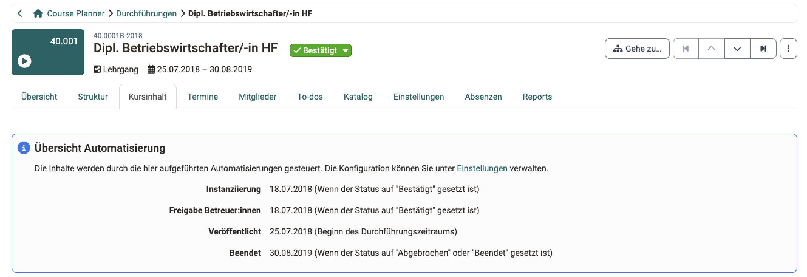{ class="shadow lightbox" title="Tab Kursinhalt einer Durchführung" }

#### Kurstemplates als Kursinhalt [:octicons-tag-16:{ title="ab Release 20.0 (OO-8424)" }](https://track.frentix.com/issue/OO-8424){:target="_blank"} {: #content_course_templates}

Steht beim Elementtyp der Durchführung "Max. Kursreferenzen" auf "1 Template/Kurs", können Sie auch ein Kurstemplate hinzufügen, das zu einem späteren Zeitpunkt instanziiert werden kann. Das heisst, zum Zeitpunkt der Planung im Course Planner ist ein Kurs nur angekündigt, aber noch nicht hinzugefügt. Erst wenn die Kursdurchführung tatsächlich stattfindet, weil z.B. genügend Buchungsaufträge vorhanden sind, wird der Kurs der Durchführung hinzugefügt (instanziiert).

Die Verwendung eines Templates zur Instanziierung empfiehlt sich, wenn es sich um einen immer wiederkehrenden gleichen Kurs handelt.

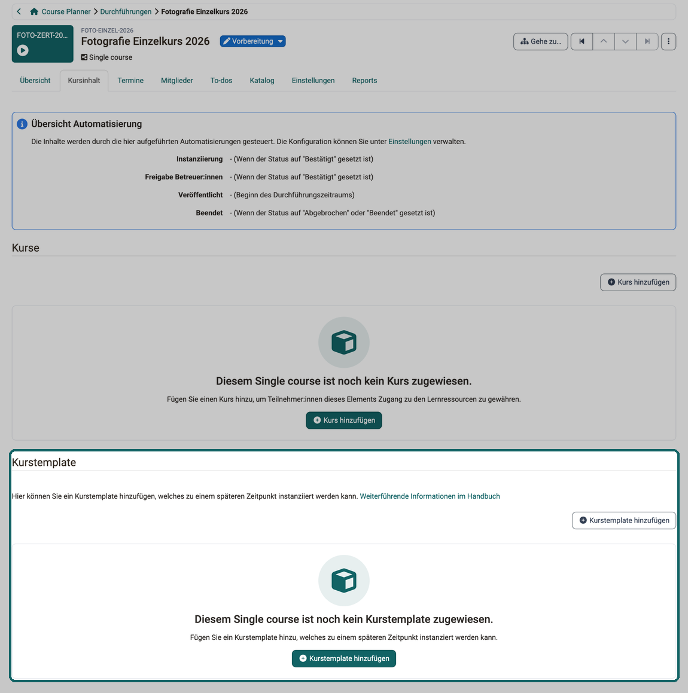{ class="shadow lightbox" title="Tab Kursinhalt einer Durchführung · 2026.09.30" }

Die Buttons "Kurs hinzufügen" und "Kurstemplate hinzufügen" werden inaktiv, sobald die Anzahl Kurse oder Templates hinzugefügt ist, die dem gewählten Durchführungstyp entsprechen.

#### Erstellung von Kurstemplates {: #create_course_templates}

Kurstemplates werden erstellt, indem im Kurs unter `Kurs > Administration > Einstellungen > Tab "Freigabe" > Abschnitt "Verwendung"` der Verwendungszweck "Template" gewählt wird. Die Templates für Kursinhalte im Course Planner sind ohne eigenständige Mitgliederverwaltung, da die Mitglieder für jede Durchführung im Course Planner hinzugefügt werden.

!!! info "Wichtig"

    Templates werden kopiert. Bei späterer Änderung des Templates bleibt die früher erstellte Kopie unverändert.

[zum Seitenanfang ^](#implementations)

---

### Tab Termine [:octicons-tag-16:{ title="ab Release 20.0 (OO-8064)" }](https://track.frentix.com/issue/OO-8064){:target="_blank"} {: #tab_events}

- Bestehen viele Termine, helfen die Tabs "Alle", "Relevant", "Heute", "Bevorstehend", "Vergangene", "Ohne Dozenten", "Pendent" und "Abgeschlossene" sowie die **Filter** oberhalb der Tabelle, den Überblick zu behalten.
- Kann der Elementtyp der Durchführung Unterelemente enthalten, wählen Sie mit **"Alle Ebenen"**, ob auch die Termine der untergeordneten Elemente erscheinen, oder mit **"Diese Ebene"** nur die Termine dieses Elements.
- Rechts über der Tabelle wechseln Sie zwischen Tabellenansicht und Zeitansicht.
- Mit dem **Button "Termin hinzufügen"** lassen sich neue Termine zur aktuell gewählten Durchführung hinzufügen.
- Ein Klick auf das **+** am Anfang einer Zeile zeigt die **Details** dieses Termins.
- Es besteht auch die Möglichkeit, Termine zu **importieren**. Klicken Sie dazu auf den kleinen Pfeil neben dem Button "Termin hinzufügen".

Wird ein Termin einem Kurs zugeordnet, schaltet OpenOlat im Kurs die Termin- und Absenzenverwaltung ein, falls sie noch ausgeschaltet ist. Kursbesitzer:innen finden den Termin danach im Kurs im Menü "Termine und Absenzen" der Kurs-Administration, Betreuer:innen im Werkzeug "Termine" der Kurs-Werkzeugleiste. Wann OpenOlat die Funktion nicht selbst einschaltet, beschreibt [Kurseinstellungen - Tab Durchführung](../learningresources/Course_Settings_Execution.de.md#lecture_enabled). [:octicons-tag-16:{ title="ab Release 21.1.0 (OO-9711)" }](https://track.frentix.com/issue/OO-9711){:target="_blank"}

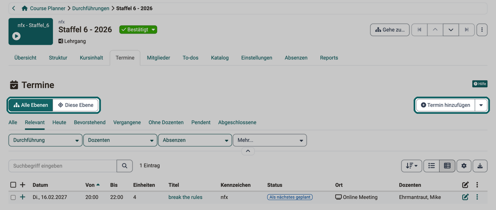{ class="shadow lightbox" title="Tab Termine · 2026.09.30" }

[zum Seitenanfang ^](#implementations)

---

### Tab Mitglieder [:octicons-tag-16:{ title="ab Release 20.3 (OO-8514)" }](https://track.frentix.com/issue/OO-8514){:target="_blank"} {: #tab_members}

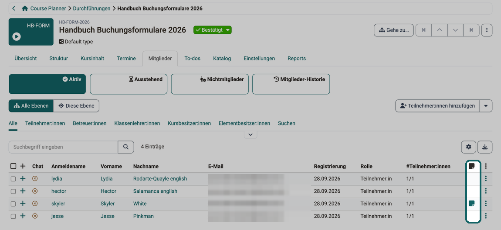{ class="shadow lightbox" title="Tab Mitglieder · 2026.09.30" }

Wie bereits weiter oben erwähnt, kann ein Bildungsprodukt (aus einem oder mehreren Kursen bestehend) mehrfach durchgeführt werden. An jeder Durchführung sind andere Teilnehmer:innen dabei.

Deshalb werden Teilnehmer:innen zu Mitgliedern einer bestimmten Durchführung gemacht (nicht zu Mitgliedern einzelner Kurse oder eines Bildungsprodukts). Es kann bestimmt werden, ob sie Mitglieder der gesamten Durchführung oder nur eines Teilbereiches werden.

In der Mitgliederliste zeigt ein Notiz-Symbol in der Spalte **"Teilnehmer:inkommentar"**, ob zur Buchung ein Kommentar der Teilnehmer:in vorliegt; auch der Spaltenkopf zeigt nur das Symbol. Ein Klick darauf öffnet den Kommentar. Dieselbe Angabe führt die Tabelle der Buchungsaufträge im Tab Katalog in der Spalte **"Kommentar Teilnehmer:in"** [:octicons-tag-16:{ title="ab Release 21.1.0 (OO-9484)" }](https://track.frentix.com/issue/OO-9484){:target="_blank"}.

In der Mitgliederliste sehen Sie auch, unter welcher Nummer die Buchhaltung eine Person führt. Die Spalte **"Debitorennummer"** ist standardmässig ausgeblendet, Sie blenden sie über "Spalten auswählen" ein. Werte zeigt die Spalte nur, wenn die [Debitorennummer](../../manual_admin/administration/Modules_Organisations.de.md#customer_number) im Modul Organisationen eingeschaltet ist. Ist für eine Person eine Debitorennummer erfasst, zeigen auch die Details ihrer Mitgliedschaft die Nummer. [:octicons-tag-16:{ title="ab Release 21.1 (OO-9736)" }](https://track.frentix.com/issue/OO-9736){:target="_blank"}

Wer wissen will, was eine Person beim Buchen angegeben hat, öffnet die Details ihrer Mitgliedschaft in der Mitgliederliste. Hat die Person ein Angebot mit [Formularen für Buchungsaufträge](#booking_order_forms) gebucht, zeigt die Detailansicht unterhalb der Buchungsaufträge den Abschnitt "Formulare für Buchungsaufträge". Die Tabelle führt je Formular Titel, Kennzeichen, Schrittname, Buchungsauftrag, Status und Abgabedatum. Mit "Formular ansehen" öffnen Sie die Antworten, mit "Formular bearbeiten" korrigieren Sie sie, solange das Formular den Status "Offen" oder "Abgeschlossen" hat.

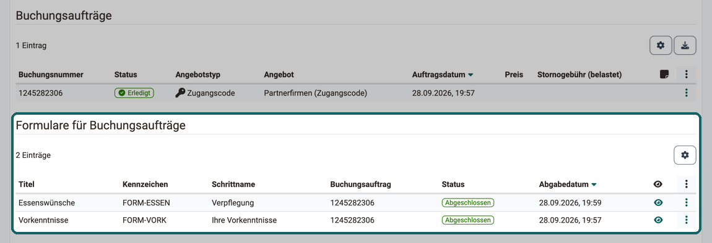{ class="shadow lightbox" title="Detailansicht einer Mitgliedschaft im Tab Mitglieder · 2026.09.28" }

Würden die Teilnehmer:innen zu Mitgliedern des Bildungsprodukts (der "Kopiervorlage") gemacht, wären sie in allen Durchführungen dieses Produkts als Teilnehmer:innen dabei. Dies ist nicht erwünscht. Deshalb können zu einem Produkt nur Besitzer:innen als Mitglieder hinzugefügt werden, keine Teilnehmer:innen.

!!! info "Mitgliederverwaltung im Course Planner"
    Weil die Mitgliederverwaltung bei Verwendung des Course Planners in der Durchführung gemacht wird, gibt es in den Einstellungen der Kurse den Verwendungszweck "Verwendung im Course Planner": 
    `Kurs > Administration > Einstellungen > Tab Freigabe > Abschnitt Verwendung`

**Der Kurs hat dann *keine* eigenständige Mitgliederverwaltung mehr**, die Mitgliederverwaltung erfolgt nun ausschliesslich in der Mitgliederverwaltung der Durchführung, **innerhalb des Course Planners**.

 

#### Tab Mitglieder > Mitglieder hinzufügen {: #add_members}

Um Teilnehmer:innen zu einer Durchführung als Mitglieder hinzuzufügen, verwenden Sie: 
`Course Planner > Durchführungen > "Ihre Durchführung" > Tab Mitglieder > Button "Teilnehmer:innen hinzufügen"`

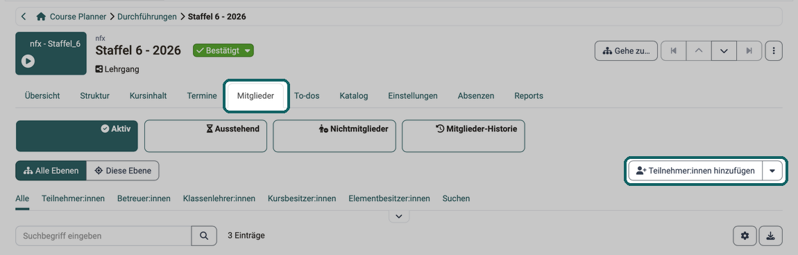{ class="shadow lightbox" title="Tab Mitglieder einer Durchführung · 2026.10.02" }

Der Assistent führt durch die Schritte "Benutzersuche", "Buchungsauftrag", "Mitgliedschaft", "Übersicht" und "Benachrichtigung". Den Schritt "Buchungsauftrag" gibt es nur, wenn die Durchführung Angebote hat.

Im Schritt "Buchungsauftrag" wählen Sie das Angebot, über das die Teilnehmer:innen aufgenommen werden. Verwendet dieses Angebot Formulare, folgt für jedes Formular ein eigener Schritt, beschriftet mit seinem Schrittnamen. Diese Schritte liegen zwischen den Schritten "Buchungsauftrag" und "Mitgliedschaft" und erscheinen, sobald Sie den Schritt "Buchungsauftrag" mit "Weiter" verlassen. Sie füllen die Formulare einmal aus, OpenOlat speichert die Antworten für jede ausgewählte Person an deren eigenem Buchungsauftrag. Die Option "Ohne Buchungsauftrag" erscheint nur, wenn die Durchführung im Tab Katalog auf [Ohne Buchungsauftrag zulässig](#tab_catalog_settings) steht. Mit dieser Option entsteht kein Buchungsauftrag, und es folgen keine Schritte für Formulare.

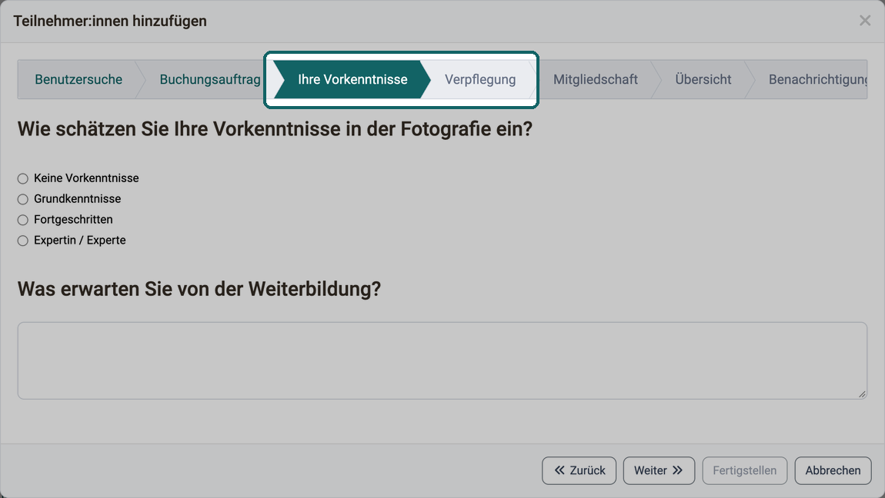{ class="shadow lightbox" title="Schritt eines Formulars im Assistenten Teilnehmer:innen hinzufügen · 2026.10.02" }

 

#### Tab Mitglieder > Einladung und Mitgliedschaftsanfragen [:octicons-tag-16:{ title="ab Release 20.3 (OO-9156)" }](https://track.frentix.com/issue/OO-9156){:target="_blank"} {: #invitation_flow}

Wenn Teilnehmer:innen einer Durchführung zugewiesen werden, erhalten sie je nach Kontext eine Systembenachrichtigung per E-Mail:

- Zuweisung zu einem **Kurs**: Benachrichtigung mit Link in den Kursbereich
- Zuweisung zu einem **Bildungsprodukt**: Benachrichtigung mit Link in den Kursbereich
- Zuweisung zu einer **Gruppe**: Benachrichtigung mit Link in den Gruppenbereich

Im Kursbereich, im Gruppenbereich sowie direkt auf der Kurs- oder Bildungsprodukt-Info-Seite erscheint die Hinweisbox **"Anfragen zur Mitgliedschaft akzeptieren"**. Teilnehmer:innen können die Anfrage dort annehmen oder ablehnen. Eine Annahme ist an allen drei Stellen gleichermassen möglich. Mit "Später" schliessen sie die Hinweisbox, ohne zu entscheiden.

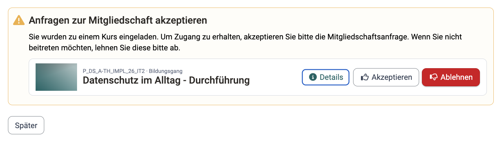{ class="shadow lightbox" title="Kursbereich einer eingeladenen Person" }

!!! info "Wichtig"

    Ob eine Bestätigung durch die eingeladenen Personen erforderlich ist, hängt von der Konfiguration der Reservierungspflicht ab. Details dazu finden Sie im Abschnitt zur Bestätigung der Mitgliedschaft weiter unten.

Für Administrator:innen: [Systemweite Konfiguration der Einladung >](../../manual_admin/administration/Modules_Groups.de.md#accept_membership)

 

#### Tab Mitglieder > Bestätigung der Mitgliedschaft durch Linienvorgesetzte/Ausbildungsverantwortliche {: #confirm_membership}

Im Course Planner kann eingerichtet werden, dass ein Buchungswunsch von einer administrativen Rolle (z.B. Linienvorgesetzte:r oder Ausbildungsverantwortliche:r) bestätigt werden muss. Mit dieser Einstellung können Teilnehmende einen Kurs buchen; die vorgesetzte Person muss die Buchung aber in einem Zwischenschritt bestätigen oder ablehnen.

Fügen Sie Teilnehmer:innen selbst hinzu, wählen Sie im Schritt "Mitgliedschaft" des Assistenten "Mit Bestätigung". Unter "Bestätigung durch" legen Sie fest, ob "Administrative Rollen" oder die "Teilnehmer:in" selbst bestätigt, und unter "Bestätigung bis" das Datum, bis zu dem die Bestätigung erfolgen muss. Mit "Standard" ist die Mitgliedschaft sofort aktiv.

Dieser Genehmigungsschritt kann auch in allen Angeboten eingerichtet werden, ausser bei Bezahlung mit Paypal (denn dort wird sofort bezahlt/gebucht).

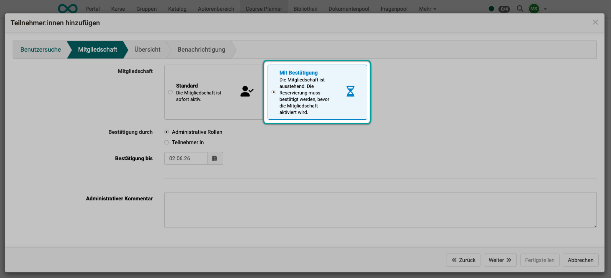{ class="shadow lightbox" title="Schritt Mitgliedschaft des Assistenten Teilnehmer:innen hinzufügen" }

[zum Seitenanfang ^](#implementations)

---

### Tab Katalog [:octicons-tag-16:{ title="ab Release 20.0 (OO-8236)" }](https://track.frentix.com/issue/OO-8236){:target="_blank"} {: #tab_catalog}

Die verschiedenen Durchführungen können im Katalog angeboten werden. Dazu muss ein [Angebot](../../manual_user/area_modules/catalog2.0_angebote.de.md) erstellt werden, wie zu jedem Katalogeintrag.

Der Teilbereich "Angebote" zeigt von oben nach unten die Übersicht, die Einstellungen, die Angebote mit dem Button **Angebot hinzufügen** und die Formulare für Buchungsaufträge.

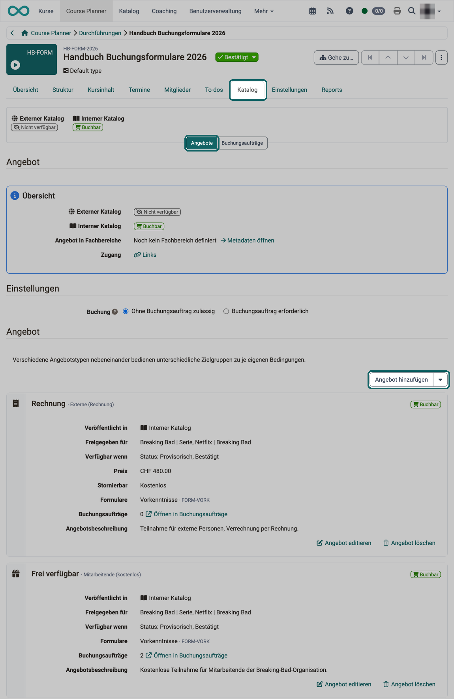{ class="shadow lightbox" title="Teilbereich Angebote im Tab Katalog · 2026.09.28" }

Um potenzielle Teilnehmer:innen auf ein Angebot im Katalog aufmerksam zu machen, können Sie einen Direktlink auf das Angebot z.B. in einer Mail verschicken. Sie finden die Links in der Übersicht der Angebote (je Durchführung im Tab Katalog). Der Dialog «Links» führt je einen Direktlink für den externen und den internen Katalog. Ein Klick auf das QR-Code-Symbol vor einem Link zeigt den Link als QR-Code.

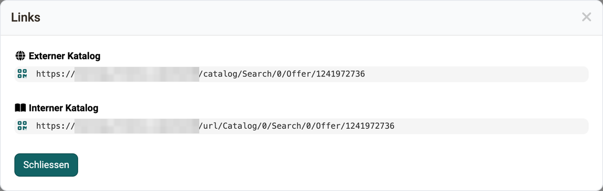{ class="shadow lightbox" title="Dialog Links im Tab Katalog · 2026.09.30" }

#### Tab Katalog > Einstellungen {: #tab_catalog_settings}

Im Abschnitt **Einstellungen** unter der Übersicht legen Sie fest, ob jede Teilnahme an dieser Durchführung über ein Angebot gebucht sein muss und wie weit vorne die Durchführung im Katalog erscheint.

- **Buchung**: Die Einstellung legt fest, ob beim Hinzufügen von Teilnehmer:innen im Course Planner zwingend eine Buchung über ein Angebot nötig ist. Mit "Ohne Buchungsauftrag zulässig" (Standard) bietet der Assistent im Tab Mitglieder auch die Aufnahme ohne Angebot an. Mit "Buchungsauftrag erforderlich" fehlt diese Möglichkeit, jede Aufnahme läuft über ein Angebot. Die Einstellung gilt für die ganze Durchführung, nicht für ein einzelnes Angebot.
- **Katalog-Priorität bei Sortierung**: Die Priorität bestimmt, wie weit vorne ein Angebot im Katalog erscheint. Über den Button **Bearbeiten** neben dem Wert passen Sie sie an. Die Zeile erscheint nur, wenn die "Sortierung nach Priorität" in der System-Administration eingeschaltet ist: `Administration > Module > Katalog > Tab "Einstellungen"`. [Mehr zur Sortierung nach Priorität >](catalog2.0_sort_offers.de.md#sorting_microsites_define_priority)

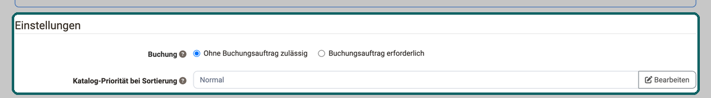{ class="shadow lightbox" title="Abschnitt Einstellungen im Tab Katalog · 2026.09.28" }

#### Tab Katalog > Formulare für Buchungsaufträge [:octicons-tag-16:{ title="ab Release 21.1 (OO-9724)" }](https://track.frentix.com/issue/OO-9724){:target="_blank"} {: #booking_order_forms}

Braucht eine Durchführung beim Buchen mehr als Name und Rechnungsadresse, etwa Essenswünsche, Vorkenntnisse oder eine Mitgliedernummer, holen Formulare diese Informationen beim Buchen eines Angebots ein. Pro Angebot legen Sie fest, welche Formulare zum Einsatz kommen und in welcher Reihenfolge. So kann ein Angebot für Berufstätige andere Fragen stellen als ein Angebot derselben Durchführung für Studierende. Die Antworten liegen danach an drei Orten: beim Formular in der Durchführung, beim Buchungsauftrag und bei der Mitgliedschaft der Person.

Als Formular dient eine [Formular-Lernressource](../learningresources/Form.de.md). Den Abschnitt gibt es nur bei Durchführungen im Course Planner, nicht bei Angeboten eines Kurses oder einer anderen Lernressource. Angebote der Angebotsart PayPal Checkout verwenden keine Formulare. Formulare hinzufügen, verwenden und entfernen können alle, die die Durchführung bearbeiten dürfen; die Rollen nennt die [Rechte-Matrix](Course_Planner.de.md#rights_matrix).

Ein Formular kommt in zwei Stufen zum Einsatz. Zuerst fügen Sie es der Durchführung hinzu, danach schalten Sie es im einzelnen Angebot ein. Ein hinzugefügtes Formular allein wird beim Buchen noch nicht verlangt.

##### Formular hinzufügen {: #booking_order_forms_add}

Den Abschnitt **Formulare für Buchungsaufträge** finden Sie unterhalb der Angebote: 
`Course Planner > Durchführungen > "Ihre Durchführung" > Tab Katalog > Angebote > Button "Formular hinzufügen"`

Zur Auswahl stehen Formular-Lernressourcen mit dem Verwendungszweck "Einbindung", auf die Sie im Autorenbereich zugreifen können. Der Dialog öffnet mit Ihren "Favoriten"; alle anderen Formulare finden Sie unter "Meine Einträge" oder "Suche". Das gewählte Formular steht danach allen Angeboten der Durchführung zur Verfügung, verwendet wird es noch in keinem.

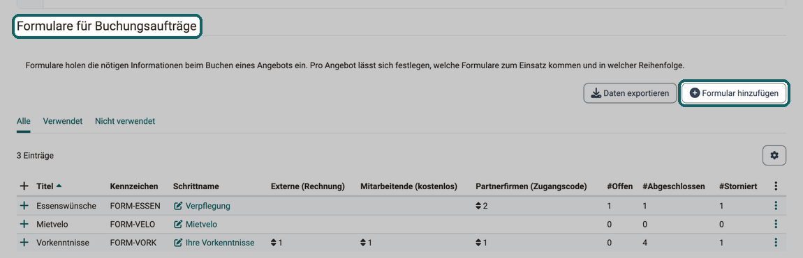{ class="shadow lightbox" title="Abschnitt Formulare für Buchungsaufträge im Tab Katalog · 2026.09.28" }

Die Tabelle führt je Formular:

- **Titel** und **Kennzeichen** der Formular-Lernressource.
- **Schrittname**: die Beschriftung, unter der das Formular beim Buchen als Schritt erscheint. Beim Hinzufügen übernimmt OpenOlat den Titel des Formulars. Ein Klick auf den Schrittnamen öffnet **Schrittname bearbeiten**; das Feld darf nicht leer bleiben.
- **Angebot**: je Angebot der Durchführung eine Spalte, beschriftet mit der internen Bezeichnung des Angebots oder, wenn keine gesetzt ist, mit der Angebotsart. Verwendet das Angebot das Formular, steht dort seine Position.
- **#Offen, #Abgeschlossen, #Storniert**: die Anzahl der Formulare je Status. "Offen" ist ein Formular, das zu einem Buchungsauftrag gehört, aber noch nicht ausgefüllt ist. "Abgeschlossen" ist ein ausgefülltes Formular. "Storniert" wird ein Formular, wenn sein Buchungsauftrag storniert wird.

Die Ansichten "Verwendet" und "Nicht verwendet" grenzen die Liste auf Formulare ein, die mindestens ein Angebot verwendet oder keines. Unter den 3 Punkten am Zeilenende öffnet "Formular öffnen" die Formular-Lernressource, "Formular entfernen" nimmt das Formular aus der Durchführung.

##### Formular im Angebot verwenden {: #booking_order_forms_offer}

Damit ein Formular beim Buchen verlangt wird, schalten Sie es im Angebot ein. Öffnen Sie dazu das Angebot zum Bearbeiten. Hat die Durchführung Formulare, zeigt der Dialog den Abschnitt **Formulare für Buchungsaufträge**. Dort legen Sie fest, welche Formulare für das Angebot verwendet werden und in welcher Reihenfolge.

- **Verwenden**: Der Schalter nimmt das Formular in dieses Angebot auf. Er steht zunächst auf aus.
- **Position**: Mit den Pfeilen bestimmen Sie die Reihenfolge der verwendeten Formulare und damit die Reihenfolge der Schritte beim Buchen.
- **Titel, Kennzeichen und Schrittname** dienen der Orientierung. Den Schrittnamen ändern Sie in der Tabelle der Durchführung.

OpenOlat übernimmt die Änderungen, wenn Sie das Angebot speichern.

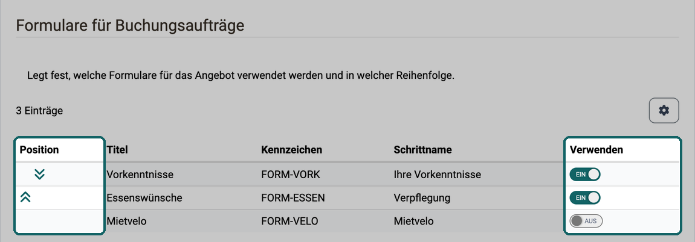{ class="shadow lightbox" title="Abschnitt Formulare für Buchungsaufträge im Dialog eines Angebots · 2026.09.28" }

Haben bereits Personen das Angebot gebucht, legt OpenOlat beim Einschalten für ihre Buchungsaufträge je ein Formular mit dem Status "Offen" an. Diese Personen zählen unter **#Offen**, bis jemand das Formular über **Formular bearbeiten** ausfüllt.

##### Formulare beim Buchen [:octicons-tag-16:{ title="ab Release 21.1 (OO-9742)" }](https://track.frentix.com/issue/OO-9742){:target="_blank"} {: #booking_order_forms_booking}

Bucht eine Person ein Angebot, das Formulare verwendet, führt OpenOlat sie durch einen Assistenten. Jedes Formular ist ein eigener Schritt, beschriftet mit dem Schrittnamen und in der Reihenfolge der Position. Das gilt für die Angebotsarten Frei verfügbar, Zugangscode und Rechnung. Die Buchung ist erst abgeschlossen, wenn alle Formulare ausgefüllt sind; die Antworten stehen danach mit dem Status "Abgeschlossen" beim Buchungsauftrag. Auch beim [Hinzufügen von Teilnehmer:innen](#add_members) im Tab Mitglieder erscheinen die Formulare des gewählten Angebots als Schritte. Wie die buchende Person den Assistenten durchläuft, beschreibt [Buchung mit Formularen als Assistent](catalog2.0_angebote.de.md#offer_booking_wizard).

##### Antworten ansehen und exportieren {: #booking_order_forms_answers}

Klappen Sie in der Tabelle der Durchführung die Zeile eines Formulars auf, erscheinen alle Personen mit Angebot, Buchungsauftrag, Status und Abgabedatum. Die Ansichten "Offen", "Abgeschlossen" und "Storniert" und der Filter "Status" grenzen die Liste ein. **Formular öffnen** öffnet die Formular-Lernressource in einem neuen Browser-Tab, **Exportieren** lädt die Antworten dieses einen Formulars herunter.

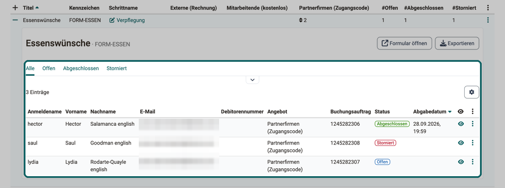{ class="shadow lightbox" title="Aufgeklapptes Formular im Abschnitt Formulare für Buchungsaufträge · 2026.09.28" }

**Formular ansehen** zeigt das ausgefüllte Formular. Darüber stehen die Durchführung und die Person sowie Angebot, Buchungsauftrag, Abgabedatum und Status. **Formular bearbeiten** unter den 3 Punkten korrigiert die Antworten, solange das Formular den Status "Offen" oder "Abgeschlossen" hat. Ein storniertes Formular lässt sich nur ansehen.

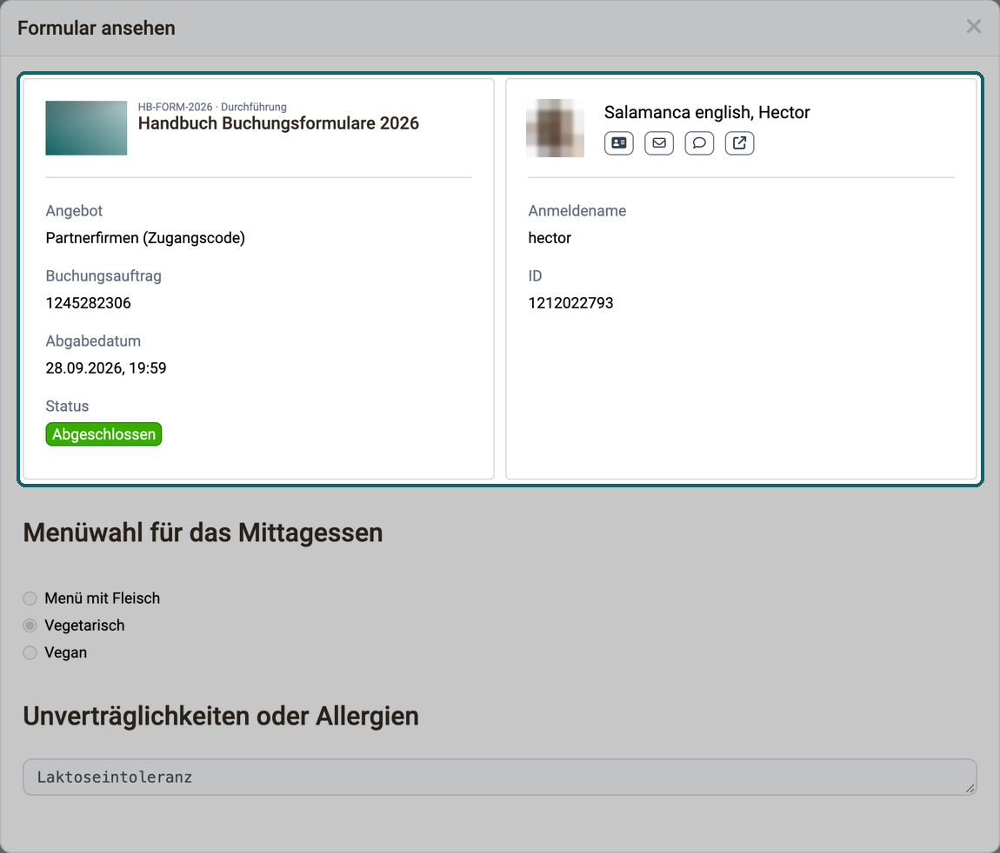{ class="shadow lightbox" title="Ansicht eines ausgefüllten Formulars · 2026.09.28" }

**Daten exportieren** oberhalb der Tabelle lädt die Antworten aller angezeigten Formulare herunter. Je Formular entsteht eine Excel-Datei mit den Blättern "Antwort - Abgeschlossen" und "Antwort - Alle". Bei mehreren Formularen, bei einem Formular mit dem Element "Datei hochladen" oder bei konfiguriertem PDF-Service erhalten Sie eine ZIP-Datei. Sie enthält die Excel-Dateien, die hochgeladenen Dateien und bei konfiguriertem PDF-Service jedes Formular als PDF.

Dieselben Formulare mit Status und Abgabedatum führen auch die Detailansicht eines [Buchungsauftrags](#tab_catalog_booking_orders) und die Detailansicht einer [Mitgliedschaft](#tab_members).

##### Formular deaktivieren oder entfernen {: #booking_order_forms_remove}

Ein Formular lässt sich auf zwei Arten aus dem Buchen nehmen. Sie unterscheiden sich darin, was mit den abgegebenen Formularen geschieht:

- **Verwenden ausschalten** im Dialog des Angebots: Das Formular wird bei der Buchung dieses Angebots nicht mehr verwendet. Die abgegebenen Formulare bleiben bestehen. Liegen bereits abgegebene Formulare vor, bestätigen Sie den Schritt im Dialog **Formular deaktivieren**.
- **Formular entfernen** in der Tabelle der Durchführung: Das Formular verlässt die Durchführung und alle ihre Angebote. Die abgegebenen Formulare werden gelöscht.

!!! danger "Achtung"
    **Formular entfernen** löscht alle abgegebenen Formulare dieses Formulars. Sollen die Antworten erhalten bleiben, schalten Sie stattdessen **Verwenden** in den Angeboten aus oder exportieren Sie die Daten vorher.

#### Tab Katalog > Buchungsaufträge [:octicons-tag-16:{ title="ab Release 20.0 (OO-8318)" }](https://track.frentix.com/issue/OO-8318){:target="_blank"} {: #tab_catalog_booking_orders}

Wurden im Katalog Angebote mit Buchungsmöglichkeit ergänzt, sind die Buchungsaufträge und ihre Details ebenfalls unter dem Tab "Katalog" im Teilbereich "Buchungsaufträge" zu finden.

Die Tabs "Alle", "Offen", "Erledigt", "Bezahlt", "Storniert" und "Fehler" sowie die Filter "Status", "Angebotstyp" und "Angebot" grenzen die Liste ein. Ist die Angebotsart Rechnung verfügbar, kommen die Tabs "Angepasster Preis" und "Adressvorschlag" dazu. Mit **Buchungsaufträge herunterladen** erhalten Sie die Buchungsaufträge der Durchführung als Excel-Datei. Sie enthält dieselben Spalten wie der [Report Buchungsaufträge](Reports_BookingOrders.de.md), bei eingeschalteter Debitorennummer also auch die drei Spalten zur Debitorennummer.

Das Menü am Ende einer Zeile bietet je nach Status des Auftrags andere Aktionen. Bei einem offenen Auftrag mit Preis sind das «Auf "Bezahlt" setzen» und "Preis ändern", bei einem bezahlten «Auf "Offen" setzen». Liegt eine Rechnungsadresse oder ein Adressvorschlag vor, ändern Sie bei einem offenen Auftrag mit "Rechnungsadresse ändern" die Adresse. "Buchungsauftrag ausbuchen" steht bei jedem offenen Auftrag zur Verfügung, "Stornogebühr ändern" bei einem stornierten Auftrag mit Stornogebühr.

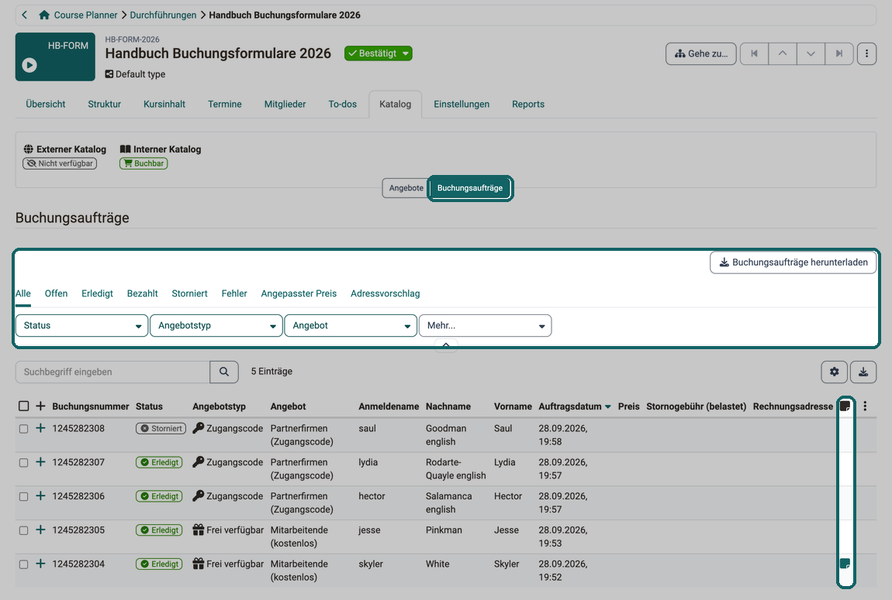{ class="shadow lightbox" title="Teilbereich Buchungsaufträge im Tab Katalog · 2026.09.30" }

Verlangt das gebuchte Angebot Formulare, führt die Detailansicht eines Buchungsauftrags den Abschnitt **Formulare für Buchungsaufträge** mit Titel, Kennzeichen, Schrittname, Status und Abgabedatum. Dort lassen sich die Formulare ansehen und, solange sie offen oder abgeschlossen sind, bearbeiten.

Hat ein Buchungsauftrag eine Rechnungsadresse mit erfasster Debitorennummer, zeigt seine Detailansicht die Nummer als erste Zeile der Rechnungsadresse.

[zum Seitenanfang ^](#implementations)

---

### Tab Einstellungen {: #tab_settings}

Alles, was eine Durchführung beschreibt und steuert, legen Sie in den Unter-Tabs der Einstellungen fest. Die Unter-Tabs "Metadaten", "Infos", "Durchführung" und "Optionen" stehen immer zur Verfügung, "Automatisierung" und "Bewertung" nur unter den Bedingungen, die ihre Abschnitte weiter unten nennen. Bei der Durchführung selbst, nicht bei ihren untergeordneten Elementen, zeigt der Button **Vorschau Infoseite**, wie die Infoseite der Durchführung erscheint.

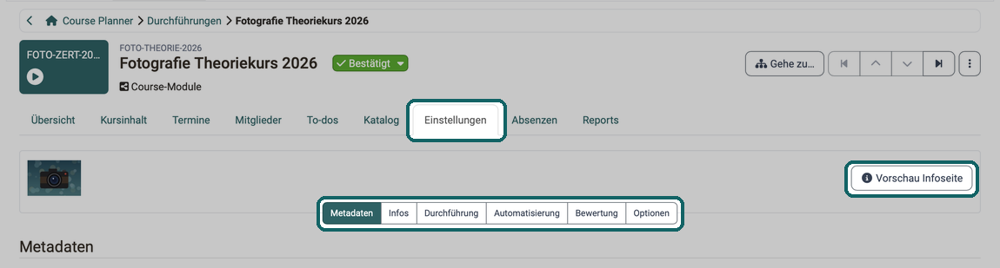{ class="shadow lightbox" title="Tab Einstellungen einer Durchführung · 2026.10.02" }

#### Metadaten der Einstellungen

Die hier eingegebenen Metadaten werden verwendet um z.B. Suchprozesse zu vereinfachen.

Pflichtfelder sind "Titel", "Kennzeichen" und "Typ". Bei einer Durchführung kommt das "Durchführungsformat" dazu. Sind für den Course Planner Taxonomien hinterlegt, ordnen Sie über "Durchsuchen" Fachbereiche zu; bei eingeschaltetem Katalog heisst das Feld einer Durchführung "Fachbereiche / Katalog". Administrator:innen sehen zusätzlich die "ID" des Elements, im Formular und im Kopfbereich der Einstellungen.

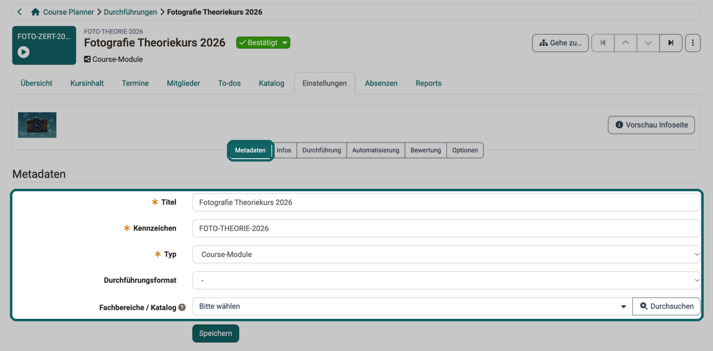{ class="shadow lightbox" title="Unter-Tab Metadaten der Einstellungen einer Durchführung · 2026.09.30" }

#### Infos in den Einstellungen [:octicons-tag-16:{ title="ab Release 21.1 (OO-9756)" }](https://track.frentix.com/issue/OO-9756){:target="_blank"} {: #tab_settings_infos}

Mit den Angaben im Tab "Infos" bestimmen Sie, wie sich die Durchführung im Katalog und auf ihrer Infoseite zeigt. Der Tab ist gleich aufgebaut wie der [Tab "Info" eines Kurses](../learningresources/Course_Settings_Info.de.md), dort sind die einzelnen Felder beschrieben. Bei einer Durchführung umfasst der Tab folgende Angaben, bei einem untergeordneten Element nur das Titelbild:

- "Titelbild (jpg,png,gif)", der Schalter "Mit Teaser-Film", "Teaser" und "Beschreibung".
- Abschnitt **Fakten**: "Autor:innen / Durchführung mit", "Hauptsprache" und "Zeitaufwand".
- Abschnitt **Anzeigeeinstellungen**: Unter "Auf Infoseite anzeigen" wählen Sie, ob die Infoseite "Gliederung", "Termine", "Lernen Sie Ihre Dozent:innen kennen", "Zertifikat" und "Kreditpunkte" zeigt. Ist "Lernen Sie Ihre Dozent:innen kennen" gewählt, legen Sie unter "Als Dozenten angezeigte Mitglieder" fest, wer als Dozent:in erscheint: "Dozierende der Termine", "Betreuer:innen" oder "Kursbesitzer:innen". Mindestens eine Rolle ist dann Pflicht, die Zahl in Klammern nennt, wie viele Personen die Durchführung in dieser Rolle hat.
- Aufklappbarer Abschnitt **Erweiterte Informationen**: "Lernziele", "Voraussetzungen" und "Bescheinigung".

In den Anzeigeeinstellungen unterscheidet sich die Durchführung in drei Punkten vom Kurs:

- **Gliederung**: Die Option zeigt auf der Infoseite den Aufbau der Durchführung mit ihren Elementen. Sie steht zur Wahl, wenn der Elementtyp Unterelemente zulässt. Ein Kurs hat diese Option nicht.
- **Kreditpunkte**: Die Option steht zur Wahl, sobald Administrator:innen die [Kreditpunkte](../../manual_admin/administration/e-Assessment_Credit_Points.de.md) eingeschaltet haben; "Termine" und "Zertifikat" stehen immer zur Wahl. Ist "Kreditpunkte" gewählt, erscheint darunter das Pflichtfeld "Kreditpunkte": Dort geben Sie die Anzahl ein und wählen das Kreditpunktesystem.
- **Standardeinstellungen**: Eine neue Durchführung startet mit den [Standardeinstellungen aus dem Modul Course Planner](../../manual_admin/administration/Modules_Course_Planner.de.md#default_settings). Wählen Sie "Lernen Sie Ihre Dozent:innen kennen" neu aus, sind die dort festgelegten Rollen vorgewählt.

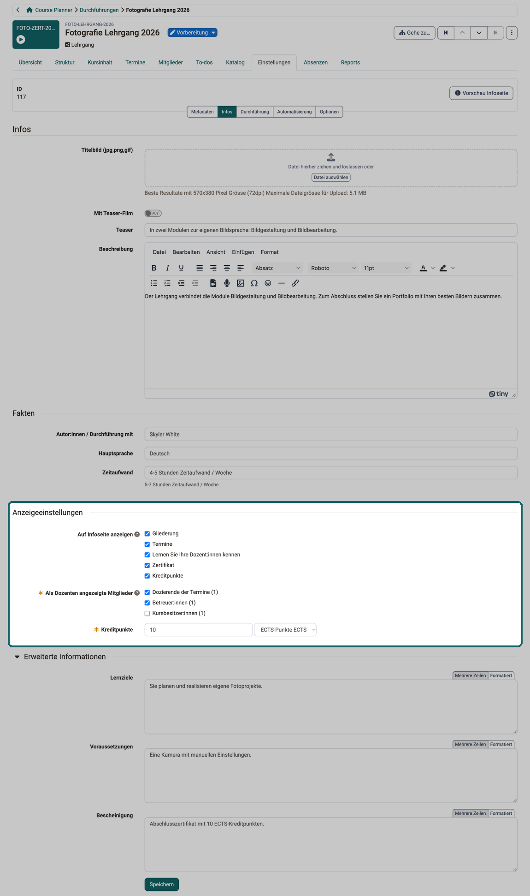{ class="shadow lightbox" title="Unter-Tab Infos der Einstellungen einer Durchführung · 2026.10.09" }

#### Durchführung in den Einstellungen

Zu den Einstellungen der Durchführung gehören der Durchführungszeitraum, der Ort und die Anzahl der Teilnehmer:innen.

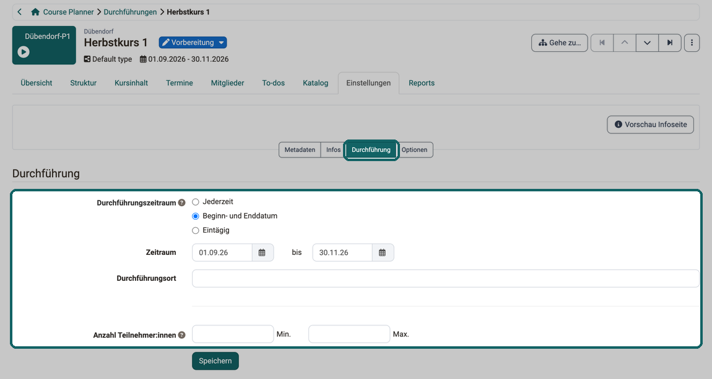{ class="shadow lightbox" title="Unter-Tab Durchführung der Einstellungen · 2026.09.30" }

#### Automatisierung konfigurieren [:octicons-tag-16:{ title="ab Release 21.0 (OO-9578)" }](https://track.frentix.com/issue/OO-9578){:target="_blank"} {: #tab_settings_automation}

Im Unterabschnitt **«Automatisierung»** der Tab-Einstellungen legen Sie fest, wann Kurse automatisch [instanziiert](#tab_content) und wann Statuswechsel automatisch ausgelöst werden.

Der Unterabschnitt erscheint bei Elementen, deren Elementtyp die Verwendung «Durchführung» oder «Element» hat. Bei der Verwendung «Durchführung oder Element (legacy)» fehlt er.

Soll ein Kurs mehrfach und dabei immer genau gleich verwendet werden, kann er als Template angelegt werden. Die Kurse werden dann für jede Durchführung aus der Template-Vorlage erstellt. Die [Instanziierung](#tab_content) kann automatisiert zu einem bestimmten Zeitpunkt sowie rollenspezifisch erfolgen, z.B. einige Tage vor Beginn einer Durchführung zugänglich für Betreuer:innen. Bis dahin können die Templatebesitzer:innen noch am Template arbeiten, während die organisatorische Planung im Course Planner bereits läuft.

**Geltungsbereich der Automatisierungsregeln:**

Automatisierungsregeln werden auf zwei Ebenen definiert:

* **Elementtyp-Ebene** in der System-Administration unter `Administration > Module > Course Planner > Tab Elementtypen`: Administrator:innen hinterlegen Standardregeln für jeden Elementtyp. Diese Regeln gelten als Vorlage für alle Elemente dieses Typs.
* **Element-Ebene** `Tab Einstellungen > Automatisierung`: Für jedes einzelne Element entscheiden Sie, ob die Regeln des Elementtyps übernommen oder individuell überschrieben werden sollen.

Für das einzelne Element stehen zwei Modi zur Wahl:

* **«Vom Typ "Elementtyp" übernehmen»**: Das Element verwendet die Standardregeln des Elementtyps. Die Beschriftung nennt den Namen des Typs und ob dort Regeln aktiv sind. Passen Administrator:innen die Vorlage an, wirkt sich das automatisch auf alle Elemente aus, die diesen Modus verwenden.
* **«Überschreiben»**: Das Element verwendet abweichende, individuell konfigurierte Regeln, unabhängig vom Elementtyp.

**Typen von Automatisierungsregeln:**

| Typ | Auslöser |
|---|---|
| Bei Statuswechsel | Eine Aktion wird ausgelöst, sobald der Durchführungs- oder Elementstatus einen bestimmten Wert annimmt. |
| Zeitgesteuert | Eine Aktion wird relativ zum Beginn oder Ende des Durchführungszeitraums ausgelöst. |

**Ausführung der Regeln:**

Aktivierte Automatisierungen laufen einmal täglich zu einer festen Uhrzeit. Die Uhrzeit nennt der Informationstext oberhalb der Konfiguration.

Sobald mindestens eine Regel aktiv ist, zeigt der Kopfbereich der Durchführung oberhalb der Tabs unter «Automatisierung» das Datum der nächsten Ausführung. Steht keine Ausführung mehr an, erscheint dort ein Strich.

**Tabelle der Regeln:**

Unter der Konfiguration listet eine Tabelle die Regeln des Elements. Die Tabs «Alle», «Relevant», «Durchführung» und «Inhalt» darüber grenzen die Liste ein; bei Elementen mit der Verwendung «Element» heisst der dritte Tab «Element». Vorgewählt ist «Relevant», der Tab zeigt nur die eingeschalteten Regeln. «Durchführung» und «Inhalt» zeigen die Regeln, die die Durchführung selbst bzw. ihre Kurse betreffen. Die Spalten nennen je Regel «Kontext», «Automatisierung», «Zielstatus» und «Bedingung», dazu unter «Der Durchführungsstatus ist», bei Elementen «Der Elementstatus ist», den Status, den die Durchführung bzw. das Element für die Ausführung haben muss, sowie «Geplante Ausführung» und «Ausführungsdatum». Der Schalter in der Spalte «Regel» zeigt, ob die Regel eingeschaltet ist.

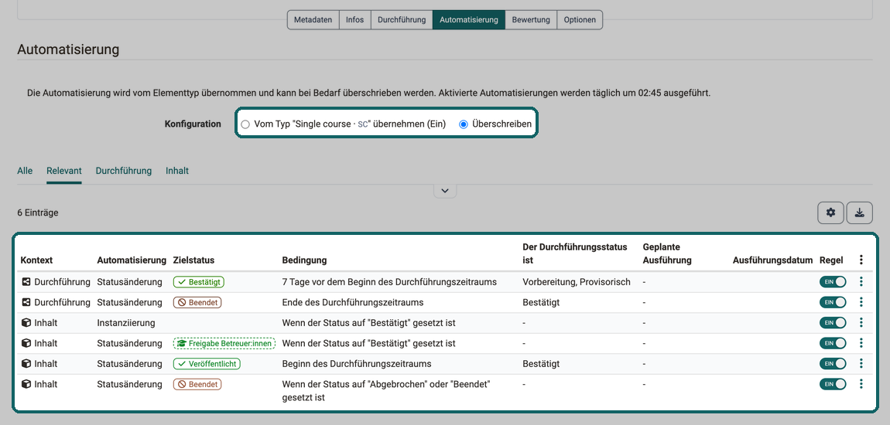{ class="shadow lightbox" title="Unter-Tab Automatisierung der Einstellungen einer Durchführung · 2026.10.02" }

[Zu den Elementtypen und Automatisierungsregeln (Admin) >](../../manual_admin/administration/Modules_Course_Planner.de.md#tab_element_types) 
[Zu den To-dos auf CPL-Elementen >](Course_Planner_Todos.de.md)

#### Bewertung in den Einstellungen [:octicons-tag-16:{ title="ab Release 21.0 (OO-9499)" }](https://track.frentix.com/issue/OO-9499){:target="_blank"} {: #tab_settings_assessment}

Der Unter-Tab "Bewertung" setzt voraus, dass die Zertifikatsprogramme auf der OpenOlat-Instanz eingeschaltet sind, was standardmässig der Fall ist. Er wird dann bei Durchführungen vom Typ Einzelkurs angezeigt sowie bei jeder Durchführung, die bereits einem Zertifikatsprogramm zugeordnet ist. Hier verknüpfen Sie die Durchführung direkt mit einem Zertifikatsprogramm, ohne den Weg über das Programm selbst zu gehen.

* Mit dem Schalter **"Zertifikatsprogramm"** blenden Sie die Auswahl eines Programms ein. Gespeichert ist die Verknüpfung erst, wenn Sie ein Programm ausgewählt haben; ohne Programm steht der Schalter beim nächsten Öffnen des Unter-Tabs wieder auf «Aus». Schalten Sie ihn bei verknüpftem Programm aus, folgt dieselbe Sicherheitsabfrage wie bei **"Entfernen"**.
* Ist noch kein Programm verknüpft, wählen Sie über den Button **"Auswählen"** ein Programm aus. Der Dialog "Zertifikatsprogramm auswählen" zeigt Titel, Kennzeichen, Gültigkeitsdauer, Rezertifizierung und benötigte Kreditpunkte. Er listet nur Programme, deren **Administrative Freigabe** die Organisation des Produkts enthält. Zusätzlich müssen Sie Zertifikatsprogrammbesitzer:in des Programms sein oder in einer seiner Organisationen die Rolle Administrator:in, Principal oder Kursplaner:in haben. Bleibt die Liste leer, prüfen Sie zuerst die Administrative Freigabe des Programms.
* Ist ein Programm verknüpft, zeigt ein Panel den Programmtitel und, sofern gesetzt, das Kennzeichen. Gültigkeitsdauer und benötigte Kreditpunkte erscheinen dort, sofern sie am Programm hinterlegt sind, die Rezertifizierung nur, wenn sie am Programm eingeschaltet ist. Mit **"Öffnen"** öffnen Sie das Programm in einem neuen Tab, sofern Sie Zugriff auf das Programm haben. Mit **"Entfernen"** heben Sie die Verknüpfung auf; die Sicherheitsabfrage "Zertifikatsprogramm entfernen" bestätigt den Schritt. Teilnehmer:innen, die bereits ein Zertifikat erhalten haben, bleiben Mitglieder des Programms.

Den Schalter und die Buttons "Auswählen" und "Entfernen" bedienen Administrator:innen, Kursplaner:innen und Produktbesitzer:innen.

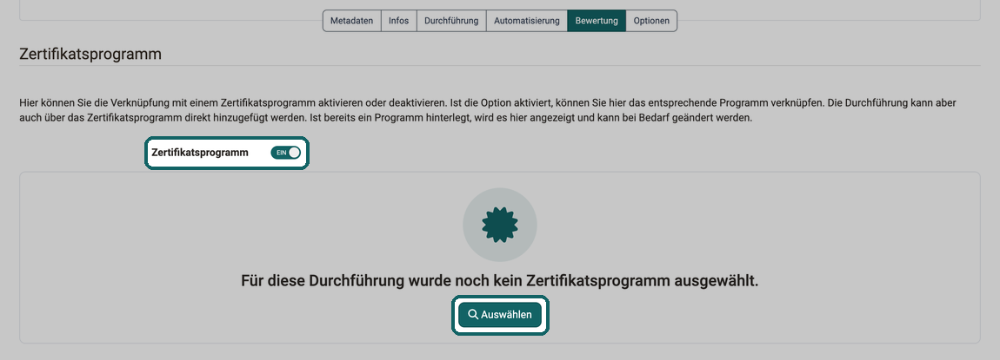{ class="shadow lightbox" title="Unter-Tab Bewertung der Einstellungen einer Durchführung · 2026.10.02" }

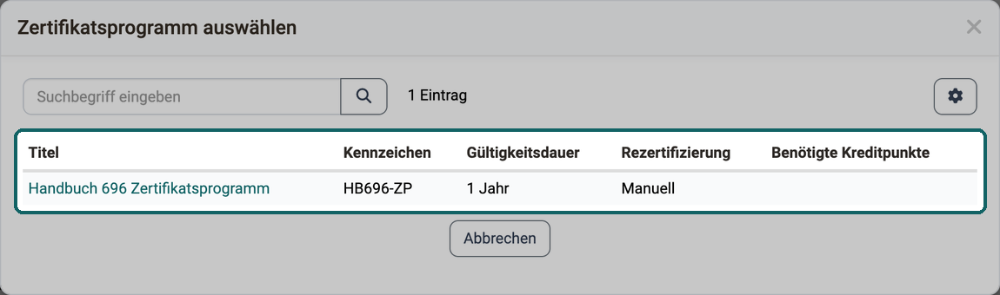{ class="shadow lightbox" title="Dialog Zertifikatsprogramm auswählen · 2026.10.02" }

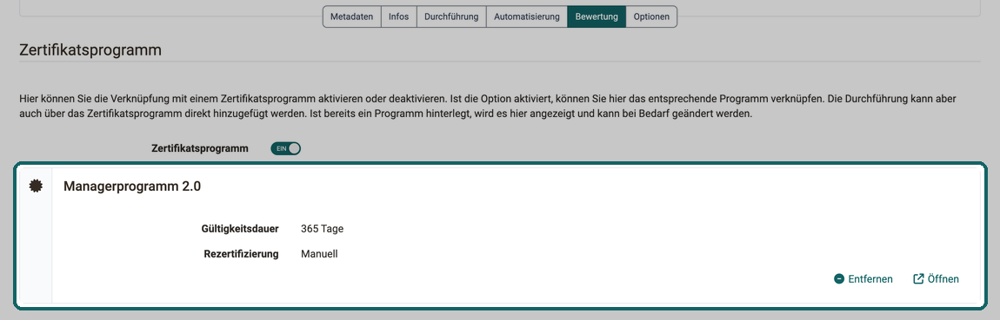{ class="shadow lightbox" title="Unter-Tab Bewertung der Einstellungen · 2026.10.02" }

Eine Durchführung kann auch direkt über das [Zertifikatsprogramm](Course_Planner_Certification_Programs.de.md#config_tab_implementations) hinzugefügt werden.

Beim [Kopieren einer Durchführung](#copy) wird die Verknüpfung zum Zertifikatsprogramm übernommen, sofern Sie die Berechtigung für das Programm besitzen. Fehlt die Berechtigung, zeigt der Assistent die Warnung "Das Zertifikatsprogramm kann aufgrund fehlender Berechtigungen nicht übernommen werden." Beim Kopieren entsteht ein Eintrag im Aktivitätslog des Programms.

#### Optionen in den Einstellungen

Für jede Durchführung können hier separat Einstellungen vorgenommen werden für:

- Kalenderkonfiguration
- Stundenplan
- Absenzenkonfiguration
- Absenzmanagement
- Fortschrittskonfiguration
- Fortschritt

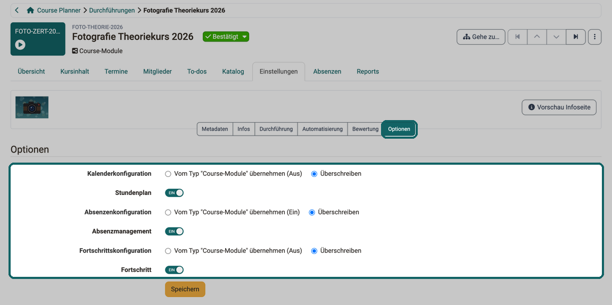{ class="shadow lightbox" title="Unter-Tab Optionen · 2026.09.30" }

[zum Seitenanfang ^](#implementations)

---

### Tab Absenzen [:octicons-tag-16:{ title="ab Release 20.0 (OO-8442)" }](https://track.frentix.com/issue/OO-8442){:target="_blank"} {: #tab_absences}

Dieser Tab erscheint nur, wenn auf dem Element die Absenzen aktiviert wurden.

Die Aktivierung erfolgt in den Einstellungen der Durchführung: `Tab Einstellungen > Optionen > Absenzenkonfiguration`.

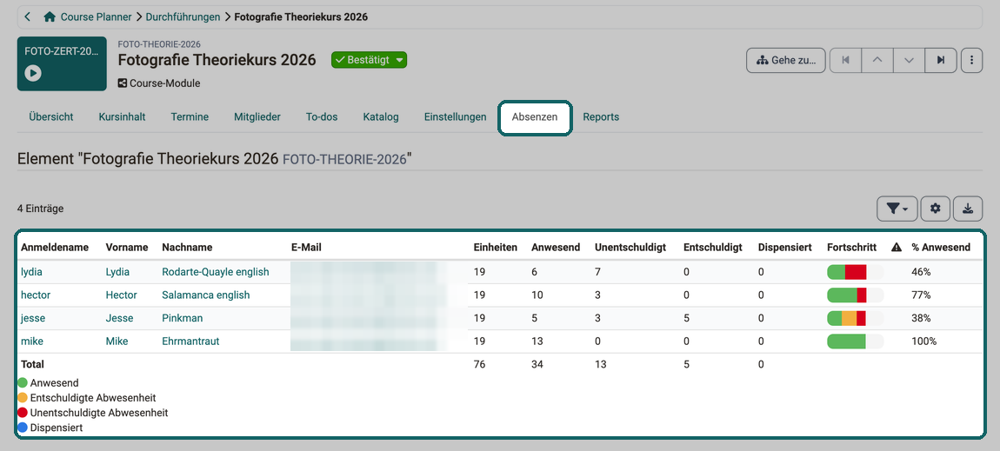{ class="shadow lightbox" title="Tab Absenzen einer Durchführung · 2026.09.30" }

[zum Seitenanfang ^](#implementations)

---

### Tab Reports [:octicons-tag-16:{ title="ab Release 20.0 (OO-8387)" }](https://track.frentix.com/issue/OO-8387){:target="_blank"} {: #tab_reports}

Die hier erstellbaren Reports beziehen sich auf die aktuell gewählte Durchführung.

Im Unterschied dazu bezieht sich die Report-Erstellung, die in der [Übersicht](../../manual_user/area_modules/Course_Planner_Reports.de.md) aufgerufen werden kann, auf **alle** Durchführungen. Die Struktur der Excel-Dateien (Spalten) und das Vorgehen zum Erstellen ist bei beiden identisch.

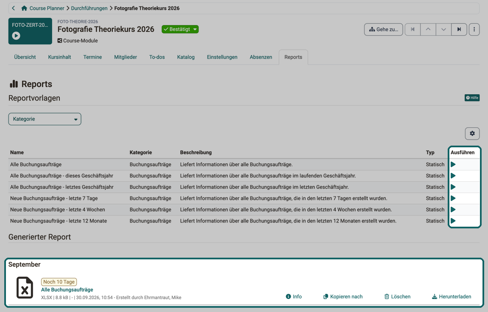{ class="shadow lightbox" title="Tab Reports einer Durchführung · 2026.09.30" }

Durch Klick auf das **Symbol in der Spalte "Ausführen"** werden anhand der aufgelisteten Vorlagen Excel-Dateien mit den aktuellen Daten erzeugt.

Die so erstellten Excel-Dateien finden Sie dann im unteren Bereich des Screens aufgeführt. Sie können kopiert und heruntergeladen werden.

[zum Seitenanfang ^](#implementations)

---

## Kopieren einer Durchführung [:octicons-tag-16:{ title="ab Release 20.0 (OO-8418)" }](https://track.frentix.com/issue/OO-8418){:target="_blank"} {: #copy}

Die Aktion **"Element kopieren"** finden Sie in der Liste der Durchführungen am Ende einer Zeile unter den 3 Punkten.

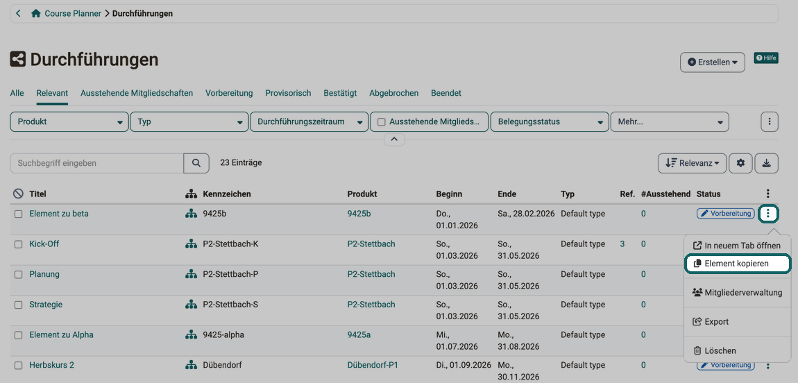{ class="shadow lightbox" title="Liste der Durchführungen · 2026.09.30" }

Im ersten Schritt des kleinen Wizards kann gewählt werden, ob auch Kursinhalte, Termine, Mitglieder, To-dos und Raumbuchungen kopiert werden sollen. Unter **Titel** und **Kennzeichen** schlägt der Wizard die Angaben der Vorlage mit dem Zusatz "(Kopie)" vor. Die [Anzeigeeinstellungen](#tab_settings_infos) übernimmt die Kopie von der Vorlage, nicht aus den Standardwerten der Administration.

- **Kursinhalt**: "Kopieren" verwendet ein vorhandenes Template wieder und kopiert die Termine; ist kein Template vorhanden, wird der Kurs kopiert. "Wiederverwenden" teilt den Kurs mit anderen Durchführungen oder verwendet das Template wieder. "Nicht kopieren" übernimmt keine Kursinhalte.
- **Eigenständige Termine**: Termine ohne Kurs werden mit "Kopieren" übernommen, mit "Nicht kopieren" nicht.
- **To-dos** und **Raumplanung**: siehe [To-dos beim Kopieren übernehmen](#copy_todos) und [Raumbuchungen beim Kopieren übernehmen](#copy_rooms).
- **Betreuer:innen**: "Standard" kopiert die Mitgliedschaften und die Zuordnungen zu Terminen, "Nur Mitgliedschaft" nur die Mitgliedschaften, "Nicht kopieren" keine.
- **Klassenlehrer:innen / Kursbesitzer:innen / Elementbesitzer:innen**: "Inklusive Mitgliedschaft" kopiert die Mitgliedschaften, "Nicht kopieren" keine.

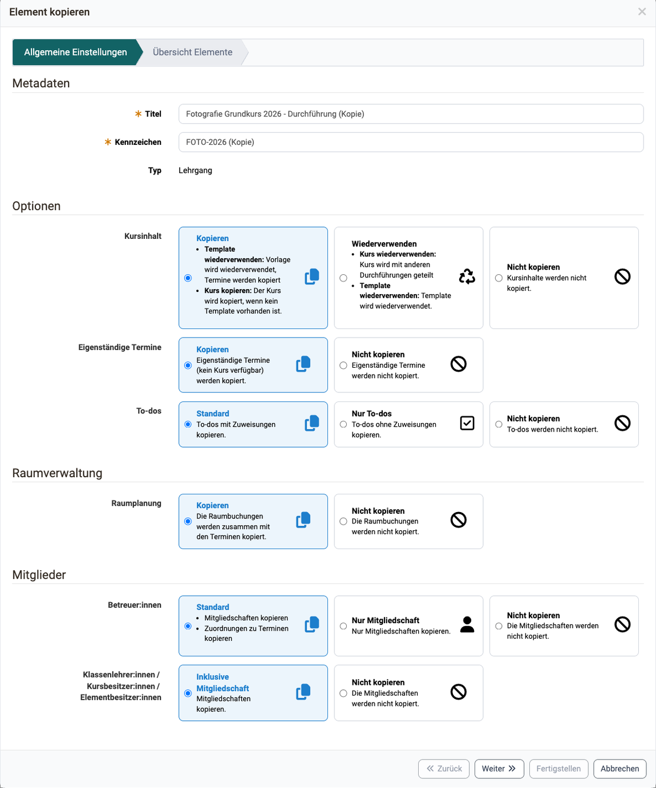{ class="shadow lightbox" title="Schritt Allgemeine Einstellungen des Assistenten Element kopieren" }

Der zweite Schritt des Wizards zeigt Ihnen eine Übersicht der Elemente, die nun kopiert werden. 
Sie können hier noch Anpassungen (insbesondere der Termine) vornehmen. 
Durch Klick auf das + vor einem Element zeigen Sie die Kurse und Termine des Elements an.

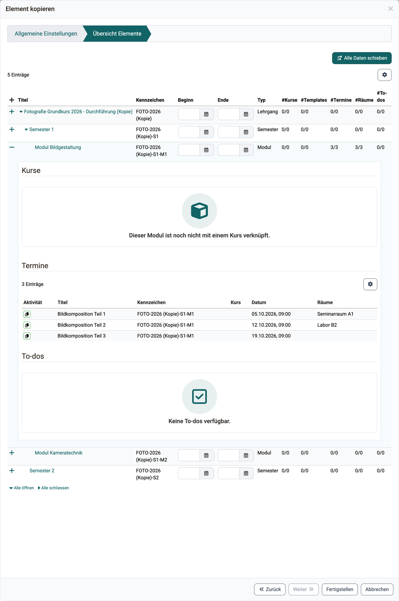{ class="shadow lightbox" title="Schritt Übersicht Elemente" }

In den Detailbereichen "Kurse", "Termine" und "To-dos" zeigt die Spalte **"Aktivität"** mit einem Symbol, was mit der einzelnen Zeile geschieht: kopieren, wiederverwenden oder nicht kopieren.

In einer Durchführung hat es viele verschiedene Terminangaben, die in einer bestimmten Reihenfolge angelegt sind. Beim Kopieren können alle diese Daten automatisch angepasst werden und gemeinsam verschoben werden. Verwenden Sie dazu im Schritt «Übersicht Elemente» den Button **"Alle Daten schieben"** rechts über der Liste der Elemente. Der Dialog zeigt das "Bezugsdatum (frühestes)". Unter "Verschiebung nach" wählen Sie zwischen "Datum" und "Tage" und geben anschliessend das "Neue Datum" bzw. die Anzahl Tage an.

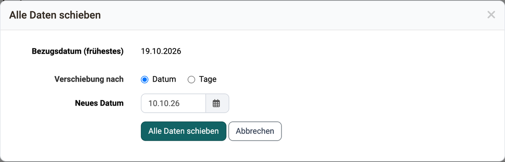{ class="shadow lightbox" title="Dialog Alle Daten schieben des Assistenten Element kopieren · 2026.10.09" }

Hat die Durchführung Angebote, folgt als dritter Schritt **"Angebote"**. Er listet die Angebote der Vorlage, alle sind ausgewählt; ein abgewähltes Angebot übernimmt die Kopie nicht. Hat ein Angebot einen Zeitraum, verschiebt der Wizard ihn um dieselbe Anzahl Tage wie **"Alle Daten schieben"**. In der Zeile des Angebots passen Sie den Zeitraum an.

### To-dos beim Kopieren übernehmen [:octicons-tag-16:{ title="ab Release 21.0 (OO-9419)" }](https://track.frentix.com/issue/OO-9419){:target="_blank"} {: #copy_todos}

Wer eine Durchführung kopiert, übernimmt ihre To-dos in die Kopie und muss sie für die neue Durchführung nicht neu anlegen. Im ersten Schritt des Wizards bestimmen Sie mit der Auswahl "To-dos", wie dabei vorgegangen wird:

* **Standard:** To-dos mit Zuweisungen kopieren.
* **Nur To-dos:** To-dos ohne Zuweisungen kopieren.
* **Nicht kopieren:** To-dos werden nicht kopiert.

Mit "Standard" übernimmt die Kopie auch die Einträge unter "Zugewiesen" und "Delegiert". Die eingetragenen Personen erhalten je Kopie eine einzige E-Mail, nicht eine je To-do: bei mehreren To-dos die E-Mail "Neue To-dos" mit einer Zeile und einem Link je To-do, bei genau einem To-do die E-Mail "Neues To-do". Bei mehr als 20 To-dos zeigt die E-Mail die ersten 20 und darunter die Zeile "… und N weitere". OpenOlat verschickt die E-Mails erst, wenn die Kopie abgeschlossen ist; bricht die Kopie ab, geht keine E-Mail los. Wer beim Kopieren keine E-Mails auslösen will, wählt "Nur To-dos" oder "Nicht kopieren"; mit "Nur To-dos" entstehen die To-dos ohne Einträge unter "Zugewiesen" und "Delegiert", und Sie weisen sie danach von Hand zu. Ein im Schritt "Übersicht Elemente" abgewähltes To-do wird nicht kopiert und erscheint in keiner E-Mail. [:octicons-tag-16:{ title="ab Release 21.1 (OO-9731)" }](https://track.frentix.com/issue/OO-9731){:target="_blank"}

Ausnahmen, etwa für die Person, die kopiert und selbst eingetragen ist, beschreibt der Abschnitt [Wann OpenOlat E-Mails zu To-dos verschickt](../basic_concepts/To_Dos_Basics.de.md#notifications).

In der Übersicht der Elemente zeigt die Spalte **"#To-dos"**, wie viele To-dos ein Element enthält. In der Detailansicht eines Elements listet der Bereich "To-dos" alle To-dos mit den Spalten "Aktivität", "Titel", "Priorität", "Datumseingabe" (absolut oder relativ), "Fälligkeitstermin", "Fälligkeit" (die verbleibende Zeit), "Status", "Zugewiesen", "Delegiert" und "Tags" auf. Über die Checkbox am Zeilenanfang wählen Sie einzelne To-dos vom Kopieren ab. Sind keine To-dos vorhanden, erscheint der Hinweis "Keine To-dos verfügbar."

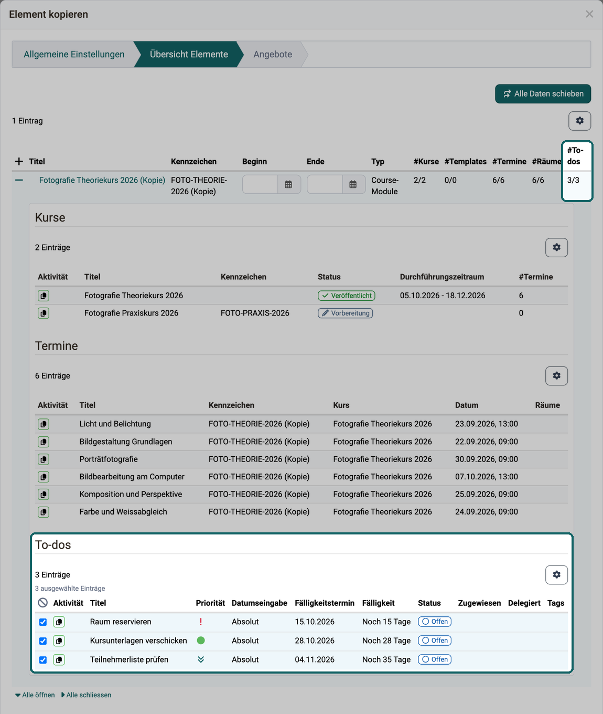{ class="shadow lightbox" title="Schritt Übersicht Elemente · 2026.09.30" }

### Raumbuchungen beim Kopieren übernehmen [:octicons-tag-16:{ title="ab Release 21.0.2 (OO-9710)" }](https://track.frentix.com/issue/OO-9710){:target="_blank"} {: #copy_rooms}

Ist das Modul «Räume» aktiviert, zeigt der erste Schritt des Wizards zusätzlich den Abschnitt **«Raumverwaltung»**. Mit der Auswahl **«Raumplanung»** bestimmen Sie dort, ob die Raumbuchungen der Termine mitkopiert werden:

* **Kopieren:** Die Raumbuchungen werden zusammen mit den Terminen kopiert. Diese Option ist vorausgewählt.
* **Nicht kopieren:** Die Raumbuchungen werden nicht kopiert.

Die Auswahl ist nur aktiv, wenn überhaupt Termine kopiert werden, also wenn bei **Kursinhalt** oder bei **Eigenständige Termine** die Option «Kopieren» gewählt ist. Andernfalls ist sie ausgegraut und es entstehen keine Buchungen.

!!! note "Sie sehen den Abschnitt «Raumverwaltung» nicht?"

    Der Abschnitt erscheint nur, wenn ein:e Systemadministrator:in das Modul «Räume» aktiviert hat. 
    [Räume verwalten (Administration) >](../../manual_admin/administration/Modules_Rooms.de.md#activation)

Die Kopie übernimmt den Raum der ursprünglichen Buchung. Der Zeitraum der Buchung folgt dem kopierten Termin: Verschieben Sie mit **«Alle Daten schieben»** die Termine, verschieben sich die Buchungen mit. OpenOlat prüft beim Kopieren nicht, ob der Raum im neuen Zeitraum noch frei ist. Konflikte wie eine Doppelbuchung erscheinen erst danach als Warnung in der [Raumplanung](Course_Planner_Rooms.de.md#room_scheduling).

Im Schritt "Übersicht Elemente" erscheint bei aktivem Modul und gewählter Option "Kopieren" zusätzlich die Spalte "#Räume"; klappen Sie ein Element auf, führt die Tabelle "Termine" dort auch die Spalte "Räume" mit den gebuchten Räumen. Mit "Nicht kopieren" fehlen beide Spalten.

Die Aktion **«Element kopieren»** steht Administrator:innen, Kursplaner:innen und Produktbesitzer:innen zur Verfügung. Die vollständige Übersicht finden Sie in der [Rechte-Matrix](Course_Planner.de.md#rights_matrix) des Course Planners.

Einzelne Termine kopieren Sie stattdessen in der Terminliste einer Durchführung mit der Aktion **«Kopieren»**. Markieren Sie dort mehrere Termine und kopieren Sie diese gemeinsam, übernimmt OpenOlat die Raumbuchungen automatisch. Kopieren Sie einen einzelnen Termin, öffnet sich der Bearbeitungsdialog der Kopie mit leerem Feld **«Räume»**; die Räume wählen Sie dort selbst.

[zum Seitenanfang ^](#implementations)

---

## Löschen einer Durchführung [:octicons-tag-16:{ title="ab Release 20.0 (OO-8354)" }](https://track.frentix.com/issue/OO-8354){:target="_blank"} {: #delete}

Auch die Option zum Löschen finden Sie in der Liste der Durchführungen am Ende einer Zeile unter den 3 Punkten.

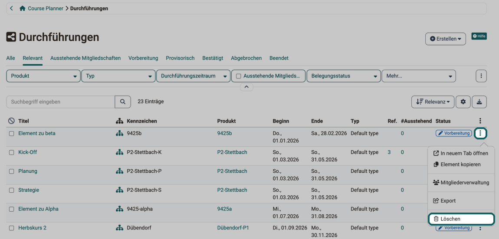{ class="shadow lightbox" title="Liste der Durchführungen im Course Planner · 2026.09.30" }

Haben Sie eine Durchführung bereits angezeigt, finden Sie die Option zum Löschen auch rechts oben unter den 3 Punkten.

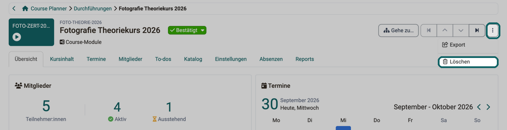{ class="shadow lightbox" title="Kopfbereich einer geöffneten Durchführung · 2026.09.30" }

[zum Seitenanfang ^](#implementations)

---

## Weiterführende Informationen {: #further_information}

**Auf dieser Seite erwähnt** 
[Course Planner: Übersicht >](Course_Planner.de.md) 
[Course Planner: Import / Export >](Course_Planner_Import_Export.de.md) 
[Übersichtsseiten und Widgets >](../basic_concepts/Dashboard_Concept.de.md) 
[Course Planner: Dashboard >](Course_Planner_Dashboard.de.md) 
[Course Planner: To-dos >](Course_Planner_Todos.de.md) 
[Wie kann ich mit dem Course Planner Kursdurchführungen planen und durchführen? >](../../manual_how-to/course_planner_courses/course_planner_courses.de.md) 
[Course Planner: Produkte >](Course_Planner_Products.de.md) 
[Kurseinstellungen - Tab Durchführung >](../learningresources/Course_Settings_Execution.de.md) 
[Modul Organisationen (Administration) >](../../manual_admin/administration/Modules_Organisations.de.md) 
[Modul Gruppen (Administration) >](../../manual_admin/administration/Modules_Groups.de.md) 
[Katalog 2.0 - Angebote >](../../manual_user/area_modules/catalog2.0_angebote.de.md) 
[Katalog 2.0 - Sortierung/Reihenfolge >](catalog2.0_sort_offers.de.md) 
[Formulare - Übersicht >](../learningresources/Form.de.md) 
[Reports: Buchungsaufträge >](Reports_BookingOrders.de.md) 
[Kurseinstellungen - Tab Info >](../learningresources/Course_Settings_Info.de.md) 
[e-Assessment Administration: Kreditpunkte >](../../manual_admin/administration/e-Assessment_Credit_Points.de.md) 
[Modul Course Planner (Administration) >](../../manual_admin/administration/Modules_Course_Planner.de.md) 
[Course Planner: Zertifikatsprogramme >](Course_Planner_Certification_Programs.de.md) 
[Course Planner: Reports >](../../manual_user/area_modules/Course_Planner_Reports.de.md) 
[To-dos: Grundlagen >](../basic_concepts/To_Dos_Basics.de.md) 
[Modul Räume (Administration) >](../../manual_admin/administration/Modules_Rooms.de.md) 
[Course Planner: Raumverwaltung >](Course_Planner_Rooms.de.md)

**Weiterführend** 
[Wie erstelle ich meinen ersten OpenOlat-Kurs? >](../../manual_how-to/my_first_course/my_first_course.de.md) 
[Course Planner: Termine >](../../manual_user/area_modules/Course_Planner_Events.de.md) 
[Wie kann ich mit dem Course Planner einen Bildungsgang planen und durchführen? >](../../manual_how-to/course_planner_curriculum/course_planner_curriculum.de.md)

[zum Seitenanfang ^](#implementations)
