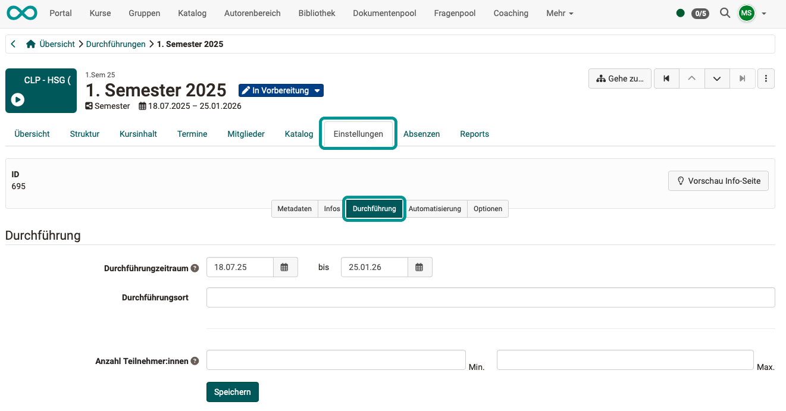
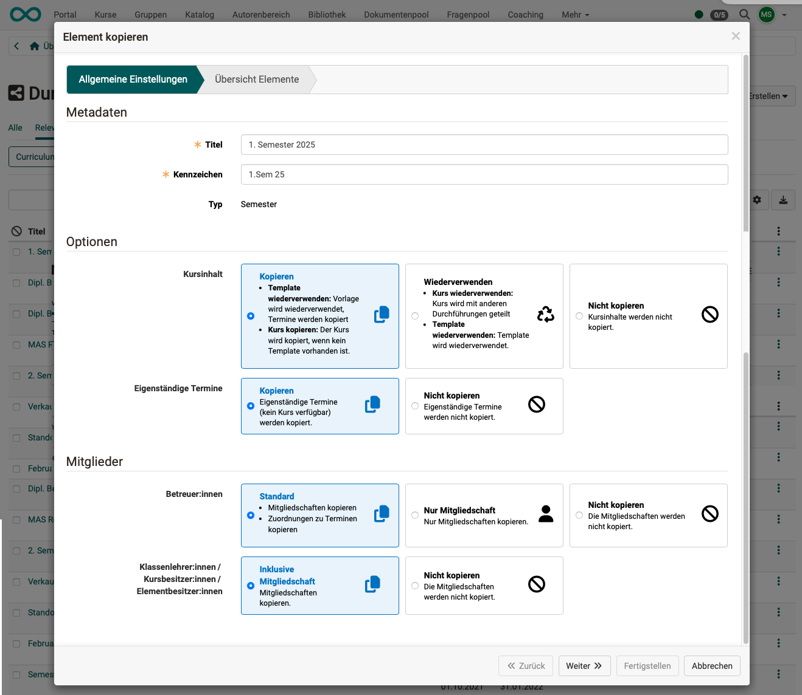

# Course Planner: Durchführungen {: #implementations}

{ class="shadow lightbox" } 

## Was ist eine Durchführung? {: #definition}

Ein Bildungsprogramm/Produkt (aus einem oder mehreren Kursen bestehend) kann mehrfach angeboten und durchgeführt werden. Jede Durchführung kann zu einem anderen Termin stattfinden und an jeder Durchführung sind dann andere Teilnehmer:innen dabei.

In einem Bildungsprogramm/Produkt werden zu jeder Durchführung ein oder mehrere Kurse zugeordnet. 

Der oder die mehrfach verwendeten Kurse sind nur einmal vorhanden und Templates. Die Kurse werden für jede Durchführung instanziert (aus der Template-Vorlage erstellt). Diese Instanzierung kann auch automatisiert zu einem bestimmten Termin erfolgen. Z.B. einige Tage vor Beginn einer Durchführung. Bis dahin können die Kursbesitzer:innen noch an der Fertigstellung der Kurse (Templates) arbeiten. Das Organisatorische kann aber mit dem Course Planner bereits vorbereitet sein.

Von diesem Konzeptidee her, werden in der Regel in jeder Durchführung die gleichen Kurse zugeordnet und verwendet. Es ist aber in OpenOlat auch möglich, die Inhalte in jeder Durchführung anzupassen.

[zum Seitenanfang ^](#implementations)

---

## Die Liste der Durchführungen {: #listing}

Haben Sie in der Übersicht des Courser Planners den Button "Durchführungen" gewählt, gelangen Sie zunächst zu einer Liste aller Durchführungen dieses Produkts. Sie können mit den Tabs (Reitern) Teil-Listen anzeigen lassen (z.B. "Aktiv") und mit Filtern die Auswahl weiter eingrenzen.

{ class="shadow lightbox" }  

[zum Seitenanfang ^](#implementations)

---

## Navigation in den Durchführungen {: #navigation}

Haben Sie in der Liste eine Durchführung gewählt und geöffnet, können Sie von hier aus

 rechts oben durch Klick auf den Button "**Gehe zu**" innerhalb der aktuellen Durchführung zu einem Element springen.

 mit den **Pfeiltasten** rechts oben zu anderen Durchführungen  wechseln.

 durch Klick auf die verschiedenen **Tabs** diese Durchführung konfigurieren.

 durch Klick auf eine der **Überschriften** direkt zum entsprechenden Tab springen.

 durch Klick auf das **+** Kursinhalte hinzufügen.

{ class="shadow lightbox" }

[zum Seitenanfang ^](#implementations)

---

## Konfiguration einer Durchführung {: #config}

Sobald Sie eine Durchführung geöffnet haben, lassen sich in den angezeigten Tabs alle Einstellungen zu dieser Durchführung vornehmen.

### Tab Übersicht {: #tab_overview}

Im Tab "Übersicht" werden Ihnen die nächsten Termine, die Angebote im Katalog und Kursinhalte dieses Produkts angezeigt.

{ class="shadow lightbox" }

[zum Seitenanfang ^](#implementations)

---

### Tab Struktur {: #tab_structure}

In der angezeigten Baumstruktur kann jedes einzelne Element der Durchführung bearbeitet werden, bzw. es können Informationen dazu abgefragt werden.

{ class="shadow lightbox" }

 Möchten Sie für diese Durchführung abweichend von der Produkt-Struktur ("Kopiervorlage" dieser Struktur) andere Elemente hinzufügen, finden Sie unter dem Button **Erstellen** die verfügbaren Element-Typen, wie sie in der Administration definiert wurden. 

 Mit dem **Download-Button** können Sie die angezeigte Struktur auch als Excel-Datei herunterladen. 

 In der Spalte **Referenzierungen** können Sie die in diesem Element referenzierten Inhalte (Kurse) anzeigen lassen.

 In dieser Spalte finden Sie die **Stundenpläne** der jeweiligen Elemente. 

 In dieser Spalte finden Sie die **Absenzen**. (Vorausgesetzt, das Absenzenmanagement ist aktiviert.) 

 Wurde das Modul "Qualitätsmanagement" aktiviert, können Sie bei jedem Element zur zugeordneten **Datenerhebungsvorschau** springen.

 In der Spalte **Lernfortschritt** wird der durchschnittliche Fortschritt aller Teilnehmer:innen angzeigt. Berücksichtigt werden dabei alle Lernpfadkurse dieses Elements. (Herkömmliche Kurse liefern keine Daten zum Lernfortschritt.)

 Unter den **3 Punkten** finden Sie Optionen zum Bearbeiten der Elemente.

{ class="shadow lightbox" }

[zum Seitenanfang ^](#implementations)

---

### Tab Kursinhalt {: #tab_content}

Die Liste zeigt alle zu dieser Durchführung gehörenden Kurse.

Sollen für diese Durchführung (abweichend von der ursprünglichen Struktur) weitere Kurse hinzugefügt werden, verwenden Sie den Button "**Kurs hinzufügen**" rechts oben.

Die Option zum **Entfernen** eines **einzelnen Kurses** aus dieser Durchführung finden Sie unter den 3 Punkten am Ende einer Zeile. 
Für das **Entfernen mehrerer Kurse** markieren Sie die Kurse mit den Checkboxen der ersten Spalte. Dann wird Ihnen ein Button zum Entfernen über der Liste angezeigt.

{ class="shadow lightbox" }

[zum Seitenanfang ^](#implementations)

---

### Tab Termine {: #tab_events}

- Bestehen viele Termine, sind die **Filter** oberhalb der Tabelle nützlich um den Überblick zu behalten.
- Mit dem **Button "Termin hinzufügen"** lassen sich neue Termine zur aktuell gewählten Durchführung hinzufügen.
- Ein Klick auf das **+** am Anfang einer Zeile zeigt die **Details** dieses Termins.
- Es besteht auch die Möglichkeit, Termine zu **importieren**. Klicken Sie dazu auf den kleinen Pfeil neben dem Button "Termin hinzufügen".

{ class="shadow lightbox" }

[zum Seitenanfang ^](#implementations)

---

### Tab Mitglieder {: #tab_members}

{ class="shadow lightbox" }

Wie bereits weiter oben erwähnt, kann ein Bildungsprodukt (aus einem oder mehreren Kursen bestehend) mehrfach durchgeführt werden. An jeder Durchführung sind andere Teilnehmer:innen dabei.

Deshalb werden Teilnehmer:innen zu Mitgliedern einer bestimmten Durchführung gemacht (nicht zu Mitgliedern einzelner Kurse oder eines Bildungsprodukts). Es kann bestimmt werden, ob sie Mitglieder der gesamten Durchführung oder nur eines Teilbereiches werden.

Würden die Teilnehmer:innen zu Mitgliedern des Bildungsprodukts (der "Kopiervorlage") gemacht, wären sie in allen Durchführungen dieses Produkts als Teilnehmer:innen dabei. Dies ist nicht erwünscht. Deshalb können zu einem Produkt nur Besitzer:innen als Mitglieder hinzugefügt werden, keine Teilnehmer:innen.

Weil die Mitgliederverwaltung bei Verwendung des Course Planners in der Durchführung gemacht wird, gibt es in den Einstellungen der Kurse die Einstellung "Einbindung in Curriculum/Produkt". 
**(Kurs-)Administration > Einstellungen > Tab "Freigabe" > Abschnitt "Verwendung" > Button "Einbindung in Curriculum/Produkt"** Der Kurs hat dann keine eigenständige Mitgliederverwaltung mehr, die Mitgliederverwaltung erfolgt in der Mitgliederverwaltung der Durchführung.

[zum Seitenanfang ^](#implementations)

---

### Tab Katalog {: #tab_catalog}

Die verschiedenen Durchführungen können im Katalog angeboten werden. Dazu muss ein [Angebot](../../manual_user/area_modules/catalog2.0_angebote.de.md) erstellt werden, wie zu jedem Katalogeintrag.

{ class="shadow lightbox" }

Um potenzielle Teilnehmer:innen auf ein Angebot im Katalog aufmerksam zu machen, können Sie einen Direktlink auf das Angebot z.B. in einer Mail verschicken. Sie finden die Links in der Übersicht der Angebote (je Durchführung im Tab Katalog).

{ class="shadow lightbox" }

Wurden im Katalog Angebote mit Buchungsmöglichkeit ergänzt, sind die Buchungsaufträge und ihre Details ebenfalls unter dem Tab "Katalog" im Teilbereich "Buchungsaufträge" zu finden.  

{ class="shadow lightbox" }

[zum Seitenanfang ^](#implementations)

---

### Tab Einstellungen {: #tab_settings}

Die Vielzahl der möglichen Einstellungen zu einer Durchführung sind unter mehreren untergeordneten Tabs zu finden. Permanent ist eine Vorschau-Info-Seite verfügbar.

{ class="shadow lightbox" }

#### Tab Einstellungen > Metadaten

Die hier eingegebenen Metadaten werden verwendet um z.B. Suchprozesse zu vereinfachen.

{ class="shadow lightbox" }

#### Tab Einstellungen > Infos

Die im Tab "Infos" gemachten Angaben werden z.B. für die Anzeige im Katalog verwendet.

{ class="shadow lightbox" }

#### Tab Einstellungen > Durchführung

Zu den Einstellungen der Durchführung gehören der Durchführungszeitraum, der Ort und die Anzahl der Teilnehmer:innen.

{ class="shadow lightbox" }

#### Tab Einstellungen > Automatisierung

Das Grundanliegen des Course Planners ist die Trennung der administrativen Planung von der Inhaltserstellung. Es ist möglich, die Planung vorzunehmen, ohne dass schon von Anfang an Kurse vorhanden sind. Es kann sogar eingerichtet werden, dass die Kurse automatisiert erst dann  tatsächlich (aus einer Vorlage) erstellt werden, wenn der Durchführungszeitraum näher kommt. Man nennt dies auch Instanzierung.

Der sonst durch Kursbesitzer:innen vorgenommene Statuswechsel (z.B. von "provisorisch" zu "Veröffentlicht") kann ebenfalls automatisch vorgenommen werden. Die Umstellung kann im Course Planner an den Durchführungszeitraum gebunden werden. (Ein Statuswechsel ausgehend von "In Vorbereitung" ist nicht möglich um ungewolltes Veröffentlichen zu verhindern.)

{ class="shadow lightbox" }

#### Tab Einstellungen > Optionen

Für jede Durchführung können hier separat Einstellungen vorgenommen werden für: 

- Kalenderkonfiguration
- Stundenplan
- Absenzenkonfiguration
- Absenzmanagement
- Fortschrittskonfiguration

{ class="shadow lightbox" }

[zum Seitenanfang ^](#implementations)

---

### Tab Absenzen {: #tab_absences}

Dieser Tab erscheint nur, wenn auf dem Element die Absenzen aktiviert wurden.

{ class="shadow lightbox" }

[zum Seitenanfang ^](#implementations)

---

### Tab Reports {: #tab_reports}

Die hier erstellbaren Reports beziehen sich auf die aktuell gewählte Durchführung.

Im Unterschied dazu bezieht sich die Report-Erstellung, die in der [Übersicht](../../manual_user/area_modules/Course_Planner_Reports.de.md) aufgerufen werden kann, auf **alle** Durchführungen. 
Die Struktur der Excel-Dateien (Spalten) und das Vorgehen zum Erstellen ist bei beiden identisch.

{ class="shadow lightbox" }

Durch Klick auf die **Pfeile in der Spalte "Ausführen"** werden anhand der aufgelisteten Vorlagen Excel-Dateien mit den aktuellen Daten erzeugt.

Die so erstellten Excel-Dateien finden Sie dann im unteren Bereich des Screens aufgeführt. Sie können kopiert und heruntergeladen werden.

[zum Seitenanfang ^](#implementations)

---

## Kopieren einer Durchführung {: #copy}

Die Option zum Kopieren finden Sie in der Liste der Durchführungen am Ende einer Zeile unter den 3 Punkten.

{ class="shadow lightbox" } 

Im ersten Schritt des kleinen Wizards kann gewählt werden, ob auch Kursinhalte, Termine und Mitglieder kopiert werden sollen.

{ class="shadow lightbox" }  

Der zweite Schritt des Wizards zeigt Ihnen eine Übersicht der Elemente, die nun kopiert werden. 
Sie können hier noch Anpassungen (insbesondere der Termine) vornehmen. 
Durch Klick auf das + vor einem Element zeigen Sie die Kurse und Termine des Elements an.

{ class="shadow lightbox" }  

[zum Seitenanfang ^](#implementations)

---

## Löschen einer Durchführung {: #delete}

Auch die Option zum Löschen finden Sie in der Liste der Durchführungen am Ende einer Zeile unter den 3 Punkten.

{ class="shadow lightbox" } 

Haben Sie eine Durchführung bereits angezeigt, finden Sie die Option zum Löschen auch rechts oben unter den 3 Punkten.

{ class="shadow lightbox" } 

[zum Seitenanfang ^](#implementations)

---

## Weitere Informationen {: #further_information}

[Wie erstelle ich meinen ersten OpenOlat-Kurs >](../my_first_course/my_first_course.de.md) 
[Course Planner: Übersicht >](../../manual_user/area_modules/Course_Planner.de.md) 
[Course Planner: Produkte >](../../manual_user/area_modules/Course_Planner_Products.de.md) 
[Course Planner: Termine >](../../manual_user/area_modules/Course_Planner_Events.de.md) 
[Course Planner: Reports >](../../manual_user/area_modules/Course_Planner_Reports.de.md) 
[Wie kann ich mit dem Course Planner Kursdurchführungen planen und durchführen? >](../../manual_how-to/course_planner_courses/course_planner_courses.de.md) 
[Wie kann ich mit dem Course Planner einen Bildungsgang planen und durchführen? >](../../manual_how-to/course_planner_curriculum/course_planner_curriculum.de.md) 
[Course Planner aktivieren (Admin) >](../../manual_admin/administration/Modules_Course_Planner.de.md) 

[zum Seitenanfang ^](#implementations)

