# Course Planner: Implementations {: #implementations}

{ class="shadow lightbox" } 

## What is an implementation? {: #definition}

An educational program/product (consisting of one or more courses) can be offered and carried out several times. Each implementation can take place on a different date and different participants are then present at each implementation.

In an educational program/product, one or more courses are assigned to each implementation.

The course(s) used multiple times only exist once and are templates. The courses are instantiated for each implementation (created from the template). This instantiation can also take place automatically on a specific date. For example, a few days before the start of a course. Until then, the course owners can still work on finalizing the courses (templates). However, the organizational aspects can already be prepared with the Course Planner.

From this conceptual idea, the same courses are generally assigned and used in each implementation. However, it is also possible in OpenOlat to adapt the content in each implementation.

[To the top of the page ^](#implementations)

---

## The list of implementations {: #listing}

If you have selected the "Implementations" button in the Course Planner overview, you will first be taken to a list of all implementations for this product. You can use filters to narrow down the selection.
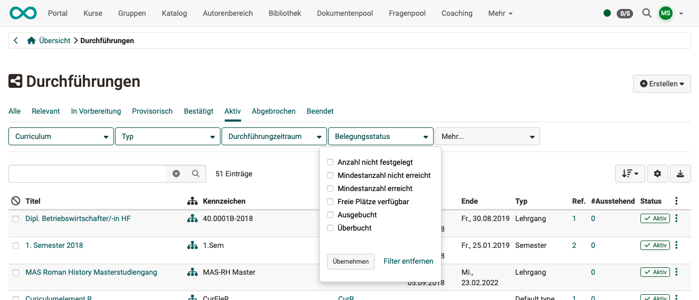{ class="shadow lightbox" }  

With **Save filter**, frequently used filter combinations can be saved and reused as your own preset. [:octicons-tag-16:{ title="from Release 20.3 (OO-9223)" }](https://track.frentix.com/issue/OO-9223){:target="_blank"}

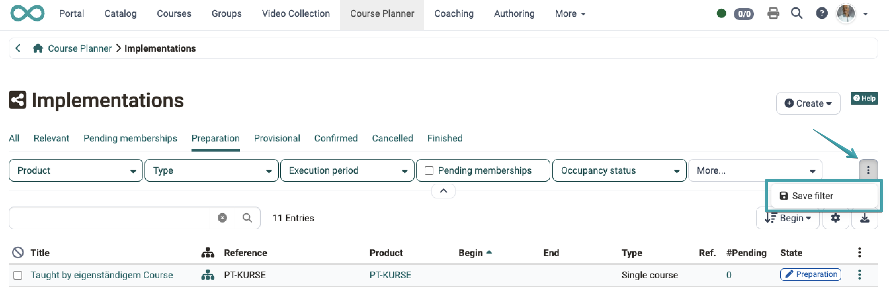{ class="shadow lightbox" }  

The individual column selector can also be used to show the **Subjects** and **Subject paths** columns, which are hidden by default (between the "Status" and "Calendar" columns). [:octicons-tag-16:{ title="from Release 20.3.1 (OO-9392)" }](https://track.frentix.com/issue/OO-9392){:target="_blank"}

!!! info "Important"
    The subjects are made available by the administration under Taxonomy.

[To the top of the page ^](#implementations)

---

## Navigation the implementations {: #navigation}

Once you have selected and opened an implementation in the list, the tabs shown allow you to make all settings for this implementation.

 click on the "**Go to**" button at the top right to jump to an element within the current implementation.

 use the **arrow buttons** at the top right to switch to other bushings.

 configure this implementation by clicking on the various **tabs**.

 click on one of the **headings** to jump directly to the corresponding tab.

 by clicking on the **+** add course content.

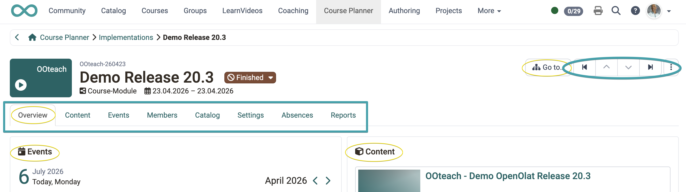{ class="shadow lightbox" }

[To the top of the page ^](#implementations)

---

### Tab Overview {: #tab_overview}

The "Overview" tab shows you the members, the next dates, the offers in the catalog and the course content for this product. This makes it easier for you to navigate the activities related to this implementation.

Use the **Show all** button in the **Events** widget [:octicons-tag-16:{ title="from Release 20.3 (OO-9244)" }](https://track.frentix.com/issue/OO-9244){:target="_blank"} to go directly to the Events tab.

The **Content** and **Catalog** widgets also show an icon in the title as well as the **Details** button [:octicons-tag-16:{ title="from Release 20.3 (OO-9244)" }](https://track.frentix.com/issue/OO-9244){:target="_blank"}, which takes you directly to the Content tab or the Catalog tab.

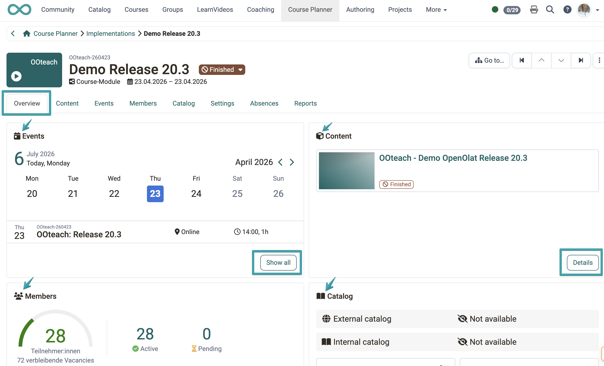{ class="shadow lightbox" }

[To the top of the page ^](#implementations)

---

### Tab Structure {: #tab_structure}

In the displayed tree structure, each individual element of the implementation can be edited or information about it can be queried.

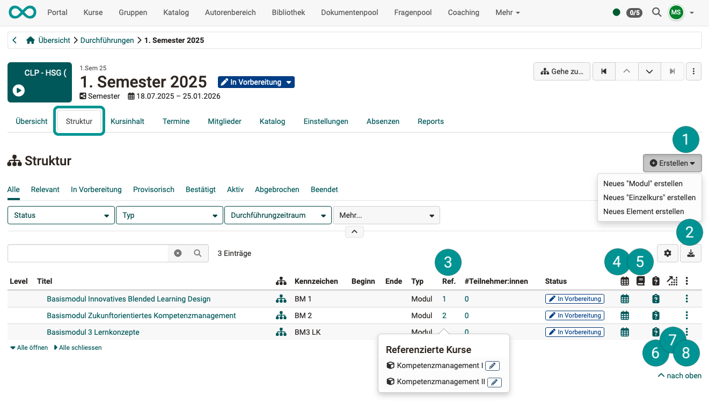{ class="shadow lightbox" }

 If you would like to add other elements for this implementation that deviate from the product structure ("copy template" of this structure), you will find the available element types as defined in the administration under the **Create** button.

 You can also download the displayed structure as an Excel file using the **Download button**.

 In the **References** column, you can display the content (courses) referenced in this element.

 In this column you will find the **Schedules** of the respective elements.

 In this column you will find the **Absences**. (Provided that absence management is activated.)

 If the "Quality management" module has been activated, you can jump to the assigned **data collection preview** for each element.

 The **Learning progress** column shows the average progress of all participants. All learning path courses for this element are taken into account. (Conventional courses do not provide any data on learning progress).

 Under the **3 points** you will find options for editing the elements.

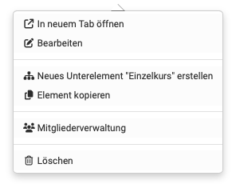{ class="shadow lightbox" }

#### Move an element [:octicons-tag-16:{ title="from Release 20.3 (OO-8841)" }](https://track.frentix.com/issue/OO-8841){:target="_blank"}

Use the **Move element** action under the **3 points** to open the move dialog. The element to be moved is highlighted in colour.

Every possible target position is displayed as a radio button. Positions that are not allowed (for example an incompatible element type) are greyed out and cannot be selected.

After selecting a target position, the following actions appear directly on the element:

* **Above**
* **Below**
* **Sub-element**

Click **Move element** to carry out the move.

[To the top of the page ^](#implementations)

---

### Tab Content {: #tab_content}

The list shows all courses belonging to this implementation.

If you want to add further courses for this implementation (deviating from the original structure), use the "**Add course**" button at the top right.

The option to **remove** an **individual course** from this implementation can be found under the 3 dots at the end of a line. 
To **remove several courses**, select the courses with the checkboxes in the first column. A Remove button will then be displayed above the list.

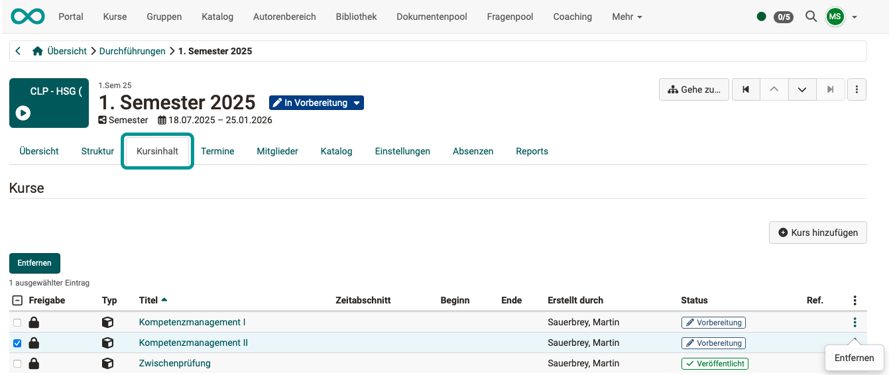{ class="shadow lightbox" }

 

**Course template as course content** 
If it corresponds to the selected implementation type (individual course required), it is also possible to add a course template that can be instantiated at a later date. This means that at the time of planning in the Course Planner, a course is only announced but not yet added. Only when the course is actually held, for example, because there are enough bookings, is the course added to the schedule (instantiated).

Using a template for instancing is recommended if it is a recurring course that is always the same.

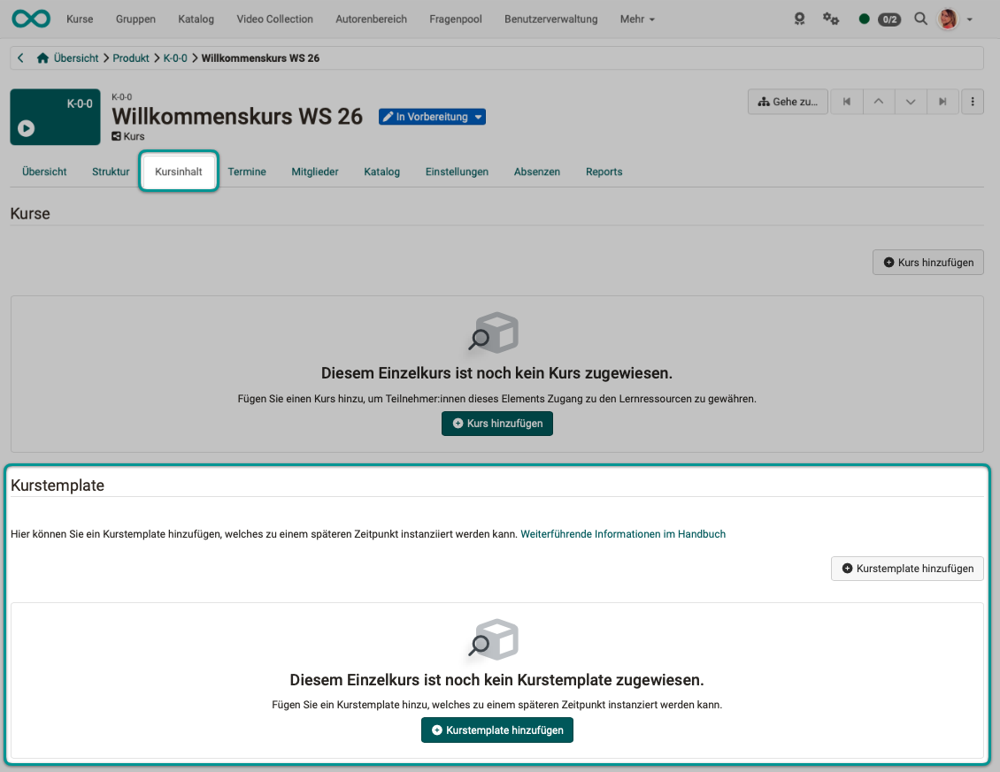{ class="shadow lightbox" }

The "Add course" and "Add course templates" buttons become inactive once the number of courses or templates corresponding to the selected delivery type has been added.

**Creation of course templates** 
Course templates are created by selecting the "Template" option in the course under **Administration > Settings > Shares > Intended use**. 
The templates for course content in Course Planner do not have independent member management, as members are added to Course Planner for each course run.

!!! info "Important"

    Templates are copied. If the template is changed later, the previously created copy remains unchanged.

[To the top of the page ^](#implementations)

---

### Tab events {: #tab_events}

- If there are many appointments, the **filters** above the table are useful for keeping an overview.
- The **"Add appointment"** button can be used to add new appointments to the currently selected event.
- A click on the **+** at the beginning of a line shows the **details** of this appointment.
- It is also possible to **import** appointments. To do this, click on the small arrow next to the "Add appointment" button.

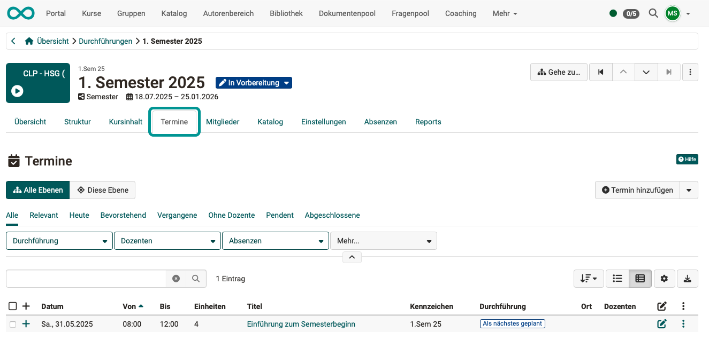{ class="shadow lightbox" }

[To the top of the page ^](#implementations)

---

### Tab members {: #tab_members}

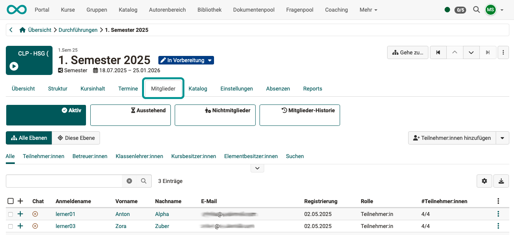{ class="shadow lightbox" }

As mentioned above, an educational product (consisting of one or more courses) can be carried out several times. Different participants take part in each course.

Participants are therefore made members of a specific implementation (not members of individual courses or an educational product). It can be determined whether they become members of the entire implementation or only of a sub-area.

If the participants were made members of the educational product (the "copy template"), they would be present as participants in all implementations of this product. This is not desirable. Therefore, only owners can be added to a product as members, not participants.

!!! info "Member administration in the Course Planner"
    Because member administration is carried out when using the Course Planner, there is the setting "Integration in curriculum/product" in the course settings:
    `(Course) Administration > Settings > Tab "Share" > Section "Use" > Button "Implementation in Curriculum/Product"`
**The course then no longer has *any* independent member administration** — member administration now takes place exclusively in the member administration of the implementation, **within the Course Planner**.

 

#### Tab members {: #add_members}
**Add members**

To add participants to an implementation as members, use the 
`Implementation > Tab members > the button Add participants`

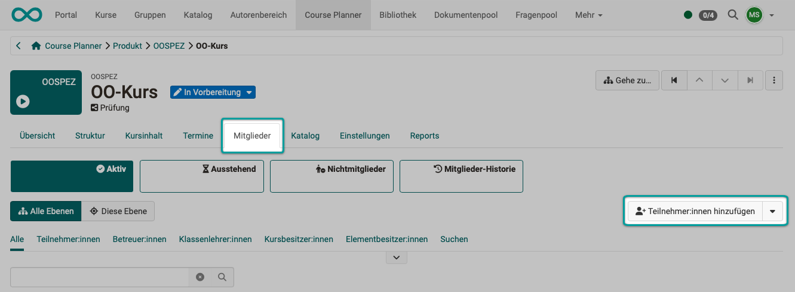{ class="shadow lightbox" }

 

#### Tab members > Invitation and membership requests [:octicons-tag-16:{ title="from Release 20.3 (OO-9156)" }](https://track.frentix.com/issue/OO-9156){:target="_blank"} {: #invitation_flow}

When participants are assigned to an implementation, they receive a system notification by email depending on the context:

- Assignment to a **course**: notification with a link to the course area
- Assignment to an **educational product**: notification with a link to the course area
- Assignment to a **group**: notification with a link to the group area

The notification box **"Accept membership requests"** appears in the course area, in the group area, and directly on the course or educational product info page. Participants can accept or decline the request there. Acceptance is possible equally at all three locations.

!!! info "Important"

    Whether confirmation by the invited persons is required depends on the reservation requirement configuration. Details on this can be found in the section on confirming membership below.

For administrators: [System-wide configuration of the invitation >](../../manual_admin/administration/Modules_Groups.md#data_privacy)

 

#### Tab members {: #confirm_membership}
**Confirmation of membership by line managers/education managers**

The Course Planner can be set up so that a booking request must be confirmed by an administrative role (e.g. a line manager or education manager). With this setting, users can book a course, but the manager must confirm or decline the booking in an intermediate step.

This approval step can also be set up for all offers, except when paying with Paypal (since payment/booking there is immediate).

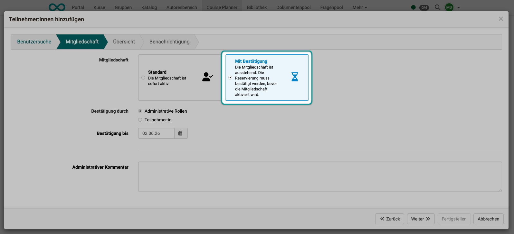{ class="shadow lightbox" }

[To the top of the page ^](#implementations)

---

### Tab Catalog {: #tab_catalog}

The various implementations can be offered in the catalog. To do this, an [offer](../../manual_user/area_modules/catalog2.0_angebote.md) must be created, as for every catalog entry.

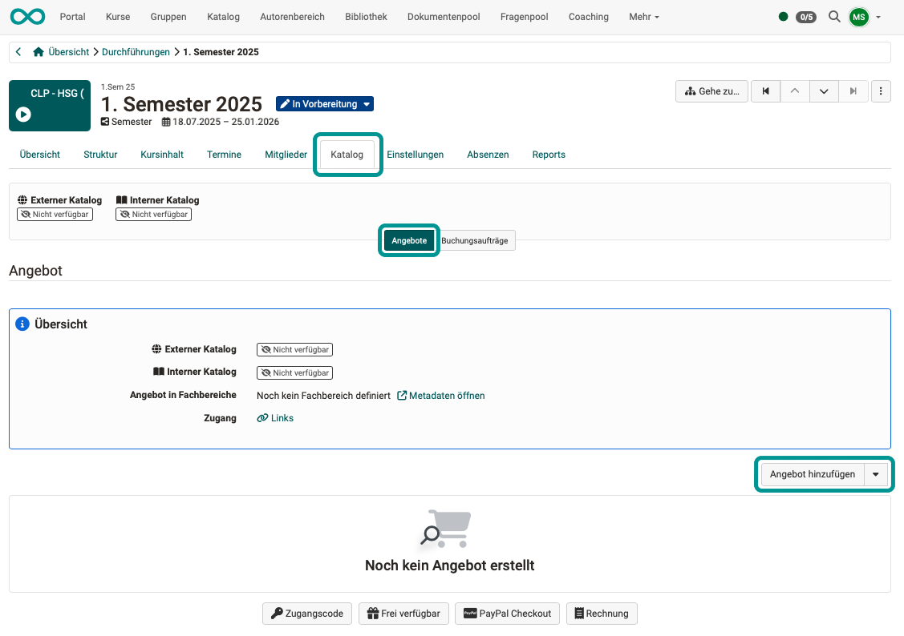{ class="shadow lightbox" }

To draw the attention of potential participants to an offer in the catalog, you can send a direct link to the offer, e.g. in an email. You will find the links in the overview of the offers (per event in the Catalog tab).

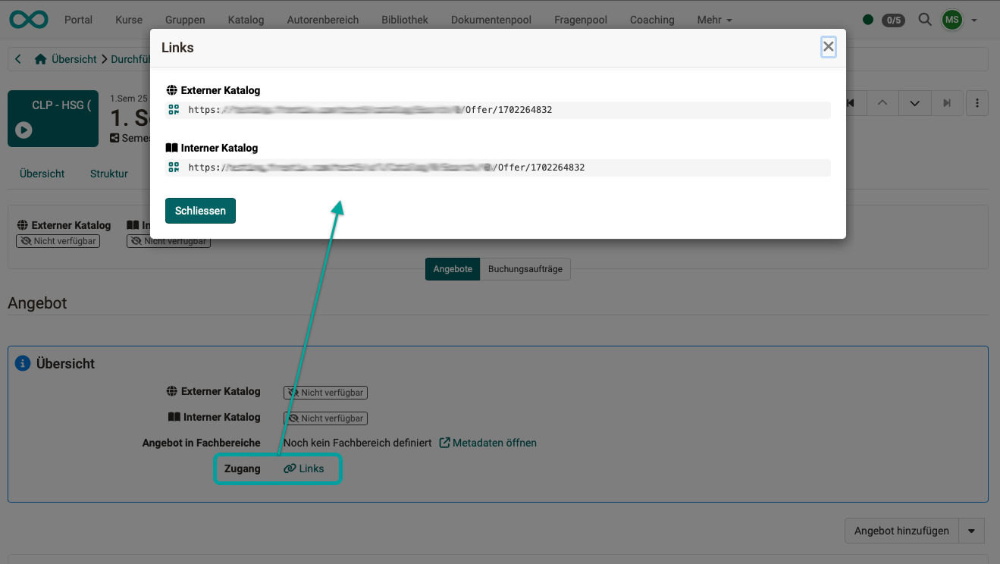{ class="shadow lightbox" }

If offers with booking options have been added to the catalog, the booking orders and their details can also be found under the "Catalog" tab in the "Booking orders" subsection.

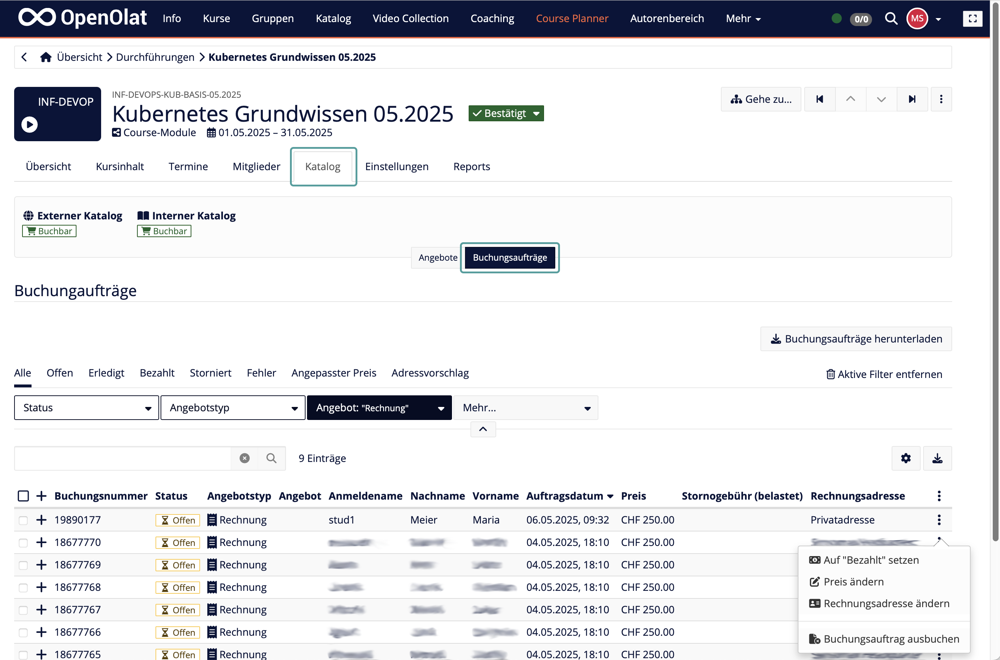{ class="shadow lightbox" }

[To the top of the page ^](#implementations)

---

### Tab Settings {: #tab_settings}

The many possible settings for an implementation can be found under several subordinate tabs. A preview info page is permanently available.

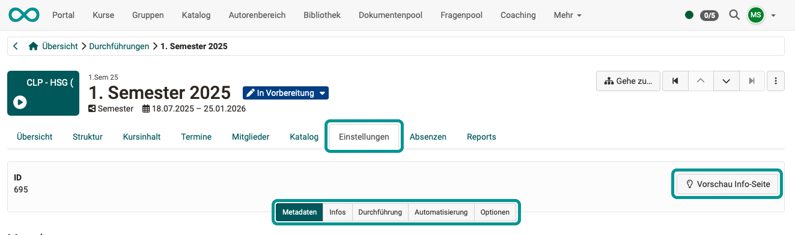{ class="shadow lightbox" }

#### Metadata of the settings

The metadata entered here is used to simplify search processes, for example.

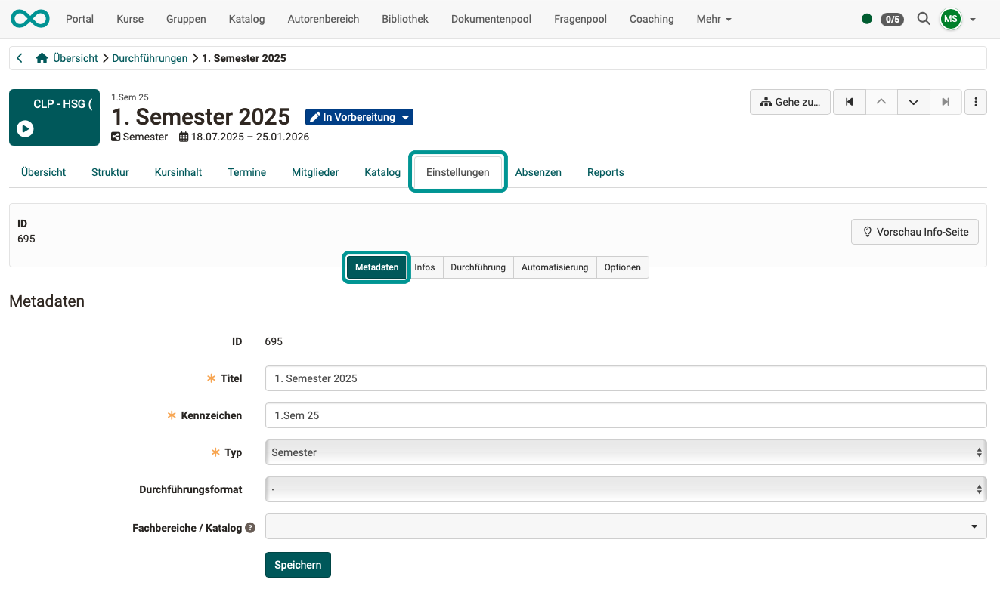{ class="shadow lightbox" }

#### Implementation in the settings

The implementation settings include the implementation period, the location and the number of participants.

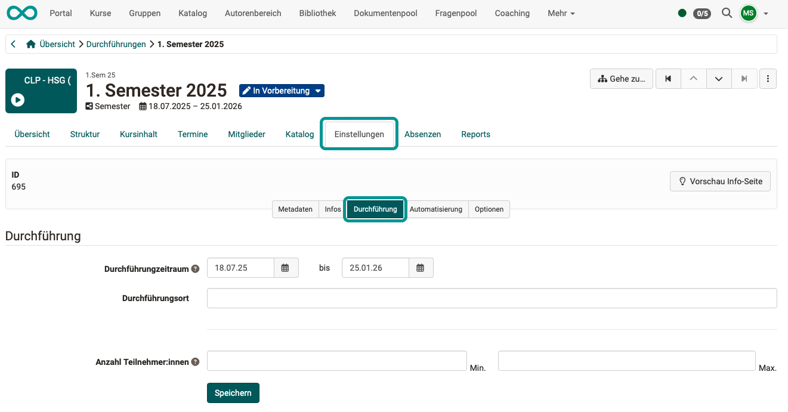{ class="shadow lightbox" }

#### Configure automation [:octicons-tag-16:{ title="from Release 21.0 (OO-9578)" }](https://track.frentix.com/issue/OO-9578){:target="_blank"} {: #tab_settings_automation}

In the **"Automation"** subsection of the settings tab, you define when courses are [instantiated](#tab_content) automatically and when status changes are triggered automatically.

If a course is to be used multiple times in exactly the same way, it can be created as a template. The courses are then created from the template for each implementation. [Instantiation](#tab_content) can take place automatically at a specific time and role-specifically, e.g. accessible to coaches a few days before an implementation starts. Until then, the template owners can still work on the template while the organizational planning in the Course Planner is already under way.

**Scope of the automation rules:**

Automation rules are defined at two levels:

* **Element type level** `Administration > Modules > Course Planner > Tab Element types`: The administrator defines default rules for each element type. These rules serve as a template for all elements of this type.
* **Element level** `Settings tab > Automation`: For each individual element, you decide whether the rules of the element type are adopted or overridden individually.

Two modes are available for each automation rule:

* **"Inherit from type"**: The element uses the default rules of the element type. If the administrator adjusts the template, this automatically affects all elements that use this mode.
* **"Override"**: The element uses deviating, individually configured rules, independent of the element type.

**Types of automation rules:**

| Type | Trigger |
|---|---|
| On status change | An action is triggered as soon as the implementation or element status reaches a certain value. |
| Time-controlled | An action is triggered relative to the start or end of the implementation period. |

[To the element types and automation rules (Admin) >](../../manual_admin/administration/Modules_Course_Planner.md#tab_element_types) 
[To the to-dos on CPL elements >](Course_Planner_Todos.md)

#### Assessment in the settings [:octicons-tag-16:{ title="from Release 21.0 (OO-9499)" }](https://track.frentix.com/issue/OO-9499){:target="_blank"} {: #tab_settings_assessment}

The sub-tab "Assessment" is displayed for implementations of type single course. Here you link the implementation directly to a certification program, without going through the program itself.

* Use the **"Certification program"** toggle to enable or disable the link.
* If no program is linked yet, use the **"Select"** action to choose a program. The "Select certification program" dialog shows title, Ext. ref., validity period, recertification and required credit points. Only programs you have access to are displayed.
* If a program is linked, a panel shows its validity period, recertification and required credit points. From there you open the program in a new tab (provided you have access to the program) or remove the link with **"Remove certification program"**. Removing requires the role Course planner or Product owner and must be confirmed. Participants who have already received a certificate remain members of the program.

An implementation can also be added directly via the [certification program](Course_Planner_Certification_Programs.md#config_tab_implementations).

When [copying an implementation](#copy), the link to the certification program is applied, provided you have permission for the program. If the permission is missing, the wizard shows the warning "The certification program cannot be applied due to a lack of permissions." Copying creates an entry in the program's activity log.

#### Options in the settings

Separate settings can be made here for each implementation:

- Calender configuration
- Schedule
- Absence configuration
- Absence management
- Progress configuration

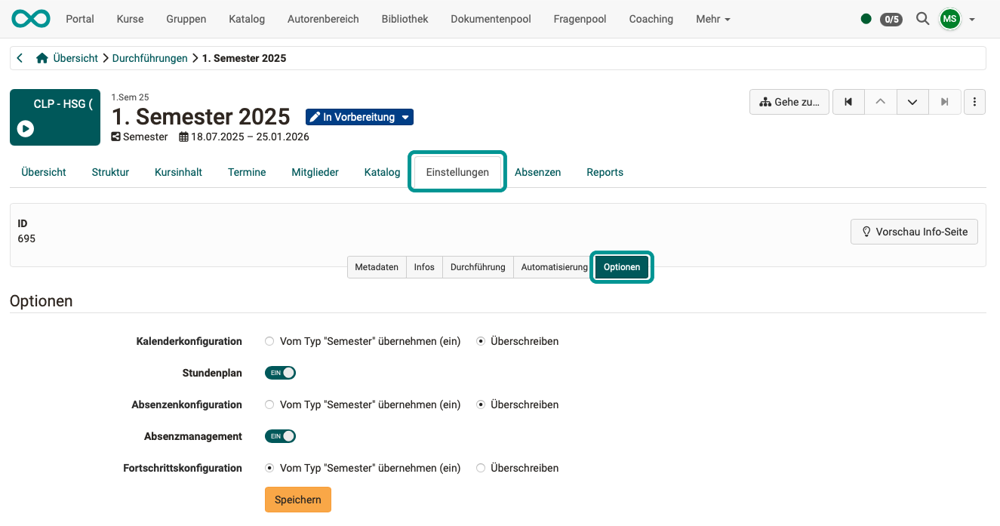{ class="shadow lightbox" }

[To the top of the page ^](#implementations)

---

### Tab Absences {: #tab_absences}

This tab only appears if absences have been activated on the element.

Activation takes place in the implementation settings: `Settings tab > Options > Absence configuration`.

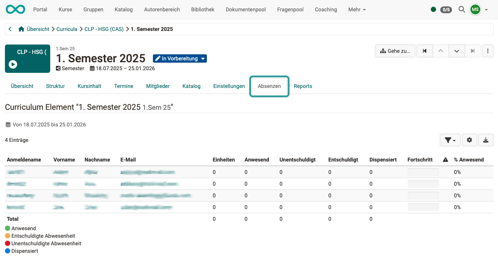{ class="shadow lightbox" }

[To the top of the page ^](#implementations)

---

### Tab Reports {: #tab_reports}

The reports that can be created here relate to the currently selected implementation.

In contrast, the report creation, which can be called up in the [Overview](../../manual_user/area_modules/Course_Planner_Reports.md), refers to **all** executions. 
The structure of the Excel files (columns) and the procedure for creating them is identical for both.

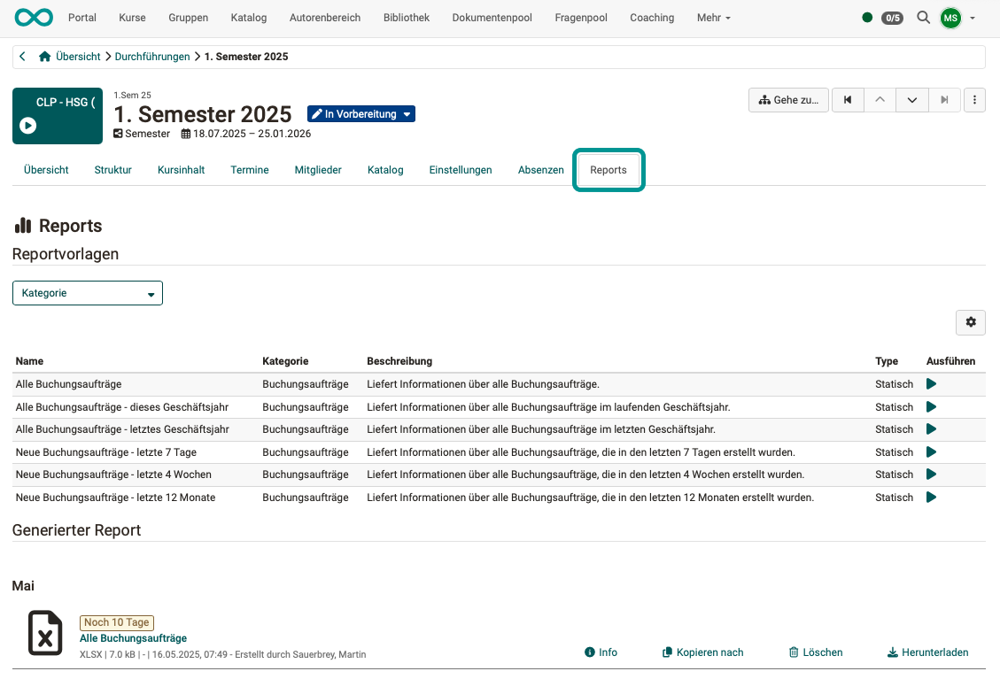{ class="shadow lightbox" }

Click on the **arrows in the "Execute"** column to generate Excel files with the current data using the listed templates.

You will then find the Excel files created in this way listed at the bottom of the screen. They can be copied and downloaded.

[To the top of the page ^](#implementations)

---

## Copy an implememtation {: #copy}

You will find the option to copy in the list of executions at the end of a line under the 3 dots.

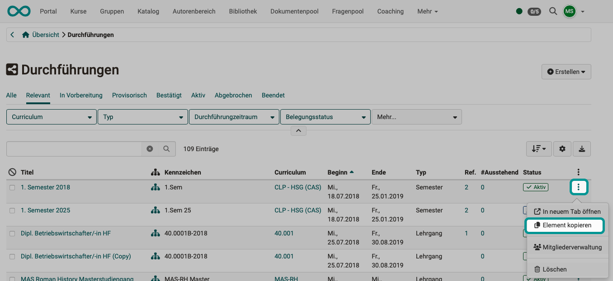{ class="shadow lightbox" } 

In the first step of the small wizard, you can select whether course content, dates, members and to-dos should also be copied.

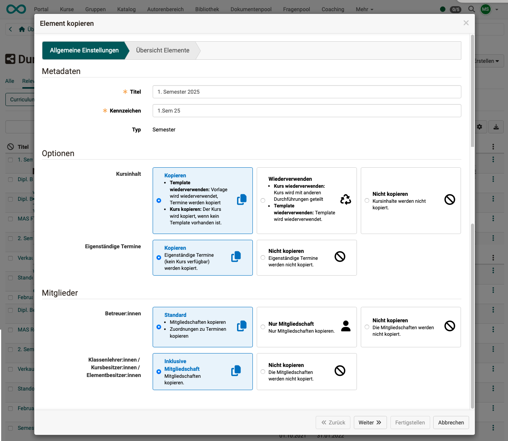{ class="shadow lightbox" }  

The second step of the wizard shows you an overview of the elements that will now be copied. 
You can still make adjustments here (especially to the dates). 
Click on the + in front of an element to display the courses and dates for the element.

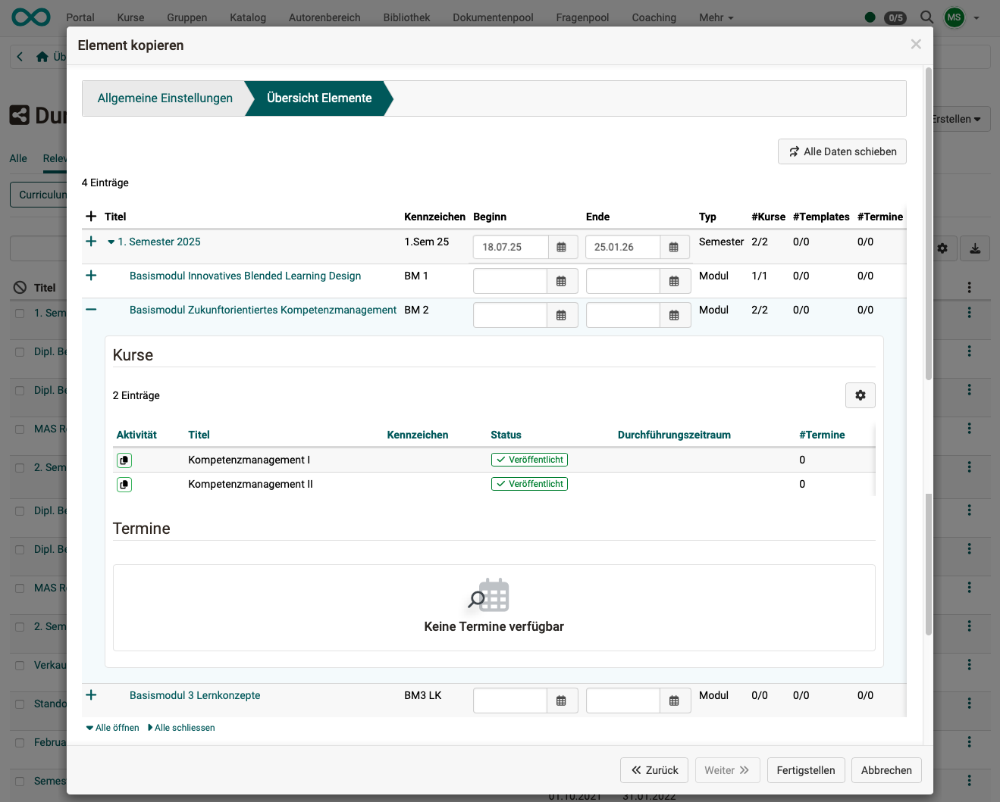{ class="shadow lightbox" }  

An implementation contains many different dates that are arranged in a specific order. When copying, all of this data can be automatically adjusted and moved together. To do this, use the **"Shift all dates"** button in the overview of the elements. The dialog shows the "Reference date (earliest)"; you either enter the shift in days ("Shift by") or directly the "New date".

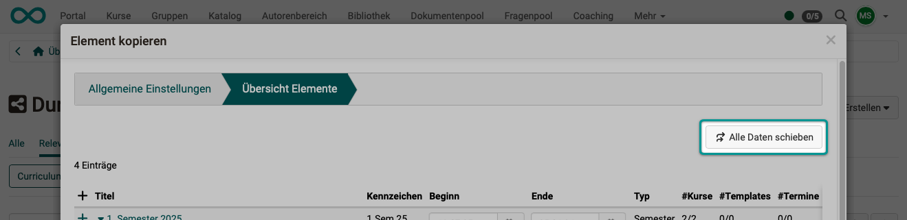{ class="shadow lightbox" }

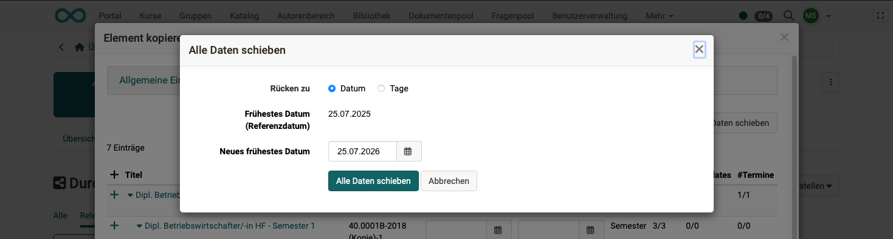{ class="shadow lightbox" } 

### Adopt to-dos when copying [:octicons-tag-16:{ title="from Release 21.0 (OO-9419)" }](https://track.frentix.com/issue/OO-9419){:target="_blank"} {: #copy_todos}

To-dos of an implementation are carried over when copying. In the first step of the wizard, the "To-dos" selection determines how this is done:

* **Standard:** Copy to-dos with assignments.
* **To-dos only:** Copy to-dos without assignments.
* **Don't copy:** To-dos are not copied.

In the overview of the elements, the **"#To-dos"** column shows how many to-dos an element contains. In the detail view of an element, the "To-dos" section lists all to-dos with title, priority, date input (absolute or relative), due date, status, assignment, delegation and tags. Use the checkbox at the start of a row to deselect individual to-dos from copying. If no to-dos exist, the note "No to-dos available." is shown.

[To the top of the page ^](#implementations)

---

## Delete an implementation {: #delete}

You will also find the option to delete in the list of executions at the end of a line under the 3 dots.

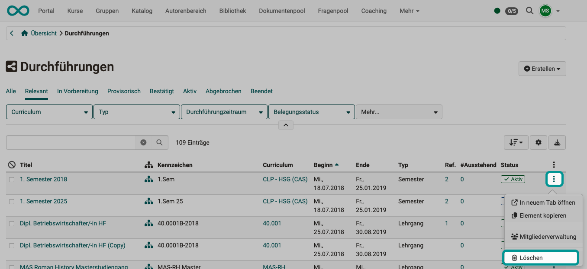{ class="shadow lightbox" }

If you have already displayed an execution, you will also find the option to delete it at the top right under the 3 dots.

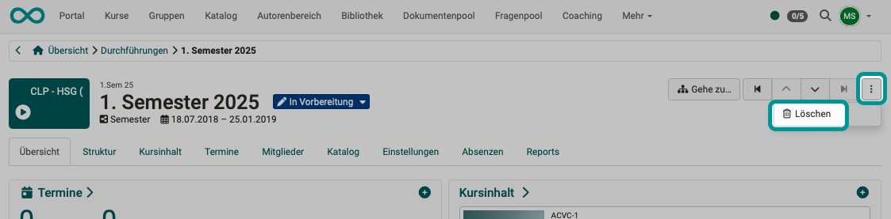{ class="shadow lightbox" } 

[To the top of the page ^](#implementations)

---

## Further information {: #further_information}

[How do I create my first OpenOlat course >](../../manual_how-to/my_first_course/my_first_course.md) 
[Course Planner: Overview >](../../manual_user/area_modules/Course_Planner.md) 
[Course Planner: Products >](../../manual_user/area_modules/Course_Planner_Products.md) 
[Course Planner: Events >](../../manual_user/area_modules/Course_Planner_Events.md) 
[Course Planner: Certification programs >](../../manual_user/area_modules/Course_Planner_Certification_Programs.md) 
[Course Planner: Reports >](../../manual_user/area_modules/Course_Planner_Reports.md) 
[How can I plan and run courses with the Course Planner? >](../../manual_how-to/course_planner_courses/course_planner_courses.md) 
[How can I plan and run a course with the Course Planner? >](../../manual_how-to/course_planner_curriculum/course_planner_curriculum.md) 
[Activate Course Planner (Admin) >](../../manual_admin/administration/Modules_Course_Planner.md) 
