# Course Planner: Implementations [:octicons-tag-16:{ title="from Release 20.0 (OO-7834)" }](https://track.frentix.com/issue/OO-7834){:target="_blank"} {: #implementations}

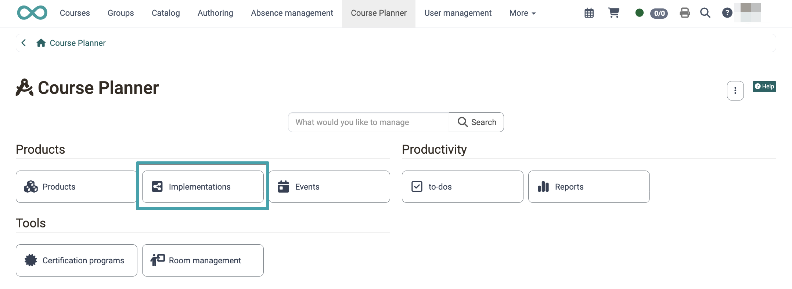{ class="shadow lightbox" title="Start page of the Course Planner" }

## What is an implementation? {: #definition}

An educational program/product (consisting of one or more courses) can be offered and carried out several times. Each implementation can take place on a different date and different participants are then present at each implementation.

In an educational program/product, one or more courses are assigned to each implementation. The courses used multiple times only exist once.

If a course is to be used multiple times and always stay exactly the same, it can also be created as a template. The courses are then instantiated for each implementation (created from the template). This instantiation can also take place automatically on a specific date, for example a few days before an implementation starts. Until then, the template owners can still work on finalizing the template courses. The organizational aspects of the implementation (date, catalog offer and so on) can already be prepared with the Course Planner.

From this conceptual idea, the same courses are generally assigned and used in each implementation. However, it is also possible in OpenOlat to adapt the content in each implementation.

[To the top of the page ^](#implementations)

---

## The list of implementations {: #listing}

If you have selected the "Implementations" button in the Course Planner overview, you are taken to a list of the implementations of all products. The "Product" column shows which product an implementation belongs to.

The list opens with the "Relevant" tab. The "Pending memberships" tab shows the implementations with pending memberships, the tabs "Preparation", "Provisional", "Confirmed", "Cancelled" and "Finished" one status each and the "All" tab the whole list. Use filters such as "Product", "Type", "Execution period" or "Occupancy status" to narrow down the selection further.

Administrators and course planners, as well as product owners in their own products, can create, edit and delete implementations. Principals only see the implementations read-only. The complete overview is shown in the [rights matrix](Course_Planner.md#rights_matrix) of the Course Planner.

Depending on your rights, the menu of the 3 dots at the end of a row offers actions such as **Copy element**, **Members management**, **Export** and **Delete**. How the export works is described in [Course Planner: Import / Export](Course_Planner_Import_Export.md#export_entry_points).

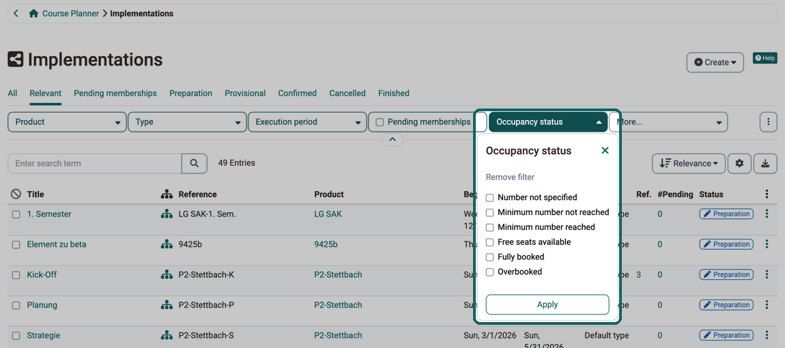{ class="shadow lightbox" title="Implementations page in the Course Planner · 2026.09.30" }

With **Save filter**, frequently used filter combinations can be saved and reused as your own preset. [:octicons-tag-16:{ title="from Release 20.3 (OO-9223)" }](https://track.frentix.com/issue/OO-9223){:target="_blank"}

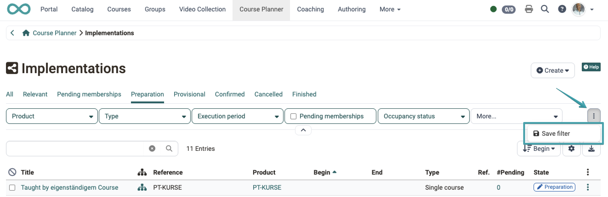{ class="shadow lightbox" title="Implementations page in the Course Planner" }

"Displayed columns" can also be used to show the **Subjects** and **Subject paths** columns, which are hidden by default (between the "Status" and "Calendar" columns). The subjects themselves are maintained in the system administration, under `Administration > Modules > Taxonomy`. [:octicons-tag-16:{ title="from Release 20.3.1 (OO-9392)" }](https://track.frentix.com/issue/OO-9392){:target="_blank"}

### Bulk action "Change type" [:octicons-tag-16:{ title="from Release 21.0 (OO-9583)" }](https://track.frentix.com/issue/OO-9583){:target="_blank"} {: #change_type}

By activating the checkbox in the first column you select several implementations. The action **"Change type"** then appears above the table, next to the bulk actions **"Create to-dos"**, **"Export"** and **"Delete"**. In the dialog you choose the new element type and confirm with **"Change type"**. Only types that fit the selected elements are offered.

The same action is available in the search of the Course Planner and in the "Structure" tab of an implementation.

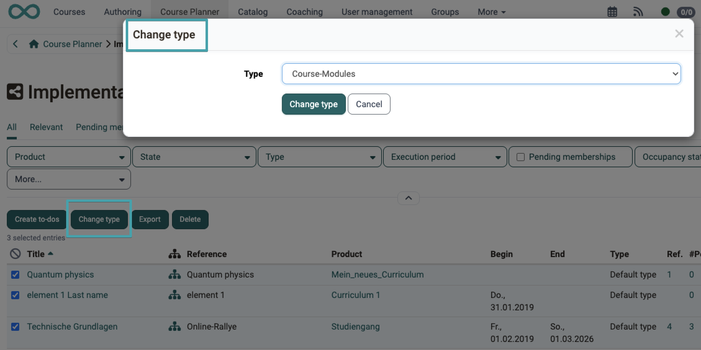{ class="shadow lightbox" title="Change type dialog on the Implementations page" }

[To the top of the page ^](#implementations)

---

## Navigation in the implementations [:octicons-tag-16:{ title="from Release 20.0 (OO-8128)" }](https://track.frentix.com/issue/OO-8128){:target="_blank"} {: #navigation}

Once you have selected and opened an implementation in the list, the tabs shown allow you to make all settings for this implementation:

- click on the "**Go to…**" button at the top right to jump to an element within the current implementation.

- use the four buttons with arrows at the top right to switch: the two outer ones lead to the previous or next implementation, the two inner ones to the previous or next element within the implementation. When you point at an arrow, its label appears, for example "Next implementation" or "Next element".

- configure this implementation by clicking on the various **tabs**.

- click on one of the **headings** to jump directly to the corresponding tab.

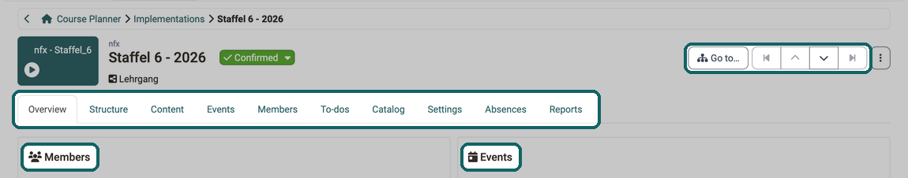{ class="shadow lightbox" title="Header of an opened implementation · 2026.10.02" }

[To the top of the page ^](#implementations)

---

### Tab Overview [:octicons-tag-16:{ title="from Release 20.2 (OO-8953)" }](https://track.frentix.com/issue/OO-8953){:target="_blank"} {: #tab_overview}

When you open an implementation, the "Overview" tab shows you at a glance how things stand with the members, events, course content, to-dos and catalog offers of this implementation. From every widget you go directly to the corresponding tab.

The **Events** widget only appears if the module **Events and absences** is active system-wide, switched on in the system administration under `Administration > Modules > Events / Absences`. The **Catalog** widget only appears at the top level of an implementation, not for its subordinate elements, and only if the catalog is switched on.

How an overview page is structured and how you arrange the tiles is described centrally: [Overview pages and widgets >](../basic_concepts/Dashboard_Concept.md)

The **Content** and **Catalog** widgets offer the **Details** button [:octicons-tag-16:{ title="from Release 20.3 (OO-9244)" }](https://track.frentix.com/issue/OO-9244){:target="_blank"}, which takes you directly to the Content tab or the Catalog tab.

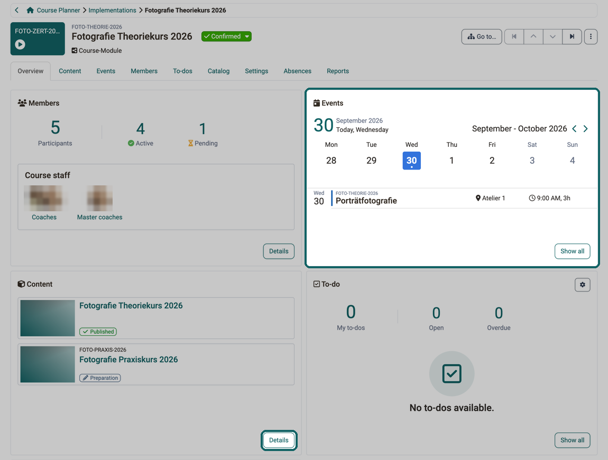{ class="shadow lightbox" title="Overview tab of an implementation · 2026.09.30" }

#### Events widget [:octicons-tag-16:{ title="from Release 20.3 (OO-8865)" }](https://track.frentix.com/issue/OO-8865){:target="_blank"} {: #widget_events}

The widget **Events** shows the events of the current week from the selected day onwards, from today when it opens, limited to this implementation and its subordinate elements. It only appears if the module **Events and absences** is active system-wide.

The week bar runs from Monday to Sunday, a dot below the day figure marks the days with events. A click on a day sets the starting point of the list, a click on a row opens the event. If no event is left until Sunday, the note **"No events until the end of the week"** appears with the buttons **"Previous event"** and **"Next event"**. You find the complete description of the widget under [Course Planner: Dashboard](Course_Planner_Dashboard.md#widget_events).

Use the button **"Show all"** to go directly to the tab **Events** of this implementation.

#### Member widget [:octicons-tag-16:{ title="from Release 20.3.0 (OO-9243)" }](https://track.frentix.com/issue/OO-9243){:target="_blank"} {: #widget_members}

The **Members** widget shows the **"Participants"** key figure of this implementation, broken down into **"Active"** and **"Pending"**. If no course staff has been added yet, the widget shows the note "No course staff yet." Use the **"Details"** button to go directly to the Members tab of this implementation. [:octicons-tag-16:{ title="from Release 21.0 (OO-9405)" }](https://track.frentix.com/issue/OO-9405){:target="_blank"}

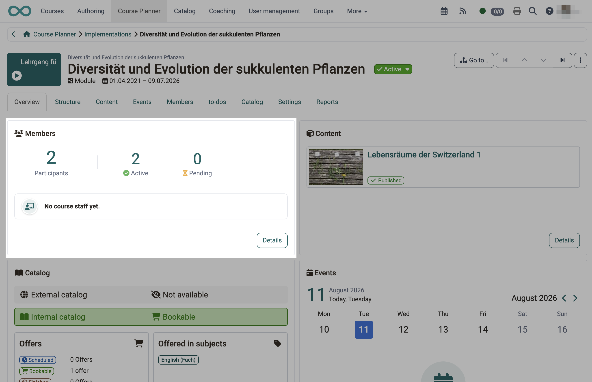{ class="shadow lightbox" title="Members widget in the Overview tab of an implementation" }

If course staff has been added, they appear instead of the note, with their role (e.g. coaches, master coaches, course owners, element owners).

If a maximum or minimum number of participants is defined, an additional note text supplements the "Participants" key figure:

* If a maximum is set: **"\<number\> seats left"**
* If a minimum is set: **"\<number\> to minimum"**
* For fully booked or overbooked implementations, the corresponding message appears.

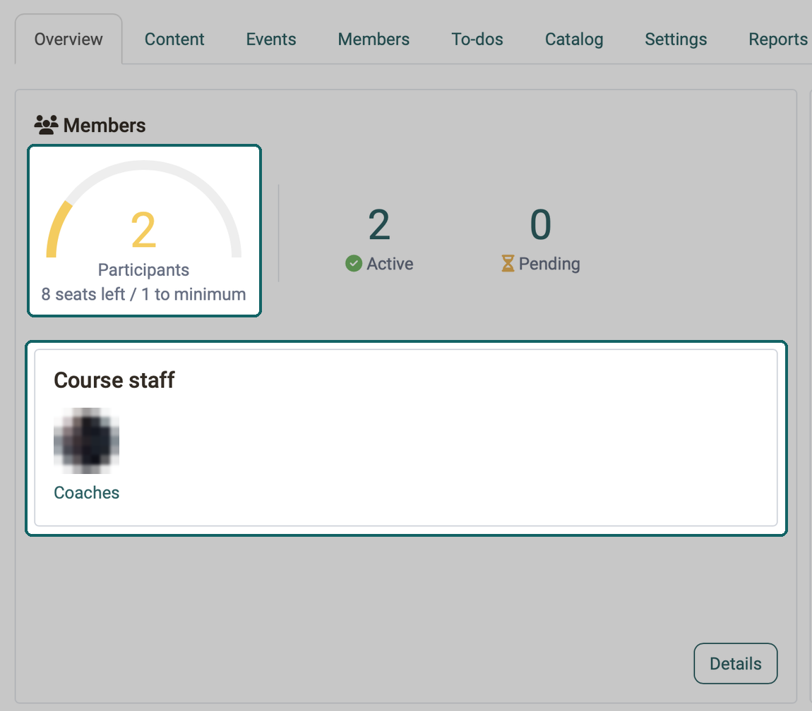{ class="shadow lightbox" title="Members widget in the Overview tab · 2026.10.02" }

#### To-do widget [:octicons-tag-16:{ title="from Release 21.0 (OO-9422)" }](https://track.frentix.com/issue/OO-9422){:target="_blank"} {: #widget_todos}

The **To-do** widget shows you which tasks are pending in this implementation. The key figures **My to-dos**, **Open** and **Overdue** each lead to the matching view of the to-dos. Use the **"Show all"** button to go to the ["To-dos" tab](Course_Planner_Todos.md#element_tab_todos) of this implementation.

[To the top of the page ^](#implementations)

---

### Tab Structure [:octicons-tag-16:{ title="from Release 20.0 (OO-8634)" }](https://track.frentix.com/issue/OO-8634){:target="_blank"} {: #tab_structure}

The "Structure" tab is shown for a structured implementation (the type is selected when a new implementation is created). In the displayed tree structure, each individual element of the implementation can be edited or information about it can be queried.

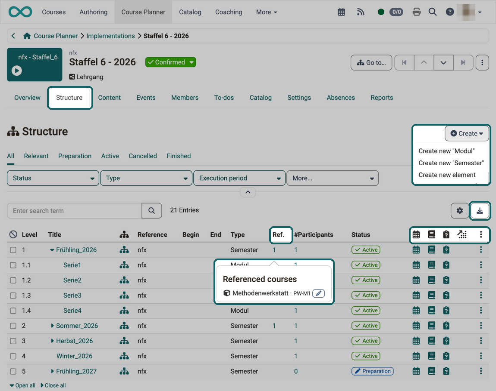{ class="shadow lightbox" title="Structure tab of an implementation · 2026.09.28" }

Tabs by status and filters such as "Status", "Type" and "Execution period" narrow down the elements. With "Open all" and "Close all" below the table you expand or collapse the whole tree structure.

The table in the "Structure" tab offers the following functions:

- **Create**: If you would like to add other elements for this implementation that deviate from the product structure ("copy template" of this structure), you will find the available element types under the **Create** button, as they were defined in the system administration under `Administration > Modules > Course Planner > Tab Element types`.
- **Download**: You can also download the displayed structure as an Excel file using the download button.
- **Ref.**: In this column, you can display the content referenced in this element; the detail area is called "Referenced courses".
- **Schedules**: In the column with the calendar icon you will find the schedules of the respective elements.
- **Absences**: In the next column you will find the absences, provided that **Absences** is switched on for the element, directly in the options of the settings or via the element type.
- **Data collection preview**: If the module "Quality management" and the "Data collections previews" are switched on in the system administration, you can jump to the assigned data collection preview for each element. You find both under: `Administration > Modules > Quality management`.
- **Learning progress**: This column shows the average progress of all participants. All learning path courses for this element are taken into account. Conventional courses do not provide any data on learning progress.
- **3 dots**: At the end of the row you will find the actions on an element: **Open in a new Tab**, **Edit**, **Move element**, an entry for creating a sub-element, labelled with the element type (for example **Create new sub-element "Modul"**), **Copy element**, **Members management** and **Delete**.

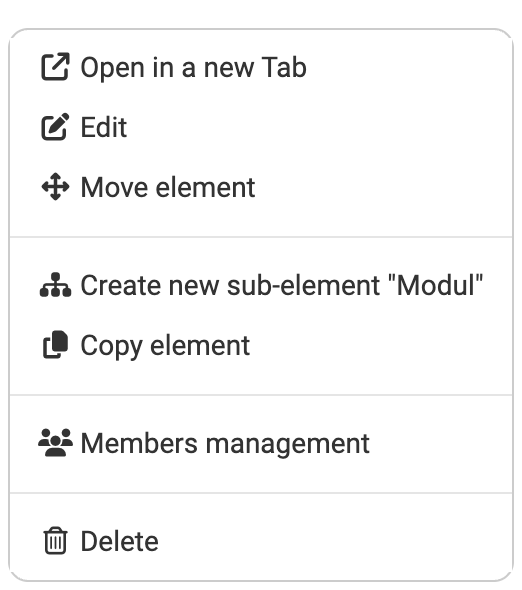{ class="shadow lightbox" title="Menu of the 3 dots in the Structure tab" }

#### Move an element [:octicons-tag-16:{ title="from Release 20.3 (OO-8841)" }](https://track.frentix.com/issue/OO-8841){:target="_blank"}

Use the **Move element** action under the **3 points** to open the move dialog. The element to be moved is highlighted in colour together with its sub-elements; these rows cannot be chosen as a target.

Every possible target position is displayed as a radio button. Positions that are not allowed (for example an incompatible element type) are greyed out and cannot be selected.

After selecting a target position, the following actions appear directly on the element:

* **Above**
* **Below**
* **Sub-element**

Click **Move element** to carry out the move.

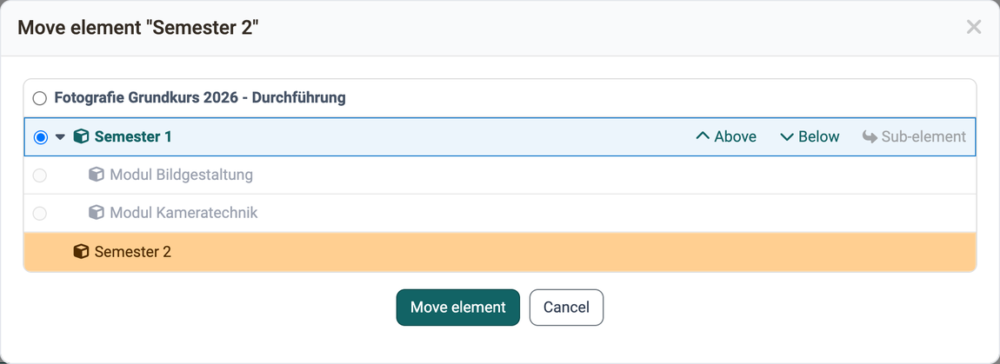{ class="shadow lightbox" title="Move element dialog" }

[To the top of the page ^](#implementations)

---

### Tab Content {: #tab_content}

The list shows all courses belonging to this implementation with the columns "Type", "Title", "Creator" and "Status", depending on the configuration also "Time period". The "Ref." column gives the number of events of a course; a click on the number lists the events.

If you want to add further courses for this implementation (deviating from the original structure), use the "**Add course**" button at the top right.

If it is the first course of the implementation, OpenOlat assigns the existing events of the implementation to this course and reports "The course has been successfully added and the existing events have been assigned to the course." In the process, OpenOlat switches on the Event & absence management in the course if it is still switched off.

The option to **remove** an **individual course** from this implementation can be found under the 3 dots at the end of a line. 
To **remove several courses**, select the courses with the checkboxes in the first column. The buttons "Change status" and "Remove" then appear above the list.

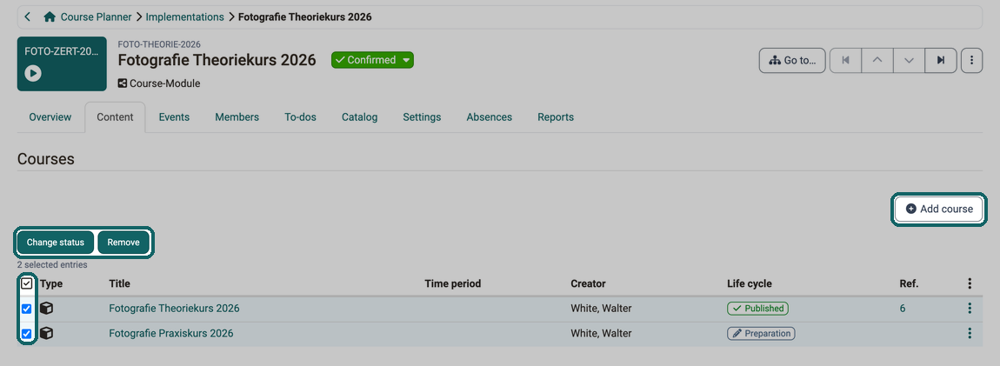{ class="shadow lightbox" title="Content tab of an implementation · 2026.09.30" }

 

**Automatically controlled course content** 
If automation rules control the content of this implementation, the "Automation overview" section appears above the list. Only active rules that concern the content are listed. For each rule you see the type of rule, either "Instantiation" or the target status, plus the date of the planned execution and the condition that triggers the execution. Use the "Settings" link to switch directly to the [automation configuration](#tab_settings_automation).

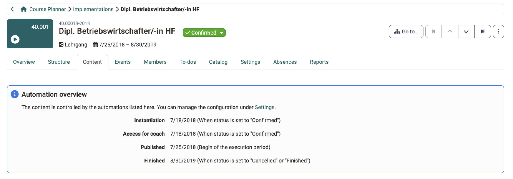{ class="shadow lightbox" title="Content tab of an implementation" }

 

**Course template as course content** 
If it corresponds to the selected implementation type (Single course required), it is also possible to add a course template that can be instantiated at a later date. This means that at the time of planning in the Course Planner, a course is only announced but not yet added. Only when the course is actually held, for example, because there are enough bookings, is the course added to the implementation (instantiated).

Using a template for instantiation is recommended if it is a recurring course that is always the same.

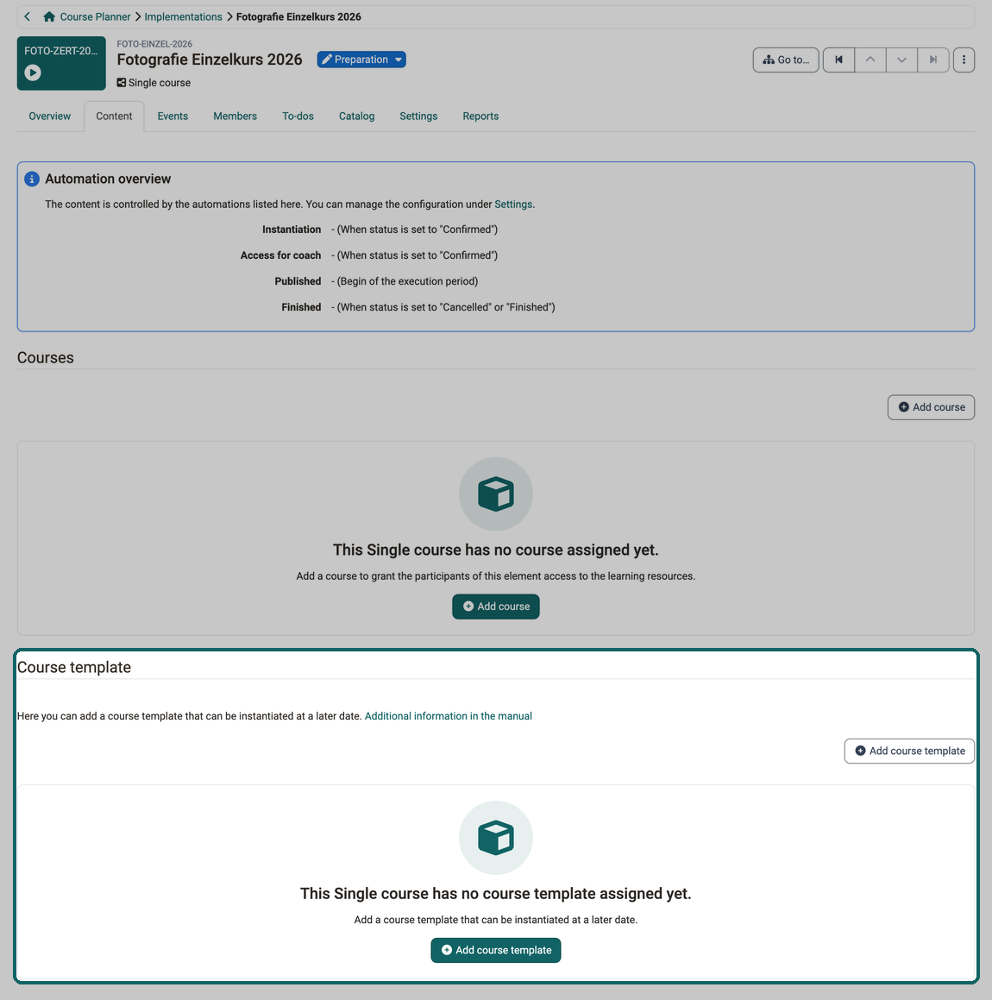{ class="shadow lightbox" title="Content tab of an implementation · 2026.09.30" }

The "Add course" and "Add course template" buttons become inactive once the number of courses or templates corresponding to the selected implementation type has been added.

**Creation of course templates** 
Course templates are created by selecting the "Template" option in the course under `Course > Administration > Settings > Share > Usage`. The templates for course content in Course Planner do not have independent member management, as members are added in the Course Planner for each implementation.

!!! info "Important"

    Templates are copied. If the template is changed later, the previously created copy remains unchanged.

[To the top of the page ^](#implementations)

---

### Tab Events [:octicons-tag-16:{ title="from Release 20.0 (OO-8064)" }](https://track.frentix.com/issue/OO-8064){:target="_blank"} {: #tab_events}

- If there are many events, the tabs "All", "Relevant", "Today", "Upcoming", "Past", "Without teachers", "Pending" and "Closed" as well as the **filters** above the table help you keep an overview.
- If the element type of the implementation can contain sub-elements, choose **"All levels"** to include the events of the subordinate elements, or **"This level"** for the events of this element only.
- At the top right of the table you switch between table view and timeline.
- The **"Add event"** button can be used to add new events to the currently selected implementation.
- A click on the **+** at the beginning of a line shows the **details** of this event.
- It is also possible to **import** events. To do this, click on the small arrow next to the "Add event" button.

If an event is assigned to a course, OpenOlat switches on the Event & absence management in the course if it is still switched off. Course owners then find the event in the course in the "Events and Absences" menu of the course administration, coaches in the "Events" tool of the course toolbar. When OpenOlat does not switch the function on itself is described in [Course Settings - Tab Execution](../learningresources/Course_Settings_Execution.md#lecture_enabled). [:octicons-tag-16:{ title="from Release 21.1.0 (OO-9711)" }](https://track.frentix.com/issue/OO-9711){:target="_blank"}

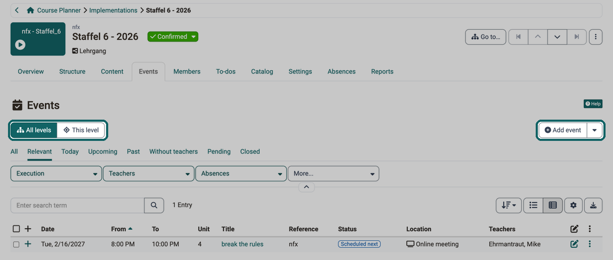{ class="shadow lightbox" title="Events tab · 2026.09.30" }

[To the top of the page ^](#implementations)

---

### Tab Members [:octicons-tag-16:{ title="from Release 20.3 (OO-8514)" }](https://track.frentix.com/issue/OO-8514){:target="_blank"} {: #tab_members}

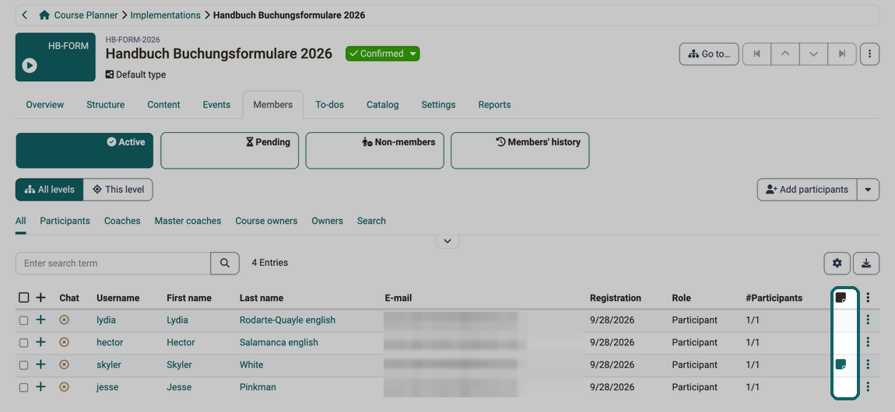{ class="shadow lightbox" title="Members tab · 2026.09.30" }

As mentioned above, an educational product (consisting of one or more courses) can be carried out several times. Different participants take part in each implementation.

Participants are therefore made members of a specific implementation (not members of individual courses or an educational product). It can be determined whether they become members of the entire implementation or only of a sub-area.

In the member list, a note icon in the **"Participant comment"** column shows whether the participant has attached a comment to the booking; the column header also shows only the icon. A click on it opens the comment. The booking orders table in the Catalog tab lists the same information in the **"Participant comment"** column [:octicons-tag-16:{ title="from Release 21.1.0 (OO-9484)" }](https://track.frentix.com/issue/OO-9484){:target="_blank"}.

The member list also shows you under which number the accounting keeps a person. The **"Customer number"** column is hidden by default; you show it via "Displayed columns". The column only shows values if the [customer number](../../manual_admin/administration/Modules_Organisations.md#customer_number) is switched on in the Organisations module. If a customer number is recorded for a person, the details of their membership also show the number. [:octicons-tag-16:{ title="from Release 21.1 (OO-9736)" }](https://track.frentix.com/issue/OO-9736){:target="_blank"}

To see what a person entered when booking, open the details of their membership in the member list. If the person booked an offer with [booking order forms](#booking_order_forms), the detail view shows the section **Booking order forms** below the booking orders. The table lists title, reference, step name, booking order, status and submission date for each form. **View form** opens the answers, **Edit form** lets you correct them as long as the form has the status "Open" or "Completed".

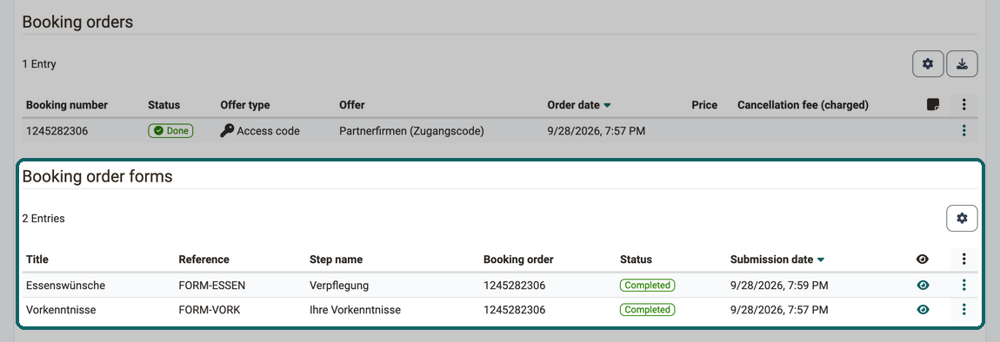{ class="shadow lightbox" title="Detail view of a membership in the Members tab · 2026.09.28" }

If the participants were made members of the educational product (the "copy template"), they would be present as participants in all implementations of this product. This is not desirable. Therefore, only owners can be added to a product as members, not participants.

!!! info "Member administration in the Course Planner"
    Because member administration is carried out in the implementation when using the Course Planner, the course settings offer the usage "Use in Course Planner": 
    `Course > Administration > Settings > Tab Share > Section Usage`

**The course then no longer has *any* independent member administration**: member administration now takes place exclusively in the member administration of the implementation, **within the Course Planner**.

 

#### Tab Members > Add members {: #add_members}

To add participants to an implementation as members, use: 
`Course Planner > Implementations > "your implementation" > Tab Members > Button "Add participants"`

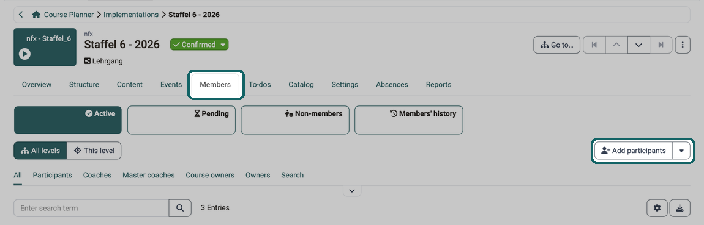{ class="shadow lightbox" title="Members tab of an implementation · 2026.10.02" }

The wizard leads through the steps **User search**, **Booking order**, **Membership**, **Overview** and **Notification**. The **Booking order** step only exists if the implementation has offers.

In the **Booking order** step, you choose the offer through which the participants are added. If this offer uses forms, a separate step follows for each form, labelled with its step name. These steps are located between the steps **Booking order** and **Membership** and appear as soon as you leave the **Booking order** step with **Next**. You fill in the forms once, and OpenOlat saves the answers for each selected person with their own booking order. The option **Without booking order** only appears if the implementation is set to [Allowed without booking order](#tab_catalog_settings) in the Catalog tab. With this option, no booking order is created, and no steps for forms follow.

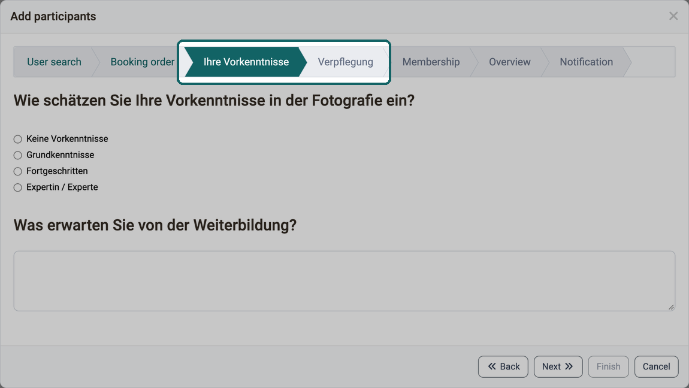{ class="shadow lightbox" title="Step of a form in the Add participants wizard · 2026.10.02" }

 

#### Tab Members > Invitation and membership requests [:octicons-tag-16:{ title="from Release 20.3 (OO-9156)" }](https://track.frentix.com/issue/OO-9156){:target="_blank"} {: #invitation_flow}

When participants are assigned to an implementation, they receive a system notification by email depending on the context:

- Assignment to a **course**: notification with a link to the course area
- Assignment to an **educational product**: notification with a link to the course area
- Assignment to a **group**: notification with a link to the group area

The notification box **"Accept membership requests"** appears in the course area, in the group area, and directly on the course or educational product info page. Participants can accept or decline the request there. Acceptance is possible equally at all three locations.

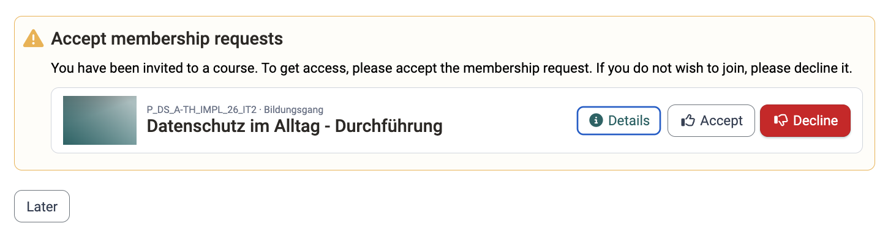{ class="shadow lightbox" title="Course area of an invited person" }

!!! info "Important"

    Whether confirmation by the invited persons is required depends on the reservation requirement configuration. Details on this can be found in the section on confirming membership below.

For administrators: [System-wide configuration of the invitation >](../../manual_admin/administration/Modules_Groups.md#accept_membership)

 

#### Tab Members > Confirmation of membership by line managers/education managers {: #confirm_membership}

The Course Planner can be set up so that a booking request must be confirmed by an administrative role (e.g. a line manager or education manager). With this setting, users can book a course, but the manager must confirm or decline the booking in an intermediate step.

This approval step can also be set up for all offers, except when paying with Paypal (since payment/booking there is immediate).

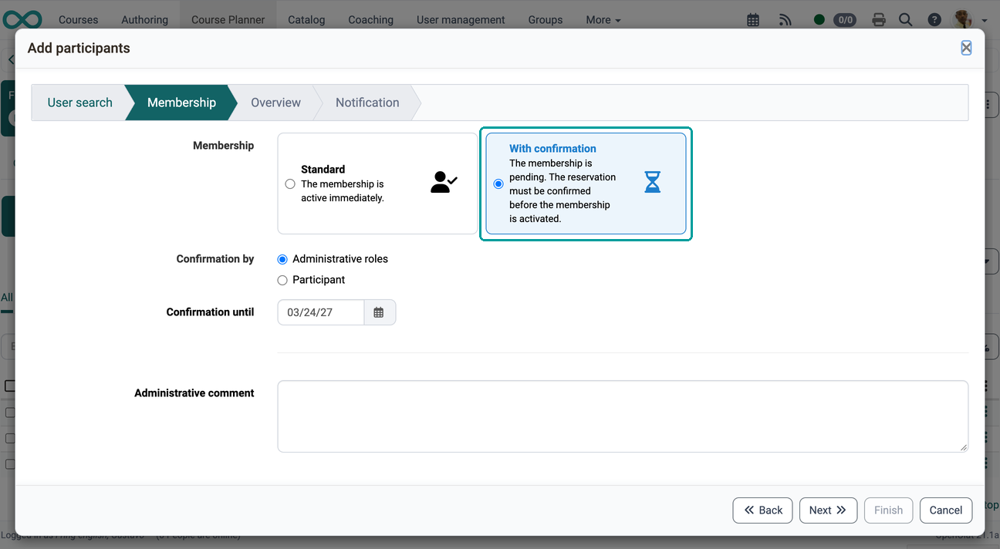{ class="shadow lightbox" title="Membership step of the Add participants wizard" }

[To the top of the page ^](#implementations)

---

### Tab Catalog [:octicons-tag-16:{ title="from Release 20.0 (OO-8236)" }](https://track.frentix.com/issue/OO-8236){:target="_blank"} {: #tab_catalog}

The various implementations can be offered in the catalog. To do this, an [offer](../../manual_user/area_modules/catalog2.0_angebote.md) must be created, as for every catalog entry.

The "Offers" subsection shows, from top to bottom, the overview, the settings, the offers with the **Add offer** button and the booking order forms.

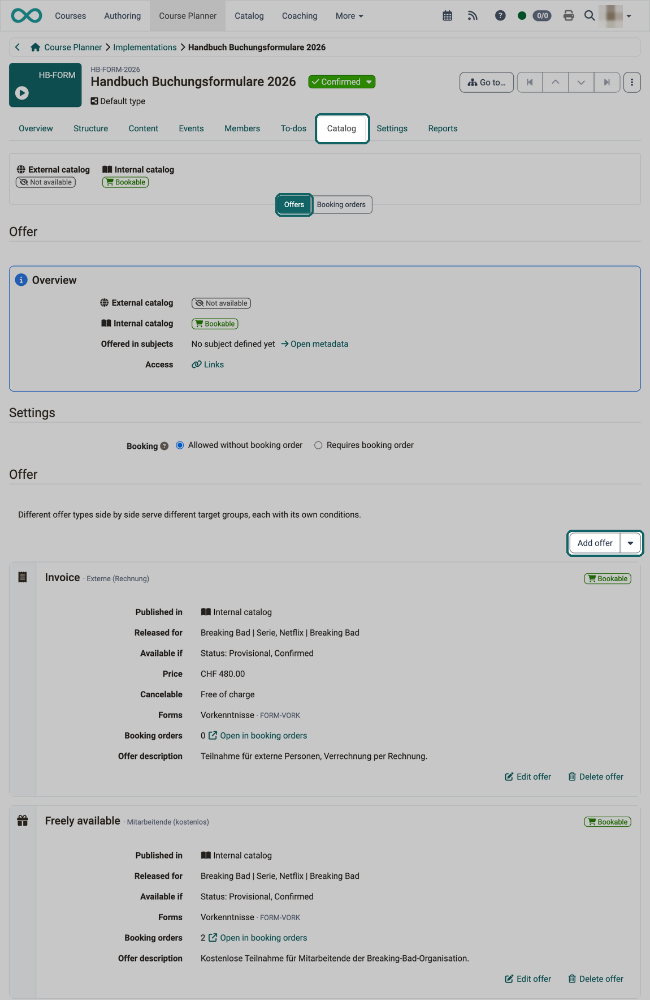{ class="shadow lightbox" title="Offers subsection in the Catalog tab · 2026.09.28" }

To draw the attention of potential participants to an offer in the catalog, you can send a direct link to the offer, e.g. in an email. You will find the links in the overview of the offers (per implementation in the Catalog tab). The "Links" dialog lists one direct link each for the external and the internal catalog. A click on the QR code icon in front of a link shows the link as a QR code.

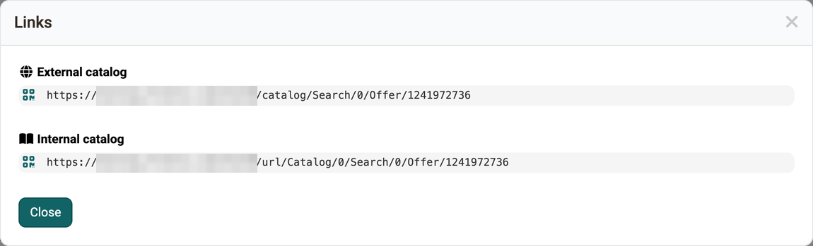{ class="shadow lightbox" title="Links dialog in the Catalog tab · 2026.09.30" }

#### Tab Catalog > Settings {: #tab_catalog_settings}

In the **Settings** section below the overview, you define whether every participation in this implementation must be booked through an offer and how high up the implementation appears in the catalog.

- **Booking**: The setting determines whether adding a participant in the Course Planner requires a booking through an offer. With **Allowed without booking order** (default), the wizard in the Members tab also offers adding participants without an offer. With **Requires booking order**, this option is missing and every addition goes through an offer. The setting applies to the whole implementation, not to a single offer.
- **Catalog priority when sorting**: Priority determines how high up an offer appears in the catalog. Use the **Edit** button next to the value to change it. The row only appears if "Sorting by priority" is switched on in the system administration: `Administration > Modules > Catalog > Tab "Settings"`. [More about sorting by priority >](catalog2.0_sort_offers.md#sorting_microsites_define_priority)

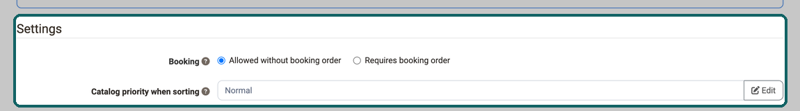{ class="shadow lightbox" title="Settings section in the Catalog tab · 2026.09.28" }

#### Tab Catalog > Booking order forms [:octicons-tag-16:{ title="from Release 21.1 (OO-9724)" }](https://track.frentix.com/issue/OO-9724){:target="_blank"} {: #booking_order_forms}

If an implementation needs more than a name and a billing address at booking, for example dietary requirements, prior knowledge or a membership number, forms collect the information needed when booking an offer. For each offer, you define which forms are used and in what order. An offer for working professionals can thus ask different questions than an offer of the same implementation for students. The answers are then available in three places: with the form in the implementation, with the booking order and with the membership of the person.

A [form learning resource](../learningresources/Form.md) serves as the form. The section only exists for implementations in the Course Planner, not for offers of a course or another learning resource. Offers of the offer type PayPal Checkout do not use forms. Everyone who may edit the implementation can add, use and remove forms; the roles are listed in the [rights matrix](Course_Planner.md#rights_matrix).

A form is used in two stages. First you add it to the implementation, then you switch it on in the individual offer. A form that has only been added is not yet required at booking.

##### Add form {: #booking_order_forms_add}

You will find the section **Booking order forms** below the offers: 
`Course Planner > Implementations > "your implementation" > Tab Catalog > Offers > Button "Add form"`

You can choose form learning resources with the usage "Embedding" that you can access in the authoring area. The dialog opens with your **Favourites**; you find all other forms under **My entries** or **Search form**. The chosen form is then available to all offers of the implementation, but no offer uses it yet.

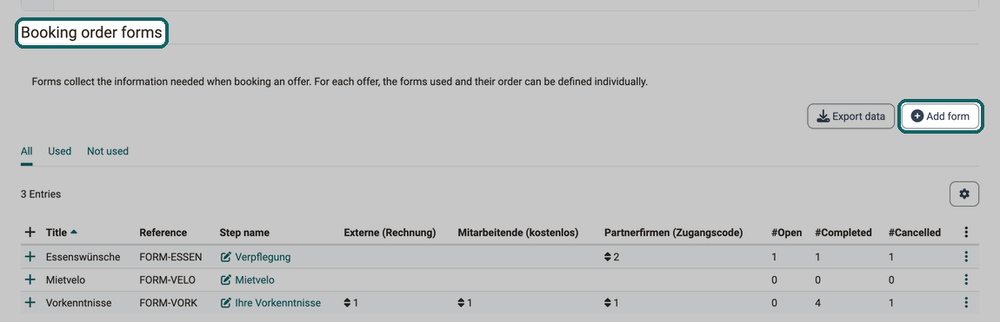{ class="shadow lightbox" title="Booking order forms section in the Catalog tab · 2026.09.28" }

The table lists for each form:

- **Title** and **Reference** of the form learning resource.
- **Step name**: the label under which the form appears as a step when booking. When the form is added, OpenOlat takes over the title of the form. A click on the step name opens **Edit step name**; the field must not be left empty.
- **Offer**: one column for each offer of the implementation, labelled with the internal label of the offer or, if none is set, with its offer type. If the offer uses the form, the column shows its position.
- **#Open**, **#Completed**, **#Cancelled**: the number of forms per status. "Open" is a form that belongs to a booking order but has not been filled in yet. "Completed" is a filled-in form. A form becomes "Cancelled" when its booking order is cancelled.

The views **Used** and **Not used** narrow the list down to forms that at least one offer uses or that no offer uses. Under the 3 dots at the end of the row, **Open form** opens the form learning resource and **Remove form** takes the form out of the implementation.

##### Use a form in an offer {: #booking_order_forms_offer}

For a form to be required at booking, switch it on in the offer. To do this, open the offer for editing. If the implementation has forms, the dialog shows the section **Booking order forms**. There you determine which forms are used for the offer and in what order.

- **Use**: The toggle adds the form to this offer. It is switched off at first.
- **Position**: Use the arrows to set the order of the forms used and thus the order of the steps when booking.
- **Title**, **Reference** and **Step name** are for orientation. You change the step name in the table of the implementation.

OpenOlat applies the changes when you save the offer.

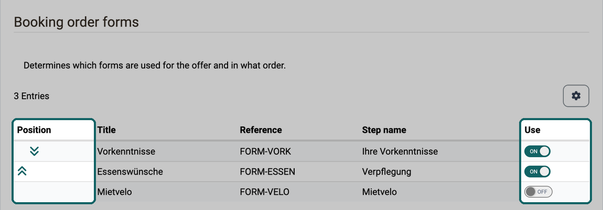{ class="shadow lightbox" title="Booking order forms section in the dialog of an offer · 2026.09.28" }

If persons have already booked the offer, OpenOlat creates one form with the status "Open" for each of their booking orders when you switch it on. These persons count under **#Open** until someone fills in the form via **Edit form**.

##### Forms when booking [:octicons-tag-16:{ title="from Release 21.1 (OO-9742)" }](https://track.frentix.com/issue/OO-9742){:target="_blank"} {: #booking_order_forms_booking}

When a person books an offer that uses forms, OpenOlat guides them through a wizard. Each form is a separate step, labelled with the step name and in the order of the position. This applies to the offer types Freely available, Access code and Invoice. The booking is only completed once all forms have been filled in; the answers are then stored with the booking order with the status "Completed". The forms of the chosen offer also appear as steps when [adding participants](#add_members) in the Members tab. How the booking person goes through the wizard is described in [Booking with forms as a wizard](catalog2.0_angebote.md#offer_booking_wizard).

##### View and export answers {: #booking_order_forms_answers}

If you expand the row of a form in the table of the implementation, all persons appear with offer, booking order, status and submission date. The views "Open", "Completed" and "Cancelled" and the "Status" filter narrow the list down. **Open form** opens the form learning resource in a new browser tab, **Export** downloads the answers of this one form.

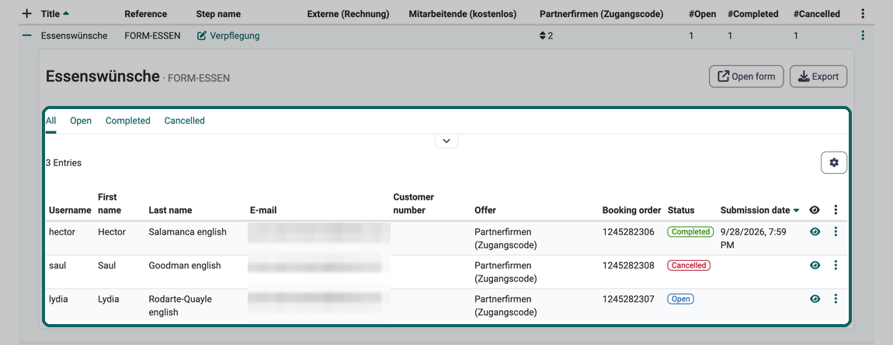{ class="shadow lightbox" title="Expanded form in the Booking order forms section · 2026.09.28" }

**View form** shows the filled-in form. Above it you see the implementation and the person as well as offer, booking order, submission date and status. **Edit form** under the 3 dots corrects the answers as long as the form has the status "Open" or "Completed". A cancelled form can only be viewed.

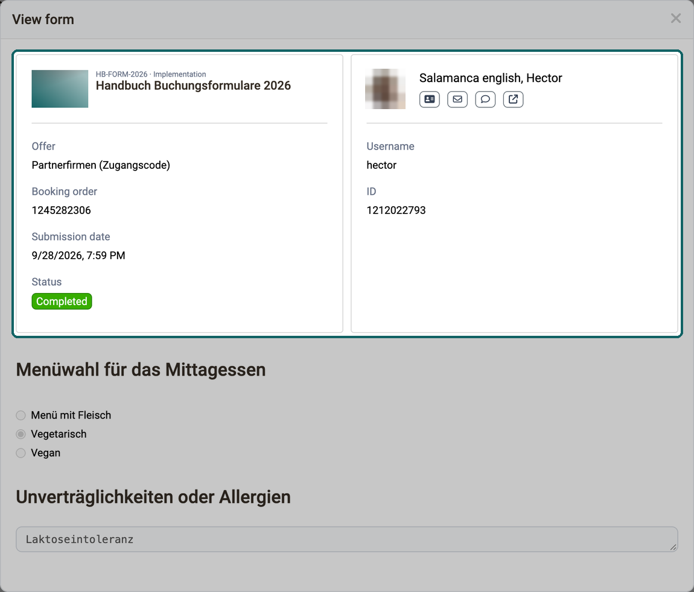{ class="shadow lightbox" title="View of a filled-in form · 2026.09.28" }

**Export data** above the table downloads the answers of all forms shown. For each form, OpenOlat creates an Excel file with the sheets "Response - Completed" and "Response - All". With several forms, with a form that contains the element "Upload file" or with a configured PDF service, you receive a ZIP file. It contains the Excel files, the uploaded files and, with a configured PDF service, each form as a PDF.

The detail view of a [booking order](#tab_catalog_booking_orders) and the detail view of a [membership](#tab_members) list the same forms with status and submission date.

##### Disable or remove a form {: #booking_order_forms_remove}

There are two ways to take a form out of booking. They differ in what happens to the submitted forms:

- **Switching off Use** in the dialog of the offer: The form is no longer used when booking this offer. The submitted forms remain. If submitted forms already exist, you confirm the step in the **Disable form** dialog.
- **Remove form** in the table of the implementation: The form leaves the implementation and all its offers. The submitted forms are deleted.

!!! danger "Attention"
    **Remove form** deletes all submitted forms of this form. If the answers are to be kept, switch off **Use** in the offers instead or export the data beforehand.

#### Tab Catalog > Booking orders [:octicons-tag-16:{ title="from Release 20.0 (OO-8318)" }](https://track.frentix.com/issue/OO-8318){:target="_blank"} {: #tab_catalog_booking_orders}

If offers with booking options have been added to the catalog, the booking orders and their details can also be found under the "Catalog" tab in the "Booking orders" subsection.

The tabs "All", "Open", "Done", "Paid", "Cancelled" and "Error" as well as the filters "Status", "Offer type" and "Offer" narrow down the list. If the offer type Invoice is available, the tabs "Adjusted amount" and "Address proposal" are added. **Export booking orders** gives you the booking orders of the implementation as an Excel file. It contains the same columns as the [Booking orders report](Reports_BookingOrders.md), so with the customer number switched on also the three customer number columns.

The menu at the end of a row offers different actions depending on the status of the order. For an open order with a price these are **Set as "Paid"** and **Change price**, for a paid one **Set as "Open"**. If there is a billing address or an address proposal, you change the address of an open order with **Change billing address**. **Write off booking order** is available for every open order, **Change cancellation fee** for a cancelled order with a cancellation fee.

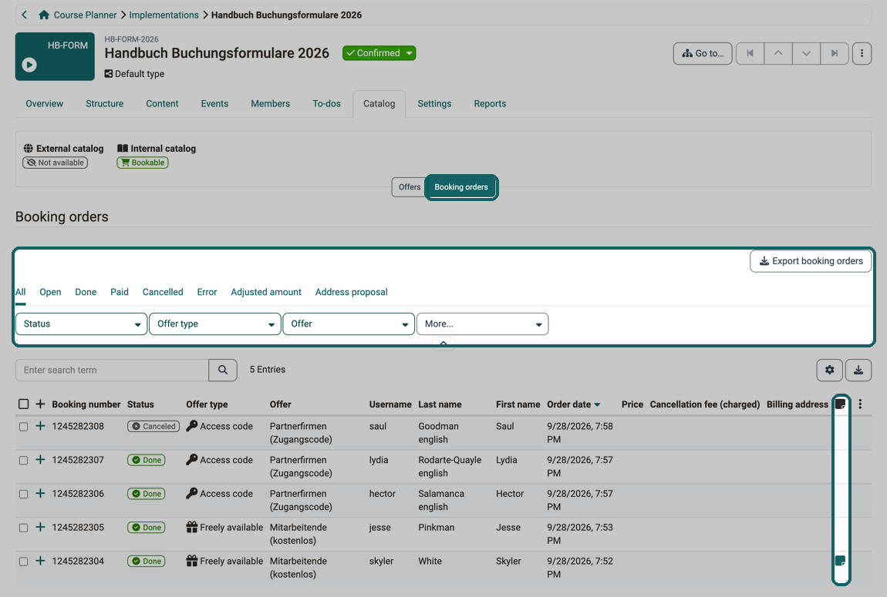{ class="shadow lightbox" title="Booking orders subsection of the Catalog tab · 2026.09.30" }

If the booked offer requires forms, the detail view of a booking order shows the section **Booking order forms** with title, reference, step name, status and submission date. There, the forms can be viewed and, as long as they are open or completed, edited.

If a booking order has a billing address with a recorded customer number, its detail view shows the number as the first line of the billing address.

[To the top of the page ^](#implementations)

---

### Tab Settings {: #tab_settings}

Everything that describes and controls an implementation is set in the sub-tabs of the settings. The sub-tabs "Metadata", "Infos", "Execution" and "Options" are always available, "Automation" and "Assessment" only under the conditions named in their sections below. For the implementation itself, not for its subordinate elements, the **Preview info page** button shows how the info page of the implementation appears.

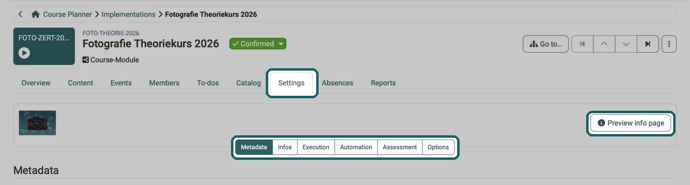{ class="shadow lightbox" title="Settings tab of an implementation · 2026.10.02" }

#### Metadata of the settings

The metadata entered here is used to simplify search processes, for example.

Mandatory fields are **Title**, **Reference** and **Type**. For an implementation, the **Implementation format** is added. If taxonomies are configured for the Course Planner, you assign subjects via **Browse**; with the catalog switched on, the field of an implementation is called **Subjects / Catalog**. Administrators also see the **ID** of the element, in the form and in the header of the settings.

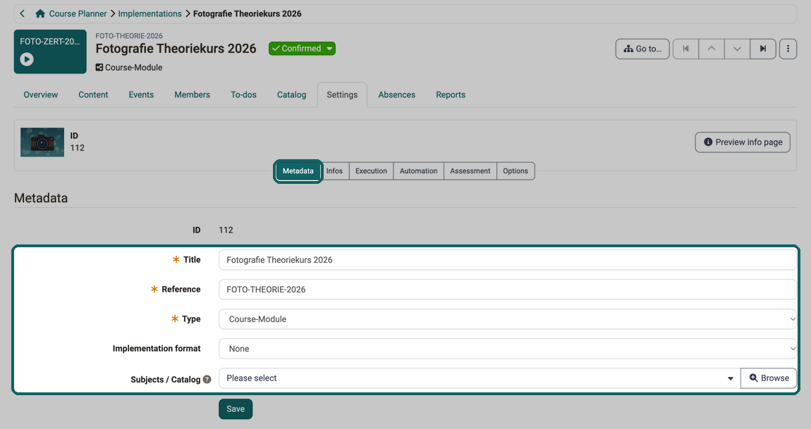{ class="shadow lightbox" title="Metadata sub-tab of the settings of an implementation · 2026.09.30" }

#### Infos in the settings [:octicons-tag-16:{ title="from Release 21.1 (OO-9756)" }](https://track.frentix.com/issue/OO-9756){:target="_blank"}

The information entered in the "Infos" tab is used for the display in the catalog, for example. For an implementation, the tab contains the following details, for a subordinate element only the cover image:

- **Cover image (jpg, png, gif)**, the **With teaser movie** toggle, **Teaser** and **Description**.
- Section **Facts**: **Authors / taught by**, **Main language** and **Expenditure of work**.
- Section **Display settings**: Under **Display on info page** you choose whether the info page shows **Events**, **Meet your teachers**, **Certificate** and **Credit points**; if the element type allows sub-elements, **Outline** is also available, **Credit points** only with credit points active. If **Meet your teachers** is selected, you define under **Members displayed as teacher** who appears as teacher: **Teachers in events**, **Coaches** or **Course owners**.
- Collapsible section **Details**: **Objectives**, **Requirements** and **Certification**.

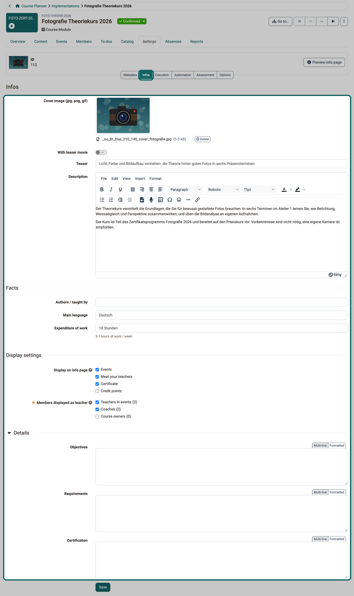{ class="shadow lightbox" title="Infos sub-tab of the settings · 2026.09.30" }

#### Execution in the settings

The execution settings include the execution period, the location and the number of participants.

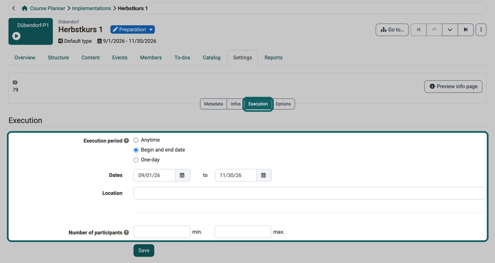{ class="shadow lightbox" title="Execution sub-tab of the settings · 2026.09.30" }

#### Configure automation [:octicons-tag-16:{ title="from Release 21.0 (OO-9578)" }](https://track.frentix.com/issue/OO-9578){:target="_blank"} {: #tab_settings_automation}

In the **"Automation"** subsection of the settings tab, you define when courses are [instantiated](#tab_content) automatically and when status changes are triggered automatically.

The subsection appears for elements whose element type has the use "Implementation" or "Element". For the use "Implementation or element (legacy)" it is missing.

If a course is to be used multiple times in exactly the same way, it can be created as a template. The courses are then created from the template for each implementation. [Instantiation](#tab_content) can take place automatically at a specific time and role-specifically, e.g. accessible to coaches a few days before an implementation starts. Until then, the template owners can still work on the template while the organizational planning in the Course Planner is already under way.

**Scope of the automation rules:**

Automation rules are defined at two levels:

* **Element type level** in the system administration under `Administration > Modules > Course Planner > Tab Element types`: Administrators define default rules for each element type. These rules serve as a template for all elements of this type.
* **Element level** `Settings tab > Automation`: For each individual element, you decide whether the rules of the element type are adopted or overridden individually.

Two modes are available for the individual element:

* **"Adopt from type "Element type""**: The element uses the default rules of the element type. The label names the type and whether rules are active there. If administrators adjust the template, this automatically affects all elements that use this mode.
* **"Override"**: The element uses deviating, individually configured rules, independent of the element type.

**Types of automation rules:**

| Type | Trigger |
|---|---|
| On status change | An action is triggered as soon as the implementation or element status reaches a certain value. |
| Time-controlled | An action is triggered relative to the start or end of the implementation period. |

**Execution of the rules:**

Enabled automations run once a day at a fixed time. The information text above the configuration names the time.

As soon as at least one rule is active, the header of the implementation above the tabs shows the date of the next execution under "Automation". If no execution is pending, a dash appears there.

**Table of rules:**

Below the configuration, a table lists the rules of the element. The tabs "All", "Relevant", "Implementation" and "Content" above it narrow down the list; for elements with the use "Element", the third tab is called "Element". "Relevant" is preselected and shows only the rules that are switched on. "Implementation" and "Content" show the rules that concern the implementation itself or its courses. For each rule, the columns give "Context", "Automation", "Target status" and "Condition", plus under "Implementation status is", for elements "Element status is", the status that the implementation or the element must have for the execution, as well as "Planned execution" and "Execution date". The toggle in the "Rule" column shows whether the rule is switched on.

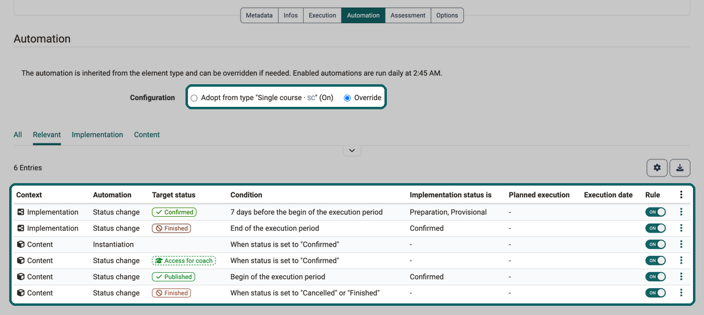{ class="shadow lightbox" title="Automation sub-tab of the settings of an implementation · 2026.10.02" }

[To the element types and automation rules (Admin) >](../../manual_admin/administration/Modules_Course_Planner.md#tab_element_types) 
[To the to-dos on CPL elements >](Course_Planner_Todos.md)

#### Assessment in the settings [:octicons-tag-16:{ title="from Release 21.0 (OO-9499)" }](https://track.frentix.com/issue/OO-9499){:target="_blank"} {: #tab_settings_assessment}

The sub-tab "Assessment" requires certification programs to be switched on in the OpenOlat instance, which is the default. It is then displayed for implementations of type Single course and for every implementation that is already assigned to a certification program. Here you link the implementation directly to a certification program, without going through the program itself.

* Use the **"Certification program"** toggle to show the selection of a program. The link is only saved once you have selected a program; without a program, the toggle is back on "Off" the next time you open the sub-tab. If you switch it off while a program is linked, the same confirmation dialog appears as with **"Remove"**.
* If no program is linked yet, use the **"Select"** button to choose a program. The "Select certification program" dialog shows title, reference, validity period, recertification and required credit points. It only lists programs whose **Administrative access** contains the organisation of the product. In addition, you must be a certification program owner of the program or have the role Administrator, Principal or Course planner in one of its organisations. If the list stays empty, check the Administrative access of the program first.
* If a program is linked, a panel shows the program title and, if set, the reference. Validity period and required credit points appear there provided they are configured on the program, the recertification only if it is switched on for the program. Use **"Open"** to open the program in a new tab, provided you have access to the program. Use **"Remove"** to remove the link; the confirmation dialog "Remove certification program" completes the step. Participants who have already received a certificate remain members of the program.

The toggle and the "Select" and "Remove" buttons can be used by administrators, course planners and product owners.

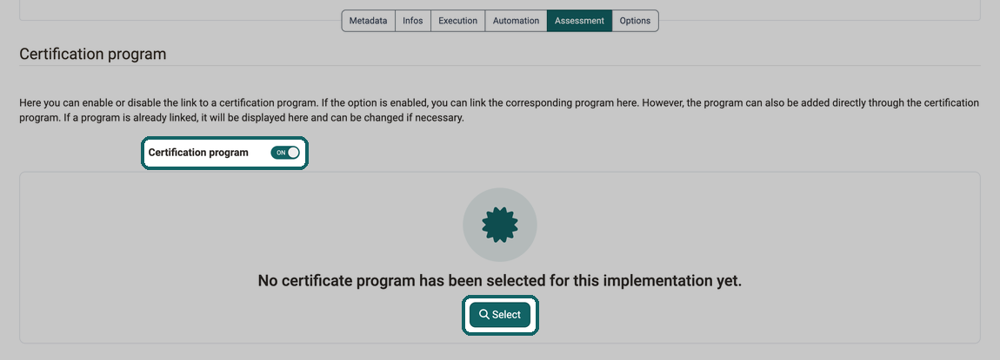{ class="shadow lightbox" title="Assessment sub-tab of the settings of an implementation · 2026.10.02" }

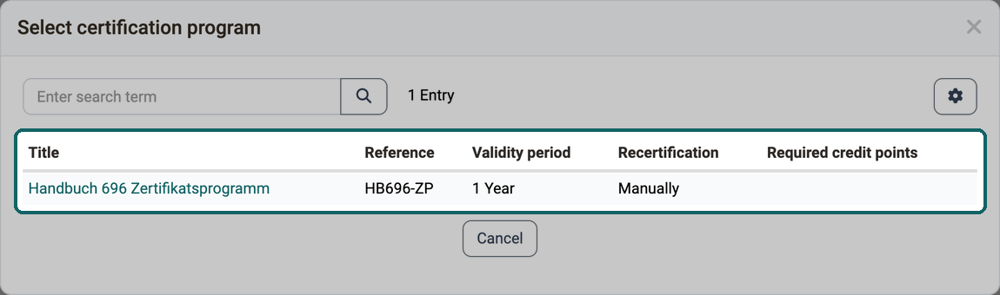{ class="shadow lightbox" title="Select certification program dialog · 2026.10.02" }

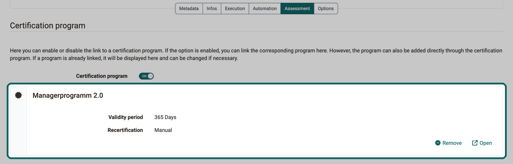{ class="shadow lightbox" title="Assessment sub-tab of the settings · 2026.10.02" }

An implementation can also be added directly via the [certification program](Course_Planner_Certification_Programs.md#config_tab_implementations).

When [copying an implementation](#copy), the link to the certification program is applied, provided you have permission for the program. If the permission is missing, the wizard shows the warning "The certification program cannot be applied due to a lack of permissions." Copying creates an entry in the program's activity log.

#### Options in the settings

Separate settings can be made here for each implementation:

- Calendar configuration
- Calendars
- Absences configuration
- Absences
- Progress configuration
- Progress

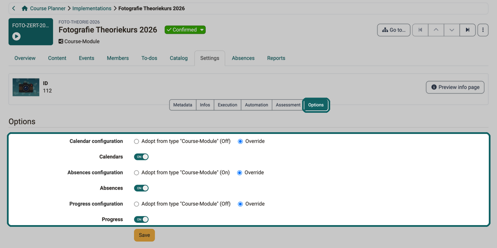{ class="shadow lightbox" title="Options sub-tab · 2026.09.30" }

[To the top of the page ^](#implementations)

---

### Tab Absences [:octicons-tag-16:{ title="from Release 20.0 (OO-8442)" }](https://track.frentix.com/issue/OO-8442){:target="_blank"} {: #tab_absences}

This tab only appears if absences have been activated on the element.

Activation takes place in the implementation settings: `Settings tab > Options > Absence configuration`.

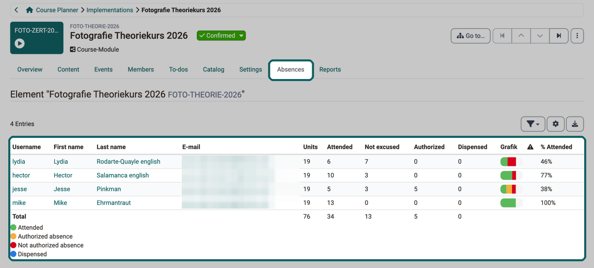{ class="shadow lightbox" title="Absences tab of an implementation · 2026.09.30" }

[To the top of the page ^](#implementations)

---

### Tab Reports [:octicons-tag-16:{ title="from Release 20.0 (OO-8387)" }](https://track.frentix.com/issue/OO-8387){:target="_blank"} {: #tab_reports}

The reports that can be created here relate to the currently selected implementation.

In contrast, the report creation, which can be called up in the [Overview](../../manual_user/area_modules/Course_Planner_Reports.md), refers to **all** implementations. The structure of the Excel files (columns) and the procedure for creating them is identical for both.

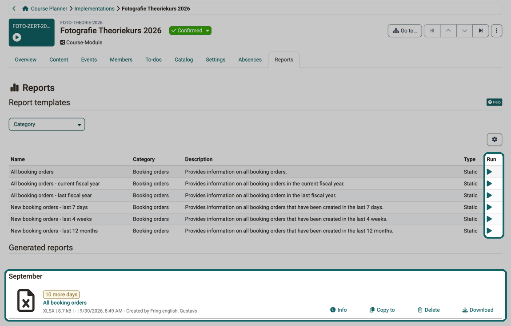{ class="shadow lightbox" title="Reports tab of an implementation · 2026.09.30" }

Click on the **icon in the "Run"** column to generate Excel files with the current data using the listed templates.

You will then find the Excel files created in this way listed at the bottom of the screen. They can be copied and downloaded.

[To the top of the page ^](#implementations)

---

## Copy an implementation [:octicons-tag-16:{ title="from Release 20.0 (OO-8418)" }](https://track.frentix.com/issue/OO-8418){:target="_blank"} {: #copy}

You will find the **"Copy element"** action in the list of implementations at the end of a line under the 3 dots.

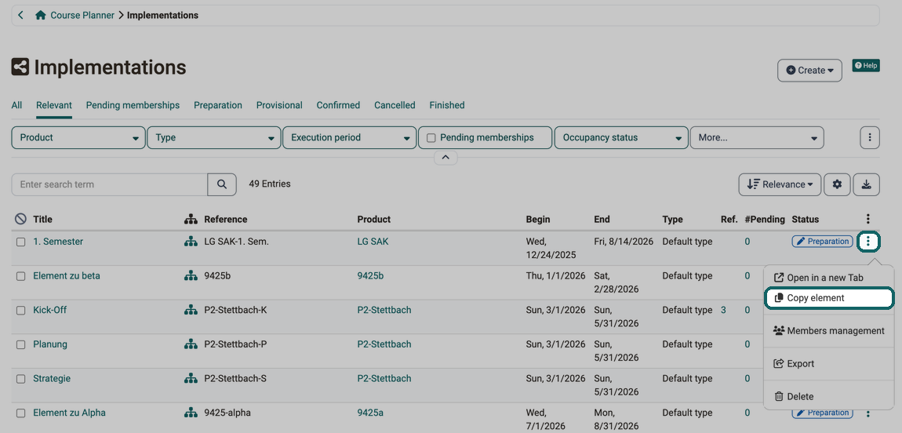{ class="shadow lightbox" title="List of implementations · 2026.09.30" }

In the first step of the small wizard, you can select whether course content, events, members, to-dos and room bookings should also be copied. Under **Title** and **Reference**, the wizard suggests the details of the original element with the addition "(Copy)".

- **Content**: **Copy** reuses an existing template and copies the events; if no template is available, the course is copied. **Reuse** shares the course with other implementations or reuses the template. **Don't copy** adopts no course content.
- **Standalone events**: Events without a course are adopted with **Copy**, not with **Don't copy**.
- **To-dos** and **Room scheduling**: see [Adopt to-dos when copying](#copy_todos) and [Adopt room bookings when copying](#copy_rooms).
- **Coaches**: **Standard** copies the memberships and the assignments to events, **Membership only** only the memberships, **Don't copy** none.
- **Master coaches / Course owners / Element owners**: **Including membership** copies the memberships, **Don't copy** none.

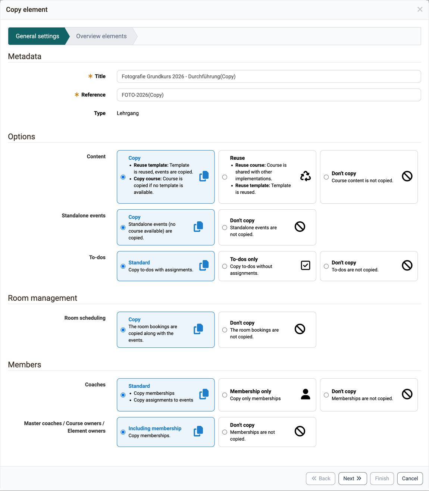{ class="shadow lightbox" title="General settings step of the Copy element wizard" }

The second step of the wizard shows you an overview of the elements that will now be copied. 
You can still make adjustments here (especially to the events). 
Click on the + in front of an element to display the courses and events of the element.

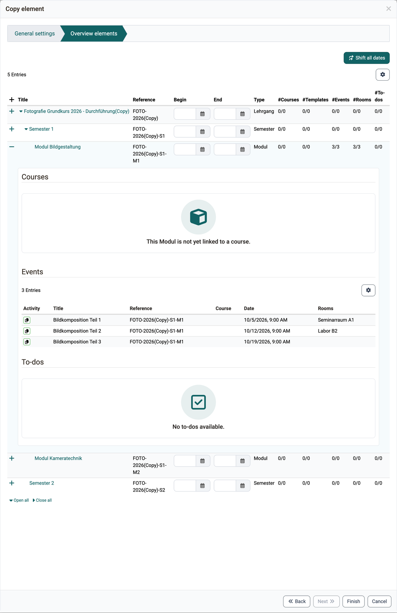{ class="shadow lightbox" title="Overview elements step" }

In the detail areas "Courses", "Events" and "To-dos", the **"Activity"** column shows with an icon what happens to the individual row: copy, reuse or don't copy.

An implementation contains many different dates that are arranged in a specific order. When copying, all of this data can be automatically adjusted and moved together. To do this, use the **"Shift all dates"** button in the "Overview elements" step, at the top right of the list of elements. The dialog shows the "Reference date (earliest)". Under "Shift by" you choose between "Date" and "Days" and then enter the "New date" or the number of days.

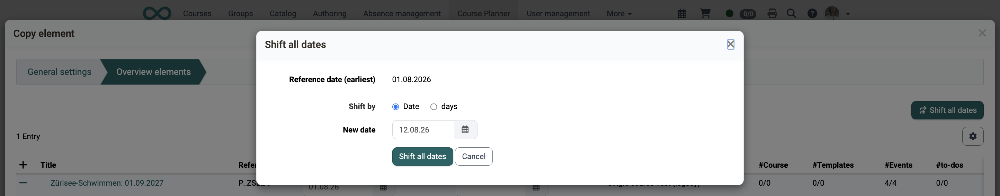{ class="shadow lightbox" title="Shift all dates dialog of the Copy element wizard" }

If the implementation has offers, the third step **"Offers"** follows. It lists the offers of the original element, all of them selected; an offer you deselect is not included in the copy. If an offer has a period, the wizard shifts it by the same number of days as **"Shift all dates"**. You adjust the period in the row of the offer.

### Adopt to-dos when copying [:octicons-tag-16:{ title="from Release 21.0 (OO-9419)" }](https://track.frentix.com/issue/OO-9419){:target="_blank"} {: #copy_todos}

Whoever copies an implementation takes its to-dos over into the copy and does not have to create them again for the new implementation. In the first step of the wizard, the "To-dos" selection determines how this is done:

* **Standard:** Copy to-dos with assignments.
* **To-dos only:** Copy to-dos without assignments.
* **Don't copy:** To-dos are not copied.

With **Standard**, the copy also takes over the entries under "Assigned" and "Delegated". The persons entered receive a single e-mail per copy, not one per to-do: with several to-dos the e-mail "New to-dos" with one line and one link per to-do, with exactly one to-do the e-mail "New to-do". With more than 20 to-dos, the e-mail shows the first 20 and below them the line "… and N more". OpenOlat sends the e-mails only once the copy is completed; if the copy is aborted, no e-mail is sent. If you do not want to trigger any e-mails when copying, choose **To-dos only** or **Don't copy**; with **To-dos only** the to-dos are created without entries under "Assigned" and "Delegated", and you assign them manually afterwards. A to-do deselected in the "Overview elements" step is not copied and does not appear in any e-mail. [:octicons-tag-16:{ title="from Release 21.1 (OO-9731)" }](https://track.frentix.com/issue/OO-9731){:target="_blank"}

Exceptions, for example for the person who copies and is entered themselves, are described in the section [When OpenOlat sends e-mails about to-dos](../basic_concepts/To_Dos_Basics.md#notifications).

In the overview of the elements, the **"#To-dos"** column shows how many to-dos an element contains. In the detail view of an element, the "To-dos" section lists all to-dos with the columns "Activity", "Title", "Priority", "Date input" (absolute or relative), "Due date", "Due" (the remaining time), "Status", "Assigned", "Delegated" and "Tags". Use the checkbox at the start of a row to deselect individual to-dos from copying. If no to-dos exist, the note "No to-dos available." is shown.

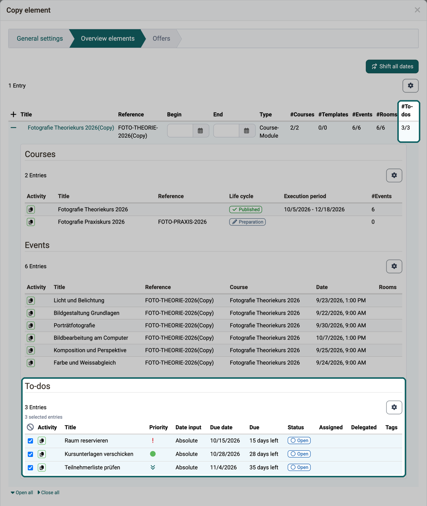{ class="shadow lightbox" title="Overview elements step · 2026.09.30" }

### Adopt room bookings when copying [:octicons-tag-16:{ title="from Release 21.0.2 (OO-9710)" }](https://track.frentix.com/issue/OO-9710){:target="_blank"} {: #copy_rooms}

If the module "Rooms" is activated, the first step of the wizard additionally shows the **"Room management"** section. The **"Room scheduling"** selection there determines whether the room bookings of the events are copied as well:

* **Copy:** The room bookings are copied along with the events. This option is preselected.
* **Don't copy:** The room bookings are not copied.

The selection is only active if events are copied at all, that is if the "Copy" option is selected for **Content** or for **Standalone events**. Otherwise it is greyed out and no bookings are created.

!!! note "You cannot see the Room management section?"

    The section only appears once a system administrator has activated the module "Rooms". 
    [Manage rooms (administration) >](../../manual_admin/administration/Modules_Rooms.md#activation)

The copy takes over the room of the original booking. The period of the booking follows the copied event: if you shift the events with **"Shift all dates"**, the bookings move along with them. When copying, OpenOlat does not check whether the room is still free in the new period. Conflicts such as a double booking only appear afterwards as a warning in [Room Scheduling](Course_Planner_Rooms.md#room_scheduling).

In the **"Overview elements"** step, the **"#Rooms"** column additionally appears if the module is active and the "Copy" option is selected; expand an element and the "Events" table there also lists the **"Rooms"** column with the booked rooms. With "Don't copy", both columns are missing.

The **"Copy element"** action is available to administrators, course planners and product owners. You will find the complete overview in the [rights matrix](Course_Planner.md#rights_matrix) of the Course Planner.

You copy individual events in the event list of an implementation instead, with the **"Copy"** action. If you mark several events there and copy them together, OpenOlat takes over the room bookings automatically. If you copy a single event, the editing dialog of the copy opens with an empty **"Rooms"** field; you then select the rooms yourself.

[To the top of the page ^](#implementations)

---

## Delete an implementation [:octicons-tag-16:{ title="from Release 20.0 (OO-8354)" }](https://track.frentix.com/issue/OO-8354){:target="_blank"} {: #delete}

You will also find the option to delete in the list of implementations at the end of a line under the 3 dots.

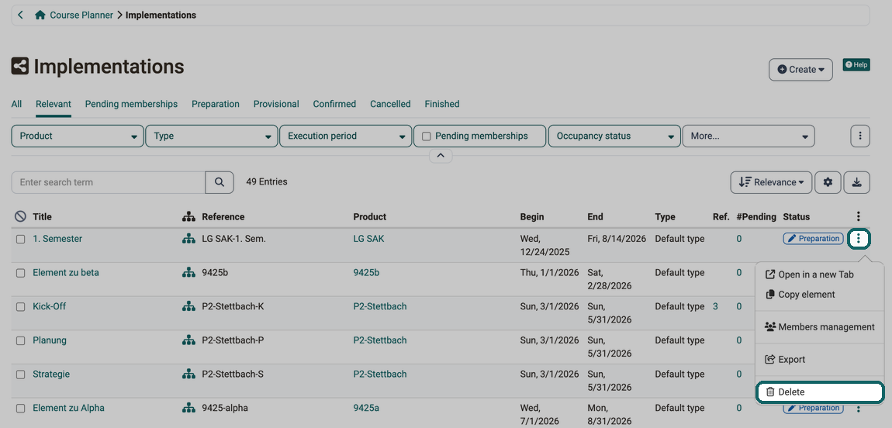{ class="shadow lightbox" title="List of implementations in the Course Planner · 2026.09.30" }

If you have already opened an implementation, you will also find the option to delete it at the top right under the 3 dots.

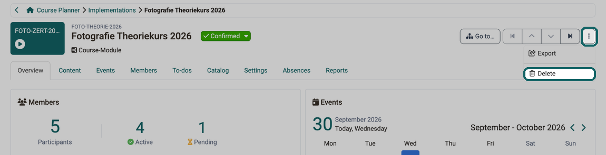{ class="shadow lightbox" title="Header of an opened implementation · 2026.09.30" }

[To the top of the page ^](#implementations)

---

## Further information {: #further_information}

**Mentioned on this page** 
[Course Planner: Overview >](Course_Planner.md) 
[Course Planner: Import / Export >](Course_Planner_Import_Export.md) 
[Overview pages and widgets >](../basic_concepts/Dashboard_Concept.md) 
[Course Planner: Dashboard >](Course_Planner_Dashboard.md) 
[Course Planner: To-dos >](Course_Planner_Todos.md) 
[Course Settings - Tab Execution >](../learningresources/Course_Settings_Execution.md) 
[Module Organisations (Administration) >](../../manual_admin/administration/Modules_Organisations.md) 
[Module Groups (Administration) >](../../manual_admin/administration/Modules_Groups.md) 
[Catalog 2.0 - Offers >](../../manual_user/area_modules/catalog2.0_angebote.md) 
[Catalog 2.0 - Sorting/order >](catalog2.0_sort_offers.md) 
[Forms - Overview >](../learningresources/Form.md) 
[Reports: Booking orders >](Reports_BookingOrders.md) 
[Module Course Planner (Administration) >](../../manual_admin/administration/Modules_Course_Planner.md) 
[Course Planner: Certification programs >](Course_Planner_Certification_Programs.md) 
[Course Planner: Reports >](../../manual_user/area_modules/Course_Planner_Reports.md) 
[To-dos: basics >](../basic_concepts/To_Dos_Basics.md) 
[Module Rooms (Administration) >](../../manual_admin/administration/Modules_Rooms.md) 
[Course Planner: Room management >](Course_Planner_Rooms.md)

**Further reading** 
[How do I create my first OpenOlat course? >](../../manual_how-to/my_first_course/my_first_course.md) 
[Course Planner: Products >](../../manual_user/area_modules/Course_Planner_Products.md) 
[Course Planner: Events >](../../manual_user/area_modules/Course_Planner_Events.md) 
[How do I plan and run courses with the Course Planner? >](../../manual_how-to/course_planner_courses/course_planner_courses.md) 
[How do I plan and run a curriculum with the Course Planner? >](../../manual_how-to/course_planner_curriculum/course_planner_curriculum.md)

[To the top of the page ^](#implementations)
