# Course Planner: Implementations {: #implementations}

{ class="shadow lightbox" } 

## What is an implementation? {: #definition}

An educational program/product (consisting of one or more courses) can be offered and carried out several times. Each implementation can take place on a different date and different participants are then present at each implementation.

In an educational program/product, one or more courses are assigned to each implementation.

The course(s) used multiple times only exist once and are templates. The courses are instantiated for each execution (created from the template). This instantiation can also take place automatically on a specific date. For example, a few days before the start of a course. Until then, the course owners can still work on finalizing the courses (templates). However, the organizational aspects can already be prepared with the Course Planner.

From this conceptual idea, the same courses are generally assigned and used in each implementation. However, it is also possible in OpenOlat to adapt the content in each implementation.

[To the top of the page ^](#implementations)

---

## The list of implementations {: #listing}

If you have selected the "Executions" button in the Courser Planner overview, you will first be taken to a list of all executions for this product. You can use the tabs to display sub-lists (e.g. "Active") and use filters to narrow down the selection further.

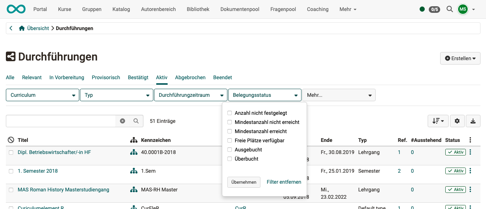{ class="shadow lightbox" }  

[To the top of the page ^](#implementations)

---

## Navigation the implementations {: #navigation}

Once you have selected and opened an implementation in the list, you can

 click on the "**Go to**" button at the top right to jump to an element within the current execution.

 use the **arrow buttons** at the top right to switch to other bushings.

 configure this execution by clicking on the various **tabs**.

 click on one of the **headings** to jump directly to the corresponding tab.

 by clicking on the **+** add course content.

{ class="shadow lightbox" }

[To the top of the page ^](#implementations)

---

## Configuration of an implementation {: #config}

As soon as you have opened an implementation, you can make all the settings for this implementation in the tabs displayed.

### Tab Overview {: #tab_overview}

The "Overview" tab shows you the next dates, the offers in the catalog and the course content for this product.

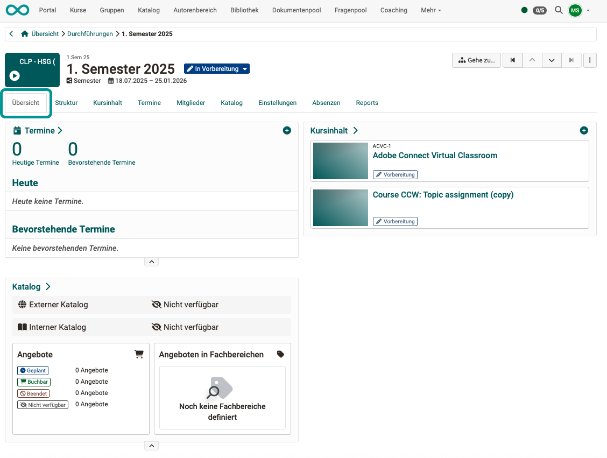{ class="shadow lightbox" }

[To the top of the page ^](#implementations)

---

### Tab Structure {: #tab_structure}

In the displayed tree structure, each individual element of the implementation can be edited or information about it can be queried.

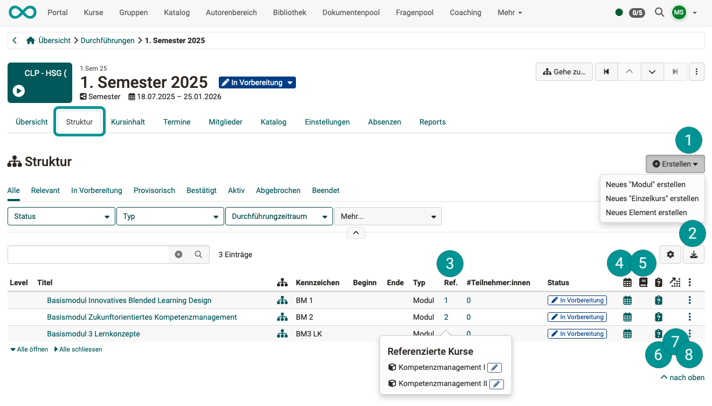{ class="shadow lightbox" }

 If you would like to add other elements for this implementation that deviate from the product structure ("copy template" of this structure), you will find the available element types as defined in the administration under the **Create** button.

 You can also download the displayed structure as an Excel file using the **Download button**.

 In the **References** column, you can display the content (courses) referenced in this element.

 In this column you will find the **Schedules** of the respective elements.

 In this column you will find the **Absences**. (Provided that absence management is activated.)

 If the "Quality management" module has been activated, you can jump to the assigned **data collection preview** for each element.

 The **Learning progress** column shows the average progress of all participants. All learning path courses for this element are taken into account. (Conventional courses do not provide any data on learning progress).

 Under the **3 points** you will find options for editing the elements.

{ class="shadow lightbox" }

[To the top of the page ^](#implementations)

---

### Tab Course Content {: #tab_content}

The list shows all courses belonging to this implementation.

If you want to add further courses for this implementation (deviating from the original structure), use the "**Add course**" button at the top right.

The option to **remove** an **individual course** from this implementation can be found under the 3 dots at the end of a line. 
To **remove several courses**, select the courses with the checkboxes in the first column. A Remove button will then be displayed above the list.

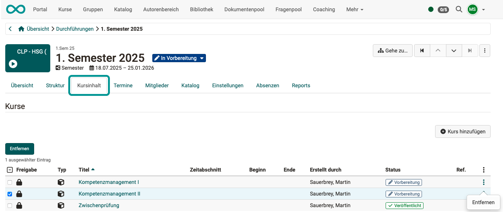{ class="shadow lightbox" }

[To the top of the page ^](#implementations)

---

### Tab events {: #tab_events}

- If there are many appointments, the **filters** above the table are useful for keeping an overview.
- The **"Add appointment"** button can be used to add new appointments to the currently selected event.
- A click on the **+** at the beginning of a line shows the **details** of this appointment.
- It is also possible to **import** appointments. To do this, click on the small arrow next to the "Add appointment" button.

{ class="shadow lightbox" }

[To the top of the page ^](#implementations)

---

### Tab members {: #tab_members}

{ class="shadow lightbox" }

As mentioned above, an educational product (consisting of one or more courses) can be carried out several times. Different participants take part in each course.

Participants are therefore made members of a specific implementation (not members of individual courses or an educational product). It can be determined whether they become members of the entire implementation or only of a sub-area.

If the participants were made members of the educational product (the "copy template"), they would be present as participants in all implementations of this product. This is not desirable. Therefore, only owners can be added to a product as members, not participants.

Because member administration is carried out when using the Course Planner, there is the setting "Integration in curriculum/product" in the course settings. 
**(Course) Administration > Settings > Tab "Share" > Section "Use" > Button "Implementation in Curriculum/Product"**  The course then no longer has its own member administration; the member administration takes place in the member administration of the implementation.

[To the top of the page ^](#implementations)

---

### Tab Catalog {: #tab_catalog}

The various implementations can be offered in the catalog. To do this, an [offer](../../manual_user/area_modules/catalog2.0_angebote.md) must be created, as for every catalog entry.

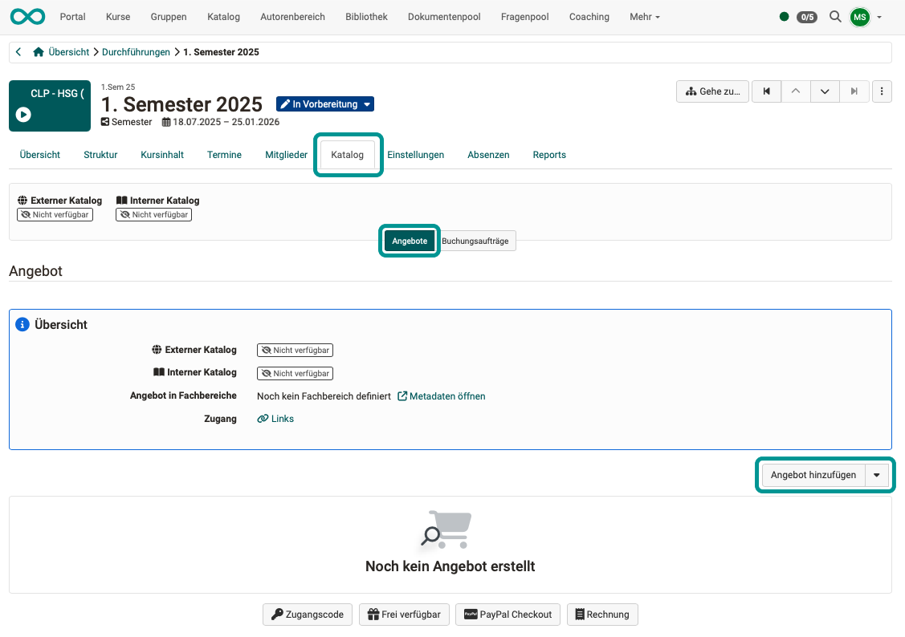{ class="shadow lightbox" }

To draw the attention of potential participants to an offer in the catalog, you can send a direct link to the offer, e.g. in an e-mail. You will find the links in the overview of the offers (per event in the Catalog tab).

{ class="shadow lightbox" }

If offers with booking options have been added to the catalog, the booking orders and their details can also be found under the "Catalog" tab in the "Booking orders" subsection.

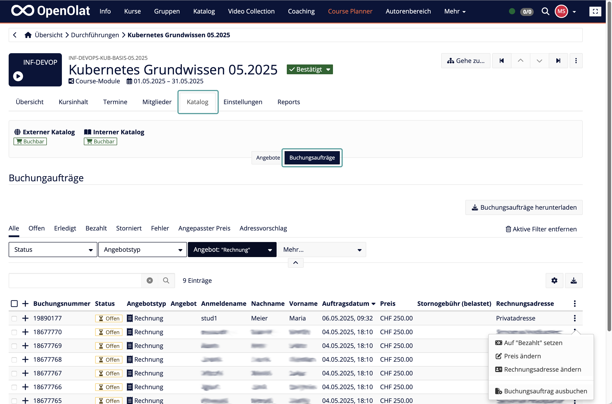{ class="shadow lightbox" }

[To the top of the page ^](#implementations)

---

### Tab Settings {: #tab_settings}

The many possible settings for an implementation can be found under several subordinate tabs. A preview info page is permanently available.

{ class="shadow lightbox" }

#### Tab Settings > Infos

The metadata entered here is used to simplify search processes, for example.

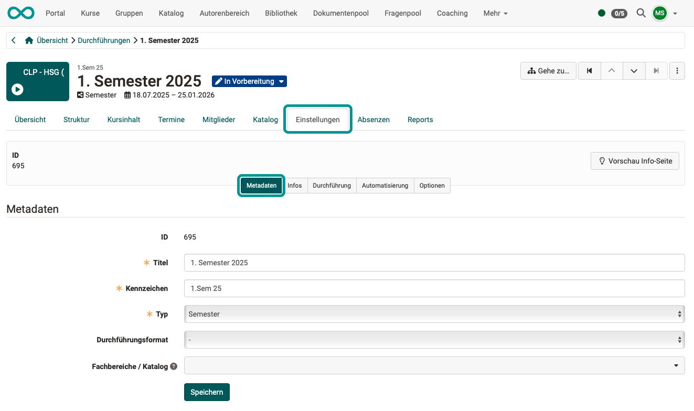{ class="shadow lightbox" }

#### Tab Settings > Implementations

The implementation settings include the implementation period, the location and the number of participants.

{ class="shadow lightbox" }

#### Tab Settings > Automatization

The basic purpose of Course Planner is to separate administrative planning from content creation. It is possible to carry out planning without having courses available from the outset. It can even be set up so that the courses are only actually created automatically (from a template) when the implementation period approaches. This is also known as instantiation.

The status change (e.g. from "Provisional" to "Published"), which is usually carried out by course owners, can also be carried out automatically. The change can be linked to the implementation period in the Course Planner. (A status change from “In preparation” is not possible to prevent unintentional publication).

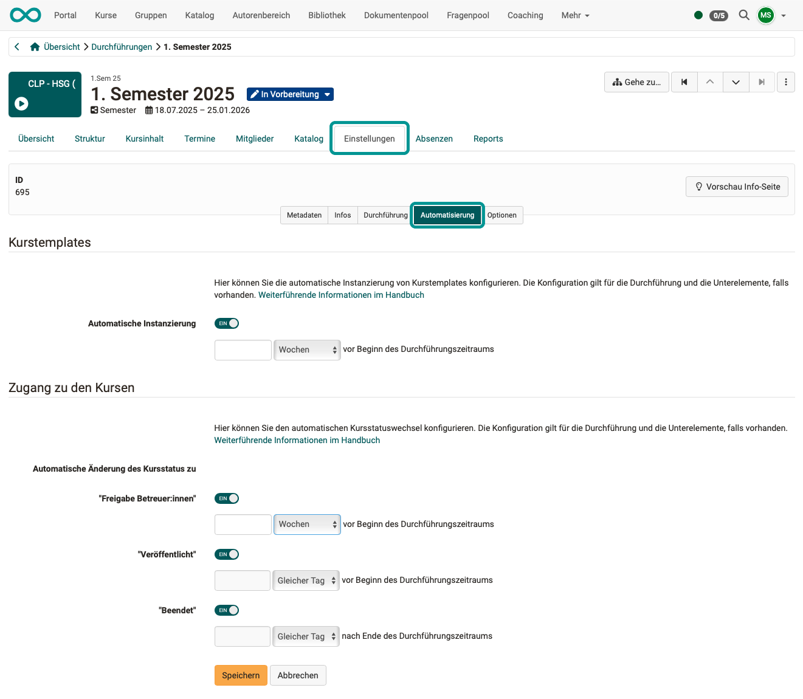{ class="shadow lightbox" }

#### Tab Settings > Options

Separate settings can be made here for each implementation:

- Calender configuration
- Schedule
- Absence configuration
- Absence management
- Progress configuration

[To the top of the page ^](#implementations)

---

### Tab Absences {: #tab_absences}

This tab only appears if absences have been activated on the element.

{ class="shadow lightbox" }

[To the top of the page ^](#implementations)

---

### Tab Reports {: #tab_reports}

The reports that can be created here relate to the currently selected implementation.

In contrast, the report creation, which can be called up in the [Overview](../../manual_user/area_modules/Course_Planner_Reports.md), refers to **all** executions. 
The structure of the Excel files (columns) and the procedure for creating them is identical for both.

{ class="shadow lightbox" }

Click on the **arrows in the "Execute"** column to generate Excel files with the current data using the listed templates.

You will then find the Excel files created in this way listed at the bottom of the screen. They can be copied and downloaded.

[To the top of the page ^](#implementations)

---

## Copy an implememtation {: #copy}

You will find the option to copy in the list of executions at the end of a line under the 3 dots.

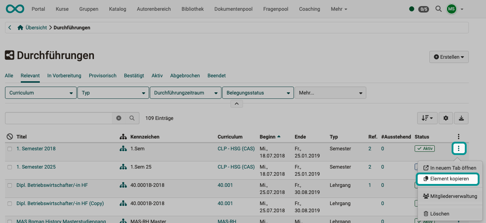{ class="shadow lightbox" } 

In the first step of the small wizard, you can select whether course content, dates and members should also be copied.

{ class="shadow lightbox" }  

The second step of the wizard shows you an overview of the elements that will now be copied. 
You can still make adjustments here (especially to the dates). 
Click on the + in front of an element to display the courses and dates for the element.

{ class="shadow lightbox" }  

An implementationn contains many different dates that are arranged in a specific order. When copying, all of this data can be automatically adjusted and moved together. It can be moved to a specific new start date (new reference point) or by a specified number of days.

{ class="shadow lightbox" }

{ class="shadow lightbox" } 

[To the top of the page ^](#implementations)

---

## Delete an implementation {: #delete}

You will also find the option to delete in the list of executions at the end of a line under the 3 dots.

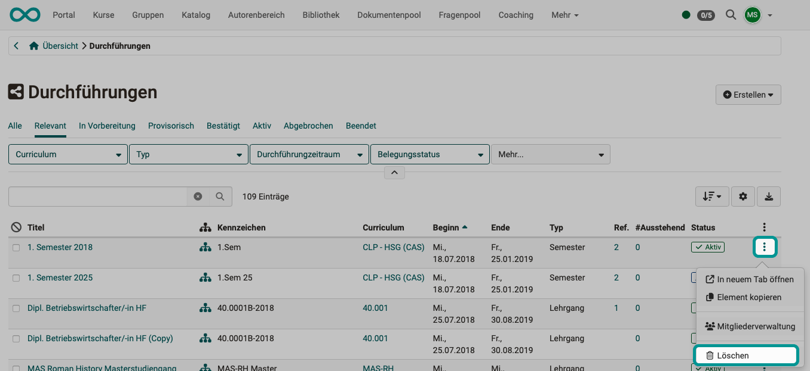{ class="shadow lightbox" }

If you have already displayed an execution, you will also find the option to delete it at the top right under the 3 dots.

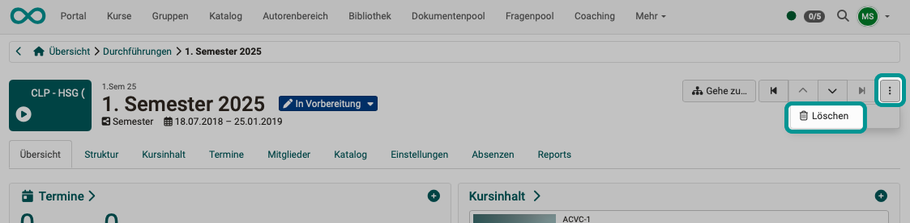{ class="shadow lightbox" } 

[To the top of the page ^](#implementations)

---

## Further information {: #further_information}

[How do I create my first OpenOlat course >](../../manual_how-to/my_first_course/my_first_course.md) 
[Course Planner: Overview >](../../manual_user/area_modules/Course_Planner.md) 
[Course Planner: Products >](../../manual_user/area_modules/Course_Planner_Products.md) 
[Course Planner: Events >](../../manual_user/area_modules/Course_Planner_Events.md) 
[Course Planner: Certification programs >](../../manual_user/area_modules/Course_Planner_Certification_Programs.md) 
[Course Planner: Reports >](../../manual_user/area_modules/Course_Planner_Reports.md) 
[How can I plan and run courses with the Course Planner? >](../../manual_how-to/course_planner_courses/course_planner_courses.md) 
[How can I plan and run a course with the Course Planner? >](../../manual_how-to/course_planner_curriculum/course_planner_curriculum.md) 
[Activate Course Planner (Admin) >](../../manual_admin/administration/Modules_Course_Planner.md) 
