# Course Planner: Import / Export {: #import_export}

Produkte, Durchführungen und Mitgliedschaften lassen sich im Course Planner über eine Excel-Datei exportieren und importieren. Der Import-Assistent prüft die Daten in jedem Schritt und zeigt vor der Ausführung genau an, was neu erstellt, geändert oder ignoriert wird [:octicons-tag-16:{ title="ab Release 20.3.0 (OO-9083)" }](https://track.frentix.com/issue/OO-9083){:target="_blank"}.

## Übersicht {: #overview}

Export und Import ergänzen die manuelle Erfassung im Course Planner: Bestehende Strukturen lassen sich als Excel-Datei exportieren, in dieser Datei bearbeiten und anschliessend wieder importieren, um Produkte, Durchführungen und Mitgliedschaften in grosser Zahl neu anzulegen oder zu aktualisieren.

Folgende Elemente können exportiert bzw. importiert werden:

* Produkte
* Durchführungen (Elemente, Templates, Kurse, Termine)
* Mitgliedschaften
* Benutzer:innen

Der Import-Assistent wird über das Mehr-Menü (⋮) auf dem Course-Planner-Dashboard gestartet.

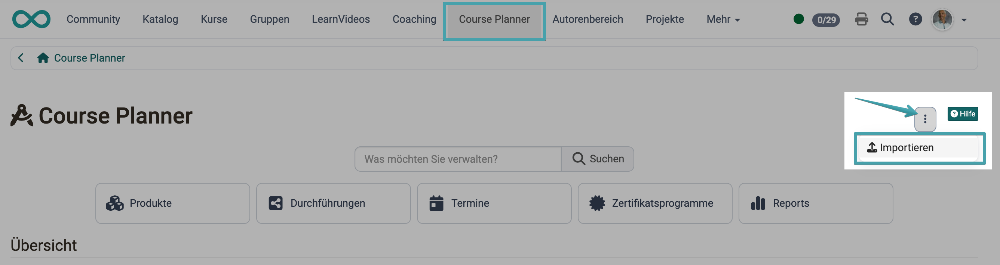{ class="shadow lightbox" }

[zum Seitenanfang ^](#import_export)

---

## Export {: #export}

### Einstiegspunkte {: #export_entry_points}

Der Export steht an mehreren Stellen im Course Planner zur Verfügung:

* Im Course-Planner-Dashboard, im Bereich "Produkte", "Durchführungen" oder "Termine": über das Mehr-Menü oder als Bulk-Aktion für mehrere ausgewählte Einträge
* Auf der Seite eines einzelnen Produkts: als globale Aktion, sowie im Tab "Durchführung" über Mehr-Menü oder Bulk-Aktion
* Auf der Seite einer einzelnen Durchführung: als globale Aktion

Ein Export auf Ebene der Durchführung enthält immer alle zugehörigen Angaben inklusive der Mitgliederdaten — auch bei einem Bulk-Export mehrerer ausgewählter Durchführungen.

##### Navigation unter Produkt
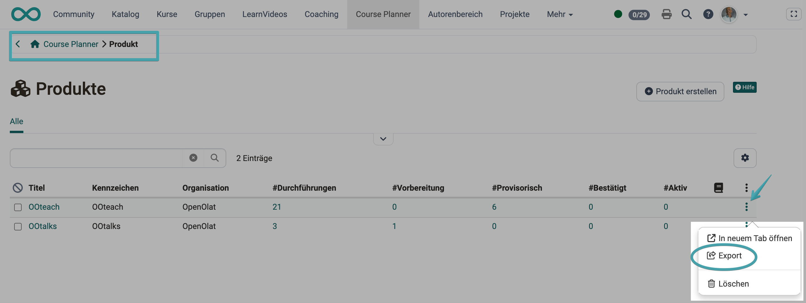{ class="shadow lightbox" }

**Bulk Vorgang**
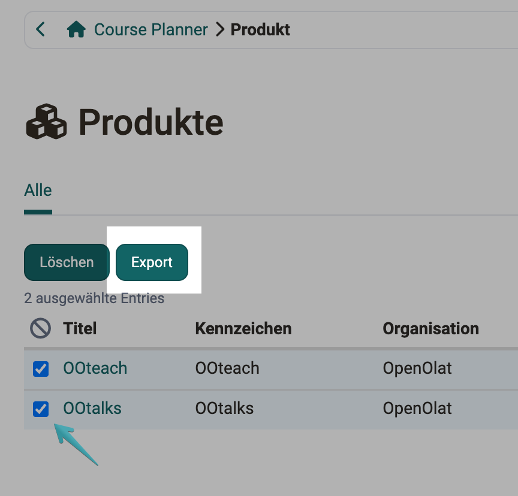{ class="shadow lightbox" }

##### Navigation unter Durchführung
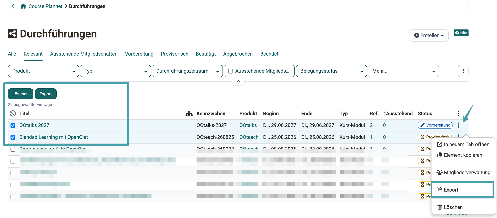{ class="shadow lightbox" }

##### Navigation unter Termine
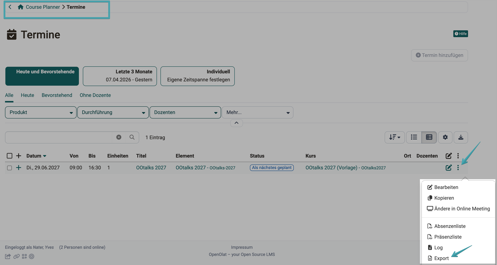{ class="shadow lightbox" }

##### Navigation unter Mitglieder
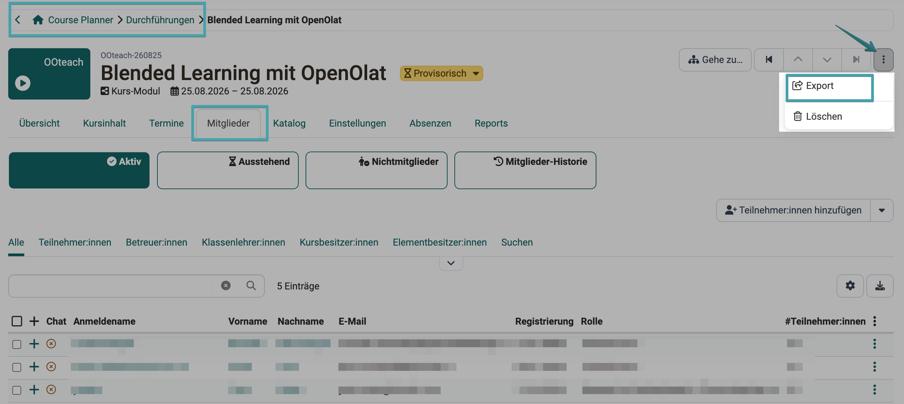{ class="shadow lightbox" }

Der Dateiname der exportierten Excel-Datei folgt dem Muster "CPL_Produkte_\<Datum und Zeit\>" [:octicons-tag-16:{ title="ab Release 20.3.0 (OO-9178)" }](https://track.frentix.com/issue/OO-9178){:target="_blank"}.

### Aufbau der Excel-Datei {: #export_file_structure}

Die exportierte Excel-Datei enthält je nach Exportart bis zu vier Sheets:

* **Produkte:** Titel, Kennzeichen, ORG-Kennzeichen, Absenzen, Beschreibung, Erstellungsdatum, zuletzt geändert
* **Durchführungen:** eine Zeile pro Objekt (Durchführung, Element, Template, Kurs oder Termin), mit Objekttyp, Kennzeichen, Titel, Status, Zeitraum sowie typspezifischen Feldern wie Kalender, Absenzen, Fortschritt oder Fachbereich
* **Mitgliedschaften:** Zuordnung von Benutzer:innen zu Durchführungen mit Rolle (Teilnehmer:in, Betreuer:in, Klassenlehrer:in, Kursbesitzer:in, Elementbesitzer:in)
* **Benutzer:innen:** Anmeldename, Vorname, Nachname, E-Mail, Organisationszugehörigkeit, Kontoablauf [:octicons-tag-16:{ title="ab Release 20.3.2 (OO-9438)" }](https://track.frentix.com/issue/OO-9438){:target="_blank"}

Zusätzlich enthält jede Export-Datei ein Sheet "Exportinformationen" mit URL, OpenOlat-Version, Exportsprache sowie Datum und Name der exportierenden Person [:octicons-tag-16:{ title="ab Release 20.3.0 (OO-9217)" }](https://track.frentix.com/issue/OO-9217){:target="_blank"}.

!!! tip "Tipp"

    Für einen Import empfiehlt es sich, zuerst einen Export der bestehenden Struktur durchzuführen und diese Datei als Grundlage zu verwenden, statt die Datei von Grund auf neu zu erstellen.

[zum Seitenanfang ^](#import_export)

---

## Import-Assistent {: #import_wizard}

Der Import-Button steht auf dem Course-Planner-Dashboard nur Benutzer:innen mit der Rolle "Kursplaner:in" oder "Administrator:in" zur Verfügung.

Der Import-Assistent führt in fünf Schritten durch die Kontrolle und Ausführung des Imports. Enthalten die Daten Fehler, kann der Assistent nicht abgeschlossen werden, solange die entsprechenden Zeilen nicht ignoriert werden [:octicons-tag-16:{ title="ab Release 20.3.0 (OO-9191)" }](https://track.frentix.com/issue/OO-9191){:target="_blank"}.

### Umgang mit Fehlern und Warnungen {: #errors_warnings}

Jede fehlerhafte Zelle wird direkt in der Tabelle mit Spaltenname und Grund angezeigt, zum Beispiel "Ext. Ref.: Wert erforderlich" oder "ORG - Kennzeichen: \<Wert\> existiert nicht". Enthält eine Zeile mindestens einen Fehler, wird sie automatisch vom Import ausgeschlossen.

!!! note "Hinweis"

    Die Spaltenbezeichnungen unterscheiden sich leicht zwischen Excel-Datei und Wizard-Ansicht: In der Excel-Datei heisst die Spalte "Kennzeichen", im Wizard-Bildschirm wird sie als "Ext. Ref." angezeigt.

Warnungen verhindern den Import nicht, weisen aber auf mögliche Probleme hin, zum Beispiel wenn ein Wert zu lang ist und deshalb gekürzt wird, oder wenn sich ein Element seit dem letzten Export bereits geändert hat.

Die vollständige Liste aller Fehler- und Warnungscodes finden Sie in der [Import/Export: Referenz](Course_Planner_Import_Export_Reference.de.md#errors_warnings_reference).

#### Schritt 1: Datei auswählen {: #step1}

Laden Sie die Excel-Datei mit den zu importierenden Daten hoch. Die Beispieldatei ist zu finden, wenn der Importvorgang gestartet wird. Diese verlinkte Datei kann dort heruntergeladen werden.

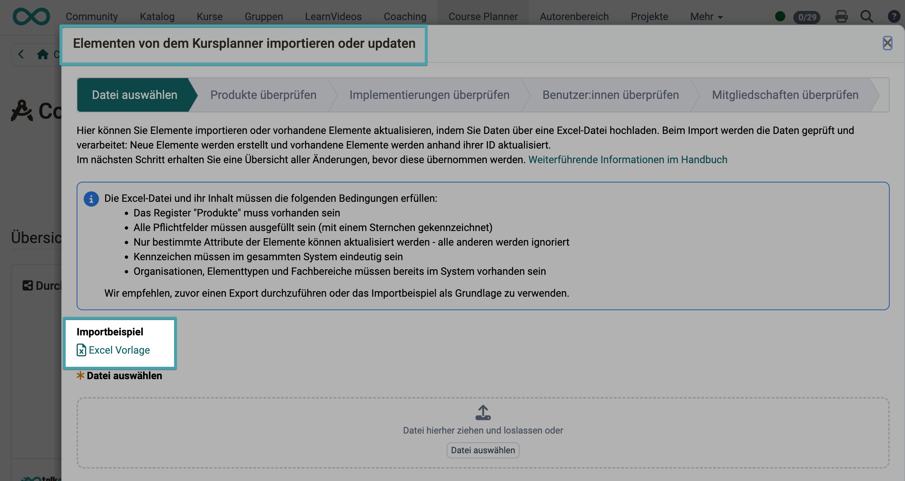{ class="shadow lightbox" }

!!! info "Wichtig"

    Die Excel-Datei muss folgende Bedingungen erfüllen: Das Sheet "Produkte" muss vorhanden sein, alle mit einem Sternchen (\*) gekennzeichneten Pflichtfelder müssen ausgefüllt sein, Kennzeichen müssen im gesamten System eindeutig sein, und Organisationen, Elementtypen und Fachbereiche müssen bereits im System vorhanden sein.

#### Schritt 2: Produkte überprüfen {: #step2}

Die Tabelle zeigt alle Produkte aus der Excel-Datei mit ihrem Importstatus: "Keine Änderungen", "Geändert" oder "Neu". Über vordefinierte Filter ("Alle", "Geändert", "Neu", "Ignoriert", "Mit Fehlern", "Mit Warnungen", "Mit Änderungen") lässt sich die Liste einschränken.

Enthält eine Zeile einen Fehler, wird sie automatisch vom Import ausgeschlossen und farblich hervorgehoben. Über die Checkbox "Ignoriert" können auch fehlerfreie Zeilen gezielt vom Import ausgeschlossen werden.

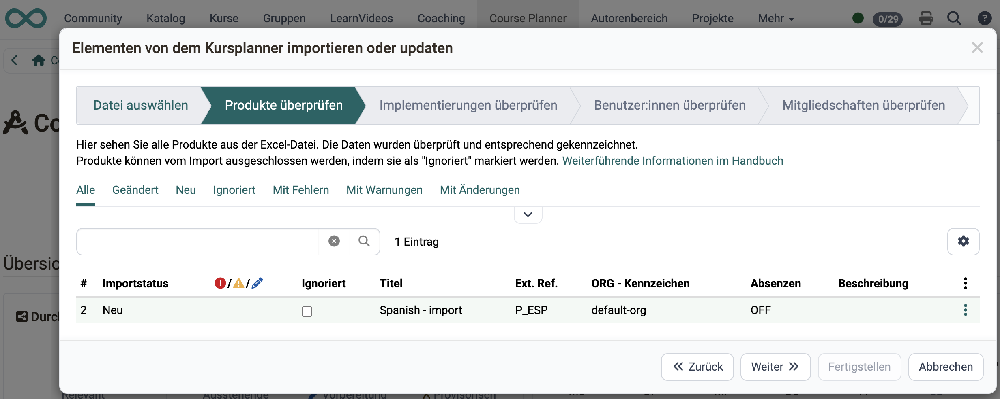{ class="shadow lightbox" }

#### Schritt 3: Implementierungen überprüfen {: #step3}

Analog zu Schritt 2, hier für die Durchführungsstruktur (Elemente, Templates, Kurse, Termine). Ein zusätzlicher Filter "Objekttyp" erlaubt das Einschränken nach Art des Objekts [:octicons-tag-16:{ title="ab Release 20.3.0 (OO-9210)" }](https://track.frentix.com/issue/OO-9210){:target="_blank"}.

Wird ein übergeordnetes Element ignoriert oder enthält es einen Fehler, werden auch alle untergeordneten Objekte automatisch vom Import ausgeschlossen.

!!! info "Wichtig"

    Ist ein Kurs mit dem Verwendungszweck "Eigenständig" konfiguriert, wird für Administrator:innen ausnahmsweise nur eine Warnung statt eines Fehlers angezeigt, damit auch ältere, nicht auf den Course Planner umgestellte Kurse importiert werden können. Es wird empfohlen, nur Kurse mit dem Verwendungszweck "Verwendung im Course Planner" zu verwenden [:octicons-tag-16:{ title="ab Release 20.3.1 (OO-9424)" }](https://track.frentix.com/issue/OO-9424){:target="_blank"}.

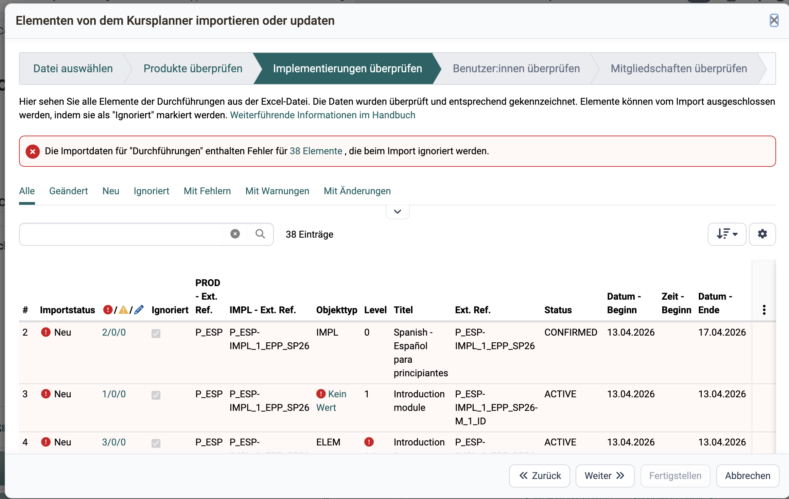{ class="shadow lightbox" }

#### Schritt 4: Benutzer:innen überprüfen {: #step4}

Die Tabelle zeigt alle Benutzer:innen aus der Excel-Datei mit Anmeldename, Vor- und Nachname, E-Mail und Organisationszugehörigkeit. Auch Benutzer:innen können nur neu angelegt, nicht aktualisiert werden.

!!! info "Wichtig"

    Ist auf der Instanz die Option "E-Mail obligatorisch" nicht aktiviert, kann das Feld E-Mail leer bleiben [:octicons-tag-16:{ title="ab Release 20.3.2 (OO-9438)" }](https://track.frentix.com/issue/OO-9438){:target="_blank"}.

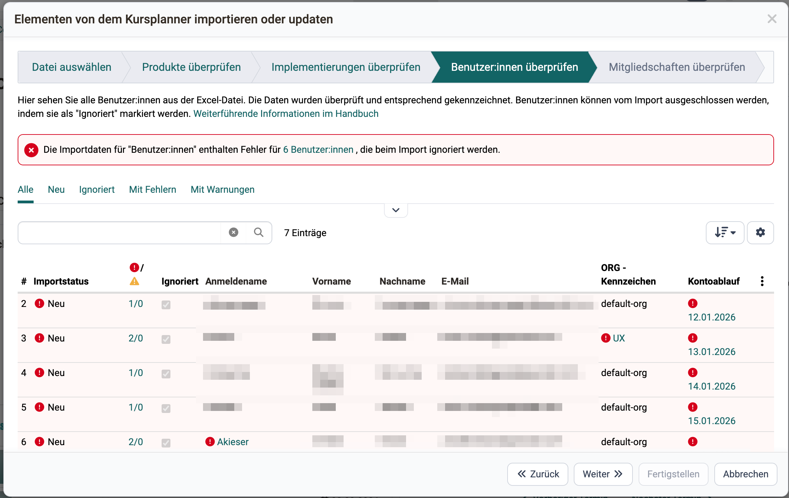{ class="shadow lightbox" }

#### Schritt 5: Mitgliedschaften überprüfen {: #step5}

Die Tabelle zeigt alle Mitgliedschaften aus der Excel-Datei mit Produkt, Durchführung, Rolle und Anmeldename. Mitgliedschaften können nur neu angelegt, nicht aktualisiert werden [:octicons-tag-16:{ title="ab Release 20.3.0 (OO-9224)" }](https://track.frentix.com/issue/OO-9224){:target="_blank"}.

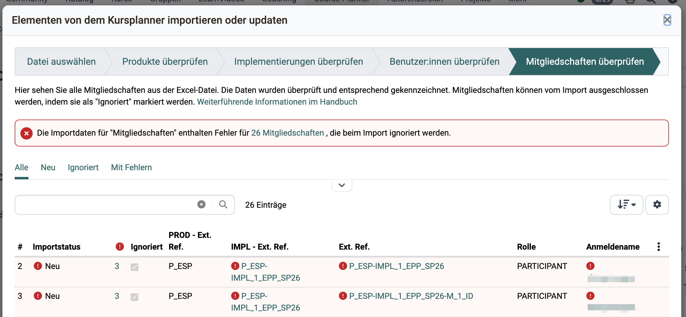{ class="shadow lightbox" }

[zum Seitenanfang ^](#import_export)

---

## Weitere Informationen {: #further_information}

[Course Planner: Übersicht >](Course_Planner.de.md) 
[Course Planner: Produkte >](Course_Planner_Products.de.md) 
[Course Planner: Durchführungen >](Course_Planner_Implementations.de.md) 
[Import/Export: Referenz >](Course_Planner_Import_Export_Reference.de.md) 

[zum Seitenanfang ^](#import_export)
