# Course Planner: Import / Export {: #import_export}

Produkte, Durchführungen und Mitgliedschaften lassen sich im Course Planner über eine Excel-Datei exportieren und importieren. Der Import-Assistent prüft die Daten in jedem Schritt und zeigt vor der Ausführung genau an, was neu erstellt, geändert oder ignoriert wird [:octicons-tag-16:{ title="ab Release 20.3.0 (OO-9083)" }](https://track.frentix.com/issue/OO-9083){:target="_blank"}.

## Übersicht {: #overview}

Export und Import ergänzen die manuelle Erfassung im Course Planner: Bestehende Strukturen lassen sich als Excel-Datei exportieren, in dieser Datei bearbeiten und anschliessend wieder importieren, um Produkte, Durchführungen und Mitgliedschaften in grosser Zahl neu anzulegen oder zu aktualisieren.

Gedacht sind Export und Import für Aufgaben, die viele Objekte gleichzeitig betreffen. Einzelne Änderungen an einem Produkt, einer Durchführung oder einer Mitgliedschaft erfolgen einfacher direkt auf der Oberfläche. Typische Einsatzfälle sind:

* das Anlegen vieler neuer Produkte, Durchführungen und Termine auf einmal
* das Abstimmen von Datum, Zeit, Ort und Räumen mehrerer Termine
* die Kontrolle der Planungsdaten: Der Import-Assistent prüft eine Datei vollständig und zeigt Fehler und Warnungen an. Wird er vor dem Abschluss abgebrochen, ändert er nichts.
* die Archivierung eines Planungsstands als Excel-Datei. Kurse und Templates sind darin über ihr Kennzeichen enthalten: Ist ein Kurs oder Template auf der Instanz genau einmal mit diesem Kennzeichen vorhanden, verknüpft ein erneuter Import ihn wieder. Passwörter enthält der Export nicht. Für neue Konten lassen sie sich beim Import setzen, in einer zusätzlichen Spalte nach "Erstellungsdatum" im Sheet "Konten". Bei bestehenden Konten muss diese Spalte leer bleiben.
* das Einrichten einer Demo- oder Testumgebung, sofern dort Organisationen, Elementtypen, Fachbereiche, Räume sowie Kurse und Templates mit denselben Kennzeichen bereits existieren

!!! warning "Achtung"

    Ein Import ändert viele Objekte in einem Durchgang. Es empfiehlt sich, vor jedem Import den aktuellen Stand zu exportieren und die Übersicht jedes Schritts genau zu prüfen. Grössere Importe sollten zuerst auf einer Testinstanz durchgeführt werden.

Folgende Elemente können exportiert bzw. importiert werden:

* Produkte
* Durchführungen (Elemente, Templates, Kurse, Termine)
* Mitgliedschaften: welche Person in welcher Rolle zu einer Durchführung oder einem ihrer Elemente gehört
* Konten: der Zugang der Personen zu OpenOlat, mit Anmeldename und Profilangaben

Wie Konten und Mitgliedschaften zusammenhängen und was der Import mit ihnen tut, beschreibt der Abschnitt [Konten und Mitgliedschaften](#accounts_memberships).

Der Import-Assistent wird über das Mehr-Menü (⋮) auf dem Course-Planner-Dashboard gestartet.

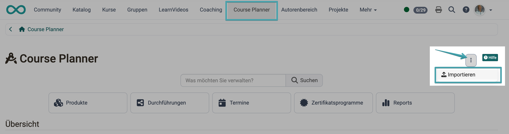{ class="shadow lightbox" title="Startseite des Course Planners" }

[zum Seitenanfang ^](#import_export)

---

## Export [:octicons-tag-16:{ title="ab Release 20.3.0 (OO-9178)" }](https://track.frentix.com/issue/OO-9178){:target="_blank"} {: #export}

### Einstiegspunkte {: #export_entry_points}

Der Export steht an mehreren Stellen im Course Planner zur Verfügung:

* Im Course-Planner-Dashboard, im Bereich "Produkte", "Durchführungen" oder "Termine": über das Mehr-Menü oder als Bulk-Aktion für mehrere ausgewählte Einträge
* Auf der Seite eines einzelnen Produkts: als globale Aktion, sowie im Tab "Durchführung" über Mehr-Menü oder Bulk-Aktion
* Auf der Seite einer einzelnen Durchführung: als globale Aktion

Ein Export auf Ebene der Durchführung enthält immer alle zugehörigen Angaben inklusive der Mitgliederdaten, auch bei einem Bulk-Export mehrerer ausgewählter Durchführungen.

##### Navigation unter Produkt
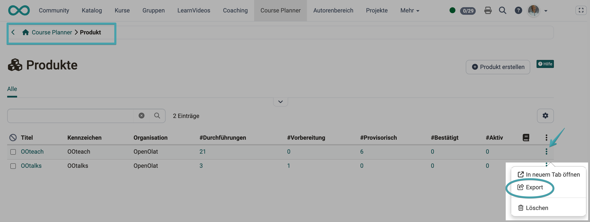{ class="shadow lightbox" title="Produktliste des Course Planners" }

##### Bulk-Aktion unter Produkt
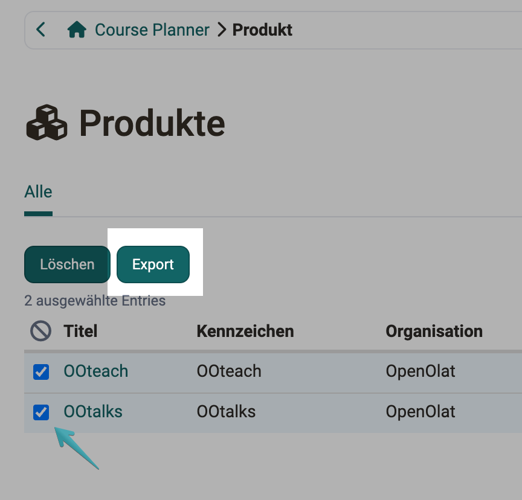{ class="shadow lightbox thumbnail-xl" title="Produktliste mit zwei ausgewählten Produkten" }

##### Navigation unter Durchführung
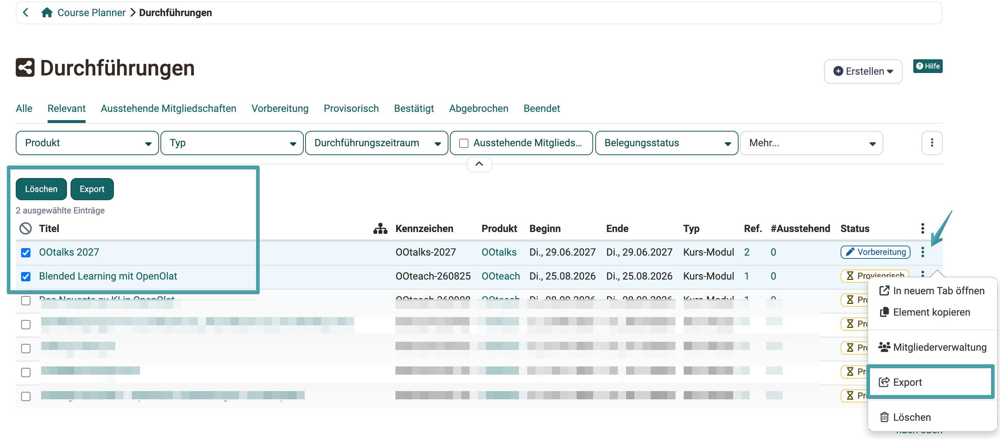{ class="shadow lightbox" title="Liste der Durchführungen im Course Planner" }

##### Navigation unter Termine
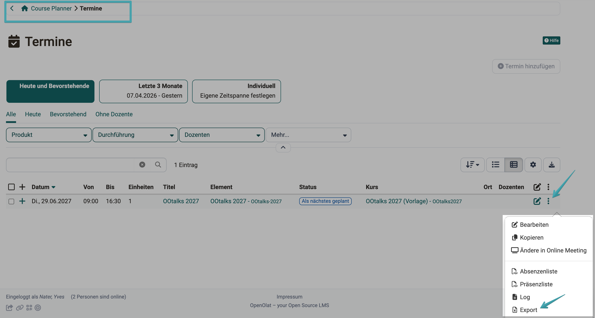{ class="shadow lightbox" title="Terminliste des Course Planners" }

##### Navigation unter Mitglieder
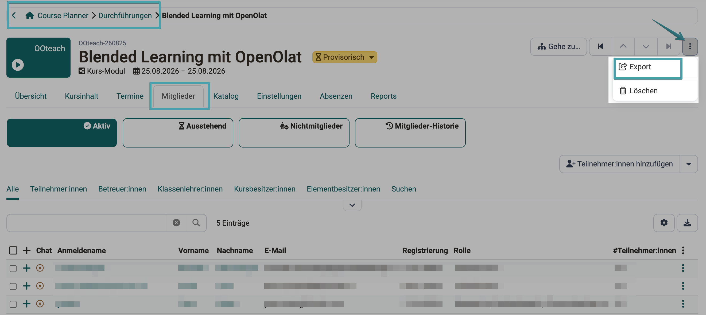{ class="shadow lightbox" title="Tab Mitglieder einer Durchführung" }

Der Dateiname der exportierten Excel-Datei folgt dem Muster "CPL_Produkte_\<Datum und Zeit\>" [:octicons-tag-16:{ title="ab Release 20.3.0 (OO-9178)" }](https://track.frentix.com/issue/OO-9178){:target="_blank"}.

### Aufbau der Excel-Datei {: #export_file_structure}

Die exportierte Excel-Datei enthält je nach Exportart bis zu vier Sheets:

* **Produkte:** Titel, Kennzeichen, ORG-Kennzeichen, Absenzen, Beschreibung, Erstellungsdatum, zuletzt geändert
* **Durchführungen:** eine Zeile pro Objekt (Durchführung, Element, Template, Kurs oder Termin), mit Objekttyp, Kennzeichen, Titel, Status, Zeitraum sowie typspezifischen Feldern wie Kalender, Absenzen, Fortschritt oder Fachbereich. Der Fachbereich-Pfad beginnt mit dem Taxonomie-Identifier ("\<Identifier\>:/\<Pfad\>") [:octicons-tag-16:{ title="ab Release 21.0 (OO-9440)" }](https://track.frentix.com/issue/OO-9440){:target="_blank"}. Bei Terminen folgt nach dem Ort die Spalte "Räume" mit den gebuchten Räumen im Format "Gebäude-Kennzeichen:Raum-Kennzeichen", mehrere Räume durch Semikolon getrennt. Was der Import mit dieser Spalte tut, beschreibt der Abschnitt [Räume von Terminen](#import_rooms).
* **Mitgliedschaft:** eine Zeile pro Mitgliedschaft, mit den Kennzeichen von Produkt, Durchführung und Element ("PROD - Kennzeichen", "IMPL - Kennzeichen", "Kennzeichen"), der Rolle und dem Anmeldenamen. Die Rolle steht als fester Wert, zum Beispiel PARTICIPANT für Teilnehmer:in; alle Werte listet die [Referenz](Course_Planner_Import_Export_Reference.de.md#enum_reference).
* **Konten:** eine Zeile pro Person, die im Sheet "Mitgliedschaft" vorkommt: Anmeldename, Vorname, Nachname, E-Mail, Organisationszugehörigkeit, Kontoablauf [:octicons-tag-16:{ title="ab Release 20.3.2 (OO-9438)" }](https://track.frentix.com/issue/OO-9438){:target="_blank"}, Erstellungsdatum

Zusätzlich enthält jede Export-Datei ein Sheet "Exportinformationen" mit URL, OpenOlat-Version, Exportsprache sowie Datum und Name der exportierenden Person [:octicons-tag-16:{ title="ab Release 20.3.0 (OO-9217)" }](https://track.frentix.com/issue/OO-9217){:target="_blank"}.

!!! tip "Tipp"

    Für einen Import empfiehlt es sich, zuerst einen Export der bestehenden Struktur durchzuführen und diese Datei als Grundlage zu verwenden, statt die Datei von Grund auf neu zu erstellen.

[zum Seitenanfang ^](#import_export)

---

## Import-Assistent {: #import_wizard}

Der Import-Button steht auf dem Course-Planner-Dashboard nur Personen mit der Rolle "Kursplaner:in" oder "Administrator:in" zur Verfügung.

Der Import-Assistent öffnet sich als Dialog "Elemente vom Course Planner importieren oder aktualisieren" und führt in fünf Schritten durch die Kontrolle und Ausführung des Imports. Enthalten die Daten Fehler, kann der Assistent nicht abgeschlossen werden, solange die entsprechenden Zeilen nicht ignoriert werden [:octicons-tag-16:{ title="ab Release 20.3.0 (OO-9191)" }](https://track.frentix.com/issue/OO-9191){:target="_blank"}.

### Das Kennzeichen verbindet Datei und System {: #identifier_matching}

Der Import erkennt am Kennzeichen, ob eine Zeile ein bestehendes Objekt aktualisiert oder ein neues anlegt. Findet er genau ein Objekt mit demselben Kennzeichen, vergleicht er die Werte und zeigt die Zeile als "Geändert" oder "Keine Änderungen". Findet er keines, zeigt er die Zeile als "Neu", ausser bei Kursen und Templates. Findet er mehrere, meldet er "Kennzeichen: Wert nicht eindeutig".

Gesucht wird je nach Objekt in einem anderen Bereich:

* **Produkt:** unter allen aktiven Produkten
* **Durchführung:** innerhalb des angegebenen Produkts
* **Element:** innerhalb der angegebenen Durchführung
* **Termin:** im ganzen System, über das Kennzeichen des Termins
* **Kurs und Template:** im ganzen System, über das Kennzeichen der Lernressource. Kurse und Templates legt der Import nie an. Findet er keine Lernressource, meldet er "Kennzeichen: \<Wert\> existiert nicht". Ist die Lernressource noch nicht mit dem übergeordneten Element verknüpft, zeigt er die Zeile als "Neu" und verknüpft sie beim Import.

!!! warning "Achtung"

    Ein Kennzeichen lässt sich über den Import nicht umbenennen. Wird in der Excel-Datei das Kennzeichen eines bestehenden Produkts, einer Durchführung, eines Elements oder eines Termins geändert, legt der Import ein zusätzliches Objekt an. Das bestehende Objekt bleibt unverändert. Wer bestehende Einträge aktualisieren will, übernimmt die Kennzeichen aus dem Export unverändert.

### Konten und Mitgliedschaften [:octicons-tag-16:{ title="ab Release 20.3.0 (OO-9224)" }](https://track.frentix.com/issue/OO-9224){:target="_blank"} {: #accounts_memberships}

Wer mit dem Import Personen in Durchführungen einschreibt, füllt zwei Sheets, die zusammengehören: Das Sheet "Konten" sagt, wer die Person ist, das Sheet "Mitgliedschaft" sagt, wo sie in welcher Rolle mitmacht. Ein Konto ist der Zugang einer Person zu OpenOlat, mit Anmeldename, Profilangaben und Organisationszugehörigkeit. Eine Mitgliedschaft verbindet ein Konto mit einer Rolle in einer Durchführung oder in einem ihrer Elemente.

| | Sheet "Konten" | Sheet "Mitgliedschaft" |
|---|---|---|
| Eine Zeile beschreibt | ein Konto | eine Person in einer Rolle in einer Durchführung oder einem Element |
| Zeilen pro Person | genau eine | eine pro Durchführung oder Element und Rolle |
| Schritt im Import-Assistenten | Schritt 4 "Benutzer:innen überprüfen" | Schritt 5 "Mitgliedschaften überprüfen" |
| Importstatus "Neu" | Der Anmeldename existiert im System noch nicht. Der Import legt das Konto an. | Die Person hat diese Rolle im Element noch nicht. Der Import fügt sie als Mitglied hinzu. |
| Importstatus "Keine Änderungen" | Das Konto existiert. Der Import verwendet es, ändert es aber nicht. | Die Person hat diese Rolle im Element bereits. |

Schritt 4 heisst "Benutzer:innen überprüfen" und zeigt die Zeilen des Sheets "Konten": Beide Bezeichnungen meinen dieselben Datensätze.

Die beiden Sheets sind über den Anmeldenamen verbunden. Jeder Anmeldename im Sheet "Mitgliedschaft" muss im Sheet "Konten" stehen, und jedes Konto im Sheet "Konten" braucht mindestens eine Mitgliedschaft. Fehlt die Gegenseite, meldet der Import beim Anmeldenamen einen Fehler. Wird ein Konto ignoriert oder enthält es einen Fehler, schliesst der Import auch alle Mitgliedschaften dieser Person aus.

Ein bestehendes Konto ändert der Import nicht. Abweichende Angaben in der Datei übernimmt er nicht; bei Vor- und Nachname, Organisationszugehörigkeit und Kontoablauf zeigt er dazu eine Warnung. Ebenso entfernt der Import keine Mitgliedschaft: Eine Person, die im System Mitglied ist und in der Datei fehlt, bleibt Mitglied.

Der Import liest die Sheets nach ihrer Reihenfolge, nicht nach ihrem Namen: das dritte Sheet als Mitgliedschaften, das vierte als Konten. Behalten Sie deshalb die Reihenfolge aus dem Export bei.

### Räume von Terminen [:octicons-tag-16:{ title="ab Release 21.0.1 (OO-9303)" }](https://track.frentix.com/issue/OO-9303){:target="_blank"} {: #import_rooms}

Planen Sie viele Termine auf einmal, buchen Sie deren Räume im selben Durchgang mit dem Import. Die Räume stehen in der Spalte "Räume" im Sheet "Durchführungen". Der Import wertet die Spalte nur bei Terminen (Objekttyp EVENT) aus. Bei allen anderen Objekttypen ist sie im Export leer, und der Import übergeht einen Wert dort ohne Meldung.

Jeder Raum steht in der Zelle mit dem Kennzeichen seines Gebäudes und seinem eigenen Kennzeichen, getrennt durch einen Doppelpunkt, zum Beispiel "BG_1:AULA". Mehrere Räume trennt ein Semikolon: "BG_1:AULA;BG_1:H101". Beide Kennzeichen vergibt die Administration im [Modul Räume](../../manual_admin/administration/Modules_Rooms.de.md#rooms). Die Kennzeichen bereits gebuchter Räume stehen im Export.

!!! warning "Achtung"

    Der Import ersetzt die Raumbuchungen eines Termins, er ergänzt sie nicht. Er bucht die Räume, die in der Zelle stehen, und entfernt jede bestehende Buchung, deren Raum in der Zelle fehlt. Eine leere Zelle "Räume" bei einem bestehenden Termin entfernt deshalb alle Raumbuchungen dieses Termins. Der Import-Assistent zeigt eine solche Zeile im Schritt "Durchführungen überprüfen" als "Geändert" an.

Der Import prüft nicht, ob ein Raum zur Zeit des Termins frei ist, und bucht auch inaktive Räume. In der Oberfläche lassen sich dagegen nur aktive Räume auswählen. Doppelbuchungen und inaktive Räume zeigt die Raumplanung nach dem Import als [Warnungen](Course_Planner_Rooms.de.md#warnings) an.

### Umgang mit Fehlern und Warnungen {: #errors_warnings}

Jede fehlerhafte Zelle wird direkt in der Tabelle mit Spaltenname und Grund angezeigt, zum Beispiel "Kennzeichen: Wert erforderlich" oder "ORG - Kennzeichen: \<Wert\> existiert nicht". Enthält eine Zeile mindestens einen Fehler, wird sie automatisch vom Import ausgeschlossen.

Über der Tabelle nennt eine Fehlermeldung, wie viele Zeilen des Schritts Fehler enthalten. Ein Klick auf diese Anzahl wählt den Filter "Mit Fehlern". Die Spalte mit den Symbolen für Fehler, Warnungen und Änderungen zählt diese je Zeile, zum Beispiel "1/0/0". Ein Klick auf die Zahlen listet die Meldungen der Zeile auf, ein Klick auf eine markierte Zelle zeigt deren Meldung.

Warnungen verhindern den Import nicht, weisen aber auf mögliche Probleme hin, zum Beispiel wenn ein Wert zu lang ist und deshalb gekürzt wird, oder wenn sich ein Element seit dem letzten Export bereits geändert hat.

Die vollständige Liste aller Fehler- und Warnungscodes finden Sie in der [Import/Export: Referenz](Course_Planner_Import_Export_Reference.de.md#errors_warnings_reference).

#### Schritt 1: Datei auswählen {: #step1}

Laden Sie die Excel-Datei mit den zu importierenden Daten hoch. Eine Beispieldatei steht unter "Importbeispiel" über den Link "Excel Vorlage" zum Herunterladen bereit.

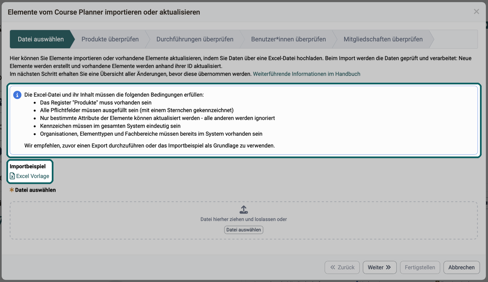{ class="shadow lightbox" title="Schritt Datei auswählen des Import-Assistenten · 2026.10.07" }

!!! info "Wichtig"

    Die Excel-Datei muss folgende Bedingungen erfüllen: Das Sheet "Produkte" muss vorhanden sein, alle mit einem Sternchen (\*) gekennzeichneten Pflichtfelder müssen ausgefüllt sein, Kennzeichen müssen im gesamten System eindeutig sein, und Organisationen, Elementtypen und Fachbereiche müssen bereits im System vorhanden sein. Nur bestimmte Attribute lassen sich aktualisieren, alle anderen ignoriert der Import. Welche das sind, zeigt die Spalte "Aktualisierbar" in der [Referenz](Course_Planner_Import_Export_Reference.de.md#attribute_rules).

#### Schritt 2: Produkte überprüfen {: #step2}

Die Tabelle zeigt alle Produkte aus der Excel-Datei mit ihrem Importstatus: "Keine Änderungen", "Geändert" oder "Neu". Über vordefinierte Filter ("Alle", "Geändert", "Neu", "Ignoriert", "Mit Fehlern", "Mit Warnungen", "Mit Änderungen") lässt sich die Liste einschränken.

Enthält eine Zeile einen Fehler, wird sie automatisch vom Import ausgeschlossen und farblich hervorgehoben. Über die Checkbox "Ignoriert" können auch fehlerfreie Zeilen gezielt vom Import ausgeschlossen werden. Zeilen mit dem Importstatus "Keine Änderungen" haben keine solche Checkbox, denn der Import ändert sie ohnehin nicht.

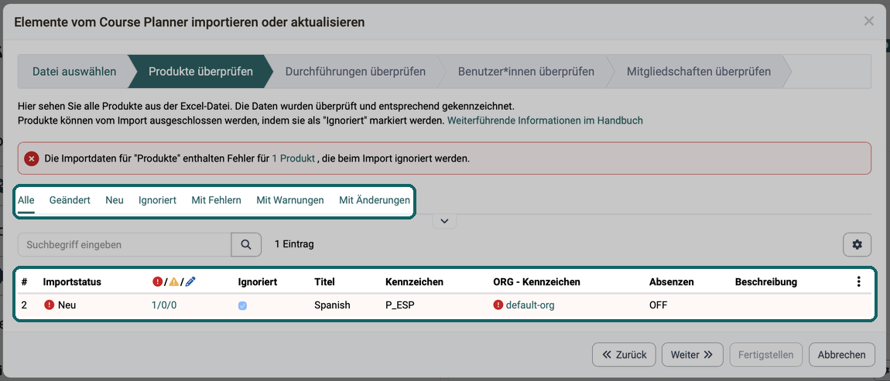{ class="shadow lightbox" title="Schritt Produkte überprüfen des Import-Assistenten · 2026.10.07" }

#### Schritt 3: Durchführungen überprüfen {: #step3}

Analog zu Schritt 2, hier für die Durchführungsstruktur (Elemente, Templates, Kurse, Termine). Ein zusätzlicher Filter "Objekttyp" erlaubt das Einschränken nach Art des Objekts [:octicons-tag-16:{ title="ab Release 20.3.0 (OO-9210)" }](https://track.frentix.com/issue/OO-9210){:target="_blank"}.

Wird ein übergeordnetes Element ignoriert oder enthält es einen Fehler, werden auch alle untergeordneten Objekte automatisch vom Import ausgeschlossen.

Ist das Modul "Termine und Absenzen" auf der Instanz deaktiviert, werden Termine beim Import automatisch als "Ignoriert" gesetzt [:octicons-tag-16:{ title="ab Release 21.0 (OO-9440)" }](https://track.frentix.com/issue/OO-9440){:target="_blank"}.

!!! info "Wichtig"

    Ist ein Kurs mit dem Verwendungszweck "Eigenständig" konfiguriert, wird für Administrator:innen ausnahmsweise nur eine Warnung statt eines Fehlers angezeigt, damit auch ältere, nicht auf den Course Planner umgestellte Kurse importiert werden können. Es wird empfohlen, nur Kurse mit dem Verwendungszweck "Verwendung im Course Planner" zu verwenden [:octicons-tag-16:{ title="ab Release 20.3.1 (OO-9424)" }](https://track.frentix.com/issue/OO-9424){:target="_blank"}.

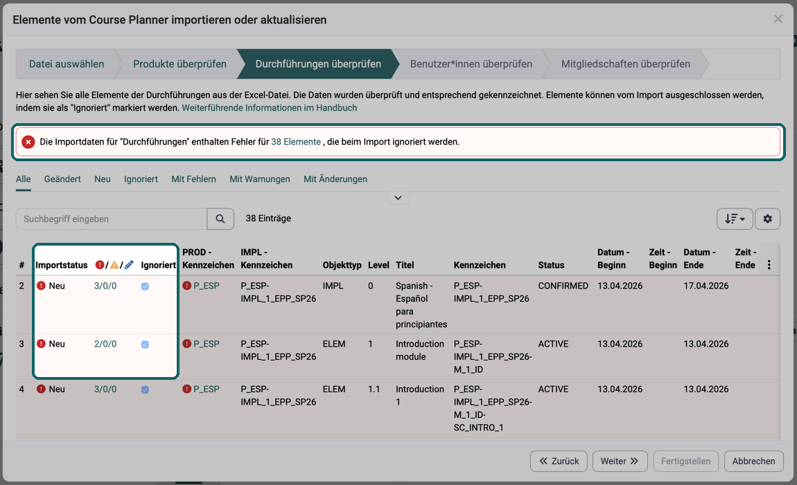{ class="shadow lightbox" title="Schritt Durchführungen überprüfen des Import-Assistenten · 2026.10.07" }

#### Schritt 4: Benutzer:innen überprüfen {: #step4}

Die Tabelle zeigt die Konten aus dem Sheet "Konten" mit Anmeldename, Vor- und Nachname, E-Mail, ORG - Kennzeichen und Kontoablauf. Der Import legt nur neue Konten an und ändert bestehende nicht, siehe [Konten und Mitgliedschaften](#accounts_memberships). Die Filter beschränken sich deshalb auf "Alle", "Neu", "Ignoriert", "Mit Fehlern" und "Mit Warnungen".

!!! info "Wichtig"

    Ist auf der Instanz die Option "E-Mail obligatorisch" nicht aktiviert, kann das Feld E-Mail leer bleiben [:octicons-tag-16:{ title="ab Release 20.3.2 (OO-9438)" }](https://track.frentix.com/issue/OO-9438){:target="_blank"}.

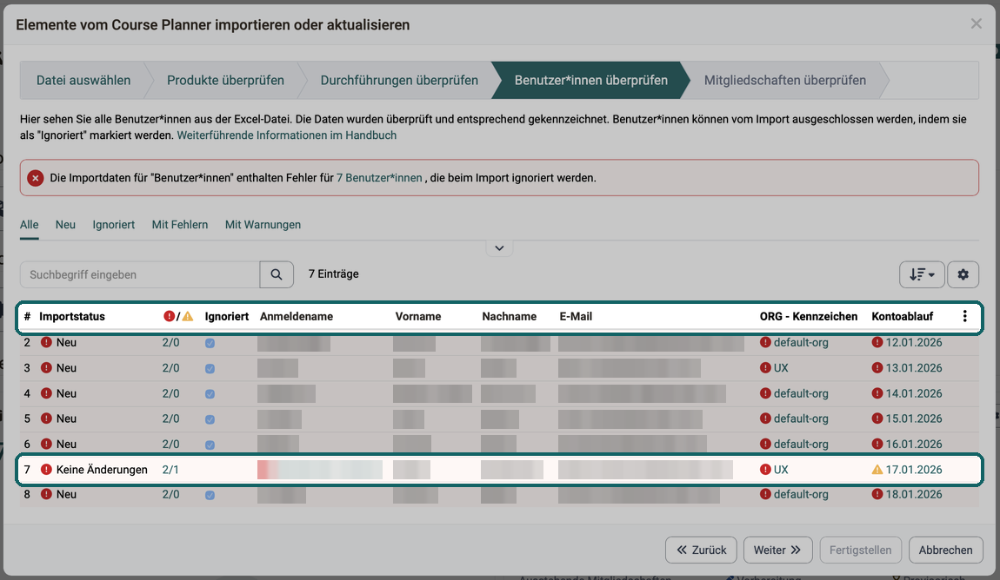{ class="shadow lightbox" title="Schritt Benutzer:innen überprüfen des Import-Assistenten · 2026.10.07" }

#### Schritt 5: Mitgliedschaften überprüfen {: #step5}

Die Tabelle zeigt die Mitgliedschaften aus dem Sheet "Mitgliedschaft" mit den Kennzeichen von Produkt, Durchführung und Element, der Rolle und dem Anmeldenamen. Der Import fügt nur neue Mitgliedschaften hinzu; bestehende ändert oder entfernt er nicht. Die Filter beschränken sich auf "Alle", "Neu", "Ignoriert" und "Mit Fehlern", und die Spalte mit dem Fehlersymbol zählt nur Fehler.

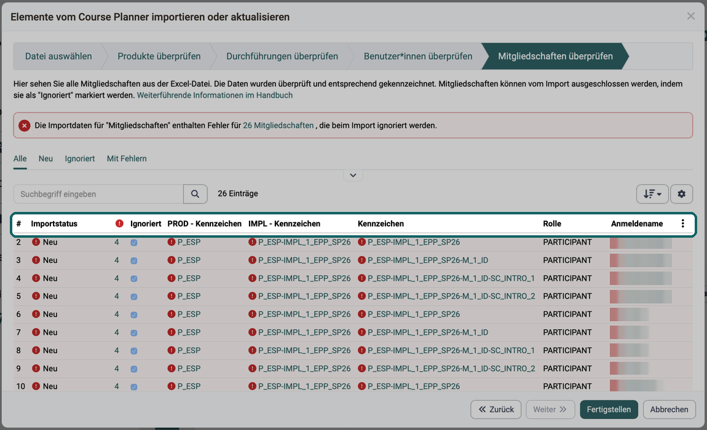{ class="shadow lightbox" title="Schritt Mitgliedschaften überprüfen des Import-Assistenten · 2026.10.07" }

[zum Seitenanfang ^](#import_export)

---

## Weiterführende Informationen {: #further_information}

[Course Planner: Übersicht >](Course_Planner.de.md) 
[Course Planner: Produkte >](Course_Planner_Products.de.md) 
[Course Planner: Durchführungen >](Course_Planner_Implementations.de.md) 
[Import/Export: Referenz >](Course_Planner_Import_Export_Reference.de.md) 
[Modul Räume (Administration) >](../../manual_admin/administration/Modules_Rooms.de.md) 
[Course Planner: Raumverwaltung >](Course_Planner_Rooms.de.md)

[zum Seitenanfang ^](#import_export)
