# Course Planner: Import / Export {: #import_export}

Products, implementations, and memberships can be exported and imported in the Course Planner via an Excel file. The import wizard validates the data at every step and shows exactly what will be created, changed, or ignored before execution [:octicons-tag-16:{ title="from release 20.3.0 (OO-9083)" }](https://track.frentix.com/issue/OO-9083){:target="_blank"}.

## Overview {: #overview}

Export and import complement manual data entry in the Course Planner: existing structures can be exported as an Excel file, edited in that file, and then imported again to create or update products, implementations, and memberships in bulk.

The following elements can be exported and imported:

* Products
* Implementations (elements, templates, courses, events)
* Memberships
* Users

The import wizard is started via the more-menu (⋮) on the Course Planner dashboard.

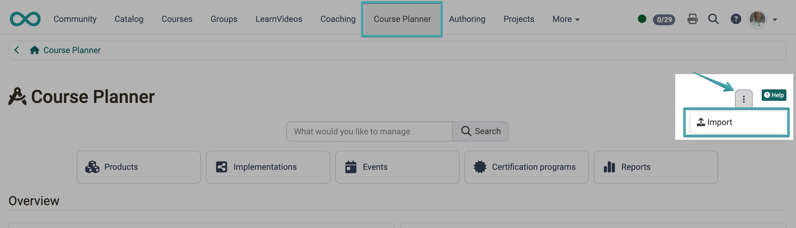{ class="shadow lightbox" }

[Back to top ^](#import_export)

---

## Export {: #export}

### Entry points {: #export_entry_points}

Export is available at several places in the Course Planner:

* On the Course Planner dashboard, in the "Products", "Implementations", or "Events" area: via the more-menu or as a bulk action for several selected entries
* On the page of a single product: as a global action, as well as in the "Implementation" tab via the more-menu or bulk action
* On the page of a single implementation: as a global action

An export at implementation level always contains all related data including membership data — even for a bulk export of several selected implementations.

##### Navigation under Product
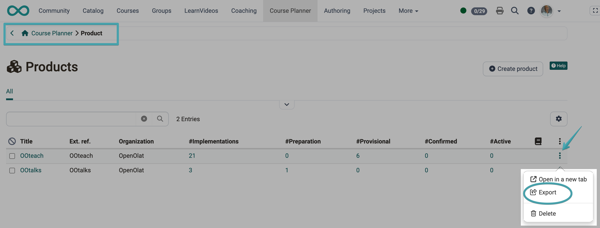{ class="shadow lightbox" }

**Bulk action**
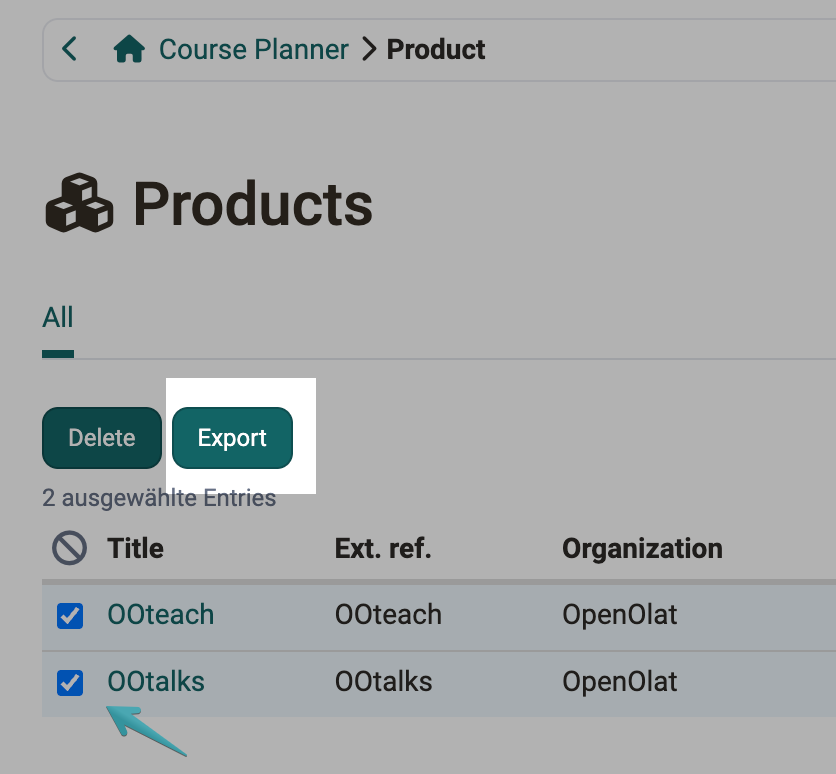{ class="shadow lightbox" }

##### Navigation under Implementation
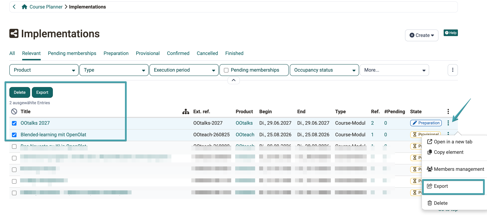{ class="shadow lightbox" }

##### Navigation under Events
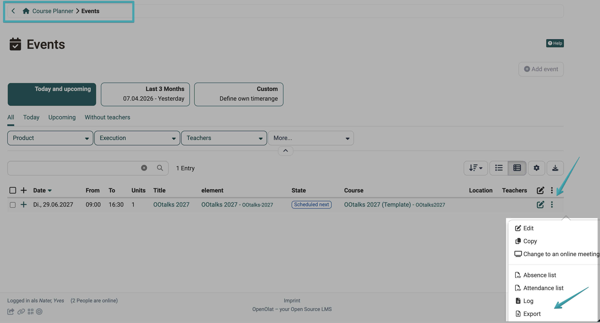{ class="shadow lightbox" }

##### Navigation under Members
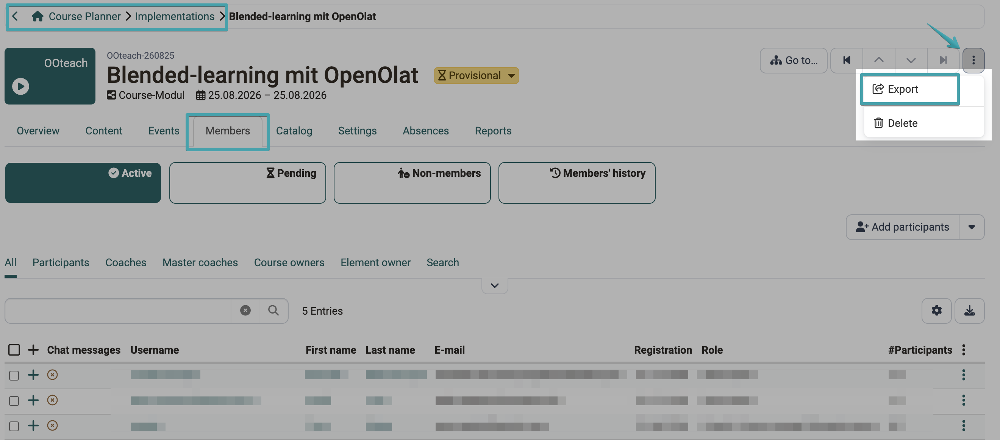{ class="shadow lightbox" }

The file name of the exported Excel file follows the pattern "CPL_Products_\<date and time\>" [:octicons-tag-16:{ title="from release 20.3.0 (OO-9178)" }](https://track.frentix.com/issue/OO-9178){:target="_blank"}.

### Structure of the Excel file {: #export_file_structure}

Depending on the export type, the exported Excel file contains up to four sheets:

* **Products:** Title, Ext. Ref., ORG - Ext. Ref., Absences, Description, Creation date, Last modified
* **Implementations:** one row per object (implementation, element, template, course, or event), with object type, Ext. Ref., title, status, period, as well as type-specific fields such as calendar, absences, progress, or subject
* **Memberships:** assignment of users to implementations with role (Participant, Coach, Master coach, Course owner, Element owner)
* **Users:** Username, first name, last name, e-mail, organisation membership, account expiration [:octicons-tag-16:{ title="from release 20.3.2 (OO-9438)" }](https://track.frentix.com/issue/OO-9438){:target="_blank"}

In addition, every export file contains an "Export information" sheet with URL, OpenOlat version, export language, as well as date and name of the exporting person [:octicons-tag-16:{ title="from release 20.3.0 (OO-9217)" }](https://track.frentix.com/issue/OO-9217){:target="_blank"}.

!!! tip "Tip"

    For an import, it is recommended to first perform an export of the existing structure and use that file as a basis, rather than creating the file from scratch.

[Back to top ^](#import_export)

---

## Import wizard {: #import_wizard}

The import button on the Course Planner dashboard is only available to users with the role "Course planner" or "Administrator".

The import wizard guides you through the review and execution of the import in five steps. If the data contains errors, the wizard cannot be completed until the affected rows are ignored [:octicons-tag-16:{ title="from release 20.3.0 (OO-9191)" }](https://track.frentix.com/issue/OO-9191){:target="_blank"}.

### Handling errors and warnings {: #errors_warnings}

Every erroneous cell is shown directly in the table with the column name and reason, for example "Ext. Ref.: Value required" or "ORG - Ext. Ref.: \<value\> does not exist". If a row contains at least one error, it is automatically excluded from the import.

Warnings do not prevent the import but indicate possible issues, for example when a value is too long and therefore gets shortened, or when an element has already been changed since the last export.

The complete list of all error and warning codes can be found in the [Import/Export: Reference](Course_Planner_Import_Export_Reference.md#errors_warnings_reference).

#### Step 1: Select file {: #step1}

Upload the Excel file containing the data to be imported. The example file can be found once the import process has been started. This linked file can be downloaded there.

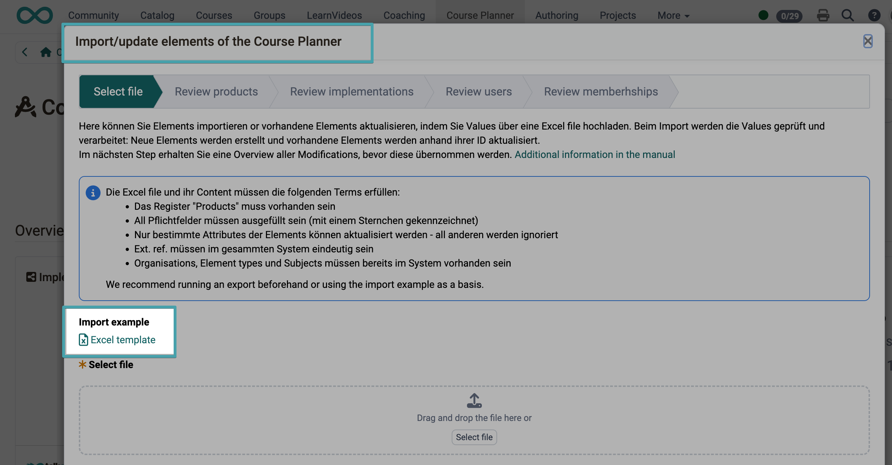{ class="shadow lightbox" }

!!! info "Important"

    The Excel file must meet the following conditions: the "Products" sheet must be present, all mandatory fields marked with an asterisk (\*) must be filled in, identifiers must be unique across the entire system, and organisations, element types, and subjects must already exist in the system.

#### Step 2: Review products {: #step2}

The table shows all products from the Excel file with their import status: "No changes", "Modified", or "New". Predefined filters ("All", "Modified", "New", "Ignored", "With errors", "With warnings", "With changes") allow the list to be narrowed down.

If a row contains an error, it is automatically excluded from the import and highlighted. Using the "Ignored" checkbox, error-free rows can also be deliberately excluded from the import.

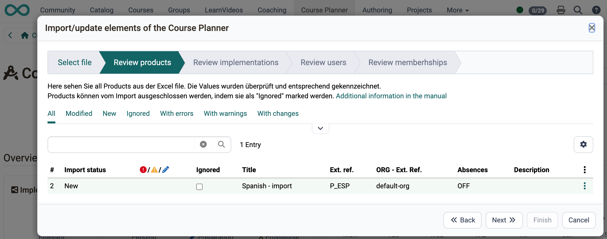{ class="shadow lightbox" }

#### Step 3: Review implementations {: #step3}

Similar to step 2, but for the implementation structure (elements, templates, courses, events). An additional "Object type" filter allows narrowing down by kind of object [:octicons-tag-16:{ title="from release 20.3.0 (OO-9210)" }](https://track.frentix.com/issue/OO-9210){:target="_blank"}.

If a parent element is ignored or contains an error, all child objects are automatically excluded from the import as well.

!!! info "Important"

    If a course is configured with the usage purpose "Standalone", administrators exceptionally see only a warning instead of an error, so that older courses not yet converted to the Course Planner can still be imported. It is recommended to only use courses with the usage purpose "Used in Course Planner" [:octicons-tag-16:{ title="from release 20.3.1 (OO-9424)" }](https://track.frentix.com/issue/OO-9424){:target="_blank"}.

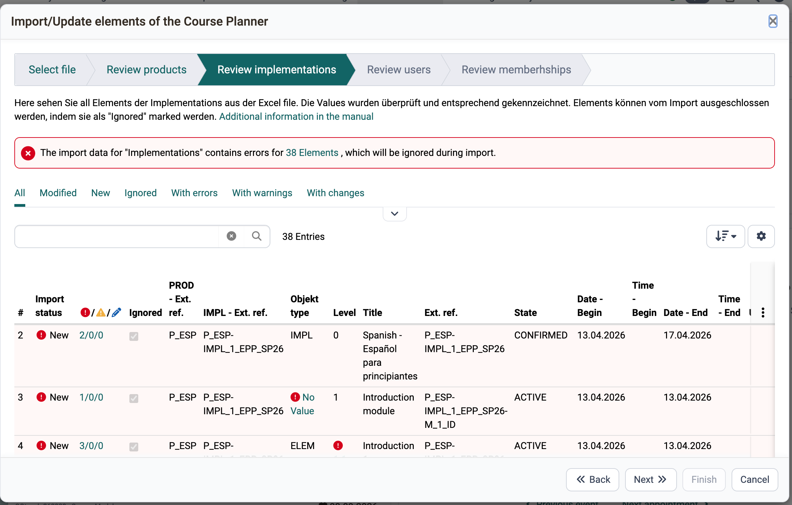{ class="shadow lightbox" }

#### Step 4: Review users {: #step4}

The table shows all users from the Excel file with username, first and last name, e-mail, and organisation membership. Users can also only be newly created, not updated.

!!! info "Important"

    If the "E-mail mandatory" option is not enabled on the instance, the e-mail field can be left empty [:octicons-tag-16:{ title="from release 20.3.2 (OO-9438)" }](https://track.frentix.com/issue/OO-9438){:target="_blank"}.

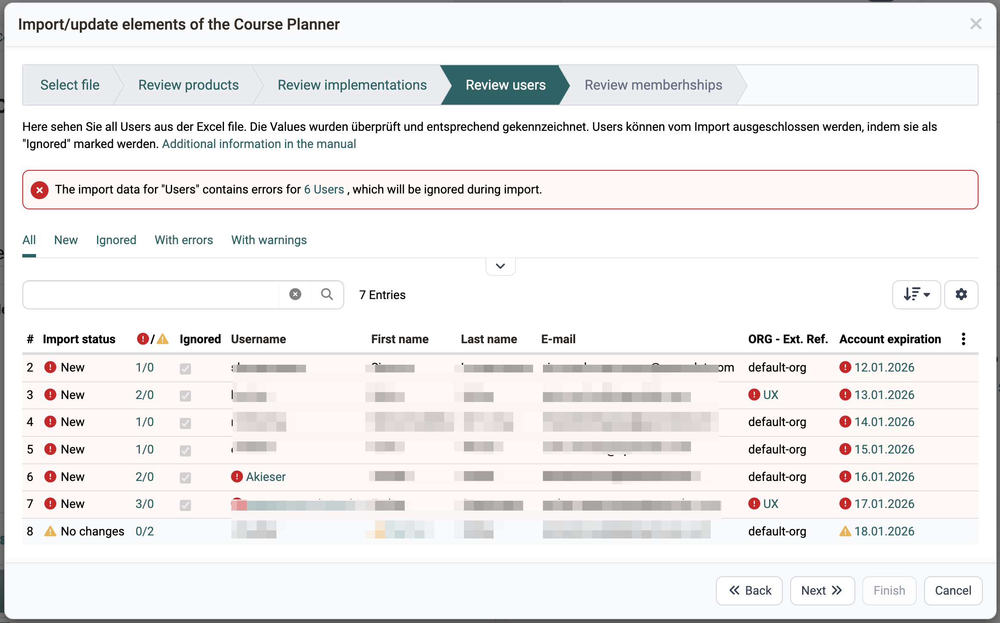{ class="shadow lightbox" }

#### Step 5: Review memberships {: #step5}

The table shows all memberships from the Excel file with product, implementation, role, and username. Memberships can only be newly created, not updated [:octicons-tag-16:{ title="from release 20.3.0 (OO-9224)" }](https://track.frentix.com/issue/OO-9224){:target="_blank"}.

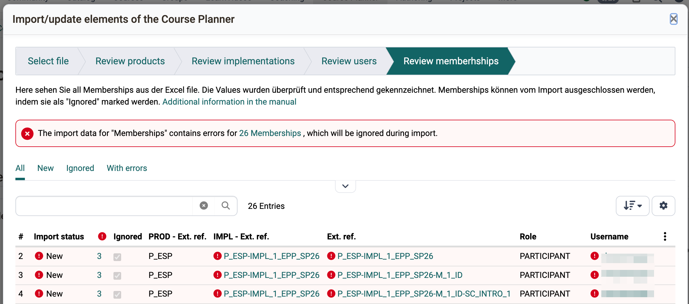{ class="shadow lightbox" }

[Back to top ^](#import_export)

---

## Further information {: #further_information}

[Course Planner: Overview >](Course_Planner.md) 
[Course Planner: Products >](Course_Planner_Products.md) 
[Course Planner: Implementations >](Course_Planner_Implementations.md) 
[Import/Export: Reference >](Course_Planner_Import_Export_Reference.md) 

[Back to top ^](#import_export)
