# Course Planner: Import / Export {: #import_export}

Products, implementations, and memberships can be exported and imported in the Course Planner via an Excel file. The import wizard validates the data at every step and shows exactly what will be created, changed, or ignored before execution [:octicons-tag-16:{ title="from Release 20.3.0 (OO-9083)" }](https://track.frentix.com/issue/OO-9083){:target="_blank"}.

## Overview {: #overview}

Export and import complement manual data entry in the Course Planner: existing structures can be exported as an Excel file, edited in that file, and then imported again to create or update products, implementations, and memberships in bulk.

Export and import are intended for tasks that affect many objects at the same time. Individual changes to a product, an implementation, or a membership are easier to make directly in the user interface. Typical use cases are:

* creating many new products, implementations, and events at once
* coordinating the date, time, location, and rooms of several events
* checking the planning data: the import wizard checks a file completely and shows errors and warnings. If it is cancelled before the last step, it changes nothing.
* archiving a planning state as an Excel file. Courses and templates are contained in it by their reference: if a course or template with this reference exists exactly once on the instance, a new import links it again. The export contains no passwords. For new accounts, passwords can be set during the import, in an additional column after "Creation date" in the "Users" sheet. For existing accounts, this column must remain empty.
* setting up a demo or test environment, provided that organisations, element types, subjects, rooms, as well as courses and templates with the same references already exist there

!!! warning "Attention"

    An import changes many objects in one run. It is recommended to export the current state before every import and to check the overview of every step carefully. Larger imports should first be carried out on a test instance.

The following elements can be exported and imported:

* Products
* Implementations (elements, templates, courses, events)
* Memberships: which user belongs to an implementation or one of its elements, and in which role
* Accounts: the access of the users to OpenOlat, with username and profile data

How accounts and memberships belong together and what the import does with them is described in the section [Accounts and memberships](#accounts_memberships).

The import wizard is started via the more-menu (⋮) on the Course Planner dashboard.

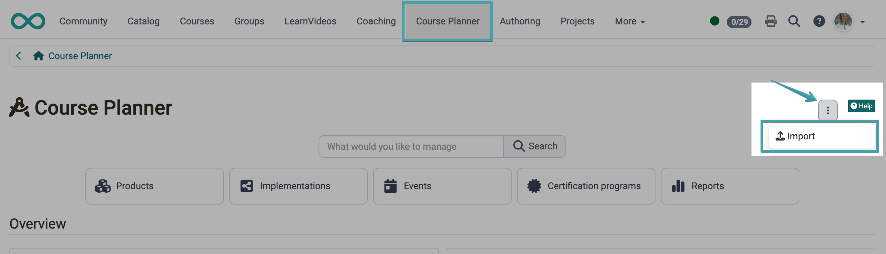{ class="shadow lightbox" title="Course Planner start page" }

[To the top of the page ^](#import_export)

---

## Export [:octicons-tag-16:{ title="from Release 20.3.0 (OO-9178)" }](https://track.frentix.com/issue/OO-9178){:target="_blank"} {: #export}

### Entry points {: #export_entry_points}

Export is available at several places in the Course Planner:

* On the Course Planner dashboard, in the "Products", "Implementations", or "Events" area: via the more-menu or as a bulk action for several selected entries
* On the page of a single product: as a global action, as well as in the "Implementation" tab via the more-menu or bulk action
* On the page of a single implementation: as a global action

An export at implementation level always contains all related data including membership data, even for a bulk export of several selected implementations.

##### Navigation under Product
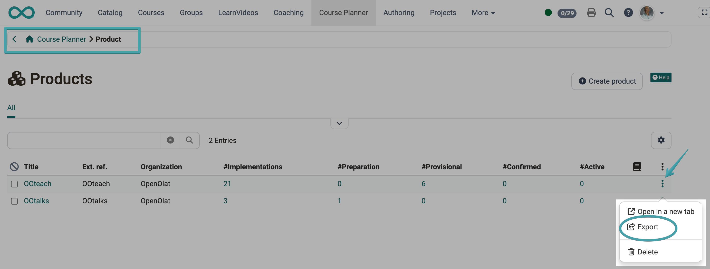{ class="shadow lightbox" title="Product list of the Course Planner" }

**Bulk action**
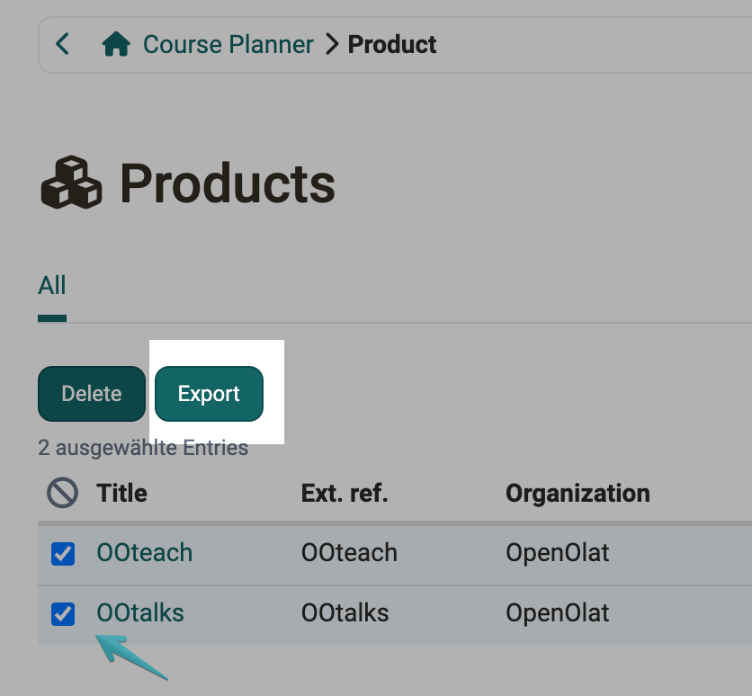{ class="shadow lightbox" title="Product list with two selected products" }

##### Navigation under Implementation
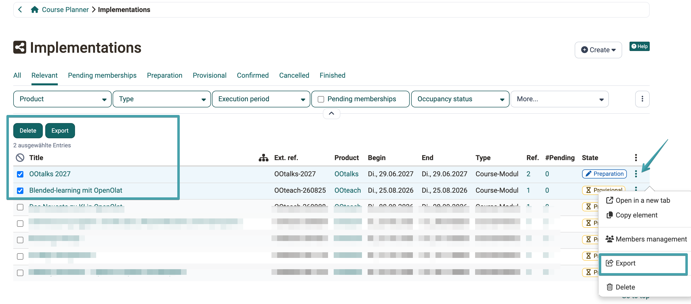{ class="shadow lightbox" title="List of implementations in the Course Planner" }

##### Navigation under Events
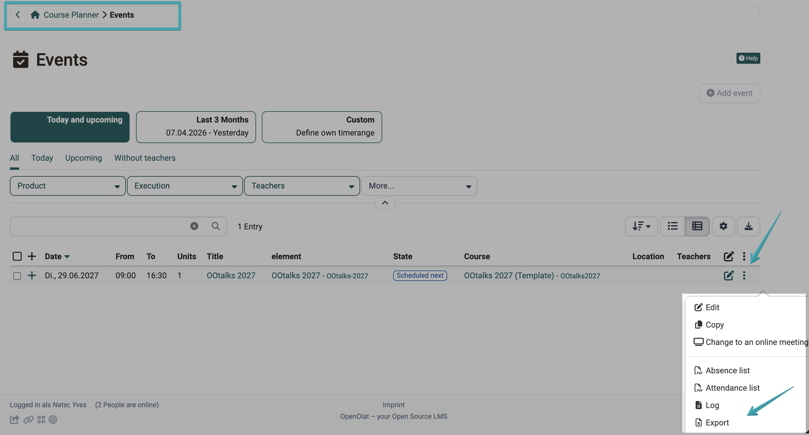{ class="shadow lightbox" title="Event list of the Course Planner" }

##### Navigation under Members
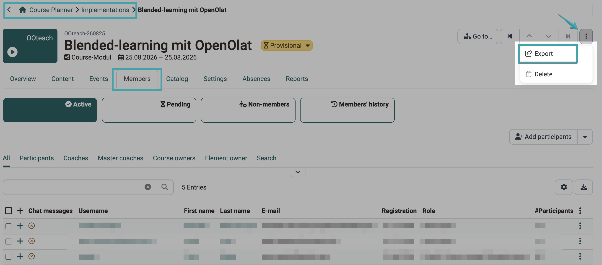{ class="shadow lightbox" title="Members tab of an implementation" }

The file name of the exported Excel file follows the pattern "CPL_Products_\<date and time\>" [:octicons-tag-16:{ title="from Release 20.3.0 (OO-9178)" }](https://track.frentix.com/issue/OO-9178){:target="_blank"}.

### Structure of the Excel file {: #export_file_structure}

Depending on the export type, the exported Excel file contains up to four sheets:

* **Products:** Title, Reference, ORG - Reference, Absences, Description, Creation date, Last modified
* **Implementations:** one row per object (implementation, element, template, course, or event), with object type, Reference, title, status, period, as well as type-specific fields such as calendar, absences, progress, or subject. The subject path starts with the taxonomy identifier ("\<Identifier\>:/\<Path\>") [:octicons-tag-16:{ title="from Release 21.0 (OO-9440)" }](https://track.frentix.com/issue/OO-9440){:target="_blank"}. For events, the column "Rooms" follows the location and lists the booked rooms in the format "building reference:room reference", several rooms separated by a semicolon. What the import does with this column is described in the section [Rooms of events](#import_rooms).
* **Memberships:** one row per membership, with the references of product, implementation and element ("PROD - Reference", "IMPL - Reference", "Reference"), the role and the username. The role is a fixed value, for example PARTICIPANT for participant; the [reference](Course_Planner_Import_Export_Reference.md#enum_reference) lists all values.
* **Users:** one row per user who appears in the "Memberships" sheet: username, first name, last name, e-mail, organisation membership, account expiration [:octicons-tag-16:{ title="from Release 20.3.2 (OO-9438)" }](https://track.frentix.com/issue/OO-9438){:target="_blank"}, creation date

In addition, every export file contains an "Export information" sheet with URL, OpenOlat version, export language, as well as date and name of the exporting person [:octicons-tag-16:{ title="from Release 20.3.0 (OO-9217)" }](https://track.frentix.com/issue/OO-9217){:target="_blank"}.

!!! tip "Tip"

    For an import, it is recommended to first perform an export of the existing structure and use that file as a basis, rather than creating the file from scratch.

[To the top of the page ^](#import_export)

---

## Import wizard {: #import_wizard}

The import button on the Course Planner dashboard is only available to users with the role "Course planner" or "Administrator".

The import wizard opens as the dialog "Import/update elements of the Course Planner" and guides you through the review and execution of the import in five steps. If the data contains errors, the wizard cannot be completed until the affected rows are ignored [:octicons-tag-16:{ title="from Release 20.3.0 (OO-9191)" }](https://track.frentix.com/issue/OO-9191){:target="_blank"}.

### The reference links file and system {: #identifier_matching}

The import uses the reference to recognise whether a row updates an existing object or creates a new one. If it finds exactly one object with the same reference, it compares the values and shows the row as "Modified" or "No changes". If it finds none, it shows the row as "New", except for courses and templates. If it finds several, it reports "Reference: Value not unique".

The search area depends on the object:

* **Product:** among all active products
* **Implementation:** within the specified product
* **Element:** within the specified implementation
* **Event:** in the whole system, by the reference of the event
* **Course and template:** in the whole system, by the reference of the learning resource. The import never creates courses or templates. If it finds no learning resource, it reports "Reference: \<value\> does not exist". If the learning resource is not yet linked to the parent element, it shows the row as "New" and links it during the import.

!!! warning "Attention"

    A reference cannot be renamed via the import. If the reference of an existing product, implementation, element, or event is changed in the Excel file, the import creates an additional object. The existing object remains unchanged. To update existing entries, keep the references from the export unchanged.

### Accounts and memberships [:octicons-tag-16:{ title="from Release 20.3.0 (OO-9224)" }](https://track.frentix.com/issue/OO-9224){:target="_blank"} {: #accounts_memberships}

If you enrol users in implementations with the import, you fill two sheets that belong together: the "Users" sheet says who the user is, the "Memberships" sheet says where they take part and in which role. An account is a user's access to OpenOlat, with username, profile data and organisation membership. A membership links an account to a role in an implementation or in one of its elements.

| | "Users" sheet | "Memberships" sheet |
|---|---|---|
| One row describes | one account | one user in one role in an implementation or an element |
| Rows per user | exactly one | one per implementation or element and role |
| Step in the import wizard | Step 4 "Review users" | Step 5 "Review memberships" |
| Import status "New" | The username does not yet exist in the system. The import creates the account. | The user does not yet have this role in the element. The import adds them as a member. |
| Import status "No changes" | The account exists. The import uses it but does not change it. | The user already has this role in the element. |

Step 4 "Review users" shows the rows of the "Users" sheet, one row per account.

The two sheets are linked by the username. Every username in the "Memberships" sheet must appear in the "Users" sheet, and every account in the "Users" sheet needs at least one membership. If the counterpart is missing, the import reports an error for the username. If an account is ignored or contains an error, the import also excludes all memberships of this user.

The import does not change an existing account. It does not apply differing data from the file; for first and last name, organisation membership and account expiration it shows a warning. Likewise, the import does not remove any membership: a user who is a member in the system and is missing from the file remains a member.

The import reads the sheets by their order, not by their name: the third sheet as memberships, the fourth as users. Therefore, keep the order from the export unchanged.

### Rooms of events [:octicons-tag-16:{ title="from Release 21.0.1 (OO-9303)" }](https://track.frentix.com/issue/OO-9303){:target="_blank"} {: #import_rooms}

If you plan many events at once, you book their rooms in the same pass with the import. The rooms are in the column "Rooms" in the sheet "Implementations". The import reads the column only for events (object type EVENT). For all other object types, it is empty in the export, and the import skips a value there without a message.

Each room appears in the cell with the reference of its building and its own reference, separated by a colon, for example "BG_1:AULA". A semicolon separates several rooms: "BG_1:AULA;BG_1:H101". Both references are assigned by the administration in the [Rooms module](../../manual_admin/administration/Modules_Rooms.md#rooms). The references of rooms that are already booked are in the export.

!!! warning "Attention"

    The import replaces the room bookings of an event, it does not add to them. It books the rooms that are in the cell and removes every existing booking whose room is missing from the cell. An empty cell "Rooms" for an existing event therefore removes all room bookings of this event. The import wizard shows such a row as "Modified" in the step "Review implementations".

The import does not check whether a room is free at the time of the event, and it also books inactive rooms. In the user interface, by contrast, only active rooms can be selected. After the import, Room scheduling shows double bookings and inactive rooms as [warnings](Course_Planner_Rooms.md#warnings).

### Handling errors and warnings {: #errors_warnings}

Every erroneous cell is shown directly in the table with the column name and reason, for example "Reference: Value required" or "ORG - Reference: \<value\> does not exist". If a row contains at least one error, it is automatically excluded from the import.

Above the table, an error message states how many rows of the step contain errors. A click on this number selects the filter "With errors". The column with the symbols for errors, warnings and changes counts them per row, for example "1/0/0". A click on the numbers lists the messages of the row, a click on a marked cell shows its message.

Warnings do not prevent the import but indicate possible issues, for example when a value is too long and therefore gets shortened, or when an element has already been changed since the last export.

The complete list of all error and warning codes can be found in the [Import/Export: Reference](Course_Planner_Import_Export_Reference.md#errors_warnings_reference).

#### Step 1: Select file {: #step1}

Upload the Excel file containing the data to be imported. An example file is available for download under "Import example" via the link "Excel template".

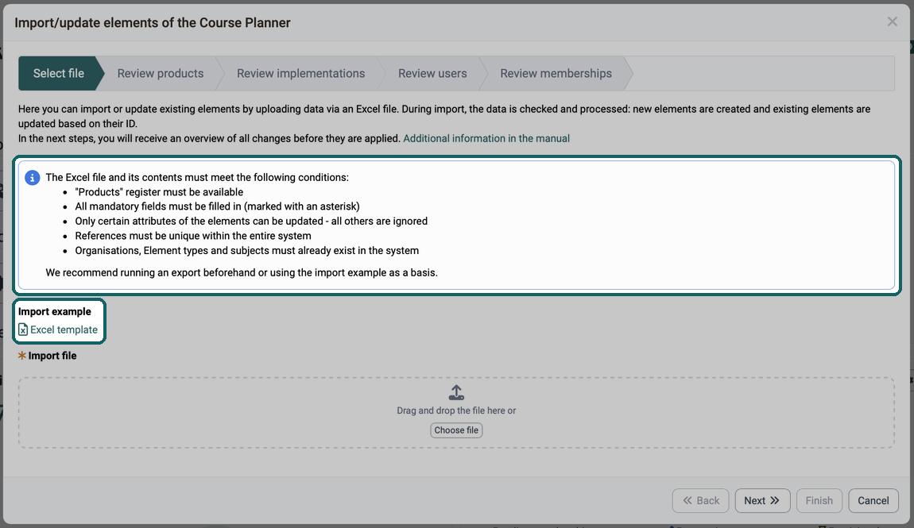{ class="shadow lightbox" title="Select file step of the import wizard · 2026.10.07" }

!!! info "Important"

    The Excel file must meet the following conditions: the "Products" sheet must be present, all mandatory fields marked with an asterisk (\*) must be filled in, references must be unique across the entire system, and organisations, element types, and subjects must already exist in the system. Only certain attributes can be updated, the import ignores all others. The column "Updatable" in the [reference](Course_Planner_Import_Export_Reference.md#attribute_rules) shows which ones.

#### Step 2: Review products {: #step2}

The table shows all products from the Excel file with their import status: "No changes", "Modified", or "New". Predefined filters ("All", "Modified", "New", "Ignored", "With errors", "With warnings", "With changes") allow the list to be narrowed down.

If a row contains an error, it is automatically excluded from the import and highlighted. Using the "Ignored" checkbox, error-free rows can also be deliberately excluded from the import. Rows with the import status "No changes" have no such checkbox, because the import does not change them anyway.

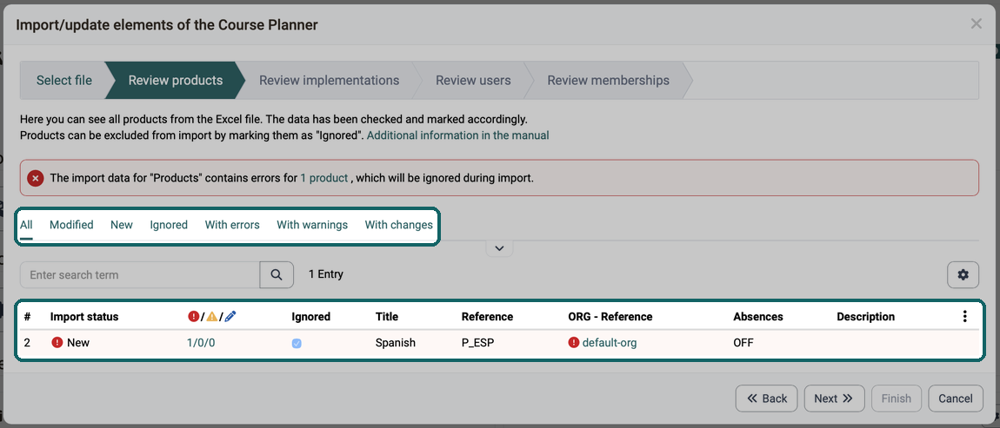{ class="shadow lightbox" title="Review products step of the import wizard · 2026.10.07" }

#### Step 3: Review implementations {: #step3}

Similar to step 2, but for the implementation structure (elements, templates, courses, events). An additional "Object type" filter allows narrowing down by kind of object [:octicons-tag-16:{ title="from Release 20.3.0 (OO-9210)" }](https://track.frentix.com/issue/OO-9210){:target="_blank"}.

If a parent element is ignored or contains an error, all child objects are automatically excluded from the import as well.

If the module "Events and Absences" is deactivated on the instance, events are automatically set to "Ignored" during the import [:octicons-tag-16:{ title="from Release 21.0 (OO-9440)" }](https://track.frentix.com/issue/OO-9440){:target="_blank"}.

!!! info "Important"

    If a course is configured with the usage purpose "Standalone", administrators exceptionally see only a warning instead of an error, so that older courses not yet converted to the Course Planner can still be imported. It is recommended to only use courses with the usage purpose "Used in Course Planner" [:octicons-tag-16:{ title="from Release 20.3.1 (OO-9424)" }](https://track.frentix.com/issue/OO-9424){:target="_blank"}.

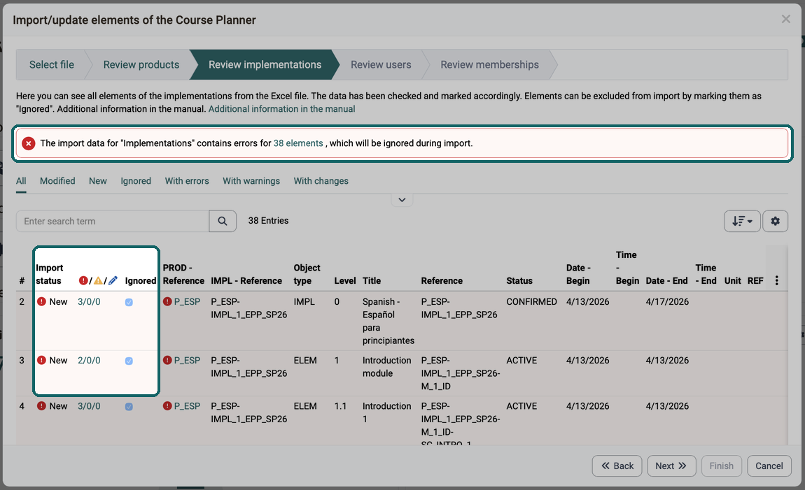{ class="shadow lightbox" title="Review implementations step of the import wizard · 2026.10.07" }

#### Step 4: Review users {: #step4}

The table shows the accounts from the "Users" sheet with username, first and last name, e-mail, ORG - Reference and account expiration. The import only creates new accounts and does not change existing ones, see [Accounts and memberships](#accounts_memberships). The filters are therefore limited to "All", "New", "Ignored", "With errors" and "With warnings".

!!! info "Important"

    If the "E-mail mandatory" option is not enabled on the instance, the e-mail field can be left empty [:octicons-tag-16:{ title="from Release 20.3.2 (OO-9438)" }](https://track.frentix.com/issue/OO-9438){:target="_blank"}.

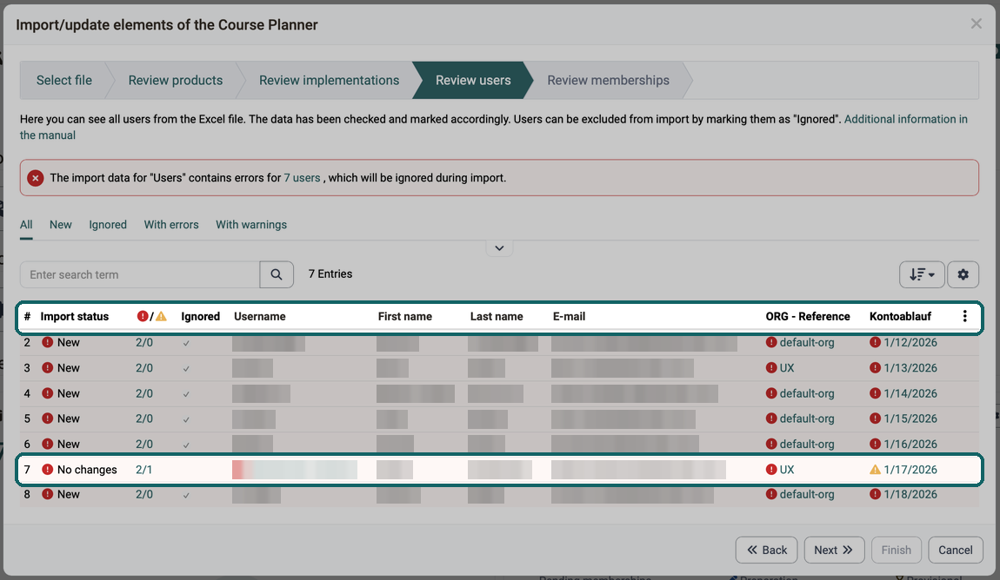{ class="shadow lightbox" title="Review users step of the import wizard · 2026.10.07" }

#### Step 5: Review memberships {: #step5}

The table shows the memberships from the "Memberships" sheet with the references of product, implementation and element, the role and the username. The import only adds new memberships; it does not change or remove existing ones. The filters are limited to "All", "New", "Ignored" and "With errors", and the column with the error symbol counts errors only.

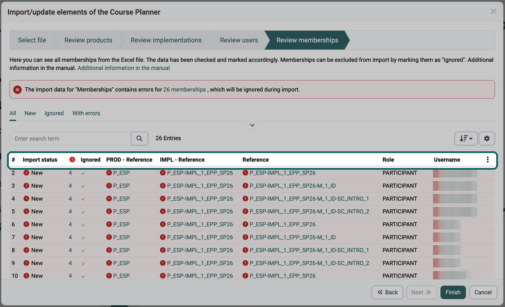{ class="shadow lightbox" title="Review memberships step of the import wizard · 2026.10.07" }

[To the top of the page ^](#import_export)

---

## Further information {: #further_information}

[Course Planner: Overview >](Course_Planner.md) 
[Course Planner: Products >](Course_Planner_Products.md) 
[Course Planner: Implementations >](Course_Planner_Implementations.md) 
[Import/Export: Reference >](Course_Planner_Import_Export_Reference.md) 
[Module Rooms (Administration) >](../../manual_admin/administration/Modules_Rooms.md) 
[Course Planner: Room management >](Course_Planner_Rooms.md)

[To the top of the page ^](#import_export)
