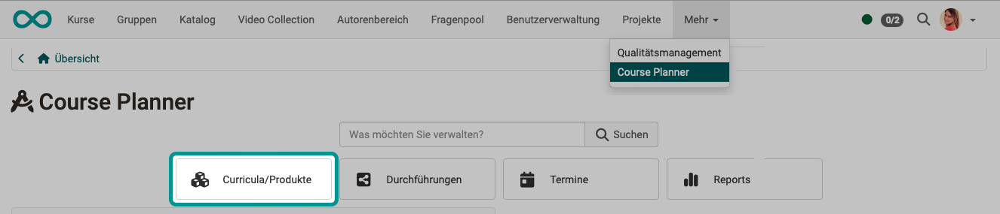
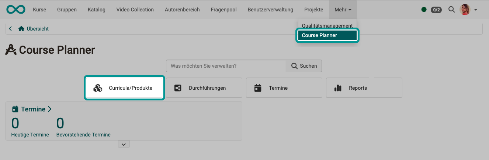
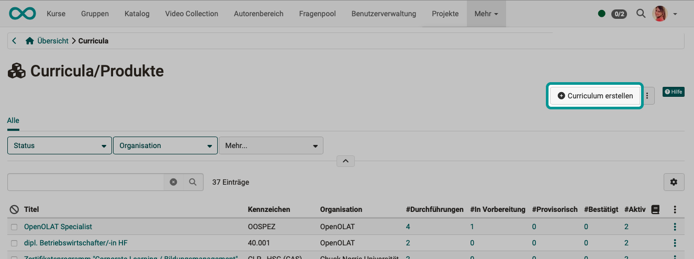
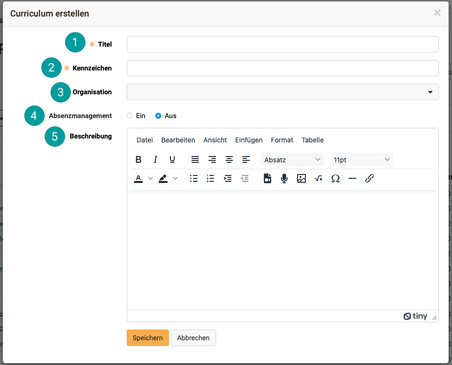
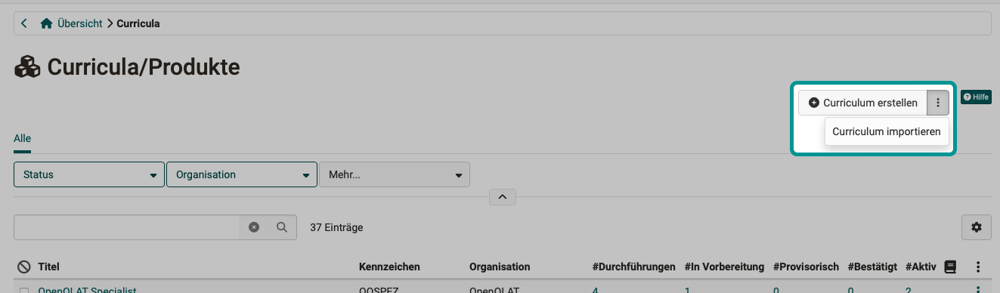
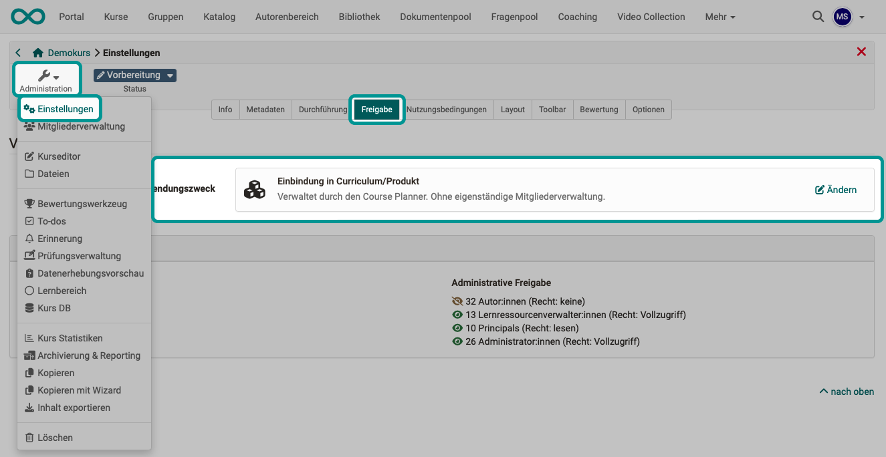

# Course Planner: Curricula/Produkte {: #products}

{ class="shadow lightbox" }  

## Was verstehen wir in OpenOlat unter einem Curriculum/Produkt?

Ein Curriculum ist ein mit Lehrzielen und Lehrinhalten verknüpfter, einem bestimmten Ablauf folgender Lehrplan. In OpenOlat werden Curricula aus mehreren Kursen und Lernressourcen zusammengestellt und strukturieren so Bildungsangebote ("Kurspakete"). Die Kurse und Lernressourcen werden in zeitlicher Abfolge in einer Baumstruktur abgebildet.

Ab  Release 20 wurde statt der Curriculumverwaltung eine erweiterte, allgemeine Kursplanung in OpenOlat integriert (Course Planner). Bis Release 19 können Curricula optional in einem eigenen Modul verwaltet werden.

Im Kontext von Unternehmen wird statt von "Curriculum" öfter von (Bildungs-)"Produkt" gesprochen. Deshalb werden in OpenOlat seit Release 20 beide Begiffe verwendet.

[zum Seitenanfang ^](#products)

---

## Wo werden Curricula/Produkte verwendet?

Curricula werden im **Course Planner** für die Planung eines Bildungsgangs mit mehreren Kursen und Lernressourcen ("Kurspaket") verwendet. Ein Curriculum kann dann in mehreren Durchführungen zu verschiedenen Terminen angeboten werden.    

Werden Teilnehmer:innen nicht nur einem einzelnen Kurs als Mitglieder zugeordnet, sondern der [Durchführung](../../manual_user/area_modules/Course_Planner_Implementations.de.md) eines Curriculums/Produkts, ist die Mitgliedschaft für die Teilnehmer:innen ersichtlich, wenn sie im Hauptmenü die Option "Kurse" wählen". 
Kurse, die einem Curriculum zugeordnet sind, erscheinen dort im Bereich "Bildungsprogramme". (Vor Release 20 unter "Lehrgänge".)

Die Durchführungen eines Curriculums können im [Katalog ](../../manual_user/area_modules/catalog2.0_angebote.de.md) angeboten werden.

[zum Seitenanfang ^](#products)

---

## Wo und wie werden Curricula/Produkte aktiviert?

Curricula sind ein Zusatzmodul in OpenOlat und müssen zunächst frei geschaltet werden. 
Kunden von frentix kontaktieren für die Aktivierung bitte [contact@frentix.com.](mailto:contact@frentix.com.) 
Sind Sie kein Hosting-Kunde von frentix, fragen Sie bitte Ihren Systembetreiber. 

Nach erfolgter Freischaltung können Systemadministrator:innen das Modul aktivieren und einrichten unter: 
**Administration > Module > Curriculum**

[zum Seitenanfang ^](#products)

---

## Curriculum/Produkt erstellen {: #create_curriculum}

Zum Erstellen eines Curriculums/Produkts öffnen Sie den Course Planner und dort den Unterbereich "Curricula/Produkte".

{ class="shadow lightbox" }  

{ class="shadow lightbox" }  

{ class="shadow lightbox" }

 **Titel**: 
Die Angabe eines Titels ist zwingend erforderlich. 

 **Kennzeichen**: 
Das Kennzeichen ist ebenfalls ein Pflichtfeld. (Es wird als Identifier zur Unterscheidung bei Elementen mit gleichem Titel verwendet.)

 **Organisationen**: 
Wenn Sie ein neues Curriculum erstellen, können Sie es auch auf die Verwendung innerhalb einer bestimmten Organisationseinheit beschränken, falls bei Ihnen das Modul "Organisationen" aktiviert ist.  

 **Absenzenmanagement**: 
Mit dieser Auswahl bestimmen Sie, ob das Absenzenmanagement für dieses Curriculum/Produkt verwendet werden soll. (Voraussetzung ist, dass es von einem/einer Administrator:in grundsätzlich aktiviert und für die Kursautor:innen verfügbar gemacht wurde.) 

 **Beschreibung**: 
In diesem Editor für die Beschreibung können Sie neben Text, Bildern und Links auch Videos einfügen oder direkt durch Klick auf den Mikrofon-Button ein Audio aufnehmen.

[zum Seitenanfang ^](#products)

---

## Curriculum/Produkt importieren {: #import_curriculum}

Soll ein bereits bestehendes Curriculum für Ihre Planung verwendet werden, können Sie auch Curricula importieren. Klicken Sie dazu auf die 3 Punkte neben dem Button "Curriculum erstellen".

{ class="shadow lightbox" }  

[zum Seitenanfang ^](#products)

---

## Einstellung in den Kursen des Curriculums {: #course_settings}

Zu einem Curriculum/Produkt gehören im Normalfall mehrere Kurse.
In den Einstellungen jedes Kurses kann sein **Verwendungszweck** festgelegt werden:

* eigenständige Lernressource 
* als Template 
* zur Einbindung in ein Curriculum/Produkt

Wird ein Kurs über den Course Planner verwaltet, ist die Einstellung "**Einbindung in Curriculum/Produkt**". Der Kurs hat dann keine eigenständige Mitgliederverwaltung. Die Mitgliederverwaltung geschieht in diesem Fall in der Mitgliederverwaltung der [Durchführung](../../manual_how-to/course_planner_courses/course_planner_courses.de.md#add_members).

Sie finden die Einstellung unter: 
**(Wahl eines Kurses >) Administration > Einstellungen > Tab Freigabe > Einbindung in Curriculum/Produkt**

{ class="shadow lightbox" }  

[zum Seitenanfang ^](#products)

---

## Weitere Informationen {: #further_information}

[Wie erstelle ich meinen ersten OpenOlat-Kurs >](../../manual_how-to/my_first_course/my_first_course.de.md) 
[Course Planner: Übersicht >](../../manual_user/area_modules/Course_Planner.de.md) 
[Course Planner: Durchführungen >](../../manual_user/area_modules/Course_Planner_Implementations.de.md) 
[Course Planner: Termine >](../../manual_user/area_modules/Course_Planner_Events.de.md) 
[Course Planner: Reports >](../../manual_user/area_modules/Course_Planner_Reports.de.md) 
[Wie kann ich mit dem Course Planner eine Kursdurchführung planen und durchführen? >](../../manual_how-to/course_planner_courses/course_planner_courses.de.md) 
[Wie kann ich mit dem Course Planner einen Bildungsgang / ein Curriculum planen und durchführen? >](../../manual_how-to/course_planner_curriculum/course_planner_curriculum.de.md) 
[Course Planner aktivieren (Admin) >](../../manual_admin/administration/Modules_Course_Planner.de.md) 

[zum Seitenanfang ^](#products)
