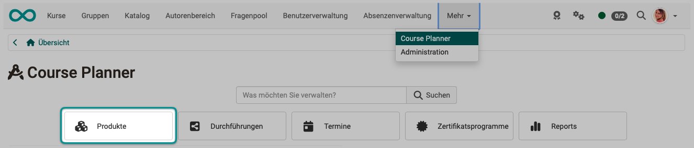
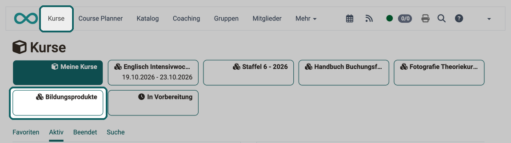
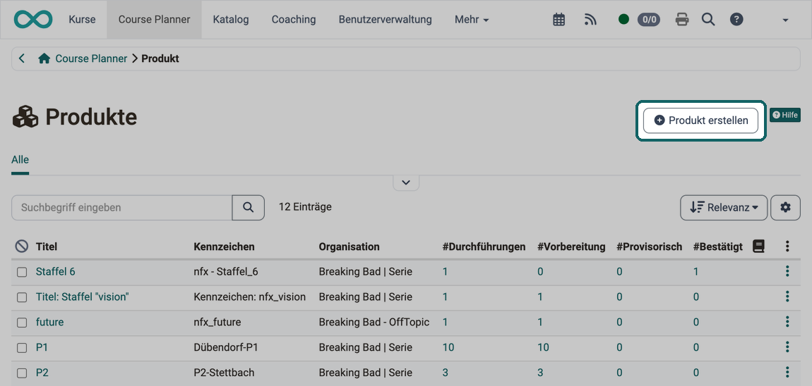
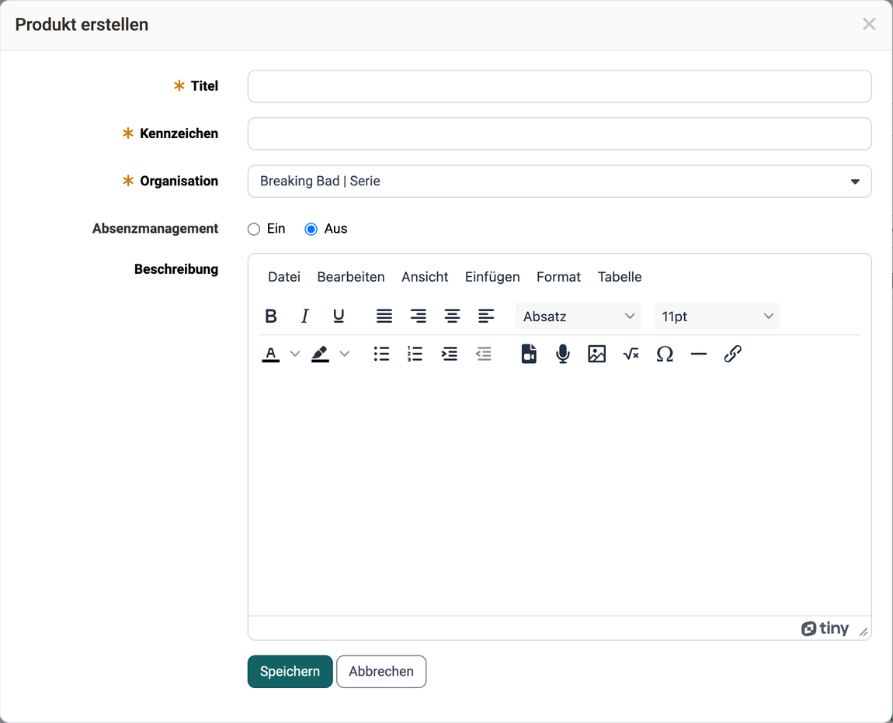
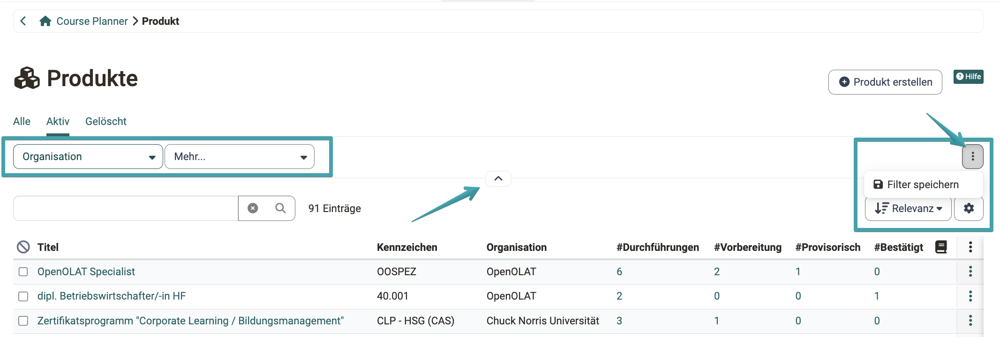
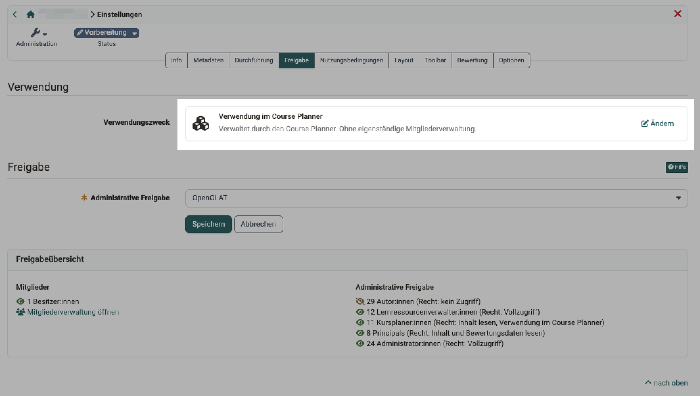

# Course Planner: Produkte [:octicons-tag-16:{ title="ab Release 20.0 (OO-7834)" }](https://track.frentix.com/issue/OO-7834){:target="_blank"} {: #products}

{ class="shadow lightbox" title="Startseite des Course Planners" }

## Was verstehen wir in OpenOlat unter einem Produkt? {: #definition}

Ein Bildungsprodukt ist ein nach innen oder aussen gerichtetes Lernangebot mit Durchführungen. Meistens sind es mehrfache Durchführungen, also von Lernangeboten der gleichen "Art" (-> Produkt). 

Oft bestehen Produkte aus mehreren Kursen und haben eine bestimmte Struktur/Abfolge, in der die enthaltenen Kurse kombiniert sind (strukturierte Produkte). Die Kurse und Lernressourcen werden in zeitlicher Abfolge in einer Baumstruktur abgebildet.

Im Kontext von Unternehmen wird statt von "Curriculum" öfter von (Bildungs-)"Produkt" gesprochen. Deshalb wird in OpenOlat in der Regel der Begriff "Produkt" verwendet.

Mit dem Course Planner ist in OpenOlat eine erweiterte, allgemeine Kursplanung integriert. 

[zum Seitenanfang ^](#products)

---

## Wo werden Produkte verwendet? {: #usage_of_products}

Produkte werden im **Course Planner** für die Planung eines Bildungsgangs mit mehreren Kursen und Lernressourcen ("Kurspaket") verwendet. Ein Produkt kann dann in mehreren Durchführungen zu verschiedenen Terminen angeboten werden.    

Die Durchführungen eines Produkts können im [Katalog](../../manual_user/area_modules/catalog2.0_angebote.de.md) angeboten werden.

Werden Teilnehmer:innen nicht nur einem einzelnen Kurs als Mitglieder zugeordnet, sondern der [Durchführung](../../manual_user/area_modules/Course_Planner_Implementations.de.md) eines Produkts, ist die Mitgliedschaft für die Teilnehmer:innen ersichtlich, wenn sie im Hauptmenü die Option "Kurse" wählen. 
Kurse, die einem Produkt zugeordnet sind, erscheinen dort im Bereich "Bildungsprodukte". Durchführungen, die Sie als Favorit markiert haben, stehen dort zusätzlich als eigene Buttons neben "Meine Kurse".

{ class="shadow lightbox" title="Bereich Kurse · 2026.10.09" }

[zum Seitenanfang ^](#products)

---

## Wo und wie werden Produkte aktiviert? {: #activation}

Der für die Erstellung von Produkten verwendete Course Planner ist ein Zusatzmodul in OpenOlat und muss zunächst freigeschaltet werden. 
Kunden von frentix kontaktieren für die Aktivierung bitte [contact@frentix.com](mailto:contact@frentix.com). 
Sind Sie kein Hosting-Kunde von frentix, fragen Sie bitte Ihren Systembetreiber. 

Nach erfolgter Freischaltung können Systemadministrator:innen das Modul aktivieren und einrichten unter: 
`Administration > Module > Course Planner`

[zum Seitenanfang ^](#products)

---

## Produkt erstellen {: #create_product}

Zum Erstellen eines Produkts öffnen Sie den Course Planner und dort den Unterbereich "Produkte".

{ class="shadow lightbox" title="Seite Produkte im Course Planner · 2026.10.09" }

{ class="shadow lightbox" title="Dialog Produkt erstellen · 2026.10.09" }

#### Titel {: #create_product_title}

Die Angabe eines Titels ist zwingend erforderlich.

#### Kennzeichen {: #create_product_reference}

Das Kennzeichen ist ebenfalls ein Pflichtfeld. (Es wird als Identifier zur Unterscheidung bei Elementen mit gleichem Titel verwendet.)

#### Organisation {: #create_product_organisation}

Ist bei Ihnen das Modul "Organisationen" aktiviert, ist die Organisation ein Pflichtfeld: Sie beschränken das neue Produkt damit auf die Verwendung innerhalb einer bestimmten Organisationseinheit. Die Organisation des Produkts entscheidet auch, welche Kurse der Dialog "Kurs hinzufügen" einer Durchführung anbietet: Kurse, die für diese Organisation oder eine ihrer Unterorganisationen freigegeben sind (siehe [Einstellung in den Kursen des Produkts](#course_settings)).

#### Absenzmanagement {: #create_product_absence_management}

Mit der Auswahl "Ein" oder "Aus" bestimmen Sie, ob das Absenzmanagement für dieses Produkt verwendet werden soll. Voraussetzung ist, dass Administrator:innen das Modul aktiviert und für die Kursautor:innen verfügbar gemacht haben, unter: 
`Administration > Module > Termine / Absenzen`

#### Beschreibung {: #create_product_description}

In diesem Editor für die Beschreibung können Sie neben Text, Bildern und Links auch Videos einfügen oder direkt durch Klick auf den Mikrofon-Button ein Audio aufnehmen.

[zum Seitenanfang ^](#products)

---

## Produktübersicht filtern und sortieren [:octicons-tag-16:{ title="ab Release 21.0 (OO-9398)" }](https://track.frentix.com/issue/OO-9398){:target="_blank"} {: #product_overview}

Die Liste der Produkte ist nach Relevanz sortiert: zuerst Produkte mit laufenden Durchführungen (in Vorbereitung, provisorisch oder bestätigt), danach Produkte mit abgebrochenen oder beendeten Durchführungen, zuletzt Produkte ohne Durchführungen. Innerhalb dieser Gruppen wird alphabetisch sortiert. So stehen die aktuell relevanten Produkte immer zuoberst.

Mit **"Filter speichern"** können häufig verwendete Filterkombinationen als eigene Voreinstellung gespeichert und wiederverwendet werden.

Kursplaner:innen arbeiten mit der Ansicht "Alle", die die aktiven Produkte zeigt. Administrator:innen stehen zusätzlich die vordefinierten Filter **"Aktiv"** (standardmässig ausgewählt) und **"Gelöscht"** zur Verfügung.

{ class="shadow lightbox" title="Produktliste im Course Planner" }

[zum Seitenanfang ^](#products)

---

## Tab Übersicht eines Produkts {: #tab_overview}

Öffnen Sie ein Produkt, zeigt der Tab **Übersicht** drei Widgets, jeweils eingeschränkt auf dieses Produkt:

- **Durchführungen**: die Durchführungen dieses Produkts, mit Kennzahlen als Vorauswahl. **"Alle anzeigen"** öffnet die vollständige Liste.
- **Termine**: die Termine der laufenden Woche aus diesem Produkt. Das Widget erscheint nur, wenn das Modul **Termin- und Absenzenverwaltung** systemweit aktiv ist.
- **To-do**: die offenen und überfälligen Aufgaben dieses Produkts.

Wie eine Übersichtsseite aufgebaut ist, welche Bedienelemente die Kacheln gemeinsam haben und wie Sie die Kacheln anordnen, ist einmal zentral beschrieben: [Übersichtsseiten und Widgets >](../basic_concepts/Dashboard_Concept.de.md)

[zum Seitenanfang ^](#products)

---

## Produkte importieren und exportieren {: #import_product}

Produkte, Durchführungen und Mitgliedschaften lassen sich auch über eine Excel-Datei importieren oder exportieren. Der Import-Assistent prüft die Daten in mehreren Schritten und zeigt vor der Ausführung genau an, was neu erstellt, geändert oder ignoriert wird [:octicons-tag-16:{ title="ab Release 20.3.0 (OO-9083)" }](https://track.frentix.com/issue/OO-9083){:target="_blank"}.

!!! note "Import / Export"

    Eine ausführliche Beschreibung finden Sie unter [Course Planner: Import / Export](Course_Planner_Import_Export.de.md).

[zum Seitenanfang ^](#products)

---

## Einstellung in den Kursen des Produkts [:octicons-tag-16:{ title="ab Release 20.0 (OO-8104)" }](https://track.frentix.com/issue/OO-8104){:target="_blank"} {: #course_settings}

Zu einem Produkt gehören im Normalfall mehrere Kurse.
In den Einstellungen jedes Kurses legt das Feld **Verwendungszweck** fest, wie der Kurs eingesetzt wird. Für einen Kurs stehen drei Verwendungszwecke zur Wahl:

* **Eigenständig**: eigenständige Lernressource mit Mitgliederverwaltung
* **Verwendung im Course Planner**: verwaltet durch den Course Planner, ohne eigenständige Mitgliederverwaltung
* **Template**: Template für Kursinhalte, ohne eigenständige Mitgliederverwaltung

Der vierte Verwendungszweck **Einbindung** (wiederverwendbare Lernressource, ohne eigenständige Mitgliederverwaltung) steht nur anderen Lernressourcen als Kursen zur Verfügung.

Wird ein Kurs über den Course Planner verwaltet, ist der Verwendungszweck **"Verwendung im Course Planner"**. Der Kurs hat dann keine eigenständige Mitgliederverwaltung. Die Mitgliederverwaltung geschieht in diesem Fall in der Mitgliederverwaltung der [Durchführung](../../manual_how-to/course_planner_courses/course_planner_courses.de.md#add_members). Nur Kurse mit diesem Verwendungszweck bietet der Dialog "Kurs hinzufügen" einer Durchführung an.

Sie finden den Verwendungszweck im gewählten Kurs unter: 
`Kurs > Administration > Einstellungen > Tab "Freigabe" > Abschnitt "Verwendung"`

{ class="shadow lightbox" title="Abschnitt Verwendung im Tab Freigabe" }

Hat ein Kurs schon Betreuer:innen oder Teilnehmer:innen, lässt sich der Verwendungszweck nicht mehr auf "Verwendung im Course Planner" umstellen. Welche Gründe den Wechsel sperren und wie Sie trotzdem zum Ziel kommen, finden Sie hier: 
[Wenn sich der Verwendungszweck nicht ändern lässt >](../../manual_how-to/course_planner_courses/course_planner_courses.de.md#embedding_locked)

[zum Seitenanfang ^](#products)

---

## Weiterführende Informationen {: #further_information}

**Auf dieser Seite erwähnt** 
[Katalog 2.0 - Angebote >](../../manual_user/area_modules/catalog2.0_angebote.de.md) 
[Course Planner: Durchführungen >](../../manual_user/area_modules/Course_Planner_Implementations.de.md) 
[Course Planner: Import / Export >](Course_Planner_Import_Export.de.md) 
[Wie kann ich mit dem Course Planner Kursdurchführungen planen und durchführen? >](../../manual_how-to/course_planner_courses/course_planner_courses.de.md) 
[Übersichtsseiten und Widgets >](../basic_concepts/Dashboard_Concept.de.md)

**Weiterführend** 
[Wie erstelle ich meinen ersten OpenOlat-Kurs? >](../../manual_how-to/my_first_course/my_first_course.de.md) 
[Course Planner: Übersicht >](../../manual_user/area_modules/Course_Planner.de.md) 
[Course Planner: Termine >](../../manual_user/area_modules/Course_Planner_Events.de.md) 
[Course Planner: Zertifikatsprogramme >](../../manual_user/area_modules/Course_Planner_Certification_Programs.de.md) 
[Course Planner: Reports >](../../manual_user/area_modules/Course_Planner_Reports.de.md) 
[Course Planner: Dashboard >](../../manual_user/area_modules/Course_Planner_Dashboard.de.md) 
[Course Planner: To-dos >](../../manual_user/area_modules/Course_Planner_Todos.de.md) 
[Coaching - Bildungsprodukte >](../../manual_user/area_modules/Coaching_Educational_Products.de.md) 
[Wie kann ich mit dem Course Planner einen Bildungsgang planen und durchführen? >](../../manual_how-to/course_planner_curriculum/course_planner_curriculum.de.md) 
[Modul Course Planner (Administration) >](../../manual_admin/administration/Modules_Course_Planner.de.md)

[zum Seitenanfang ^](#products)
