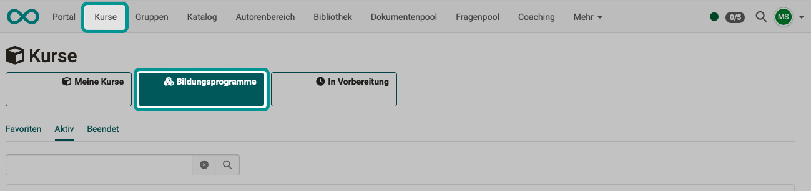
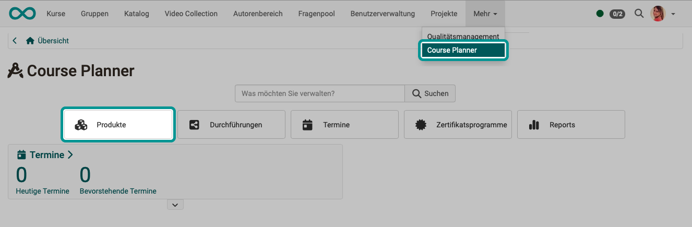
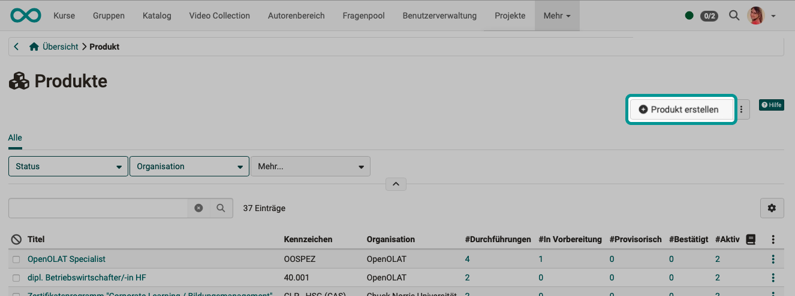
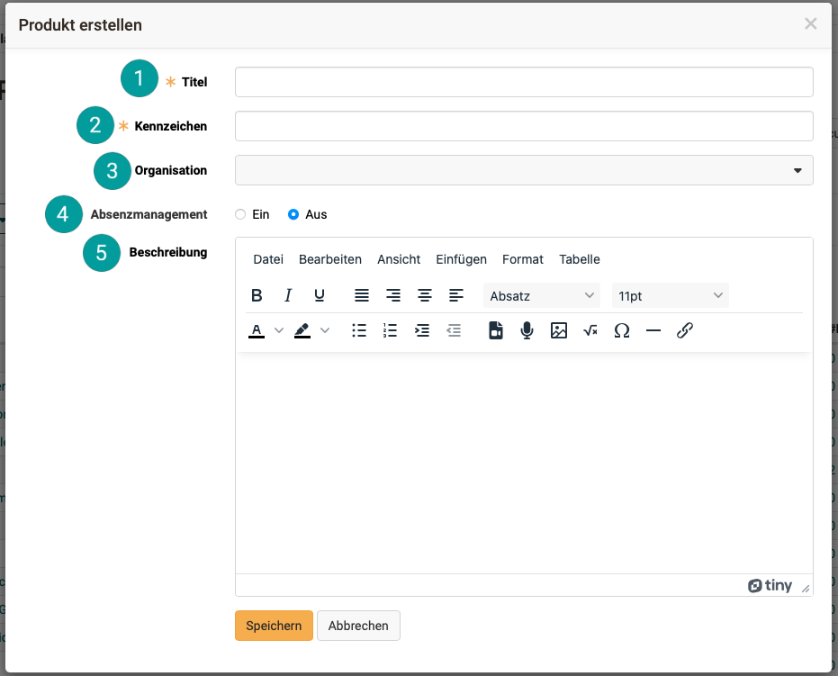
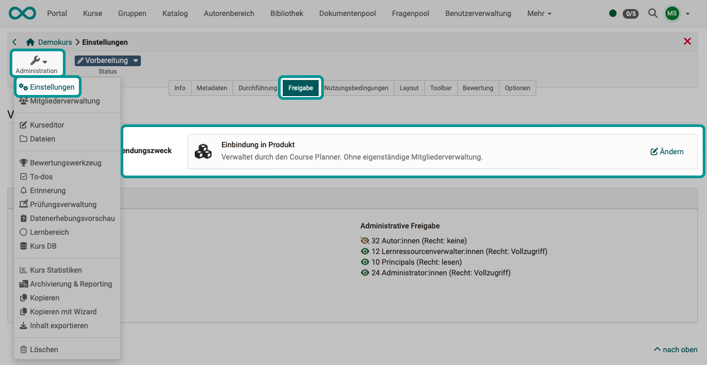

# Course Planner: Products {: #products}

{ class="shadow lightbox" }

## What do we mean by a product in OpenOlat? [:octicons-tag-16:{ title="from Release 20.0 (OO-8128)" }](https://track.frentix.com/issue/OO-8128){:target="_blank"} {: #definition}

An educational product is an inwardly or outwardly directed learning offer with implementations. In most cases, there are multiple implementations, i.e. learning opportunities of the same "type" (-> product).

Products often consist of several courses and have a specific structure/sequence in which the courses they contain are combined (structured products). The courses and learning resources are mapped in chronological order in a tree structure.

In the context of companies, the term (educational) "product" is often used instead of "curriculum". For this reason, the term "product" is generally used in OpenOlat.

With the Course Planner, an extended, general course planning function is integrated into OpenOlat.

[To the top of the page ^](#products)

---

## Where are products used? [:octicons-tag-16:{ title="from Release 20.0 (OO-8128)" }](https://track.frentix.com/issue/OO-8128){:target="_blank"} {: #usage_of_products}

Products are used in **Course Planner** to plan an educational program with several courses and learning resources ("course package"). A product can then be offered in several versions on different dates.

The implementations of a product can be offered in the [catalog ](../../manual_user/area_modules/catalog2.0_angebote.md).

If participants are not only assigned to a single course as members, but to the [Implementation](../../manual_user/area_modules/Course_Planner_Implementations.md) of a product, the membership is visible to the participants when they select the "Courses" option in the main menu. 

Courses that are assigned to a product appear there in the "Educational programs" section.

{ class="shadow lightbox" }  

[To the top of the page ^](#products)

---

## Where and how are products activated? {: #activation}

The Course Planner used to create products is an additional module in OpenOlat and must first be activated. 
Customers of frentix please contact [contact@frentix.com](mailto:contact@frentix.com) for activation.
 
If you are not a frentix hosting customer, please ask your system operator.

After activation, system administrators can activate and set up the module at: 
`Administration > Modules > Course Planner`

[To the top of the page ^](#products)

---

## Create Product [:octicons-tag-16:{ title="from Release 20.0 (OO-8128)" }](https://track.frentix.com/issue/OO-8128){:target="_blank"} {: #create_product}

To create a product, open the Course Planner and then the "Products" subsection.

{ class="shadow lightbox" }  

{ class="shadow lightbox" }  

{ class="shadow lightbox" }

 **Title**:
The specification of a title is mandatory.

 **Indicator**:
The indicator is also a mandatory field. (It is used as an identifier to differentiate between elements with the same title).

 **Organizations**:
When you create a new product, you can also restrict it to use within a specific organizational unit if you have activated the "Organizations" module.

 **Absence management**:
With this selection, you determine whether absence management should be used for this product. (Prerequisite is that it has been activated by an administrator and made available to the course authors).

 **Description**:
In this editor for the description, you can insert videos in addition to text, images and links or record audio directly by clicking on the microphone button.

[To the top of the page ^](#products)

---

## Filter and sort the product overview [:octicons-tag-16:{ title="from Release 21.0 (OO-9398)" }](https://track.frentix.com/issue/OO-9398){:target="_blank"} {: #product_overview}

The list of products is sorted by relevance: first products with ongoing implementations (Preparation, Provisional or Confirmed), then products with cancelled or finished implementations, and finally products without implementations. Within these groups, sorting is alphabetical. This keeps the currently relevant products at the top.

With **"Save filter"**, frequently used filter combinations can be saved as your own preset and reused.

Course planners work with the "All" view, which shows the active products. Administrators additionally have the predefined filters **"Active"** (selected by default) and **"Deleted"** available.

[To the top of the page ^](#products)

---

## Import and export products {: #import_product}

Products, implementations and memberships can also be imported or exported via an Excel file. The import wizard checks the data in several steps and shows exactly what will be newly created, changed or ignored before execution [:octicons-tag-16:{ title="from Release 20.3.0 (OO-9083)" }](https://track.frentix.com/issue/OO-9083){:target="_blank"}.

!!! note "Import / Export"

    A detailed description can be found under [Course Planner: Import / Export](Course_Planner_Import_Export.md).  

[To the top of the page ^](#products)

---

## Settings in the courses of a product {: #course_settings}

A product normally comprises several courses.
The **intended use** can be defined in the settings for each course:

* independent learning resource
* as a template
* for integration into a product

If a course is managed via the Course Planner, the setting is "**Integration in product**". The course then has no independent member administration. In this case, the member administration takes place in the member administration of [Implementation](../../manual_how-to/course_planner_courses/course_planner_courses.md#add_members).

You can find the setting under: 
**Choice of a course**: `Administration > Settings > Tab Share > Integration in product`

{ class="shadow lightbox" }  

[To the top of the page ^](#products)

---

## Further information {: #further_information}

[How do I create my first OpenOlat course >](../../manual_how-to/my_first_course/my_first_course.md) 
[Course Planner: Overview >](../../manual_user/area_modules/Course_Planner.md) 
[Course Planner: Implementations >](../../manual_user/area_modules/Course_Planner_Implementations.md) 
[Course Planner: Events >](../../manual_user/area_modules/Course_Planner_Events.md) 
[Course Planner: Certification programs >](../../manual_user/area_modules/Course_Planner_Certification_Programs.md) 
[Course Planner: Reports >](../../manual_user/area_modules/Course_Planner_Reports.md) 
[How can I plan and run a course with the Course Planner? >](../../manual_how-to/course_planner_courses/course_planner_courses.md) 
[How can I plan and run a course with the Course Planner? >](../../manual_how-to/course_planner_curriculum/course_planner_curriculum.md) 
[Activate Course Planner (Admin) >](../../manual_admin/administration/Modules_Course_Planner.md) 

[To the top of the page ^](#products)

