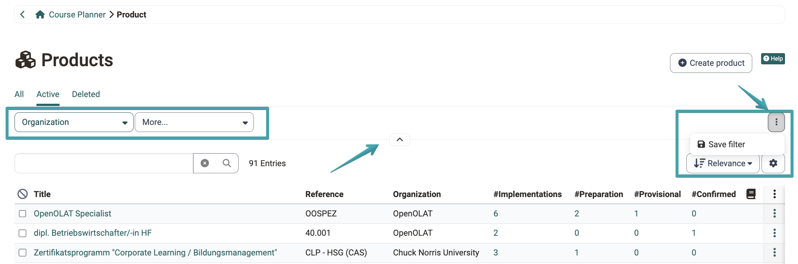
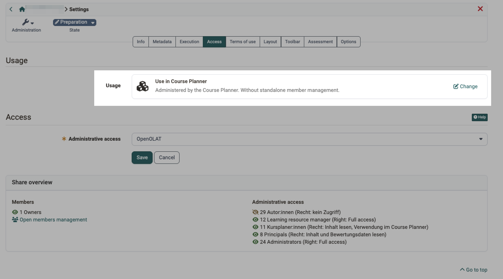

# Course Planner: Products [:octicons-tag-16:{ title="from Release 20.0 (OO-7834)" }](https://track.frentix.com/issue/OO-7834){:target="_blank"} {: #products}

{ class="shadow lightbox" }

## What do we mean by a product in OpenOlat? {: #definition}

An educational product is an inwardly or outwardly directed learning offer with implementations. In most cases, there are multiple implementations, i.e. learning opportunities of the same "type" (-> product).

Products often consist of several courses and have a specific structure/sequence in which the courses they contain are combined (structured products). The courses and learning resources are mapped in chronological order in a tree structure.

In the context of companies, the term (educational) "product" is often used instead of "curriculum". For this reason, the term "product" is generally used in OpenOlat.

With the Course Planner, an extended, general course planning function is integrated into OpenOlat.

[To the top of the page ^](#products)

---

## Where are products used? {: #usage_of_products}

Products are used in **Course Planner** to plan an educational program with several courses and learning resources ("course package"). A product can then be offered in several implementations on different dates.

The implementations of a product can be offered in the [catalog](../../manual_user/area_modules/catalog2.0_angebote.md).

If participants are not only assigned to a single course as members, but to the [Implementation](../../manual_user/area_modules/Course_Planner_Implementations.md) of a product, the membership is visible to the participants when they select the "Courses" option in the main menu. 
Courses that are assigned to a product appear there in the "Educational programs" section.

{ class="shadow lightbox" }  

[To the top of the page ^](#products)

---

## Where and how are products activated? {: #activation}

The Course Planner used to create products is an additional module in OpenOlat and must first be activated. 
Customers of frentix please contact [contact@frentix.com](mailto:contact@frentix.com) for activation. 
If you are not a frentix hosting customer, please ask your system operator.

After activation, system administrators can activate and set up the module at: 
`Administration > Modules > Course Planner`

[To the top of the page ^](#products)

---

## Create product {: #create_product}

To create a product, open the Course Planner and then the "Products" subsection.

{ class="shadow lightbox" }  

{ class="shadow lightbox" }  

{ class="shadow lightbox" }

 **Title**:
The specification of a title is mandatory.

 **Reference**:
The reference is also a mandatory field. (It is used as an identifier to differentiate between elements with the same title).

 **Organizations**:
When you create a new product, you can also restrict it to use within a specific organizational unit if you have activated the "Organizations" module.

 **Absence management**:
With this selection, you determine whether absence management should be used for this product. The prerequisite is that administrators have activated the module and made it available to the course authors, at: 
`Administration > Modules > Events / Absences`

 **Description**:
In this editor for the description, you can insert videos in addition to text, images and links or record audio directly by clicking on the microphone button.

[To the top of the page ^](#products)

---

## Filter and sort the product overview [:octicons-tag-16:{ title="from Release 21.0 (OO-9398)" }](https://track.frentix.com/issue/OO-9398){:target="_blank"} {: #product_overview}

The list of products is sorted by relevance: first products with ongoing implementations (Preparation, Provisional or Confirmed), then products with cancelled or finished implementations, and finally products without implementations. Within these groups, sorting is alphabetical. This keeps the currently relevant products at the top.

With **"Save filter"**, frequently used filter combinations can be saved as your own preset and reused.

Course planners work with the "All" view, which shows the active products. Administrators additionally have the predefined filters **"Active"** (selected by default) and **"Deleted"** available.

{ class="shadow lightbox" }

[To the top of the page ^](#products)

---

## Import and export products {: #import_product}

Products, implementations and memberships can also be imported or exported via an Excel file. The import wizard checks the data in several steps and shows exactly what will be newly created, changed or ignored before execution [:octicons-tag-16:{ title="from Release 20.3.0 (OO-9083)" }](https://track.frentix.com/issue/OO-9083){:target="_blank"}.

!!! note "Import / Export"

    A detailed description can be found under [Course Planner: Import / Export](Course_Planner_Import_Export.md).

[To the top of the page ^](#products)

---

## Settings in the courses of a product [:octicons-tag-16:{ title="from Release 20.0 (OO-8104)" }](https://track.frentix.com/issue/OO-8104){:target="_blank"} {: #course_settings}

A product normally comprises several courses.
In the settings of each course, the **Usage** field defines how the course is used:

* **Standalone**: independent learning resource with member management
* **Template**: template for course content, without standalone member management
* **Embedding in course**: reusable learning resource, without standalone member management
* **Use in Course Planner**: administered by the Course Planner, without standalone member management

If a course is managed via the Course Planner, the usage is **"Use in Course Planner"**. The course then has no independent member administration. In this case, the member administration takes place in the member administration of [Implementation](../../manual_how-to/course_planner_courses/course_planner_courses.md#add_members).

In the selected course you will find the usage in the **Usage** section under: 
`Course > Administration > Settings > Share`

{ class="shadow lightbox" }  

[To the top of the page ^](#products)

---

## Further information {: #further_information}

**Mentioned on this page** 
[Catalog 2.0 - Offers >](../../manual_user/area_modules/catalog2.0_angebote.md) 
[Course Planner: Implementations >](../../manual_user/area_modules/Course_Planner_Implementations.md) 
[Course Planner: Import / Export >](Course_Planner_Import_Export.md) 
[How do I plan and run courses with the Course Planner? >](../../manual_how-to/course_planner_courses/course_planner_courses.md)

**Further reading** 
[How do I create my first OpenOlat course? >](../../manual_how-to/my_first_course/my_first_course.md) 
[Course Planner: Overview >](../../manual_user/area_modules/Course_Planner.md) 
[Course Planner: Events >](../../manual_user/area_modules/Course_Planner_Events.md) 
[Course Planner: Certification programs >](../../manual_user/area_modules/Course_Planner_Certification_Programs.md) 
[Course Planner: Reports >](../../manual_user/area_modules/Course_Planner_Reports.md) 
[Coaching - Educational products >](../../manual_user/area_modules/Coaching_Educational_Products.md) 
[How do I plan and run a curriculum with the Course Planner? >](../../manual_how-to/course_planner_curriculum/course_planner_curriculum.md) 
[Module Course Planner (Administration) >](../../manual_admin/administration/Modules_Course_Planner.md)

[To the top of the page ^](#products)
