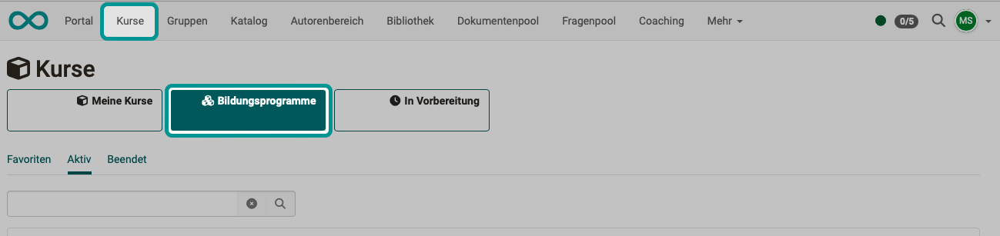

# Course Planner: Products {: #products}

{ class="shadow lightbox" }

## What do we mean by a product in OpenOlat? {: #definition}

An educational product is an inwardly or outwardly directed learning offer with implementations. In most cases, there are multiple implementations, i.e. learning opportunities of the same "type" (-> product).

Products often consist of several courses and have a specific structure/sequence in which the courses they contain are combined (structured products). The courses and learning resources are mapped in chronological order in a tree structure.

In the context of companies, the term (educational) "product" is often used instead of "curriculum". For this reason, the term "product" has generally been used in OpenOlat since Release 20.

As of Release 20, an extended, general course planning function (Course Planner) has been integrated into OpenOlat instead of curriculum management.

[To the top of the page ^](#products)

---

## Where are products used? {: #usage_of_products}

Products are used in **Course Planner** to plan an educational program with several courses and learning resources ("course package"). A product can then be offered in several versions on different dates.

The implementations of a product can be offered in the [catalog ](../../manual_user/area_modules/catalog2.0_angebote.md).

If participants are not only assigned to a single course as members, but to the [Implementation](../../manual_user/area_modules/Course_Planner_Implementations.md) of a product, the membership is visible to the participants when they select the "Courses" option in the main menu. 

Courses that are assigned to a product appear there in the "Educational programs" section.

{ class="shadow lightbox" }  

[To the top of the page ^](#products)

---

## Where and how are products activated? {: #activation}

The Course Planner used to create products is an additional module in OpenOlat and must first be activated. 
Customers of frentix please contact [contact@frentix.com.](mailto:contact@frentix.com.) for activation.
 
If you are not a frentix hosting customer, please ask your system operator.

After activation, system administrators can activate and set up the module at:
**Administration > Module > Course Planner**

[To the top of the page ^](#products)

---

## Create Product {: #create_product}

To create a product, open the Course Planner and then the "Products" subsection.

{ class="shadow lightbox" }  

{ class="shadow lightbox" }  

{ class="shadow lightbox" }

 **Title**:
The specification of a title is mandatory.

 **Indicator**:
The indicator is also a mandatory field. (It is used as an identifier to differentiate between elements with the same title).

 **Organizations**:
When you create a new product, you can also restrict it to use within a specific organizational unit if you have activated the "Organizations" module.

 **Absence management**:
With this selection, you determine whether absence management should be used for this product. (Prerequisite is that it has been activated by an administrator and made available to the course authors).

 **Description**:
In this editor for the description, you can insert videos in addition to text, images and links or record audio directly by clicking on the microphone button.

[To the top of the page ^](#products)

---

## Import product {: #import_product}

If you want to use an existing product for your planning, you can also import products. To do this, click on the three dots next to the ‘Create product’ button.

{ class="shadow lightbox" }  

[To the top of the page ^](#products)

---

## Settings in the courses of a product {: #course_settings}

A product normally comprises several courses.
The **intended use** can be defined in the settings for each course:

* independent learning resource
* as a template
* for integration into a product

If a course is managed via the Course Planner, the setting is "**Integration in product**". The course then has no independent member administration. In this case, the member administration takes place in the member administration of [Implementation](../../manual_how-to/course_planner_courses/course_planner_courses.md#add_members).

You can find the setting under: 
**(Choice of a course >) Administration > Settings > Tab Share > Implementation in a Product**

{ class="shadow lightbox" }  

[To the top of the page ^](#products)

---

## Further information {: #further_information}

[How do I create my first OpenOlat course >](../../manual_how-to/my_first_course/my_first_course.md) 
[Course Planner: Overview >](../../manual_user/area_modules/Course_Planner.md) 
[Course Planner: Implementations >](../../manual_user/area_modules/Course_Planner_Implementations.md) 
[Course Planner: Events >](../../manual_user/area_modules/Course_Planner_Events.md) 
[Course Planner: Certification programs >](../../manual_user/area_modules/Course_Planner_Certification_Programs.md) 
[Course Planner: Reports >](../../manual_user/area_modules/Course_Planner_Reports.md) 
[How can I plan and run a course with the Course Planner? >](../../manual_how-to/course_planner_courses/course_planner_courses.md) 
[How can I plan and run a course with the Course Planner? >](../../manual_how-to/course_planner_curriculum/course_planner_curriculum.md) 
[Activate Course Planner (Admin) >](../../manual_admin/administration/Modules_Course_Planner.md) 

[To the top of the page ^](#products)

