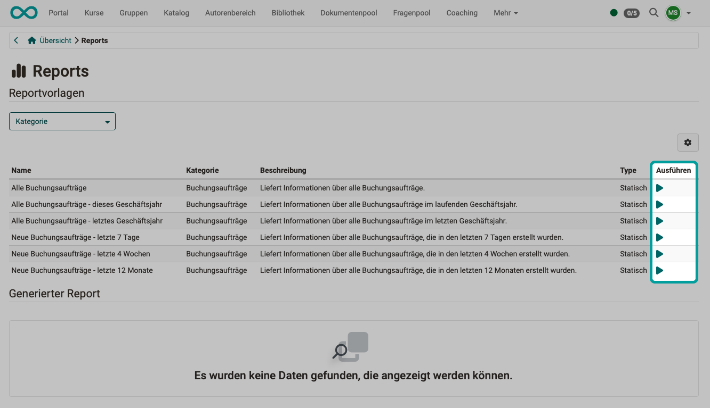

# Course Planner: Reports {: #reports}

{ class="shadow lightbox" }  

Für die Erstellung von Reports stehen verschiedene Vorlagen zur Verfügung, mit denen Sie sich einen Überblick über die eingegangenen Buchungsaufträge verschaffen können. 

Durch Klick auf die Pfeile in der Spalte "Ausführen" werden anhand dieser Vorlagen Excel-Dateien mit den aktuellen Daten erzeugt.  

{ class="shadow lightbox" }  

Die so erstellten Excel-Dateien finden Sie im unteren Bereich des Screens alle aufgelistet.
Sie können kopiert und heruntergeladen werden.

{ class="shadow lightbox" } 

!!! hint "Hinweis"

    Haben Sie bereits eine Durchführung gewählt, können Sie auch dort nach dem gleichen Vorgehen Reports erstellen. Sie finden sie dort unter dem [Tab Reports](../../manual_user/area_modules/Course_Planner_Implementations.de.md#tab_reports). Die Reports beziehen sich dort dann nur auf die gewählte Durchführung.
    

[zum Seitenanfang ^](#reports)

---

## Weitere Informationen {: #further_information}

[Wie erstelle ich meinen ersten OpenOlat-Kurs >](../../manual_how-to/my_first_course/my_first_course.de.md) 
[Course Planner: Übersicht >](../../manual_user/area_modules/Course_Planner.de.md) 
[Course Planner: Produkte >](../../manual_user/area_modules/Course_Planner_Products.de.md) 
[Course Planner: Durchführungen >](../../manual_user/area_modules/Course_Planner_Implementations.de.md) 
[Course Planner: Termine >](../../manual_user/area_modules/Course_Planner_Events.de.md) 
[Wie kann ich mit dem Course Planner Kursdurchführungen planen und durchführen? >](../../manual_how-to/course_planner_courses/course_planner_courses.de.md) 
[Wie kann ich mit dem Course Planner einen Bildungsgang planen und durchführen? >](../../manual_how-to/course_planner_curriculum/course_planner_curriculum.de.md) 
[Course Planner aktivieren (Admin) >](../../manual_admin/administration/Modules_Course_Planner.de.md) 

[zum Seitenanfang ^](#reports)

