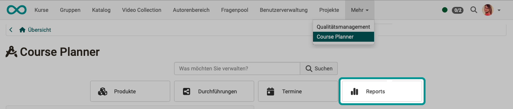

# Course Planner: Reports {: #reports}

{ class="shadow lightbox" } 

Various templates are available for creating reports, which you can use to obtain an overview of the booking orders received.

By clicking on the arrows in the "Execute" column, Excel files with the current data are generated using these templates.

{ class="shadow lightbox" }  

The Excel files created in this way are all listed at the bottom of the screen.
They can be copied and downloaded.

{ class="shadow lightbox" } 

!!! hint "Note"

    If you have already selected an implementation, you can also create reports there using the same procedure. You can find them there under the [Tab Reports](../../manual_user/area_modules/Course_Planner_Implementations.md#tab_reports). The reports then only refer to the selected implementation.

[To the top of the page ^](#reports)

---

## Further information {: #further_information}

[How do I create my first OpenOlat course >](../../manual_how-to/my_first_course/my_first_course.md) 
[Course Planner: Overview >](../../manual_user/area_modules/Course_Planner.md) 
[Course Planner: Implementations >](../../manual_user/area_modules/Course_Planner_Implementations.md) 
[Course Planner: Events >](../../manual_user/area_modules/Course_Planner_Events.md) 
[Course Planner: Reports >](../../manual_user/area_modules/Course_Planner_Reports.md) 
[How can I plan and run a course with the Course Planner? >](../../manual_how-to/course_planner_courses/course_planner_courses.md) 
[How can I plan and run a course with the Course Planner? >](../../manual_how-to/course_planner_curriculum/course_planner_curriculum.md) 
[Activate Course Planner (Admin) >](../../manual_admin/administration/Modules_Course_Planner.md) 

[To the top of the page ^](#products)

