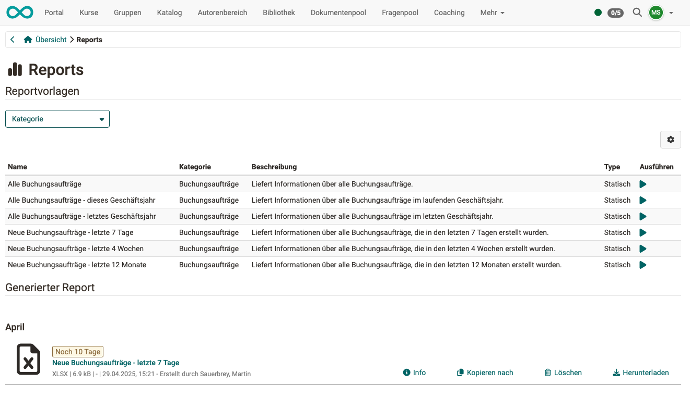
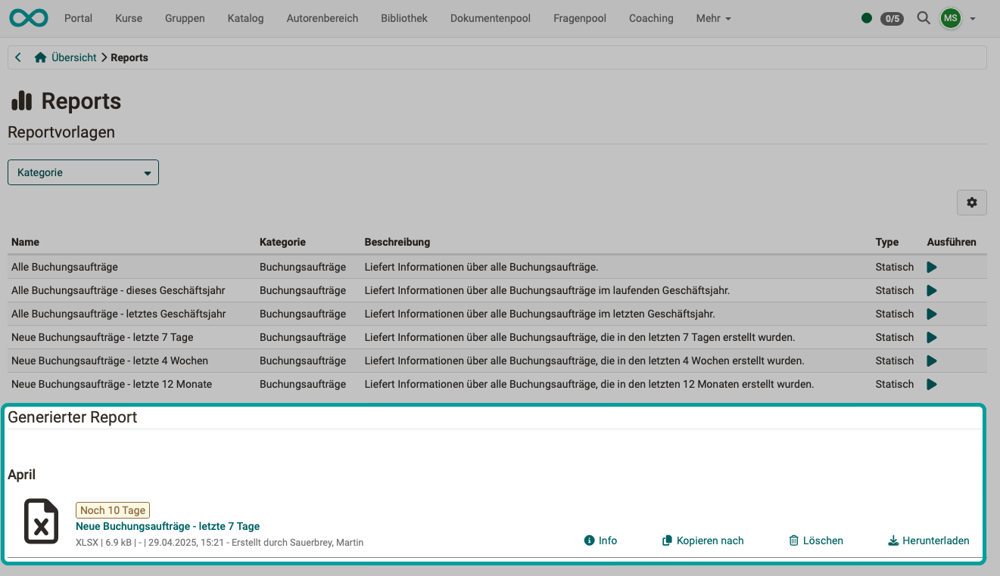

# Course Planner: Reports [:octicons-tag-16:{ title="from Release 20.3 (OO-9209)" }](https://track.frentix.com/issue/OO-9209) {: #reports}
In the «Reports» area, the Course Planner offers ready-made evaluations of the booking orders for your products and implementations. This gives you an overview of received bookings at a glance, without having to compile the data manually. The generated Excel files are suitable, for example, for handover to external invoicing or for internal evaluation.

The following roles can create reports:
- Course owner
- Principal
- Administrator

!!! note "Note"
    The reports each relate to the user's own organisation and are therefore not cross-organisational.

{ class="shadow lightbox" } 

The following templates are available for creating reports:

- All booking orders
- All booking orders, current fiscal year
- All booking orders, previous fiscal year
- New booking orders, last 7 days
- New booking orders, last 4 weeks
- New booking orders, last 12 months

By clicking on the arrows in the "Execute" column, Excel files with the current data are generated using these templates.

{ class="shadow lightbox" }  

The Excel files created in this way are all listed at the bottom of the screen.
They can be copied and downloaded.

{ class="shadow lightbox" } 

!!! note "Note"

    If you have already selected an implementation, you can also create reports there using the same procedure. You can find them there under the [Tab Reports](../../manual_user/area_modules/Course_Planner_Implementations.md#tab_reports). The reports then only refer to the selected implementation.
    
## Content of the booking report [:octicons-tag-16:{ title="from Release 20.3.2 (OO-9476)" }](https://track.frentix.com/issue/OO-9476) {: #inhalt_buchungsbericht}

The booking report contains all booking types. The generated Excel export is organised into several worksheets:

- Worksheet «All»: all bookings of the selected period, regardless of the offer type.
- One additional worksheet per offer type (for example invoice, free, access code).

Fields that only apply to certain offer types (for example the billing address for invoice bookings) remain empty for bookings of other offer types.

[To the top of the page ^](#reports)

---

## Further information {: #further_information}

[How do I create my first OpenOlat course >](../../manual_how-to/my_first_course/my_first_course.md) 
[Course Planner: Overview >](../../manual_user/area_modules/Course_Planner.md) 
[Course Planner: Products >](../../manual_user/area_modules/Course_Planner_Products.md) 
[Course Planner: Implementations >](../../manual_user/area_modules/Course_Planner_Implementations.md) 
[Course Planner: Events >](../../manual_user/area_modules/Course_Planner_Events.md) 
[Course Planner: Certification programs >](../../manual_user/area_modules/Course_Planner_Certification_Programs.md) 
[How can I plan and run a course with the Course Planner? >](../../manual_how-to/course_planner_courses/course_planner_courses.md) 
[How can I plan and run a course with the Course Planner? >](../../manual_how-to/course_planner_curriculum/course_planner_curriculum.md) 
[Activate Course Planner (Admin) >](../../manual_admin/administration/Modules_Course_Planner.md) 

[To the top of the page ^](#products)

