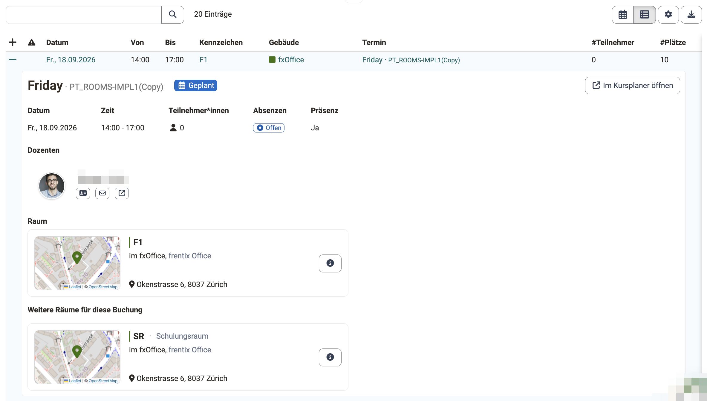
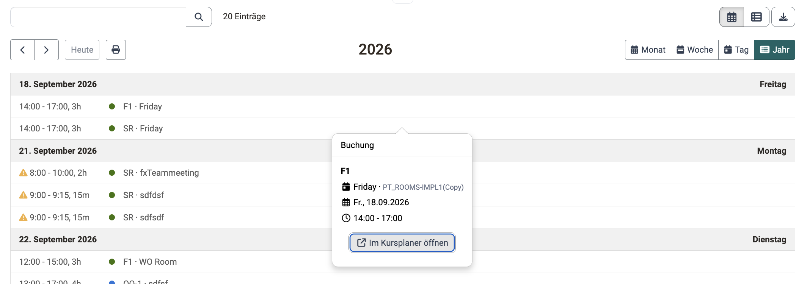

# Course Planner: Raumverwaltung [:octicons-tag-16:{ title="ab Release 21.0 (OO-9570)" }](https://track.frentix.com/issue/OO-9570){:target="_blank"} {: #course_planner_rooms}

## Wozu dient die Raumverwaltung im Course Planner? {: #purpose}

Sie sehen auf einen Blick, welche Räume für die Termine Ihrer Kurse gebucht sind und wo sich Buchungen überschneiden.

Der Bereich «Raumverwaltung» zeigt Ihnen die Raumplanung und die Räume, für die Ihre Organisation zuständig ist. Die Angaben stehen Ihnen im Course Planner zum Lesen zur Verfügung, ohne dass Sie die Administration aufsuchen.

[zum Seitenanfang ^](#course_planner_rooms)

---

## Wer hat Zugriff? [:octicons-tag-16:{ title="ab Release 21.0.3 (OO-9721)" }](https://track.frentix.com/issue/OO-9721){:target="_blank"} {: #access_roles}

Die Raumverwaltung im Course Planner steht zwei Rollen zur Verfügung:

* Administrator:in
* Kursplaner:in

Alle übrigen Rollen sehen den Bereich nicht, auch Produktbesitzer:in, Elementbesitzer:in und Principal. Kursbesitzer:in, Klassenlehrer:in, Betreuer:in und Teilnehmer:in arbeiten an der Durchführung des Kurses, nicht an dessen organisatorischer Planung.

Beide Rollen lesen die Angaben. Räume und Gebäude legen Sie in der System-Administration an und ändern sie dort, auch als Administrator:in. Die vollständige Übersicht der Rechte finden Sie in der [Rechte-Matrix](../area_modules/Course_Planner.de.md#rights_matrix) des Course Planners.

[zum Seitenanfang ^](#course_planner_rooms)

---

## Wo finde ich die Raumverwaltung? {: #access}

Sie finden die Raumverwaltung im Course Planner unter 
`Course Planner > Tools > Raumverwaltung`

!!! tip "Voraussetzung"

    Die Raumverwaltung steht nur zur Verfügung, wenn das Modul «Räume» von einem/einer Systemadministrator:in aktiviert worden ist. Steht der Bereich nicht zur Verfügung, wenden Sie sich bitte an Ihren/Ihre Systemadministrator:in oder den Support Ihrer OpenOlat Instanz.

[zum Seitenanfang ^](#course_planner_rooms)

---

## Raumplanung {: #room_scheduling}

Unter «Raumplanung» sehen Sie jede Buchung, die aus den Terminen Ihrer Kurse entstanden ist.

Eine Buchung entsteht, sobald Sie einem Termin einen Raum zuweisen. Sie entsteht ebenso, wenn Sie eine Durchführung mitsamt ihren Terminen kopieren: [Raumbuchungen beim Kopieren übernehmen](Course_Planner_Implementations.de.md#copy_rooms) [:octicons-tag-16:{ title="ab Release 21.0.2 (OO-9710)" }](https://track.frentix.com/issue/OO-9710){:target="_blank"}

Über der Tabelle wählen Sie den Zeitraum der Anzeige: «Heute und Bevorstehende», «Letzte 3 Monate» oder «Individuell» mit einer selbst gewählten Zeitspanne.

Mit den vordefinierten Tabs «Alle», «Heute», «Bevorstehend» und «Mit Warnungen» sowie den Filtern nach Gebäude und Raum grenzen Sie die Anzeige ein. Zusätzlich steht eine Volltextsuche zur Verfügung. Rechts über der Tabelle schalten Sie zwischen Tabelle und Kalender um; der Kalender bietet die Ansichten «Monat», «Woche», «Tag» und «Jahr». Der Umschalter erscheint, sobald die Anzeige mindestens eine Buchung enthält. Über «Im Kursplaner öffnen» springen Sie von einer Buchung zum zugehörigen Termin im Course Planner; der Termin öffnet sich in einem neuen Browser-Tab. [:octicons-tag-16:{ title="ab Release 21.0.2 (OO-9641)" }](https://track.frentix.com/issue/OO-9641){:target="_blank"}

{ class="shadow lightbox" }

### Details einer Buchung {: #booking_details}

Zu jeder Buchung sehen Sie, welcher Kurs, welche Dozent:innen und welche Räume dazugehören.

Klicken Sie dazu die Zeile der Tabelle auf. Die Detailansicht zeigt den Titel und das Kennzeichen des Termins mit seinem Statusabzeichen, allfällige Warnungen als hervorgehobenen Block, die Fachbereiche sowie Datum, Zeit, Teilnehmerzahl, Absenzen und Präsenzpflicht. Ein Ort erscheint, wenn er am Termin erfasst ist. Darunter stehen die Dozent:innen, der zugehörige Kurs als Kurskarte und die gebuchten Räume als Raumkarten. Ist mehr als ein Raum gebucht, steht der Raum der aufgeklappten Zeile unter «Raum», die übrigen unter «Weitere Räume für diese Buchung».

{ class="shadow lightbox" }

### Buchung im Kalender ansehen [:octicons-tag-16:{ title="ab Release 21.0.3 (OO-9715)" }](https://track.frentix.com/issue/OO-9715){:target="_blank"} {: #booking_callout}

Ein Klick auf eine Buchung im Kalender zeigt Ihnen, welcher Termin den Raum belegt.

Jede Buchung steht im Kalender als farbiger Block, beschriftet mit dem Kennzeichen des Raums und dem Titel des Termins, davor die Uhrzeit. Die Farbe ist die des Gebäudes. Ein Klick auf den Block öffnet das Fenster «Buchung» mit dem Kennzeichen des Raums und seiner Beschreibung, dem Titel des Termins mit seinem Kennzeichen, dem Datum und der Uhrzeit. Über «Im Kursplaner öffnen» gelangen Sie zum Termin im Course Planner.

Das Fenster steht in jeder Kalenderansicht der Raumverwaltung zur Verfügung: in der Raumplanung, in der Raumliste und im Kalender einer einzelnen Raumzeile. In der Tabellenansicht führt stattdessen die aufgeklappte Zeile zu den [Details einer Buchung](#booking_details).

{ class="shadow lightbox" }

{ class="shadow lightbox" }

### Warnungen {: #warnings}

Sie erkennen früh, wenn eine Buchung nicht aufgeht.

In der Tabelle weist die Spalte «Warnungen» darauf hin. Im Kalender trägt der Block zusätzlich zur Farbe seines Gebäudes ein Warndreieck. Es gibt drei Warnungen:

* **Doppelbuchung**: «Der Raum "..." ist in diesem Zeitraum doppelt gebucht!»
* **Zu wenig Plätze**: «Es gibt nicht genug Plätze!», wenn die Teilnehmerzahl die Anzahl Sitzplätze übersteigt.
* **Inaktiver Raum**: «Der Raum "..." ist inaktiv!»

[zum Seitenanfang ^](#course_planner_rooms)

---

## Räume {: #rooms}

Unter «Räume» sehen Sie, welche Räume Ihnen zur Verfügung stehen und wie stark sie belegt sind.

Die Liste führt die Räume, für die Ihre Organisation zuständig ist. Mit den vordefinierten Tabs «Alle» und «Relevant» sowie den Filtern nach Status (aktiv/inaktiv), Gebäude und Raum grenzen Sie die Anzeige ein. Zusätzlich steht eine Volltextsuche zur Verfügung. Auch hier schalten Sie rechts über der Tabelle auf den Kalender um.

Zu jedem Raum sehen Sie unter anderem das Gebäude, die «Belegung» (Auslastung des laufenden Monats) und den «Nächsten Termin». Das Kalendersymbol der Zeile öffnet die Belegung des Raums, «Details» öffnet eine Vorschau des Raums mit Standort und Karte. Über den Gebäude-Link gelangen Sie zum betreffenden Gebäude.

Auch im Kalender einer einzelnen Raumzeile öffnet ein Klick auf eine Buchung das [Fenster «Buchung»](#booking_callout).

{ class="shadow lightbox" }

!!! info "Gelöschte Räume in der Administration"

    Die Raumverwaltung des Course Planners führt die aktiven und die inaktiven Räume. Gelöschte Räume erscheinen in der System-Administration unter: 
    `Administration > Module > Räume > Räume` 
    Dort führt der Tab «Gelöscht» die gelöschten Räume.

[zum Seitenanfang ^](#course_planner_rooms)

---

## Räume und Gebäude verwalten {: #admin_edit}

!!! info "Bearbeitung nur in der Administration"

    Anlegen, Bearbeiten und Löschen von Räumen und Gebäuden erfolgt in der System-Administration unter `Administration > Module > Räume` und erfordert administrative Rechte. Dort finden Sie «Einstellungen», «Raumplanung», «Räume» und «Gebäude». [Räume verwalten (Administration) >](../../manual_admin/administration/Modules_Rooms.de.md)

[zum Seitenanfang ^](#course_planner_rooms)

---

## Weiterführende Informationen {: #further_information}

[Course Planner: Übersicht >](../area_modules/Course_Planner.de.md) 
[Course Planner: Durchführungen >](Course_Planner_Implementations.de.md) 
[Course Planner: Termine >](../area_modules/Course_Planner_Events.de.md) 
[Modul Räume (Administration) >](../../manual_admin/administration/Modules_Rooms.de.md)

[zum Seitenanfang ^](#course_planner_rooms)
