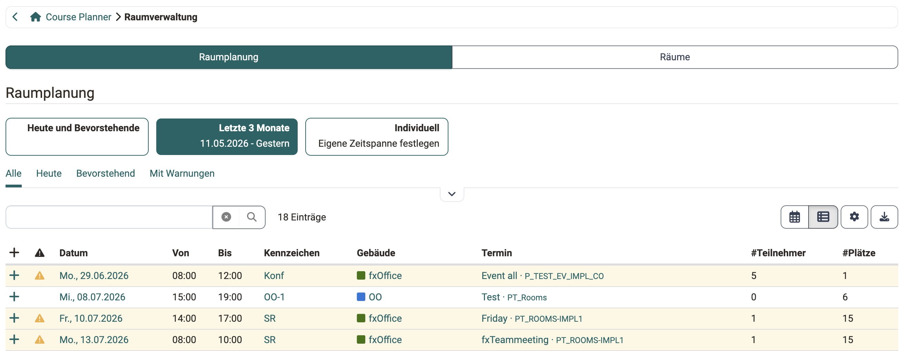
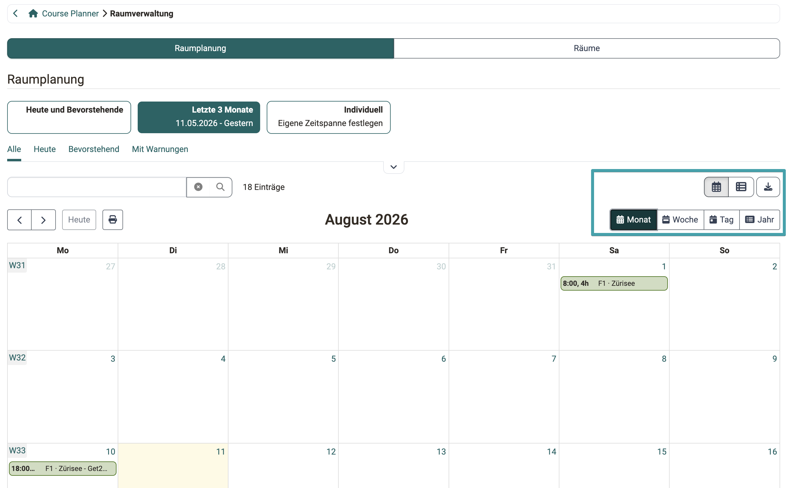
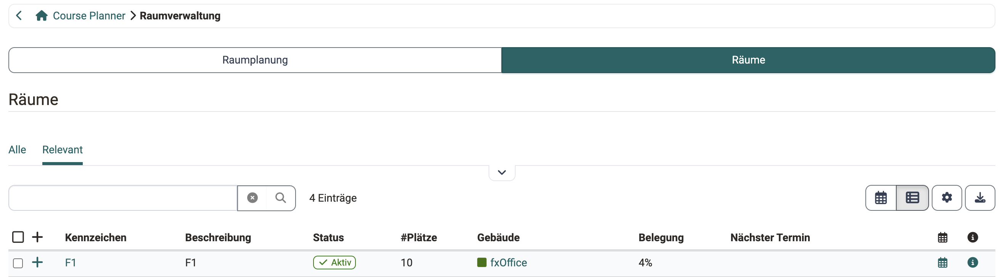

# Course Planner: Raumverwaltung [:octicons-tag-16:{ title="ab Release 21.0 (OO-9570)" }](https://track.frentix.com/issue/OO-9570){:target="_blank"} {: #course_planner_rooms}

## Wozu dient die Raumverwaltung im Course Planner? {: #purpose}

Der Bereich «Raumverwaltung» im Course Planner zeigt Ihnen eine schreibgeschützte Übersicht über die Raumplanung und die Räume in Ihrem organisatorischen Zuständigkeitsbereich. So sehen Sie auf einen Blick, welche Raumbuchungen zu den Terminen Ihrer Kurse bestehen, wo es Konflikte gibt und welche Räume Ihnen zur Verfügung stehen, ohne dafür die Administration aufsuchen zu müssen.

[zum Seitenanfang ^](#course_planner_rooms)

---

## Wer hat Zugriff? {: #access_roles}

Die Raumverwaltung im Course Planner steht folgenden Rollen zur Verfügung:

* Administrator:in
* Kursplaner:in
* Produktbesitzer:in
* Principal
* Elementbesitzer:in

Kursbesitzer:in, Klassenlehrer:in, Betreuer:in und Teilnehmer:in sehen die Raumverwaltung nicht. Ihre Rolle bezieht sich auf die Durchführung des Kurses, nicht auf dessen organisatorische Planung.

Die Ansicht ist für alle genannten Rollen ausschliesslich lesend: Räume und Gebäude anlegen, bearbeiten oder löschen ist im Course Planner nicht möglich, auch nicht für Administrator:innen. Die vollständige Übersicht der Rechte finden Sie in der [Rechte-Matrix](../area_modules/Course_Planner.de.md#rights_matrix) des Course Planners.

[zum Seitenanfang ^](#course_planner_rooms)

---

## Wo finde ich die Raumverwaltung? {: #access}

Sie finden die Raumverwaltung im Course Planner unter 
`Course Planner > Tools > Raumverwaltung`

!!! tip "Voraussetzung"

    Die Raumverwaltung steht nur zur Verfügung, wenn das Modul «Räume» von einem/einer Systemadministrator:in aktiviert worden ist. Steht der Bereich nicht zur Verfügung, wenden Sie sich bitte an Ihren/Ihre Systemadministrator:in oder den Support Ihrer OpenOlat Instanz.

[zum Seitenanfang ^](#course_planner_rooms)

---

## Raumplanung {: #room_scheduling}

Das Segment «Raumplanung» zeigt Ihnen alle Raumbuchungen als Übersicht. Buchungen entstehen aus den Terminen Ihrer Kurse, denen ein Raum zugewiesen wurde.

Mit den vordefinierten Tabs «Alle», «Heute», «Bevorstehend» und «Mit Warnungen» sowie den Filtern nach Gebäude und Raum grenzen Sie die Anzeige ein. Zusätzlich steht eine Volltextsuche zur Verfügung. Neben der Tabellenansicht gibt es eine Kalenderansicht. Über «Im Kursplaner öffnen» springen Sie von einer Buchung zum zugehörigen Termin im Course Planner. Jede Zeile lässt sich aufklappen und zeigt dann die Details der Buchung.

Die Spalte «Warnungen» macht auf Konflikte aufmerksam:

* **Doppelbuchung**: «Der Raum "..." ist in diesem Zeitraum doppelt gebucht!»
* **Zu wenig Plätze**: «Es gibt nicht genug Plätze!», wenn die Teilnehmerzahl die Anzahl Sitzplätze übersteigt.
* **Inaktiver Raum**: «Der Raum "..." ist inaktiv!»

{ class="shadow lightbox" }

{ class="shadow lightbox" }

[zum Seitenanfang ^](#course_planner_rooms)

---

## Räume {: #rooms}

Das Segment «Räume» zeigt Ihnen die Räume, auf die Sie über Ihre organisatorische Zugehörigkeit Zugriff haben.

Mit den vordefinierten Tabs «Alle» und «Relevant» sowie dem Filter nach Status (aktiv/inaktiv), Gebäude und Raum grenzen Sie die Anzeige ein. Zusätzlich steht eine Volltextsuche zur Verfügung. Neben der Tabellenansicht gibt es eine Kalenderansicht.

Zu jedem Raum sehen Sie unter anderem das Gebäude, die «Belegung» (Auslastung des laufenden Monats) und den «Nächsten Termin». Ein Symbol öffnet den «Kalender» des Raums mit seiner Belegung, über «Details» rufen Sie eine schreibgeschützte Vorschau des Raums mit Standort und Karte auf. Über den Gebäude-Link springen Sie direkt zum betreffenden Gebäude.

{ class="shadow lightbox" }

!!! info "Kein Gelöscht-Filter"

    In der Raumverwaltung des Course Planners werden gelöschte Räume nicht angezeigt. Sie erscheinen nur in der System-Administration unter: 
    `Administration > Module > Räume > Räume` 
    Dort führt der Tab «Gelöscht» die gelöschten Räume.

[zum Seitenanfang ^](#course_planner_rooms)

---

## Räume und Gebäude verwalten {: #admin_edit}

!!! info "Bearbeitung nur in der Administration"

    Anlegen, Bearbeiten und Löschen von Räumen und Gebäuden erfolgt in der System-Administration unter `Administration > Module > Räume` und erfordert administrative Rechte. Die Segmente dort heissen «Einstellungen», «Raumplanung», «Räume» und «Gebäude». [Räume verwalten (Administration) >](../../manual_admin/administration/Modules_Rooms.de.md)

[zum Seitenanfang ^](#course_planner_rooms)

---

## Weitere Informationen {: #further_information}

[Course Planner: Übersicht >](../area_modules/Course_Planner.de.md) 
[Course Planner: Termine >](../area_modules/Course_Planner_Events.de.md) 
[Räume verwalten (Administration) >](../../manual_admin/administration/Modules_Rooms.de.md) 

[zum Seitenanfang ^](#course_planner_rooms)
