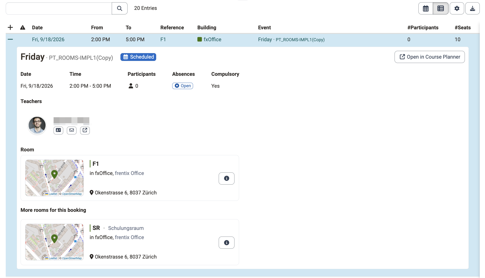
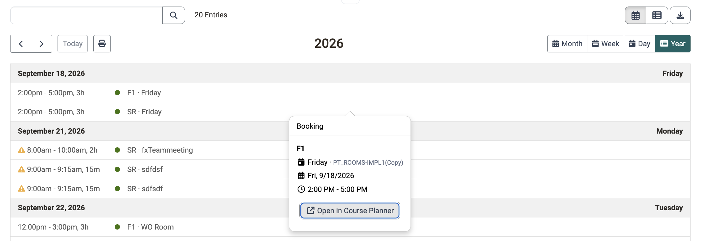
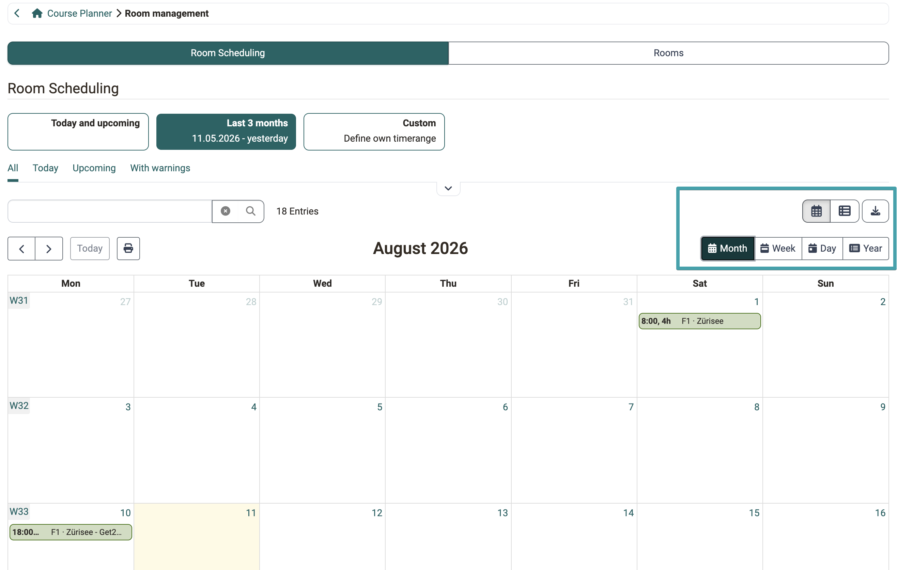
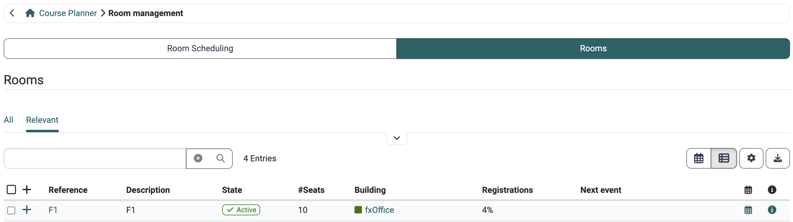

# Course Planner: Room management [:octicons-tag-16:{ title="from Release 21.0 (OO-9570)" }](https://track.frentix.com/issue/OO-9570){:target="_blank"} {: #course_planner_rooms}

## What's the purpose of Room management in the Course Planner? {: #purpose}

The "Room management" area in the Course Planner gives you a read-only overview of the room scheduling and the rooms in your organisational area of responsibility. This lets you see at a glance which room bookings exist for the events of your courses, where there are conflicts, and which rooms are available to you, without having to visit the administration.

[To the top of the page ^](#course_planner_rooms)

---

## Who has access? [:octicons-tag-16:{ title="from Release 21.0.3 (OO-9721)" }](https://track.frentix.com/issue/OO-9721){:target="_blank"} {: #access_roles}

Room management in the Course Planner is available to the following roles:

* Administrator
* Course planner

Product owner, Element owner and Principal do not see the area. Course owner, Master coach, Coach and Participant do not see Room management either. Their role relates to running the course, not to its organisational planning.

The view is read-only for both roles: creating, editing or deleting rooms and buildings is not possible in the Course Planner, not even for administrators. The complete overview of rights can be found in the [rights matrix](../area_modules/Course_Planner.md#rights_matrix) of the Course Planner.

[To the top of the page ^](#course_planner_rooms)

---

## Where can I find Room management? {: #access}

You will find Room management in the Course Planner under 
`Course Planner > Tools > Room management`

!!! tip "Requirement"

    Room management is only available if the module "Rooms" has been activated by a system administrator. If the area is not available, please contact your system administrator or the support of your OpenOlat instance.

[To the top of the page ^](#course_planner_rooms)

---

## Room Scheduling {: #room_scheduling}

The segment "Room Scheduling" shows you all room bookings as an overview. Bookings arise from the events of your courses to which a room has been assigned. They also arise when you copy an implementation together with its events: [Adopt room bookings when copying](Course_Planner_Implementations.md#copy_rooms) [:octicons-tag-16:{ title="from Release 21.0.2 (OO-9710)" }](https://track.frentix.com/issue/OO-9710){:target="_blank"}

Above the table you select the period of the display: "Today and upcoming", "Last 3 months" or "Custom" with a timerange of your own.

Use the pre-defined tabs "All", "Today", "Upcoming" and "With warnings" as well as the filters by building and room to narrow down the display. A full-text search is also available. In addition to the table view there is a calendar view with the views "Month", "Week", "Day" and "Year". Via "Open in Course Planner" you jump from a booking to the corresponding event in the Course Planner; the event opens in a new browser tab. [:octicons-tag-16:{ title="from Release 21.0.2 (OO-9641)" }](https://track.frentix.com/issue/OO-9641){:target="_blank"}

{ class="shadow lightbox" }

### Details of a booking {: #booking_details}

Each row of the table can be expanded. The detail view shows the title and the reference of the event with its status badge, any warnings as a highlighted block, the subjects as well as date, time, number of participants, absences and compulsory presence. A location only appears if one is recorded for the event. Below it you find the teachers, the corresponding course as a course card and the booked rooms as room cards. If more than one room is booked, the room of the expanded row is shown under "Room", the others under "More rooms for this booking".

{ class="shadow lightbox" }

### Callout "Booking" in the calendar view {: #booking_callout}

The callout exists only in the calendar view, not in the table. Use the first of the icons above the list on the right to switch there. A click on a coloured booking block then opens the callout "Booking"; a click on the day cell next to it does not. In this order it names the reference of the room with its description, the title of the event with its reference, the date and the time. Via "Open in Course Planner" you reach the event from there, as in the detail view above.

The callout is available in every calendar view of the room management: in the calendar view of the room scheduling, in the calendar view of the room list and in the calendar of a single room row. [:octicons-tag-16:{ title="from Release 21.0.3 (OO-9715)" }](https://track.frentix.com/issue/OO-9715){:target="_blank"}

{ class="shadow lightbox" }

{ class="shadow lightbox" }

### Warnings {: #warnings}

The column "Warnings" draws attention to conflicts:

* **Double booking**: "The room "..." is double-booked during this period!"
* **Not enough seats**: "There aren't enough seats!" if the number of participants exceeds the number of seats.
* **Inactive room**: "The room "..." is inactive!"

[To the top of the page ^](#course_planner_rooms)

---

## Rooms {: #rooms}

The segment "Rooms" shows you the rooms you have access to through your organisational affiliation.

Use the pre-defined tabs "All" and "Relevant" as well as the filter by status (active/inactive), building and room to narrow down the display. A full-text search is also available. In addition to the table view there is a calendar view.

For each room you see, among other things, the building, the "Occupancy rate" (utilisation of the current month) and the "Next event". An icon opens the "Calendar" of the room with its occupancy, and "Details" opens a read-only preview of the room with location and map. Via the building link you jump directly to the building concerned.

In the calendar of a single room row, too, a click on an entry opens the [callout "Booking"](#booking_callout).

{ class="shadow lightbox" }

!!! info "No deleted filter"

    In Room management of the Course Planner, deleted rooms are not shown. They only appear in the system administration under: 
    `Administration > Modules > Rooms > Rooms` 
    There, the "Deleted" tab lists the deleted rooms.

[To the top of the page ^](#course_planner_rooms)

---

## Manage rooms and buildings {: #admin_edit}

!!! info "Editing only in the administration"

    Creating, editing and deleting rooms and buildings takes place in the system administration under `Administration > Modules > Rooms` and requires administrative rights. The segments there are called "Settings", "Room Scheduling", "Rooms" and "Buildings". [Manage rooms (administration) >](../../manual_admin/administration/Modules_Rooms.md)

[To the top of the page ^](#course_planner_rooms)

---

## Further information {: #further_information}

[Course Planner: Overview >](../area_modules/Course_Planner.md) 
[Course Planner: Implementations >](Course_Planner_Implementations.md) 
[Course Planner: Events >](../area_modules/Course_Planner_Events.md) 
[Module Rooms (Administration) >](../../manual_admin/administration/Modules_Rooms.md)

[To the top of the page ^](#course_planner_rooms)
