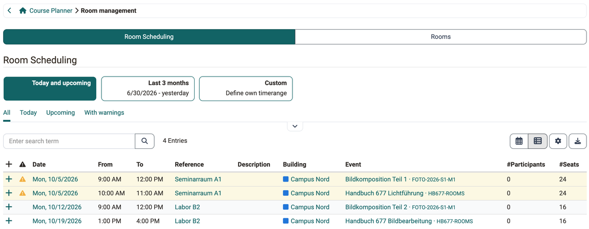
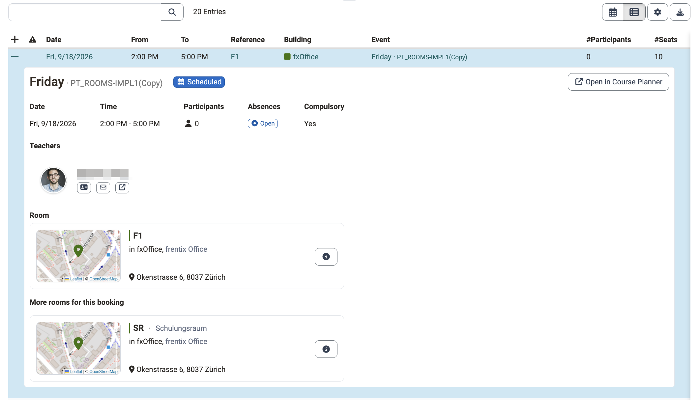
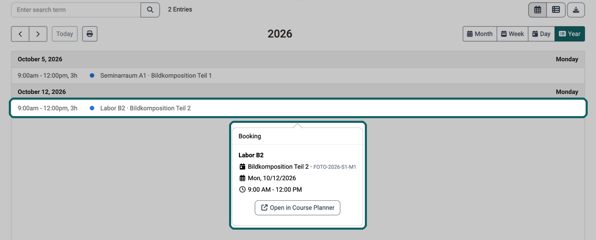
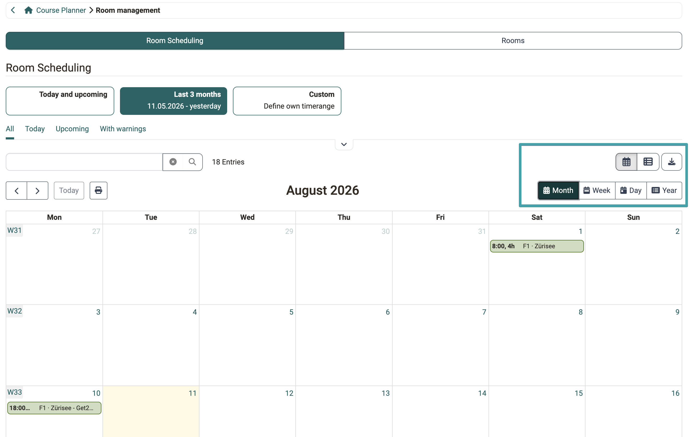
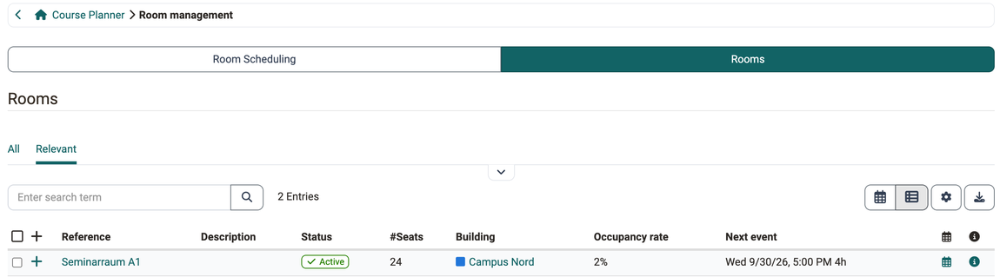

# Course Planner: Room management [:octicons-tag-16:{ title="from Release 21.0 (OO-9570)" }](https://track.frentix.com/issue/OO-9570){:target="_blank"} {: #course_planner_rooms}

## What's the purpose of Room management in the Course Planner? {: #purpose}

You see at a glance which rooms are booked for the events of your courses and where bookings overlap.

The "Room management" area shows you the room scheduling and the rooms your organisation is responsible for. The information is available to you for reading in the Course Planner, without visiting the system administration.

[To the top of the page ^](#course_planner_rooms)

---

## Who has access? [:octicons-tag-16:{ title="from Release 21.0.3 (OO-9721)" }](https://track.frentix.com/issue/OO-9721){:target="_blank"} {: #access_roles}

Room management in the Course Planner is available to two roles:

* Administrator
* Course planner

All other roles do not see the area, including Product owner, Element owner and Principal. Course owner, Master coach, Coach and Participant work on running the course, not on its organisational planning.

Both roles read the information. You create and change rooms and buildings in the system administration, also if you have the Administrator role: `Administration > Modules > Rooms`. The complete overview of rights can be found in the [rights matrix](../area_modules/Course_Planner.md#rights_matrix) of the Course Planner.

[To the top of the page ^](#course_planner_rooms)

---

## Where can I find Room management? {: #access}

You will find Room management in the Course Planner under 
`Course Planner > Tools > Room management`

!!! tip "Requirement"

    Room management is only available if a system administrator has activated the module "Rooms". If the area is not available, please contact your system administrator or the support of your OpenOlat instance.

[To the top of the page ^](#course_planner_rooms)

---

## Room Scheduling [:octicons-tag-16:{ title="from Release 21.0 (OO-9525)" }](https://track.frentix.com/issue/OO-9525){:target="_blank"} {: #room_scheduling}

Under "Room Scheduling" you see every booking that has arisen from the events of your courses.

A booking arises as soon as you assign a room to an event. It also arises when you copy events: when copying an implementation together with its events ([Adopt room bookings when copying](Course_Planner_Implementations.md#copy_rooms)) [:octicons-tag-16:{ title="from Release 21.0.2 (OO-9710)" }](https://track.frentix.com/issue/OO-9710){:target="_blank"} and when copying a course with its events ([Events and room bookings](../learningresources/Course_Copy_Wizard.md#events_rooms)) [:octicons-tag-16:{ title="from Release 21.0 (OO-9459)" }](https://track.frentix.com/issue/OO-9459){:target="_blank"}.

Above the table you select the period of the display: "Today and upcoming", "Last 3 months" or "Custom" with a timerange of your own.

Use the pre-defined tabs "All", "Today", "Upcoming" and "With warnings" as well as the filters by building and room to narrow down the display. A full-text search is also available. Above the table on the right you switch between table and calendar; the calendar offers the views "Month", "Week", "Day" and "Year". The switch appears as soon as the display holds at least one booking. Via "Open in Course Planner" you jump from a booking to the corresponding event in the Course Planner; the event opens in a new browser tab. [:octicons-tag-16:{ title="from Release 21.0.2 (OO-9641)" }](https://track.frentix.com/issue/OO-9641){:target="_blank"}

{ class="shadow lightbox" title="Room scheduling of Room management · 2026.09.30" }

### Details of a booking {: #booking_details}

For every booking you see which course, which teachers and which rooms belong to it.

To do so, expand the row of the table. The detail view shows the title and the reference of the event with its status badge, any warnings highlighted, the subjects as well as date, time, number of participants, absences and "Compulsory", that is whether attendance is mandatory. A location appears if one is recorded for the event. Below it you find the teachers, the corresponding course as a course card and the booked rooms as room cards. If more than one room is booked, the room of the expanded row is shown under "Room", the others under "More rooms for this booking".

{ class="shadow lightbox" title="Expanded booking in the room scheduling" }

### View a booking in the calendar [:octicons-tag-16:{ title="from Release 21.0.3 (OO-9715)" }](https://track.frentix.com/issue/OO-9715){:target="_blank"} {: #booking_callout}

A click on a booking in the calendar shows you which event occupies the room.

In the calendar, every booking appears as a calendar entry labelled with the reference of the room and the title of the event, preceded by the time. Its colour is the colour of the building. A click on the calendar entry opens the "Booking" window with the reference of the room and, if recorded, its description, the title of the event with its reference, the date and the time. Via "Open in Course Planner" you reach the event in the Course Planner.

The window is available in every calendar view of the room management: in the room scheduling, in the room list and in the calendar of a single room row. In the table view, the expanded row leads to the [details of a booking](#booking_details) instead.

{ class="shadow lightbox" title="Year view in the calendar of Room management · 2026.09.30" }

{ class="shadow lightbox" title="Calendar of the room scheduling" }

### Warnings {: #warnings}

You can tell from a booking whether room and event match.

In the table, a warning triangle in the "Warnings" column at the start of the row points this out. In the calendar, the calendar entry carries a warning triangle in addition to the colour of its building. There are three warnings:

* "The room "..." is double-booked during this period!" if two bookings of the same room overlap.
* "There aren't enough seats!" if the number of participants exceeds the number of seats.
* "The room "..." is inactive!" if the booked room is set to inactive.

[To the top of the page ^](#course_planner_rooms)

---

## Rooms {: #rooms}

Under "Rooms" you see which rooms are available to you and how heavily they are booked.

The list holds the rooms your organisation is responsible for. Use the pre-defined tabs "All" and "Relevant" as well as the filters by status (active/inactive), building and room to narrow down the display. A full-text search is also available. Here, too, you switch to the calendar above the table on the right.

For each room you see, among other things, the building, the "Occupancy rate" (utilisation of the current month) and the column "Next event". Via the "Calendar" icon you open the occupancy of the room, via the "Details" icon a preview of the room with location and map. Via the building link you reach the building concerned.

In the calendar of a single room row, too, a click on a booking opens the ["Booking" window](#booking_callout).

{ class="shadow lightbox" title="Rooms in Room management · 2026.09.30" }

!!! info "Deleted rooms in the administration"

    Room management of the Course Planner holds the active and the inactive rooms. Deleted rooms appear in the system administration under: 
    `Administration > Modules > Rooms > Rooms` 
    There, the "Deleted" tab lists the deleted rooms.

[To the top of the page ^](#course_planner_rooms)

---

## Manage rooms and buildings [:octicons-tag-16:{ title="from Release 21.0 (OO-9460)" }](https://track.frentix.com/issue/OO-9460){:target="_blank"} {: #admin_edit}

!!! info "Editing only in the administration"

    Creating, editing and deleting rooms and buildings takes place in the system administration under `Administration > Modules > Rooms` and requires administrative rights. There you find "Settings", "Room Scheduling", "Rooms" and "Buildings". [Manage rooms (administration) >](../../manual_admin/administration/Modules_Rooms.md)

[To the top of the page ^](#course_planner_rooms)

---

## Further information {: #further_information}

[Course Planner: Overview >](../area_modules/Course_Planner.md) 
[Course Planner: Implementations >](Course_Planner_Implementations.md) 
[Copy a course with wizard >](../learningresources/Course_Copy_Wizard.md) 
[Module Rooms (Administration) >](../../manual_admin/administration/Modules_Rooms.md) 
[Course Planner: Events >](../area_modules/Course_Planner_Events.md) 
[Course Planner: Import / Export >](Course_Planner_Import_Export.md)

[To the top of the page ^](#course_planner_rooms)
