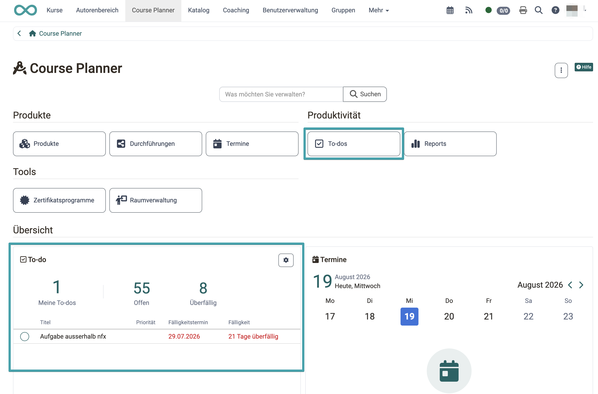
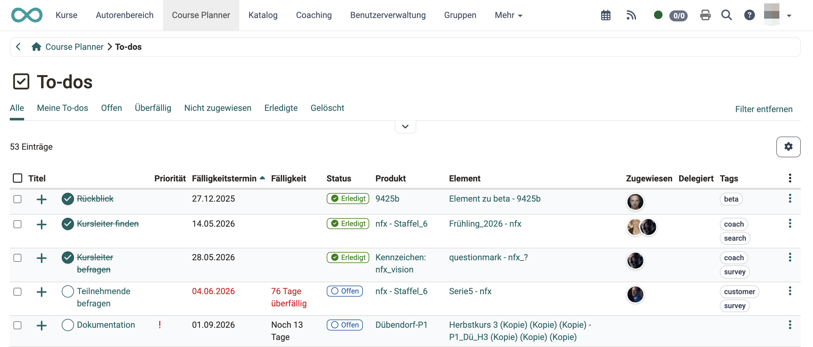
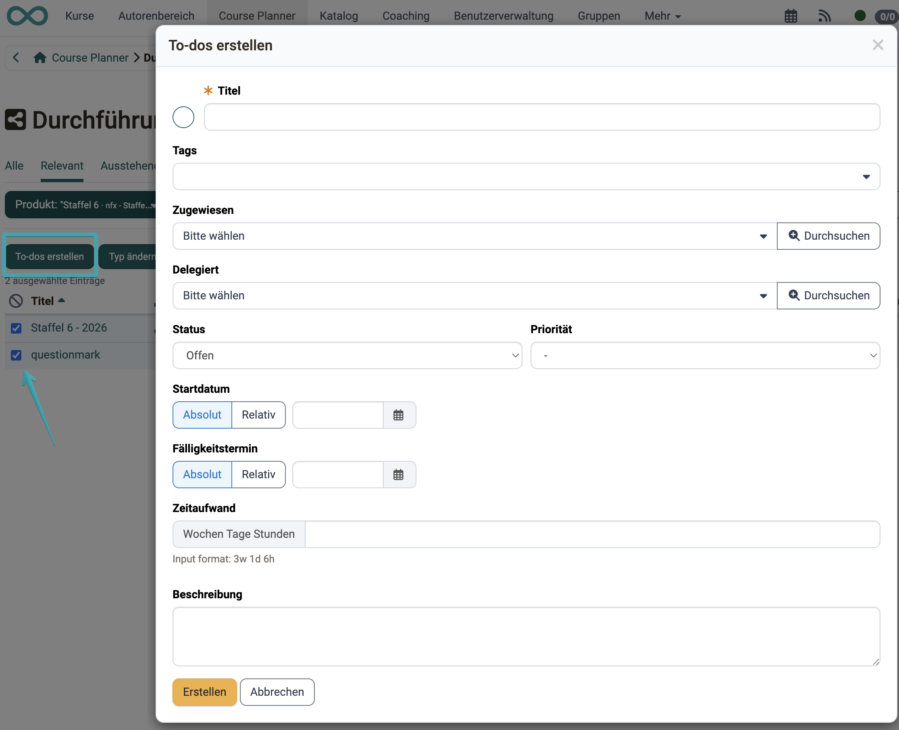
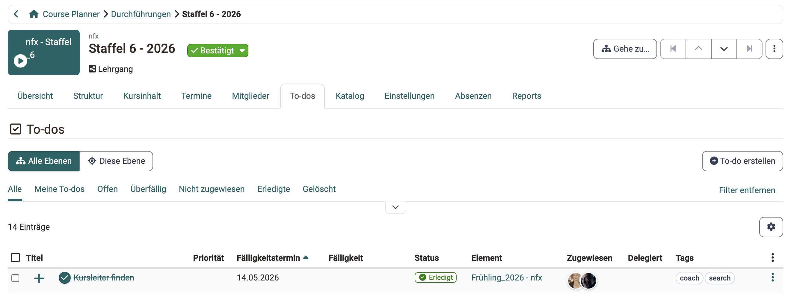
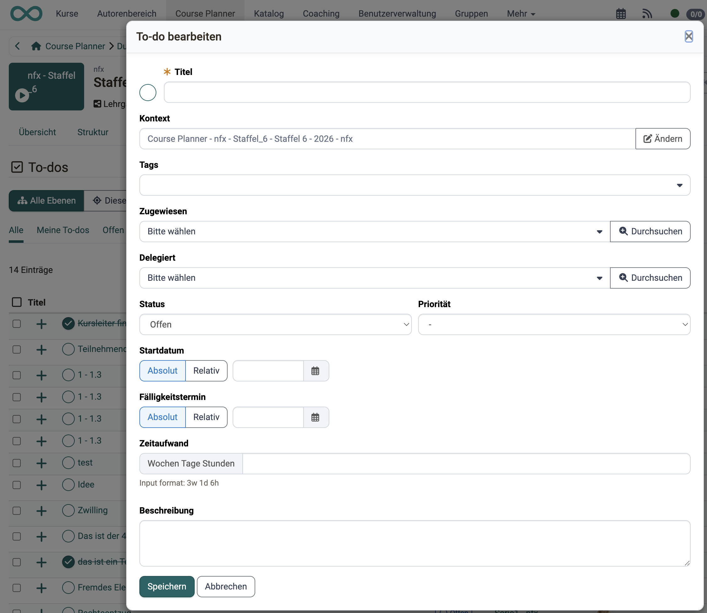
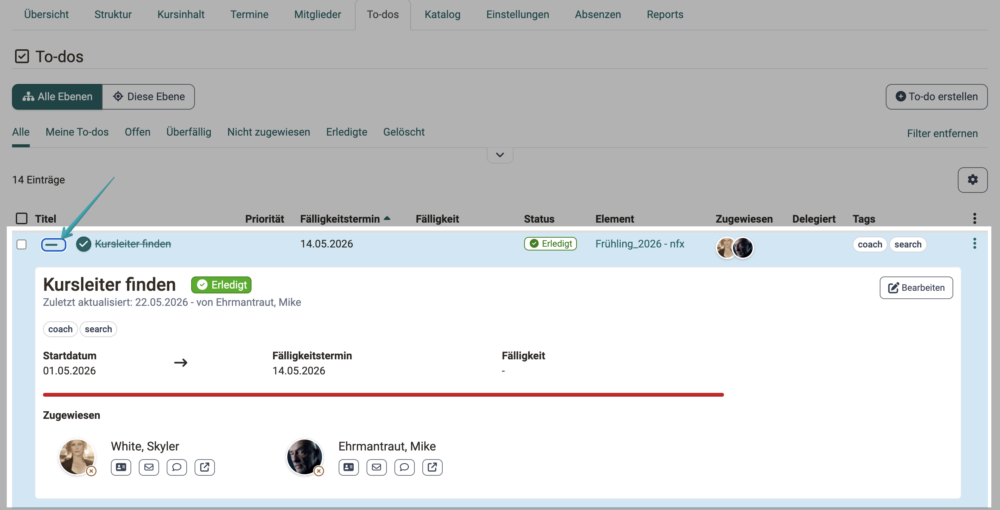
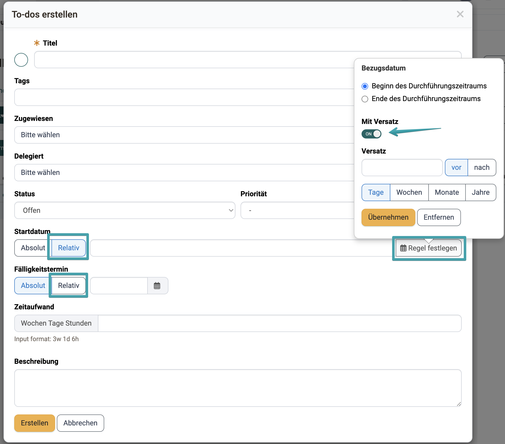

# Course Planner: To-dos [:octicons-tag-16:{ title="ab Release 21.0 (OO-9417)" }](https://track.frentix.com/issue/OO-9417){:target="_blank"} {: #course_planner_todos}

Im Course Planner lassen sich Aufgaben (To-dos) auf verschiedenen Ebenen erfassen: in der Übersicht, auf dem Produkt, auf der Durchführung und auf jedem einzelnen Element. Alle To-dos sind zentral in einer Übersicht einsehbar, ohne einzelne Durchführungen oder Elemente öffnen zu müssen. Ein Widget auf dem Dashboard zeigt offene und überfällige To-dos auf einen Blick.

{ class="shadow lightbox" }

[Zum Seitenanfang ^](#course_planner_todos)

---

## To-do-Widget [:octicons-tag-16:{ title="ab Release 21.0 (OO-9422)" }](https://track.frentix.com/issue/OO-9422){:target="_blank"} {: #todo_widget}

Das **To-do**-Widget zeigt auf einen Blick, welche Aufgaben Ihre unmittelbare Aufmerksamkeit erfordern. Es steht im Abschnitt «Übersicht» der Startseite, unterhalb der Bereiche Produkte, Produktivität und Tools.

Drei Kennzahlen fassen den Stand zusammen:

* **Meine To-dos**: To-dos, bei denen Sie als «Zugewiesen» eingetragen sind.
* **Offen**: To-dos mit Status «Offen».
* **Überfällig**: To-dos, deren Fälligkeitstermin überschritten ist.

Darunter listet das Widget Ihre eigenen To-dos mit Titel, Priorität, Fälligkeitstermin und Fälligkeit auf; überschrittene Termine erscheinen in Rot. Ein Klick auf den Titel öffnet das To-do direkt. Sind keine To-dos vorhanden, erscheint der Hinweis «Keine To-dos verfügbar».

!!! note "Dashboard Konfiguration"
    Das Widget kann wie alle CPL-Dashboard-Widgets über die Dashboard-Konfiguration ein- und ausgeblendet werden.

[Zum Seitenanfang ^](#course_planner_todos)

---

## Zentrale To-do-Übersicht [:octicons-tag-16:{ title="ab Release 21.0 (OO-9418)" }](https://track.frentix.com/issue/OO-9418){:target="_blank"} {: #central_overview}

Die zentrale To-do-Übersicht fasst alle To-dos über alle Produkte und Elemente hinweg in einer Tabelle zusammen. Sie öffnen sie über den Button **«To-dos»** im Bereich **«Produktivität»** auf der Startseite des Course Planners.

Die Übersicht zeigt alle To-dos, für die Sie zugewiesen oder delegiert sind, sowie alle To-dos in Produkten, auf die Sie Zugriff haben.

{ class="shadow lightbox" }

### Vordefinierte Filter {: #predefined_filters}

Mit den Schnellfiltern grenzen Sie die Ansicht thematisch ein:

| Filter | Zeigt |
|---|---|
| Alle | Alle sichtbaren To-dos |
| Meine To-dos | To-dos, bei denen Sie als «Zugewiesen» eingetragen sind |
| Offen | To-dos mit Status «Offen» |
| Überfällig | To-dos, deren Fälligkeitstermin überschritten ist |
| Nicht zugewiesen | To-dos ohne zugewiesene Person |
| Erledigte | To-dos mit Status «Erledigt» |
| Gelöscht | Gelöschte To-dos |

### Tabellenspalten {: #table_columns}

Über das Zahnrad-Symbol wählen Sie, welche Spalten angezeigt werden. Standardmässig eingeblendet:

* **Titel** (bei neuen To-dos mit Markierung «Neu»)
* **Produkt** (das zugehörige Produkt)
* **Element** (das zugehörige Element innerhalb des Produkts)
* **Priorität**
* **Fälligkeitstermin** (das gesetzte Datum)
* **Fälligkeit** (der Abstand zum heutigen Tag, überfällige Einträge in Rot)
* **Status**
* **Zugewiesen**
* **Delegiert**
* **Tags**

Optional einblendbar: Zeitaufwand, Startdatum, Erledigt-Datum, Erstellt, Erstellt von, Geändert, Gelöscht, Gelöscht von.

### Sammelaktion «Löschen» {: #bulk_actions}

Aktivieren Sie die Checkbox in der ersten Spalte, um einzelne To-dos zu markieren, oder wählen Sie über die Checkbox im Tabellenkopf alle To-dos der aktuellen Ansicht auf einmal aus. Sobald mindestens ein To-do markiert ist, erscheint oberhalb der Tabelle die Sammelaktion **«Löschen»**.

Nach einer Sicherheitsabfrage werden die markierten To-dos gelöscht. Gelöschte To-dos sind nicht endgültig entfernt: Sie erhalten den Status «Gelöscht» und bleiben über den Filter **«Gelöscht»** einsehbar. In der Ansicht «Gelöscht» steht die Sammelaktion selbst nicht zur Verfügung.

[Zum Seitenanfang ^](#course_planner_todos)

---

## To-dos direkt für mehrere Durchführungen erstellen [:octicons-tag-16:{ title="ab Release 21.0 (OO-9539)" }](https://track.frentix.com/issue/OO-9539){:target="_blank"} {: #bulk_create}

In der Durchführungsübersicht sowie im Tab «Durchführungen» eines Produkts können Sie über eine Sammelaktion gleichzeitig ein To-do für mehrere Durchführungen erstellen.

1. Wählen Sie in der Durchführungsübersicht die gewünschten Durchführungen aus (Checkbox in der ersten Spalte).
2. Klicken Sie oberhalb der Tabelle auf **«To-dos erstellen»**.
3. Füllen Sie den Dialog aus. Ein Kontextfeld enthält er nicht: Produkt und Element ergeben sich aus den gewählten Durchführungen.

**«Zugewiesen»** und **«Delegiert»** sind Auswahlfelder. Der Pfeil :o_icon_o_icon_caret: am rechten Rand kennzeichnet sie; ein Klick auf das Feld öffnet die Liste der wählbaren Personen. Der Button **«Durchsuchen»** :o_icon_o_icon_browse: daneben öffnet die Benutzersuche und hilft, wenn die Liste lang ist.

Die übrigen Felder des Dialogs sind unter [Erstellen eines To-dos](#create_todo) beschrieben.

{ class="shadow lightbox" }

!!! info "Wichtig"
    Die Auswahlfelder «Zugewiesen» und «Delegiert» zeigen ausschliesslich Personen, die in den betreffenden und gewählten Durchführungen zugriffsberechtigt sind.

[Zum Seitenanfang ^](#course_planner_todos)

---

## Tab «To-dos» auf einem Element {: #element_tab_todos}

Jedes Element im Course Planner verfügt über einen Tab **«To-dos»**. Dort erstellen, bearbeiten und verwalten Sie Aufgaben, die direkt diesem Element zugeordnet sind.

Mit den Umschaltern **«Alle Ebenen»** und **«Diese Ebene»** bestimmen Sie den Umfang der Liste: «Alle Ebenen» zeigt zusätzlich die To-dos aller untergeordneten Elemente, «Diese Ebene» nur die des geöffneten Elements.

{ class="shadow lightbox" }

### Berechtigungen {: #todo_permissions}

* **Kursplaner:innen** und **Elementbesitzer:innen** können To-dos erstellen, bearbeiten, zuweisen und delegieren.
* **Kursbesitzer:innen** können To-dos, die ihrem Kurs zugeordnet sind, als erledigt markieren; sie können sie aber nicht erstellen oder anderweitig bearbeiten.
* **Principals** können To-dos einsehen aber nicht bearbeiten.

### Erstellen eines To-dos {: #create_todo}

Im Tab «To-dos» eines Elements klicken Sie auf **«To-do erstellen»**. Der nachfolgende Dialog enthält folgende Felder:

* **Titel** (Pflichtfeld): Bezeichnet die Aufgabe.
* **Zugewiesen** (Pflichtfeld): Die Person, die für die Erledigung verantwortlich ist.
* **Delegiert**: Die Ausführung kann an eine andere Person delegiert werden; die Verantwortung bleibt bei der zugewiesenen Person.
* **Status**: Setzt den aktuellen Bearbeitungsstand (Offen, In Bearbeitung, Erledigt).
* **Priorität**: Dringend, Hoch, Mittel oder Tief.
* **Startdatum** und **Fälligkeitstermin**: Absolut oder [relativ zum Durchführungszeitraum](#relative_date).
* **Zeitaufwand**: Geschätzter Aufwand in Wochen, Tagen und Stunden, Eingabeformat `3w 1d 6h`.
* **Tags**: Frei vergebbare Schlagwörter.
* **Beschreibung**: Ergänzende Informationen zur Aufgabe.

Beim späteren Bearbeiten enthält der Dialog dieselben Felder und zusätzlich den **Kontext**, also Produkt und Element des To-dos. Über **«Ändern»** weisen Sie das To-do einem anderen Element zu.

{ class="shadow lightbox" }

!!! info "Aktionsmenü"
    Über das Aktionsmenü (3-Punkte-Symbol) einer To-do-Zeile stehen **Bearbeiten**, **Duplizieren** und **Löschen** zur Verfügung. Mit **Duplizieren** kopieren Sie ein bestehendes To-do samt seinen Eigenschaften. Diese Aktionen setzen Bearbeitungsrechte voraus.

#### Übersicht der To-do-Status {: #todo_status}

| Status | Bedeutung |
|---|---|
| Offen | Die Aufgabe ist erstellt, aber noch nicht begonnen. |
| In Bearbeitung | Die Arbeit an der Aufgabe hat begonnen. |
| Erledigt | Die Aufgabe ist abgeschlossen. |
| Gelöscht | Das To-do wurde gelöscht und ist nur noch im Filter «Gelöscht» sichtbar. |

### Schnellaktionen im Detailbereich [:octicons-tag-16:{ title="ab Release 21.0 (OO-9563)" }](https://track.frentix.com/issue/OO-9563){:target="_blank"} {: #quick_actions}

Über das Pluszeichen am Zeilenanfang klappen Sie den Detailbereich eines To-dos auf. Er zeigt Titel und Status, wer das To-do zuletzt aktualisiert hat, die Tags, Startdatum, Fälligkeitstermin und Fälligkeit sowie die zugewiesenen Personen mit ihren Kontaktmöglichkeiten. Sind Startdatum und Fälligkeitstermin gesetzt, erscheint zusätzlich ein Fortschrittsbalken.

Rechts oben im Detailbereich stehen die Schnellaktionen, abhängig vom Status des To-dos:

* **«Starten»** setzt den Status auf «In Bearbeitung». Die Aktion erscheint nur beim Status «Offen».
* **«Als erledigt markieren»** schliesst die Aufgabe ab. Die Aktion erscheint bei den Status «Offen» und «In Bearbeitung».
* **«Bearbeiten»** öffnet den Dialog mit allen Feldern. Diese Aktion steht in jedem Status zur Verfügung.

Bei einem erledigten To-do bleibt deshalb nur **«Bearbeiten»** sichtbar.

Alle Aktionen setzen Bearbeitungsrechte voraus. Sie erscheinen für die Person, die das To-do erstellt hat, für die zugewiesene und die delegierte Person sowie für die Rollen mit Bearbeitungsrecht (siehe [Berechtigungen](#todo_permissions)).

{ class="shadow lightbox" }

[Zum Seitenanfang ^](#course_planner_todos)

---

## Relative Datumsangaben [:octicons-tag-16:{ title="ab Release 21.0 (OO-9425)" }](https://track.frentix.com/issue/OO-9425){:target="_blank"} {: #relative_date}

Beim Erstellen oder Bearbeiten eines To-dos im Course Planner können **Startdatum** und **Fälligkeitstermin** entweder **absolut** (ein festes Kalenderdatum) oder **relativ** (bezogen auf den Durchführungszeitraum) festgelegt werden.

### Relative Datumsangabe konfigurieren {: #configure_relative_date}

Schalten Sie beim **Startdatum** oder beim **Fälligkeitstermin** von **«Absolut»** auf **«Relativ»** um. Über **«Regel festlegen»** öffnen Sie das Popover und bestimmen dort:

* **Bezugsdatum**: «Beginn des Durchführungszeitraums» oder «Ende des Durchführungszeitraums».
* **Mit Versatz** (optional): Aktivieren Sie diesen Schalter, um einen Abstand zum Bezugsdatum anzugeben.
  * **Versatz**: Anzahl mit Einheit (Tage, Wochen, Monate oder Jahre).
  * **Richtung**: «vor» oder «nach» dem Bezugsdatum.

Mit **«Übernehmen»** speichern Sie die Regel, mit **«Entfernen»** verwerfen Sie sie.

Das berechnete Datum wird als Vorschau angezeigt, solange ein Durchführungszeitraum definiert ist. Ändert sich der Durchführungszeitraum nachträglich, passt sich der Fälligkeitstermin automatisch an.

{ class="shadow lightbox" }

!!! info "Wichtig"
    Relatives Datum steht nur im Course Planner zur Verfügung. Im persönlichen Menü und in anderen Kontexten (Projekt, Kurs) sind nur absolute Daten möglich.

[Zum Seitenanfang ^](#course_planner_todos)

---

## Weiterführende Informationen {: #further_information}

[Course Planner: Übersicht >](Course_Planner.de.md) 
[Course Planner: Durchführungen >](Course_Planner_Implementations.de.md) 
[To-dos (persönliches Menü) >](../personal_menu/To-Dos.de.md) 
[Allgemeines zu To-dos >](../basic_concepts/To_Dos_Basics.de.md) 
[Course Planner aktivieren (Admin) >](../../manual_admin/administration/Modules_Course_Planner.de.md) 

[Zum Seitenanfang ^](#course_planner_todos)
