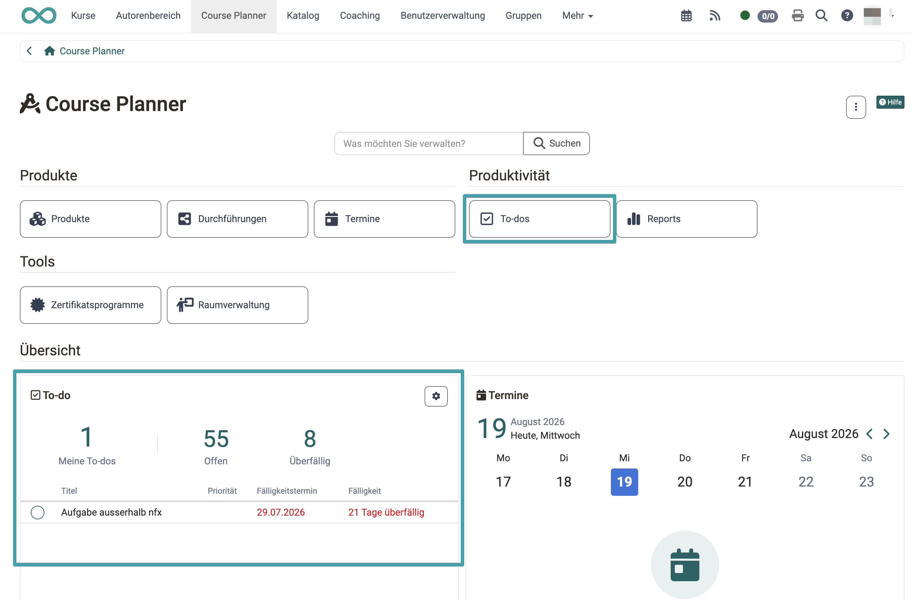
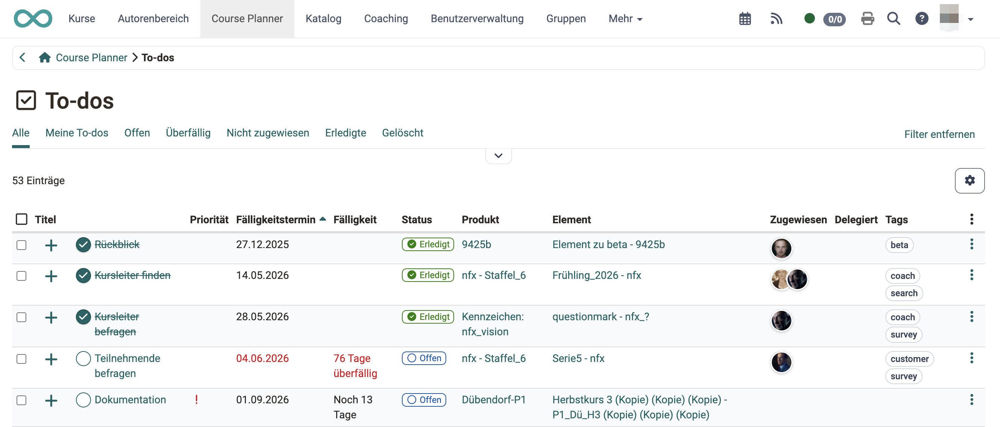
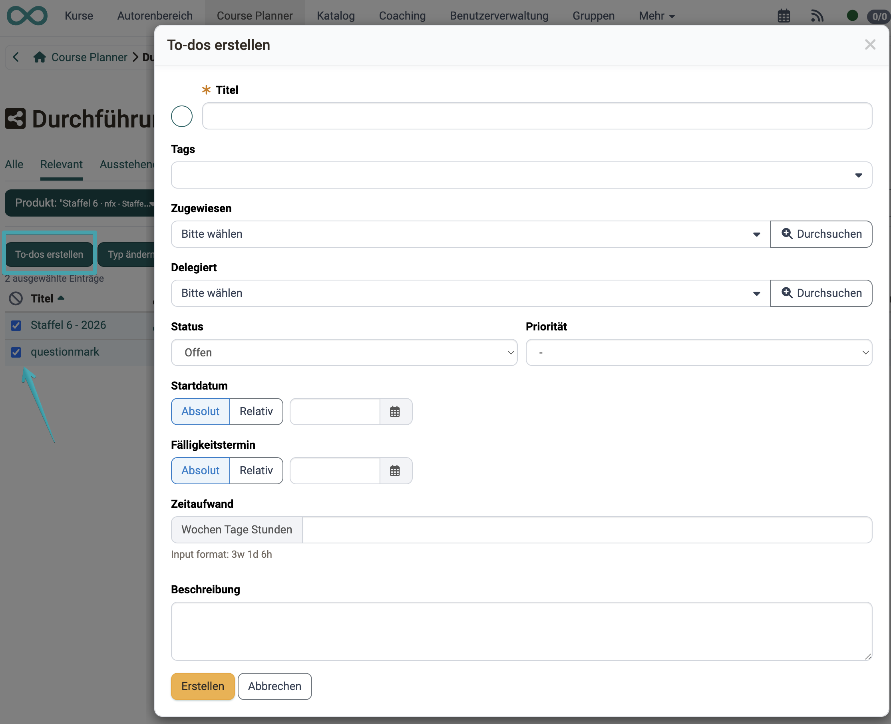
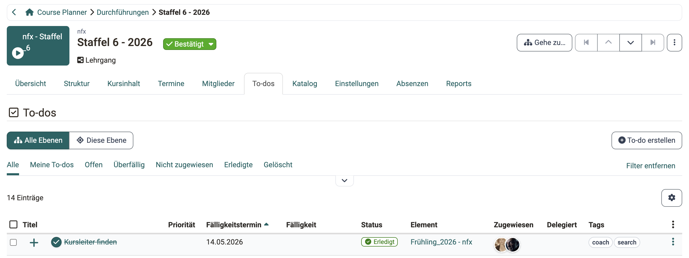
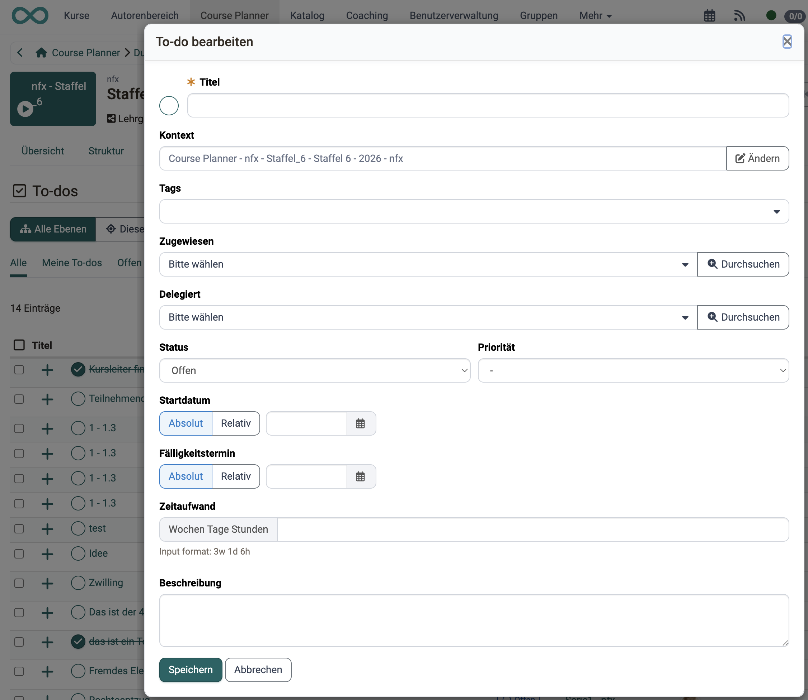
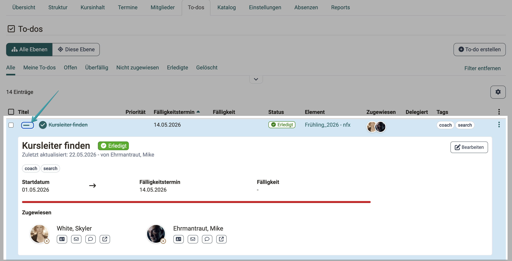
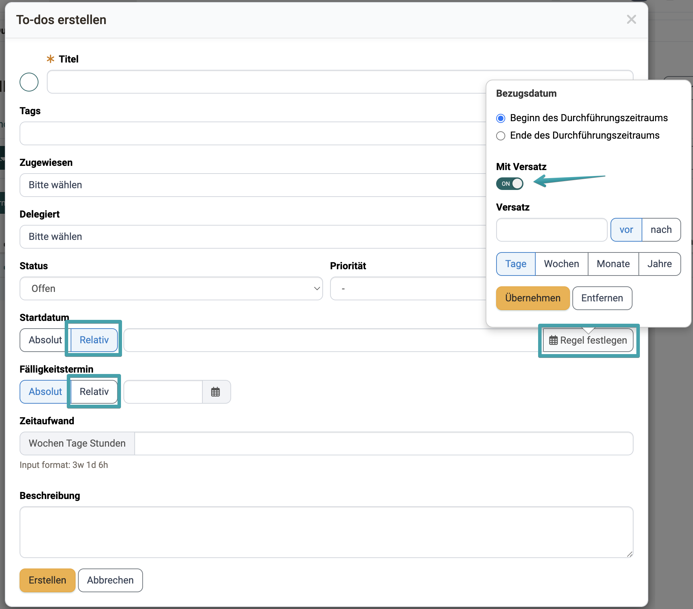

# Course Planner: To-dos [:octicons-tag-16:{ title="ab Release 21.0 (OO-9417)" }](https://track.frentix.com/issue/OO-9417){:target="_blank"} {: #course_planner_todos}

Im Course Planner gehört jede Aufgabe (To-do) zu einem Element, etwa zu einer Durchführung oder zu einem ihrer untergeordneten Elemente. Sie erstellen To-dos im Tab «To-dos» eines Elements oder per Sammelaktion für mehrere Durchführungen zugleich. Die zentrale Übersicht und der Tab «To-dos» eines Produkts fassen die To-dos zusammen, ohne dass Sie einzelne Elemente öffnen müssen. Das To-do-Widget zeigt offene und überfällige To-dos auf einen Blick.

Die To-dos im Course Planner sehen Administrator:innen, Kursplaner:innen, Produktbesitzer:innen, Elementbesitzer:innen und Principals. Was welche Rolle damit tun darf, steht unter [Berechtigungen](#todo_permissions).

{ class="shadow lightbox" title="Startseite des Course Planners" }

[Zum Seitenanfang ^](#course_planner_todos)

---

## To-do-Widget [:octicons-tag-16:{ title="ab Release 21.0 (OO-9422)" }](https://track.frentix.com/issue/OO-9422){:target="_blank"} {: #todo_widget}

Das **To-do**-Widget zeigt auf einen Blick, welche Aufgaben Ihre unmittelbare Aufmerksamkeit erfordern. Es steht im Abschnitt «Übersicht» der Startseite des Course Planners, unterhalb der Bereiche Produkte, Produktivität und Tools. Dasselbe Widget finden Sie im Tab «Übersicht» eines Produkts und eines Elements. Dort zeigt es nur die To-dos dieses Produkts beziehungsweise dieses Elements.

Drei Kennzahlen fassen den Stand zusammen:

* **Meine To-dos**: To-dos mit Status «Offen» oder «In Bearbeitung», bei denen Sie zugewiesen oder delegiert sind.
* **Offen**: To-dos mit Status «Offen».
* **Überfällig**: To-dos mit Status «Offen» oder «In Bearbeitung», deren Fälligkeitstermin überschritten ist.

Ein Klick auf eine Kennzahl öffnet die To-do-Liste mit dem passenden Filter.

Darunter listet das Widget die To-dos der Hauptkennzahl, standardmässig «Meine To-dos», mit Titel, Priorität, Fälligkeitstermin und Fälligkeit; überschrittene Termine erscheinen in Rot. Ein Klick auf den Titel öffnet das To-do. Mit dem Kreis vor dem Titel markieren Sie ein To-do direkt im Widget als erledigt. Der Kreis lässt sich anklicken, wenn Sie das To-do bearbeiten dürfen. Sind keine To-dos vorhanden, erscheint der Hinweis «Keine To-dos verfügbar.»

Wie eine Übersichtsseite aufgebaut ist und wie Sie über «Einstellungen ändern» Hauptkennzahl, Kennzahlen und Anzahl Einträge wählen, ist einmal zentral beschrieben: [Übersichtsseiten und Widgets >](../basic_concepts/Dashboard_Concept.de.md)

Das Widget zeigt die To-dos des Course Planners. **Alle** Ihre To-dos, gleich woher sie stammen, finden Sie dagegen im persönlichen Werkzeug [To-dos](../personal_menu/To-Dos.de.md). Es führt persönliche To-dos, To-dos aus Kursen und aus dem Kursbaustein Aufgabe, aus Durchführungen des Course Planners, aus Projekten und aus dem Qualitätsmanagement in einer Liste zusammen. Aufgeführt sind die To-dos, bei denen Sie zugewiesen oder delegiert sind. Bei To-dos des Course Planners ändern Sie dort nur den Status; alle übrigen Angaben bearbeiten Sie im Course Planner.

!!! note "Übersicht anpassen"
    Wie jedes Widget einer Übersichtsseite lässt sich das To-do-Widget über «Übersicht anpassen» ein- und ausblenden.

[Zum Seitenanfang ^](#course_planner_todos)

---

## Zentrale To-do-Übersicht [:octicons-tag-16:{ title="ab Release 21.0 (OO-9418)" }](https://track.frentix.com/issue/OO-9418){:target="_blank"} {: #central_overview}

Die zentrale To-do-Übersicht fasst die To-dos aller Produkte und Elemente, auf die Sie im Course Planner Zugriff haben, in einer Tabelle zusammen. Sie öffnen sie über den Button **«To-dos»** im Bereich **«Produktivität»** auf der Startseite des Course Planners.

In der Übersicht bearbeiten, löschen und wiederherstellen Sie To-dos. Neue To-dos erstellen Sie auf einem Element (siehe [Tab «To-dos» auf einem Element](#element_tab_todos)) oder für mehrere Durchführungen zugleich (siehe [To-dos direkt für mehrere Durchführungen erstellen](#bulk_create)).

Dieselbe Tabelle für ein einzelnes Produkt zeigt der Tab **«To-dos»** des Produkts. Dort ist die Spalte «Produkt» standardmässig ausgeblendet.

{ class="shadow lightbox" title="Seite To-dos im Course Planner" }

### Vordefinierte Filter {: #predefined_filters}

Mit den Schnellfiltern grenzen Sie die Ansicht thematisch ein:

| Filter | Zeigt |
|---|---|
| Alle | Alle To-dos ausser den gelöschten |
| Meine To-dos | To-dos, bei denen Sie zugewiesen oder delegiert sind, voreingestellt auf die Status «Offen» und «In Bearbeitung» |
| Offen | To-dos mit Status «Offen» |
| Überfällig | To-dos, deren Fälligkeitstermin überschritten ist |
| Nicht zugewiesen | To-dos ohne zugewiesene Person |
| Erledigte | To-dos mit Status «Erledigt» |
| Gelöscht | Gelöschte To-dos |

### Tabellenspalten {: #table_columns}

Über das Zahnrad-Symbol wählen Sie, welche Spalten angezeigt werden. Standardmässig eingeblendet:

* **Titel**
* **Produkt** (das Kennzeichen des zugehörigen Produkts)
* **Element** (das zugehörige Element mit seinem Kennzeichen)
* **Priorität**
* **Fälligkeitstermin** (das gesetzte Datum)
* **Fälligkeit** (der Abstand zum heutigen Tag, überfällige Einträge in Rot)
* **Status**
* **Zugewiesen**
* **Delegiert**
* **Tags**

Optional einblendbar: Zeitaufwand, Startdatum, Datum Erledigung, Erstellungsdatum, Erstellt von, Letzte Änderung, Gelöscht am, Gelöscht von.

### Sammelaktion «Löschen» {: #bulk_actions}

Aktivieren Sie die Checkbox in der ersten Spalte, um einzelne To-dos zu markieren, oder wählen Sie über die Checkbox im Tabellenkopf alle To-dos der aktuellen Ansicht auf einmal aus. Sobald mindestens ein To-do markiert ist, erscheint oberhalb der Tabelle die Sammelaktion **«Löschen»**.

Nach einer Sicherheitsabfrage löscht OpenOlat die markierten To-dos, die Sie bearbeiten dürfen. Gelöschte To-dos sind nicht endgültig entfernt: Sie erhalten den Status «Gelöscht» und bleiben über den Filter **«Gelöscht»** einsehbar. In der Ansicht «Gelöscht» steht die Sammelaktion selbst nicht zur Verfügung. Ein gelöschtes To-do holen Sie dort über **«Weitere Aktionen»** mit **«Wiederherstellen»** zurück.

[Zum Seitenanfang ^](#course_planner_todos)

---

## To-dos direkt für mehrere Durchführungen erstellen [:octicons-tag-16:{ title="ab Release 21.0 (OO-9539)" }](https://track.frentix.com/issue/OO-9539){:target="_blank"} {: #bulk_create}

In der Durchführungsübersicht, im Tab «Durchführungen» eines Produkts und im Tab «Struktur» eines Elements erstellen Sie über eine Sammelaktion dasselbe To-do für mehrere Durchführungen oder Elemente zugleich. OpenOlat legt für jede gewählte Zeile ein eigenes To-do an.

1. Wählen Sie in der Tabelle die gewünschten Durchführungen aus (Checkbox in der ersten Spalte).
2. Klicken Sie oberhalb der Tabelle auf **«To-dos erstellen»**. Der Button erscheint, wenn Sie für mindestens eine Zeile der Tabelle To-dos verwalten dürfen. Gewählte Zeilen ohne dieses Recht übergeht die Aktion.
3. Füllen Sie den Dialog «To-dos erstellen» aus. Ein Feld «Kontext» enthält er nicht: Produkt und Element ergeben sich aus den gewählten Zeilen.

**«Zugewiesen»** und **«Delegiert»** sind Auswahlfelder. Der Pfeil :o_icon_o_icon_caret: am rechten Rand kennzeichnet sie; ein Klick auf das Feld öffnet die Liste der wählbaren Personen. Der Button **«Durchsuchen»** :o_icon_o_icon_browse: daneben öffnet die Benutzersuche und hilft, wenn die Liste lang ist.

Die übrigen Felder des Dialogs sind unter [Erstellen eines To-dos](#create_todo) beschrieben. Ein relatives Datum berechnet OpenOlat für jede gewählte Durchführung aus deren eigenem Durchführungszeitraum. Der Dialog zeigt deshalb kein berechnetes Datum an.

{ class="shadow lightbox" title="Dialog To-dos erstellen in der Durchführungsübersicht" }

!!! info "Wichtig"
    Die Auswahlfelder «Zugewiesen» und «Delegiert» zeigen nur Personen, die in allen gewählten Durchführungen Elementbesitzer:in oder Kursbesitzer:in sind. Dazu kommen die Produktbesitzer:innen sowie die Kursplaner:innen und Administrator:innen der Organisation des Produkts.

[Zum Seitenanfang ^](#course_planner_todos)

---

## Tab «To-dos» auf einem Element {: #element_tab_todos}

Jedes Element im Course Planner verfügt über einen Tab **«To-dos»**. Dort erstellen, bearbeiten und verwalten Sie Aufgaben, die diesem Element zugeordnet sind. Den Button **«To-do erstellen»** sehen Personen, die das Element bearbeiten dürfen.

Bei Produkten mit mehreren Ebenen bestimmen Sie mit den Umschaltern **«Alle Ebenen»** und **«Diese Ebene»** den Umfang der Liste: «Alle Ebenen» zeigt zusätzlich die To-dos aller untergeordneten Elemente, «Diese Ebene» nur die des geöffneten Elements.

Wer das Element bearbeiten darf, sieht neben dem Titel die Markierung **«Neu»** bei To-dos, die seit dem letzten Aufruf des Tabs «To-dos» in derselben Durchführung erstellt wurden.

{ class="shadow lightbox" title="Tab To-dos einer Durchführung" }

### Berechtigungen {: #todo_permissions}

* **Administrator:innen** und **Kursplaner:innen** erstellen, bearbeiten, duplizieren, löschen und wiederherstellen To-dos auf den Elementen der Produkte, die sie verwalten. **Produktbesitzer:innen** können dasselbe auf allen Elementen ihrer Produkte, **Elementbesitzer:innen** auf ihren Elementen.
* **Principals** können To-dos einsehen, aber nicht bearbeiten.
* Wer einem To-do zugewiesen oder als delegierte Person eingetragen ist, ändert in der persönlichen To-do-Liste dessen Status, etwa mit «Starten» oder «Als erledigt markieren». Das gilt auch für **Kursbesitzer:innen** ohne Rolle im Course Planner, die dort selbst keinen Zugriff auf To-dos haben.

### Erstellen eines To-dos {: #create_todo}

Im Tab «To-dos» eines Elements klicken Sie auf **«To-do erstellen»**. Der Dialog «To-do bearbeiten» öffnet sich und enthält folgende Felder:

* **Titel** (Pflichtfeld): Bezeichnet die Aufgabe.
* **Kontext**: Produkt und Element, denen das To-do zugeordnet ist. Vorbelegt ist das geöffnete Element. Bei Produkten mit mehreren Ebenen weisen Administrator:innen, Kursplaner:innen und Produktbesitzer:innen das To-do über **«Ändern»** einem anderen Element derselben Durchführung zu.
* **Tags**: Frei vergebbare Schlagwörter.
* **Zugewiesen**: Die Person, die für die Erledigung verantwortlich ist. Das Feld ist kein Pflichtfeld; To-dos ohne zugewiesene Person finden Sie über den Filter «Nicht zugewiesen».
* **Delegiert**: Die Ausführung kann an andere Personen delegiert werden; die Verantwortung bleibt bei der zugewiesenen Person. Dieselbe Person kann nicht gleichzeitig zugewiesen und delegiert sein.
* **Status**: Setzt den aktuellen Bearbeitungsstand (Offen, In Bearbeitung, Erledigt).
* **Priorität**: Dringend, Hoch, Mittel oder Tief.
* **Startdatum** und **Fälligkeitstermin**: Absolut oder [relativ zum Durchführungszeitraum](#relative_date).
* **Zeitaufwand**: Geschätzter Aufwand in Wochen, Tagen und Stunden, Eingabeformat `3w 1d 6h`.
* **Beschreibung**: Ergänzende Informationen zur Aufgabe.

Zur Auswahl bei «Zugewiesen» und «Delegiert» stehen die Elementbesitzer:innen und Kursbesitzer:innen des Elements, die Produktbesitzer:innen sowie die Kursplaner:innen und Administrator:innen der Organisation des Produkts. Beim späteren Bearbeiten enthält der Dialog dieselben Felder.

{ class="shadow lightbox" title="Dialog To-do bearbeiten beim Erstellen eines To-dos" }

!!! tip "Weitere Aktionen"
    Über das Symbol **«Weitere Aktionen»** (drei Punkte) am Ende einer To-do-Zeile stehen **Bearbeiten** und **Löschen** zur Verfügung, im Tab «To-dos» eines Elements zusätzlich **Duplizieren**. Mit **Duplizieren** kopieren Sie ein bestehendes To-do samt seinen Eigenschaften. Bei einem gelöschten To-do erscheint **Wiederherstellen**. Diese Aktionen setzen Bearbeitungsrechte voraus.

#### Übersicht der To-do-Status {: #todo_status}

| Status | Bedeutung |
|---|---|
| Offen | Die Aufgabe ist erstellt, aber noch nicht begonnen. |
| In Bearbeitung | Die Arbeit an der Aufgabe hat begonnen. |
| Erledigt | Die Aufgabe ist abgeschlossen. |
| Gelöscht | Das To-do ist gelöscht, nur noch im Filter «Gelöscht» sichtbar und lässt sich dort wiederherstellen. |

### Schnellaktionen im Detailbereich [:octicons-tag-16:{ title="ab Release 21.0 (OO-9563)" }](https://track.frentix.com/issue/OO-9563){:target="_blank"} {: #quick_actions}

Über das Pluszeichen am Zeilenanfang klappen Sie den Detailbereich eines To-dos auf. Er zeigt Titel, Status und Priorität, wer das To-do zuletzt aktualisiert hat, die Tags und die Beschreibung, Startdatum, Fälligkeitstermin, Fälligkeit und Zeitaufwand sowie die zugewiesenen und die delegierten Personen mit ihren Kontaktmöglichkeiten. Sind Startdatum und Fälligkeitstermin gesetzt, erscheint zusätzlich ein Fortschrittsbalken.

Rechts oben im Detailbereich stehen die Schnellaktionen, abhängig vom Status des To-dos:

* **«Starten»** setzt den Status auf «In Bearbeitung». Die Aktion erscheint nur beim Status «Offen».
* **«Als erledigt markieren»** schliesst die Aufgabe ab. Die Aktion erscheint bei den Status «Offen» und «In Bearbeitung».
* **«Bearbeiten»** öffnet den Dialog mit allen Feldern. Diese Aktion steht in jedem Status zur Verfügung.

Bei einem erledigten To-do bleibt deshalb nur **«Bearbeiten»** sichtbar.

In den Tabellen des Course Planners erscheinen die Schnellaktionen für die Rollen, die das Element bearbeiten dürfen (siehe [Berechtigungen](#todo_permissions)). In der persönlichen To-do-Liste erscheinen sie für die zugewiesene und die delegierte Person; im Dialog lässt sich dort nur der Status ändern.

{ class="shadow lightbox" title="Aufgeklappter Detailbereich im Tab To-dos" }

[Zum Seitenanfang ^](#course_planner_todos)

---

## Relative Datumsangaben [:octicons-tag-16:{ title="ab Release 21.0 (OO-9425)" }](https://track.frentix.com/issue/OO-9425){:target="_blank"} {: #relative_date}

Beim Erstellen oder Bearbeiten eines To-dos im Course Planner legen Sie **Startdatum** und **Fälligkeitstermin** entweder **absolut** (ein festes Kalenderdatum) oder **relativ** fest. Ein relatives Datum bezieht sich auf den Durchführungszeitraum des Elements, dem das To-do zugeordnet ist.

### Relative Datumsangabe konfigurieren {: #configure_relative_date}

Schalten Sie beim **Startdatum** oder beim **Fälligkeitstermin** von **«Absolut»** auf **«Relativ»** um. Über **«Regel festlegen»** öffnen Sie ein kleines Fenster und bestimmen dort:

* **Bezugsdatum**: «Beginn des Durchführungszeitraums» oder «Ende des Durchführungszeitraums».
* **Mit Versatz** (optional): Aktivieren Sie diesen Schalter, um einen Abstand zum Bezugsdatum anzugeben. Ohne Versatz gilt das Bezugsdatum selbst.
  * **Versatz**: Anzahl, «vor» oder «nach» dem Bezugsdatum und die Einheit Tage, Wochen, Monate oder Jahre.

Mit **«Übernehmen»** speichern Sie die Regel, mit **«Entfernen»** verwerfen Sie sie.

Ist «Mit Versatz» eingeschaltet, zeigt das Fenster unter **«Berechnetes Datum»** das resultierende Datum. Hat das Element kein Bezugsdatum, steht bei der Option der Hinweis «Kein Datum». Ändert sich der Durchführungszeitraum nachträglich, passen sich Startdatum und Fälligkeitstermin automatisch an. Weisen Sie das To-do über «Ändern» einem anderen Element zu, gilt die Regel für dessen Durchführungszeitraum.

{ class="shadow lightbox" title="Dialog To-dos erstellen" }

!!! info "Wichtig"
    Bei To-dos gibt es relative Datumsangaben nur im Course Planner. Persönliche To-dos und To-dos aus Projekten, aus Kursen, aus dem Kursbaustein Aufgabe und aus dem Qualitätsmanagement haben feste Kalenderdaten. Ein To-do des Course Planners behält seine Regel auch in der persönlichen To-do-Liste. Andere Funktionen arbeiten unabhängig von To-dos mit eigenen relativen Fristen, etwa die [Erinnerungen](../learningresources/Course_Reminders.de.md) im Kurs.

[Zum Seitenanfang ^](#course_planner_todos)

---

## Weiterführende Informationen {: #further_information}

[Course Planner: Übersicht >](Course_Planner.de.md) 
[Course Planner: Durchführungen >](Course_Planner_Implementations.de.md) 
[To-dos (persönliches Menü) >](../personal_menu/To-Dos.de.md) 
[Allgemeines zu To-dos >](../basic_concepts/To_Dos_Basics.de.md) 
[Course Planner aktivieren (Admin) >](../../manual_admin/administration/Modules_Course_Planner.de.md) 
[Übersichtsseiten und Widgets >](../basic_concepts/Dashboard_Concept.de.md) 
[Erinnerungen >](../learningresources/Course_Reminders.de.md)

[Zum Seitenanfang ^](#course_planner_todos)
