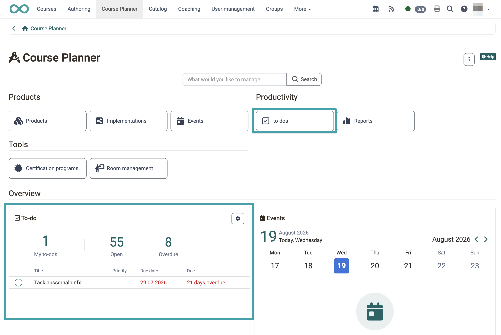
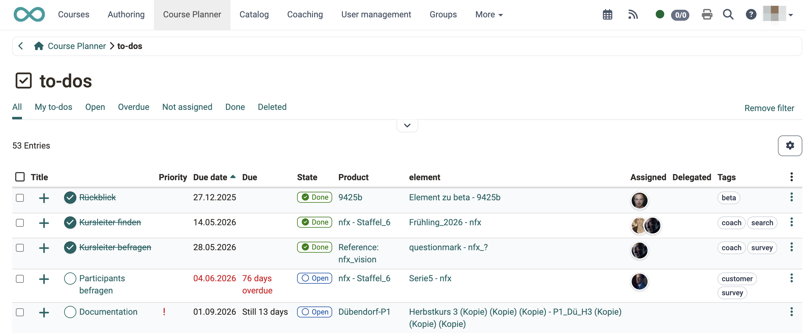
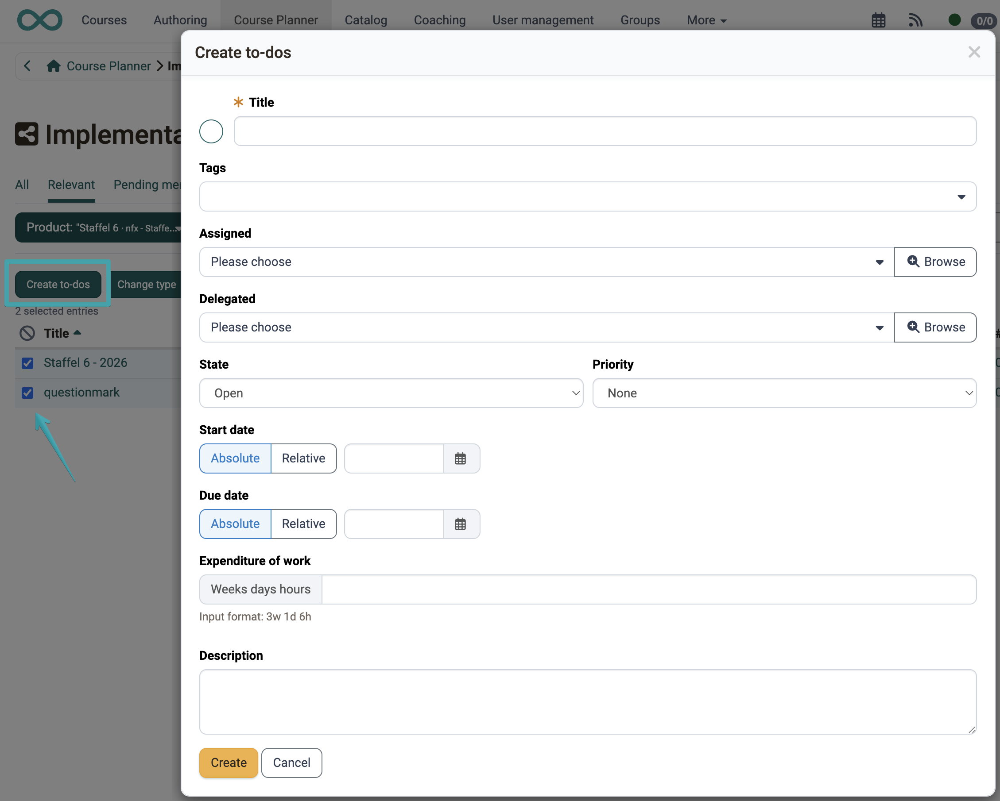
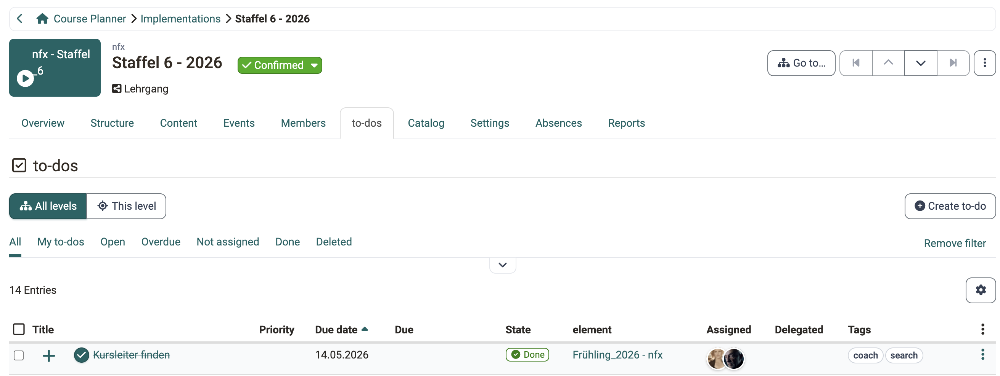
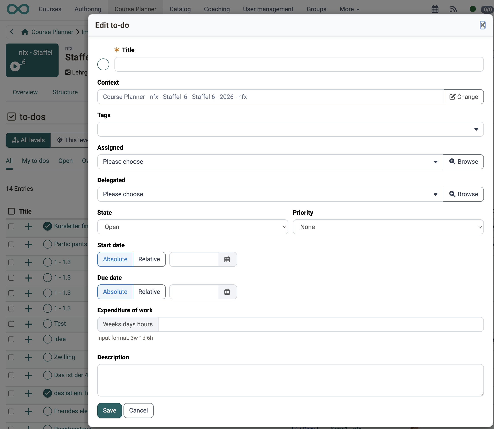
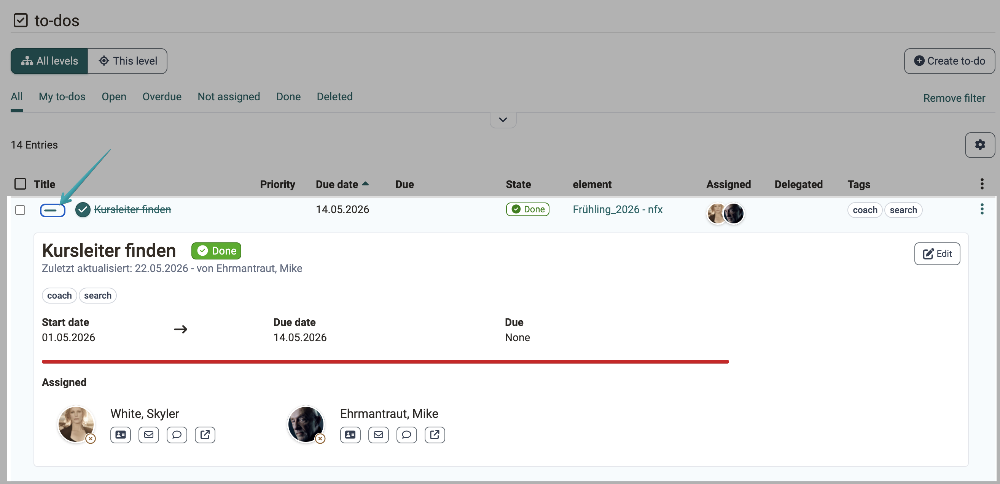
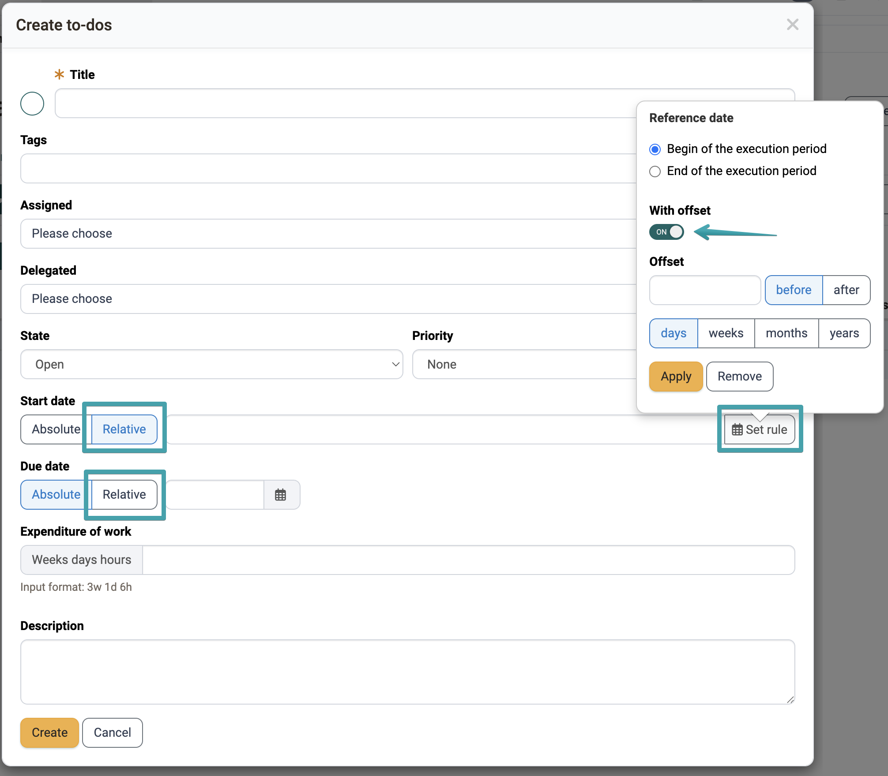

# Course Planner: To-dos [:octicons-tag-16:{ title="from Release 21.0 (OO-9417)" }](https://track.frentix.com/issue/OO-9417){:target="_blank"} {: #course_planner_todos}

In the Course Planner, tasks (to-dos) can be recorded at various levels: in the overview, on the product, on the implementation and on each individual element. All to-dos can be viewed centrally in one overview, without having to open individual implementations or elements. A widget on the dashboard shows open and overdue to-dos at a glance.

{ class="shadow lightbox" }

[To the top of the page ^](#course_planner_todos)

---

## To-do widget [:octicons-tag-16:{ title="from Release 21.0 (OO-9422)" }](https://track.frentix.com/issue/OO-9422){:target="_blank"} {: #todo_widget}

The **To-do** widget shows at a glance which tasks require your immediate attention. It is located in the "Overview" section of the start page, below the Products, Productivity and Tools areas.

Three key figures summarise the current state:

* **My to-dos**: to-dos in which you are entered as "Assigned".
* **Open**: to-dos with status "Open".
* **Overdue**: to-dos whose due date has passed.

Below that, the widget lists your own to-dos with title, priority, due date and time remaining; dates that have passed appear in red. A click on the title opens the to-do directly. If no to-dos exist, the note "No to-dos available." appears.

!!! note "Dashboard configuration"
    Like all CPL dashboard widgets, the widget can be shown and hidden via the dashboard configuration.

[To the top of the page ^](#course_planner_todos)

---

## Central to-do overview [:octicons-tag-16:{ title="from Release 21.0 (OO-9418)" }](https://track.frentix.com/issue/OO-9418){:target="_blank"} {: #central_overview}

The central to-do overview brings together all to-dos across all products and elements in one table. You open it with the **"To-dos"** button in the **"Productivity"** area of the Course Planner start page.

The overview shows all to-dos for which you are assigned or delegated, as well as all to-dos in products to which you have access.

{ class="shadow lightbox" }

### Predefined filters {: #predefined_filters}

Use the quick filters to narrow the view thematically:

| Filter | Shows |
|---|---|
| All | All visible to-dos |
| My to-dos | To-dos in which you are entered as "Assigned" |
| Open | To-dos with status "Open" |
| Overdue | To-dos whose due date has passed |
| Not assigned | To-dos without an assigned person |
| Done | To-dos with status "Done" |
| Deleted | Deleted to-dos |

### Table columns {: #table_columns}

Use the gear symbol to choose which columns are displayed. Shown by default:

* **Title** (for new to-dos with a "New" marker)
* **Product** (the associated product)
* **Element** (the associated element within the product)
* **Priority**
* **Due date** (the date that is set)
* **Due** (the distance to today, overdue entries in red)
* **Status**
* **Assigned**
* **Delegated**
* **Tags**

Optionally displayable: Expenditure of work, Start date, Done date, Created, Created by, Changed, Deleted, Deleted by.

### Bulk action "Delete" {: #bulk_actions}

Activate the checkbox in the first column to select individual to-dos, or use the checkbox in the table header to select all to-dos of the current view at once. As soon as at least one to-do is selected, the bulk action **"Delete"** appears above the table.

After a confirmation prompt, the selected to-dos are deleted. Deleted to-dos are not permanently removed: they receive the status "Deleted" and remain viewable via the **"Deleted"** filter. In the "Deleted" view, the bulk action itself is not available.

[To the top of the page ^](#course_planner_todos)

---

## Create to-dos directly for several implementations [:octicons-tag-16:{ title="from Release 21.0 (OO-9539)" }](https://track.frentix.com/issue/OO-9539){:target="_blank"} {: #bulk_create}

In the implementation overview as well as in the "Implementations" tab of a product, you can use a bulk action to create a to-do for several implementations at the same time.

1. In the implementation overview, select the desired implementations (checkbox in the first column).
2. Above the table, click on **"Create to-dos"**.
3. Fill in the dialog. It does not contain a context field: product and element result from the selected implementations.

**"Assigned"** and **"Delegated"** are selection fields. The caret :o_icon_o_icon_caret: at the right edge marks them; a click on the field opens the list of selectable persons. The **"Browse"** button :o_icon_o_icon_browse: next to it opens the user search and helps when the list is long.

The remaining fields of the dialog are described under [Creating a to-do](#create_todo).

{ class="shadow lightbox" }

!!! info "Important"
    The selection fields "Assigned" and "Delegated" only show persons who have access rights in the relevant and selected implementations.

[To the top of the page ^](#course_planner_todos)

---

## "To-dos" tab on an element {: #element_tab_todos}

Every element in the Course Planner has a **"To-dos"** tab. There you create, edit and manage tasks that are assigned directly to this element.

With the **"All levels"** and **"This level"** switches you determine the scope of the list: "All levels" additionally shows the to-dos of all subordinate elements, "This level" only those of the element you opened.

{ class="shadow lightbox" }

### Permissions {: #todo_permissions}

* **Course planners** and **element owners** can create, edit, assign and delegate to-dos.
* **Course owners** can mark to-dos assigned to their course as done; however, they cannot create or otherwise edit them.
* **Principals** can view to-dos but not edit them.

### Creating a to-do {: #create_todo}

In the "To-dos" tab of an element, click on **"Create to-do"**. The following dialog contains these fields:

* **Title** (mandatory field): Names the task.
* **Assigned** (mandatory field): The person responsible for completing it.
* **Delegated**: Execution can be delegated to another person; responsibility remains with the assigned person.
* **Status**: Sets the current processing state (Open, In progress, Done).
* **Priority**: Urgent, High, Medium or Low.
* **Start date** and **Due date**: Absolute or [relative to the implementation period](#relative_date).
* **Expenditure of work**: Estimated effort in weeks, days and hours, input format `3w 1d 6h`.
* **Tags**: Freely assignable keywords.
* **Description**: Additional information about the task.

When you edit a to-do later, the dialog contains the same fields plus the **Context**, that is the product and the element of the to-do. Use **"Change"** to assign the to-do to a different element.

{ class="shadow lightbox" }

!!! info "Action menu"
    The action menu (3-dot symbol) of a to-do row provides **Edit**, **Duplicate** and **Delete**. With **Duplicate** you copy an existing to-do together with its properties. These actions require editing permissions.

#### Overview of the to-do statuses {: #todo_status}

| Status | Meaning |
|---|---|
| Open | The task has been created but not yet started. |
| In progress | Work on the task has begun. |
| Done | The task is completed. |
| Deleted | The to-do has been deleted and is only visible in the "Deleted" filter. |

### Quick actions in the detail area [:octicons-tag-16:{ title="from Release 21.0 (OO-9563)" }](https://track.frentix.com/issue/OO-9563){:target="_blank"} {: #quick_actions}

Use the plus sign at the start of a row to expand the detail area of a to-do. It shows title and status, who last updated the to-do, the tags, start date, due date and time remaining as well as the assigned persons with their contact options. If start date and due date are both set, a progress bar appears in addition.

At the top right of the detail area you find the quick actions, depending on the status of the to-do:

* **"Start"** sets the status to "In progress". The action only appears with the status "Open".
* **"Mark as done"** completes the task. The action appears with the statuses "Open" and "In progress".
* **"Edit"** opens the dialog with all fields. This action is available in every status.

For a to-do that is done, only **"Edit"** therefore remains visible.

All actions require editing permissions. They appear for the person who created the to-do, for the assigned and the delegated person as well as for the roles with editing permission (see [Permissions](#todo_permissions)).

{ class="shadow lightbox" }

[To the top of the page ^](#course_planner_todos)

---

## Relative dates [:octicons-tag-16:{ title="from Release 21.0 (OO-9425)" }](https://track.frentix.com/issue/OO-9425){:target="_blank"} {: #relative_date}

When creating or editing a to-do in the Course Planner, **Start date** and **Due date** can be set either **absolutely** (a fixed calendar date) or **relatively** (based on the implementation period).

### Configuring a relative date {: #configure_relative_date}

Switch the **Start date** or the **Due date** from **"Absolute"** to **"Relative"**. Use **"Set rule"** to open the popover and define there:

* **Reference date**: "Begin of the execution period" or "End of the execution period".
* **With offset** (optional): Activate this switch to specify a distance from the reference date.
  * **Offset**: Number with unit (days, weeks, months or years).
  * **Direction**: "before" or "after" the reference date.

Use **"Apply"** to save the rule and **"Remove"** to discard it.

The calculated date is shown as a preview as long as an implementation period is defined. If the implementation period changes later, the due date adjusts automatically.

{ class="shadow lightbox" }

!!! info "Important"
    A relative date is only available in the Course Planner. In the personal menu and in other contexts (project, course), only absolute dates are possible.

[To the top of the page ^](#course_planner_todos)

---

## Further information {: #further_information}

[Course Planner: Overview >](Course_Planner.md) 
[Course Planner: Implementations >](Course_Planner_Implementations.md) 
[To-dos (personal menu) >](../personal_menu/To-Dos.md) 
[General information on to-dos >](../basic_concepts/To_Dos_Basics.md) 
[Activate Course Planner (Admin) >](../../manual_admin/administration/Modules_Course_Planner.md) 

[To the top of the page ^](#course_planner_todos)
