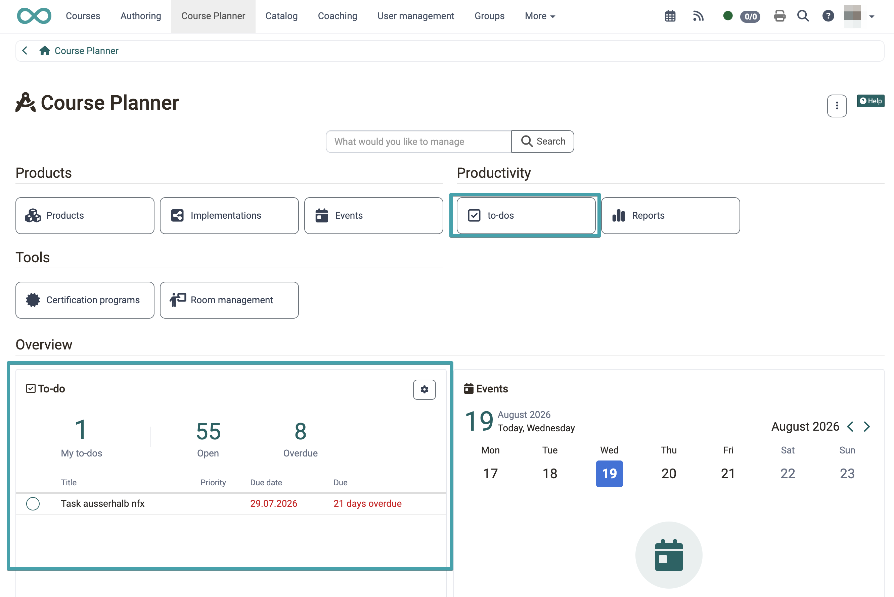
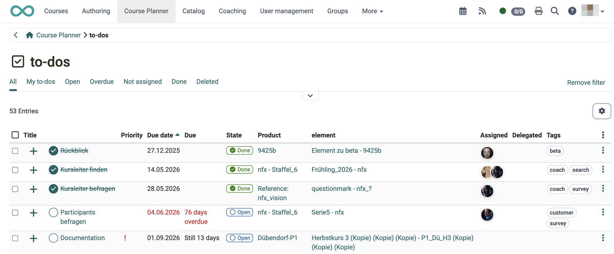
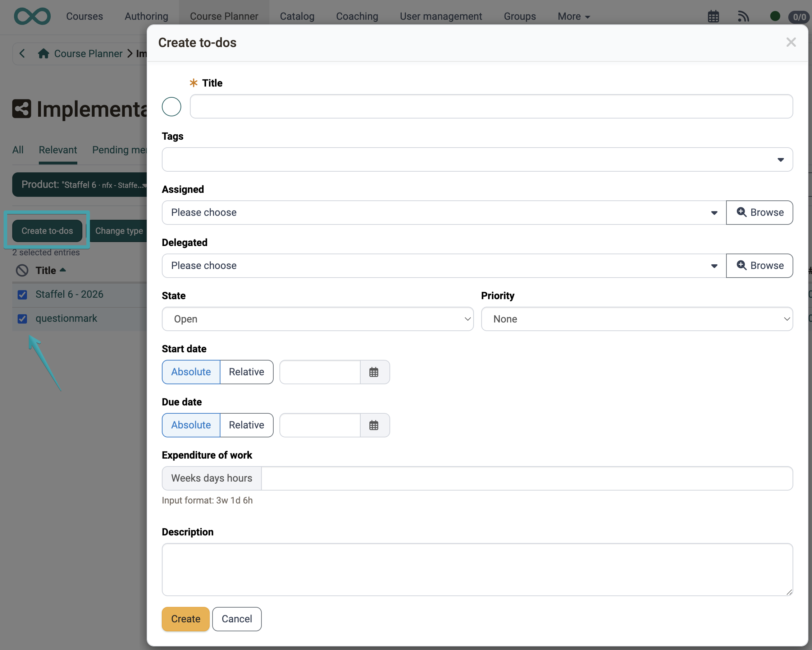
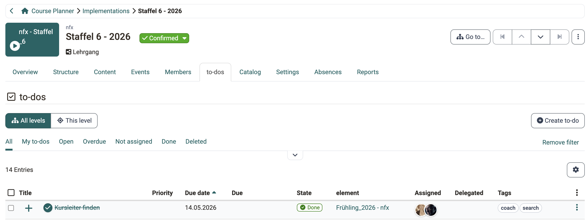
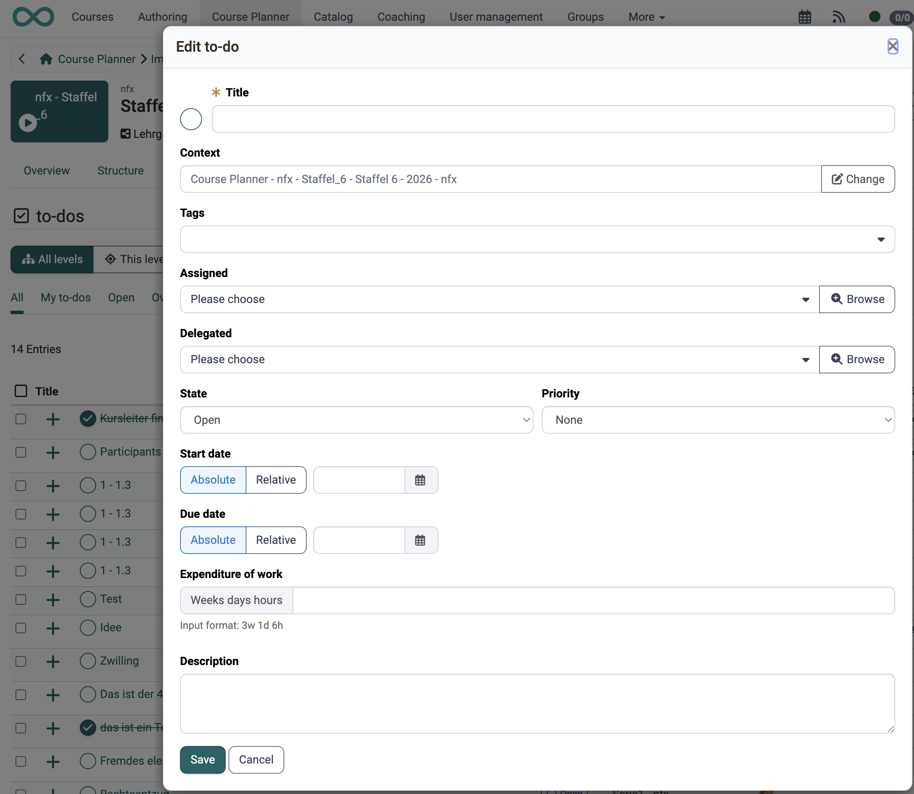
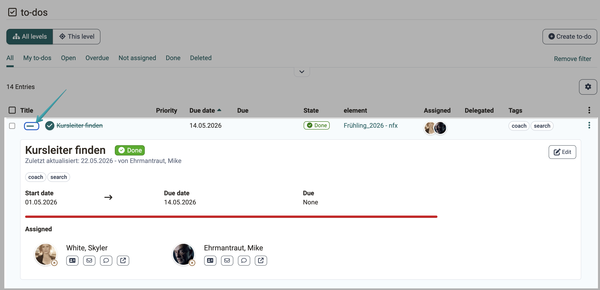
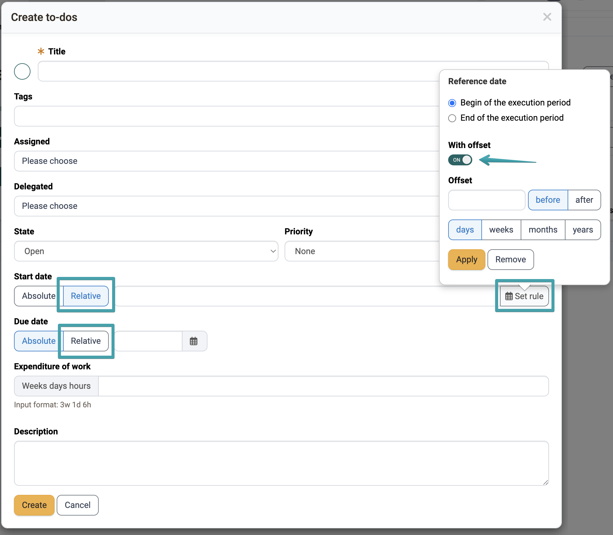

# Course Planner: To-dos [:octicons-tag-16:{ title="from Release 21.0 (OO-9417)" }](https://track.frentix.com/issue/OO-9417){:target="_blank"} {: #course_planner_todos}

In the Course Planner, every task (to-do) belongs to an element, for example to an implementation or to one of its subordinate elements. You create to-dos in the "To-dos" tab of an element or with a bulk action for several implementations at once. The central overview and the "To-dos" tab of a product bring the to-dos together, without you having to open individual elements. The to-do widget shows open and overdue to-dos at a glance.

The to-dos in the Course Planner are visible to administrators, course planners, product owners, element owners and principals. What each role may do with them is described under [Permissions](#todo_permissions).

{ class="shadow lightbox" title="Course Planner start page" }

[To the top of the page ^](#course_planner_todos)

---

## To-do widget [:octicons-tag-16:{ title="from Release 21.0 (OO-9422)" }](https://track.frentix.com/issue/OO-9422){:target="_blank"} {: #todo_widget}

The **To-do** widget shows at a glance which tasks require your immediate attention. It is located in the "Overview" section of the Course Planner start page, below the Products, Productivity and Tools areas. You find the same widget in the "Overview" tab of a product and of an element. There it shows only the to-dos of this product or of this element.

Three key figures summarise the current state:

* **My to-dos**: to-dos with status "Open" or "In progress" for which you are assigned or delegated.
* **Open**: to-dos with status "Open".
* **Overdue**: to-dos with status "Open" or "In progress" whose due date has passed.

A click on a key figure opens the to-do list with the matching filter.

Below that, the widget lists the to-dos of the main figure, by default "My to-dos", with title, priority, due date and time remaining; dates that have passed appear in red. A click on the title opens the to-do. With the circle in front of the title you mark a to-do as done directly in the widget. The circle can be clicked if you are allowed to edit the to-do. If no to-dos exist, the note "No to-dos available." appears.

How an overview page is structured and how you choose the main figure, the key figures and the number of entries via "Change settings" is described centrally: [Overview pages and widgets >](../basic_concepts/Dashboard_Concept.md)

The widget shows the to-dos of the Course Planner. **All** your to-dos, wherever they come from, are in the personal tool [To-dos](../personal_menu/To-Dos.md). It combines personal to-dos, to-dos from courses and from the course element Task, from implementations of the Course Planner, from projects and from quality management in one list. Listed are the to-dos for which you are assigned or delegated. For to-dos of the Course Planner you only change the status there; you edit all other details in the Course Planner.

!!! note "Edit overview"
    Like every widget on an overview page, the to-do widget can be shown and hidden via "Edit overview".

[To the top of the page ^](#course_planner_todos)

---

## Central to-do overview [:octicons-tag-16:{ title="from Release 21.0 (OO-9418)" }](https://track.frentix.com/issue/OO-9418){:target="_blank"} {: #central_overview}

The central to-do overview brings together the to-dos of all products and elements to which you have access in the Course Planner in one table. You open it with the **"To-dos"** button in the **"Productivity"** area of the Course Planner start page.

In the overview you edit, delete and restore to-dos. You create new to-dos on an element (see ["To-dos" tab on an element](#element_tab_todos)) or for several implementations at once (see [Create to-dos directly for several implementations](#bulk_create)).

The same table for a single product is shown in the **"To-dos"** tab of the product. There the "Product" column is hidden by default.

{ class="shadow lightbox" title="To-dos page in the Course Planner" }

### Predefined filters {: #predefined_filters}

Use the quick filters to narrow the view thematically:

| Filter | Shows |
|---|---|
| All | All to-dos except the deleted ones |
| My to-dos | To-dos for which you are assigned or delegated, preset to the statuses "Open" and "In progress" |
| Open | To-dos with status "Open" |
| Overdue | To-dos whose due date has passed |
| Not assigned | To-dos without an assigned person |
| Done | To-dos with status "Done" |
| Deleted | Deleted to-dos |

### Table columns {: #table_columns}

Use the gear symbol to choose which columns are displayed. Shown by default:

* **Title**
* **Product** (the reference of the associated product)
* **Element** (the associated element with its reference)
* **Priority**
* **Due date** (the date that is set)
* **Due** (the distance to today, overdue entries in red)
* **Status**
* **Assigned**
* **Delegated**
* **Tags**

Optionally displayable: Expenditure of work, Start date, Done date, Creation date, Created by, Modified, Deleted on, Deleted by.

### Bulk action "Delete" {: #bulk_actions}

Activate the checkbox in the first column to select individual to-dos, or use the checkbox in the table header to select all to-dos of the current view at once. As soon as at least one to-do is selected, the bulk action **"Delete"** appears above the table.

After a confirmation prompt, OpenOlat deletes the selected to-dos that you are allowed to edit. Deleted to-dos are not permanently removed: they receive the status "Deleted" and remain viewable via the **"Deleted"** filter. In the "Deleted" view, the bulk action itself is not available. There you bring a deleted to-do back via **"More actions"** with **"Restore"**.

[To the top of the page ^](#course_planner_todos)

---

## Create to-dos directly for several implementations [:octicons-tag-16:{ title="from Release 21.0 (OO-9539)" }](https://track.frentix.com/issue/OO-9539){:target="_blank"} {: #bulk_create}

In the implementation overview, in the "Implementations" tab of a product and in the "Structure" tab of an element, you use a bulk action to create the same to-do for several implementations or elements at once. OpenOlat creates a separate to-do for each selected row.

1. In the table, select the desired implementations (checkbox in the first column).
2. Above the table, click on **"Create to-dos"**. The button appears if you are allowed to manage to-dos for at least one row of the table. The action skips selected rows without this permission.
3. Fill in the "Create to-dos" dialog. It does not contain a "Context" field: product and element result from the selected rows.

**"Assigned"** and **"Delegated"** are selection fields. The caret :o_icon_o_icon_caret: at the right edge marks them; a click on the field opens the list of selectable persons. The **"Browse"** button :o_icon_o_icon_browse: next to it opens the user search and helps when the list is long.

The remaining fields of the dialog are described under [Creating a to-do](#create_todo). OpenOlat calculates a relative date for each selected implementation from its own implementation period. The dialog therefore shows no calculated date.

{ class="shadow lightbox" title="Create to-dos dialog in the implementation overview" }

!!! info "Important"
    The selection fields "Assigned" and "Delegated" only show persons who are element owner or course owner in all selected implementations. In addition, there are the product owners as well as the course planners and administrators of the organisation of the product.

[To the top of the page ^](#course_planner_todos)

---

## "To-dos" tab on an element {: #element_tab_todos}

Every element in the Course Planner has a **"To-dos"** tab. There you create, edit and manage tasks that are assigned to this element. The **"Create to-do"** button is visible to persons who are allowed to edit the element.

For products with several levels, you determine the scope of the list with the **"All levels"** and **"This level"** switches: "All levels" additionally shows the to-dos of all subordinate elements, "This level" only those of the element you opened.

Persons who are allowed to edit the element see the **"New"** marker next to the title of to-dos that were created since the last time the "To-dos" tab was opened in the same implementation.

{ class="shadow lightbox" title="To-dos tab of an implementation" }

### Permissions {: #todo_permissions}

* **Administrators** and **course planners** create, edit, duplicate, delete and restore to-dos on the elements of the products they manage. **Product owners** can do the same on all elements of their products, **element owners** on their elements.
* **Principals** can view to-dos but not edit them.
* Anyone who is assigned to a to-do or entered as a delegated person changes its status in the personal to-do list, for example with "Start" or "Mark as done". This also applies to **course owners** without a role in the Course Planner, who have no access to to-dos there themselves.

### Creating a to-do {: #create_todo}

In the "To-dos" tab of an element, click on **"Create to-do"**. The "Edit to-do" dialog opens and contains these fields:

* **Title** (mandatory field): Names the task.
* **Context**: The product and the element to which the to-do is assigned. The element you opened is preselected. For products with several levels, administrators, course planners and product owners assign the to-do to a different element of the same implementation with **"Change"**.
* **Tags**: Freely assignable keywords.
* **Assigned**: The person responsible for completing it. The field is not mandatory; you find to-dos without an assigned person via the "Not assigned" filter.
* **Delegated**: Execution can be delegated to other persons; responsibility remains with the assigned person. The same person cannot be assigned and delegated at the same time.
* **Status**: Sets the current processing state (Open, In progress, Done).
* **Priority**: Urgent, High, Medium or Low.
* **Start date** and **Due date**: Absolute or [relative to the implementation period](#relative_date).
* **Expenditure of work**: Estimated effort in weeks, days and hours, input format `3w 1d 6h`.
* **Description**: Additional information about the task.

For "Assigned" and "Delegated" you can select the element owners and course owners of the element, the product owners as well as the course planners and administrators of the organisation of the product. When you edit a to-do later, the dialog contains the same fields.

{ class="shadow lightbox" title="Edit to-do dialog when creating a to-do" }

!!! tip "More actions"
    The **"More actions"** symbol (three dots) at the end of a to-do row provides **Edit** and **Delete**, in the "To-dos" tab of an element also **Duplicate**. With **Duplicate** you copy an existing to-do together with its properties. For a deleted to-do, **Restore** appears. These actions require editing permissions.

#### Overview of the to-do statuses {: #todo_status}

| Status | Meaning |
|---|---|
| Open | The task has been created but not yet started. |
| In progress | Work on the task has begun. |
| Done | The task is completed. |
| Deleted | The to-do is deleted, only visible in the "Deleted" filter and can be restored there. |

### Quick actions in the detail area [:octicons-tag-16:{ title="from Release 21.0 (OO-9563)" }](https://track.frentix.com/issue/OO-9563){:target="_blank"} {: #quick_actions}

Use the plus sign at the start of a row to expand the detail area of a to-do. It shows title, status and priority, who last updated the to-do, the tags and the description, start date, due date, time remaining and expenditure of work as well as the assigned and the delegated persons with their contact options. If start date and due date are both set, a progress bar appears in addition.

At the top right of the detail area you find the quick actions, depending on the status of the to-do:

* **"Start"** sets the status to "In progress". The action only appears with the status "Open".
* **"Mark as done"** completes the task. The action appears with the statuses "Open" and "In progress".
* **"Edit"** opens the dialog with all fields. This action is available in every status.

For a to-do that is done, only **"Edit"** therefore remains visible.

In the tables of the Course Planner, the quick actions appear for the roles that are allowed to edit the element (see [Permissions](#todo_permissions)). In the personal to-do list, they appear for the assigned and the delegated person; there only the status can be changed in the dialog.

{ class="shadow lightbox" title="Expanded detail area in the To-dos tab" }

[To the top of the page ^](#course_planner_todos)

---

## Relative dates [:octicons-tag-16:{ title="from Release 21.0 (OO-9425)" }](https://track.frentix.com/issue/OO-9425){:target="_blank"} {: #relative_date}

When creating or editing a to-do in the Course Planner, you set **Start date** and **Due date** either **absolutely** (a fixed calendar date) or **relatively**. A relative date refers to the implementation period of the element to which the to-do is assigned.

### Configuring a relative date {: #configure_relative_date}

Switch the **Start date** or the **Due date** from **"Absolute"** to **"Relative"**. Use **"Set rule"** to open a small window and define there:

* **Reference date**: "Begin of the execution period" or "End of the execution period".
* **With offset** (optional): Activate this switch to specify a distance from the reference date. Without an offset, the reference date itself applies.
  * **Offset**: Number, "before" or "after" the reference date and the unit days, weeks, months or years.

Use **"Apply"** to save the rule and **"Remove"** to discard it.

If "With offset" is switched on, the window shows the resulting date under **"Calculated date"**. If the element has no reference date, the option shows the note "No date". If the implementation period changes later, start date and due date adjust automatically. If you assign the to-do to a different element with "Change", the rule applies to the implementation period of that element.

{ class="shadow lightbox" title="Create to-dos dialog" }

!!! info "Important"
    For to-dos, relative dates exist only in the Course Planner. Personal to-dos and to-dos from projects, from courses, from the course element Task and from quality management have fixed calendar dates. A to-do of the Course Planner keeps its rule in the personal to-do list as well. Independently of to-dos, other functions work with their own relative deadlines, for example the [reminders](../learningresources/Course_Reminders.md) in a course.

[To the top of the page ^](#course_planner_todos)

---

## Further information {: #further_information}

[Course Planner: Overview >](Course_Planner.md) 
[Course Planner: Implementations >](Course_Planner_Implementations.md) 
[To-dos (personal menu) >](../personal_menu/To-Dos.md) 
[General information on to-dos >](../basic_concepts/To_Dos_Basics.md) 
[Activate Course Planner (Admin) >](../../manual_admin/administration/Modules_Course_Planner.md) 
[Overview pages and widgets >](../basic_concepts/Dashboard_Concept.md) 
[Course reminders >](../learningresources/Course_Reminders.md)

[To the top of the page ^](#course_planner_todos)
