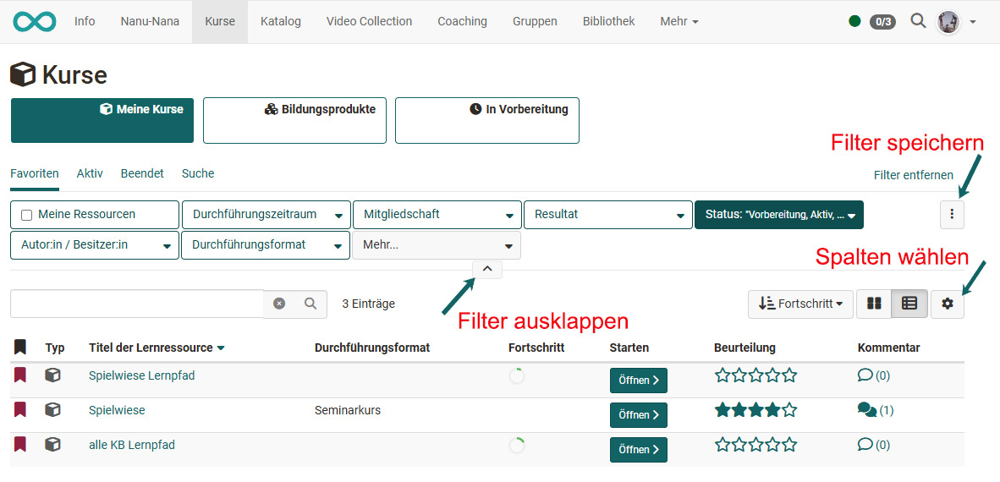
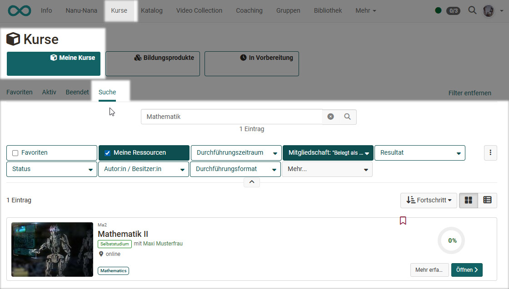
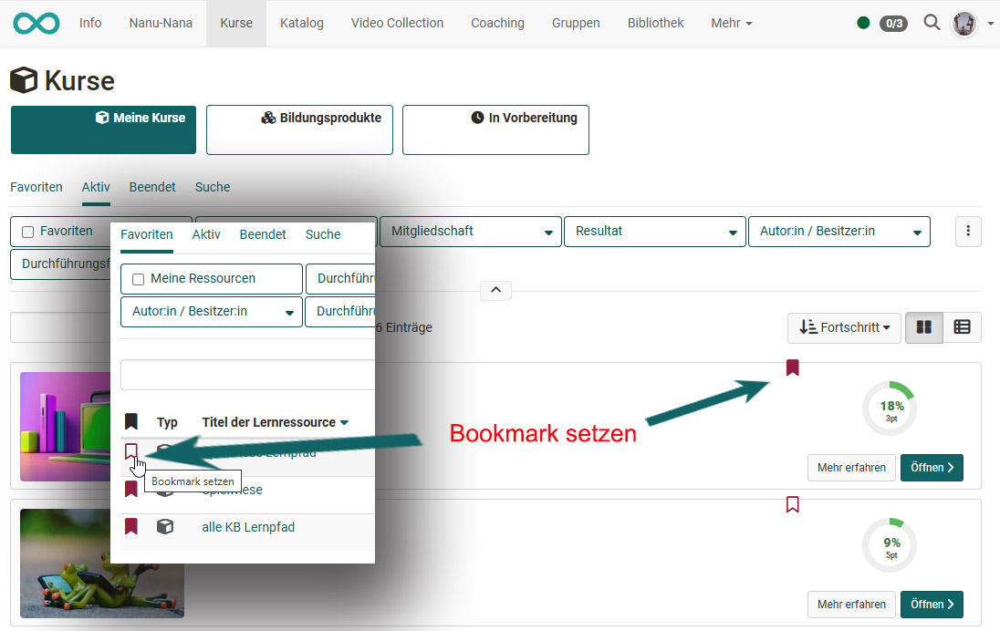
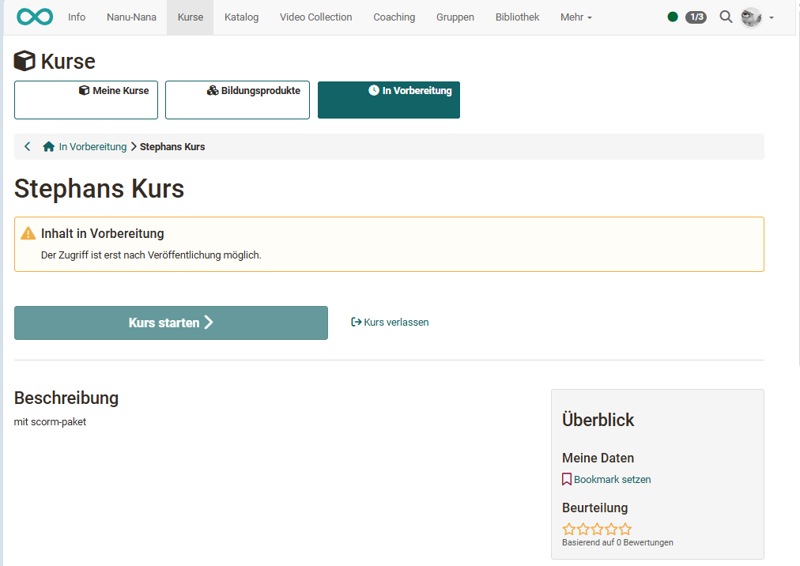

# Kurse finden

:octicons-device-camera-video-24: **Video-Einführung**: [Wo finde ich meine Kurse?](<https://www.youtube.com/embed/2sN32vLD9UY>){:target="_blank”}

Der Menüpunkt "Kurse" bietet Ihnen den Zugang zu den für Sie zugänglichen Kursen und eventuell weiteren Lernressourcen. Klicken Sie in der Hauptnavigation oben auf den Punkt "Kurse".

## Meine Kurse

Unter "Meine Kurse" können Sie sich standardmässig alle Kurse und Lernressourcen anzeigen lassen die aktiv oder beendet sind. Sie können auch Favoriten markieren und sich nur die Favoriten anzeigen lassen. Oder Sie nutzen die Suche um einen Kurs bzw. eine Lernressource basierend auf einem Stichwort zu finden.

Ihre Kurse können Sie auch anhand verschiedener Kriterien filtern, dazu gehören der Durchführungszeitraum, das Durchführungsformat, der Mitgliedsstatus, die Kursrolle und der Bewertungsstatus (Resultat). Klicken Sie auf den kleinen Pfeil um die weiteren Filteroptionen einzublenden.

### Filtern nach Durchführungszeitraum [:octicons-tag-16:{ title="from Release 20.3 (OO-9218)" }](https://track.frentix.com/issue/OO-9218)

!!! info "Hinweis"

    Die Sortierung nach Durchführungszeitraum erfolgt, wenn durch die Administration zur Verfügung gestellt, chronologisch nach dem **Zeitrahmen** (nicht alphabetisch). Kurse ohne Durchführungszeitraum erscheinen am Ende der Liste.

Filter lassen sich auch kombinieren und speichern.

!!! note "Filteroptionen"
    Mehr dazu, wie Sie Ihre Ansicht optimal filtern können. 
    [Filteroptionen und Tabellenkonzept](../basic_concepts/Table_Concept.de.md)

Für die Ansicht der Kurse haben Sie zwei Möglichkeiten. Sie können sich die gewünschten Kurse in der Tabellenansicht wie im Screenshot oben oder in der Listensicht anzeigen lassen und auch die gewünschten Anzeigespalten auswählen. 

### Suchen

Über die Suche sind alle Lernressourcen auffindbar, auf die Sie Zugriff haben. Geben Sie ein Stichwort oder den Kurstitel ein und lassen Sie sich die passenden Kurse oder Lernressourcen anzeigen. Klappen Sie die Filteroption auf um die Suche anhand der Filter weiter einzugrenzen. 

Wenn Sie einen Kurs nicht finden, prüfen Sie, ob möglicherweise noch ein unerwünschter Filter aktiv ist (z. B. „nur nicht bestandene Kurse anzeigen“). Entfernen Sie in diesem Fall den entsprechenden Filter.

Sobald Sie den Kurs gefunden haben, können Sie ihn auch als Favorit markieren. Klicken Sie dazu auf die weisse Flagge, die sich anschliessend rot färbt. Beim nächsten Login finden Sie den Kurs direkt in Ihren Favoriten.

## Bildungsprodukte

Der Bereich "Bildungsprodukte" wird angezeigt wenn der [Course Planner](../area_modules/Course_Planner.de.md) in der Administration aktiviert wurde. 

Unter Bildungsprodukte werden dann dem User die Kurse und Lernressourcen angezeigt, die zu den Bildungsgängen (Durchführungen) des Users gehören. Hat sich ein User z.B. in einem Bildungsgang eingeschrieben der mit dem Course Planner organisiert wird, erscheinen hier alle Kurse, die diesem Bildungsgang zugeordnet sind. Ist der User in mehreren Durchführungen eingeschrieben sieht er unter Bildungsprodukte alle zugehörigen Kurse. 

Ferner können hier auch nur die Favoriten die aktiven oder beendeten Kurse der Durchführungen angezeigt oder gezielt nach Kursen gesucht werden. Unter Bildungsprodukte gelangen Lernende also schnell und fokussiert zu den für ihren Bildungang/ihr Modul/ihre Durchführung relevanten Kurse und Lernressourcen. 

## In Vorbereitung

Hier erscheinen die Lernressourcen die den Status "In Vorbereitung" haben und somit noch nicht für Teilnehmende zugänglich sind. Sind Teilnehmende schon als Mitglied der Lernressource eingetragen, erscheint für sie  eine entsprechende Information. 

Für Betreuer:innen und Kursbesitzer:innen ist der Kurs auch im Status "Vorbereitung" zugänglich. 