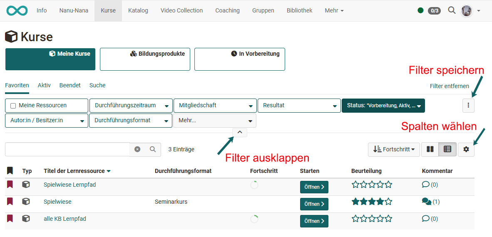
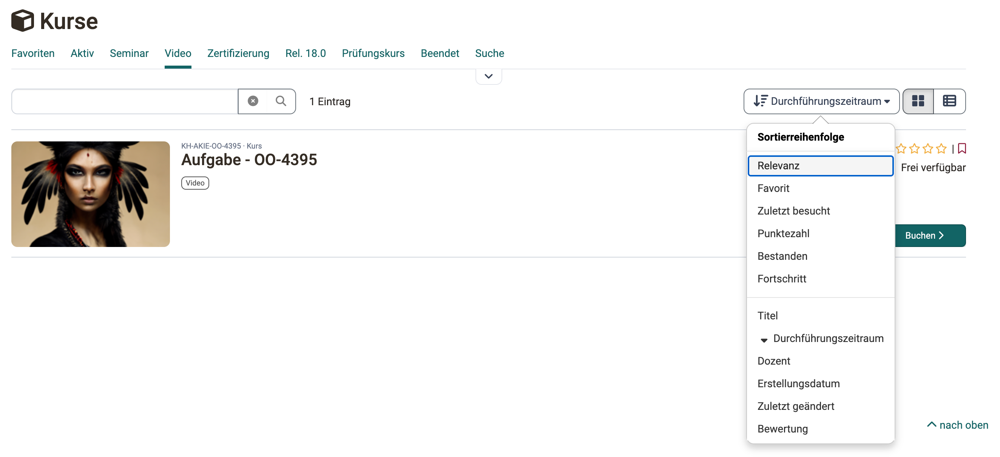
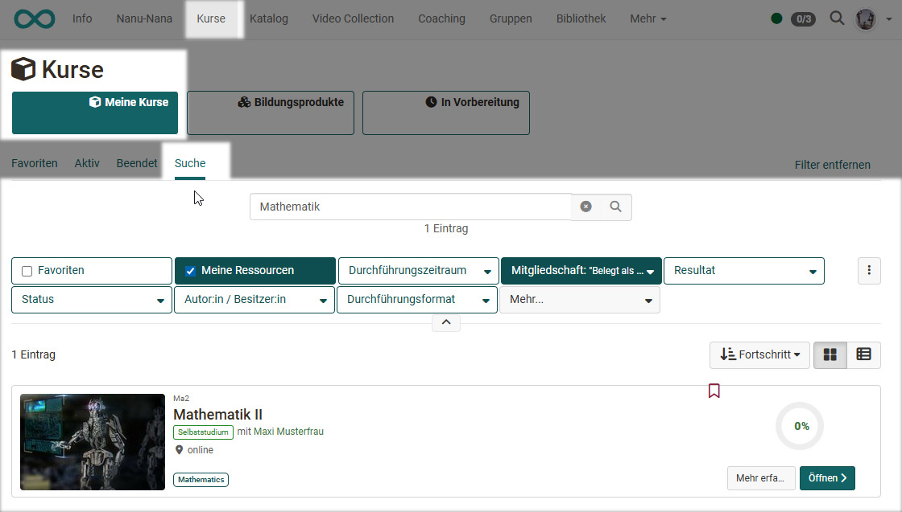
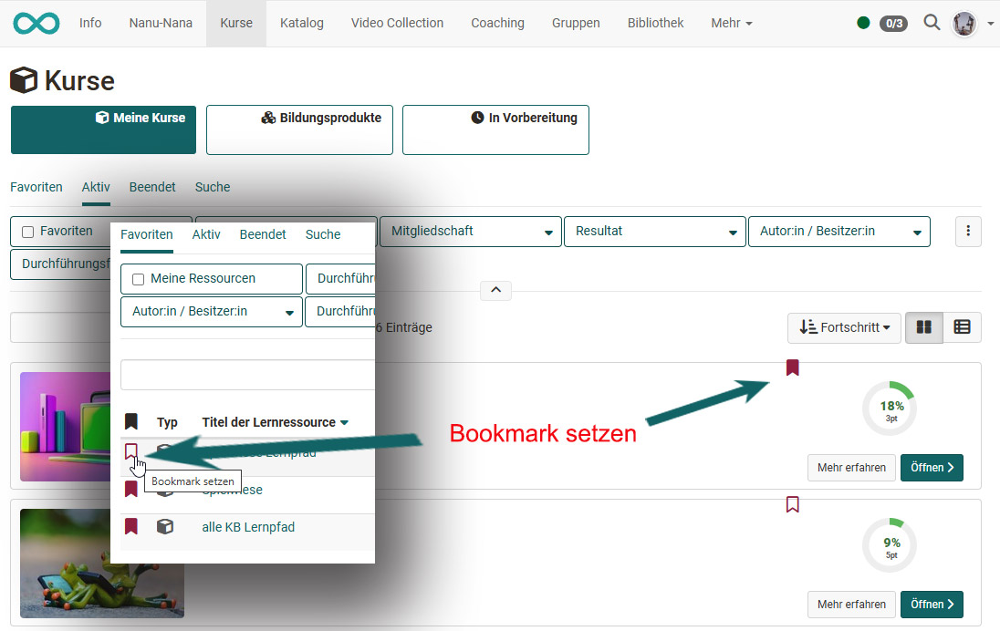
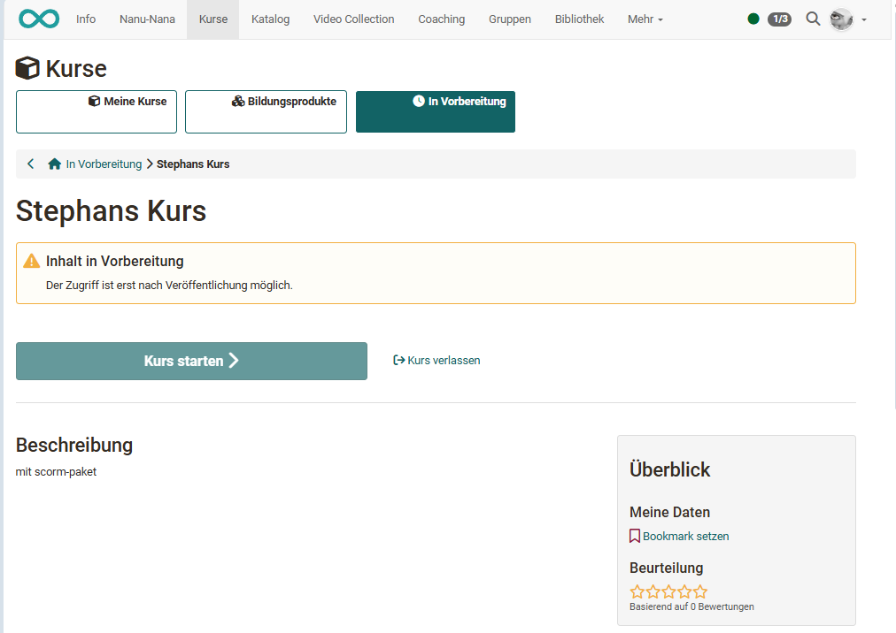

# Kurse finden {: #courses}

:octicons-device-camera-video-24: **Video-Einführung**: [Wo finde ich meine Kurse?](<https://www.youtube.com/embed/2sN32vLD9UY>){:target="_blank"}

Der Menüpunkt "Kurse" bietet Ihnen den Zugang zu den für Sie zugänglichen Kursen und eventuell weiteren Lernressourcen. Klicken Sie in der Hauptnavigation oben auf den Punkt "Kurse".

## Meine Kurse

Unter "Meine Kurse" können Sie sich standardmässig alle Kurse und Lernressourcen anzeigen lassen die aktiv oder beendet sind. Sie können auch Favoriten markieren und sich nur die Favoriten anzeigen lassen. Oder Sie nutzen die Suche um einen Kurs bzw. eine Lernressource basierend auf einem Stichwort zu finden.

Lernressourcen, bei denen Sie Betreuer:in oder Besitzer:in sind, finden Sie im Bereich "Coaching". Unter "Meine Kurse" finden Sie Lernressourcen, bei denen Sie selbst als Teilnehmer:in eingetragen sind. [:octicons-tag-16:{ title="ab Release 21.0 (OO-9576)" }](https://track.frentix.com/issue/OO-9576)

!!! info "Wichtig"
    Sollte Ihnen beide Rollen zugewiesen sein, wird die Lernressource in beiden "Reitern" angezeigt.

Ihre Kurse können Sie auch anhand verschiedener Kriterien filtern, dazu gehören der Durchführungszeitraum, das Durchführungsformat, der Mitgliedsstatus, die Kursrolle und der Bewertungsstatus (Resultat). Klicken Sie auf den kleinen Pfeil um die weiteren Filteroptionen einzublenden.

{ class="shadow lightbox" }

Filter lassen sich auch kombinieren und speichern.

### Filtern nach Durchführungszeitraum [:octicons-tag-16:{ title="ab Release 20.3 (OO-9218)" }](https://track.frentix.com/issue/OO-9218)

Die verfügbaren Durchführungszeiträume stellt die Systemadministration über das Modul "Zeitabschnitte" bereit. Den Durchführungszeitraum können Sie auch als Sortierkriterium wählen. Klicken Sie dazu auf den Button rechts oben über der Liste. Der Button trägt immer das aktive Kriterium als Beschriftung, das Pfeilsymbol zeigt die Richtung.

{ class="shadow lightbox" }

!!! info "Wichtig"
    Die Sortierung nach Durchführungszeitraum erfolgt chronologisch nach dem **Zeitrahmen** und nicht alphabetisch nach der Bezeichnung: zuerst nach dem Beginndatum, ohne Beginndatum nach dem Enddatum. Innerhalb desselben Zeitraums wird alphabetisch sortiert. Kurse ohne Durchführungszeitraum erscheinen immer am Ende der Liste.

!!! note "Modul Zeitabschnitte"
    Wie Administrator:innen die Zeitabschnitte verwalten. 
    [Modul Zeitabschnitte >](../../manual_admin/administration/Modules_Time_Period.de.md)

!!! note "Filteroptionen"
    Mehr dazu, wie Sie Ihre Ansicht optimal filtern können. 
    [Filteroptionen und Tabellenkonzept](../basic_concepts/Table_Concept.de.md)

Für die Ansicht der Kurse haben Sie zwei Möglichkeiten. Sie können sich die gewünschten Kurse in der Tabellenansicht wie im Screenshot oben oder in der Listensicht anzeigen lassen und auch die gewünschten Anzeigespalten auswählen.

### Suchen

Über die Suche sind alle Lernressourcen auffindbar, auf die Sie Zugriff haben. Geben Sie ein Stichwort oder den Kurstitel ein und lassen Sie sich die passenden Kurse oder Lernressourcen anzeigen. Klappen Sie die Filteroption auf um die Suche anhand der Filter weiter einzugrenzen.

{ class="shadow lightbox" }

Wenn Sie einen Kurs nicht finden, prüfen Sie, ob möglicherweise noch ein unerwünschter Filter aktiv ist (z. B. „nur nicht bestandene Kurse anzeigen“). Entfernen Sie in diesem Fall den entsprechenden Filter.

Sobald Sie den Kurs gefunden haben, können Sie ihn auch als Favorit markieren. Klicken Sie dazu auf die weisse Flagge, die sich anschliessend rot färbt. Beim nächsten Login finden Sie den Kurs direkt in Ihren Favoriten.

{ class="shadow lightbox" }

## Bildungsprodukte

Der Bereich "Bildungsprodukte" wird angezeigt, wenn der [Course Planner](../area_modules/Course_Planner.de.md) in der System-Administration aktiviert ist: `Administration > Module > Course Planner`.

Unter Bildungsprodukte werden dann den Benutzer:innen die Kurse und Lernressourcen angezeigt, die zu ihren Bildungsgängen (Durchführungen) gehören. Hat sich eine Benutzer:in z.B. in einen Bildungsgang eingeschrieben, der mit dem Course Planner organisiert wird, erscheinen hier alle Kurse, die diesem Bildungsgang zugeordnet sind. Ist die Benutzer:in in mehreren Durchführungen eingeschrieben, sieht sie unter Bildungsprodukte alle zugehörigen Kurse.

Ferner können hier auch nur die Favoriten, die aktiven oder die beendeten Kurse der Durchführungen angezeigt werden, oder es kann gezielt nach Kursen gesucht werden. Unter Bildungsprodukte gelangen Lernende also schnell und fokussiert zu den für ihren Bildungsgang/ihr Modul/ihre Durchführung relevanten Kursen und Lernressourcen.

## In Vorbereitung

Hier erscheinen die Lernressourcen die den Status "In Vorbereitung" haben und somit noch nicht für Teilnehmende zugänglich sind. Sind Teilnehmende schon als Mitglied der Lernressource eingetragen, erscheint für sie eine entsprechende Information.

{ class="shadow lightbox" }

Für Betreuer:innen und Kursbesitzer:innen ist der Kurs auch im Status "Vorbereitung" zugänglich.

---

## Weiterführende Informationen {: #further_information}

[Modul Zeitabschnitte >](../../manual_admin/administration/Modules_Time_Period.de.md) 
[Mit Tabellen arbeiten >](../basic_concepts/Table_Concept.de.md) 
[Course Planner >](../area_modules/Course_Planner.de.md)

**youtube** 
[Wo finde ich meine Kurse?](<https://www.youtube.com/embed/2sN32vLD9UY>)

[Zum Seitenanfang ^](#courses)
